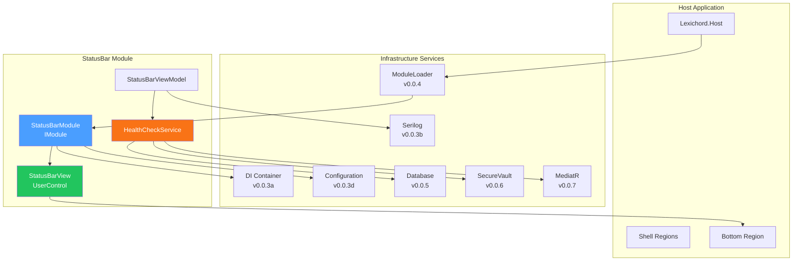

# Lexichord Architecture Overview

## Proven Systems (v0.0.8 Golden Skeleton)

The following architectural components have been proven through end-to-end testing:

---

## Module System (v0.0.4)

- Modules are discovered from `./Modules/*.dll`
- Modules implement `IModule` interface
- Modules register services via `RegisterServices(IServiceCollection)`
- Modules initialize via `InitializeAsync(IServiceProvider)`
- License restrictions enforced via `[RequiresLicense]` attribute

---

## Shell Regions (v0.0.5)

- Host defines regions: Top, Left, Center, Right, Bottom
- Modules contribute views via `IShellRegionView`
- Views are ordered by `Order` property within regions
- ViewContent is lazily created from DI

---

## Database (v0.0.6)

- SQLite with `IDbConnectionFactory` for connection management
- Repository pattern for data access
- Migrations run during module initialization
- Shared database across all modules

---

## Secure Vault (v0.0.7)

- Platform-native secure storage via `ISecureVault`
- Windows: DPAPI / Credential Manager
- macOS: Keychain
- Linux: libsecret
- Secrets never exposed in logs

---

## Event Bus (v0.0.7)

- MediatR for in-process messaging
- `INotification` for events, `IRequest<T>` for queries
- Loose coupling between components
- Async handlers supported

---

## DI Container (v0.0.3)

- Microsoft.Extensions.DependencyInjection
- Singleton, Transient, Scoped lifetimes
- Constructor injection preferred
- Service locator deprecated

---

## Configuration (v0.0.3)

- Multi-source: JSON → Environment → CLI
- Options pattern: `IOptions<T>`
- Environment-specific files: `appsettings.{Env}.json`

---

## Logging (v0.0.3)

- Serilog structured logging
- Console + File sinks
- Rolling log files with retention
- `ILogger<T>` injection

---

## Architecture Diagram

---

## Reference Implementation

See `Lexichord.Modules.StatusBar` for the canonical module implementation demonstrating all patterns.
