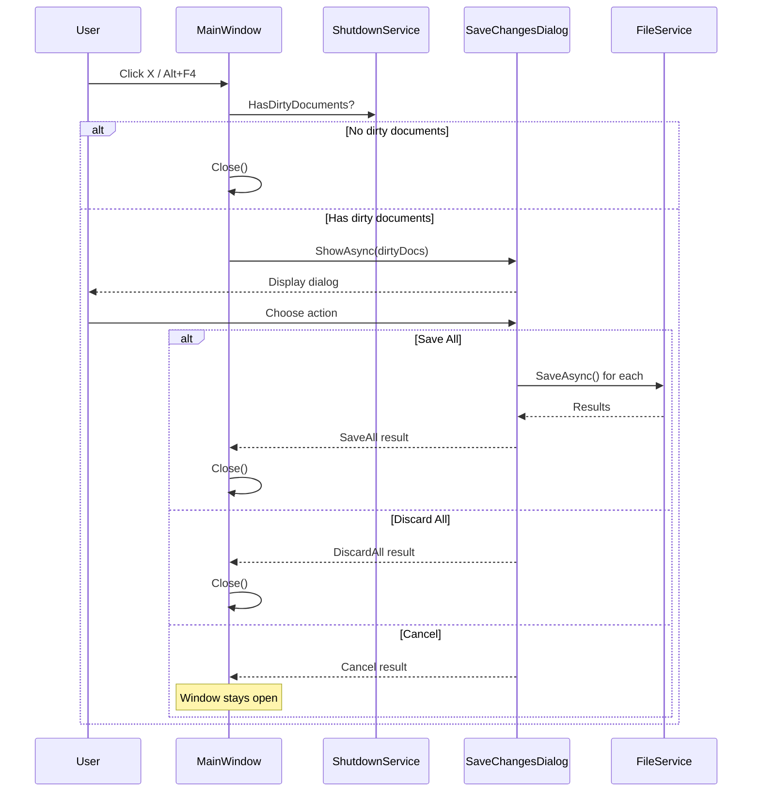

# LCS-CL-014c: Safe Close Workflow

**Version**: v0.1.4c  
**Released**: 2026-01-29  
**Status**: ✅ Complete

---

## Overview

Implements the Safe Close Workflow that intercepts window close events to prompt users to save unsaved changes before exiting. Prevents accidental data loss by ensuring dirty documents are either saved or explicitly discarded.

---

## Changes

### New Files

| File                                                 | Purpose                                                          |
| :--------------------------------------------------- | :--------------------------------------------------------------- |
| `Abstractions/Contracts/IShutdownService.cs`         | Interface for shutdown coordination with dirty document tracking |
| `Host/Services/ShutdownService.cs`                   | Implementation managing document registry and shutdown events    |
| `Host/ViewModels/SaveChangesDialogResult.cs`         | Dialog result types: action enum, save failure records           |
| `Host/ViewModels/SaveChangesDialogViewModel.cs`      | ViewModel for save confirmation dialog with batch save support   |
| `Host/Views/SaveChangesDialog.axaml(.cs)`            | Modal dialog UI showing dirty documents and action buttons       |
| `Tests.Unit/Host/ShutdownServiceTests.cs`            | 11 unit tests for shutdown service                               |
| `Tests.Unit/Host/SaveChangesDialogViewModelTests.cs` | 8 unit tests for dialog ViewModel                                |

### Modified Files

| File                             | Changes                                                   |
| :------------------------------- | :-------------------------------------------------------- |
| `Host/HostServices.cs`           | Registers `IShutdownService` as singleton                 |
| `Host/App.axaml.cs`              | Wires `ShutdownService` and `FileService` to `MainWindow` |
| `Host/Views/MainWindow.axaml.cs` | Integrates shutdown check in `OnWindowClosing`            |

---

## Technical Details

### Shutdown Flow



### Service Interface

```csharp
public interface IShutdownService
{
    Task<bool> RequestShutdownAsync();
    void RegisterDocument(DocumentViewModelBase document);
    void UnregisterDocument(DocumentViewModelBase document);
    IReadOnlyList<DocumentViewModelBase> GetDirtyDocuments();
    bool HasDirtyDocuments { get; }
    bool IsShuttingDown { get; }
    event EventHandler<ShutdownRequestedEventArgs>? ShutdownRequested;
    event EventHandler<ShutdownProceedingEventArgs>? ShutdownProceeding;
}
```

### Dialog Actions

| Action          | Result                                                  |
| :-------------- | :------------------------------------------------------ |
| **Save All**    | Saves each dirty document via IFileService, then closes |
| **Discard All** | Closes immediately without saving                       |
| **Cancel**      | Aborts close, returns to editing                        |

### Thread Safety

- Document list protected by lock
- Shutdown flag prevents re-entrant calls
- All operations safe from UI thread

---

## Test Coverage

| Test                                                    | Description                          |
| :------------------------------------------------------ | :----------------------------------- |
| `HasDirtyDocuments_NoDocuments_ReturnsFalse`            | Empty registry returns false         |
| `HasDirtyDocuments_WithCleanDocument_ReturnsFalse`      | Clean documents don't trigger dialog |
| `HasDirtyDocuments_WithDirtyDocument_ReturnsTrue`       | Dirty state detection                |
| `RegisterDocument_AddsToList`                           | Document registration works          |
| `RegisterDocument_SameDocumentTwice_OnlyOnce`           | Duplicate prevention                 |
| `UnregisterDocument_RemovesFromList`                    | Cleanup on document close            |
| `GetDirtyDocuments_ReturnsOnlyDirty`                    | Correct filtering                    |
| `RequestShutdownAsync_NoDirty_ReturnsTrue`              | Clean state allows immediate close   |
| `ShutdownRequested_EventRaised`                         | Event notification                   |
| `RequestShutdownAsync_EventHandlerCancels_ReturnsFalse` | Cancellation support                 |
| `ShowAsync_SetsDirtyDocuments`                          | Dialog initialization                |
| `DiscardAllCommand_ReturnsDiscardResult`                | Discard action handling              |
| `CancelCommand_ReturnsCancelResult`                     | Cancel action handling               |

---

## Dependencies

- v0.1.4a: Dirty State Tracking — `IsDirty` property on `DocumentViewModelBase`
- v0.1.4b: Atomic Saves — `IFileService` for save operations
- v0.1.1d: Tab Infrastructure — `DocumentViewModelBase` base class
