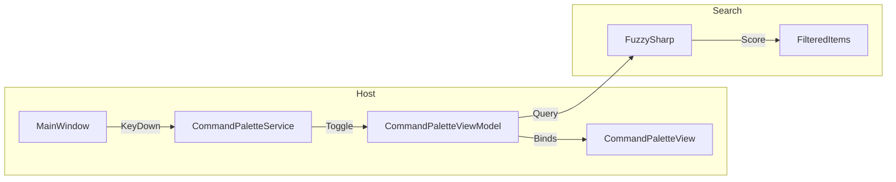

# LCS-CL-015b: Command Palette UI

**Version**: v0.1.5b  
**Released**: 2026-01-29  
**Status**: ✅ Complete

---

## Overview

Implements the Command Palette modal overlay, providing a keyboard-centric interface for discovering and executing commands. Features fuzzy search via FuzzySharp, keyboard navigation, and mode switching between Commands and Files.

---

## Changes

### New Files

| File                                                        | Purpose                                   |
| :---------------------------------------------------------- | :---------------------------------------- |
| `Abstractions/Contracts/Commands/PaletteMode.cs`            | Enum defining palette modes               |
| `Abstractions/Contracts/Commands/MatchPosition.cs`          | Record for highlight positions            |
| `Abstractions/Contracts/Commands/ICommandPaletteService.cs` | Interface for palette visibility control  |
| `Abstractions/Events/PaletteVisibilityChangedEventArgs.cs`  | Event args for visibility changes         |
| `Abstractions/Events/PaletteEvents.cs`                      | MediatR notifications for palette actions |
| `Host/ViewModels/CommandPalette/CommandPaletteViewModel.cs` | Main ViewModel with FuzzySharp search     |
| `Host/ViewModels/CommandPalette/CommandSearchResult.cs`     | Wrapper record for command results        |
| `Host/ViewModels/CommandPalette/FileSearchResult.cs`        | Stub record for file results (v0.1.5c)    |
| `Host/Views/CommandPaletteView.axaml`                       | Modal overlay XAML                        |
| `Host/Views/CommandPaletteView.axaml.cs`                    | Keyboard handling code-behind             |
| `Host/Services/CommandPaletteService.cs`                    | Service bridging interface to ViewModel   |
| `Tests.Unit/Host/CommandPaletteViewModelTests.cs`           | 22 comprehensive unit tests               |

### Modified Files

| File                                     | Changes                                         |
| :--------------------------------------- | :---------------------------------------------- |
| `Host/HostServices.cs`                   | Registers `CommandPaletteViewModel` and service |
| `Host/Views/MainWindow.axaml`            | Added Panel wrapper and overlay integration     |
| `Host/Views/MainWindow.axaml.cs`         | Added keyboard handler (Ctrl+Shift+P, Ctrl+P)   |
| `Host/ViewModels/MainWindowViewModel.cs` | Exposed `CommandPaletteViewModel` property      |
| `Host/App.axaml.cs`                      | Wires `ICommandPaletteService` to MainWindow    |

---

## Technical Details

### Command Palette Architecture



### FuzzySharp Integration

- **Search Algorithm**: `Fuzz.PartialRatio` against title, category, and tags
- **Score Threshold**: Minimum 40 for display
- **Max Results**: Capped at 50 items
- **Sorting**: Descending by score, then alphabetically

### Keyboard Navigation

| Shortcut     | Action                  |
| :----------- | :---------------------- |
| Ctrl+Shift+P | Open in Commands mode   |
| Ctrl+P       | Open in Files mode      |
| ↑ / ↓        | Navigate results        |
| PageUp/Down  | Jump 10 items           |
| Home/End     | Jump to first/last      |
| Enter        | Execute selected        |
| Escape       | Close palette           |
| `>` prefix   | Switch to Commands mode |

### Modal Overlay Pattern

```xaml
<Panel>
    <Grid><!-- Main content --></Grid>
    <views:CommandPaletteView DataContext="{Binding CommandPalette}"/>
</Panel>
```

---

## Test Coverage

| Test Class                     | Tests | Coverage                                  |
| :----------------------------- | ----: | :---------------------------------------- |
| `CommandPaletteViewModelTests` |    22 | Visibility, search, navigation, execution |

---

## Dependencies

| Dependency   | Purpose               |
| :----------- | :-------------------- |
| `FuzzySharp` | Fuzzy string matching |
| `MediatR`    | Event notifications   |

---

## Related Documents

| Document                                               | Relationship     |
| :----------------------------------------------------- | :--------------- |
| [LCS-DES-015b](../specs/v0.1.x/v0.1.5/LCS-DES-015b.md) | Specification    |
| [LCS-CL-015a](./LCS-CL-015a.md)                        | Command Registry |
