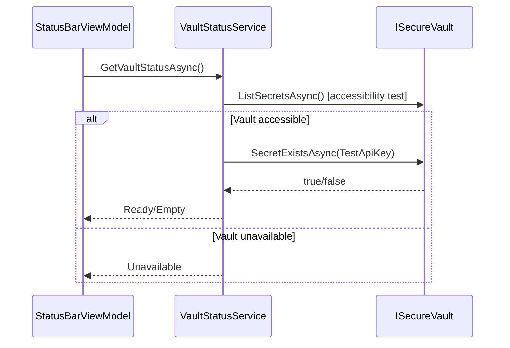

# Changelog - v0.0.8c: Secure Vault Check

> Implementation Date: 2025-01-XX
> Codename: "The Hello World (Golden Skeleton)" - Sub-part c

## Overview

This sub-part integrates the `ISecureVault` infrastructure into the StatusBar module, enabling verification of API key presence and providing a mechanism for users to store a test API key.

---

## New Features

### Secure Vault Integration

- **API Key Presence Detection**: StatusBar now verifies if a test API key exists in the secure vault
- **Dynamic Status Display**: Vault status indicator shows "Ready", "No Key", "Error", or "N/A" based on vault state
- **Platform Support Detection**: Gracefully handles platforms without secure storage support

### API Key Dialog

- **Key Entry**: Users can enter an API key through the existing dialog
- **Secure Storage**: Keys are stored using `VaultKeys.TestApiKey` constant
- **Validation**: Empty/whitespace key validation with error feedback

---

## Files Added

| File                                                                         | Purpose                                           |
| ---------------------------------------------------------------------------- | ------------------------------------------------- |
| `src/Lexichord.Abstractions/Constants/VaultKeys.cs`                          | Vault key constants (`KeyPrefix`, `TestApiKey`)   |
| `src/Lexichord.Abstractions/Events/VaultStatusChangedEvent.cs`               | MediatR notification with `VaultStatusLevel` enum |
| `tests/Lexichord.Tests.Unit/Modules/StatusBar/VaultStatusServiceTests.cs`    | 12 unit tests for vault service                   |
| `tests/Lexichord.Tests.Unit/Modules/StatusBar/ApiKeyDialogViewModelTests.cs` | 10 unit tests for dialog ViewModel                |

---

## Files Modified

| File                                                                  | Changes                                                                                         |
| --------------------------------------------------------------------- | ----------------------------------------------------------------------------------------------- |
| `src/Lexichord.Modules.StatusBar/Services/IVaultStatusService.cs`     | Added `CheckApiKeyPresenceAsync`, `StoreApiKeyAsync`, `DeleteApiKeyAsync`, `Unavailable` status |
| `src/Lexichord.Modules.StatusBar/Services/VaultStatusService.cs`      | Full implementation with `ISecureVault` integration                                             |
| `src/Lexichord.Modules.StatusBar/ViewModels/StatusBarViewModel.cs`    | Added `VaultStatus.Unavailable` case handling                                                   |
| `src/Lexichord.Modules.StatusBar/ViewModels/ApiKeyDialogViewModel.cs` | Use `VaultKeys.TestApiKey` and `StoreApiKeyAsync`                                               |

---

## Architecture



---

## Verification Commands

```bash
# Build and run tests
dotnet build --no-incremental
dotnet test --filter "FullyQualifiedName~VaultStatusService"
dotnet test --filter "FullyQualifiedName~ApiKeyDialogViewModel"

# Run application and verify status bar
dotnet run --project src/Lexichord.Host
```

---

## Test Summary

| Test Class                   | Tests  | Status  |
| ---------------------------- | ------ | ------- |
| `VaultStatusServiceTests`    | 12     | ✅ Pass |
| `ApiKeyDialogViewModelTests` | 10     | ✅ Pass |
| **Total**                    | **22** | ✅      |

### Key Test Scenarios

- Vault status returns Ready when key exists
- Vault status returns Empty when no key
- Vault status returns Error on exceptions
- Vault status returns Unavailable on PlatformNotSupportedException
- API key storage success/failure handling
- Dialog validation and cancel behavior

---

## Security Notes

> [!IMPORTANT]
> API key values are **NEVER** logged. Only key names appear in log output.

- Keys are stored using platform-native secure storage
- `PlatformNotSupportedException` gracefully handled with "N/A" status
- Vault accessibility tested before key operations

---

## Related Documents

- [LCS-DES-008c.md](../specs/v0.0.x/v0.0.8/LCS-DES-008c.md) - Design Specification
- [LCS-SBD-008.md](../specs/v0.0.x/v0.0.8/LCS-SBD-008.md) - Scope Breakdown
- [LCS-CL-008b.md](./LCS-CL-008b.md) - Previous sub-part changelog
