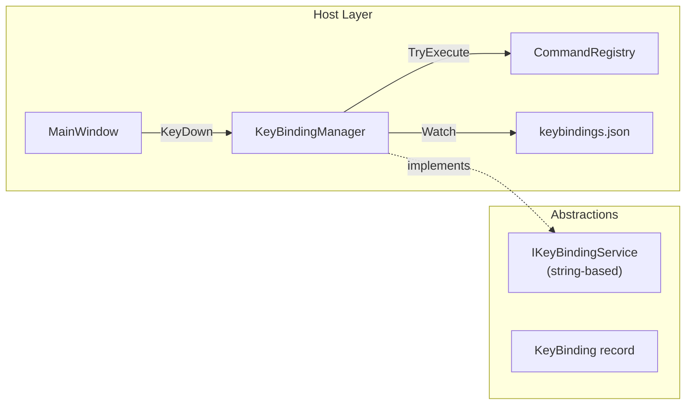

# LCS-CL-015d: Keybinding Service

**Version**: v0.1.5d  
**Released**: 2026-01-29  
**Status**: ✅ Complete

---

## Overview

Implements the Keybinding Service, providing user-customizable keyboard shortcuts that integrate with the Command Registry and key event routing. Features include JSON-based configuration persistence, conflict detection, context-aware filtering, and file watching for hot-reload.

---

## Changes

### New Files

| File                                        | Purpose                          |
| :------------------------------------------ | :------------------------------- |
| `Abstractions/Contracts/KeyBinding.cs`      | Platform-agnostic binding record |
| `Abstractions/Events/KeybindingsEvents.cs`  | MediatR events for reload/change |
| `Host/Configuration/KeybindingsFile.cs`     | JSON file schema records         |
| `Host/Services/KeyBindingManager.cs`        | Full implementation (~700 lines) |
| `Tests.Unit/Host/KeyBindingManagerTests.cs` | 43 comprehensive unit tests      |

### Modified Files

| File                                           | Changes                                        |
| :--------------------------------------------- | :--------------------------------------------- |
| `Abstractions/Contracts/IKeyBindingService.cs` | String-based interface (Avalonia-free)         |
| `Host/HostServices.cs`                         | Registers singleton `IKeyBindingService`       |
| `Host/Views/MainWindow.axaml.cs`               | Calls `TryHandleKeyEvent` for global shortcuts |

---

## Technical Details

### Architecture



### String-Based Interface Pattern

To avoid Avalonia dependency in Abstractions, the public interface uses strings for gestures:

```csharp
public interface IKeyBindingService
{
    string? GetBinding(string commandId);
    void SetBinding(string commandId, string? gesture, string? when = null);
    IReadOnlyList<string> GetConflicts(string gesture, string? context = null);
}
```

Avalonia's `KeyGesture` is used internally within `KeyBindingManager` for parsing and matching.

### Keybindings File Format

```json
{
    "bindings": [
        { "command": "file.save", "key": "Ctrl+Shift+S" },
        { "command": "edit.undo", "key": "-" } // '-' disables binding
    ]
}
```

### Flow: Key Event Handling

1. `MainWindow.OnMainWindowKeyDown` captures all key events
2. Calls `KeyBindingManager.TryHandleKeyEvent(KeyEventArgs)`
3. Manager builds `KeyGesture` from event and looks up in reverse map
4. If found and context matches, executes command via `ICommandRegistry.TryExecute`
5. Sets `e.Handled = true` to prevent further propagation

### Conflict Detection

```csharp
public IReadOnlyList<string> GetConflicts(string gesture, string? context = null)
{
    var parsed = ParseKeyGesture(gesture);
    if (parsed == null) return [];

    var normalized = FormatKeyGesture(parsed);
    return _bindings.Values
        .Where(b => b.Gesture == normalized && !b.IsDisabled)
        .Where(b => ContextMatches(b.When, context))
        .Select(b => b.CommandId)
        .ToList();
}
```

---

## Test Coverage

| Test Class               | Tests | Coverage Areas                                          |
| :----------------------- | ----: | :------------------------------------------------------ |
| `KeyBindingManagerTests` |    43 | Loading, CRUD, conflicts, gestures, events, persistence |

### Key Test Scenarios

- Load defaults from `CommandRegistry`
- Override with user `keybindings.json`
- Disable binding with "-" key
- Raise `BindingChanged` event on modification
- Context-aware conflict detection
- `ParseKeyGesture` / `FormatKeyGesture` roundtrip
- `TryHandleKeyEvent` command execution

---

## Dependencies

| Dependency | Purpose                     |
| :--------- | :-------------------------- |
| `MediatR`  | Event notifications         |
| `Avalonia` | `KeyGesture` parsing (Host) |

---

## Related Documents

| Document                                               | Relationship     |
| :----------------------------------------------------- | :--------------- |
| [LCS-DES-015d](../specs/v0.1.x/v0.1.5/LCS-DES-015d.md) | Specification    |
| [LCS-CL-015a](./LCS-CL-015a.md)                        | Command Registry |
| [LCS-CL-015b](./LCS-CL-015b.md)                        | Palette UI       |
| [LCS-CL-015c](./v0.1.x/LCS-CL-015c.md)                 | File Indexing    |
