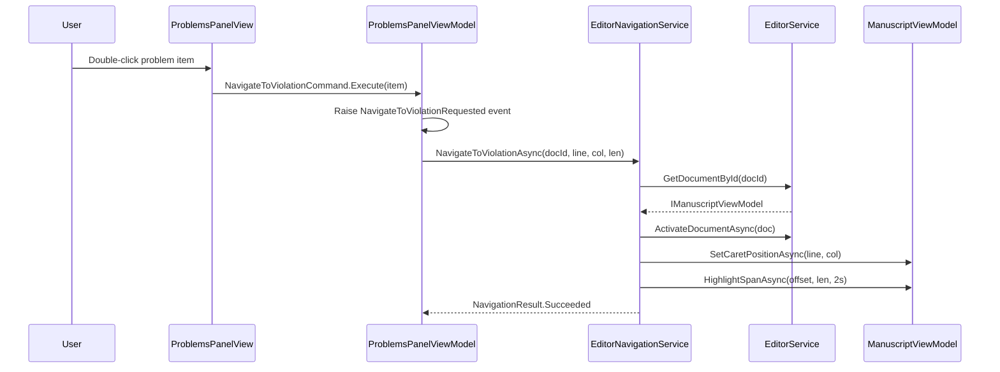

# LCS-CL-026b: Navigation Sync (Double-Click to Line)

**Version**: v0.2.6b  
**Date**: 2026-01-30  
**Status**: ✅ Implemented  
**Parent Specification**: [LCS-DES-026b](../specs/v0.2.x/v0.2.6/LCS-DES-026b.md)

---

## Summary

Implements double-click navigation from the Problems Panel to specific violation locations in the editor. When a user double-clicks a problem item, the editor scrolls to the violation line, positions the caret at the exact column, and applies a temporary highlight animation.

---

## Changes by Layer

### Abstractions Layer (Lexichord.Abstractions)

| File                          | Change Type | Description                                                                                      |
| ----------------------------- | ----------- | ------------------------------------------------------------------------------------------------ |
| `IEditorNavigationService.cs` | NEW         | Navigation service interface with `NavigateToViolationAsync` and `NavigateToOffsetAsync` methods |
| `NavigationResult.cs`         | NEW         | Result record with `Succeeded`/`Failed` factory methods                                          |
| `HighlightRequest.cs`         | NEW         | Request record for temporary highlight animations                                                |
| `IEditorService.cs`           | MODIFIED    | Added `GetDocumentById(string)` and `ActivateDocumentAsync(IManuscriptViewModel)` methods        |
| `IManuscriptViewModel.cs`     | MODIFIED    | Added `SetCaretPositionAsync(int, int)` and `HighlightSpanAsync(int, int, TimeSpan)` methods     |
| `IProblemsPanelViewModel.cs`  | MODIFIED    | Added `NavigateToViolationRequested` event                                                       |

### Implementation Layer (Lexichord.Modules.Editor)

| File                         | Change Type | Description                                                                                  |
| ---------------------------- | ----------- | -------------------------------------------------------------------------------------------- |
| `EditorNavigationService.cs` | NEW         | Orchestrates navigation flow: document lookup → activation → caret positioning → highlight   |
| `EditorService.cs`           | MODIFIED    | Implemented `GetDocumentById` and `ActivateDocumentAsync` methods                            |
| `ManuscriptViewModel.cs`     | MODIFIED    | Implemented `SetCaretPositionAsync`, `HighlightSpanAsync`, added `PendingHighlight` property |
| `EditorModule.cs`            | MODIFIED    | Registered `IEditorNavigationService` in DI container                                        |

### Style Module Integration (Lexichord.Modules.Style)

| File                         | Change Type | Description                                                                    |
| ---------------------------- | ----------- | ------------------------------------------------------------------------------ |
| `ProblemsPanelViewModel.cs`  | MODIFIED    | Added `NavigateToViolationCommand` with `IEditorNavigationService` integration |
| `ProblemsPanelView.axaml`    | MODIFIED    | Added `DoubleTapped` event binding on problem item template                    |
| `ProblemsPanelView.axaml.cs` | MODIFIED    | Added `OnProblemItemDoubleTapped` event handler                                |

### Unit Tests (Lexichord.Tests.Unit)

| File                              | Change Type | Description                                                        |
| --------------------------------- | ----------- | ------------------------------------------------------------------ |
| `EditorNavigationServiceTests.cs` | NEW         | 18 tests covering navigation scenarios, validation, and edge cases |
| `ProblemsPanelViewModelTests.cs`  | MODIFIED    | Added 4 tests for navigation command and constructor validation    |

---

## New Types

### `IEditorNavigationService`

```csharp
public interface IEditorNavigationService
{
    Task<NavigationResult> NavigateToViolationAsync(
        string documentId, int line, int column, int length,
        CancellationToken cancellationToken = default);

    Task<NavigationResult> NavigateToOffsetAsync(
        string documentId, int startOffset, int length,
        CancellationToken cancellationToken = default);
}
```

### `NavigationResult`

```csharp
public record NavigationResult(
    bool Success,
    string? ErrorMessage = null,
    string? DocumentId = null)
{
    public static NavigationResult Succeeded(string documentId);
    public static NavigationResult Failed(string errorMessage);
}
```

### `HighlightRequest`

```csharp
public record HighlightRequest(
    int StartOffset,
    int Length,
    TimeSpan Duration);
```

---

## Navigation Flow



---

## Test Results

```
Passed! - Failed: 0, Passed: 2035, Skipped: 28, Total: 2063 - Lexichord.Tests.Unit.dll
Passed! - Failed: 0, Passed: 52, Skipped: 25, Total: 77 - Lexichord.Tests.Integration.dll
```

**New tests added**: 22 (18 EditorNavigationService + 4 ProblemsPanelViewModel)

---

## Dependencies Introduced

| Consumer                  | Provider                                            | Via                   |
| ------------------------- | --------------------------------------------------- | --------------------- |
| `ProblemsPanelViewModel`  | `IEditorNavigationService`                          | Constructor injection |
| `EditorNavigationService` | `IEditorService`                                    | Constructor injection |
| `ProblemsPanelView`       | `ProblemsPanelViewModel.NavigateToViolationCommand` | XAML event binding    |

---

## Usage Example

```csharp
// Double-click navigation is automatic via XAML binding
// For programmatic navigation:
var result = await _navigationService.NavigateToViolationAsync(
    documentId: "path/to/file.md",
    line: 42,
    column: 15,
    length: 8);

if (result.Success)
{
    _logger.LogInformation("Navigated to {DocumentId}", result.DocumentId);
}
else
{
    _logger.LogWarning("Navigation failed: {Error}", result.ErrorMessage);
}
```
