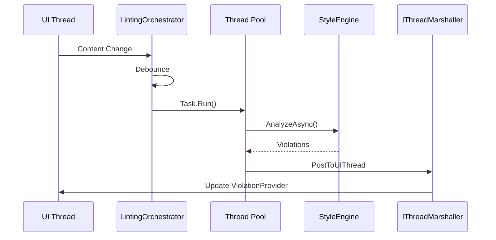

# Changelog: v0.2.7a Async Offloading

**Version:** 0.2.7a  
**Codename:** The Turbo (Part 1)  
**Date:** 2026-01-30  
**Design Spec:** [LCS-DES-027a](../specs/v0.2.x/v0.2.7/LCS-DES-027a.md)

---

## Overview

Implements asynchronous offloading for the linting system to ensure UI thread responsiveness during CPU-intensive regex scanning operations. Introduces `IThreadMarshaller` for abstracting UI thread dispatching, enabling testable code that doesn't depend on the Avalonia framework.

---

## Changes

### Abstraction Layer

#### New Files

| File                                                                                                                                      | Description                                     |
| :---------------------------------------------------------------------------------------------------------------------------------------- | :---------------------------------------------- |
| [IThreadMarshaller.cs](file:///Users/ryan/Documents/GitHub/lexichord/src/Lexichord.Abstractions/Contracts/Threading/IThreadMarshaller.cs) | Interface for UI/background thread coordination |

#### New Types

- `IThreadMarshaller` - Abstracts thread marshalling operations for cross-thread communication
    - `InvokeOnUIThreadAsync(Action)` - Invoke action and await completion
    - `InvokeOnUIThreadAsync<T>(Func<T>)` - Invoke function and return result
    - `PostToUIThread(Action)` - Fire-and-forget UI update
    - `IsOnUIThread` - Check current thread context
    - `AssertUIThread(string)` - DEBUG assertion for UI thread
    - `AssertBackgroundThread(string)` - DEBUG assertion for background thread

---

### Implementation Layer

#### New Files

| File                                                                                                                                           | Description                                                  |
| :--------------------------------------------------------------------------------------------------------------------------------------------- | :----------------------------------------------------------- |
| [AvaloniaThreadMarshaller.cs](file:///Users/ryan/Documents/GitHub/lexichord/src/Lexichord.Modules.Style/Threading/AvaloniaThreadMarshaller.cs) | Avalonia-specific implementation using `Dispatcher.UIThread` |

#### Key Features

- **Direct Execution**: When already on UI thread, actions execute immediately without dispatch
- **Async Marshalling**: Uses `Dispatcher.UIThread.InvokeAsync` for cross-thread invocation
- **Fire-and-Forget**: `PostToUIThread` uses `DispatcherPriority.Background` for non-blocking updates
- **DEBUG Assertions**: Thread assertions wrapped in `#if DEBUG` for production optimization

#### Modified Files

| File                                                                                                                                        | Change                                                        |
| :------------------------------------------------------------------------------------------------------------------------------------------ | :------------------------------------------------------------ |
| [LintingOrchestrator.cs](file:///Users/ryan/Documents/GitHub/lexichord/src/Lexichord.Modules.Style/Services/Linting/LintingOrchestrator.cs) | Added `Task.Run` offloading and `IThreadMarshaller` injection |
| [StyleModule.cs](file:///Users/ryan/Documents/GitHub/lexichord/src/Lexichord.Modules.Style/StyleModule.cs)                                  | Registered `AvaloniaThreadMarshaller` as singleton            |

---

### Integration Layer

#### Modified Files

| File                                                                                                       | Change                                                         |
| :--------------------------------------------------------------------------------------------------------- | :------------------------------------------------------------- |
| [StyleModule.cs](file:///Users/ryan/Documents/GitHub/lexichord/src/Lexichord.Modules.Style/StyleModule.cs) | Added `IThreadMarshaller` → `AvaloniaThreadMarshaller` binding |
| [StyleModule.cs](file:///Users/ryan/Documents/GitHub/lexichord/src/Lexichord.Modules.Style/StyleModule.cs) | Updated module version from 0.2.6 to 0.2.7                     |

---

### Unit Tests

#### New Files

| File                                                                                                                                                  | Test Count |
| :---------------------------------------------------------------------------------------------------------------------------------------------------- | :--------- |
| [ThreadMarshallerTests.cs](file:///Users/ryan/Documents/GitHub/lexichord/tests/Lexichord.Tests.Unit/Modules/Style/Threading/ThreadMarshallerTests.cs) | 12 tests   |

#### Modified Files

| File                                                                                                                                                      | Change                                                   |
| :-------------------------------------------------------------------------------------------------------------------------------------------------------- | :------------------------------------------------------- |
| [LintingOrchestratorTests.cs](file:///Users/ryan/Documents/GitHub/lexichord/tests/Lexichord.Tests.Unit/Modules/Style/Linting/LintingOrchestratorTests.cs) | Added `IThreadMarshaller` mock and null constructor test |

---

## Verification

```
dotnet test tests/Lexichord.Tests.Unit --filter "Category!=Integration" --verbosity minimal

Test summary: total: 2153, failed: 0, succeeded: 2125, skipped: 28
Build succeeded in 3.6s
```

---

## Architecture



---

## Dependencies

| Interface             | Version  | Used By                        |
| :-------------------- | :------- | :----------------------------- |
| `IStyleEngine`        | v0.2.1a  | Content analysis               |
| `IMediator`           | v0.0.7a  | Event publishing               |
| `Dispatcher.UIThread` | Avalonia | Thread marshalling (impl only) |

---

## Notes

- `[Conditional("DEBUG")]` attribute cannot be used on interface members, so `#if DEBUG` preprocessor directives are used in the implementation instead
- Thread assertions throw `InvalidOperationException` when violated in DEBUG builds
- In RELEASE builds, assertion methods are still called but contain empty bodies for minimal overhead
