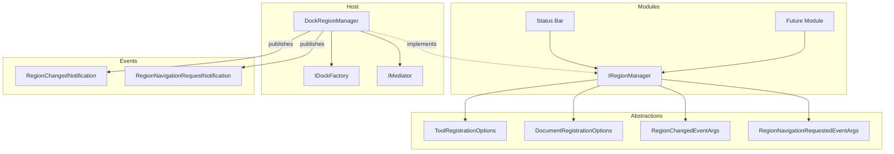

# LCS-CL-011b: Region Injection Service

**Version:** v0.1.1b  
**Category:** Host Infrastructure  
**Feature Name:** Region Injection Service  
**Date:** 2026-01-29

---

## Summary

Implements the `IRegionManager` service that enables modules to inject tool panes and documents into dock regions without direct dependency on `Dock.Avalonia`. Provides a clean abstraction layer with MediatR integration for region change notifications.

---

## New Features

### Core Interfaces (Lexichord.Abstractions)

- **IRegionManager** — Primary service interface for region management
    - `RegisterToolAsync()` — Adds tool panes to Left, Right, or Bottom regions
    - `RegisterDocumentAsync()` — Adds documents to Center region
    - `NavigateToAsync()` — Activates existing or triggers creation of dockables
    - `CloseAsync()` — Removes dockables with optional force close
    - `HideAsync()` / `ShowAsync()` — Visibility management
    - `GetDockable()` / `GetDockablesInRegion()` — Query operations

- **ToolRegistrationOptions** — Configuration record for tool registration
    - `ActivateOnRegister` — Auto-activate on creation (default: true)
    - `CanClose` — Allow user close (default: true)
    - `MinWidth` / `MinHeight` — Optional size constraints

- **DocumentRegistrationOptions** — Configuration record for document registration
    - `ActivateOnRegister` — Auto-activate on creation (default: true)
    - `IsPinned` — Tab pinning state (default: false)

- **RegionChangedEventArgs** — Event data for `RegionChanged` event
    - `Region` — Affected `ShellRegion`
    - `DockableId` — ID of the changed dockable
    - `ChangeType` — Added, Removed, or Activated

- **RegionNavigationRequestedEventArgs** — Event data for lazy loading
    - `RequestedId` — Dockable ID that couldn't be found
    - `Handled` — Set to true if handler created the dockable

### MediatR Integration (Lexichord.Abstractions)

- **RegionChangedNotification** — Published on registration, close, navigation
    - Enables cross-module layout awareness

- **RegionNavigationRequestNotification** — Published for unknown IDs
    - Enables on-demand dockable creation

### Implementation (Lexichord.Host)

- **DockRegionManager** — Concrete `IRegionManager` implementation
    - UI thread marshalling via `Dispatcher.UIThread.InvokeAsync`
    - Hidden dockable tracking for Show/Hide
    - Thread-safe dictionary for hidden state
    - Comprehensive logging for operations

---

## Modified Files

### New Files

| File                                                                       | Description               |
| :------------------------------------------------------------------------- | :------------------------ |
| `src/Lexichord.Abstractions/Layout/IRegionManager.cs`                      | Core interface definition |
| `src/Lexichord.Abstractions/Layout/ToolRegistrationOptions.cs`             | Tool config record        |
| `src/Lexichord.Abstractions/Layout/DocumentRegistrationOptions.cs`         | Document config record    |
| `src/Lexichord.Abstractions/Layout/RegionChangedEventArgs.cs`              | Event args + enum         |
| `src/Lexichord.Abstractions/Layout/RegionNavigationRequestedEventArgs.cs`  | Navigation event args     |
| `src/Lexichord.Abstractions/Events/RegionChangedNotification.cs`           | MediatR notification      |
| `src/Lexichord.Abstractions/Events/RegionNavigationRequestNotification.cs` | MediatR notification      |
| `src/Lexichord.Host/Layout/DockRegionManager.cs`                           | Implementation            |
| `tests/Lexichord.Tests.Unit/Host/Layout/DockRegionManagerTests.cs`         | Unit tests                |

### Modified Files

| File                                 | Changes                                       |
| :----------------------------------- | :-------------------------------------------- |
| `src/Lexichord.Host/HostServices.cs` | Added `IRegionManager` singleton registration |

---

## Technical Notes

### Type Aliasing for Namespace Collision

Both `Dock.Model.Controls` and `Lexichord.Abstractions.Layout` define `ITool` and `IDocument`. To resolve this:

```csharp
using ILexichordDocument = Lexichord.Abstractions.Layout.IDocument;
using ILexichordTool = Lexichord.Abstractions.Layout.ITool;
```

### UI Thread Marshalling

All methods that interact with the dock are marshalled to the UI thread:

```csharp
await Dispatcher.UIThread.InvokeAsync(() =>
{
    // Dock operations here
});
```

### Hidden Dockable Tracking

A thread-safe dictionary tracks hidden dockables for Show/Hide:

```csharp
private readonly Dictionary<string, (IDockable, IDock)> _hiddenDockables = [];
private readonly object _hiddenLock = new();
```

---

## Architecture



---

## Unit Tests

| Test                                                | Description                         |
| :-------------------------------------------------- | :---------------------------------- |
| `RegisterToolAsync_AddsTool_ToCorrectRegion`        | Verifies tool added to correct dock |
| `RegisterToolAsync_SetsActiveDockable`              | Verifies activation option          |
| `RegisterToolAsync_ReturnsNull_ForInvalidRegion`    | Validates region constraints        |
| `RegisterDocumentAsync_AddsDocument_ToDocumentDock` | Verifies document registration      |
| `NavigateToAsync_ActivatesExistingDockable`         | Verifies navigation behavior        |
| `NavigateToAsync_RaisesEvent_WhenNotFound`          | Verifies lazy loading event         |
| `CloseAsync_RemovesDockable`                        | Verifies dockable removal           |
| `CloseAsync_RespectsCanClose_WhenNotForced`         | Verifies dirty document protection  |
| `HideAsync_RemovesFromVisible_AndTracksForShow`     | Verifies hide tracking              |
| `ShowAsync_RestoresHiddenDockable_ToParent`         | Verifies show restoration           |
| `RegionChanged_Event_IsFiredOnRegister`             | Verifies event firing               |

---

## Verification Commands

```bash
# Build verification
dotnet build

# Run unit tests
dotnet test --filter "FullyQualifiedName~DockRegionManagerTests"

# Verify interface location
ls src/Lexichord.Abstractions/Layout/IRegionManager.cs

# Verify implementation location
ls src/Lexichord.Host/Layout/DockRegionManager.cs
```

---

## Related Documents

- **Specification:** [LCS-DES-011b.md](../specs/v0.1.x/v0.1.1/LCS-DES-011b.md)
- **Previous Sub-Part:** [LCS-CL-011a.md](./LCS-CL-011a.md)
