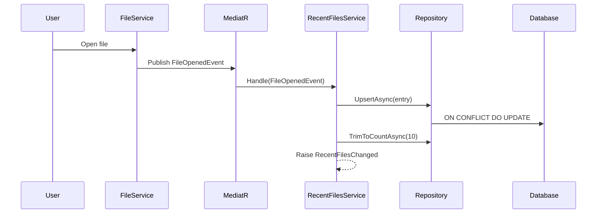

# LCS-CL-014d: Recent Files History

**Version**: v0.1.4d  
**Released**: 2026-01-29  
**Status**: ✅ Complete

---

## Overview

Implements MRU (Most Recently Used) file tracking with database persistence and menu integration. Files are automatically tracked when opened and displayed in the "File > Open Recent" menu, with missing files shown as disabled.

---

## Changes

### New Files

| File                                                                   | Purpose                                                |
| :--------------------------------------------------------------------- | :----------------------------------------------------- |
| `Abstractions/Contracts/IRecentFilesService.cs`                        | Service interface + RecentFileEntry record + events    |
| `Abstractions/Contracts/IRecentFilesRepository.cs`                     | Data access interface for MRU persistence              |
| `Abstractions/Contracts/RecentFilesOptions.cs`                         | Configuration options (MaxEntries, AutoPruneOnStartup) |
| `Abstractions/Entities/RecentFileEntity.cs`                            | Database entity with Dapper.Contrib attributes         |
| `Abstractions/Events/FileOpenedEvent.cs`                               | MediatR notification + FileOpenSource enum             |
| `Infrastructure/Migrations/Migration_20260126001_CreateRecentFiles.cs` | FluentMigrator schema migration                        |
| `Infrastructure/Data/RecentFilesRepository.cs`                         | Dapper repository with PostgreSQL upsert               |
| `Host/Services/RecentFilesService.cs`                                  | Service implementation + MediatR handler               |
| `Host/ViewModels/OpenRecentMenuViewModel.cs`                           | Menu ViewModel with commands                           |
| `Host/ViewModels/RecentFileMenuItemViewModel.cs`                       | Menu item ViewModel                                    |
| `Tests.Unit/Host/RecentFilesServiceTests.cs`                           | 10 unit tests for service                              |
| `Tests.Unit/Infrastructure/RecentFilesRepositoryTests.cs`              | 3 unit tests for repository                            |

### Modified Files

| File                   | Changes                                   |
| :--------------------- | :---------------------------------------- |
| `Host/HostServices.cs` | Registers `IRecentFilesService` + options |

---

## Technical Details

### Database Schema

```sql
CREATE TABLE "RecentFiles" (
    "Id"           UUID PRIMARY KEY DEFAULT gen_random_uuid(),
    "FilePath"     VARCHAR(1024) NOT NULL UNIQUE,
    "FileName"     VARCHAR(255) NOT NULL,
    "LastOpenedAt" TIMESTAMPTZ NOT NULL DEFAULT NOW(),
    "OpenCount"    INT NOT NULL DEFAULT 1,
    "CreatedAt"    TIMESTAMPTZ NOT NULL DEFAULT NOW(),
    "UpdatedAt"    TIMESTAMPTZ NOT NULL DEFAULT NOW()
);

CREATE INDEX IX_RecentFiles_LastOpenedAt ON "RecentFiles" ("LastOpenedAt" DESC);
```

### MRU Flow



### Configuration

```json
{
    "RecentFiles": {
        "MaxEntries": 10,
        "AutoPruneOnStartup": true,
        "ShowFilePaths": false
    }
}
```

---

## Test Coverage

| Test                                                  | Description               |
| :---------------------------------------------------- | :------------------------ |
| `GetRecentFilesAsync_ReturnsEntriesFromRepository`    | Retrieves from repository |
| `GetRecentFilesAsync_CapsToMaxEntries`                | Respects MaxEntries limit |
| `AddRecentFileAsync_UpsertsThenTrims`                 | Upserts and auto-trims    |
| `AddRecentFileAsync_RaisesAddedEvent`                 | Event notification        |
| `AddRecentFileAsync_ThrowsOnEmptyPath`                | Input validation          |
| `RemoveRecentFileAsync_DeletesAndRaisesEvent`         | Deletion with event       |
| `RemoveRecentFileAsync_DoesNotRaiseEventWhenNotFound` | No event on miss          |
| `ClearHistoryAsync_ClearsAllAndRaisesEvent`           | Clears with event         |
| `Handle_FileOpenedEvent_AddsToRecent`                 | MediatR handler           |
| `MaxEntries_ReturnsConfiguredValue`                   | Options binding           |

---

## Migration Commands

Run migrations with PostgreSQL:

```bash
cd /Users/ryan/Documents/GitHub/lexichord
dotnet run --project src/Lexichord.Host -- migrate up
```

Verify table created:

```bash
docker exec lexichord-db psql -U lexichord -c "\\d \"RecentFiles\""
```

---

## Dependencies

- v0.0.5b: Database Connector — `IDbConnectionFactory` for connections
- v0.0.5c: FluentMigrator Runner — Migration infrastructure
- v0.0.7a: MediatR Bootstrap — `FileOpenedEvent` handling
- v0.1.4b: Atomic Saves — `IFileService` for loading files
