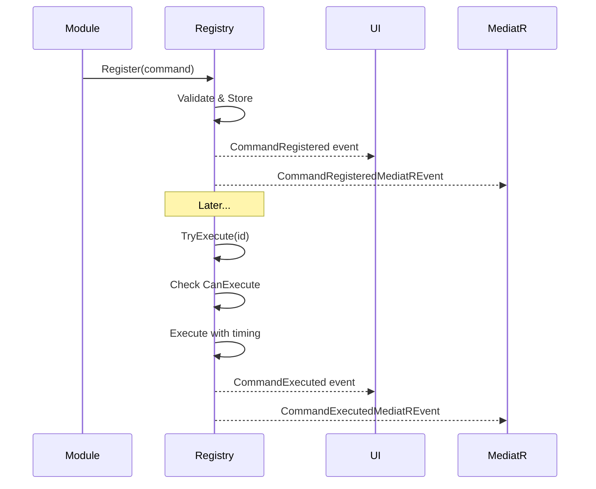

# LCS-CL-015a: Command Registry

**Version**: v0.1.5a  
**Released**: 2026-01-29  
**Status**: ✅ Complete

---

## Overview

Implements the Command Registry, a centralized system for managing application commands. Commands can be registered, queried, and executed through a unified interface with built-in timing, validation, and event notifications.

---

## Changes

### New Files

| File                                                | Purpose                                                   |
| :-------------------------------------------------- | :-------------------------------------------------------- |
| `Abstractions/Contracts/CommandDefinition.cs`       | Immutable record defining command metadata and validation |
| `Abstractions/Contracts/ICommandRegistry.cs`        | Interface for registration, lookup, and execution         |
| `Abstractions/Events/CommandEvents.cs`              | MediatR notifications and `CommandSource` enum            |
| `Host/Services/CommandRegistry.cs`                  | Thread-safe singleton implementation                      |
| `Tests.Unit/Abstractions/CommandDefinitionTests.cs` | 10 validation tests                                       |
| `Tests.Unit/Host/CommandRegistryTests.cs`           | 32 registration, lookup, execution, and event tests       |

### Modified Files

| File                       | Changes                                                          |
| :------------------------- | :--------------------------------------------------------------- |
| `Host/HostServices.cs`     | Registers `ICommandRegistry` → `CommandRegistry` singleton       |
| `Infrastructure/Data/*.cs` | Added `DapperCommandDefinition` alias to resolve naming conflict |

---

## Technical Details

### CommandDefinition Record

```csharp
public record CommandDefinition(
    string Id,              // "module.action" convention
    string Title,           // Display title in palette/menus
    string Category,        // Grouping category (File, Edit, View)
    string? DefaultShortcut,// "Ctrl+S" style shortcut
    Action<object?> Execute // Action to invoke
)
{
    // Optional properties
    public string? Description { get; init; }
    public string? IconKind { get; init; }
    public Func<bool>? CanExecute { get; init; }
    public string? Context { get; init; }
    public IEnumerable<string>? Tags { get; init; }
    public bool ShowInMenu { get; init; } = true;
    public bool ShowInPalette { get; init; } = true;
}
```

### CommandRegistry Features

- **Thread-Safe**: `ConcurrentDictionary` for concurrent registration
- **Validation**: Enforces `module.action` ID convention
- **Timing**: `Stopwatch`-based execution timing
- **Dual Events**: .NET events (UI) + MediatR notifications (auditing)
- **Case Insensitive**: ID lookups ignore case

### Event Flow



---

## Test Coverage

| Test Class               | Tests | Coverage                                        |
| :----------------------- | ----: | :---------------------------------------------- |
| `CommandDefinitionTests` |    10 | Validation, property assignment, default values |
| `CommandRegistryTests`   |    32 | Registration, lookup, execution, events, errors |
| **Total**                |    42 |                                                 |

---

## Dependencies

| Dependency                     | Purpose               |
| :----------------------------- | :-------------------- |
| `MediatR`                      | Event publishing      |
| `Microsoft.Extensions.Logging` | Timing and error logs |

---

## Related Documents

| Document                                               | Relationship    |
| :----------------------------------------------------- | :-------------- |
| [LCS-DES-015a](../specs/v0.1.x/v0.1.5/LCS-DES-015a.md) | Specification   |
| [LCS-SBD-015](../specs/v0.1.x/v0.1.5/LCS-SBD-015.md)   | Scope Breakdown |
