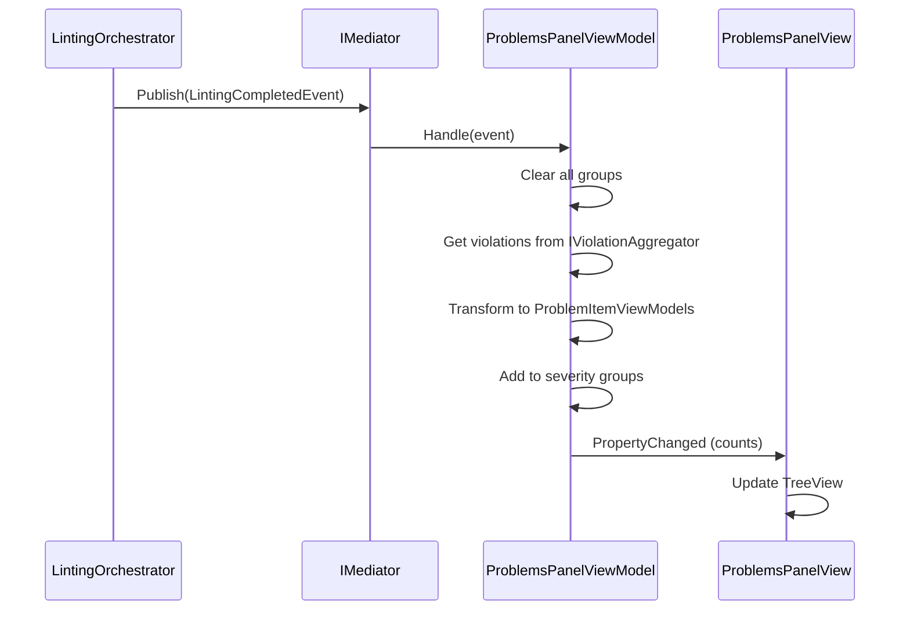

# v0.2.6a – The Sentinel (Problems Panel)

**Release Date:** 2026-01-30

## Overview

Implements the Problems Panel sidebar view (v0.2.6a), the first sub-part of "The Sentinel" milestone. The Problems Panel displays style violations grouped by severity, integrating with the linting engine via `LintingCompletedEvent`.

## Added

### Abstractions (`Lexichord.Abstractions`)

- **`ScopeModeType` enum** – Defines violation display scopes: `CurrentFile`, `OpenFiles` (v0.2.6c), `Workspace` (v0.2.6c)
- **`IProblemItem` interface** – Contract for individual problem items with Id, Line, Column, Message, RuleId, Severity, ViolatingText, SeverityIcon, DocumentId, StartOffset
- **`IProblemGroup` interface** – Contract for severity groups with Severity, DisplayName, Count, IsExpanded, Items, SeverityIcon, HeaderText
- **`IProblemsPanelViewModel` interface** – Main panel contract with ScopeMode, TotalCount, ErrorCount, WarningCount, InfoCount, HintCount, IsLoading, Groups, SelectedItem, ActiveDocumentId

### Style Module (`Lexichord.Modules.Style`)

- **`ProblemItemViewModel`** – Maps `AggregatedStyleViolation` to display-friendly properties with severity icons
- **`ProblemGroupViewModel`** – Collapsible severity groups with dynamic item management
- **`ProblemsPanelViewModel`** – Main ViewModel implementing `INotificationHandler<LintingCompletedEvent>`:
    - Clears existing violations on new linting event
    - Transforms violations to `ProblemItemViewModel`s
    - Groups by severity (Error, Warning, Info, Hint)
    - Updates count properties with PropertyChanged notifications
    - Handles cancelled/failed linting gracefully
- **`ProblemsPanelView.axaml`** – Avalonia UI with:
    - Header showing "Problems" title, "Current File" scope badge, loading indicator
    - Count badges for errors (red), warnings (orange), info (blue)
    - TreeView with severity groups as expandable nodes
    - Problem items showing Location, Message, RuleId with tooltips
    - Empty state with checkmark and "No problems found" message

### Tests (`Lexichord.Tests.Unit`)

- **`ProblemItemViewModelTests.cs`** – 10 tests: constructor, Location format, severity icons, interface
- **`ProblemGroupViewModelTests.cs`** – 17 tests: constructor, AddItem, Clear, IsExpanded, severity icons
- **`ProblemsPanelViewModelTests.cs`** – 17 tests: constructor, Handle event, counts, dispose, interface

## Modified

- **`StyleModule.cs`** – Module version bumped to 0.2.6; added Problems Panel registrations

## Dependencies

- **Depends on**: v0.2.3a (`LintingCompletedEvent`, `AggregatedStyleViolation`)
- **Required by**: v0.2.6b (Editor Navigation Service – uses SelectedItem)

## Data Flow

## Verification

- ✅ Build: 0 warnings, 0 errors
- ✅ Unit Tests: 44 new tests, all passing
- ✅ Module registration verified
