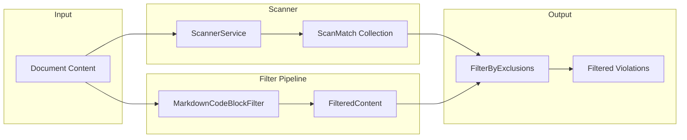

# Changelog: v0.2.7b Code Block Ignoring

**Version:** 0.2.7b  
**Codename:** The Turbo (Part 2)  
**Date:** 2026-01-30  
**Design Spec:** [LCS-DES-027b](../../specs/v0.2.x/v0.2.7/LCS-DES-027b.md)

---

## Overview

Implements content filtering to exclude Markdown code blocks from style linting, preventing false positives when code samples contain terms that would otherwise trigger style violations. Introduces a pluggable filter architecture with `IContentFilter` interface and efficient binary-search-based match filtering.

---

## Changes

### Abstraction Layer

#### New Files

| File                                                                                                                                          | Description                                 |
| :-------------------------------------------------------------------------------------------------------------------------------------------- | :------------------------------------------ |
| [ExclusionReason.cs](file:///Users/ryan/Documents/GitHub/lexichord/src/Lexichord.Abstractions/Contracts/Linting/ExclusionReason.cs)           | Enum categorizing exclusion types           |
| [ExcludedRegion.cs](file:///Users/ryan/Documents/GitHub/lexichord/src/Lexichord.Abstractions/Contracts/Linting/ExcludedRegion.cs)             | Record marking character ranges to skip     |
| [FilteredContent.cs](file:///Users/ryan/Documents/GitHub/lexichord/src/Lexichord.Abstractions/Contracts/Linting/FilteredContent.cs)           | Filter output with exclusion zones          |
| [IContentFilter.cs](file:///Users/ryan/Documents/GitHub/lexichord/src/Lexichord.Abstractions/Contracts/Linting/IContentFilter.cs)             | Interface for pre-scan content filters      |
| [ContentFilterOptions.cs](file:///Users/ryan/Documents/GitHub/lexichord/src/Lexichord.Abstractions/Contracts/Linting/ContentFilterOptions.cs) | Configuration options for content filtering |

#### New Types

- `ExclusionReason` - Enum with values: `FencedCodeBlock`, `InlineCode`, `Frontmatter`, `IndentedCodeBlock`
- `ExcludedRegion` - Record with `StartOffset`, `EndOffset`, `Reason`, `Metadata` properties
    - `Length` computed property
    - `Contains(int offset)` and `Overlaps(ExcludedRegion)` helper methods
- `FilteredContent` - Record with `ProcessedContent`, `ExcludedRegions`, `OriginalContent` properties
    - `HasExclusions` and `TotalExcludedLength` computed properties
    - `IsExcluded(int offset)` helper method
    - `None(string content)` static factory method
- `IContentFilter` - Interface with `Filter`, `CanFilter`, `Priority`, `Name` members
- `ContentFilterOptions` - Record with `EnableCodeBlockFilter`, `EnableFrontmatterFilter` properties
    - `Default` and `None` static factory properties

---

### Implementation Layer

#### New Files

| File                                                                                                                                         | Description                               |
| :------------------------------------------------------------------------------------------------------------------------------------------- | :---------------------------------------- |
| [MarkdownCodeBlockOptions.cs](file:///Users/ryan/Documents/GitHub/lexichord/src/Lexichord.Modules.Style/Filters/MarkdownCodeBlockOptions.cs) | Configuration for code block detection    |
| [MarkdownCodeBlockFilter.cs](file:///Users/ryan/Documents/GitHub/lexichord/src/Lexichord.Modules.Style/Filters/MarkdownCodeBlockFilter.cs)   | Main filter with fenced/inline detection  |
| [ScannerExtensions.cs](file:///Users/ryan/Documents/GitHub/lexichord/src/Lexichord.Modules.Style/Services/Linting/ScannerExtensions.cs)      | Extension methods for exclusion filtering |

#### Key Features

- **Fenced Code Blocks**: State machine detects ``` and ~~~ fences with proper nesting support
- **Inline Code**: Regex-based detection with backtick counting (single, double, triple)
- **Language Hints**: Extracts language from opening fence (e.g., ```python)
- **Unclosed Fence Handling**: Unclosed fences extend to EOF
- **Binary Search Filtering**: O(log n) exclusion lookup for efficient match filtering

#### Modified Files

| File                                                                                                       | Change                                            |
| :--------------------------------------------------------------------------------------------------------- | :------------------------------------------------ |
| [StyleModule.cs](file:///Users/ryan/Documents/GitHub/lexichord/src/Lexichord.Modules.Style/StyleModule.cs) | Registered `MarkdownCodeBlockFilter` as singleton |

---

### Unit Tests

#### New Files

| File                                                                                                                                                              | Test Count |
| :---------------------------------------------------------------------------------------------------------------------------------------------------------------- | :--------- |
| [ExcludedRegionTests.cs](file:///Users/ryan/Documents/GitHub/lexichord/tests/Lexichord.Tests.Unit/Abstractions/Contracts/Linting/ExcludedRegionTests.cs)          | 11 tests   |
| [FilteredContentTests.cs](file:///Users/ryan/Documents/GitHub/lexichord/tests/Lexichord.Tests.Unit/Abstractions/Contracts/Linting/FilteredContentTests.cs)        | 13 tests   |
| [MarkdownCodeBlockFilterTests.cs](file:///Users/ryan/Documents/GitHub/lexichord/tests/Lexichord.Tests.Unit/Modules/Style/Filters/MarkdownCodeBlockFilterTests.cs) | 31 tests   |
| [ScannerExtensionsTests.cs](file:///Users/ryan/Documents/GitHub/lexichord/tests/Lexichord.Tests.Unit/Modules/Style/Linting/ScannerExtensionsTests.cs)             | 17 tests   |

#### Test Coverage

- Fenced blocks: simple, with language, tildes, unclosed, nested, mixed
- Inline code: single/double/triple backticks, within fenced blocks
- Edge cases: empty content, no code blocks, adjacent blocks, performance
- ScannerExtensions: boundary conditions, binary search optimization, overlapping exclusions

---

## Verification

```
dotnet test --verbosity minimal

Test summary: total: 2225, failed: 0, succeeded: 2197, skipped: 28
Build succeeded in 2.1s
```

---

## Architecture



---

## Dependencies

| Interface        | Version | Used By                       |
| :--------------- | :------ | :---------------------------- |
| `IContentFilter` | v0.2.7b | Content filtering abstraction |
| `ScanMatch`      | v0.2.3d | Scanner match filtering       |
| `ILogger<T>`     | .NET 9  | Diagnostic logging            |

---

## Notes

- The `MarkdownCodeBlockFilter` is designed to be thread-safe and stateless
- Exclusion regions use half-open intervals: `[StartOffset, EndOffset)`
- Binary search provides O(log n) performance for large documents with many exclusions
- The filter pipeline is extensible - additional filters (e.g., frontmatter) can implement `IContentFilter`
