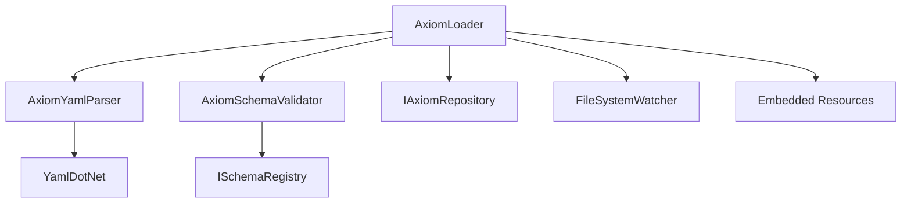

# Changelog: v0.4.6g — Axiom Loader

**Version:** 0.4.6g  
**Date:** 2026-02-02  
**Module:** Lexichord.Modules.Knowledge  
**Feature:** Axiom Loader (CKVS Phase 1d)

## Summary

Implements YAML-based axiom loading from embedded resources and workspace files. Provides declarative constraint definitions validated against the Schema Registry, with file watching for hot-reload and license-gated features.

## Changes

### Lexichord.Abstractions

| File                       | Change | Description                                         |
| -------------------------- | ------ | --------------------------------------------------- |
| `IAxiomLoader.cs`          | NEW    | Loader interface for axiom loading operations       |
| `AxiomLoadResult.cs`       | NEW    | Result record with axioms, file counts, and errors  |
| `AxiomLoadError.cs`        | NEW    | Error record with code, message, severity, location |
| `AxiomValidationReport.cs` | NEW    | Dry-run validation report for axiom files           |
| `LoadErrorSeverity.cs`     | NEW    | Enum defining Error/Warning/Info severity levels    |
| `AxiomSourceType.cs`       | NEW    | Enum for BuiltIn/Workspace source classification    |

### Lexichord.Modules.Knowledge

| File                                    | Change   | Description                                     |
| --------------------------------------- | -------- | ----------------------------------------------- |
| `Axioms/AxiomYamlModels.cs`             | NEW      | Internal YAML deserialization records           |
| `Axioms/AxiomYamlParser.cs`             | NEW      | YAML parsing with constraint type mapping       |
| `Axioms/AxiomSchemaValidator.cs`        | NEW      | Schema validation against ISchemaRegistry       |
| `Axioms/AxiomLoader.cs`                 | NEW      | Loader implementation with file watching        |
| `Resources/BuiltInAxioms/api-docs.yaml` | NEW      | Built-in API documentation axioms               |
| `KnowledgeModule.cs`                    | MODIFIED | Added IAxiomLoader service registration         |
| `Lexichord.Modules.Knowledge.csproj`    | MODIFIED | Added YamlDotNet package and embedded resources |

## Architecture



## License Requirements

| Operation          | Required Tier | Description                              |
| ------------------ | ------------- | ---------------------------------------- |
| Load Built-In      | WriterPro+    | Load embedded resource axioms            |
| Load Workspace     | Teams+        | Load from `.lexichord/knowledge/axioms/` |
| File Watching      | Teams+        | Hot-reload workspace axiom changes       |
| Validate (dry-run) | Teams+        | Validate axiom file without loading      |

## Workspace Structure

```
.lexichord/
└── knowledge/
    └── axioms/
        ├── api-rules.yaml
        ├── my-project.yaml
        └── ...
```

## YAML Schema

```yaml
version: "1.0"
axioms:
    - id: endpoint-path-required
      name: Endpoint Path Required
      target_type: Endpoint
      target_kind: entity
      severity: error
      category: api-documentation
      tags: [api, required]
      enabled: true
      rules:
          - constraint: required
            property: path
            message: All endpoints must have a path
          - constraint: pattern
            property: method
            pattern: ^(GET|POST|PUT|PATCH|DELETE)$
            when:
                property: path
                operator: is_not_null
                value: null
```

## Tests Added

| File                           | Tests | Description                              |
| ------------------------------ | ----- | ---------------------------------------- |
| `AxiomYamlParserTests.cs`      | 26    | YAML parsing, constraint mapping, errors |
| `AxiomSchemaValidatorTests.cs` | 10    | Target type validation, registry checks  |
| `AxiomLoaderTests.cs`          | 12    | Constructor validation, license gating   |

## Dependencies

| Interface         | Version | Purpose                     |
| ----------------- | ------- | --------------------------- |
| IAxiomRepository  | v0.4.6f | Axiom persistence           |
| ISchemaRegistry   | v0.4.5f | Entity/relationship schemas |
| ILicenseContext   | v0.0.4c | License tier checks         |
| IWorkspaceService | v0.1.2a | Workspace path resolution   |
| YamlDotNet        | 15.3.0  | YAML deserialization        |
