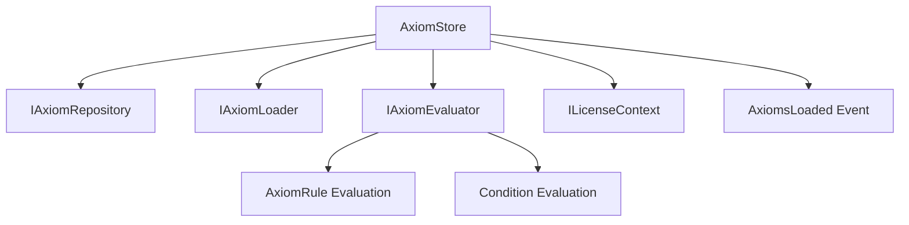

# Changelog: v0.4.6h — Axiom Query API

**Version:** 0.4.6h  
**Date:** 2026-02-02  
**Module:** Lexichord.Modules.Knowledge  
**Feature:** Axiom Query API (CKVS Phase 1e)

## Summary

Implements the Axiom Query API for retrieving and validating axioms. Provides in-memory caching with O(1) retrieval indexed by target type, constraint evaluation via delegated validation logic, event publishing for hot-reload notifications, and license-gated access to query and validation features.

## Changes

### Lexichord.Abstractions

| File                 | Change | Description                                        |
| -------------------- | ------ | -------------------------------------------------- |
| `IAxiomStore.cs`     | NEW    | Query interface for axiom retrieval and validation |
| `IAxiomEvaluator.cs` | NEW    | Evaluator interface for rule constraint evaluation |

### Lexichord.Modules.Knowledge

| File                 | Change   | Description                                        |
| -------------------- | -------- | -------------------------------------------------- |
| `AxiomEvaluator.cs`  | NEW      | Stateless evaluator with 9 constraint types        |
| `AxiomStore.cs`      | NEW      | In-memory store with caching and event publishing  |
| `KnowledgeModule.cs` | MODIFIED | Added IAxiomEvaluator and IAxiomStore registration |

## Architecture

## License Requirements

| Operation             | Required Tier | Description                              |
| --------------------- | ------------- | ---------------------------------------- |
| Get Axioms            | WriterPro+    | Query axioms by target type              |
| Get All Axioms        | WriterPro+    | Retrieve all loaded axioms               |
| Statistics            | WriterPro+    | Access store statistics                  |
| Validate Entity       | Teams+        | Validate entity against applicable rules |
| Validate Relationship | Teams+        | Validate relationship against rules      |
| Load Custom Directory | Teams+        | Load axioms from custom path             |

## Constraint Types Supported

| Constraint       | Description                                    |
| ---------------- | ---------------------------------------------- |
| Required         | Property must be present and non-empty         |
| OneOf            | Property value must be in allowed values list  |
| Range            | Numeric property must be within min/max bounds |
| Pattern          | String property must match regex pattern       |
| Cardinality      | Collection count within min/max bounds         |
| NotBoth          | Mutually exclusive properties                  |
| RequiresTogether | Properties that must appear together           |
| Equals           | Property must equal specific value             |
| NotEquals        | Property must not equal specific value         |

## Condition Operators Supported

| Operator    | Description                     |
| ----------- | ------------------------------- |
| Equals      | String equality comparison      |
| NotEquals   | String inequality comparison    |
| Contains    | Substring contains check        |
| NotContains | Substring not contains check    |
| StartsWith  | String prefix check             |
| EndsWith    | String suffix check             |
| GreaterThan | Numeric greater than            |
| LessThan    | Numeric less than               |
| IsNull      | Property is null/missing        |
| IsNotNull   | Property exists and is not null |
| Regex       | String matches regex pattern    |
| OneOf       | Value is in provided list       |
| NotOneOf    | Value is not in provided list   |

## Statistics Tracking

The `AxiomStoreStatistics` record provides:

- `TotalAxioms` — Count of all axioms in store
- `EnabledAxioms` — Count of enabled axioms only
- `TargetTypes` — Count of distinct target types indexed
- `LastLoadedAt` — Timestamp of last load operation
- `LastLoadDuration` — Duration of last load operation
- `SourceFilesLoaded` — Number of source files processed

## Tests Added

| File                     | Tests | Description                              |
| ------------------------ | ----- | ---------------------------------------- |
| `AxiomEvaluatorTests.cs` | —     | Existing tests for constraint evaluation |
| `AxiomStoreTests.cs`     | —     | Pending dedicated store tests            |

## Dependencies

| Interface        | Version | Purpose                     |
| ---------------- | ------- | --------------------------- |
| IAxiomRepository | v0.4.6f | Axiom persistence           |
| IAxiomLoader     | v0.4.6g | YAML axiom loading          |
| ISchemaRegistry  | v0.4.5f | Entity/relationship schemas |
| ILicenseContext  | v0.0.4c | License tier checks         |
