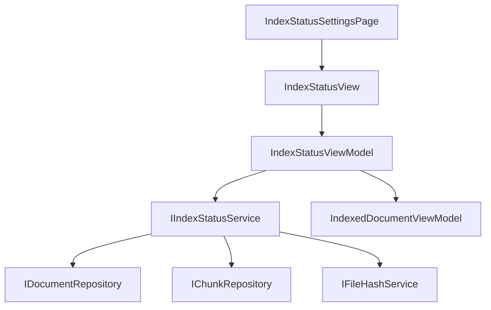

# Changelog: v0.4.7a — Index Status View

**Version:** 0.4.7a  
**Date:** 2026-02-02  
**Module:** Lexichord.Modules.RAG  
**Feature:** Index Status View (The Index Manager Phase 1)

## Summary

Implements the Index Status View for displaying document indexing status within the Settings dialog. Provides aggregate statistics (document count, chunk count, storage size), per-document status information with filtering, stale detection via hash comparison, and status badge visualization.

## Changes

### Lexichord.Abstractions

| File                     | Change | Description                                        |
| ------------------------ | ------ | -------------------------------------------------- |
| `IndexingStatus.cs`      | NEW    | Enum for document indexing lifecycle states        |
| `IndexedDocumentInfo.cs` | NEW    | Record with document metadata and status           |
| `IndexStatistics.cs`     | NEW    | Record with aggregate index statistics             |
| `IIndexStatusService.cs` | NEW    | Service interface for status retrieval and refresh |

### Lexichord.Modules.RAG

| File                          | Change   | Description                                      |
| ----------------------------- | -------- | ------------------------------------------------ |
| `IndexStatusService.cs`       | NEW      | Service implementation with hash-based staleness |
| `IndexedDocumentViewModel.cs` | NEW      | ViewModel for individual document display        |
| `IndexStatusViewModel.cs`     | NEW      | ViewModel with filtering and commands            |
| `IndexStatusView.axaml`       | NEW      | AXAML view with stats header and document list   |
| `IndexStatusView.axaml.cs`    | NEW      | Code-behind for ComboBox event handling          |
| `IndexStatusSettingsPage.cs`  | NEW      | Settings page wrapper for integration            |
| `RAGModule.cs`                | MODIFIED | Added DI registrations for new components        |

## Architecture

## IndexingStatus Enum

| Value      | Description                              |
| ---------- | ---------------------------------------- |
| NotIndexed | Document has not been indexed            |
| Pending    | Document is queued for indexing          |
| Indexing   | Document is currently being indexed      |
| Indexed    | Document has been successfully indexed   |
| Stale      | Document has changed since last indexing |
| Failed     | Document indexing failed                 |

## Statistics Tracking

The `IndexStatistics` record provides:

- `DocumentCount` — Total number of tracked documents
- `ChunkCount` — Total number of chunks across all documents
- `StorageSizeBytes` — Estimated storage size for embeddings
- `StatusCounts` — Breakdown by indexing status

## UI Features

- **Header Stats Panel** — Displays aggregate statistics with icons
- **Filter Bar** — Text search and status dropdown filtering
- **Document List** — Virtualized list with status badges
- **Refresh Button** — Triggers stale detection and status update

## Tests Added

| File                               | Tests | Description                               |
| ---------------------------------- | ----- | ----------------------------------------- |
| `IndexStatusServiceTests.cs`       | 18    | Service logic for retrieval and staleness |
| `IndexStatusViewModelTests.cs`     | 16    | ViewModel loading and filtering           |
| `IndexedDocumentViewModelTests.cs` | 19    | Document property mapping and display     |

## Dependencies

| Interface           | Version | Purpose                     |
| ------------------- | ------- | --------------------------- |
| IDocumentRepository | v0.4.1c | Document persistence        |
| IChunkRepository    | v0.4.1b | Chunk persistence           |
| IFileHashService    | v0.4.1d | File hash comparison        |
| ISettingsPage       | v0.1.6a | Settings dialog integration |
