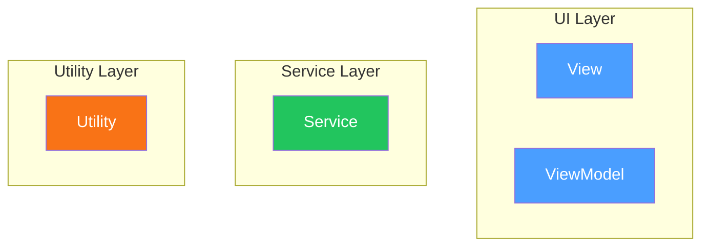

# Prompt: Draft Version Documentation

Use this prompt by referencing it and specifying the version:

```
Draft the documentation for v0.3.4 @PROMPT-VERSION-DOCS.md
```

---

## Instructions

You are drafting documentation for Lexichord, a modular monolith writing analysis application built with .NET 9 and Avalonia UI. The project follows a structured documentation workflow with three interconnected document types:

1. **Scope Breakdown Document (LCS-SBD-XXX.md)** - Detailed task breakdown, user stories, use cases, and acceptance criteria
2. **Design Specification Index (LCS-DES-XXX-INDEX.md)** - High-level overview linking to the SBD and all sub-part design specs
3. **Sub-Part Design Specifications (LCS-DES-XXXa/b/c/d.md)** - Detailed technical specs for each sub-part following the LDS-01 template

---

## Step 1: Read Reference Documents

Before drafting, read these documents to understand the patterns and requirements:

**Templates and Workflows:**
- `docs/templates/LCS-SBD-TEMPLATE.md` - Scope breakdown template
- `docs/templates/template-design-spec.md` - LDS-01 design spec template
- `docs/workflows/WF-SBD-Drafting.md` - SBD drafting workflow
- `docs/workflows/wf-design-spec.md` - Design spec workflow

**Project Context:**
- `docs/specs/DEPENDENCY-MATRIX.md` - Interface dependencies by version
- `docs/specs/SUBSCRIPTION_MATRIX.md` - License tier features
- `docs/specs/UX_DESIGN_SYSTEM.md` - UI/UX guidelines
- `docs/specs/v0.3.x/roadmap-v0.3.x.md` - Version roadmap with sub-parts

**Example Documents (use as patterns):**
- `docs/specs/v0.3.x/v0.3.3/LCS-SBD-033.md` - Scope breakdown example
- `docs/specs/v0.3.x/v0.3.3/LCS-DES-033-INDEX.md` - Index example
- `docs/specs/v0.3.x/v0.3.3/LCS-DES-033a.md` - Sub-part design spec example

---

## Step 2: Identify Sub-Parts from Roadmap

Read the roadmap file (`docs/specs/v0.3.x/roadmap-v0.3.x.md`) to identify:

- Feature name and codename
- All sub-parts (a, b, c, d, etc.)
- Key interfaces and records
- License tier requirements
- Dependencies on prior versions

---

## Step 3: Create Documents

Create the following files in the version directory (`docs/specs/v0.3.x/v[X.Y.Z]/`):

### 3.1 Scope Breakdown Document

**File:** `LCS-SBD-0[XZ].md`

Follow `LCS-SBD-TEMPLATE.md` structure. Include:
- Executive summary with success metrics
- Sub-part specifications with tasks and definition of done
- Implementation checklist table
- Dependency matrix (required interfaces, new interfaces, NuGet packages)
- Risks & mitigations
- Decision trees (text-based flowcharts)
- User stories table
- Use cases with preconditions/flow/postconditions
- Unit testing requirements with code examples
- Observability & logging table
- UI/UX specifications with ASCII mockups
- Acceptance criteria (QA checklist)
- Verification commands (bash)
- Workflows (Mermaid sequence/state diagrams)
- Code examples
- Deferred features table
- Changelog entry

### 3.2 Design Specification Index

**File:** `LCS-DES-0[XZ]-INDEX.md`

Include:
- Document control table (Feature ID, Version, Module Scope, License Tier, Feature Gate Key)
- Executive summary (problem, solution, business value)
- Related documents section linking to:
  - Scope Breakdown Document
  - All sub-part design specs
- Architecture overview with Mermaid diagrams:
  - Component diagram (`graph TB` with color-coded subgraphs)
  - Data flow sequence diagram
- Dependencies matrix (upstream, NuGet, downstream consumers)
- License gating strategy with behavior-by-tier table
- Key interfaces summary table
- Implementation checklist summary with estimated hours
- Success criteria summary table
- Test coverage summary table
- "What This Enables" section for future versions
- Document history table

### 3.3 Sub-Part Design Specifications

**Files:** `LCS-DES-0[XZ]a.md`, `LCS-DES-0[XZ]b.md`, `LCS-DES-0[XZ]c.md`, `LCS-DES-0[XZ]d.md`

Follow `template-design-spec.md` (LDS-01 template). Each file must include all 10+ sections:

1. **Metadata & Categorization** - Document control table
2. **Executive Summary** - The requirement, the proposed solution
3. **Architecture & Modular Strategy** - System architecture diagram, dependencies table, licensing behavior
4. **Data Contract (The API)** - Interfaces and records with full XML doc comments
5. **Implementation Logic** - Code examples, flow diagrams (Mermaid)
6. **UI/UX Specifications** - ASCII mockups, component styling, accessibility
7. **Decision Trees** - Text-based flowcharts for logic
8. **User Stories** - Table format
9. **Use Cases** - Detailed scenarios
10. **Unit Testing Requirements** - Test code examples with `[Fact]` and `[Theory]`
11. **Observability & Logging** - Log level/source/message table
12. **Workflows** - Mermaid state/sequence diagrams
13. **Code Examples** - Full implementation samples
14. **Acceptance Criteria (QA)** - Numbered checklist
15. **Deliverable Checklist** - Step-by-step with status checkboxes
16. **Verification Commands** - Bash commands
17. **Changelog Entry** - Markdown format
18. **Deferred Features** - Out of scope table

---

## Key Patterns

### Document Control Fields

```markdown
| Field | Value |
| :--- | :--- |
| **Document ID** | LCS-DES-0[XZ][a-d] |
| **Feature ID** | STY-0[XZ][a-d] |
| **Feature Name** | [Feature Name] |
| **Target Version** | v[X.Y.Z][a-d] |
| **Module Scope** | Lexichord.Modules.[Module] |
| **Swimlane** | [Governance/Analysis/Agent] |
| **License Tier** | [Core/Writer Pro/Teams/Enterprise] |
| **Feature Gate Key** | `FeatureFlags.[Module].[Feature]` |
| **Status** | Draft |
| **Last Updated** | [YYYY-MM-DD] |
```

### Naming Conventions

| Type | Pattern | Example |
| :--- | :--- | :--- |
| Interfaces | `I[Name]Service` | `IVoiceProfileService` |
| Repositories | `I[Name]Repository` | `IProfileRepository` |
| Scanners | `I[Name]Scanner` | `IVoiceScanner` |
| Records (metrics) | `[Name]Metrics` | `VoiceMetrics` |
| Records (info) | `[Name]Info` | `AxisInfo` |
| Records (result) | `[Name]Result` | `ProfileResult` |
| Records (options) | `[Name]Options` | `ProfileOptions` |
| ViewModels | `[Name]ViewModel` | `VoiceHudViewModel` |
| Views | `[Name]View` | `VoiceHudView` |
| Events | `[Name]Event` | `ProfileAnalyzedEvent` |
| Validators | `[Name]Validator` | `ProfileValidator` |

### Mermaid Diagram Colors



- **UI components (blue):** `fill:#4a9eff,color:#fff`
- **Services (green):** `fill:#22c55e,color:#fff`
- **Utilities (orange):** `fill:#f97316,color:#fff`

### License Gating Pattern

```csharp
// Check license before executing feature logic
if (!_licenseContext.HasFeature(FeatureFlags.[Module].[Feature]))
{
    _logger.LogDebug("Skipping [feature]: license not available");
    return [empty result];
}
```

### Test Attribute Pattern

```csharp
[Trait("Category", "Unit")]
[Trait("Version", "v[X.Y.Z][a-d]")]
public class [Name]Tests
{
    [Fact]
    public void Method_Condition_ExpectedResult() { }

    [Theory]
    [InlineData("input1", "expected1")]
    [InlineData("input2", "expected2")]
    public void Method_WithVariousInputs_ReturnsExpected(string input, string expected) { }
}
```

---

## Output Requirements

1. **No placeholders** - Fill in all technical details from the roadmap
2. **Complete files** - Each document must be standalone and complete
3. **Consistent formatting** - Follow the exact patterns from example documents
4. **Cross-references** - Link between related documents correctly

After creating all documents, provide a summary:

```markdown
## Summary

### Files Created
- `docs/specs/v0.3.x/v[X.Y.Z]/LCS-SBD-0[XZ].md`
- `docs/specs/v0.3.x/v[X.Y.Z]/LCS-DES-0[XZ]-INDEX.md`
- `docs/specs/v0.3.x/v[X.Y.Z]/LCS-DES-0[XZ]a.md`
- `docs/specs/v0.3.x/v[X.Y.Z]/LCS-DES-0[XZ]b.md`
- `docs/specs/v0.3.x/v[X.Y.Z]/LCS-DES-0[XZ]c.md`
- `docs/specs/v0.3.x/v[X.Y.Z]/LCS-DES-0[XZ]d.md`

### Key Interfaces Defined
- `I[Name]Service` - [purpose]
- `I[Name]` - [purpose]

### Dependencies on Prior Versions
- `[Interface]` from v[X.Y.Z]

### Enables Future Versions
- v[X.Y.Z+1] - [Feature Name]
```

---

## Example Usage

```
Draft the documentation for v0.3.4 @PROMPT-VERSION-DOCS.md
```

This will:
1. Read the roadmap to find v0.3.4 sub-parts
2. Read all reference templates and examples
3. Create the SBD, INDEX, and all sub-part design specs
4. Provide a summary of what was created
