# CKVS Integration Visual Roadmap

## Overview

This document provides a visual timeline of CKVS (Canonical Knowledge Validation System) integration into the Lexichord roadmap. CKVS features are integrated incrementally across v0.4.x through v0.7.x, running in parallel with existing planned features.

---

## Timeline Overview

```
2026                                              2027
Q2 (Apr-Jun)     Q3 (Jul-Sep)     Q4 (Oct-Dec)     Q1 (Jan-Mar)
|----------------|----------------|----------------|----------------|
     v0.4.x           v0.5.x           v0.6.x           v0.7.x

  ┌─────────────────────────────────────────────────────────────────┐
  │                    EXISTING ROADMAP                             │
  │  RAG/Vector    │  Retrieval   │  Agents/LLM  │  Specialists     │
  │  Foundation    │  Advanced    │  Gateway     │  Workflows       │
  └─────────────────────────────────────────────────────────────────┘

  ┌─────────────────────────────────────────────────────────────────┐
  │                    CKVS INTEGRATION                             │
  │  Foundation    │  Extraction  │  Validation  │  Sync/Context    │
  │  Graph+Schema  │  NLU+Claims  │  Engine      │  Agents          │
  └─────────────────────────────────────────────────────────────────┘
```

---

## Phase 1: CKVS Foundation (Q2 2026)

### Parallel Development: v0.4.x

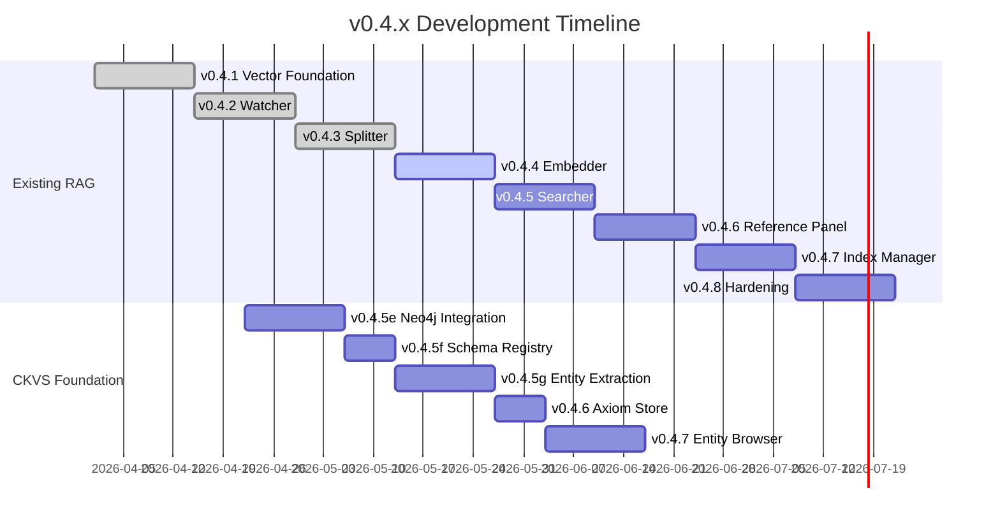

### Component Dependencies

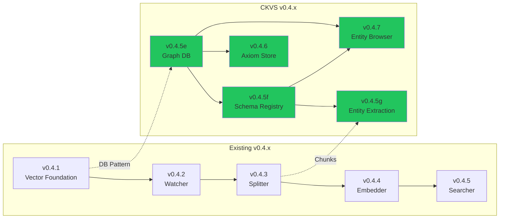

### v0.4.x Deliverables Summary

| Version | Existing Feature | CKVS Addition | Integration Point |
|:--------|:-----------------|:--------------|:------------------|
| v0.4.5 | Semantic Search | Neo4j + Schema + Extraction | Parallel development |
| v0.4.6 | Reference Panel | Axiom Store | Settings integration |
| v0.4.7 | Index Manager | Entity Browser | Same panel, different tab |
| v0.4.8 | Hardening | — | Test coverage |

---

## Phase 2: CKVS Extraction (Q3 2026)

### Parallel Development: v0.5.x

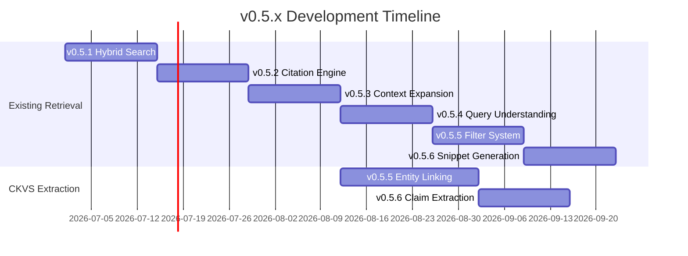

### Component Integration

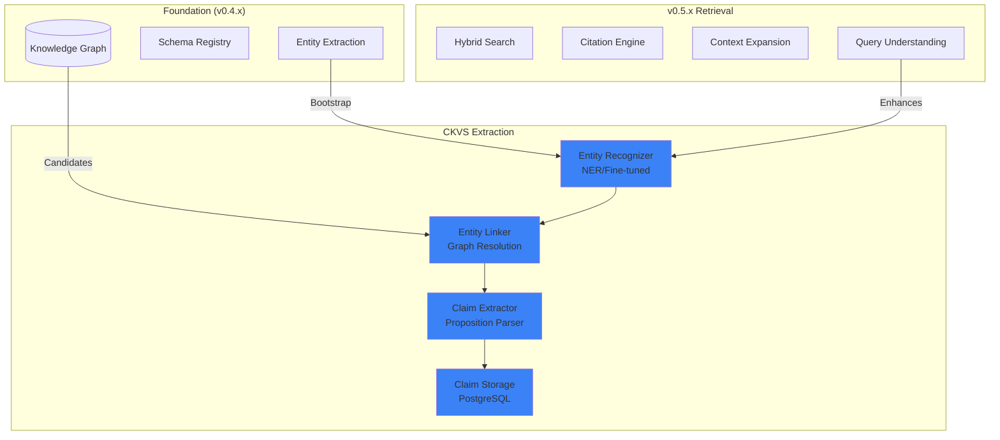

### v0.5.x Deliverables Summary

| Version | Existing Feature | CKVS Addition | Integration Point |
|:--------|:-----------------|:--------------|:------------------|
| v0.5.4 | Query Understanding | — | NER foundation |
| v0.5.5 | Filter System | Entity Linking | Entity-aware search |
| v0.5.6 | Snippet Generation | Claim Extraction | Claim-enhanced snippets |

---

## Phase 3: CKVS Validation (Q4 2026)

### Parallel Development: v0.6.x

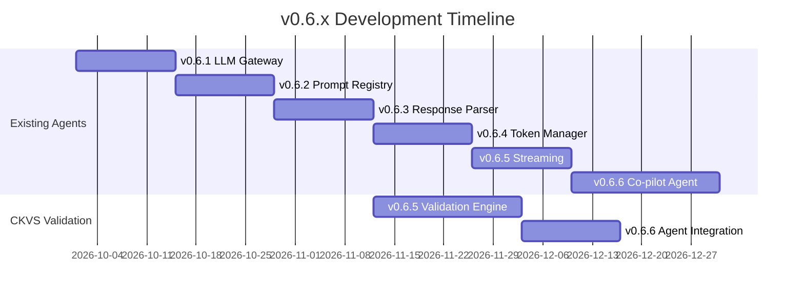

### Validation Engine Architecture

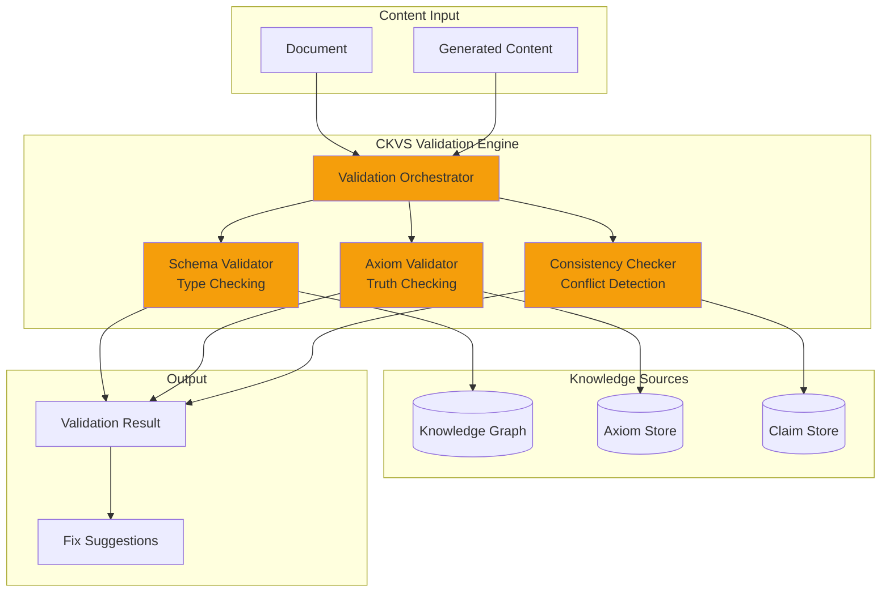

### v0.6.x Deliverables Summary

| Version | Existing Feature | CKVS Addition | Integration Point |
|:--------|:-----------------|:--------------|:------------------|
| v0.6.5 | Streaming | Validation Engine | Parallel development |
| v0.6.6 | Co-pilot Agent | Graph-Aware Context | Pre/post validation |

---

## Phase 4: CKVS Agents & Sync (Q1 2027)

### Parallel Development: v0.7.x

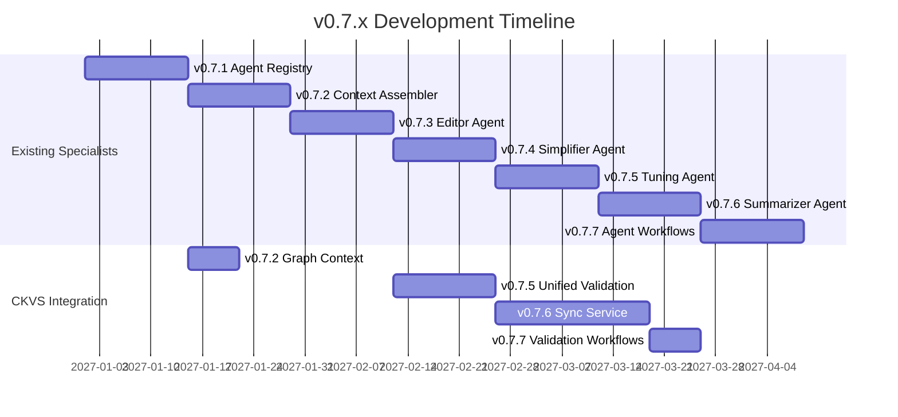

### Knowledge-Aware Agent Architecture

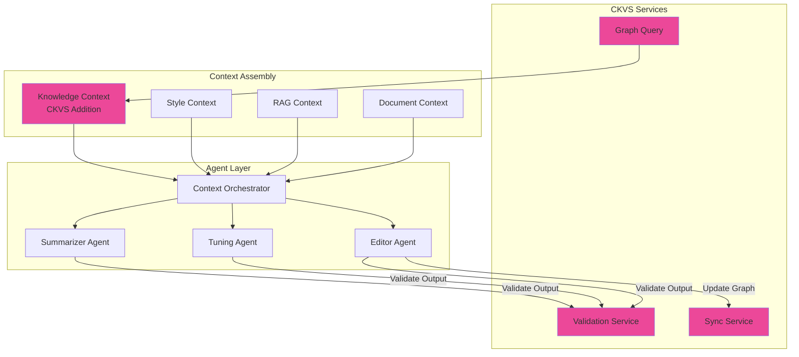

### v0.7.x Deliverables Summary

| Version | Existing Feature | CKVS Addition | Integration Point |
|:--------|:-----------------|:--------------|:------------------|
| v0.7.2 | Context Assembler | Graph Context Strategy | New context source |
| v0.7.5 | Tuning Agent | Unified Validation | Combined fix workflow |
| v0.7.6 | Summarizer Agent | Sync Service | Bidirectional sync |
| v0.7.7 | Agent Workflows | Validation Steps | Workflow integration |

---

## Full Integration Timeline

```
                    2026                                    2027
        Apr    May    Jun    Jul    Aug    Sep    Oct    Nov    Dec    Jan    Feb    Mar
        ├──────┼──────┼──────┼──────┼──────┼──────┼──────┼──────┼──────┼──────┼──────┤

EXISTING │◄─────── v0.4.x RAG ────────►│◄──── v0.5.x Retrieval ────►│◄─── v0.6.x Agents ───►│◄──── v0.7.x Specialists ─────►│
        │ Vector  Watcher  Splitter   │ Hybrid  Citation  Context  │ LLM Gateway  Co-pilot  │ Editor  Tuning  Workflows    │
        │ DB      Ingest   Chunking   │ Search  Engine    Expand   │ Prompt Reg   Agent     │ Agent   Agent   Agent        │

CKVS    │◄─── Foundation ───►│        │◄─── Extraction ──►│       │◄── Validation ─►│      │◄────── Sync & Context ──────►│
        │ Neo4j    Schema    Entity   │ Entity   Claim    │       │ Schema  Axiom   Co-    │ Graph   Unified  Sync   Valid │
        │ Graph    Registry  Extract  │ Linking  Extract  │       │ Valid   Valid   pilot  │ Context Valid    Svc    WF    │
        │                    │        │                   │       │                        │                               │
        ├──────┬──────┬──────┼────────┼───────┬───────────┼───────┼──────┬─────────┬──────┼───────┬───────┬───────┬───────┤
        v0.4.5e v0.4.5f v0.4.5g       v0.5.5  v0.5.6            v0.6.5  v0.6.6         v0.7.2  v0.7.5  v0.7.6  v0.7.7
```

---

## Resource Allocation

### Team Structure

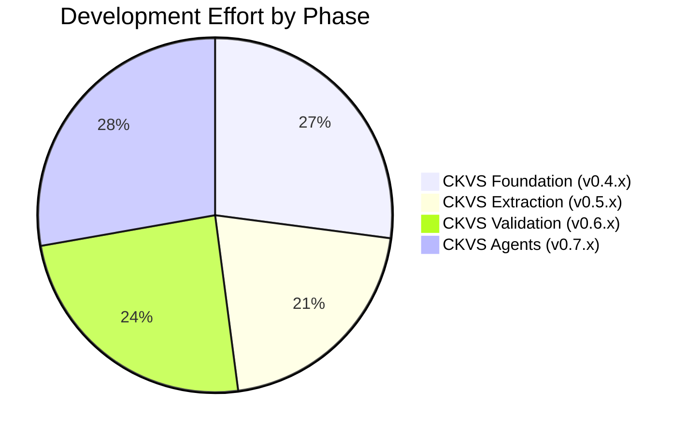

### Recommended Team Allocation

| Phase | Timeline | CKVS FTE | Existing FTE | Notes |
|:------|:---------|:---------|:-------------|:------|
| Foundation | Q2 2026 | 1 | 2 | Parallel with RAG |
| Extraction | Q3 2026 | 1 | 2 | Extends Query Understanding |
| Validation | Q4 2026 | 1.5 | 1.5 | Integrated with Co-pilot |
| Agents | Q1 2027 | 1 | 2 | Enhances existing agents |

**Total CKVS Effort**: ~144 hours (~4 person-months)
**Total Timeline**: 12 months (Q2 2026 - Q1 2027)

---

## Risk Timeline

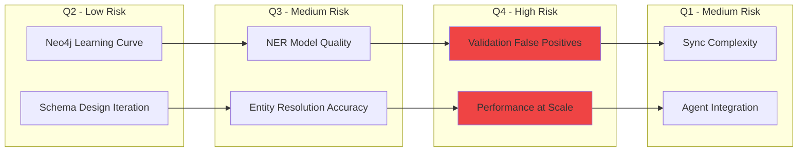

### Risk Mitigation Schedule

| Risk | Phase | Mitigation | Owner |
|:-----|:------|:-----------|:------|
| Neo4j Performance | Q2 | Early benchmarking, HNSW indexing | Backend Lead |
| NER Quality | Q3 | LLM fallback for low-confidence | ML Engineer |
| False Positives | Q4 | Confidence thresholds, user feedback | Product |
| Sync Complexity | Q1 | Event-driven architecture, idempotent ops | Backend Lead |

---

## Success Milestones

### Quarterly Checkpoints

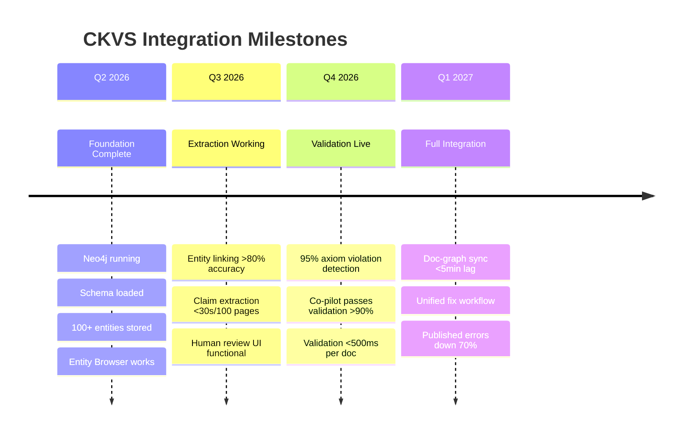

---

## Deferred to Post-v1.0

The following CKVS features are **not included** in this roadmap and are deferred to v0.10.x or later:

| Feature | Reason | Target |
|:--------|:-------|:-------|
| Worldbuilding Extensions | Out of scope for tech docs v1.0 | v0.10.x |
| Character/Location Entities | Worldbuilding feature | v0.10.x |
| Timeline Validation | Worldbuilding feature | v0.10.x |
| Advanced NLU (Fine-tuned Models) | Can launch with rules+LLM | v0.11.x |
| Multi-lingual Support | English-first for v1.0 | v0.11.x |
| Knowledge Graph Versioning | Post-launch optimization | v0.12.x |
| Visual Graph Designer | Advanced tooling | v0.12.x |

---

## Related Documents

- [CKVS Integration Strategy](./CKVS-INTEGRATION-STRATEGY.md) — Detailed integration plan
- [Roadmap v0.4.x](./roadmap-v0.4.x.md) — RAG/Archive phase details
- [Roadmap v0.5.x](./roadmap-v0.5.x.md) — Retrieval phase details
- [Roadmap v0.6.x](./roadmap-v0.6.x.md) — Agents phase details
- [Roadmap v0.7.x](./roadmap-v0.7.x.md) — Specialists phase details
- [v0.4.5-KG Specs](../specs/v0.4.x/v0.4.5/LCS-DES-045-KG-INDEX.md) — Detailed specs index

---

## Document History

| Date | Author | Changes |
|:-----|:-------|:--------|
| 2026-01-31 | Lead Architect | Initial visual roadmap creation |

---
