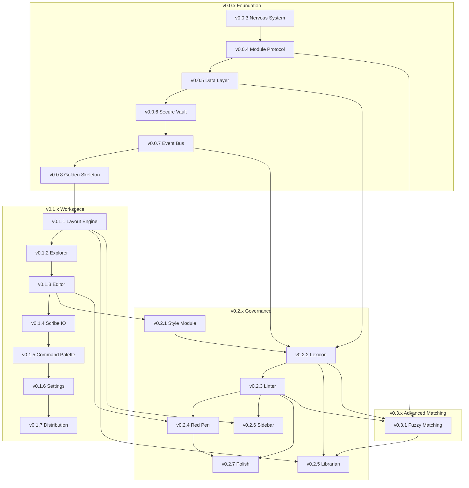

# Lexichord Specification Dependency Matrix

## Document Control

| Field            | Value                                                                  |
| :--------------- | :--------------------------------------------------------------------- |
| **Document ID**  | LCS-DEP-MATRIX                                                         |
| **Last Updated** | 2026-01-28 (v0.0.5d added)                                             |
| **Purpose**      | Cross-reference of all interfaces, services, and their source versions |

---

## 1. Interface Registry

### 1.1 v0.0.x Foundational Interfaces

| Interface                   | Defined In | Module                             | Purpose                                                      |
| :-------------------------- | :--------- | :--------------------------------- | :----------------------------------------------------------- |
| `IModule`                   | v0.0.4a    | Abstractions                       | Module contract for dynamic loading                          |
| `ModuleInfo`                | v0.0.4a    | Abstractions                       | Module metadata record                                       |
| `IModuleLoader`             | v0.0.4b    | Host                               | Module discovery and loading                                 |
| `ILicenseContext`           | v0.0.4c    | Abstractions                       | Read-only license tier access                                |
| `LicenseTier`               | v0.0.4c    | Abstractions                       | Core/WriterPro/Teams/Enterprise enum                         |
| `RequiresLicenseAttribute`  | v0.0.4c    | Abstractions                       | License gating attribute                                     |
| `IDbConnectionFactory`      | v0.0.5b    | Abstractions                       | Database connection creation                                 |
| `IGenericRepository<T,TId>` | v0.0.5d    | Abstractions                       | Base repository pattern                                      |
| `IUserRepository`           | v0.0.5d    | Abstractions                       | User entity repository                                       |
| `ISystemSettingsRepository` | v0.0.5d    | Abstractions                       | Key-value settings repository                                |
| `IUnitOfWork`               | v0.0.5d    | Abstractions                       | Transaction management                                       |
| `EntityBase`                | v0.0.5d    | Abstractions                       | Base entity with audit fields                                |
| `User`                      | v0.0.5d    | Abstractions                       | User entity record                                           |
| `SystemSetting`             | v0.0.5d    | Abstractions                       | SystemSetting entity record                                  |
| `PagedResult<T>`            | v0.0.5d    | Abstractions                       | Pagination result record                                     |
| `ISecureVault`              | v0.0.6a    | Abstractions                       | Secure secrets storage                                       |
| `VaultStatus`               | v0.0.6a    | Abstractions                       | Ready/Empty/Error/Unavailable enum                           |
| `IMediator`                 | v0.0.7a    | MediatR (NuGet)                    | Event bus / CQRS mediator                                    |
| `INotification`             | v0.0.7a    | MediatR (NuGet)                    | Domain event marker                                          |
| `DomainEventBase`           | v0.0.7b    | Abstractions                       | Base class for domain events                                 |
| `IShellRegionView`          | v0.0.8a    | Abstractions                       | Shell region contribution                                    |
| `ShellRegion`               | v0.0.8a    | Abstractions                       | Top/Left/Center/Right/Bottom enum                            |
| `IConfiguration`            | v0.0.3d    | Microsoft.Extensions.Configuration | Configuration access (Microsoft interface, registered in DI) |
| `ILogger<T>`                | v0.0.3b    | Microsoft.Extensions.Logging       | Structured logging (Serilog integration)                     |
| `IThemeManager`             | v0.0.2c    | Host                               | Theme switching (Light/Dark/System)                          |
| `IWindowStateService`       | v0.0.2c    | Host                               | Window position/size persistence                             |

### 1.2 v0.1.x Workspace Interfaces

| Interface                     | Defined In | Module       | Purpose                                      |
| :---------------------------- | :--------- | :----------- | :------------------------------------------- |
| `IDockFactory`                | v0.1.1a    | Abstractions | Dock layout creation                         |
| `IRegionManager`              | v0.1.1b    | Abstractions | Module view injection                        |
| `ILayoutService`              | v0.1.1c    | Abstractions | Layout serialization                         |
| `DocumentViewModel`           | v0.1.1d    | Abstractions | Base class for tabbed documents              |
| `IWorkspaceService`           | v0.1.2a    | Abstractions | Current workspace state                      |
| `IRobustFileSystemWatcher`    | v0.1.2b    | Abstractions | External file change detection               |
| `IFileOperationService`       | v0.1.2d    | Abstractions | File CRUD operations                         |
| `IEditorService`              | v0.1.3a    | Abstractions | Document editing coordination                |
| `IManuscriptViewModel`        | v0.1.3a    | Abstractions | Document ViewModel (editor content source)   |
| `ISyntaxHighlightingService`  | v0.1.3b    | Abstractions | XSHD definition loading                      |
| `ISearchService`              | v0.1.3c    | Abstractions | Find/Replace operations                      |
| `IEditorConfigurationService` | v0.1.3d    | Abstractions | Editor preferences                           |
| `IDirtyStateTracker`          | v0.1.4a    | Abstractions | Unsaved changes tracking                     |
| `IFileService`                | v0.1.4b    | Abstractions | Atomic file I/O                              |
| `IShutdownService`            | v0.1.4c    | Abstractions | Safe close workflow                          |
| `IRecentFilesService`         | v0.1.4d    | Abstractions | MRU file history                             |
| `ICommandRegistry`            | v0.1.5a    | Abstractions | Command registration                         |
| `IFileIndexService`           | v0.1.5c    | Abstractions | Workspace file indexing                      |
| `IKeyBindingService`          | v0.1.5d    | Abstractions | Keyboard shortcut management                 |
| `ISettingsPage`               | v0.1.6a    | Abstractions | Module settings contribution                 |
| `ISettingsService`            | v0.1.6a    | Abstractions | General preferences persistence              |
| `ILicenseService`             | v0.1.6c    | Abstractions | License validation (extends ILicenseContext) |
| `IUpdateService`              | v0.1.7a    | Abstractions | Velopack update management                   |
| `IFirstRunService`            | v0.1.7c    | Abstractions | Version tracking / release notes             |
| `ITelemetryService`           | v0.1.7d    | Abstractions | Optional Sentry crash reporting              |

### 1.3 v0.2.x Governance Interfaces

| Interface                    | Defined In | Module        | Purpose                            |
| :--------------------------- | :--------- | :------------ | :--------------------------------- |
| `IStyleEngine`               | v0.2.1a    | Modules.Style | Core style analysis                |
| `IStyleSheetLoader`          | v0.2.1c    | Modules.Style | YAML stylesheet loading            |
| `IStyleConfigurationWatcher` | v0.2.1d    | Modules.Style | Live file reload                   |
| `StyleRule`                  | v0.2.1b    | Abstractions  | Rule definition record             |
| `StyleSheet`                 | v0.2.1b    | Abstractions  | Aggregate rule container           |
| `RuleCategory`               | v0.2.1b    | Abstractions  | Terminology/Formatting/Syntax enum |
| `ViolationSeverity`          | v0.2.1b    | Abstractions  | Error/Warning/Info/Hint enum       |
| `StyleViolation`             | v0.2.1b    | Abstractions  | Violation result record            |
| `ITerminologyRepository`     | v0.2.2b    | Modules.Style | Cached DB access for terms         |
| `ITerminologySeeder`         | v0.2.2c    | Modules.Style | Bootstrap seed data                |
| `ITerminologyService`        | v0.2.2d    | Modules.Style | CRUD with events                   |
| `StyleTerm`                  | v0.2.2a    | Abstractions  | Term entity model                  |
| `ILintingOrchestrator`       | v0.2.3a    | Modules.Style | Reactive linting coordinator       |
| `ILintingConfiguration`      | v0.2.3b    | Modules.Style | Debounce and settings              |
| `IStyleScanner`              | v0.2.3c    | Modules.Style | Regex pattern matching             |
| `IViolationAggregator`       | v0.2.3d    | Modules.Style | Result aggregation                 |
| `IViolationProvider`         | v0.2.4a    | Modules.Style | Violation data for renderer        |
| `IViolationColorProvider`    | v0.2.4b    | Modules.Style | Theme-aware colors                 |
| `IViolationTooltipService`   | v0.2.4c    | Modules.Style | Hover tooltip display              |
| `IQuickFixService`           | v0.2.4d    | Modules.Style | Context menu fixes                 |
| `ITerminologyImporter`       | v0.2.5d    | Modules.Style | CSV/Excel import                   |
| `ITerminologyExporter`       | v0.2.5d    | Modules.Style | JSON export                        |
| `IProblemsPanelViewModel`    | v0.2.6a    | Modules.Style | Problems panel state               |
| `IEditorNavigationService`   | v0.2.6b    | Abstractions  | Cross-document navigation          |
| `IScorecardViewModel`        | v0.2.6c    | Modules.Style | Compliance score widget            |
| `IProjectLintingService`     | v0.2.6d    | Modules.Style | Background project scanning        |
| `IThreadMarshaller`          | v0.2.7a    | Abstractions  | UI thread dispatching              |
| `IContentFilter`             | v0.2.7b    | Modules.Style | Pre-scan content filtering         |

### 1.4 v0.3.x Fuzzy Engine Interfaces

| Interface                 | Defined In | Module        | Purpose                                        |
| :------------------------ | :--------- | :------------ | :--------------------------------------------- |
| `IFuzzyMatchService`      | v0.3.1a    | Abstractions  | Levenshtein distance / fuzzy ratio calculation |
| `IDocumentTokenizer`      | v0.3.1c    | Abstractions  | Text tokenization for scanning                 |
| `IFuzzyScanner`           | v0.3.1c    | Abstractions  | Fuzzy violation detection                      |
| `FeatureKeys`             | v0.3.1d    | Abstractions  | Feature gate key constants                     |
| `IFeatureMatrix`          | v0.3.1d    | Abstractions  | Feature → License tier mapping                 |
| `IModuleFeatureRegistrar` | v0.3.1d    | Abstractions  | Module feature registration contract           |
| `StyleFeatureRegistry`    | v0.3.1d    | Modules.Style | Style module feature registration              |

### 1.5 v0.2.5 Dictionary Manager Interfaces (Consolidated)

> **Note:** These interfaces were originally planned for v0.3.2 but have been consolidated into v0.2.5 per ADR decision. See [roadmap-v0.3.x.md](v0.3.x/roadmap-v0.3.x.md) for details.

| Interface              | Defined In | Module       | Purpose                         |
| :--------------------- | :--------- | :----------- | :------------------------------ |
| `IDialogService`       | v0.2.5b    | Abstractions | Modal dialog management         |
| `ITerminologyImporter` | v0.2.5d    | Abstractions | CSV import contract (enhanced)  |
| `ITerminologyExporter` | v0.2.5d    | Abstractions | JSON export contract (enhanced) |

**New Records (v0.2.5 Dictionary Manager):**

| Record            | Defined In | Module        | Purpose                          |
| :---------------- | :--------- | :------------ | :------------------------------- |
| `StyleTermDto`    | v0.2.5a    | Modules.Style | View-layer term representation   |
| `DialogResult<T>` | v0.2.5b    | Abstractions  | Dialog return value wrapper      |
| `ImportMapping`   | v0.2.5d    | Abstractions  | CSV column to DB field mapping   |
| `ImportResult`    | v0.2.5d    | Abstractions  | Import operation outcome         |
| `ImportOptions`   | v0.2.5d    | Abstractions  | Skip/overwrite configuration     |
| `ImportError`     | v0.2.5d    | Abstractions  | Row-level import failure details |
| `ExportDocument`  | v0.2.5d    | Modules.Style | Export JSON structure            |
| `ExportedTerm`    | v0.2.5d    | Modules.Style | Term representation in export    |

**New Classes (v0.2.5 Dictionary Manager):**

| Class                     | Defined In | Module        | Purpose                          |
| :------------------------ | :--------- | :------------ | :------------------------------- |
| `StyleTermValidator`      | v0.2.5c    | Modules.Style | FluentValidation validator       |
| `ValidationConstants`     | v0.2.5c    | Modules.Style | Centralized validation constants |
| `CsvTerminologyImporter`  | v0.2.5d    | Modules.Style | CSV import implementation        |
| `JsonTerminologyExporter` | v0.2.5d    | Modules.Style | JSON export implementation       |
| `LexiconViewModel`        | v0.2.5a    | Modules.Style | DataGrid ViewModel               |
| `TermEditorViewModel`     | v0.2.5b    | Modules.Style | Term editor dialog ViewModel     |
| `ImportWizardViewModel`   | v0.2.5d    | Modules.Style | Import wizard ViewModel          |

**Extended Records (v0.3.1):**

| Record           | Extended In | New Properties                   | Purpose                      |
| :--------------- | :---------- | :------------------------------- | :--------------------------- |
| `StyleTerm`      | v0.3.1b     | `FuzzyEnabled`, `FuzzyThreshold` | Per-term fuzzy configuration |
| `StyleViolation` | v0.3.1c     | `IsFuzzyMatch`, `FuzzyRatio`     | Fuzzy match identification   |

**Extended Interfaces (v0.3.1):**

| Interface                | Extended In | New Methods                   | Purpose                   |
| :----------------------- | :---------- | :---------------------------- | :------------------------ |
| `ITerminologyRepository` | v0.3.1b     | `GetFuzzyEnabledTermsAsync()` | Query fuzzy-enabled terms |

### 1.6 v0.4.1 Vector Foundation Interfaces

| Interface             | Defined In | Module       | Purpose                                    |
| :-------------------- | :--------- | :----------- | :----------------------------------------- |
| `IDocumentRepository` | v0.4.1c    | Abstractions | Document CRUD operations for RAG indexing  |
| `IChunkRepository`    | v0.4.1c    | Abstractions | Chunk storage and vector similarity search |

**New Records (v0.4.1):**

| Record              | Defined In | Module       | Purpose                          |
| :------------------ | :--------- | :----------- | :------------------------------- |
| `Document`          | v0.4.1c    | Abstractions | Indexed document entity          |
| `Chunk`             | v0.4.1c    | Abstractions | Text chunk with vector embedding |
| `ChunkSearchResult` | v0.4.1c    | Abstractions | Vector search result with score  |

**New Enums (v0.4.1):**

| Enum             | Defined In | Module       | Purpose                               |
| :--------------- | :--------- | :----------- | :------------------------------------ |
| `DocumentStatus` | v0.4.1c    | Abstractions | Pending/Indexing/Indexed/Failed/Stale |

**New Classes (v0.4.1):**

| Class                | Defined In | Module      | Purpose                                      |
| :------------------- | :--------- | :---------- | :------------------------------------------- |
| `VectorTypeHandler`  | v0.4.1d    | Modules.RAG | Dapper type handler for float[] ↔ VECTOR     |
| `DocumentRepository` | v0.4.1d    | Modules.RAG | Dapper implementation of IDocumentRepository |
| `ChunkRepository`    | v0.4.1d    | Modules.RAG | Dapper implementation with vector search     |

### 1.7 v0.4.2 File Ingestion Pipeline Interfaces

| Interface                      | Defined In | Module       | Purpose                               |
| :----------------------------- | :--------- | :----------- | :------------------------------------ |
| `IIngestionService`            | v0.4.2a    | Abstractions | File ingestion operations             |
| `IFileHashService`             | v0.4.2b    | Abstractions | SHA-256 hash computation & comparison |
| `IIngestionQueue`              | v0.4.2d    | Abstractions | Queue management for ingestion        |
| `IFileWatcherIngestionHandler` | v0.4.2c    | Modules.RAG  | File watcher event handling           |

**New Records (v0.4.2):**

| Record                       | Defined In | Module       | Purpose                          |
| :--------------------------- | :--------- | :----------- | :------------------------------- |
| `IngestionResult`            | v0.4.2a    | Abstractions | Ingestion operation result       |
| `IngestionProgressEventArgs` | v0.4.2a    | Abstractions | Progress reporting event args    |
| `IngestionOptions`           | v0.4.2a    | Abstractions | Ingestion configuration settings |
| `FileMetadata`               | v0.4.2b    | Abstractions | File size and modification time  |
| `FileMetadataWithHash`       | v0.4.2b    | Abstractions | Metadata with computed hash      |
| `FileWatcherOptions`         | v0.4.2c    | Modules.RAG  | File watcher configuration       |
| `IngestionQueueOptions`      | v0.4.2d    | Modules.RAG  | Queue configuration settings     |
| `IngestionQueueEventArgs`    | v0.4.2d    | Abstractions | Queue item processed event args  |
| `QueueStateChangedEventArgs` | v0.4.2d    | Abstractions | Queue state change event args    |
| `QueueItem`                  | v0.4.2d    | Modules.RAG  | Internal queue item record       |

**New Enums (v0.4.2):**

| Enum                | Defined In | Module       | Purpose                                |
| :------------------ | :--------- | :----------- | :------------------------------------- |
| `IngestionPhase`    | v0.4.2a    | Abstractions | Scanning/Hashing/Reading/Chunking/etc. |
| `FileChangeType`    | v0.4.2c    | Modules.RAG  | Created/Modified/Deleted/Renamed       |
| `IngestionPriority` | v0.4.2d    | Abstractions | Low/Normal/High queue priority         |
| `QueueStateChange`  | v0.4.2d    | Abstractions | ItemEnqueued/Dequeued/Started/Stopped  |

**New Classes (v0.4.2):**

| Class                         | Defined In | Module      | Purpose                                     |
| :---------------------------- | :--------- | :---------- | :------------------------------------------ |
| `FileHashService`             | v0.4.2b    | Modules.RAG | SHA-256 streaming hash implementation       |
| `FileWatcherIngestionHandler` | v0.4.2c    | Modules.RAG | Debounced file watcher event handler        |
| `IngestionQueue`              | v0.4.2d    | Modules.RAG | Channel-based priority queue implementation |
| `IngestionBackgroundService`  | v0.4.2d    | Modules.RAG | HostedService for queue consumption         |

### 1.8 v0.4.3 Chunking Strategies Interfaces

| Interface           | Defined In | Module       | Purpose                     |
| :------------------ | :--------- | :----------- | :-------------------------- |
| `IChunkingStrategy` | v0.4.3a    | Abstractions | Chunking algorithm contract |

**New Records (v0.4.3):**

| Record            | Defined In | Module       | Purpose                               |
| :---------------- | :--------- | :----------- | :------------------------------------ |
| `TextChunk`       | v0.4.3a    | Abstractions | Chunk with content and position       |
| `ChunkMetadata`   | v0.4.3a    | Abstractions | Chunk context (index, heading, level) |
| `ChunkingOptions` | v0.4.3a    | Abstractions | Chunking configuration options        |

**New Enums (v0.4.3):**

| Enum           | Defined In | Module       | Purpose                                     |
| :------------- | :--------- | :----------- | :------------------------------------------ |
| `ChunkingMode` | v0.4.3a    | Abstractions | FixedSize/Paragraph/MarkdownHeader/Semantic |

**New Classes (v0.4.3):**

| Class                            | Defined In | Module       | Purpose                                      |
| :------------------------------- | :--------- | :----------- | :------------------------------------------- |
| `FixedSizeChunkingStrategy`      | v0.4.3b    | Modules.RAG  | Character-count based splitting with overlap |
| `ParagraphChunkingStrategy`      | v0.4.3c    | Modules.RAG  | Paragraph boundary detection with merging    |
| `MarkdownHeaderChunkingStrategy` | v0.4.3d    | Modules.RAG  | Hierarchical header-based chunking           |
| `ChunkingStrategyFactory`        | v0.4.3     | Modules.RAG  | Factory for strategy selection               |
| `ChunkingPresets`                | v0.4.3a    | Abstractions | Predefined chunking configurations           |

### 1.9 v0.4.4 Embedding/Vector Generation Interfaces

| Interface           | Defined In | Module       | Purpose                       |
| :------------------ | :--------- | :----------- | :---------------------------- |
| `IEmbeddingService` | v0.4.4a    | Abstractions | Embedding generation contract |
| `ITokenCounter`     | v0.4.4c    | Abstractions | Token counting and truncation |

**New Records (v0.4.4):**

| Record             | Defined In | Module       | Purpose                               |
| :----------------- | :--------- | :----------- | :------------------------------------ |
| `EmbeddingOptions` | v0.4.4a    | Abstractions | Embedding configuration (model, dims) |
| `EmbeddingResult`  | v0.4.4a    | Abstractions | Embedding operation result            |
| `IndexingResult`   | v0.4.4d    | Modules.RAG  | Pipeline operation result             |

**New Classes (v0.4.4):**

| Class                         | Defined In | Module       | Purpose                                 |
| :---------------------------- | :--------- | :----------- | :-------------------------------------- |
| `OpenAIEmbeddingService`      | v0.4.4b    | Modules.RAG  | OpenAI API integration with retry logic |
| `TiktokenTokenCounter`        | v0.4.4c    | Modules.RAG  | Token counting using ML.Tokenizers      |
| `DocumentIndexingPipeline`    | v0.4.4d    | Modules.RAG  | Orchestrates chunk→embed→store flow     |
| `EmbeddingException`          | v0.4.4a    | Abstractions | Exception for embedding failures        |
| `FeatureNotLicensedException` | v0.4.4d    | Modules.RAG  | Exception for license enforcement       |

### 1.10 v0.4.5 Semantic Search Interfaces

| Interface                | Defined In | Module       | Purpose                         |
| :----------------------- | :--------- | :----------- | :------------------------------ |
| `ISemanticSearchService` | v0.4.5a    | Abstractions | Semantic search contract        |
| `IQueryPreprocessor`     | v0.4.5c    | Modules.RAG  | Query normalization and caching |

**New Records (v0.4.5):**

| Record          | Defined In | Module       | Purpose                               |
| :-------------- | :--------- | :----------- | :------------------------------------ |
| `SearchOptions` | v0.4.5a    | Abstractions | Search configuration (TopK, MinScore) |
| `SearchResult`  | v0.4.5a    | Abstractions | Search result container               |
| `SearchHit`     | v0.4.5a    | Abstractions | Individual search match               |

**New Classes (v0.4.5):**

| Class                   | Defined In | Module      | Purpose                           |
| :---------------------- | :--------- | :---------- | :-------------------------------- |
| `PgVectorSearchService` | v0.4.5b    | Modules.RAG | pgvector cosine similarity search |
| `QueryPreprocessor`     | v0.4.5c    | Modules.RAG | Query normalization and caching   |
| `SearchLicenseGuard`    | v0.4.5d    | Modules.RAG | License validation helper         |

### 1.11 v0.4.6 Reference Panel Interfaces

| Interface                     | Defined In | Module      | Purpose                     |
| :---------------------------- | :--------- | :---------- | :-------------------------- |
| `IReferenceNavigationService` | v0.4.6c    | Modules.RAG | Result navigation to source |
| `ISearchHistoryService`       | v0.4.6d    | Modules.RAG | Query history management    |

**New ViewModels (v0.4.6):**

| ViewModel                   | Defined In | Module      | Purpose                |
| :-------------------------- | :--------- | :---------- | :--------------------- |
| `ReferenceViewModel`        | v0.4.6a    | Modules.RAG | Panel state management |
| `SearchResultItemViewModel` | v0.4.6b    | Modules.RAG | Result item display    |

**New Classes (v0.4.6):**

| Class                        | Defined In | Module      | Purpose                        |
| :--------------------------- | :--------- | :---------- | :----------------------------- |
| `ReferenceNavigationService` | v0.4.6c    | Modules.RAG | Result-to-source navigation    |
| `SearchHistoryService`       | v0.4.6d    | Modules.RAG | Query history with persistence |
| `HighlightedTextBlock`       | v0.4.6b    | Modules.RAG | Text highlighting control      |

**New Enums (v0.4.6):**

| Enum                      | Defined In | Module       | Purpose                             |
| :------------------------ | :--------- | :----------- | :---------------------------------- |
| `HighlightStyle`          | v0.4.6c    | Abstractions | Text highlight styles in editor     |
| `SearchHistoryChangeType` | v0.4.6d    | Modules.RAG  | Type of history change (Added, etc) |

**New Event Args (v0.4.6):**

| Record/Class                    | Defined In | Module      | Purpose                        |
| :------------------------------ | :--------- | :---------- | :----------------------------- |
| `SearchHistoryChangedEventArgs` | v0.4.6d    | Modules.RAG | Event args for history changes |

### 1.12 v0.4.7 Index Manager Interfaces

| Interface                 | Defined In | Module      | Purpose                    |
| :------------------------ | :--------- | :---------- | :------------------------- |
| `IIndexStatusService`     | v0.4.7a    | Modules.RAG | Index status aggregation   |
| `IIndexManagementService` | v0.4.7b    | Modules.RAG | Manual indexing operations |

**New ViewModels (v0.4.7):**

| ViewModel                   | Defined In | Module      | Purpose                   |
| :-------------------------- | :--------- | :---------- | :------------------------ |
| `IndexStatusViewModel`      | v0.4.7a    | Modules.RAG | Document list state       |
| `IndexedDocumentViewModel`  | v0.4.7a    | Modules.RAG | Individual document state |
| `IndexingProgressViewModel` | v0.4.7c    | Modules.RAG | Progress state            |

**New Records (v0.4.7):**

| Record                 | Defined In | Module      | Purpose              |
| :--------------------- | :--------- | :---------- | :------------------- |
| `IndexedDocumentInfo`  | v0.4.7a    | Modules.RAG | Document status info |
| `IndexStatistics`      | v0.4.7a    | Modules.RAG | Summary statistics   |
| `IndexOperationResult` | v0.4.7b    | Modules.RAG | Operation result     |
| `IndexingProgressInfo` | v0.4.7b    | Modules.RAG | Progress information |
| `IndexingErrorInfo`    | v0.4.7d    | Modules.RAG | Error details        |

**New Classes (v0.4.7):**

| Class                      | Defined In | Module      | Purpose                        |
| :------------------------- | :--------- | :---------- | :----------------------------- |
| `IndexStatusService`       | v0.4.7a    | Modules.RAG | Index status implementation    |
| `IndexManagementService`   | v0.4.7b    | Modules.RAG | Manual indexing implementation |
| `IndexingErrorCategorizer` | v0.4.7d    | Modules.RAG | Error categorization helper    |

**New Enums (v0.4.7):**

| Enum                    | Defined In | Module      | Purpose                          |
| :---------------------- | :--------- | :---------- | :------------------------------- |
| `IndexingStatus`        | v0.4.7a    | Modules.RAG | Document indexing status         |
| `IndexOperationType`    | v0.4.7b    | Modules.RAG | Type of index operation          |
| `IndexingErrorCategory` | v0.4.7d    | Modules.RAG | Error categorization for display |

**New Events (v0.4.7):**

| Event                           | Defined In | Module      | Purpose                    |
| :------------------------------ | :--------- | :---------- | :------------------------- |
| `IndexOperationRequestedEvent`  | v0.4.7b    | Modules.RAG | Index operation requested  |
| `IndexOperationCompletedEvent`  | v0.4.7b    | Modules.RAG | Index operation completed  |
| `IndexingProgressUpdatedEvent`  | v0.4.7c    | Modules.RAG | Progress update during ops |
| `DocumentRemovedFromIndexEvent` | v0.4.7b    | Modules.RAG | Document removed from idx  |

### 1.13 v0.4.8 Hardening Interfaces

| Interface         | Defined In | Module       | Purpose                  |
| :---------------- | :--------- | :----------- | :----------------------- |
| `IEmbeddingCache` | v0.4.8d    | Abstractions | Embedding cache contract |

**New Classes (v0.4.8):**

| Class                    | Defined In | Module      | Purpose                            |
| :----------------------- | :--------- | :---------- | :--------------------------------- |
| `SqliteEmbeddingCache`   | v0.4.8d    | Modules.RAG | SQLite-based embedding cache       |
| `CachedEmbeddingService` | v0.4.8d    | Modules.RAG | Decorator adding cache to embedder |

**New Records (v0.4.8):**

| Record                     | Defined In | Module      | Purpose                     |
| :------------------------- | :--------- | :---------- | :-------------------------- |
| `EmbeddingCacheStatistics` | v0.4.8d    | Modules.RAG | Cache hit/miss metrics      |
| `EmbeddingCacheOptions`    | v0.4.8d    | Modules.RAG | Cache configuration options |

### 1.14 v0.5.1 Hybrid Engine Interfaces

| Interface              | Defined In | Module       | Purpose                             |
| :--------------------- | :--------- | :----------- | :---------------------------------- |
| `IBM25SearchService`   | v0.5.1b    | Abstractions | BM25 full-text keyword search       |
| `IHybridSearchService` | v0.5.1c    | Abstractions | Combined RRF search (BM25+Semantic) |

**New Classes (v0.5.1):**

| Class                 | Defined In | Module      | Purpose                          |
| :-------------------- | :--------- | :---------- | :------------------------------- |
| `BM25SearchService`   | v0.5.1b    | Modules.RAG | PostgreSQL full-text search impl |
| `HybridSearchService` | v0.5.1c    | Modules.RAG | RRF fusion algorithm impl        |

**New Records (v0.5.1):**

| Record                | Defined In | Module      | Purpose                      |
| :-------------------- | :--------- | :---------- | :--------------------------- |
| `BM25Hit`             | v0.5.1b    | Modules.RAG | BM25 search result with rank |
| `HybridSearchOptions` | v0.5.1c    | Modules.RAG | RRF weights and k constant   |

**New Enums (v0.5.1):**

| Enum         | Defined In | Module       | Purpose                              |
| :----------- | :--------- | :----------- | :----------------------------------- |
| `SearchMode` | v0.5.1d    | Abstractions | Semantic/Keyword/Hybrid search modes |

### 1.15 v0.5.2 Citation Engine Interfaces

| Interface                   | Defined In | Module       | Purpose                      |
| :-------------------------- | :--------- | :----------- | :--------------------------- |
| `ICitationService`          | v0.5.2a    | Abstractions | Citation creation/formatting |
| `ICitationFormatter`        | v0.5.2b    | Abstractions | Style-specific formatting    |
| `ICitationValidator`        | v0.5.2c    | Abstractions | Freshness validation         |
| `ICitationClipboardService` | v0.5.2d    | Abstractions | Clipboard operations         |

**New Classes (v0.5.2):**

| Class                       | Defined In | Module      | Purpose                       |
| :-------------------------- | :--------- | :---------- | :---------------------------- |
| `CitationService`           | v0.5.2a    | Modules.RAG | Citation creation logic       |
| `CitationValidator`         | v0.5.2c    | Modules.RAG | File freshness validation     |
| `CitationClipboardService`  | v0.5.2d    | Modules.RAG | Clipboard copy operations     |
| `InlineCitationFormatter`   | v0.5.2b    | Modules.RAG | [doc.md, §Heading] format     |
| `FootnoteCitationFormatter` | v0.5.2b    | Modules.RAG | [^id]: path:line format       |
| `MarkdownCitationFormatter` | v0.5.2b    | Modules.RAG | [Title](file://path#L) format |
| `CitationFormatterRegistry` | v0.5.2b    | Modules.RAG | Formatter lookup and prefs    |

**New Records (v0.5.2):**

| Record                     | Defined In | Module       | Purpose                 |
| :------------------------- | :--------- | :----------- | :---------------------- |
| `Citation`                 | v0.5.2a    | Abstractions | Source attribution data |
| `CitationValidationResult` | v0.5.2c    | Abstractions | Validation outcome      |

**New Enums (v0.5.2):**

| Enum                       | Defined In | Module       | Purpose                   |
| :------------------------- | :--------- | :----------- | :------------------------ |
| `CitationStyle`            | v0.5.2a    | Abstractions | Inline/Footnote/Markdown  |
| `CitationValidationStatus` | v0.5.2c    | Abstractions | Valid/Stale/Missing/Error |

### 1.16 v0.5.3 Context Window Interfaces

| Interface                  | Defined In | Module       | Purpose                     |
| :------------------------- | :--------- | :----------- | :-------------------------- |
| `IContextExpansionService` | v0.5.3a    | Abstractions | Expand chunks with context  |
| `IHeadingHierarchyService` | v0.5.3c    | Abstractions | Resolve heading breadcrumbs |

**New Classes (v0.5.3):**

| Class                     | Defined In | Module      | Purpose                    |
| :------------------------ | :--------- | :---------- | :------------------------- |
| `ContextExpansionService` | v0.5.3a    | Modules.RAG | Context aggregation logic  |
| `HeadingHierarchyService` | v0.5.3c    | Modules.RAG | Breadcrumb resolution      |
| `ContextPreviewViewModel` | v0.5.3d    | Modules.RAG | Expansion state management |

**New Records (v0.5.3):**

| Record           | Defined In | Module       | Purpose                        |
| :--------------- | :--------- | :----------- | :----------------------------- |
| `ContextOptions` | v0.5.3a    | Abstractions | Expansion configuration        |
| `ExpandedChunk`  | v0.5.3a    | Abstractions | Chunk with surrounding context |
| `HeadingNode`    | v0.5.3c    | Abstractions | Heading hierarchy tree node    |

### 1.17 v0.5.4 Relevance Tuner Interfaces

| Interface                 | Defined In | Module       | Purpose                        |
| :------------------------ | :--------- | :----------- | :----------------------------- |
| `IQueryAnalyzer`          | v0.5.4a    | Abstractions | Query structure/intent parsing |
| `IQueryExpander`          | v0.5.4b    | Abstractions | Synonym-based expansion        |
| `IQuerySuggestionService` | v0.5.4c    | Abstractions | Autocomplete suggestions       |
| `IQueryHistoryService`    | v0.5.4d    | Abstractions | Search pattern tracking        |

**New Classes (v0.5.4):**

| Class                    | Defined In | Module      | Purpose                        |
| :----------------------- | :--------- | :---------- | :----------------------------- |
| `QueryAnalyzer`          | v0.5.4a    | Modules.RAG | Keyword/entity/intent analysis |
| `QueryExpander`          | v0.5.4b    | Modules.RAG | Terminology-based expansion    |
| `QuerySuggestionService` | v0.5.4c    | Modules.RAG | N-gram based suggestions       |
| `QueryHistoryService`    | v0.5.4d    | Modules.RAG | Query recording and analytics  |
| `SuggestionPopup`        | v0.5.4c    | Modules.RAG | Autocomplete UI component      |

**New Records (v0.5.4):**

| Record              | Defined In | Module       | Purpose                    |
| :------------------ | :--------- | :----------- | :------------------------- |
| `QueryAnalysis`     | v0.5.4a    | Abstractions | Analysis results container |
| `QueryEntity`       | v0.5.4a    | Abstractions | Recognized entity in query |
| `ExpandedQuery`     | v0.5.4b    | Abstractions | Query with added synonyms  |
| `Synonym`           | v0.5.4b    | Abstractions | Synonym term with weight   |
| `ExpansionOptions`  | v0.5.4b    | Abstractions | Expansion configuration    |
| `QuerySuggestion`   | v0.5.4c    | Abstractions | Autocomplete suggestion    |
| `QueryHistoryEntry` | v0.5.4d    | Abstractions | Recorded query entry       |
| `ZeroResultQuery`   | v0.5.4d    | Abstractions | Content gap identification |

**New Enums (v0.5.4):**

| Enum               | Defined In | Module       | Purpose                      |
| :----------------- | :--------- | :----------- | :--------------------------- |
| `QueryIntent`      | v0.5.4a    | Abstractions | Factual/Procedural/etc.      |
| `EntityType`       | v0.5.4a    | Abstractions | Code/FilePath/Domain/etc.    |
| `SynonymSource`    | v0.5.4b    | Abstractions | Terminology/Algorithmic/etc. |
| `SuggestionSource` | v0.5.4c    | Abstractions | QueryHistory/Heading/Ngram   |

### 1.18 v0.5.5 Filter System Interfaces

| Interface              | Defined In | Module       | Purpose                      |
| :--------------------- | :--------- | :----------- | :--------------------------- |
| `IFilterQueryBuilder`  | v0.5.5c    | Abstractions | SQL filter clause generation |
| `IFilterPresetService` | v0.5.5d    | Abstractions | Saved preset management      |
| `IFilterValidator`     | v0.5.5a    | Abstractions | Filter criteria validation   |

**New Classes (v0.5.5):**

| Class                        | Defined In | Module      | Purpose                    |
| :--------------------------- | :--------- | :---------- | :------------------------- |
| `FilterQueryBuilder`         | v0.5.5c    | Modules.RAG | SQL WHERE clause builder   |
| `FilterPresetService`        | v0.5.5d    | Modules.RAG | Preset persistence service |
| `SearchFilterPanel`          | v0.5.5b    | Modules.RAG | Filter panel UI view       |
| `SearchFilterPanelViewModel` | v0.5.5b    | Modules.RAG | Filter state management    |

**New Records (v0.5.5):**

| Record              | Defined In | Module       | Purpose                   |
| :------------------ | :--------- | :----------- | :------------------------ |
| `SearchFilter`      | v0.5.5a    | Abstractions | Filter criteria container |
| `DateRange`         | v0.5.5a    | Abstractions | Temporal filter bounds    |
| `FilterPreset`      | v0.5.5a    | Abstractions | Saved configuration       |
| `FilterQueryResult` | v0.5.5c    | Abstractions | SQL clauses + parameters  |

**New Enums (v0.5.5):**

| Enum              | Defined In | Module      | Purpose                    |
| :---------------- | :--------- | :---------- | :------------------------- |
| `DateRangeOption` | v0.5.5b    | Modules.RAG | AnyTime/LastDay/Custom/etc |

### 1.19 v0.5.6 Answer Preview Interfaces

| Interface                   | Defined In | Module       | Purpose                     |
| :-------------------------- | :--------- | :----------- | :-------------------------- |
| `ISnippetService`           | v0.5.6a    | Abstractions | Snippet extraction          |
| `IHighlightRenderer`        | v0.5.6b    | Modules.RAG  | Platform-agnostic rendering |
| `ISentenceBoundaryDetector` | v0.5.6c    | Abstractions | Sentence boundary detection |

**New Classes (v0.5.6):**

| Class                       | Defined In | Module      | Purpose                     |
| :-------------------------- | :--------- | :---------- | :-------------------------- |
| `SnippetService`            | v0.5.6a    | Modules.RAG | Snippet extraction logic    |
| `HighlightedSnippetControl` | v0.5.6b    | Modules.RAG | Snippet display UI control  |
| `SentenceBoundaryDetector`  | v0.5.6c    | Modules.RAG | Sentence boundary detection |
| `MultiSnippetViewModel`     | v0.5.6d    | Modules.RAG | Expandable snippet state    |

**New Records (v0.5.6):**

| Record             | Defined In | Module       | Purpose                   |
| :----------------- | :--------- | :----------- | :------------------------ |
| `Snippet`          | v0.5.6a    | Abstractions | Extracted snippet content |
| `HighlightSpan`    | v0.5.6a    | Abstractions | Match position and type   |
| `SnippetOptions`   | v0.5.6a    | Abstractions | Extraction configuration  |
| `HighlightTheme`   | v0.5.6b    | Modules.RAG  | Highlight colors          |
| `SentenceBoundary` | v0.5.6c    | Abstractions | Sentence position         |

**New Enums (v0.5.6):**

| Enum            | Defined In | Module       | Purpose                         |
| :-------------- | :--------- | :----------- | :------------------------------ |
| `HighlightType` | v0.5.6a    | Abstractions | QueryMatch/FuzzyMatch/KeyPhrase |

### 1.20 v0.5.7 Reference Dock Interfaces

| Interface                | Defined In | Module      | Purpose                       |
| :----------------------- | :--------- | :---------- | :---------------------------- |
| `IResultGroupingService` | v0.5.7b    | Modules.RAG | Group results by document     |
| `ISearchActionsService`  | v0.5.7d    | Modules.RAG | Copy/export/open bulk actions |

**New Classes (v0.5.7):**

| Class                    | Defined In | Module      | Purpose                  |
| :----------------------- | :--------- | :---------- | :----------------------- |
| `ResultGroupingService`  | v0.5.7b    | Modules.RAG | Document grouping logic  |
| `SearchActionsService`   | v0.5.7d    | Modules.RAG | Export and copy actions  |
| `PreviewPaneView`        | v0.5.7c    | Modules.RAG | Preview panel UI         |
| `PreviewPaneViewModel`   | v0.5.7c    | Modules.RAG | Preview state management |
| `GroupedResultsView`     | v0.5.7b    | Modules.RAG | Grouped list UI          |
| `FilterChipPanel`        | v0.5.7a    | Modules.RAG | Active filter display    |
| `SearchModeToggleButton` | v0.5.7a    | Modules.RAG | Mode selection control   |

**New Records (v0.5.7):**

| Record                  | Defined In | Module      | Purpose                   |
| :---------------------- | :--------- | :---------- | :------------------------ |
| `FilterChip`            | v0.5.7a    | Modules.RAG | Active filter display     |
| `GroupedSearchResults`  | v0.5.7b    | Modules.RAG | Grouped result container  |
| `DocumentResultGroup`   | v0.5.7b    | Modules.RAG | Single document's results |
| `ResultGroupingOptions` | v0.5.7b    | Modules.RAG | Grouping configuration    |
| `ExportOptions`         | v0.5.7d    | Modules.RAG | Export configuration      |
| `ExportResult`          | v0.5.7d    | Modules.RAG | Export operation result   |

**New Enums (v0.5.7):**

| Enum             | Defined In | Module      | Purpose                   |
| :--------------- | :--------- | :---------- | :------------------------ |
| `FilterChipType` | v0.5.7a    | Modules.RAG | Path/Extension/DateRange  |
| `ResultSortMode` | v0.5.7b    | Modules.RAG | Relevance/Path/MatchCount |
| `CopyFormat`     | v0.5.7d    | Modules.RAG | Markdown/PlainText        |
| `ExportFormat`   | v0.5.7d    | Modules.RAG | JSON/CSV/Markdown         |

### 1.21 v0.5.8 Hardening Interfaces

| Interface                     | Defined In | Module      | Purpose                        |
| :---------------------------- | :--------- | :---------- | :----------------------------- |
| `IRetrievalMetricsCalculator` | v0.5.8a    | Tests       | Quality metrics calculation    |
| `IQueryResultCache`           | v0.5.8c    | Modules.RAG | Query result caching           |
| `IResilientSearchService`     | v0.5.8d    | Modules.RAG | Resilient search with fallback |

**New Classes (v0.5.8):**

| Class                        | Defined In | Module      | Purpose                       |
| :--------------------------- | :--------- | :---------- | :---------------------------- |
| `RetrievalMetricsCalculator` | v0.5.8a    | Tests       | P@K, R@K, MRR calculations    |
| `RetrievalQualityTests`      | v0.5.8a    | Tests       | Quality test suite            |
| `SearchBenchmarks`           | v0.5.8b    | Benchmarks  | BenchmarkDotNet suite         |
| `QueryResultCache`           | v0.5.8c    | Modules.RAG | LRU + TTL query caching       |
| `ContextExpansionCache`      | v0.5.8c    | Modules.RAG | Session-based context caching |
| `ResilientSearchService`     | v0.5.8d    | Modules.RAG | Fallback and retry logic      |

**New Records (v0.5.8):**

| Record                  | Defined In | Module      | Purpose                             |
| :---------------------- | :--------- | :---------- | :---------------------------------- |
| `QueryResult`           | v0.5.8a    | Tests       | Quality test result container       |
| `CacheStatistics`       | v0.5.8c    | Modules.RAG | Cache monitoring metrics            |
| `QueryCacheOptions`     | v0.5.8c    | Modules.RAG | Cache configuration                 |
| `ResilientSearchResult` | v0.5.8d    | Modules.RAG | Search result with degradation info |
| `SearchHealthStatus`    | v0.5.8d    | Modules.RAG | Dependency health snapshot          |

**New Enums (v0.5.8):**

| Enum                 | Defined In | Module      | Purpose                          |
| :------------------- | :--------- | :---------- | :------------------------------- |
| `DegradedSearchMode` | v0.5.8d    | Modules.RAG | Full/KeywordOnly/CachedOnly/Down |

## 2. MediatR Events Registry

| Event                           | Defined In | Purpose                           |
| :------------------------------ | :--------- | :-------------------------------- |
| `ModuleInitializedEvent`        | v0.0.8     | Module loaded and ready           |
| `SystemHealthChangedEvent`      | v0.0.8     | Health status change              |
| `VaultStatusChangedEvent`       | v0.0.8     | Vault availability change         |
| `SettingsChangedEvent`          | v0.0.7b    | Configuration value changed       |
| `LayoutChangedEvent`            | v0.1.1c    | Layout state change               |
| `ViewRegisteredEvent`           | v0.1.1b    | View added to region              |
| `WorkspaceOpenedEvent`          | v0.1.2a    | Workspace folder opened           |
| `WorkspaceClosedEvent`          | v0.1.2a    | Workspace folder closed           |
| `FileCreatedEvent`              | v0.1.2d    | New file created                  |
| `FileDeletedEvent`              | v0.1.2d    | File deleted                      |
| `FileRenamedEvent`              | v0.1.2d    | File renamed                      |
| `ExternalFileChangesEvent`      | v0.1.2b    | Batch external changes            |
| `DocumentChangedEvent`          | v0.1.3a    | Document content modified         |
| `DocumentSavedEvent`            | v0.1.4b    | Document saved                    |
| `DocumentClosedEvent`           | v0.1.4c    | Document tab closed               |
| `DocumentDirtyChangedEvent`     | v0.1.4a    | Dirty state changed               |
| `CommandExecutedEvent`          | v0.1.5b    | Command invoked                   |
| `ThemeChangedEvent`             | v0.1.6b    | Theme selection changed           |
| `StyleSheetReloadedEvent`       | v0.2.1d    | Style rules reloaded              |
| `StyleViolationDetectedEvent`   | v0.2.1     | Style violation found in document |
| `LexiconChangedEvent`           | v0.2.2d    | Terminology modified              |
| `LintingCompletedEvent`         | v0.2.3d    | Linting analysis complete         |
| `LintingStartedEvent`           | v0.2.3a    | Linting analysis started          |
| `FileIndexingRequestedEvent`    | v0.4.2c    | File change detected for indexing |
| `DocumentIndexedEvent`          | v0.4.4d    | Document successfully indexed     |
| `DocumentIndexingFailedEvent`   | v0.4.4d    | Document indexing failed          |
| `SearchDeniedEvent`             | v0.4.5d    | Search blocked due to license     |
| `SemanticSearchExecutedEvent`   | v0.4.5d    | Semantic search completed         |
| `ReferenceNavigatedEvent`       | v0.4.6c    | Navigation from search result     |
| `IndexOperationRequestedEvent`  | v0.4.7b    | Manual index operation requested  |
| `IndexOperationCompletedEvent`  | v0.4.7b    | Index operation completed         |
| `IndexingProgressUpdatedEvent`  | v0.4.7c    | Progress update during indexing   |
| `DocumentRemovedFromIndexEvent` | v0.4.7b    | Document removed from index       |
| `HybridSearchExecutedEvent`     | v0.5.1c    | Hybrid search completed           |
| `CitationCreatedEvent`          | v0.5.2a    | Citation created from search hit  |
| `CitationValidationFailedEvent` | v0.5.2c    | Stale/missing citation detected   |
| `ContextExpandedEvent`          | v0.5.3a    | Context expansion completed       |
| `ContextExpansionDeniedEvent`   | v0.5.3a    | Expansion blocked due to license  |
| `QueryAnalyticsEvent`           | v0.5.4d    | Query execution telemetry         |
| `FilterAppliedEvent`            | v0.5.5d    | Search filter configuration set   |
| `SearchResultsExportedEvent`    | v0.5.7d    | Search results exported to file   |

---

## 3. NuGet Package Registry

| Package                                    | Version | Introduced In | Purpose                              |
| :----------------------------------------- | :------ | :------------ | :----------------------------------- |
| `Serilog`                                  | 4.x     | v0.0.3b       | Structured logging                   |
| `Serilog.Sinks.File`                       | 6.x     | v0.0.3b       | File sink                            |
| `Serilog.Sinks.Console`                    | 6.x     | v0.0.3b       | Console sink                         |
| `Microsoft.Extensions.DependencyInjection` | 9.0.x   | v0.0.3a       | DI container                         |
| `Microsoft.Extensions.Configuration`       | 9.0.x   | v0.0.3d       | Configuration                        |
| `Microsoft.Extensions.Caching.Memory`      | 9.0.x   | v0.2.2b       | In-memory caching                    |
| `MediatR`                                  | 12.4.x  | v0.0.7a       | Event bus / CQRS                     |
| `Npgsql`                                   | 9.0.x   | v0.0.5b       | PostgreSQL driver                    |
| `Dapper`                                   | 2.1.x   | v0.0.5d       | Micro-ORM                            |
| `Dapper.Contrib`                           | 2.0.x   | v0.0.5d       | Dapper entity mapping extensions     |
| `FluentMigrator`                           | 6.2.x   | v0.0.5c       | Schema migrations                    |
| `FluentValidation`                         | 11.9.x  | v0.0.7d       | Input validation                     |
| `Polly`                                    | 8.5.x   | v0.0.5d       | Resilience policies                  |
| `Dock.Avalonia`                            | 11.x    | v0.1.1a       | Docking system                       |
| `AvaloniaEdit`                             | 11.x    | v0.1.3a       | Text editor control                  |
| `Material.Icons.Avalonia`                  | 2.x     | v0.1.2c       | File icons                           |
| `FuzzySharp`                               | 2.x     | v0.1.5b       | Fuzzy string matching                |
| `YamlDotNet`                               | 16.x    | v0.2.1c       | YAML parsing                         |
| `System.Reactive`                          | 6.x     | v0.2.3a       | Reactive extensions                  |
| `Velopack`                                 | 0.x     | v0.1.7a       | Auto-updater                         |
| `Sentry`                                   | 4.x     | v0.1.7d       | Crash reporting                      |
| `CsvHelper`                                | 31.x    | v0.2.5d       | CSV parsing for terminology import   |
| `Markdig`                                  | 0.37.x  | v0.4.3d       | Markdown parsing for header chunking |
| `Npgsql.Pgvector`                          | 0.2.x   | v0.4.1d       | pgvector type mapping for Dapper     |
| `System.Threading.Channels`                | 9.0.x   | v0.4.2d       | Bounded ingestion queue              |
| `System.IO.Hashing`                        | 9.0.x   | v0.4.2b       | SHA-256 hash computation             |
| `Microsoft.ML.Tokenizers`                  | 0.22.x  | v0.4.4c       | Tiktoken tokenizer for OpenAI        |
| `Polly.Extensions.Http`                    | 3.x     | v0.4.4b       | HTTP retry policy extensions         |
| `Microsoft.Data.Sqlite`                    | 9.x     | v0.4.8d       | SQLite cache storage                 |
| `BenchmarkDotNet`                          | 0.14.x  | v0.4.8c       | Performance benchmarks               |
| `Testcontainers.PostgreSql`                | 3.x     | v0.4.8b       | Integration test containers          |
| `coverlet.collector`                       | 6.x     | v0.4.8a       | Code coverage reporting              |
| `RichardSzalay.MockHttp`                   | 7.x     | v0.4.8a       | HTTP mocking for unit tests          |
| `Respawn`                                  | 6.x     | v0.4.8b       | Database reset for integration tests |

---

## 4. Identified Issues and Corrections

### 4.1 Phantom References (FIXED)

| Spec    | Incorrect Reference                   | Correct Reference                                                                                                        |
| :------ | :------------------------------------ | :----------------------------------------------------------------------------------------------------------------------- |
| v0.1.3d | `ISettingsService` from v0.0.6        | `ISettingsService` from **v0.1.6a**                                                                                      |
| v0.2.1  | `IConfigurationService` from v0.0.3d  | Use **`IConfiguration`** (Microsoft.Extensions.Configuration, registered in v0.0.3d) or **`IOptions<LexichordOptions>`** |
| v0.2.2  | `ILogger<T>` from v0.0.6              | `ILogger<T>` from **v0.0.3b** (Serilog Pipeline - Microsoft.Extensions.Logging integration)                              |
| v0.2.3  | `IConfigurationService` from v0.0.3d  | Use **`IConfiguration`** (v0.0.3d) or **`IOptions<LintingOptions>`** for linter settings                                 |
| v0.2.4  | `IThemeManager` from v0.0.5           | `IThemeManager` from **v0.0.2c**                                                                                         |
| v0.2.4  | `StyleViolation` from v0.2.3a         | `StyleViolation` from **v0.2.1b** (Domain Objects)                                                                       |
| v0.2.4  | `ILinterService` from v0.2.3b         | `ILintingOrchestrator` from **v0.2.3a**                                                                                  |
| v0.2.5  | `ILicenseService` from v0.0.4c        | `ILicenseService` from **v0.1.6c** (or use `ILicenseContext` from v0.0.4c)                                               |
| v0.2.5  | `IConfigurationService` from v0.0.3d  | Use **`IConfiguration`** (v0.0.3d) with **`IOptions<FilterOptions>`** for filter state                                   |
| v0.2.6  | `StyleViolation` from v0.2.3a         | `StyleViolation` from **v0.2.1b** (Domain Objects)                                                                       |
| v0.2.6  | `ViolationSeverity` from v0.2.3a      | `ViolationSeverity` from **v0.2.1b** (Domain Objects)                                                                    |
| v0.2.6  | `IEditorService` from v0.1.3          | `IEditorService` from **v0.1.3a** (specify sub-part)                                                                     |
| v0.2.7  | `IConfigurationService` from v0.0.3d  | Use **`IConfiguration`** (v0.0.3d) with **`IOptions<T>`** for performance settings                                       |
| v0.2.7  | `Serilog` from v0.0.3b                | Use **`ILogger<T>`** from `Microsoft.Extensions.Logging` (Serilog is the implementation configured in v0.0.3b)           |
| v0.3.1d | `IFeatureMatrix` from v0.0.4b         | `IFeatureMatrix` is **NEW** in **v0.3.1d** (not from v0.0.4b)                                                            |
| v0.2.5  | `ViewModelBase` from v0.1.1           | `ViewModelBase` is from **CommunityToolkit.Mvvm** (external NuGet ObservableObject wrapper)                              |
| v0.3.3  | `IConfigurationService` from v0.0.3d  | Use **`IConfiguration`** (v0.0.3d) from Microsoft.Extensions.Configuration                                               |
| v0.3.3  | `Serilog` from v0.0.3b                | Use **`ILogger<T> / Serilog`** - emphasize interface over implementation                                                 |
| v0.3.3  | `ViewModelBase` from v0.1.1           | `ViewModelBase` is from **CommunityToolkit.Mvvm** (external NuGet ObservableObject wrapper)                              |
| v0.3.4  | `IConfigurationService` from v0.0.3d  | Use **`IConfiguration`** (v0.0.3d) from Microsoft.Extensions.Configuration                                               |
| v0.3.4  | `Serilog` from v0.0.3b                | Use **`ILogger<T> / Serilog`** - emphasize interface over implementation                                                 |
| v0.3.4  | `ViewModelBase` from v0.1.1           | `ViewModelBase` is from **CommunityToolkit.Mvvm** (external NuGet ObservableObject wrapper)                              |
| v0.3.5  | `ViewModelBase` from v0.1.1           | `ViewModelBase` is from **CommunityToolkit.Mvvm** (external NuGet ObservableObject wrapper)                              |
| v0.3.6  | `IConfigurationService` from v0.0.3d  | Use **`IConfiguration`** (v0.0.3d) from Microsoft.Extensions.Configuration                                               |
| v0.3.6  | `ViewModelBase` from v0.1.1           | `ViewModelBase` is from **CommunityToolkit.Mvvm** (external NuGet ObservableObject wrapper)                              |
| v0.3.7  | `IConfigurationService` from v0.0.3d  | Use **`IConfiguration`** (v0.0.3d) from Microsoft.Extensions.Configuration                                               |
| v0.3.7  | `Serilog` from v0.0.3b                | Use **`ILogger<T>`** (v0.0.3b) from Microsoft.Extensions.Logging                                                         |
| v0.3.7  | `ViewModelBase` from v0.1.1           | `ViewModelBase` is from **CommunityToolkit.Mvvm** (external NuGet ObservableObject wrapper)                              |
| v0.4.3  | `Markdig` from v0.1.3b                | `Markdig` is **NEW** in **v0.4.3d** (NuGet package introduced for MarkdownHeaderChunkingStrategy)                        |
| v0.4.5  | `FeatureNotLicensedException` v0.4.5d | Forward dependency: Exception is **MOVED** to **v0.4.4d** (first used in DocumentIndexingPipeline)                       |
| v0.4.6  | `DocumentInfo` in test code           | Ghost type: Use **`Document`** (v0.4.1c) - no `DocumentInfo` type exists                                                 |
| v0.4.7d | `TokenLimitExceededException`         | Forward dependency: Exception first defined in **v0.6.1** - handle as `Exception` with message pattern                   |

### 4.2 Missing Definitions (Addressed)

| Interface                  | Status                           | Resolution                               |
| :------------------------- | :------------------------------- | :--------------------------------------- |
| `ISettingsService`         | Was phantom in v0.0.x            | Properly defined in v0.1.6a              |
| `IThemeManager`            | Referenced but not detailed      | Defined in v0.0.2c (Shell specification) |
| `IEditorNavigationService` | New in v0.2.6b                   | Added to registry                        |
| `IFeatureMatrix`           | Was incorrectly cited as v0.0.4b | New interface defined in v0.3.1d         |
| `IModuleFeatureRegistrar`  | New in v0.3.1d                   | Added to registry                        |
| `ViewModelBase`            | Was cited as v0.1.1              | From CommunityToolkit.Mvvm (external)    |

### 4.3 Interface Migrations (v0.2.5 Consolidation)

> **Note:** v0.3.2 has been consolidated into v0.2.5. The following interfaces have been promoted:

| Interface              | Original Location     | New Location         | Reason                                        |
| :--------------------- | :-------------------- | :------------------- | :-------------------------------------------- |
| `ITerminologyImporter` | v0.2.5d Modules.Style | v0.2.5d Abstractions | Elevated to abstraction layer for broader use |
| `ITerminologyExporter` | v0.2.5d Modules.Style | v0.2.5d Abstractions | Elevated to abstraction layer for broader use |

**Note:** v0.2.5d redefines these interfaces with enhanced signatures in `Lexichord.Abstractions.Contracts`. The early v0.2.5d definitions in `Modules.Style` are superseded.

---

## 5. Dependency Flow Diagram

---

## 6. Version Checklist

### v0.0.x Prerequisites for v0.1.x

- [x] IModule interface (v0.0.4a)
- [x] ILicenseContext (v0.0.4c)
- [x] IDbConnectionFactory (v0.0.5b)
- [x] ISecureVault (v0.0.6a)
- [x] MediatR Event Bus (v0.0.7a)
- [x] IShellRegionView (v0.0.8a)
- [x] IConfiguration (v0.0.3d) — Microsoft.Extensions.Configuration
- [x] Serilog Pipeline (v0.0.3b)

### v0.1.x Prerequisites for v0.2.x

- [x] IRegionManager (v0.1.1b)
- [x] DocumentViewModel (v0.1.1d)
- [x] IWorkspaceService (v0.1.2a)
- [x] Editor Module / AvalonEdit (v0.1.3a)
- [x] ISettingsService (v0.1.6a)
- [x] ILicenseService (v0.1.6c)

### v0.2.x Internal Dependencies

- [x] StyleRule / StyleSheet (v0.2.1b)
- [x] ITerminologyRepository (v0.2.2b)
- [x] ILintingOrchestrator (v0.2.3a)
- [x] StyleViolation (v0.2.1b)
- [x] LintingCompletedEvent (v0.2.3d)

### v0.2.x Prerequisites for v0.3.x

- [x] StyleTerm entity (v0.2.2a)
- [x] ITerminologyRepository (v0.2.2b)
- [x] ITerminologySeeder (v0.2.2c)
- [x] ILintingOrchestrator (v0.2.3a)
- [x] IStyleScanner (v0.2.3c)
- [x] StyleViolation (v0.2.1b)
- [x] RuleCategory / ViolationSeverity enums (v0.2.1b)

### v0.0.x/v0.1.x Prerequisites for v0.3.x

- [x] ILicenseContext (v0.0.4c)
- [x] LicenseTier enum (v0.0.4c)
- [x] IDbConnectionFactory (v0.0.5b)
- [x] FuzzySharp NuGet (v0.1.5b)
- [x] Microsoft.Extensions.Caching.Memory (v0.2.2b)
- [x] FluentMigrator (v0.0.5c)

### v0.3.1 Prerequisites for v0.2.5 Dictionary Manager

- [x] StyleTerm with FuzzyEnabled/FuzzyThreshold columns (v0.3.1b)
- [x] Feature.FuzzyMatching feature gate key (v0.3.1d)
- [x] IFuzzyMatchService (v0.3.1a)

### v0.2.x/v0.1.x/v0.0.x Prerequisites for v0.2.5 Dictionary Manager

- [x] StyleTerm entity (v0.2.2a)
- [x] ITerminologyRepository (v0.2.2b)
- [x] ITerminologyService (v0.2.2d)
- [x] LexiconChangedEvent (v0.2.2d)
- [x] RuleCategory / ViolationSeverity enums (v0.2.1b)
- [x] ILicenseContext (v0.0.4c)
- [x] LicenseTier enum (v0.0.4c)
- [x] IFileService (v0.1.4b)
- [x] FluentValidation NuGet (v0.0.7d)
- [x] System.Reactive NuGet (v0.2.3a)

### v0.0.x/v0.0.5 Prerequisites for v0.4.1

- [x] IDbConnectionFactory (v0.0.5b)
- [x] FluentMigrator (v0.0.5c)
- [x] Polly (v0.0.5d)
- [x] IConfiguration (v0.0.3d) — Microsoft.Extensions.Configuration
- [x] ILogger<T> (v0.0.3b) — Microsoft.Extensions.Logging via Serilog

### v0.4.1 Prerequisites for v0.4.2+

- [ ] pgvector extension enabled (v0.4.1a)
- [ ] documents and chunks tables (v0.4.1b)
- [ ] HNSW index on chunks.embedding (v0.4.1b)
- [ ] IDocumentRepository (v0.4.1c)
- [ ] IChunkRepository (v0.4.1c)
- [ ] Document, Chunk, ChunkSearchResult records (v0.4.1c)
- [ ] DocumentStatus enum (v0.4.1c)
- [ ] VectorTypeHandler registered (v0.4.1d)
- [ ] DocumentRepository and ChunkRepository (v0.4.1d)
- [ ] Npgsql.Pgvector NuGet (v0.4.1d)

### v0.4.2 Prerequisites for v0.4.3+

- [ ] IIngestionService (v0.4.2a)
- [ ] IngestionResult, IngestionProgressEventArgs, IngestionOptions records (v0.4.2a)
- [ ] IngestionPhase enum (v0.4.2a)
- [ ] IFileHashService (v0.4.2b)
- [ ] FileMetadata, FileMetadataWithHash records (v0.4.2b)
- [ ] FileHashService implementation (v0.4.2b)
- [ ] FileIndexingRequestedEvent (v0.4.2c)
- [ ] FileChangeType enum (v0.4.2c)
- [ ] IFileWatcherIngestionHandler (v0.4.2c)
- [ ] IIngestionQueue (v0.4.2d)
- [ ] IngestionPriority, QueueStateChange enums (v0.4.2d)
- [ ] IngestionQueue implementation (v0.4.2d)
- [ ] IngestionBackgroundService (v0.4.2d)
- [ ] System.Threading.Channels NuGet (v0.4.2d)
- [ ] System.IO.Hashing NuGet (v0.4.2b)

### v0.4.3 Prerequisites for v0.4.4+

- [ ] IChunkingStrategy (v0.4.3a)
- [ ] ChunkingMode enum (v0.4.3a)
- [ ] TextChunk, ChunkMetadata, ChunkingOptions records (v0.4.3a)
- [ ] ChunkingPresets static class (v0.4.3a)
- [ ] FixedSizeChunkingStrategy (v0.4.3b)
- [ ] ParagraphChunkingStrategy (v0.4.3c)
- [ ] MarkdownHeaderChunkingStrategy (v0.4.3d)
- [ ] ChunkingStrategyFactory (v0.4.3)
- [ ] Markdig NuGet for Markdown parsing (v0.4.3d)

### v0.4.4 Prerequisites for v0.4.5+

- [ ] IEmbeddingService (v0.4.4a)
- [ ] EmbeddingOptions, EmbeddingResult records (v0.4.4a)
- [ ] EmbeddingException class (v0.4.4a)
- [ ] OpenAIEmbeddingService implementation (v0.4.4b)
- [ ] ISecureVault integration for API key (v0.0.6a)
- [ ] Polly retry policies for rate limiting (v0.4.4b)
- [ ] ITokenCounter (v0.4.4c)
- [ ] TiktokenTokenCounter implementation (v0.4.4c)
- [ ] DocumentIndexingPipeline (v0.4.4d)
- [ ] IndexingResult record (v0.4.4d)
- [ ] DocumentIndexedEvent, DocumentIndexingFailedEvent (v0.4.4d)
- [ ] FeatureNotLicensedException exception (v0.4.4d)
- [ ] Microsoft.ML.Tokenizers NuGet (v0.4.4c)
- [ ] Polly.Extensions.Http NuGet (v0.4.4b)

### v0.4.5 Prerequisites for v0.4.6+

- [ ] ISemanticSearchService (v0.4.5a)
- [ ] SearchOptions, SearchResult, SearchHit records (v0.4.5a)
- [ ] PgVectorSearchService implementation (v0.4.5b)
- [ ] IQueryPreprocessor (v0.4.5c)
- [ ] QueryPreprocessor implementation (v0.4.5c)
- [ ] SearchLicenseGuard helper class (v0.4.5d)
- [ ] SearchDeniedEvent, SemanticSearchExecutedEvent (v0.4.5d)

### v0.4.6 Prerequisites for v0.4.7+

- [ ] ReferenceView and ReferenceViewModel (v0.4.6a)
- [ ] SearchResultItemView and SearchResultItemViewModel (v0.4.6b)
- [ ] HighlightedTextBlock control (v0.4.6b)
- [ ] IReferenceNavigationService (v0.4.6c)
- [ ] ReferenceNavigationService implementation (v0.4.6c)
- [ ] ReferenceNavigatedEvent (v0.4.6c)
- [ ] HighlightStyle enum (v0.4.6c)
- [ ] ISearchHistoryService (v0.4.6d)
- [ ] SearchHistoryService implementation (v0.4.6d)
- [ ] SearchHistoryChangeType enum (v0.4.6d)
- [ ] SearchHistoryChangedEventArgs (v0.4.6d)

### v0.4.7 Prerequisites for v0.4.8+

- [ ] IIndexStatusService (v0.4.7a)
- [ ] IndexStatusService implementation (v0.4.7a)
- [ ] IndexStatusViewModel and IndexedDocumentViewModel (v0.4.7a)
- [ ] IndexedDocumentInfo, IndexStatistics records (v0.4.7a)
- [ ] IndexingStatus enum (v0.4.7a)
- [ ] IIndexManagementService (v0.4.7b)
- [ ] IndexManagementService implementation (v0.4.7b)
- [ ] IndexOperationResult, IndexingProgressInfo records (v0.4.7b)
- [ ] Index operation MediatR events (v0.4.7b)
- [ ] IndexingProgressViewModel and View (v0.4.7c)
- [ ] IndexingProgressUpdatedEvent (v0.4.7c)
- [ ] IndexingErrorInfo record (v0.4.7d)
- [ ] IndexingErrorCategorizer helper (v0.4.7d)
- [ ] IndexingErrorCategory enum (v0.4.7d)
- [ ] IndexOperationType enum (v0.4.7b)
- [ ] Database migration for error_message column (v0.4.7d)

### v0.4.8 Prerequisites for v0.4.9+

- [ ] Unit test suite for RAG module (v0.4.8a)
- [ ] Code coverage ≥ 80% (v0.4.8a)
- [ ] Integration test project with Testcontainers (v0.4.8b)
- [ ] PostgreSQL fixture with pgvector (v0.4.8b)
- [ ] Performance benchmark project (v0.4.8c)
- [ ] Baseline metrics documented (v0.4.8c)
- [ ] IEmbeddingCache interface (v0.4.8d)
- [ ] SqliteEmbeddingCache implementation (v0.4.8d)
- [ ] CachedEmbeddingService decorator (v0.4.8d)
- [ ] EmbeddingCacheStatistics record (v0.4.8d)
- [ ] EmbeddingCacheOptions configuration (v0.4.8d)
- [ ] LRU eviction policy (v0.4.8d)

### v0.5.1 Prerequisites for v0.5.2+

- [ ] Migration_004_FullTextSearch with content_tsvector (v0.5.1a)
- [ ] GIN index on content_tsvector (v0.5.1a)
- [ ] IBM25SearchService interface (v0.5.1b)
- [ ] BM25SearchService implementation (v0.5.1b)
- [ ] BM25Hit record (v0.5.1b)
- [ ] IHybridSearchService interface (v0.5.1c)
- [ ] HybridSearchService with RRF algorithm (v0.5.1c)
- [ ] HybridSearchOptions record (v0.5.1c)
- [ ] HybridSearchExecutedEvent (v0.5.1c)
- [ ] SearchMode enum (v0.5.1d)
- [ ] Search mode toggle UI (v0.5.1d)
- [ ] License gating for Hybrid mode (v0.5.1d)

### v0.5.2 Prerequisites for v0.5.3+

- [ ] Citation record with provenance fields (v0.5.2a)
- [ ] CitationStyle enum (v0.5.2a)
- [ ] ICitationService interface (v0.5.2a)
- [ ] CitationService implementation (v0.5.2a)
- [ ] Line number calculation from offset (v0.5.2a)
- [ ] CitationCreatedEvent (v0.5.2a)
- [ ] ICitationFormatter interface (v0.5.2b)
- [ ] InlineCitationFormatter (v0.5.2b)
- [ ] FootnoteCitationFormatter (v0.5.2b)
- [ ] MarkdownCitationFormatter (v0.5.2b)
- [ ] CitationFormatterRegistry (v0.5.2b)
- [ ] CitationValidationStatus enum (v0.5.2c)
- [ ] ICitationValidator interface (v0.5.2c)
- [ ] CitationValidator with file checks (v0.5.2c)
- [ ] CitationValidationResult record (v0.5.2c)
- [ ] CitationValidationFailedEvent (v0.5.2c)
- [ ] ICitationClipboardService interface (v0.5.2d)
- [ ] CitationClipboardService implementation (v0.5.2d)
- [ ] Context menu integration (v0.5.2d)

### v0.5.3 Prerequisites for v0.5.4+

- [ ] IContextExpansionService interface (v0.5.3a)
- [ ] ContextExpansionService implementation (v0.5.3a)
- [ ] ContextOptions record (v0.5.3a)
- [ ] ExpandedChunk record (v0.5.3a)
- [ ] ContextExpandedEvent (v0.5.3a)
- [ ] ContextExpansionDeniedEvent (v0.5.3a)
- [ ] GetSiblingsAsync extension to IChunkRepository (v0.5.3b)
- [ ] Sibling cache with LRU eviction (v0.5.3b)
- [ ] IHeadingHierarchyService interface (v0.5.3c)
- [ ] HeadingHierarchyService implementation (v0.5.3c)
- [ ] HeadingNode record (v0.5.3c)
- [ ] Breadcrumb resolution logic (v0.5.3c)
- [ ] ContextPreviewViewModel (v0.5.3d)
- [ ] SearchResultItemView expander UI (v0.5.3d)
- [ ] Context preview animations (v0.5.3d)
- [ ] License gating for context window (v0.5.3d)

### v0.5.4 Prerequisites for v0.5.5+

- [ ] IQueryAnalyzer interface (v0.5.4a)
- [ ] QueryAnalyzer implementation (v0.5.4a)
- [ ] QueryAnalysis record (v0.5.4a)
- [ ] QueryEntity record (v0.5.4a)
- [ ] QueryIntent enum (v0.5.4a)
- [ ] EntityType enum (v0.5.4a)
- [ ] IQueryExpander interface (v0.5.4b)
- [ ] QueryExpander implementation (v0.5.4b)
- [ ] ExpandedQuery record (v0.5.4b)
- [ ] Synonym record (v0.5.4b)
- [ ] ExpansionOptions record (v0.5.4b)
- [ ] SynonymSource enum (v0.5.4b)
- [ ] IQuerySuggestionService interface (v0.5.4c)
- [ ] QuerySuggestionService implementation (v0.5.4c)
- [ ] QuerySuggestion record (v0.5.4c)
- [ ] SuggestionSource enum (v0.5.4c)
- [ ] SuggestionPopup UI component (v0.5.4c)
- [ ] query_suggestions table migration (v0.5.4c)
- [ ] IQueryHistoryService interface (v0.5.4d)
- [ ] QueryHistoryService implementation (v0.5.4d)
- [ ] QueryHistoryEntry record (v0.5.4d)
- [ ] ZeroResultQuery record (v0.5.4d)
- [ ] QueryAnalyticsEvent (v0.5.4d)
- [ ] query_history table migration (v0.5.4d)

### v0.5.5 Prerequisites for v0.5.6+

- [ ] SearchFilter record (v0.5.5a)
- [ ] DateRange record with factory methods (v0.5.5a)
- [ ] FilterPreset record (v0.5.5a)
- [ ] IFilterValidator interface (v0.5.5a)
- [ ] SearchFilterPanel UI component (v0.5.5b)
- [ ] SearchFilterPanelViewModel (v0.5.5b)
- [ ] DateRangeOption enum (v0.5.5b)
- [ ] IFilterQueryBuilder interface (v0.5.5c)
- [ ] FilterQueryBuilder implementation (v0.5.5c)
- [ ] FilterQueryResult record (v0.5.5c)
- [ ] Glob-to-SQL pattern conversion (v0.5.5c)
- [ ] IFilterPresetService interface (v0.5.5d)
- [ ] FilterPresetService implementation (v0.5.5d)
- [ ] FilterAppliedEvent (v0.5.5d)
- [ ] License gating for date filter (v0.5.5d)
- [ ] License gating for saved presets (v0.5.5d)

### v0.5.6 Prerequisites for v0.5.7+

- [ ] ISnippetService interface (v0.5.6a)
- [ ] SnippetService implementation (v0.5.6a)
- [ ] Snippet record (v0.5.6a)
- [ ] HighlightSpan record (v0.5.6a)
- [ ] SnippetOptions record (v0.5.6a)
- [ ] HighlightType enum (v0.5.6a)
- [ ] IHighlightRenderer interface (v0.5.6b)
- [ ] HighlightedSnippetControl UI (v0.5.6b)
- [ ] HighlightTheme record (v0.5.6b)
- [ ] ISentenceBoundaryDetector interface (v0.5.6c)
- [ ] SentenceBoundaryDetector implementation (v0.5.6c)
- [ ] SentenceBoundary record (v0.5.6c)
- [ ] Match density scoring algorithm (v0.5.6c)
- [ ] MultiSnippetViewModel (v0.5.6d)
- [ ] Region clustering algorithm (v0.5.6d)
- [ ] Snippet deduplication logic (v0.5.6d)

### v0.5.7 Prerequisites for v0.5.8+

- [ ] ReferenceView redesign (v0.5.7a)
- [ ] SearchModeToggleButton control (v0.5.7a)
- [ ] FilterChipPanel control (v0.5.7a)
- [ ] FilterChip record (v0.5.7a)
- [ ] FilterChipType enum (v0.5.7a)
- [ ] Keyboard navigation in ReferenceViewModel (v0.5.7a)
- [ ] IResultGroupingService interface (v0.5.7b)
- [ ] ResultGroupingService implementation (v0.5.7b)
- [ ] GroupedSearchResults record (v0.5.7b)
- [ ] DocumentResultGroup record (v0.5.7b)
- [ ] ResultGroupingOptions record (v0.5.7b)
- [ ] ResultSortMode enum (v0.5.7b)
- [ ] GroupedResultsView UI (v0.5.7b)
- [ ] PreviewPaneView (v0.5.7c)
- [ ] PreviewPaneViewModel (v0.5.7c)
- [ ] ISearchActionsService interface (v0.5.7d)
- [ ] SearchActionsService implementation (v0.5.7d)
- [ ] ExportOptions record (v0.5.7d)
- [ ] ExportResult record (v0.5.7d)
- [ ] CopyFormat enum (v0.5.7d)
- [ ] ExportFormat enum (v0.5.7d)
- [ ] SearchResultsExportedEvent (v0.5.7d)

### v0.5.8 Prerequisites for v0.6.0+

- [ ] IRetrievalMetricsCalculator interface (v0.5.8a)
- [ ] RetrievalMetricsCalculator implementation (v0.5.8a)
- [ ] RetrievalQualityTests test suite (v0.5.8a)
- [ ] QueryResult record (v0.5.8a)
- [ ] Test corpus with gold-standard queries (v0.5.8a)
- [ ] SearchBenchmarks BenchmarkDotNet suite (v0.5.8b)
- [ ] Performance baselines documented (v0.5.8b)
- [ ] IQueryResultCache interface (v0.5.8c)
- [ ] QueryResultCache implementation (v0.5.8c)
- [ ] ContextExpansionCache implementation (v0.5.8c)
- [ ] CacheStatistics record (v0.5.8c)
- [ ] QueryCacheOptions record (v0.5.8c)
- [ ] Cache invalidation on document changes (v0.5.8c)
- [ ] IResilientSearchService interface (v0.5.8d)
- [ ] ResilientSearchService implementation (v0.5.8d)
- [ ] ResilientSearchResult record (v0.5.8d)
- [ ] SearchHealthStatus record (v0.5.8d)
- [ ] DegradedSearchMode enum (v0.5.8d)
- [ ] Polly circuit breaker for embedding API (v0.5.8d)
- [ ] BM25 fallback integration (v0.5.8d)
