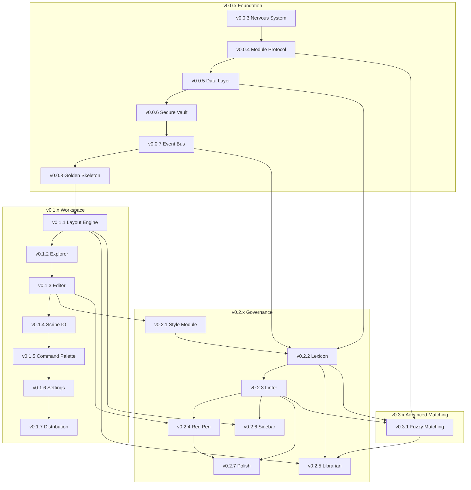

# Lexichord Specification Dependency Matrix

## Document Control

| Field            | Value                                                                  |
| :--------------- | :--------------------------------------------------------------------- |
| **Document ID**  | LCS-DEP-MATRIX                                                         |
| **Last Updated** | 2026-01-31 (v0.13.x added)                                             |
| **Purpose**      | Cross-reference of all interfaces, services, and their source versions |

---

## 1. Interface Registry

### 1.1 v0.0.x Foundational Interfaces

| Interface                    | Defined In | Module                             | Purpose                                                      |
| :--------------------------- | :--------- | :--------------------------------- | :----------------------------------------------------------- |
| `IModule`                    | v0.0.4a    | Abstractions                       | Module contract for dynamic loading                          |
| `ModuleInfo`                 | v0.0.4a    | Abstractions                       | Module metadata record                                       |
| `IModuleLoader`              | v0.0.4b    | Host                               | Module discovery and loading                                 |
| `ILicenseContext`            | v0.0.4c    | Abstractions                       | Read-only license tier access                                |
| `LicenseTier`                | v0.0.4c    | Abstractions                       | Core/WriterPro/Teams/Enterprise enum                         |
| `RequiresLicenseAttribute`   | v0.0.4c    | Abstractions                       | License gating attribute                                     |
| `IDbConnectionFactory`       | v0.0.5b    | Abstractions                       | Database connection creation                                 |
| `IGenericRepository<T,TId>`  | v0.0.5d    | Abstractions                       | Base repository pattern                                      |
| `IUserRepository`            | v0.0.5d    | Abstractions                       | User entity repository                                       |
| `ISystemSettingsRepository`  | v0.0.5d    | Abstractions                       | Key-value settings repository                                |
| `IUnitOfWork`                | v0.0.5d    | Abstractions                       | Transaction management                                       |
| `EntityBase`                 | v0.0.5d    | Abstractions                       | Base entity with audit fields                                |
| `User`                       | v0.0.5d    | Abstractions                       | User entity record                                           |
| `SystemSetting`              | v0.0.5d    | Abstractions                       | SystemSetting entity record                                  |
| `PagedResult<T>`             | v0.0.5d    | Abstractions                       | Pagination result record                                     |
| `ISecureVault`               | v0.0.6a    | Abstractions                       | Secure secrets storage contract                              |
| `ISecureVaultFactory`        | v0.0.6a    | Abstractions                       | Platform-specific vault creation                             |
| `SecretMetadata`             | v0.0.6a    | Abstractions                       | Secret metadata record (timestamps, age, usage)              |
| `SecureVaultException`       | v0.0.6a    | Abstractions                       | Base exception for vault operations                          |
| `SecretNotFoundException`    | v0.0.6a    | Abstractions                       | Key does not exist in vault                                  |
| `SecretDecryptionException`  | v0.0.6a    | Abstractions                       | Decryption failed (corrupted/key mismatch)                   |
| `VaultAccessDeniedException` | v0.0.6a    | Abstractions                       | Permission denied to vault storage                           |
| `IMediator`                  | v0.0.7a    | MediatR (NuGet)                    | Event bus / CQRS mediator                                    |
| `INotification`              | v0.0.7a    | MediatR (NuGet)                    | Domain event marker                                          |
| `DomainEventBase`            | v0.0.7b    | Abstractions                       | Base class for domain events                                 |
| `IShellRegionView`           | v0.0.8a    | Abstractions                       | Shell region contribution                                    |
| `ShellRegion`                | v0.0.8a    | Abstractions                       | Top/Left/Center/Right/Bottom enum                            |
| `IConfiguration`             | v0.0.3d    | Microsoft.Extensions.Configuration | Configuration access (Microsoft interface, registered in DI) |
| `ILogger<T>`                 | v0.0.3b    | Microsoft.Extensions.Logging       | Structured logging (Serilog integration)                     |
| `IThemeManager`              | v0.0.2c    | Host                               | Theme switching (Light/Dark/System)                          |
| `IWindowStateService`        | v0.0.2c    | Host                               | Window position/size persistence                             |

### 1.2 v0.1.x Workspace Interfaces

| Interface                     | Defined In | Module       | Purpose                                      |
| :---------------------------- | :--------- | :----------- | :------------------------------------------- |
| `IDockFactory`                | v0.1.1a    | Abstractions | Dock layout creation                         |
| `IRegionManager`              | v0.1.1b    | Abstractions | Module view injection                        |
| `ILayoutService`              | v0.1.1c    | Abstractions | Layout serialization                         |
| `DocumentViewModel`           | v0.1.1d    | Abstractions | Base class for tabbed documents              |
| `IWorkspaceService`           | v0.1.2a    | Abstractions | Current workspace state                      |
| `IRobustFileSystemWatcher`    | v0.1.2b    | Abstractions | External file change detection               |
| `IFileOperationService`       | v0.1.2d    | Abstractions | File CRUD operations                         |
| `IEditorService`              | v0.1.3a    | Abstractions | Document editing coordination                |
| `IManuscriptViewModel`        | v0.1.3a    | Abstractions | Document ViewModel (editor content source)   |
| `ISyntaxHighlightingService`  | v0.1.3b    | Abstractions | XSHD definition loading                      |
| `ISearchService`              | v0.1.3c    | Abstractions | Find/Replace operations                      |
| `IEditorConfigurationService` | v0.1.3d    | Abstractions | Editor preferences                           |
| `IDirtyStateTracker`          | v0.1.4a    | Abstractions | Unsaved changes tracking                     |
| `IFileService`                | v0.1.4b    | Abstractions | Atomic file I/O                              |
| `IShutdownService`            | v0.1.4c    | Abstractions | Safe close workflow                          |
| `IRecentFilesService`         | v0.1.4d    | Abstractions | MRU file history                             |
| `IRecentFilesRepository`      | v0.1.4d    | Abstractions | MRU file data access                         |
| `ICommandRegistry`            | v0.1.5a    | Abstractions | Command registration                         |
| `IFileIndexService`           | v0.1.5c    | Abstractions | Workspace file indexing                      |
| `IKeyBindingService`          | v0.1.5d    | Abstractions | Keyboard shortcut management                 |
| `ISettingsPage`               | v0.1.6a    | Abstractions | Module settings contribution                 |
| `ISettingsService`            | v0.1.6a    | Abstractions | General preferences persistence              |
| `ILicenseService`             | v0.1.6c    | Abstractions | License validation (extends ILicenseContext) |
| `IUpdateService`              | v0.1.7a    | Abstractions | Velopack update management                   |
| `IFirstRunService`            | v0.1.7c    | Abstractions | Version tracking / release notes             |
| `ITelemetryService`           | v0.1.7d    | Abstractions | Optional Sentry crash reporting              |

### 1.3 v0.2.x Governance Interfaces

| Interface                    | Defined In | Module        | Purpose                               |
| :--------------------------- | :--------- | :------------ | :------------------------------------ |
| `IStyleEngine`               | v0.2.1a    | Modules.Style | Core style analysis                   |
| `IStyleSheetLoader`          | v0.2.1c    | Modules.Style | YAML stylesheet loading               |
| `IStyleConfigurationWatcher` | v0.2.1d    | Modules.Style | Live file reload                      |
| `StyleRule`                  | v0.2.1b    | Abstractions  | Rule definition record                |
| `StyleSheet`                 | v0.2.1b    | Abstractions  | Aggregate rule container              |
| `RuleCategory`               | v0.2.1b    | Abstractions  | Terminology/Formatting/Syntax enum    |
| `ViolationSeverity`          | v0.2.1b    | Abstractions  | Error/Warning/Info/Hint enum          |
| `StyleViolation`             | v0.2.1b    | Abstractions  | Violation result record               |
| `ITerminologyRepository`     | v0.2.2b    | Modules.Style | Cached DB access for terms            |
| `ITerminologySeeder`         | v0.2.2c    | Modules.Style | Bootstrap seed data                   |
| `ITerminologyService`        | v0.2.2d    | Modules.Style | CRUD with events                      |
| `StyleTerm`                  | v0.2.2a    | Abstractions  | Term entity model                     |
| `ILintingOrchestrator`       | v0.2.3a    | Modules.Style | Reactive linting coordinator          |
| `ILintingConfiguration`      | v0.2.3b    | Modules.Style | Debounce and settings                 |
| `IScannerService`            | v0.2.3c    | Modules.Style | Regex pattern matching                |
| `IViolationAggregator`       | v0.2.3d    | Modules.Style | Match-to-violation transformation     |
| `ScanMatch`                  | v0.2.3d    | Abstractions  | Scanner output bridge record          |
| `AggregatedStyleViolation`   | v0.2.3d    | Abstractions  | Enriched violation with positions     |
| `IViolationProvider`         | v0.2.4a    | Abstractions  | Violation data for renderer           |
| `IViolationColorProvider`    | v0.2.4b    | Abstractions  | Theme-aware severity-to-color mapping |
| `UnderlineSegment`           | v0.2.4a    | Abstractions  | Wavy underline segment data           |
| `ViolationsChangedEventArgs` | v0.2.4a    | Abstractions  | Violation change notification         |
| `IViolationTooltipService`   | v0.2.4c    | Modules.Style | Hover tooltip display                 |
| `IQuickFixService`           | v0.2.4d    | Modules.Style | Context menu fixes                    |
| `ITerminologyImporter`       | v0.2.5d    | Modules.Style | CSV/Excel import                      |
| `ITerminologyExporter`       | v0.2.5d    | Modules.Style | JSON export                           |
| `IProblemsPanelViewModel`    | v0.2.6a    | Modules.Style | Problems panel state                  |
| `IEditorNavigationService`   | v0.2.6b    | Abstractions  | Cross-document navigation             |
| `IScorecardViewModel`        | v0.2.6c    | Modules.Style | Compliance score widget               |
| `IProjectLintingService`     | v0.2.6d    | Modules.Style | Background project scanning           |
| `IThreadMarshaller`          | v0.2.7a    | Abstractions  | UI thread dispatching                 |
| `IContentFilter`             | v0.2.7b    | Modules.Style | Pre-scan content filtering            |
| `YamlFrontmatterFilter`      | v0.2.7c    | Modules.Style | Frontmatter detection and exclusion   |
| `YamlFrontmatterOptions`     | v0.2.7c    | Modules.Style | Frontmatter filter configuration      |

### 1.4 v0.3.x Fuzzy Engine Interfaces

| Interface                 | Defined In | Module        | Purpose                                        |
| :------------------------ | :--------- | :------------ | :--------------------------------------------- |
| `IFuzzyMatchService`      | v0.3.1a    | Abstractions  | Levenshtein distance / fuzzy ratio calculation |
| `IDocumentTokenizer`      | v0.3.1c    | Abstractions  | Text tokenization for scanning                 |
| `IFuzzyScanner`           | v0.3.1c    | Abstractions  | Fuzzy violation detection                      |
| `FeatureKeys`             | v0.3.1d    | Abstractions  | Feature gate key constants                     |
| `IFeatureMatrix`          | v0.3.1d    | Abstractions  | Feature → License tier mapping                 |
| `IModuleFeatureRegistrar` | v0.3.1d    | Abstractions  | Module feature registration contract           |
| `StyleFeatureRegistry`    | v0.3.1d    | Modules.Style | Style module feature registration              |

### 1.5 v0.3.3 Readability Engine Interfaces

| Interface                  | Defined In | Module       | Purpose                                      |
| :------------------------- | :--------- | :----------- | :------------------------------------------- |
| `ISentenceTokenizer`       | v0.3.3a    | Abstractions | Abbreviation-aware sentence splitting        |
| `ISyllableCounter`         | v0.3.3b    | Abstractions | Syllable counting and complex word detection |
| `IReadabilityService`      | v0.3.3c    | Abstractions | Readability metric calculation               |
| `ReadabilityMetrics`       | v0.3.3c    | Abstractions | Immutable result record with computed values |
| `ReadabilityAnalyzedEvent` | v0.3.3c    | Abstractions | MediatR notification for UI updates          |

### 1.7 v0.3.4 Writing Coach Interfaces

| Interface               | Defined In | Module       | Purpose                                        |
| :---------------------- | :--------- | :----------- | :--------------------------------------------- |
| `VoiceProfile`          | v0.3.4a    | Abstractions | Voice profile record with style constraints    |
| `IVoiceProfileService`  | v0.3.4a    | Abstractions | Profile CRUD and caching                       |
| `ProfileChangedEvent`   | v0.3.4a    | Abstractions | MediatR notification for profile changes       |
| `IPassiveVoiceDetector` | v0.3.4b    | Abstractions | Passive voice detection with confidence scores |
| `PassiveType`           | v0.3.4b    | Abstractions | Passive voice construction type enum           |
| `PassiveVoiceMatch`     | v0.3.4b    | Abstractions | Detected passive voice match record            |
| `IWeakWordScanner`      | v0.3.4c    | Abstractions | Adverb/weasel word/filler detection            |
| `WeakWordCategory`      | v0.3.4c    | Abstractions | Weak word classification enum                  |
| `WeakWordMatch`         | v0.3.4c    | Abstractions | Detected weak word match record                |
| `WeakWordStats`         | v0.3.4c    | Abstractions | Aggregate statistics for weak word analysis    |

### 1.9 v0.3.5 Resonance Dashboard Interfaces

| Interface                   | Defined In | Module        | Purpose                                   |
| :-------------------------- | :--------- | :------------ | :---------------------------------------- |
| `IChartDataService`         | v0.3.5a    | Abstractions  | Chart data aggregation with caching       |
| `ResonanceChartData`        | v0.3.5a    | Abstractions  | Chart data transfer record                |
| `ResonanceDataPoint`        | v0.3.5a    | Abstractions  | Single axis data point record             |
| `IResonanceAxisProvider`    | v0.3.5a    | Abstractions  | Axis configuration provider               |
| `ResonanceAxisDefinition`   | v0.3.5a    | Abstractions  | Axis metadata with normalization          |
| `ChartDataUpdatedEventArgs` | v0.3.5a    | Abstractions  | Event args for chart data updates         |
| `ChartThemeConfiguration`   | v0.3.5a    | Modules.Style | Light/Dark chart color palettes           |
| `ChartColors`               | v0.3.5a    | Modules.Style | Chart color record                        |
| `DefaultAxisProvider`       | v0.3.5a    | Modules.Style | Default 6-axis spider chart configuration |
| `ChartDataService`          | v0.3.5a    | Modules.Style | Aggregates metrics from upstream services |
| `IResonanceUpdateService`   | v0.3.5c    | Abstractions  | Manages real-time update pipeline         |
| `UpdateTrigger`             | v0.3.5c    | Abstractions  | Enum categorizing update sources          |
| `ChartUpdateEvent`          | v0.3.5c    | Abstractions  | MediatR notification for chart updates    |
| `ChartUpdateEventArgs`      | v0.3.5c    | Abstractions  | Update event context record               |
| `ResonanceUpdateService`    | v0.3.5c    | Modules.Style | Rx-based debounced update service         |

### 1.10 v0.3.6 Global Dictionary Interfaces

| Interface                       | Defined In | Module        | Purpose                                     |
| :------------------------------ | :--------- | :------------ | :------------------------------------------ |
| `ConfigurationSource`           | v0.3.6a    | Abstractions  | Enum: System, User, Project hierarchy       |
| `StyleConfiguration`            | v0.3.6a    | Abstractions  | Record with all style settings              |
| `TermAddition`                  | v0.3.6a    | Abstractions  | Record for project-specific term patterns   |
| `ILayeredConfigurationProvider` | v0.3.6a    | Abstractions  | Hierarchical configuration access           |
| `ConfigurationChangedEventArgs` | v0.3.6a    | Abstractions  | Event args for configuration changes        |
| `LayeredConfigurationProvider`  | v0.3.6a    | Modules.Style | Implementation with merge logic and caching |
| `IConflictResolver`             | v0.3.6b    | Abstractions  | Configuration conflict resolution           |
| `ConfigurationConflict`         | v0.3.6b    | Abstractions  | Record for detected conflicts               |
| `ConflictResolver`              | v0.3.6b    | Modules.Style | Implementation with project-wins semantics  |
| `IProjectConfigurationWriter`   | v0.3.6c    | Abstractions  | Project configuration writing               |
| `OverrideAction`                | v0.3.6c    | Abstractions  | Enum: IgnoreRule, ExcludeTerm actions       |
| `ProjectConfigurationWriter`    | v0.3.6c    | Modules.Style | Implementation with YAML serialization      |
| `OverrideMenuViewModel`         | v0.3.6c    | Modules.Style | Context menu actions for overrides          |
| `IIgnorePatternService`         | v0.3.6d    | Abstractions  | Glob-based .lexichordignore support         |
| `PatternsReloadedEventArgs`     | v0.3.6d    | Abstractions  | Event args for pattern reloads              |
| `IgnorePatternService`          | v0.3.6d    | Modules.Style | Implementation with FileSystemGlobbing      |

### 1.11 v0.3.7 Performance Tuning Interfaces

| Interface               | Defined In | Module        | Purpose                                    |
| :---------------------- | :--------- | :------------ | :----------------------------------------- |
| `AnalysisRequest`       | v0.3.7a    | Abstractions  | Document analysis request with snapshot    |
| `AnalysisBufferOptions` | v0.3.7a    | Abstractions  | Buffer configuration (idle period, limits) |
| `IAnalysisBuffer`       | v0.3.7a    | Abstractions  | Reactive request debouncing and buffering  |
| `AnalysisBuffer`        | v0.3.7a    | Modules.Style | System.Reactive GroupBy+Throttle impl      |
| `IDisposableTracker`    | v0.3.7d    | Abstractions  | Subscription lifecycle tracking            |
| `DisposableTracker`     | v0.3.7d    | Abstractions  | Thread-safe composite disposal impl        |
| `DisposableViewModel`   | v0.3.7d    | Abstractions  | ViewModel base class with auto-disposal    |

### 1.8 v0.2.5 Dictionary Manager Interfaces (Consolidated)

> **Note:** These interfaces were originally planned for v0.3.2 but have been consolidated into v0.2.5 per ADR decision. See [roadmap-v0.3.x.md](v0.3.x/roadmap-v0.3.x.md) for details.

| Interface              | Defined In | Module       | Purpose                         |
| :--------------------- | :--------- | :----------- | :------------------------------ |
| `IDialogService`       | v0.2.5b    | Abstractions | Modal dialog management         |
| `ITerminologyImporter` | v0.2.5d    | Abstractions | CSV import contract (enhanced)  |
| `ITerminologyExporter` | v0.2.5d    | Abstractions | JSON export contract (enhanced) |

**New Records (v0.2.5 Dictionary Manager):**

| Record            | Defined In | Module        | Purpose                          |
| :---------------- | :--------- | :------------ | :------------------------------- |
| `StyleTermDto`    | v0.2.5a    | Modules.Style | View-layer term representation   |
| `DialogResult<T>` | v0.2.5b    | Abstractions  | Dialog return value wrapper      |
| `ImportMapping`   | v0.2.5d    | Abstractions  | CSV column to DB field mapping   |
| `ImportResult`    | v0.2.5d    | Abstractions  | Import operation outcome         |
| `ImportOptions`   | v0.2.5d    | Abstractions  | Skip/overwrite configuration     |
| `ImportError`     | v0.2.5d    | Abstractions  | Row-level import failure details |
| `ExportDocument`  | v0.2.5d    | Modules.Style | Export JSON structure            |
| `ExportedTerm`    | v0.2.5d    | Modules.Style | Term representation in export    |

**New Classes (v0.2.5 Dictionary Manager):**

| Class                     | Defined In | Module        | Purpose                          |
| :------------------------ | :--------- | :------------ | :------------------------------- |
| `StyleTermValidator`      | v0.2.5c    | Modules.Style | FluentValidation validator       |
| `ValidationConstants`     | v0.2.5c    | Modules.Style | Centralized validation constants |
| `CsvTerminologyImporter`  | v0.2.5d    | Modules.Style | CSV import implementation        |
| `JsonTerminologyExporter` | v0.2.5d    | Modules.Style | JSON export implementation       |
| `LexiconViewModel`        | v0.2.5a    | Modules.Style | DataGrid ViewModel               |
| `TermEditorViewModel`     | v0.2.5b    | Modules.Style | Term editor dialog ViewModel     |
| `ImportWizardViewModel`   | v0.2.5d    | Modules.Style | Import wizard ViewModel          |

**Extended Records (v0.3.1):**

| Record           | Extended In | New Properties                   | Purpose                      |
| :--------------- | :---------- | :------------------------------- | :--------------------------- |
| `StyleTerm`      | v0.3.1b     | `FuzzyEnabled`, `FuzzyThreshold` | Per-term fuzzy configuration |
| `StyleViolation` | v0.3.1c     | `IsFuzzyMatch`, `FuzzyRatio`     | Fuzzy match identification   |

**Extended Interfaces (v0.3.1):**

| Interface                | Extended In | New Methods                   | Purpose                   |
| :----------------------- | :---------- | :---------------------------- | :------------------------ |
| `ITerminologyRepository` | v0.3.1b     | `GetFuzzyEnabledTermsAsync()` | Query fuzzy-enabled terms |

### 1.6 v0.4.1 Vector Foundation Interfaces

| Interface             | Defined In | Module       | Purpose                                    |
| :-------------------- | :--------- | :----------- | :----------------------------------------- |
| `IDocumentRepository` | v0.4.1c    | Abstractions | Document CRUD operations for RAG indexing  |
| `IChunkRepository`    | v0.4.1c    | Abstractions | Chunk storage and vector similarity search |

**New Records (v0.4.1):**

| Record              | Defined In | Module       | Purpose                          |
| :------------------ | :--------- | :----------- | :------------------------------- |
| `Document`          | v0.4.1c    | Abstractions | Indexed document entity          |
| `Chunk`             | v0.4.1c    | Abstractions | Text chunk with vector embedding |
| `ChunkSearchResult` | v0.4.1c    | Abstractions | Vector search result with score  |

**New Enums (v0.4.1):**

| Enum             | Defined In | Module       | Purpose                               |
| :--------------- | :--------- | :----------- | :------------------------------------ |
| `DocumentStatus` | v0.4.1c    | Abstractions | Pending/Indexing/Indexed/Failed/Stale |

**New Classes (v0.4.1):**

| Class                | Defined In | Module      | Purpose                                      |
| :------------------- | :--------- | :---------- | :------------------------------------------- |
| `VectorTypeHandler`  | v0.4.1d    | Modules.RAG | Dapper type handler for float[] ↔ VECTOR     |
| `DocumentRepository` | v0.4.1d    | Modules.RAG | Dapper implementation of IDocumentRepository |
| `ChunkRepository`    | v0.4.1d    | Modules.RAG | Dapper implementation with vector search     |

### 1.7 v0.4.2 File Ingestion Pipeline Interfaces

| Interface                      | Defined In | Module       | Purpose                               |
| :----------------------------- | :--------- | :----------- | :------------------------------------ |
| `IIngestionService`            | v0.4.2a    | Abstractions | File ingestion operations             |
| `IFileHashService`             | v0.4.2b    | Abstractions | SHA-256 hash computation & comparison |
| `IIngestionQueue`              | v0.4.2d    | Abstractions | Queue management for ingestion        |
| `IFileWatcherIngestionHandler` | v0.4.2c    | Modules.RAG  | File watcher event handling           |

**New Records (v0.4.2):**

| Record                       | Defined In | Module       | Purpose                          |
| :--------------------------- | :--------- | :----------- | :------------------------------- |
| `IngestionResult`            | v0.4.2a    | Abstractions | Ingestion operation result       |
| `IngestionProgressEventArgs` | v0.4.2a    | Abstractions | Progress reporting event args    |
| `IngestionOptions`           | v0.4.2a    | Abstractions | Ingestion configuration settings |
| `FileMetadata`               | v0.4.2b    | Abstractions | File size and modification time  |
| `FileMetadataWithHash`       | v0.4.2b    | Abstractions | Metadata with computed hash      |
| `FileWatcherOptions`         | v0.4.2c    | Modules.RAG  | File watcher configuration       |
| `IngestionQueueOptions`      | v0.4.2d    | Modules.RAG  | Queue configuration settings     |
| `IngestionQueueEventArgs`    | v0.4.2d    | Abstractions | Queue item processed event args  |
| `QueueStateChangedEventArgs` | v0.4.2d    | Abstractions | Queue state change event args    |
| `QueueItem`                  | v0.4.2d    | Modules.RAG  | Internal queue item record       |

**New Enums (v0.4.2):**

| Enum                | Defined In | Module       | Purpose                                |
| :------------------ | :--------- | :----------- | :------------------------------------- |
| `IngestionPhase`    | v0.4.2a    | Abstractions | Scanning/Hashing/Reading/Chunking/etc. |
| `FileChangeType`    | v0.4.2c    | Modules.RAG  | Created/Modified/Deleted/Renamed       |
| `IngestionPriority` | v0.4.2d    | Abstractions | Low/Normal/High queue priority         |
| `QueueStateChange`  | v0.4.2d    | Abstractions | ItemEnqueued/Dequeued/Started/Stopped  |

**New Classes (v0.4.2):**

| Class                         | Defined In | Module      | Purpose                                     |
| :---------------------------- | :--------- | :---------- | :------------------------------------------ |
| `FileHashService`             | v0.4.2b    | Modules.RAG | SHA-256 streaming hash implementation       |
| `FileWatcherIngestionHandler` | v0.4.2c    | Modules.RAG | Debounced file watcher event handler        |
| `IngestionQueue`              | v0.4.2d    | Modules.RAG | Channel-based priority queue implementation |
| `IngestionBackgroundService`  | v0.4.2d    | Modules.RAG | HostedService for queue consumption         |

### 1.8 v0.4.3 Chunking Strategies Interfaces

| Interface           | Defined In | Module       | Purpose                     |
| :------------------ | :--------- | :----------- | :-------------------------- |
| `IChunkingStrategy` | v0.4.3a    | Abstractions | Chunking algorithm contract |

**New Records (v0.4.3):**

| Record            | Defined In | Module       | Purpose                               |
| :---------------- | :--------- | :----------- | :------------------------------------ |
| `TextChunk`       | v0.4.3a    | Abstractions | Chunk with content and position       |
| `ChunkMetadata`   | v0.4.3a    | Abstractions | Chunk context (index, heading, level) |
| `ChunkingOptions` | v0.4.3a    | Abstractions | Chunking configuration options        |

**New Enums (v0.4.3):**

| Enum           | Defined In | Module       | Purpose                                     |
| :------------- | :--------- | :----------- | :------------------------------------------ |
| `ChunkingMode` | v0.4.3a    | Abstractions | FixedSize/Paragraph/MarkdownHeader/Semantic |

**New Classes (v0.4.3):**

| Class                            | Defined In | Module       | Purpose                                      |
| :------------------------------- | :--------- | :----------- | :------------------------------------------- |
| `FixedSizeChunkingStrategy`      | v0.4.3b    | Modules.RAG  | Character-count based splitting with overlap |
| `ParagraphChunkingStrategy`      | v0.4.3c    | Modules.RAG  | Paragraph boundary detection with merging    |
| `MarkdownHeaderChunkingStrategy` | v0.4.3d    | Modules.RAG  | Hierarchical header-based chunking           |
| `ChunkingStrategyFactory`        | v0.4.3     | Modules.RAG  | Factory for strategy selection               |
| `ChunkingPresets`                | v0.4.3a    | Abstractions | Predefined chunking configurations           |

### 1.9 v0.4.4 Embedding/Vector Generation Interfaces

| Interface           | Defined In | Module       | Purpose                       |
| :------------------ | :--------- | :----------- | :---------------------------- |
| `IEmbeddingService` | v0.4.4a    | Abstractions | Embedding generation contract |
| `ITokenCounter`     | v0.4.4c    | Abstractions | Token counting and truncation |

**New Records (v0.4.4):**

| Record             | Defined In | Module       | Purpose                               |
| :----------------- | :--------- | :----------- | :------------------------------------ |
| `EmbeddingOptions` | v0.4.4a    | Abstractions | Embedding configuration (model, dims) |
| `EmbeddingResult`  | v0.4.4a    | Abstractions | Embedding operation result            |
| `IndexingResult`   | v0.4.4d    | Modules.RAG  | Pipeline operation result             |

**New Classes (v0.4.4):**

| Class                         | Defined In | Module       | Purpose                                 |
| :---------------------------- | :--------- | :----------- | :-------------------------------------- |
| `OpenAIEmbeddingService`      | v0.4.4b    | Modules.RAG  | OpenAI API integration with retry logic |
| `TiktokenTokenCounter`        | v0.4.4c    | Modules.RAG  | Token counting using ML.Tokenizers      |
| `DocumentIndexingPipeline`    | v0.4.4d    | Modules.RAG  | Orchestrates chunk→embed→store flow     |
| `EmbeddingException`          | v0.4.4a    | Abstractions | Exception for embedding failures        |
| `FeatureNotLicensedException` | v0.4.4d    | Modules.RAG  | Exception for license enforcement       |

### 1.10 v0.4.5 Semantic Search Interfaces

| Interface                | Defined In | Module       | Purpose                         |
| :----------------------- | :--------- | :----------- | :------------------------------ |
| `ISemanticSearchService` | v0.4.5a    | Abstractions | Semantic search contract        |
| `IQueryPreprocessor`     | v0.4.5c    | Modules.RAG  | Query normalization and caching |

**New Records (v0.4.5):**

| Record          | Defined In | Module       | Purpose                               |
| :-------------- | :--------- | :----------- | :------------------------------------ |
| `SearchOptions` | v0.4.5a    | Abstractions | Search configuration (TopK, MinScore) |
| `SearchResult`  | v0.4.5a    | Abstractions | Search result container               |
| `SearchHit`     | v0.4.5a    | Abstractions | Individual search match               |

**New Classes (v0.4.5):**

| Class                   | Defined In | Module      | Purpose                           |
| :---------------------- | :--------- | :---------- | :-------------------------------- |
| `PgVectorSearchService` | v0.4.5b    | Modules.RAG | pgvector cosine similarity search |
| `QueryPreprocessor`     | v0.4.5c    | Modules.RAG | Query normalization and caching   |
| `SearchLicenseGuard`    | v0.4.5d    | Modules.RAG | License validation helper         |

### 1.11 v0.4.5e Knowledge Graph Interfaces

| Interface                 | Defined In | Module       | Purpose                                   |
| :------------------------ | :--------- | :----------- | :---------------------------------------- |
| `IGraphConnectionFactory` | v0.4.5e    | Abstractions | Graph database session creation           |
| `IGraphSession`           | v0.4.5e    | Abstractions | Cypher query execution (IAsyncDisposable) |
| `IGraphRecord`            | v0.4.5e    | Abstractions | Raw record access for query results       |
| `IGraphTransaction`       | v0.4.5e    | Abstractions | Explicit transaction support              |

**New Records (v0.4.5e):**

| Record                  | Defined In | Module            | Purpose                             |
| :---------------------- | :--------- | :---------------- | :---------------------------------- |
| `GraphWriteResult`      | v0.4.5e    | Abstractions      | Write operation mutation statistics |
| `KnowledgeEntity`       | v0.4.5e    | Abstractions      | Graph node with typed properties    |
| `KnowledgeRelationship` | v0.4.5e    | Abstractions      | Graph edge between two entities     |
| `GraphConfiguration`    | v0.4.5e    | Modules.Knowledge | Neo4j connection settings           |

**New Enums (v0.4.5e):**

| Enum              | Defined In | Module       | Purpose                        |
| :---------------- | :--------- | :----------- | :----------------------------- |
| `GraphAccessMode` | v0.4.5e    | Abstractions | Read/Write session access mode |

**New Exceptions (v0.4.5e):**

| Exception             | Defined In | Module       | Purpose                       |
| :-------------------- | :--------- | :----------- | :---------------------------- |
| `GraphQueryException` | v0.4.5e    | Abstractions | Wraps Neo4j driver exceptions |

**New Classes (v0.4.5e):**

| Class                    | Defined In | Module            | Purpose                              |
| :----------------------- | :--------- | :---------------- | :----------------------------------- |
| `Neo4jConnectionFactory` | v0.4.5e    | Modules.Knowledge | IGraphConnectionFactory with pooling |
| `Neo4jGraphSession`      | v0.4.5e    | Modules.Knowledge | IGraphSession with timing/logging    |
| `Neo4jGraphRecord`       | v0.4.5e    | Modules.Knowledge | IGraphRecord wrapping Neo4j IRecord  |
| `Neo4jGraphTransaction`  | v0.4.5e    | Modules.Knowledge | IGraphTransaction with auto-rollback |
| `Neo4jHealthCheck`       | v0.4.5e    | Modules.Knowledge | IHealthCheck for Neo4j connectivity  |
| `Neo4jRecordMapper`      | v0.4.5e    | Modules.Knowledge | IRecord to typed object mapping      |
| `KnowledgeModule`        | v0.4.5e    | Modules.Knowledge | IModule implementation               |

### 1.11b v0.4.5f Schema Registry Interfaces

| Interface         | Defined In | Module       | Purpose                                  |
| :---------------- | :--------- | :----------- | :--------------------------------------- |
| `ISchemaRegistry` | v0.4.5f    | Abstractions | Schema loading, validation, and querying |

**New Records (v0.4.5f):**

| Record                    | Defined In | Module            | Purpose                                     |
| :------------------------ | :--------- | :---------------- | :------------------------------------------ |
| `PropertySchema`          | v0.4.5f    | Abstractions      | Property definition with type & constraints |
| `EntityTypeSchema`        | v0.4.5f    | Abstractions      | Entity type definition with properties      |
| `RelationshipTypeSchema`  | v0.4.5f    | Abstractions      | Relationship type with from/to constraints  |
| `SchemaValidationResult`  | v0.4.5f    | Abstractions      | Validation outcome (errors + warnings)      |
| `SchemaValidationError`   | v0.4.5f    | Abstractions      | Blocking validation error with code         |
| `SchemaValidationWarning` | v0.4.5f    | Abstractions      | Non-blocking validation warning             |
| `SchemaDocument`          | v0.4.5f    | Modules.Knowledge | Parsed YAML schema file output              |

**New Enums (v0.4.5f):**

| Enum           | Defined In | Module       | Purpose                              |
| :------------- | :--------- | :----------- | :----------------------------------- |
| `PropertyType` | v0.4.5f    | Abstractions | Data types for schema properties     |
| `Cardinality`  | v0.4.5f    | Abstractions | Relationship cardinality constraints |

**New Classes (v0.4.5f):**

| Class             | Defined In | Module            | Purpose                                     |
| :---------------- | :--------- | :---------------- | :------------------------------------------ |
| `SchemaRegistry`  | v0.4.5f    | Modules.Knowledge | ISchemaRegistry with in-memory dictionaries |
| `SchemaLoader`    | v0.4.5f    | Modules.Knowledge | YAML parser using YamlDotNet                |
| `SchemaValidator` | v0.4.5f    | Modules.Knowledge | Entity/relationship validation logic        |

### 1.11c v0.4.5g Entity Extraction Interfaces

| Interface                   | Defined In | Module       | Purpose                          |
| :-------------------------- | :--------- | :----------- | :------------------------------- |
| `IEntityExtractor`          | v0.4.5g    | Abstractions | Pluggable entity type extractor  |
| `IEntityExtractionPipeline` | v0.4.5g    | Abstractions | Composite extraction coordinator |

**New Records (v0.4.5g):**

| Record              | Defined In | Module       | Purpose                                      |
| :------------------ | :--------- | :----------- | :------------------------------------------- |
| `EntityMention`     | v0.4.5g    | Abstractions | Extracted entity mention with confidence     |
| `ExtractionContext` | v0.4.5g    | Abstractions | Extraction parameters and configuration      |
| `ExtractionResult`  | v0.4.5g    | Abstractions | Aggregated extraction output with statistics |
| `AggregatedEntity`  | v0.4.5g    | Abstractions | Deduplicated entity from multiple mentions   |

**New Classes (v0.4.5g):**

| Class                      | Defined In | Module            | Purpose                                          |
| :------------------------- | :--------- | :---------------- | :----------------------------------------------- |
| `EndpointExtractor`        | v0.4.5g    | Modules.Knowledge | API endpoint detection (3 regex patterns)        |
| `ParameterExtractor`       | v0.4.5g    | Modules.Knowledge | Parameter detection (5 regex patterns)           |
| `ConceptExtractor`         | v0.4.5g    | Modules.Knowledge | Domain term detection (4 regex patterns)         |
| `MentionAggregator`        | v0.4.5g    | Modules.Knowledge | Mention grouping and entity deduplication        |
| `EntityExtractionPipeline` | v0.4.5g    | Modules.Knowledge | IEntityExtractionPipeline with priority ordering |

### 1.12 v0.4.6 Reference Panel Interfaces

| Interface                     | Defined In | Module      | Purpose                     |
| :---------------------------- | :--------- | :---------- | :-------------------------- |
| `IReferenceNavigationService` | v0.4.6c    | Modules.RAG | Result navigation to source |
| `ISearchHistoryService`       | v0.4.6d    | Modules.RAG | Query history management    |

**New ViewModels (v0.4.6):**

| ViewModel                   | Defined In | Module      | Purpose                |
| :-------------------------- | :--------- | :---------- | :--------------------- |
| `ReferenceViewModel`        | v0.4.6a    | Modules.RAG | Panel state management |
| `SearchResultItemViewModel` | v0.4.6b    | Modules.RAG | Result item display    |

**New Classes (v0.4.6):**

| Class                        | Defined In | Module      | Purpose                        |
| :--------------------------- | :--------- | :---------- | :----------------------------- |
| `ReferenceNavigationService` | v0.4.6c    | Modules.RAG | Result-to-source navigation    |
| `SearchHistoryService`       | v0.4.6d    | Modules.RAG | Query history with persistence |
| `HighlightedTextBlock`       | v0.4.6b    | Modules.RAG | Text highlighting control      |

**New Enums (v0.4.6):**

| Enum                      | Defined In | Module       | Purpose                             |
| :------------------------ | :--------- | :----------- | :---------------------------------- |
| `HighlightStyle`          | v0.4.6c    | Abstractions | Text highlight styles in editor     |
| `SearchHistoryChangeType` | v0.4.6d    | Modules.RAG  | Type of history change (Added, etc) |

**New Event Args (v0.4.6):**

| Record/Class                    | Defined In | Module      | Purpose                        |
| :------------------------------ | :--------- | :---------- | :----------------------------- |
| `SearchHistoryChangedEventArgs` | v0.4.6d    | Modules.RAG | Event args for history changes |

**New Records (v0.4.6e) — Axiom Data Model:**

| Record                  | Defined In | Module       | Purpose                                    |
| :---------------------- | :--------- | :----------- | :----------------------------------------- |
| `TextSpan`              | v0.4.6e    | Abstractions | Document location span (start/end/line)    |
| `AxiomCondition`        | v0.4.6e    | Abstractions | Conditional clause for rule evaluation     |
| `AxiomFix`              | v0.4.6e    | Abstractions | Suggested fix for violations               |
| `AxiomRule`             | v0.4.6e    | Abstractions | Single constraint within an axiom          |
| `Axiom`                 | v0.4.6e    | Abstractions | Domain rule definition (ID, rules, target) |
| `AxiomViolation`        | v0.4.6e    | Abstractions | Detected rule violation with context       |
| `AxiomValidationResult` | v0.4.6e    | Abstractions | Aggregated validation outcome              |

**New Enums (v0.4.6e):**

| Enum                  | Defined In | Module       | Purpose                                         |
| :-------------------- | :--------- | :----------- | :---------------------------------------------- |
| `AxiomSeverity`       | v0.4.6e    | Abstractions | Violation severity (Error/Warn/Info)            |
| `AxiomTargetKind`     | v0.4.6e    | Abstractions | Target kind (Entity/Relationship/Claim)         |
| `AxiomConstraintType` | v0.4.6e    | Abstractions | 14 constraint types (Required, Range, etc.)     |
| `ConditionOperator`   | v0.4.6e    | Abstractions | 9 comparison operators (Equals, Contains, etc.) |

### 1.12 v0.4.7 Index Manager Interfaces

| Interface                 | Defined In | Module      | Purpose                    |
| :------------------------ | :--------- | :---------- | :------------------------- |
| `IIndexStatusService`     | v0.4.7a    | Modules.RAG | Index status aggregation   |
| `IIndexManagementService` | v0.4.7b    | Modules.RAG | Manual indexing operations |

**New ViewModels (v0.4.7):**

| ViewModel                   | Defined In | Module      | Purpose                   |
| :-------------------------- | :--------- | :---------- | :------------------------ |
| `IndexStatusViewModel`      | v0.4.7a    | Modules.RAG | Document list state       |
| `IndexedDocumentViewModel`  | v0.4.7a    | Modules.RAG | Individual document state |
| `IndexingProgressViewModel` | v0.4.7c    | Modules.RAG | Progress state            |

**New Records (v0.4.7):**

| Record                 | Defined In | Module      | Purpose              |
| :--------------------- | :--------- | :---------- | :------------------- |
| `IndexedDocumentInfo`  | v0.4.7a    | Modules.RAG | Document status info |
| `IndexStatistics`      | v0.4.7a    | Modules.RAG | Summary statistics   |
| `IndexOperationResult` | v0.4.7b    | Modules.RAG | Operation result     |
| `IndexingProgressInfo` | v0.4.7b    | Modules.RAG | Progress information |
| `IndexingErrorInfo`    | v0.4.7d    | Modules.RAG | Error details        |

**New Classes (v0.4.7):**

| Class                      | Defined In | Module      | Purpose                        |
| :------------------------- | :--------- | :---------- | :----------------------------- |
| `IndexStatusService`       | v0.4.7a    | Modules.RAG | Index status implementation    |
| `IndexManagementService`   | v0.4.7b    | Modules.RAG | Manual indexing implementation |
| `IndexingErrorCategorizer` | v0.4.7d    | Modules.RAG | Error categorization helper    |

**New Enums (v0.4.7):**

| Enum                    | Defined In | Module      | Purpose                          |
| :---------------------- | :--------- | :---------- | :------------------------------- |
| `IndexingStatus`        | v0.4.7a    | Modules.RAG | Document indexing status         |
| `IndexOperationType`    | v0.4.7b    | Modules.RAG | Type of index operation          |
| `IndexingErrorCategory` | v0.4.7d    | Modules.RAG | Error categorization for display |

**New Events (v0.4.7):**

| Event                           | Defined In | Module      | Purpose                    |
| :------------------------------ | :--------- | :---------- | :------------------------- |
| `IndexOperationRequestedEvent`  | v0.4.7b    | Modules.RAG | Index operation requested  |
| `IndexOperationCompletedEvent`  | v0.4.7b    | Modules.RAG | Index operation completed  |
| `IndexingProgressUpdatedEvent`  | v0.4.7c    | Modules.RAG | Progress update during ops |
| `DocumentRemovedFromIndexEvent` | v0.4.7b    | Modules.RAG | Document removed from idx  |

### 1.13 v0.4.8 Hardening Interfaces

| Interface         | Defined In | Module       | Purpose                  |
| :---------------- | :--------- | :----------- | :----------------------- |
| `IEmbeddingCache` | v0.4.8d    | Abstractions | Embedding cache contract |

**New Classes (v0.4.8):**

| Class                    | Defined In | Module      | Purpose                            |
| :----------------------- | :--------- | :---------- | :--------------------------------- |
| `SqliteEmbeddingCache`   | v0.4.8d    | Modules.RAG | SQLite-based embedding cache       |
| `CachedEmbeddingService` | v0.4.8d    | Modules.RAG | Decorator adding cache to embedder |

**New Records (v0.4.8):**

| Record                     | Defined In | Module      | Purpose                     |
| :------------------------- | :--------- | :---------- | :-------------------------- |
| `EmbeddingCacheStatistics` | v0.4.8d    | Modules.RAG | Cache hit/miss metrics      |
| `EmbeddingCacheOptions`    | v0.4.8d    | Modules.RAG | Cache configuration options |

### 1.14 v0.5.1 Hybrid Engine Interfaces

| Interface              | Defined In | Module       | Purpose                             |
| :--------------------- | :--------- | :----------- | :---------------------------------- |
| `IBM25SearchService`   | v0.5.1b    | Abstractions | BM25 full-text keyword search       |
| `IHybridSearchService` | v0.5.1c    | Abstractions | Combined RRF search (BM25+Semantic) |

**New Classes (v0.5.1):**

| Class                 | Defined In | Module      | Purpose                          |
| :-------------------- | :--------- | :---------- | :------------------------------- |
| `BM25SearchService`   | v0.5.1b    | Modules.RAG | PostgreSQL full-text search impl |
| `HybridSearchService` | v0.5.1c    | Modules.RAG | RRF fusion algorithm impl        |

**New Records (v0.5.1):**

| Record                | Defined In | Module      | Purpose                      |
| :-------------------- | :--------- | :---------- | :--------------------------- |
| `BM25Hit`             | v0.5.1b    | Modules.RAG | BM25 search result with rank |
| `HybridSearchOptions` | v0.5.1c    | Modules.RAG | RRF weights and k constant   |

**New Enums (v0.5.1):**

| Enum         | Defined In | Module       | Purpose                              |
| :----------- | :--------- | :----------- | :----------------------------------- |
| `SearchMode` | v0.5.1d    | Abstractions | Semantic/Keyword/Hybrid search modes |

### 1.15 v0.5.2 Citation Engine Interfaces

| Interface                   | Defined In | Module       | Purpose                      |
| :-------------------------- | :--------- | :----------- | :--------------------------- |
| `ICitationService`          | v0.5.2a    | Abstractions | Citation creation/formatting |
| `ICitationFormatter`        | v0.5.2b    | Abstractions | Style-specific formatting    |
| `ICitationValidator`        | v0.5.2c    | Abstractions | Freshness validation         |
| `ICitationClipboardService` | v0.5.2d    | Abstractions | Clipboard operations         |

**New Classes (v0.5.2):**

| Class                       | Defined In | Module      | Purpose                       |
| :-------------------------- | :--------- | :---------- | :---------------------------- |
| `CitationService`           | v0.5.2a    | Modules.RAG | Citation creation logic       |
| `CitationValidator`         | v0.5.2c    | Modules.RAG | File freshness validation     |
| `CitationClipboardService`  | v0.5.2d    | Modules.RAG | Clipboard copy operations     |
| `InlineCitationFormatter`   | v0.5.2b    | Modules.RAG | [doc.md, §Heading] format     |
| `FootnoteCitationFormatter` | v0.5.2b    | Modules.RAG | [^id]: path:line format       |
| `MarkdownCitationFormatter` | v0.5.2b    | Modules.RAG | [Title](file://path#L) format |
| `CitationFormatterRegistry` | v0.5.2b    | Modules.RAG | Formatter lookup and prefs    |

**New Records (v0.5.2):**

| Record                     | Defined In | Module       | Purpose                 |
| :------------------------- | :--------- | :----------- | :---------------------- |
| `Citation`                 | v0.5.2a    | Abstractions | Source attribution data |
| `CitationValidationResult` | v0.5.2c    | Abstractions | Validation outcome      |

**New Enums (v0.5.2):**

| Enum                       | Defined In | Module       | Purpose                   |
| :------------------------- | :--------- | :----------- | :------------------------ |
| `CitationStyle`            | v0.5.2a    | Abstractions | Inline/Footnote/Markdown  |
| `CitationValidationStatus` | v0.5.2c    | Abstractions | Valid/Stale/Missing/Error |

### 1.16 v0.5.3 Context Window Interfaces

| Interface                  | Defined In | Module       | Purpose                     |
| :------------------------- | :--------- | :----------- | :-------------------------- |
| `IContextExpansionService` | v0.5.3a    | Abstractions | Expand chunks with context  |
| `IHeadingHierarchyService` | v0.5.3c    | Abstractions | Resolve heading breadcrumbs |

**New Classes (v0.5.3):**

| Class                     | Defined In | Module      | Purpose                    |
| :------------------------ | :--------- | :---------- | :------------------------- |
| `ContextExpansionService` | v0.5.3a    | Modules.RAG | Context aggregation logic  |
| `HeadingHierarchyService` | v0.5.3c    | Modules.RAG | Breadcrumb resolution      |
| `ContextPreviewViewModel` | v0.5.3d    | Modules.RAG | Expansion state management |

**New Records (v0.5.3):**

| Record           | Defined In | Module       | Purpose                        |
| :--------------- | :--------- | :----------- | :----------------------------- |
| `ContextOptions` | v0.5.3a    | Abstractions | Expansion configuration        |
| `ExpandedChunk`  | v0.5.3a    | Abstractions | Chunk with surrounding context |
| `HeadingNode`    | v0.5.3c    | Abstractions | Heading hierarchy tree node    |

### 1.17 v0.5.4 Relevance Tuner Interfaces

| Interface                 | Defined In | Module       | Purpose                        |
| :------------------------ | :--------- | :----------- | :----------------------------- |
| `IQueryAnalyzer`          | v0.5.4a    | Abstractions | Query structure/intent parsing |
| `IQueryExpander`          | v0.5.4b    | Abstractions | Synonym-based expansion        |
| `IQuerySuggestionService` | v0.5.4c    | Abstractions | Autocomplete suggestions       |
| `IQueryHistoryService`    | v0.5.4d    | Abstractions | Search pattern tracking        |

**New Classes (v0.5.4):**

| Class                    | Defined In | Module      | Purpose                        |
| :----------------------- | :--------- | :---------- | :----------------------------- |
| `QueryAnalyzer`          | v0.5.4a    | Modules.RAG | Keyword/entity/intent analysis |
| `QueryExpander`          | v0.5.4b    | Modules.RAG | Terminology-based expansion    |
| `QuerySuggestionService` | v0.5.4c    | Modules.RAG | N-gram based suggestions       |
| `QueryHistoryService`    | v0.5.4d    | Modules.RAG | Query recording and analytics  |
| `SuggestionPopup`        | v0.5.4c    | Modules.RAG | Autocomplete UI component      |

**New Records (v0.5.4):**

| Record              | Defined In | Module       | Purpose                    |
| :------------------ | :--------- | :----------- | :------------------------- |
| `QueryAnalysis`     | v0.5.4a    | Abstractions | Analysis results container |
| `QueryEntity`       | v0.5.4a    | Abstractions | Recognized entity in query |
| `ExpandedQuery`     | v0.5.4b    | Abstractions | Query with added synonyms  |
| `Synonym`           | v0.5.4b    | Abstractions | Synonym term with weight   |
| `ExpansionOptions`  | v0.5.4b    | Abstractions | Expansion configuration    |
| `QuerySuggestion`   | v0.5.4c    | Abstractions | Autocomplete suggestion    |
| `QueryHistoryEntry` | v0.5.4d    | Abstractions | Recorded query entry       |
| `ZeroResultQuery`   | v0.5.4d    | Abstractions | Content gap identification |

**New Enums (v0.5.4):**

| Enum               | Defined In | Module       | Purpose                      |
| :----------------- | :--------- | :----------- | :--------------------------- |
| `QueryIntent`      | v0.5.4a    | Abstractions | Factual/Procedural/etc.      |
| `EntityType`       | v0.5.4a    | Abstractions | Code/FilePath/Domain/etc.    |
| `SynonymSource`    | v0.5.4b    | Abstractions | Terminology/Algorithmic/etc. |
| `SuggestionSource` | v0.5.4c    | Abstractions | QueryHistory/Heading/Ngram   |

### 1.18 v0.5.5 Filter System Interfaces

| Interface              | Defined In | Module       | Purpose                      |
| :--------------------- | :--------- | :----------- | :--------------------------- |
| `IFilterQueryBuilder`  | v0.5.5c    | Abstractions | SQL filter clause generation |
| `IFilterPresetService` | v0.5.5d    | Abstractions | Saved preset management      |
| `IFilterValidator`     | v0.5.5a    | Abstractions | Filter criteria validation   |

**New Classes (v0.5.5):**

| Class                        | Defined In | Module      | Purpose                    |
| :--------------------------- | :--------- | :---------- | :------------------------- |
| `FilterQueryBuilder`         | v0.5.5c    | Modules.RAG | SQL WHERE clause builder   |
| `FilterPresetService`        | v0.5.5d    | Modules.RAG | Preset persistence service |
| `SearchFilterPanel`          | v0.5.5b    | Modules.RAG | Filter panel UI view       |
| `SearchFilterPanelViewModel` | v0.5.5b    | Modules.RAG | Filter state management    |

**New Records (v0.5.5):**

| Record              | Defined In | Module       | Purpose                   |
| :------------------ | :--------- | :----------- | :------------------------ |
| `SearchFilter`      | v0.5.5a    | Abstractions | Filter criteria container |
| `DateRange`         | v0.5.5a    | Abstractions | Temporal filter bounds    |
| `FilterPreset`      | v0.5.5a    | Abstractions | Saved configuration       |
| `FilterQueryResult` | v0.5.5c    | Abstractions | SQL clauses + parameters  |

**New Enums (v0.5.5):**

| Enum              | Defined In | Module      | Purpose                    |
| :---------------- | :--------- | :---------- | :------------------------- |
| `DateRangeOption` | v0.5.5b    | Modules.RAG | AnyTime/LastDay/Custom/etc |

### 1.19 v0.5.6 Answer Preview Interfaces

| Interface                   | Defined In | Module       | Purpose                     |
| :-------------------------- | :--------- | :----------- | :-------------------------- |
| `ISnippetService`           | v0.5.6a    | Abstractions | Snippet extraction          |
| `IHighlightRenderer`        | v0.5.6b    | Modules.RAG  | Platform-agnostic rendering |
| `ISentenceBoundaryDetector` | v0.5.6c    | Abstractions | Sentence boundary detection |

**New Classes (v0.5.6):**

| Class                       | Defined In | Module      | Purpose                     |
| :-------------------------- | :--------- | :---------- | :-------------------------- |
| `SnippetService`            | v0.5.6a    | Modules.RAG | Snippet extraction logic    |
| `HighlightedSnippetControl` | v0.5.6b    | Modules.RAG | Snippet display UI control  |
| `SentenceBoundaryDetector`  | v0.5.6c    | Modules.RAG | Sentence boundary detection |
| `MultiSnippetViewModel`     | v0.5.6d    | Modules.RAG | Expandable snippet state    |

**New Records (v0.5.6):**

| Record             | Defined In | Module       | Purpose                   |
| :----------------- | :--------- | :----------- | :------------------------ |
| `Snippet`          | v0.5.6a    | Abstractions | Extracted snippet content |
| `HighlightSpan`    | v0.5.6a    | Abstractions | Match position and type   |
| `SnippetOptions`   | v0.5.6a    | Abstractions | Extraction configuration  |
| `HighlightTheme`   | v0.5.6b    | Modules.RAG  | Highlight colors          |
| `SentenceBoundary` | v0.5.6c    | Abstractions | Sentence position         |

**New Enums (v0.5.6):**

| Enum            | Defined In | Module       | Purpose                         |
| :-------------- | :--------- | :----------- | :------------------------------ |
| `HighlightType` | v0.5.6a    | Abstractions | QueryMatch/FuzzyMatch/KeyPhrase |

### 1.20 v0.5.7 Reference Dock Interfaces

| Interface                | Defined In | Module      | Purpose                       |
| :----------------------- | :--------- | :---------- | :---------------------------- |
| `IResultGroupingService` | v0.5.7b    | Modules.RAG | Group results by document     |
| `ISearchActionsService`  | v0.5.7d    | Modules.RAG | Copy/export/open bulk actions |

**New Classes (v0.5.7):**

| Class                    | Defined In | Module      | Purpose                  |
| :----------------------- | :--------- | :---------- | :----------------------- |
| `ResultGroupingService`  | v0.5.7b    | Modules.RAG | Document grouping logic  |
| `SearchActionsService`   | v0.5.7d    | Modules.RAG | Export and copy actions  |
| `PreviewPaneView`        | v0.5.7c    | Modules.RAG | Preview panel UI         |
| `PreviewPaneViewModel`   | v0.5.7c    | Modules.RAG | Preview state management |
| `GroupedResultsView`     | v0.5.7b    | Modules.RAG | Grouped list UI          |
| `FilterChipPanel`        | v0.5.7a    | Modules.RAG | Active filter display    |
| `SearchModeToggleButton` | v0.5.7a    | Modules.RAG | Mode selection control   |

**New Records (v0.5.7):**

| Record                  | Defined In | Module      | Purpose                   |
| :---------------------- | :--------- | :---------- | :------------------------ |
| `FilterChip`            | v0.5.7a    | Modules.RAG | Active filter display     |
| `GroupedSearchResults`  | v0.5.7b    | Modules.RAG | Grouped result container  |
| `DocumentResultGroup`   | v0.5.7b    | Modules.RAG | Single document's results |
| `ResultGroupingOptions` | v0.5.7b    | Modules.RAG | Grouping configuration    |
| `ExportOptions`         | v0.5.7d    | Modules.RAG | Export configuration      |
| `ExportResult`          | v0.5.7d    | Modules.RAG | Export operation result   |

**New Enums (v0.5.7):**

| Enum             | Defined In | Module      | Purpose                   |
| :--------------- | :--------- | :---------- | :------------------------ |
| `FilterChipType` | v0.5.7a    | Modules.RAG | Path/Extension/DateRange  |
| `ResultSortMode` | v0.5.7b    | Modules.RAG | Relevance/Path/MatchCount |
| `CopyFormat`     | v0.5.7d    | Modules.RAG | Markdown/PlainText        |
| `ExportFormat`   | v0.5.7d    | Modules.RAG | JSON/CSV/Markdown         |

### 1.21 v0.5.8 Hardening Interfaces

| Interface                     | Defined In | Module      | Purpose                        |
| :---------------------------- | :--------- | :---------- | :----------------------------- |
| `IRetrievalMetricsCalculator` | v0.5.8a    | Tests       | Quality metrics calculation    |
| `IQueryResultCache`           | v0.5.8c    | Modules.RAG | Query result caching           |
| `IResilientSearchService`     | v0.5.8d    | Modules.RAG | Resilient search with fallback |

**New Classes (v0.5.8):**

| Class                        | Defined In | Module      | Purpose                       |
| :--------------------------- | :--------- | :---------- | :---------------------------- |
| `RetrievalMetricsCalculator` | v0.5.8a    | Tests       | P@K, R@K, MRR calculations    |
| `RetrievalQualityTests`      | v0.5.8a    | Tests       | Quality test suite            |
| `SearchBenchmarks`           | v0.5.8b    | Benchmarks  | BenchmarkDotNet suite         |
| `QueryResultCache`           | v0.5.8c    | Modules.RAG | LRU + TTL query caching       |
| `ContextExpansionCache`      | v0.5.8c    | Modules.RAG | Session-based context caching |
| `ResilientSearchService`     | v0.5.8d    | Modules.RAG | Fallback and retry logic      |

**New Records (v0.5.8):**

| Record                  | Defined In | Module      | Purpose                             |
| :---------------------- | :--------- | :---------- | :---------------------------------- |
| `QueryResult`           | v0.5.8a    | Tests       | Quality test result container       |
| `CacheStatistics`       | v0.5.8c    | Modules.RAG | Cache monitoring metrics            |
| `QueryCacheOptions`     | v0.5.8c    | Modules.RAG | Cache configuration                 |
| `ResilientSearchResult` | v0.5.8d    | Modules.RAG | Search result with degradation info |
| `SearchHealthStatus`    | v0.5.8d    | Modules.RAG | Dependency health snapshot          |

**New Enums (v0.5.8):**

| Enum                 | Defined In | Module      | Purpose                          |
| :------------------- | :--------- | :---------- | :------------------------------- |
| `DegradedSearchMode` | v0.5.8d    | Modules.RAG | Full/KeywordOnly/CachedOnly/Down |

## 2. MediatR Events Registry

| Event                           | Defined In | Purpose                           |
| :------------------------------ | :--------- | :-------------------------------- |
| `ModuleInitializedEvent`        | v0.0.8     | Module loaded and ready           |
| `SystemHealthChangedEvent`      | v0.0.8     | Health status change              |
| `VaultStatusChangedEvent`       | v0.0.8     | Vault availability change         |
| `SettingsChangedEvent`          | v0.0.7b    | Configuration value changed       |
| `LayoutChangedEvent`            | v0.1.1c    | Layout state change               |
| `ViewRegisteredEvent`           | v0.1.1b    | View added to region              |
| `WorkspaceOpenedEvent`          | v0.1.2a    | Workspace folder opened           |
| `WorkspaceClosedEvent`          | v0.1.2a    | Workspace folder closed           |
| `FileCreatedEvent`              | v0.1.2d    | New file created                  |
| `FileDeletedEvent`              | v0.1.2d    | File deleted                      |
| `FileRenamedEvent`              | v0.1.2d    | File renamed                      |
| `ExternalFileChangesEvent`      | v0.1.2b    | Batch external changes            |
| `DocumentChangedEvent`          | v0.1.3a    | Document content modified         |
| `DocumentSavedEvent`            | v0.1.4b    | Document saved                    |
| `DocumentClosedEvent`           | v0.1.4c    | Document tab closed               |
| `DocumentDirtyChangedEvent`     | v0.1.4a    | Dirty state changed               |
| `FileOpenedEvent`               | v0.1.4d    | File opened (for MRU tracking)    |
| `CommandExecutedEvent`          | v0.1.5b    | Command invoked                   |
| `ThemeChangedEvent`             | v0.1.6b    | Theme selection changed           |
| `StyleSheetReloadedEvent`       | v0.2.1d    | Style rules reloaded              |
| `StyleViolationDetectedEvent`   | v0.2.1     | Style violation found in document |
| `LexiconChangedEvent`           | v0.2.2d    | Terminology modified              |
| `LintingCompletedEvent`         | v0.2.3d    | Linting analysis complete         |
| `LintingStartedEvent`           | v0.2.3a    | Linting analysis started          |
| `FileIndexingRequestedEvent`    | v0.4.2c    | File change detected for indexing |
| `DocumentIndexedEvent`          | v0.4.4d    | Document successfully indexed     |
| `DocumentIndexingFailedEvent`   | v0.4.4d    | Document indexing failed          |
| `SearchDeniedEvent`             | v0.4.5d    | Search blocked due to license     |
| `SemanticSearchExecutedEvent`   | v0.4.5d    | Semantic search completed         |
| `ReferenceNavigatedEvent`       | v0.4.6c    | Navigation from search result     |
| `IndexOperationRequestedEvent`  | v0.4.7b    | Manual index operation requested  |
| `IndexOperationCompletedEvent`  | v0.4.7b    | Index operation completed         |
| `IndexingProgressUpdatedEvent`  | v0.4.7c    | Progress update during indexing   |
| `DocumentRemovedFromIndexEvent` | v0.4.7b    | Document removed from index       |
| `HybridSearchExecutedEvent`     | v0.5.1c    | Hybrid search completed           |
| `CitationCreatedEvent`          | v0.5.2a    | Citation created from search hit  |
| `CitationValidationFailedEvent` | v0.5.2c    | Stale/missing citation detected   |
| `ContextExpandedEvent`          | v0.5.3a    | Context expansion completed       |
| `ContextExpansionDeniedEvent`   | v0.5.3a    | Expansion blocked due to license  |
| `QueryAnalyticsEvent`           | v0.5.4d    | Query execution telemetry         |
| `FilterAppliedEvent`            | v0.5.5d    | Search filter configuration set   |
| `SearchResultsExportedEvent`    | v0.5.7d    | Search results exported to file   |

---

## 3. NuGet Package Registry

| Package                                                      | Version | Introduced In | Purpose                               |
| :----------------------------------------------------------- | :------ | :------------ | :------------------------------------ |
| `Serilog`                                                    | 4.x     | v0.0.3b       | Structured logging                    |
| `Serilog.Sinks.File`                                         | 6.x     | v0.0.3b       | File sink                             |
| `Serilog.Sinks.Console`                                      | 6.x     | v0.0.3b       | Console sink                          |
| `Microsoft.Extensions.DependencyInjection`                   | 9.0.x   | v0.0.3a       | DI container                          |
| `Microsoft.Extensions.Configuration`                         | 9.0.x   | v0.0.3d       | Configuration                         |
| `Microsoft.Extensions.Caching.Memory`                        | 9.0.x   | v0.2.2b       | In-memory caching                     |
| `MediatR`                                                    | 12.4.x  | v0.0.7a       | Event bus / CQRS                      |
| `Npgsql`                                                     | 9.0.x   | v0.0.5b       | PostgreSQL driver                     |
| `Dapper`                                                     | 2.1.x   | v0.0.5d       | Micro-ORM                             |
| `Dapper.Contrib`                                             | 2.0.x   | v0.0.5d       | Dapper entity mapping extensions      |
| `FluentMigrator`                                             | 6.2.x   | v0.0.5c       | Schema migrations                     |
| `FluentValidation`                                           | 11.9.x  | v0.0.7d       | Input validation                      |
| `Polly`                                                      | 8.5.x   | v0.0.5d       | Resilience policies                   |
| `Dock.Avalonia`                                              | 11.x    | v0.1.1a       | Docking system                        |
| `AvaloniaEdit`                                               | 11.x    | v0.1.3a       | Text editor control                   |
| `Material.Icons.Avalonia`                                    | 2.x     | v0.1.2c       | File icons                            |
| `FuzzySharp`                                                 | 2.x     | v0.1.5b       | Fuzzy string matching                 |
| `YamlDotNet`                                                 | 16.x    | v0.2.1c       | YAML parsing                          |
| `System.Reactive`                                            | 6.x     | v0.2.3a       | Reactive extensions                   |
| `Velopack`                                                   | 0.x     | v0.1.7a       | Auto-updater                          |
| `Sentry`                                                     | 4.x     | v0.1.7d       | Crash reporting                       |
| `CsvHelper`                                                  | 31.x    | v0.2.5d       | CSV parsing for terminology import    |
| `Markdig`                                                    | 0.37.x  | v0.4.3d       | Markdown parsing for header chunking  |
| `Npgsql.Pgvector`                                            | 0.2.x   | v0.4.1d       | pgvector type mapping for Dapper      |
| `System.Threading.Channels`                                  | 9.0.x   | v0.4.2d       | Bounded ingestion queue               |
| `System.IO.Hashing`                                          | 9.0.x   | v0.4.2b       | SHA-256 hash computation              |
| `Microsoft.ML.Tokenizers`                                    | 0.22.x  | v0.4.4c       | Tiktoken tokenizer for OpenAI         |
| `Polly.Extensions.Http`                                      | 3.x     | v0.4.4b       | HTTP retry policy extensions          |
| `Microsoft.Data.Sqlite`                                      | 9.x     | v0.4.8d       | SQLite cache storage                  |
| `BenchmarkDotNet`                                            | 0.14.x  | v0.3.8d       | Performance benchmarks                |
| `Testcontainers.PostgreSql`                                  | 3.x     | v0.4.8b       | Integration test containers           |
| `coverlet.collector`                                         | 6.x     | v0.4.8a       | Code coverage reporting               |
| `RichardSzalay.MockHttp`                                     | 7.x     | v0.4.8a       | HTTP mocking for unit tests           |
| `Respawn`                                                    | 6.x     | v0.4.8b       | Database reset for integration tests  |
| `Neo4j.Driver`                                               | 5.27.x  | v0.4.5e       | Neo4j Bolt driver for Knowledge Graph |
| `Microsoft.Extensions.Diagnostics.HealthChecks.Abstractions` | 9.0.x   | v0.4.5e       | Health check abstractions for Neo4j   |

---

## 4. Identified Issues and Corrections

### 4.1 Phantom References (FIXED)

| Spec    | Incorrect Reference                   | Correct Reference                                                                                                        |
| :------ | :------------------------------------ | :----------------------------------------------------------------------------------------------------------------------- |
| v0.1.3d | `ISettingsService` from v0.0.6        | `ISettingsService` from **v0.1.6a**                                                                                      |
| v0.2.1  | `IConfigurationService` from v0.0.3d  | Use **`IConfiguration`** (Microsoft.Extensions.Configuration, registered in v0.0.3d) or **`IOptions<LexichordOptions>`** |
| v0.2.2  | `ILogger<T>` from v0.0.6              | `ILogger<T>` from **v0.0.3b** (Serilog Pipeline - Microsoft.Extensions.Logging integration)                              |
| v0.2.3  | `IConfigurationService` from v0.0.3d  | Use **`IConfiguration`** (v0.0.3d) or **`IOptions<LintingOptions>`** for linter settings                                 |
| v0.2.4  | `IThemeManager` from v0.0.5           | `IThemeManager` from **v0.0.2c**                                                                                         |
| v0.2.4  | `StyleViolation` from v0.2.3a         | `StyleViolation` from **v0.2.1b** (Domain Objects)                                                                       |
| v0.2.4  | `ILinterService` from v0.2.3b         | `ILintingOrchestrator` from **v0.2.3a**                                                                                  |
| v0.2.5  | `ILicenseService` from v0.0.4c        | `ILicenseService` from **v0.1.6c** (or use `ILicenseContext` from v0.0.4c)                                               |
| v0.2.5  | `IConfigurationService` from v0.0.3d  | Use **`IConfiguration`** (v0.0.3d) with **`IOptions<FilterOptions>`** for filter state                                   |
| v0.2.6  | `StyleViolation` from v0.2.3a         | `StyleViolation` from **v0.2.1b** (Domain Objects)                                                                       |
| v0.2.6  | `ViolationSeverity` from v0.2.3a      | `ViolationSeverity` from **v0.2.1b** (Domain Objects)                                                                    |
| v0.2.6  | `IEditorService` from v0.1.3          | `IEditorService` from **v0.1.3a** (specify sub-part)                                                                     |
| v0.2.7  | `IConfigurationService` from v0.0.3d  | Use **`IConfiguration`** (v0.0.3d) with **`IOptions<T>`** for performance settings                                       |
| v0.2.7  | `Serilog` from v0.0.3b                | Use **`ILogger<T>`** from `Microsoft.Extensions.Logging` (Serilog is the implementation configured in v0.0.3b)           |
| v0.3.1d | `IFeatureMatrix` from v0.0.4b         | `IFeatureMatrix` is **NEW** in **v0.3.1d** (not from v0.0.4b)                                                            |
| v0.2.5  | `ViewModelBase` from v0.1.1           | `ViewModelBase` is from **CommunityToolkit.Mvvm** (external NuGet ObservableObject wrapper)                              |
| v0.3.3  | `IConfigurationService` from v0.0.3d  | Use **`IConfiguration`** (v0.0.3d) from Microsoft.Extensions.Configuration                                               |
| v0.3.3  | `Serilog` from v0.0.3b                | Use **`ILogger<T> / Serilog`** - emphasize interface over implementation                                                 |
| v0.3.3  | `ViewModelBase` from v0.1.1           | `ViewModelBase` is from **CommunityToolkit.Mvvm** (external NuGet ObservableObject wrapper)                              |
| v0.3.4  | `IConfigurationService` from v0.0.3d  | Use **`IConfiguration`** (v0.0.3d) from Microsoft.Extensions.Configuration                                               |
| v0.3.4  | `Serilog` from v0.0.3b                | Use **`ILogger<T> / Serilog`** - emphasize interface over implementation                                                 |
| v0.3.4  | `ViewModelBase` from v0.1.1           | `ViewModelBase` is from **CommunityToolkit.Mvvm** (external NuGet ObservableObject wrapper)                              |
| v0.3.5  | `ViewModelBase` from v0.1.1           | `ViewModelBase` is from **CommunityToolkit.Mvvm** (external NuGet ObservableObject wrapper)                              |
| v0.3.6  | `IConfigurationService` from v0.0.3d  | Use **`IConfiguration`** (v0.0.3d) from Microsoft.Extensions.Configuration                                               |
| v0.3.6  | `ViewModelBase` from v0.1.1           | `ViewModelBase` is from **CommunityToolkit.Mvvm** (external NuGet ObservableObject wrapper)                              |
| v0.3.7  | `IConfigurationService` from v0.0.3d  | Use **`IConfiguration`** (v0.0.3d) from Microsoft.Extensions.Configuration                                               |
| v0.3.7  | `Serilog` from v0.0.3b                | Use **`ILogger<T>`** (v0.0.3b) from Microsoft.Extensions.Logging                                                         |
| v0.3.7  | `ViewModelBase` from v0.1.1           | `ViewModelBase` is from **CommunityToolkit.Mvvm** (external NuGet ObservableObject wrapper)                              |
| v0.4.3  | `Markdig` from v0.1.3b                | `Markdig` is **NEW** in **v0.4.3d** (NuGet package introduced for MarkdownHeaderChunkingStrategy)                        |
| v0.4.5  | `FeatureNotLicensedException` v0.4.5d | Forward dependency: Exception is **MOVED** to **v0.4.4d** (first used in DocumentIndexingPipeline)                       |
| v0.4.6  | `DocumentInfo` in test code           | Ghost type: Use **`Document`** (v0.4.1c) - no `DocumentInfo` type exists                                                 |
| v0.4.7d | `TokenLimitExceededException`         | Forward dependency: Exception first defined in **v0.6.1** - handle as `Exception` with message pattern                   |

### 4.2 Missing Definitions (Addressed)

| Interface                  | Status                           | Resolution                               |
| :------------------------- | :------------------------------- | :--------------------------------------- |
| `ISettingsService`         | Was phantom in v0.0.x            | Properly defined in v0.1.6a              |
| `IThemeManager`            | Referenced but not detailed      | Defined in v0.0.2c (Shell specification) |
| `IEditorNavigationService` | New in v0.2.6b                   | Added to registry                        |
| `IFeatureMatrix`           | Was incorrectly cited as v0.0.4b | New interface defined in v0.3.1d         |
| `IModuleFeatureRegistrar`  | New in v0.3.1d                   | Added to registry                        |
| `ViewModelBase`            | Was cited as v0.1.1              | From CommunityToolkit.Mvvm (external)    |

### 4.3 Interface Migrations (v0.2.5 Consolidation)

> **Note:** v0.3.2 has been consolidated into v0.2.5. The following interfaces have been promoted:

| Interface              | Original Location     | New Location         | Reason                                        |
| :--------------------- | :-------------------- | :------------------- | :-------------------------------------------- |
| `ITerminologyImporter` | v0.2.5d Modules.Style | v0.2.5d Abstractions | Elevated to abstraction layer for broader use |
| `ITerminologyExporter` | v0.2.5d Modules.Style | v0.2.5d Abstractions | Elevated to abstraction layer for broader use |

**Note:** v0.2.5d redefines these interfaces with enhanced signatures in `Lexichord.Abstractions.Contracts`. The early v0.2.5d definitions in `Modules.Style` are superseded.

---

## 5. Dependency Flow Diagram



---

## 6. Version Checklist

### v0.0.x Prerequisites for v0.1.x

- [x] IModule interface (v0.0.4a)
- [x] ILicenseContext (v0.0.4c)
- [x] IDbConnectionFactory (v0.0.5b)
- [x] ISecureVault (v0.0.6a)
- [x] MediatR Event Bus (v0.0.7a)
- [x] IShellRegionView (v0.0.8a)
- [x] IConfiguration (v0.0.3d) — Microsoft.Extensions.Configuration
- [x] Serilog Pipeline (v0.0.3b)

### v0.1.x Prerequisites for v0.2.x

- [x] IRegionManager (v0.1.1b)
- [x] DocumentViewModel (v0.1.1d)
- [x] IWorkspaceService (v0.1.2a)
- [x] Editor Module / AvalonEdit (v0.1.3a)
- [x] ISettingsService (v0.1.6a)
- [x] ILicenseService (v0.1.6c)

### v0.2.x Internal Dependencies

- [x] StyleRule / StyleSheet (v0.2.1b)
- [x] ITerminologyRepository (v0.2.2b)
- [x] ILintingOrchestrator (v0.2.3a)
- [x] StyleViolation (v0.2.1b)
- [x] LintingCompletedEvent (v0.2.3d)

### v0.2.x Prerequisites for v0.3.x

- [x] StyleTerm entity (v0.2.2a)
- [x] ITerminologyRepository (v0.2.2b)
- [x] ITerminologySeeder (v0.2.2c)
- [x] ILintingOrchestrator (v0.2.3a)
- [x] IStyleScanner (v0.2.3c)
- [x] StyleViolation (v0.2.1b)
- [x] RuleCategory / ViolationSeverity enums (v0.2.1b)

### v0.0.x/v0.1.x Prerequisites for v0.3.x

- [x] ILicenseContext (v0.0.4c)
- [x] LicenseTier enum (v0.0.4c)
- [x] IDbConnectionFactory (v0.0.5b)
- [x] FuzzySharp NuGet (v0.1.5b)
- [x] Microsoft.Extensions.Caching.Memory (v0.2.2b)
- [x] FluentMigrator (v0.0.5c)

### v0.3.1 Prerequisites for v0.2.5 Dictionary Manager

- [x] StyleTerm with FuzzyEnabled/FuzzyThreshold columns (v0.3.1b)
- [x] Feature.FuzzyMatching feature gate key (v0.3.1d)
- [x] IFuzzyMatchService (v0.3.1a)

### v0.2.x/v0.1.x/v0.0.x Prerequisites for v0.2.5 Dictionary Manager

- [x] StyleTerm entity (v0.2.2a)
- [x] ITerminologyRepository (v0.2.2b)
- [x] ITerminologyService (v0.2.2d)
- [x] LexiconChangedEvent (v0.2.2d)
- [x] RuleCategory / ViolationSeverity enums (v0.2.1b)
- [x] ILicenseContext (v0.0.4c)
- [x] LicenseTier enum (v0.0.4c)
- [x] IFileService (v0.1.4b)
- [x] FluentValidation NuGet (v0.0.7d)
- [x] System.Reactive NuGet (v0.2.3a)

### v0.0.x/v0.0.5 Prerequisites for v0.4.1

- [x] IDbConnectionFactory (v0.0.5b)
- [x] FluentMigrator (v0.0.5c)
- [x] Polly (v0.0.5d)
- [x] IConfiguration (v0.0.3d) — Microsoft.Extensions.Configuration
- [x] ILogger<T> (v0.0.3b) — Microsoft.Extensions.Logging via Serilog

### v0.4.1 Prerequisites for v0.4.2+

- [ ] pgvector extension enabled (v0.4.1a)
- [ ] documents and chunks tables (v0.4.1b)
- [ ] HNSW index on chunks.embedding (v0.4.1b)
- [ ] IDocumentRepository (v0.4.1c)
- [ ] IChunkRepository (v0.4.1c)
- [ ] Document, Chunk, ChunkSearchResult records (v0.4.1c)
- [ ] DocumentStatus enum (v0.4.1c)
- [ ] VectorTypeHandler registered (v0.4.1d)
- [ ] DocumentRepository and ChunkRepository (v0.4.1d)
- [ ] Npgsql.Pgvector NuGet (v0.4.1d)

### v0.4.2 Prerequisites for v0.4.3+

- [x] IIngestionService (v0.4.2a)
- [x] IngestionResult, IngestionProgressEventArgs, IngestionOptions records (v0.4.2a)
- [x] IngestionPhase enum (v0.4.2a)
- [x] IFileHashService (v0.4.2b)
- [x] FileMetadata, FileMetadataWithHash records (v0.4.2b)
- [x] FileHashService implementation (v0.4.2b)
- [x] FileIndexingRequestedEvent (v0.4.2c)
- [x] FileIndexingChangeType enum (v0.4.2c)
- [x] FileWatcherIngestionHandler (v0.4.2c)
- [x] FileWatcherOptions record (v0.4.2c)
- [ ] IIngestionQueue (v0.4.2d)
- [ ] IngestionPriority, QueueStateChange enums (v0.4.2d)
- [ ] IngestionQueue implementation (v0.4.2d)
- [ ] IngestionBackgroundService (v0.4.2d)
- [ ] System.Threading.Channels NuGet (v0.4.2d)
- [x] System.IO.Hashing NuGet (v0.4.2b)

### v0.4.3 Prerequisites for v0.4.4+

- [x] IChunkingStrategy (v0.4.3a)
- [x] ChunkingMode enum (v0.4.3a)
- [x] TextChunk, ChunkMetadata, ChunkingOptions records (v0.4.3a)
- [x] ChunkingPresets static class (v0.4.3a)
- [x] FixedSizeChunkingStrategy (v0.4.3b)
- [x] ParagraphChunkingStrategy (v0.4.3c)
- [ ] MarkdownHeaderChunkingStrategy (v0.4.3d)
- [ ] ChunkingStrategyFactory (v0.4.3)
- [ ] Markdig NuGet for Markdown parsing (v0.4.3d)

### v0.4.4 Prerequisites for v0.4.5+

- [ ] IEmbeddingService (v0.4.4a)
- [ ] EmbeddingOptions, EmbeddingResult records (v0.4.4a)
- [ ] EmbeddingException class (v0.4.4a)
- [ ] OpenAIEmbeddingService implementation (v0.4.4b)
- [ ] ISecureVault integration for API key (v0.0.6a)
- [ ] Polly retry policies for rate limiting (v0.4.4b)
- [ ] ITokenCounter (v0.4.4c)
- [ ] TiktokenTokenCounter implementation (v0.4.4c)
- [ ] DocumentIndexingPipeline (v0.4.4d)
- [ ] IndexingResult record (v0.4.4d)
- [ ] DocumentIndexedEvent, DocumentIndexingFailedEvent (v0.4.4d)
- [ ] FeatureNotLicensedException exception (v0.4.4d)
- [ ] Microsoft.ML.Tokenizers NuGet (v0.4.4c)
- [ ] Polly.Extensions.Http NuGet (v0.4.4b)

### v0.4.5 Prerequisites for v0.4.6+

- [x] ISemanticSearchService (v0.4.5a)
- [x] SearchOptions, SearchResult, SearchHit records (v0.4.5a)
- [x] PgVectorSearchService implementation (v0.4.5b)
- [x] IQueryPreprocessor interface (v0.4.5b — interface defined; full implementation in v0.4.5c)
- [x] QueryPreprocessor implementation (v0.4.5c)
- [x] SearchLicenseGuard helper class (v0.4.5b)
- [x] SearchDeniedEvent, SemanticSearchExecutedEvent (v0.4.5b)

### v0.4.6 Prerequisites for v0.4.7+

- [x] ReferenceView and ReferenceViewModel (v0.4.6a)
- [x] SearchResultItemView and SearchResultItemViewModel (v0.4.6b)
- [x] HighlightedTextBlock control (v0.4.6b)
- [x] IReferenceNavigationService (v0.4.6c)
- [x] ReferenceNavigationService implementation (v0.4.6c)
- [x] ReferenceNavigatedEvent (v0.4.6c)
- [x] HighlightStyle enum (v0.4.6c)
- [ ] ISearchHistoryService (v0.4.6d)
- [ ] SearchHistoryService implementation (v0.4.6d)
- [ ] SearchHistoryChangeType enum (v0.4.6d)
- [ ] SearchHistoryChangedEventArgs (v0.4.6d)

### v0.4.7 Prerequisites for v0.4.8+

- [ ] IIndexStatusService (v0.4.7a)
- [ ] IndexStatusService implementation (v0.4.7a)
- [ ] IndexStatusViewModel and IndexedDocumentViewModel (v0.4.7a)
- [ ] IndexedDocumentInfo, IndexStatistics records (v0.4.7a)
- [ ] IndexingStatus enum (v0.4.7a)
- [ ] IIndexManagementService (v0.4.7b)
- [ ] IndexManagementService implementation (v0.4.7b)
- [ ] IndexOperationResult, IndexingProgressInfo records (v0.4.7b)
- [ ] Index operation MediatR events (v0.4.7b)
- [ ] IndexingProgressViewModel and View (v0.4.7c)
- [ ] IndexingProgressUpdatedEvent (v0.4.7c)
- [ ] IndexingErrorInfo record (v0.4.7d)
- [ ] IndexingErrorCategorizer helper (v0.4.7d)
- [ ] IndexingErrorCategory enum (v0.4.7d)
- [ ] IndexOperationType enum (v0.4.7b)
- [ ] Database migration for error_message column (v0.4.7d)

### v0.4.8 Prerequisites for v0.4.9+

- [ ] Unit test suite for RAG module (v0.4.8a)
- [ ] Code coverage ≥ 80% (v0.4.8a)
- [ ] Integration test project with Testcontainers (v0.4.8b)
- [ ] PostgreSQL fixture with pgvector (v0.4.8b)
- [ ] Performance benchmark project (v0.4.8c)
- [ ] Baseline metrics documented (v0.4.8c)
- [ ] IEmbeddingCache interface (v0.4.8d)
- [ ] SqliteEmbeddingCache implementation (v0.4.8d)
- [ ] CachedEmbeddingService decorator (v0.4.8d)
- [ ] EmbeddingCacheStatistics record (v0.4.8d)
- [ ] EmbeddingCacheOptions configuration (v0.4.8d)
- [ ] LRU eviction policy (v0.4.8d)

### v0.5.1 Prerequisites for v0.5.2+

- [ ] Migration_004_FullTextSearch with content_tsvector (v0.5.1a)
- [ ] GIN index on content_tsvector (v0.5.1a)
- [ ] IBM25SearchService interface (v0.5.1b)
- [ ] BM25SearchService implementation (v0.5.1b)
- [ ] BM25Hit record (v0.5.1b)
- [ ] IHybridSearchService interface (v0.5.1c)
- [ ] HybridSearchService with RRF algorithm (v0.5.1c)
- [ ] HybridSearchOptions record (v0.5.1c)
- [ ] HybridSearchExecutedEvent (v0.5.1c)
- [ ] SearchMode enum (v0.5.1d)
- [ ] Search mode toggle UI (v0.5.1d)
- [ ] License gating for Hybrid mode (v0.5.1d)

### v0.5.2 Prerequisites for v0.5.3+

- [ ] Citation record with provenance fields (v0.5.2a)
- [ ] CitationStyle enum (v0.5.2a)
- [ ] ICitationService interface (v0.5.2a)
- [ ] CitationService implementation (v0.5.2a)
- [ ] Line number calculation from offset (v0.5.2a)
- [ ] CitationCreatedEvent (v0.5.2a)
- [ ] ICitationFormatter interface (v0.5.2b)
- [ ] InlineCitationFormatter (v0.5.2b)
- [ ] FootnoteCitationFormatter (v0.5.2b)
- [ ] MarkdownCitationFormatter (v0.5.2b)
- [ ] CitationFormatterRegistry (v0.5.2b)
- [ ] CitationValidationStatus enum (v0.5.2c)
- [ ] ICitationValidator interface (v0.5.2c)
- [ ] CitationValidator with file checks (v0.5.2c)
- [ ] CitationValidationResult record (v0.5.2c)
- [ ] CitationValidationFailedEvent (v0.5.2c)
- [ ] ICitationClipboardService interface (v0.5.2d)
- [ ] CitationClipboardService implementation (v0.5.2d)
- [ ] Context menu integration (v0.5.2d)

### v0.5.3 Prerequisites for v0.5.4+

- [ ] IContextExpansionService interface (v0.5.3a)
- [ ] ContextExpansionService implementation (v0.5.3a)
- [ ] ContextOptions record (v0.5.3a)
- [ ] ExpandedChunk record (v0.5.3a)
- [ ] ContextExpandedEvent (v0.5.3a)
- [ ] ContextExpansionDeniedEvent (v0.5.3a)
- [ ] GetSiblingsAsync extension to IChunkRepository (v0.5.3b)
- [ ] Sibling cache with LRU eviction (v0.5.3b)
- [ ] IHeadingHierarchyService interface (v0.5.3c)
- [ ] HeadingHierarchyService implementation (v0.5.3c)
- [ ] HeadingNode record (v0.5.3c)
- [ ] Breadcrumb resolution logic (v0.5.3c)
- [ ] ContextPreviewViewModel (v0.5.3d)
- [ ] SearchResultItemView expander UI (v0.5.3d)
- [ ] Context preview animations (v0.5.3d)
- [ ] License gating for context window (v0.5.3d)

### v0.5.4 Prerequisites for v0.5.5+

- [ ] IQueryAnalyzer interface (v0.5.4a)
- [ ] QueryAnalyzer implementation (v0.5.4a)
- [ ] QueryAnalysis record (v0.5.4a)
- [ ] QueryEntity record (v0.5.4a)
- [ ] QueryIntent enum (v0.5.4a)
- [ ] EntityType enum (v0.5.4a)
- [ ] IQueryExpander interface (v0.5.4b)
- [ ] QueryExpander implementation (v0.5.4b)
- [ ] ExpandedQuery record (v0.5.4b)
- [ ] Synonym record (v0.5.4b)
- [ ] ExpansionOptions record (v0.5.4b)
- [ ] SynonymSource enum (v0.5.4b)
- [ ] IQuerySuggestionService interface (v0.5.4c)
- [ ] QuerySuggestionService implementation (v0.5.4c)
- [ ] QuerySuggestion record (v0.5.4c)
- [ ] SuggestionSource enum (v0.5.4c)
- [ ] SuggestionPopup UI component (v0.5.4c)
- [ ] query_suggestions table migration (v0.5.4c)
- [ ] IQueryHistoryService interface (v0.5.4d)
- [ ] QueryHistoryService implementation (v0.5.4d)
- [ ] QueryHistoryEntry record (v0.5.4d)
- [ ] ZeroResultQuery record (v0.5.4d)
- [ ] QueryAnalyticsEvent (v0.5.4d)
- [ ] query_history table migration (v0.5.4d)

### v0.5.5 Prerequisites for v0.5.6+

- [ ] SearchFilter record (v0.5.5a)
- [ ] DateRange record with factory methods (v0.5.5a)
- [ ] FilterPreset record (v0.5.5a)
- [ ] IFilterValidator interface (v0.5.5a)
- [ ] SearchFilterPanel UI component (v0.5.5b)
- [ ] SearchFilterPanelViewModel (v0.5.5b)
- [ ] DateRangeOption enum (v0.5.5b)
- [ ] IFilterQueryBuilder interface (v0.5.5c)
- [ ] FilterQueryBuilder implementation (v0.5.5c)
- [ ] FilterQueryResult record (v0.5.5c)
- [ ] Glob-to-SQL pattern conversion (v0.5.5c)
- [ ] IFilterPresetService interface (v0.5.5d)
- [ ] FilterPresetService implementation (v0.5.5d)
- [ ] FilterAppliedEvent (v0.5.5d)
- [ ] License gating for date filter (v0.5.5d)
- [ ] License gating for saved presets (v0.5.5d)

### v0.5.6 Prerequisites for v0.5.7+

- [ ] ISnippetService interface (v0.5.6a)
- [ ] SnippetService implementation (v0.5.6a)
- [ ] Snippet record (v0.5.6a)
- [ ] HighlightSpan record (v0.5.6a)
- [ ] SnippetOptions record (v0.5.6a)
- [ ] HighlightType enum (v0.5.6a)
- [ ] IHighlightRenderer interface (v0.5.6b)
- [ ] HighlightedSnippetControl UI (v0.5.6b)
- [ ] HighlightTheme record (v0.5.6b)
- [ ] ISentenceBoundaryDetector interface (v0.5.6c)
- [ ] SentenceBoundaryDetector implementation (v0.5.6c)
- [ ] SentenceBoundary record (v0.5.6c)
- [ ] Match density scoring algorithm (v0.5.6c)
- [ ] MultiSnippetViewModel (v0.5.6d)
- [ ] Region clustering algorithm (v0.5.6d)
- [ ] Snippet deduplication logic (v0.5.6d)

### v0.5.7 Prerequisites for v0.5.8+

- [ ] ReferenceView redesign (v0.5.7a)
- [ ] SearchModeToggleButton control (v0.5.7a)
- [ ] FilterChipPanel control (v0.5.7a)
- [ ] FilterChip record (v0.5.7a)
- [ ] FilterChipType enum (v0.5.7a)
- [ ] Keyboard navigation in ReferenceViewModel (v0.5.7a)
- [ ] IResultGroupingService interface (v0.5.7b)
- [ ] ResultGroupingService implementation (v0.5.7b)
- [ ] GroupedSearchResults record (v0.5.7b)
- [ ] DocumentResultGroup record (v0.5.7b)
- [ ] ResultGroupingOptions record (v0.5.7b)
- [ ] ResultSortMode enum (v0.5.7b)
- [ ] GroupedResultsView UI (v0.5.7b)
- [ ] PreviewPaneView (v0.5.7c)
- [ ] PreviewPaneViewModel (v0.5.7c)
- [ ] ISearchActionsService interface (v0.5.7d)
- [ ] SearchActionsService implementation (v0.5.7d)
- [ ] ExportOptions record (v0.5.7d)
- [ ] ExportResult record (v0.5.7d)
- [ ] CopyFormat enum (v0.5.7d)
- [ ] ExportFormat enum (v0.5.7d)
- [ ] SearchResultsExportedEvent (v0.5.7d)

### v0.5.8 Prerequisites for v0.6.0+

- [ ] IRetrievalMetricsCalculator interface (v0.5.8a)
- [ ] RetrievalMetricsCalculator implementation (v0.5.8a)
- [ ] RetrievalQualityTests test suite (v0.5.8a)
- [ ] QueryResult record (v0.5.8a)
- [ ] Test corpus with gold-standard queries (v0.5.8a)
- [ ] SearchBenchmarks BenchmarkDotNet suite (v0.5.8b)
- [ ] Performance baselines documented (v0.5.8b)
- [ ] IQueryResultCache interface (v0.5.8c)
- [ ] QueryResultCache implementation (v0.5.8c)
- [ ] ContextExpansionCache implementation (v0.5.8c)
- [ ] CacheStatistics record (v0.5.8c)
- [ ] QueryCacheOptions record (v0.5.8c)
- [ ] Cache invalidation on document changes (v0.5.8c)
- [ ] IResilientSearchService interface (v0.5.8d)
- [ ] ResilientSearchService implementation (v0.5.8d)
- [ ] ResilientSearchResult record (v0.5.8d)
- [ ] SearchHealthStatus record (v0.5.8d)
- [ ] DegradedSearchMode enum (v0.5.8d)
- [ ] Polly circuit breaker for embedding API (v0.5.8d)
- [ ] BM25 fallback integration (v0.5.8d)

---

## 5. v0.10.x Knowledge Graph Advanced Features

### 5.1 v0.10.1-KG Knowledge Graph Versioning Interfaces

| Interface                 | Defined In   | Module                  | Purpose                              |
| :------------------------ | :----------- | :---------------------- | :----------------------------------- |
| `IGraphVersionService`    | v0.10.1-KG-a | Modules.CKVS.Versioning | Graph version management and history |
| `IVersionStore`           | v0.10.1-KG-a | Modules.CKVS.Versioning | Version persistence layer            |
| `GraphVersion`            | v0.10.1-KG-a | Abstractions            | Version metadata record              |
| `GraphVersionRef`         | v0.10.1-KG-a | Abstractions            | Version reference (ID/timestamp/tag) |
| `GraphChangeStats`        | v0.10.1-KG-a | Abstractions            | Version change statistics            |
| `IChangeTracker`          | v0.10.1-KG-b | Modules.CKVS.Versioning | Mutation change capture              |
| `GraphChange`             | v0.10.1-KG-b | Abstractions            | Individual change record             |
| `GraphChangeType`         | v0.10.1-KG-b | Abstractions            | Create/Update/Delete enum            |
| `GraphElementType`        | v0.10.1-KG-b | Abstractions            | Entity/Relationship/Claim/Axiom enum |
| `ITimeTravelQueryService` | v0.10.1-KG-c | Modules.CKVS.Versioning | Historical state queries             |
| `IGraphSnapshot`          | v0.10.1-KG-c | Abstractions            | Point-in-time graph state            |
| `ISnapshotManager`        | v0.10.1-KG-d | Modules.CKVS.Versioning | Named snapshot management            |
| `GraphSnapshot`           | v0.10.1-KG-d | Abstractions            | Snapshot metadata record             |
| `IGraphBranchService`     | v0.10.1-KG-e | Modules.CKVS.Versioning | Branch/merge operations              |
| `GraphBranch`             | v0.10.1-KG-e | Abstractions            | Branch metadata record               |
| `MergeResult`             | v0.10.1-KG-e | Abstractions            | Merge outcome with conflicts         |
| `MergeConflict`           | v0.10.1-KG-e | Abstractions            | Conflict detail record               |
| `MergeStatus`             | v0.10.1-KG-e | Abstractions            | Success/Conflict/NothingToMerge enum |

### 5.2 v0.10.2-KG Inference Engine Interfaces

| Interface                      | Defined In   | Module                 | Purpose                          |
| :----------------------------- | :----------- | :--------------------- | :------------------------------- |
| `IInferenceEngine`             | v0.10.2-KG-c | Modules.CKVS.Inference | Core inference execution         |
| `InferenceResult`              | v0.10.2-KG-c | Abstractions           | Inference execution result       |
| `DerivedFact`                  | v0.10.2-KG-c | Abstractions           | Inferred fact record             |
| `DerivedFactType`              | v0.10.2-KG-c | Abstractions           | Relationship/Property/Claim enum |
| `InferenceRule`                | v0.10.2-KG-a | Abstractions           | Rule definition record           |
| `InferenceRuleScope`           | v0.10.2-KG-a | Abstractions           | Workspace/Project/Global enum    |
| `IInferenceRuleParser`         | v0.10.2-KG-a | Modules.CKVS.Inference | Rule DSL parsing                 |
| `IRuleCompiler`                | v0.10.2-KG-b | Modules.CKVS.Inference | Rule compilation                 |
| `CompiledRule`                 | v0.10.2-KG-b | Abstractions           | Executable rule form             |
| `IForwardChainer`              | v0.10.2-KG-c | Modules.CKVS.Inference | Forward-chaining execution       |
| `IWorkingMemory`               | v0.10.2-KG-c | Modules.CKVS.Inference | Fact working memory              |
| `IAgenda`                      | v0.10.2-KG-c | Modules.CKVS.Inference | Rule activation queue            |
| `IIncrementalInferenceManager` | v0.10.2-KG-d | Modules.CKVS.Inference | Incremental re-inference         |
| `IProvenanceTracker`           | v0.10.2-KG-e | Modules.CKVS.Inference | Derivation chain tracking        |
| `DerivationExplanation`        | v0.10.2-KG-e | Abstractions           | Explanation for derived fact     |
| `DerivationPremise`            | v0.10.2-KG-e | Abstractions           | Premise in derivation chain      |
| `InferenceOptions`             | v0.10.2-KG-c | Abstractions           | Inference execution options      |

### 5.3 v0.10.3-KG Entity Resolution Interfaces

| Interface                    | Defined In   | Module                  | Purpose                     |
| :--------------------------- | :----------- | :---------------------- | :-------------------------- |
| `IDisambiguationService`     | v0.10.3-KG-a | Modules.CKVS.Resolution | Entity disambiguation       |
| `DisambiguationResult`       | v0.10.3-KG-a | Abstractions            | Disambiguation candidates   |
| `DisambiguationCandidate`    | v0.10.3-KG-a | Abstractions            | Match candidate record      |
| `IDuplicateDetector`         | v0.10.3-KG-b | Modules.CKVS.Resolution | Duplicate entity detection  |
| `DuplicateScanResult`        | v0.10.3-KG-b | Abstractions            | Scan result with groups     |
| `DuplicateGroup`             | v0.10.3-KG-b | Abstractions            | Group of duplicate entities |
| `IEntityMerger`              | v0.10.3-KG-c | Modules.CKVS.Resolution | Entity merge operations     |
| `MergePreview`               | v0.10.3-KG-c | Abstractions            | Merge preview result        |
| `EntityMergeResult`          | v0.10.3-KG-c | Abstractions            | Merge execution result      |
| `IResolutionLearningService` | v0.10.3-KG-d | Modules.CKVS.Resolution | Learning from user choices  |
| `ResolutionFeedback`         | v0.10.3-KG-d | Abstractions            | User feedback record        |
| `IResolutionAuditService`    | v0.10.3-KG-f | Modules.CKVS.Resolution | Resolution audit trail      |
| `ResolutionAuditEntry`       | v0.10.3-KG-f | Abstractions            | Audit entry record          |

### 5.4 v0.10.4-KG Graph Visualization & Search Interfaces

| Interface              | Defined In   | Module                     | Purpose                       |
| :--------------------- | :----------- | :------------------------- | :---------------------------- |
| `IGraphRenderer`       | v0.10.4-KG-a | Modules.CKVS.Visualization | Graph visualization           |
| `GraphVisualization`   | v0.10.4-KG-a | Abstractions               | Visualization data            |
| `VisualNode`           | v0.10.4-KG-a | Abstractions               | Node rendering data           |
| `VisualEdge`           | v0.10.4-KG-a | Abstractions               | Edge rendering data           |
| `LayoutAlgorithm`      | v0.10.4-KG-a | Abstractions               | Layout algorithm enum         |
| `IPathFinder`          | v0.10.4-KG-b | Modules.CKVS.Visualization | Path finding between entities |
| `GraphPath`            | v0.10.4-KG-b | Abstractions               | Path result record            |
| `PathFindingOptions`   | v0.10.4-KG-b | Abstractions               | Path search options           |
| `IGraphQueryService`   | v0.10.4-KG-c | Modules.CKVS.Visualization | CKVS-QL query execution       |
| `QueryResult`          | v0.10.4-KG-c | Abstractions               | Query result container        |
| `ISemanticGraphSearch` | v0.10.4-KG-d | Modules.CKVS.Visualization | Semantic search over graph    |
| `SemanticSearchResult` | v0.10.4-KG-d | Abstractions               | Semantic search results       |
| `IGraphExporter`       | v0.10.4-KG-e | Modules.CKVS.Visualization | Export to SVG/PNG/PDF         |
| `ExportFormat`         | v0.10.4-KG-e | Abstractions               | SVG/PNG/PDF/JSON enum         |
| `ExportOptions`        | v0.10.4-KG-e | Abstractions               | Export configuration          |

### 5.5 v0.10.5-KG Knowledge Import/Export Interfaces

| Interface               | Defined In   | Module               | Purpose                     |
| :---------------------- | :----------- | :------------------- | :-------------------------- |
| `IKnowledgeImporter`    | v0.10.5-KG-c | Modules.CKVS.Interop | Knowledge import            |
| `ImportPreview`         | v0.10.5-KG-c | Abstractions         | Import preview result       |
| `ImportResult`          | v0.10.5-KG-c | Abstractions         | Import execution result     |
| `ImportFormat`          | v0.10.5-KG-a | Abstractions         | OWL/RDF/Turtle/JSON-LD enum |
| `ImportOptions`         | v0.10.5-KG-c | Abstractions         | Import configuration        |
| `ImportMode`            | v0.10.5-KG-c | Abstractions         | Merge/Replace/Append enum   |
| `IFormatParser`         | v0.10.5-KG-a | Modules.CKVS.Interop | Format-specific parsing     |
| `ParsedKnowledge`       | v0.10.5-KG-a | Abstractions         | Parsed knowledge container  |
| `ISchemaMappingService` | v0.10.5-KG-b | Modules.CKVS.Interop | Schema mapping              |
| `SchemaMapping`         | v0.10.5-KG-b | Abstractions         | Mapping configuration       |
| `TypeMapping`           | v0.10.5-KG-b | Abstractions         | Type mapping record         |
| `PropertyMapping`       | v0.10.5-KG-b | Abstractions         | Property mapping record     |
| `IKnowledgeExporter`    | v0.10.5-KG-d | Modules.CKVS.Interop | Knowledge export            |
| `ExportResult`          | v0.10.5-KG-d | Abstractions         | Export execution result     |
| `IImportValidator`      | v0.10.5-KG-e | Modules.CKVS.Interop | Import validation           |
| `ValidationResult`      | v0.10.5-KG-e | Abstractions         | Validation outcome          |
| `ImportValidationError` | v0.10.5-KG-e | Abstractions         | Validation error detail     |

---

## 6. v0.10.x Dependency Graph

### 6.1 v0.10.x Internal Dependencies

```
v0.10.1-KG (Versioning)
├── v0.4.5e (Graph Foundation)
├── v0.7.6-KG (Sync Service)
├── v0.0.7a (MediatR)
└── PostgreSQL (v0.4.6-KG)

v0.10.2-KG (Inference)
├── v0.4.6-KG (Axiom Store)
├── v0.6.5-KG (Validation Engine)
├── v0.4.5e (Graph Repository)
├── v0.7.6-KG (Sync Service)
└── v0.0.7a (MediatR)

v0.10.3-KG (Entity Resolution)
├── v0.5.5-KG (Entity Linking)
├── v0.4.7-KG (Entity Browser)
├── v0.4.5e (Graph Repository)
├── v0.10.1-KG (Versioning) - for audit
└── v0.0.7a (MediatR)

v0.10.4-KG (Visualization & Search)
├── v0.4.5-KG (Graph Foundation)
├── v0.4.7-KG (Entity Browser)
├── v0.4.3 (RAG Service) - for semantic search
└── Neo4j (v0.4.5-KG)

v0.10.5-KG (Import/Export)
├── v0.4.5e (Graph Repository)
├── v0.4.6-KG (Axiom Store)
├── v0.6.5-KG (Validation Engine)
└── v0.10.3-KG (Entity Resolution) - for merge during import
```

### 6.2 v0.10.x Feature Gates

| Version    | Feature Gate                           | License Tier                                              |
| :--------- | :------------------------------------- | :-------------------------------------------------------- |
| v0.10.1-KG | `FeatureFlags.CKVS.GraphVersioning`    | Teams (basic), Enterprise (branching)                     |
| v0.10.2-KG | `FeatureFlags.CKVS.InferenceEngine`    | Teams (built-in rules), Enterprise (custom)               |
| v0.10.3-KG | `FeatureFlags.CKVS.EntityResolution`   | WriterPro (basic), Teams (full)                           |
| v0.10.4-KG | `FeatureFlags.CKVS.GraphVisualization` | WriterPro (basic), Teams (CKVS-QL), Enterprise (semantic) |
| v0.10.5-KG | `FeatureFlags.CKVS.KnowledgeInterop`   | Teams                                                     |

---

## 7. v0.10.x Implementation Checklist

### v0.10.1-KG Prerequisites for v0.10.2+

- [ ] IVersionStore interface (v0.10.1a)
- [ ] GraphVersion record (v0.10.1a)
- [ ] GraphVersionRef record (v0.10.1a)
- [ ] Version table migration (v0.10.1a)
- [ ] IChangeTracker interface (v0.10.1b)
- [ ] GraphChange record (v0.10.1b)
- [ ] Change capture interceptor (v0.10.1b)
- [ ] ITimeTravelQueryService interface (v0.10.1c)
- [ ] Delta application algorithm (v0.10.1c)
- [ ] ISnapshotManager interface (v0.10.1d)
- [ ] Snapshot storage (v0.10.1d)
- [ ] IGraphBranchService interface (v0.10.1e)
- [ ] Three-way merge algorithm (v0.10.1e)
- [ ] Version history UI components (v0.10.1f)

### v0.10.2-KG Prerequisites for v0.10.3+

- [ ] IInferenceRuleParser interface (v0.10.2a)
- [ ] Rule DSL lexer/parser (v0.10.2a)
- [ ] InferenceRule record (v0.10.2a)
- [ ] IRuleCompiler interface (v0.10.2b)
- [ ] CompiledRule record (v0.10.2b)
- [ ] IForwardChainer interface (v0.10.2c)
- [ ] IWorkingMemory interface (v0.10.2c)
- [ ] IAgenda interface (v0.10.2c)
- [ ] IIncrementalInferenceManager interface (v0.10.2d)
- [ ] Rete network optimization (v0.10.2d)
- [ ] IProvenanceTracker interface (v0.10.2e)
- [ ] DerivationExplanation record (v0.10.2e)
- [ ] Inference UI components (v0.10.2f)

### v0.10.3-KG Prerequisites for v0.10.4+

- [ ] IDisambiguationService interface (v0.10.3a)
- [ ] DisambiguationResult record (v0.10.3a)
- [ ] IDuplicateDetector interface (v0.10.3b)
- [ ] Similarity algorithms (v0.10.3b)
- [ ] IEntityMerger interface (v0.10.3c)
- [ ] Merge preview/execute/undo (v0.10.3c)
- [ ] IResolutionLearningService interface (v0.10.3d)
- [ ] Pattern extraction (v0.10.3d)
- [ ] Bulk resolution UI (v0.10.3e)
- [ ] IResolutionAuditService interface (v0.10.3f)

### v0.10.4-KG Prerequisites for v0.10.5+

- [ ] IGraphRenderer interface (v0.10.4a)
- [ ] Force-directed layout algorithm (v0.10.4a)
- [ ] IPathFinder interface (v0.10.4b)
- [ ] BFS/depth-limited traversal (v0.10.4b)
- [ ] IGraphQueryService interface (v0.10.4c)
- [ ] CKVS-QL lexer/parser (v0.10.4c)
- [ ] ISemanticGraphSearch interface (v0.10.4d)
- [ ] Vector embedding integration (v0.10.4d)
- [ ] IGraphExporter interface (v0.10.4e)
- [ ] SVG/PNG/PDF export (v0.10.4e)
- [ ] Unified search UI (v0.10.4f)

### v0.10.5-KG Prerequisites for v0.11.x+

- [ ] IFormatParser interface (v0.10.5a)
- [ ] OWL/RDF/Turtle/JSON-LD parsers (v0.10.5a)
- [ ] ISchemaMappingService interface (v0.10.5b)
- [ ] Auto-detection algorithm (v0.10.5b)
- [ ] IKnowledgeImporter interface (v0.10.5c)
- [ ] Merge/replace logic (v0.10.5c)
- [ ] IKnowledgeExporter interface (v0.10.5d)
- [ ] Multi-format serialization (v0.10.5d)
- [ ] IImportValidator interface (v0.10.5e)
- [ ] Validation rules (v0.10.5e)
- [ ] Import/Export UI wizard (v0.10.5f)

---

## 8. v0.11.x Security Interfaces

### 8.1 v0.11.1-SEC Access Control & Authorization Interfaces

| Interface                       | Defined In    | Module           | Purpose                                           |
| :------------------------------ | :------------ | :--------------- | :------------------------------------------------ |
| `Permission`                    | v0.11.1-SEC-a | Abstractions     | Flags-based permission enum                       |
| `Role`                          | v0.11.1-SEC-a | Abstractions     | Role definition record                            |
| `RoleType`                      | v0.11.1-SEC-a | Abstractions     | Global/EntityType/Workspace/Custom enum           |
| `BuiltInRoles`                  | v0.11.1-SEC-a | Security         | Pre-defined Viewer/Contributor/Editor/Admin roles |
| `PolicyRule`                    | v0.11.1-SEC-a | Abstractions     | ABAC policy rule record                           |
| `PolicyEffect`                  | v0.11.1-SEC-a | Abstractions     | Allow/Deny enum                                   |
| `IAuthorizationService`         | v0.11.1-SEC-b | Modules.Security | Core permission evaluation                        |
| `AuthorizationRequest`          | v0.11.1-SEC-b | Abstractions     | Authorization request record                      |
| `AuthorizationResult`           | v0.11.1-SEC-b | Abstractions     | Authorization outcome record                      |
| `DenialReason`                  | v0.11.1-SEC-b | Abstractions     | Permission denial reason enum                     |
| `EntityAcl`                     | v0.11.1-SEC-c | Abstractions     | Entity access control list                        |
| `AclEntry`                      | v0.11.1-SEC-c | Abstractions     | ACL entry record                                  |
| `PrincipalType`                 | v0.11.1-SEC-c | Abstractions     | User/Role/Team/ServiceAccount enum                |
| `AccessLevel`                   | v0.11.1-SEC-c | Abstractions     | None/Read/Write/Full/Inherit enum                 |
| `IRoleManagementService`        | v0.11.1-SEC-d | Modules.Security | Role CRUD operations                              |
| `IPermissionInheritanceService` | v0.11.1-SEC-e | Modules.Security | Permission inheritance resolver                   |
| `IAccessControlViewModel`       | v0.11.1-SEC-f | Modules.Security | Access control UI                                 |

### 8.2 v0.11.2-SEC Security Audit Logging Interfaces

| Interface                     | Defined In    | Module           | Purpose                                  |
| :---------------------------- | :------------ | :--------------- | :--------------------------------------- |
| `AuditEvent`                  | v0.11.2-SEC-a | Abstractions     | Audit event record                       |
| `AuditEventType`              | v0.11.2-SEC-a | Abstractions     | Login/Permission/Entity/etc. event types |
| `AuditEventCategory`          | v0.11.2-SEC-a | Abstractions     | Auth/DataAccess/Config/etc. categories   |
| `AuditSeverity`               | v0.11.2-SEC-a | Abstractions     | Debug/Info/Warning/Error/Critical enum   |
| `AuditOutcome`                | v0.11.2-SEC-a | Abstractions     | Success/Failure/Partial/Unknown enum     |
| `IAuditLogger`                | v0.11.2-SEC-b | Modules.Security | High-performance audit logging           |
| `IAuditQueryService`          | v0.11.2-SEC-b | Modules.Security | Audit event querying                     |
| `AuditQuery`                  | v0.11.2-SEC-b | Abstractions     | Query filter record                      |
| `AuditQueryResult`            | v0.11.2-SEC-b | Abstractions     | Query result record                      |
| `IntegrityVerificationResult` | v0.11.2-SEC-c | Abstractions     | Hash chain verification                  |
| `IntegrityViolation`          | v0.11.2-SEC-c | Abstractions     | Integrity violation detail               |
| `ISecurityAlertService`       | v0.11.2-SEC-d | Modules.Security | Real-time security alerts                |
| `AlertRule`                   | v0.11.2-SEC-d | Abstractions     | Alert rule configuration                 |
| `SecurityAlert`               | v0.11.2-SEC-d | Abstractions     | Alert instance record                    |
| `AlertSeverity`               | v0.11.2-SEC-d | Abstractions     | Low/Medium/High/Critical enum            |
| `IRetentionManager`           | v0.11.2-SEC-e | Modules.Security | Log lifecycle management                 |
| `IAuditQueryViewModel`        | v0.11.2-SEC-f | Modules.Security | Audit query UI                           |

### 8.3 v0.11.3-SEC Data Protection & Encryption Interfaces

| Interface                    | Defined In    | Module           | Purpose                                             |
| :--------------------------- | :------------ | :--------------- | :-------------------------------------------------- |
| `DataClassification`         | v0.11.3-SEC-a | Abstractions     | Public/Internal/Confidential/Restricted/Secret enum |
| `PropertyClassification`     | v0.11.3-SEC-a | Abstractions     | Property sensitivity classification                 |
| `IDataClassificationService` | v0.11.3-SEC-a | Modules.Security | Data classification management                      |
| `IEncryptionService`         | v0.11.3-SEC-b | Modules.Security | Core encryption/decryption                          |
| `EncryptedData`              | v0.11.3-SEC-b | Abstractions     | Encrypted data container                            |
| `EncryptionContext`          | v0.11.3-SEC-b | Abstractions     | Encryption context/AAD                              |
| `IKeyManagementService`      | v0.11.3-SEC-c | Modules.Security | Key storage and rotation                            |
| `EncryptionKey`              | v0.11.3-SEC-c | Abstractions     | Encryption key metadata                             |
| `KeyStatus`                  | v0.11.3-SEC-c | Abstractions     | Pending/Active/Decrypt/Retired/Compromised enum     |
| `KeyRotationResult`          | v0.11.3-SEC-c | Abstractions     | Key rotation outcome                                |
| `IFieldEncryptionService`    | v0.11.3-SEC-d | Modules.Security | Field-level encryption                              |
| `FieldEncryptionStatus`      | v0.11.3-SEC-d | Abstractions     | Field encryption state                              |
| `IDataMaskingService`        | v0.11.3-SEC-e | Modules.Security | Dynamic data masking                                |
| `MaskingType`                | v0.11.3-SEC-e | Abstractions     | Full/Partial/Email/Phone/etc. enum                  |
| `ISecureExportService`       | v0.11.3-SEC-f | Modules.Security | Encrypted export with key escrow                    |

### 8.4 v0.11.4-SEC Input Security & Validation Interfaces

| Interface               | Defined In    | Module           | Purpose                         |
| :---------------------- | :------------ | :--------------- | :------------------------------ |
| `IQuerySanitizer`       | v0.11.4-SEC-a | Modules.Security | CKVS-QL injection prevention    |
| `SanitizedQuery`        | v0.11.4-SEC-a | Abstractions     | Sanitized query result          |
| `ParameterizedQuery`    | v0.11.4-SEC-a | Abstractions     | Parameterized query container   |
| `QueryValidationResult` | v0.11.4-SEC-a | Abstractions     | Query structure validation      |
| `IInputSchemaValidator` | v0.11.4-SEC-b | Modules.Security | Schema validation               |
| `ValidationResult`      | v0.11.4-SEC-b | Abstractions     | Validation outcome              |
| `ValidationError`       | v0.11.4-SEC-b | Abstractions     | Validation error detail         |
| `IContentScanner`       | v0.11.4-SEC-c | Modules.Security | Malicious content detection     |
| `ScanResult`            | v0.11.4-SEC-c | Abstractions     | Content scan result             |
| `DetectedThreat`        | v0.11.4-SEC-c | Abstractions     | Detected threat detail          |
| `ThreatType`            | v0.11.4-SEC-c | Abstractions     | Injection/XSS/Malware/etc. enum |
| `IRateLimiter`          | v0.11.4-SEC-d | Modules.Security | Request rate limiting           |
| `RateLimitResult`       | v0.11.4-SEC-d | Abstractions     | Rate limit check result         |
| `RateLimitPolicy`       | v0.11.4-SEC-d | Abstractions     | Rate limit configuration        |
| `IInputNormalizer`      | v0.11.4-SEC-e | Modules.Security | Input sanitization              |
| `IErrorSanitizer`       | v0.11.4-SEC-f | Modules.Security | Error response sanitization     |

### 8.5 v0.11.5-SEC API Security Gateway Interfaces

| Interface                     | Defined In    | Module           | Purpose                        |
| :---------------------------- | :------------ | :--------------- | :----------------------------- |
| `IApiKeyService`              | v0.11.5-SEC-a | Modules.Security | API key management             |
| `ApiKeyCreationResult`        | v0.11.5-SEC-a | Abstractions     | Key creation result            |
| `ApiKeyValidationResult`      | v0.11.5-SEC-a | Abstractions     | Key validation result          |
| `ApiKeyInfo`                  | v0.11.5-SEC-a | Abstractions     | API key metadata               |
| `ApiScope`                    | v0.11.5-SEC-a | Abstractions     | API permission scopes          |
| `ApiKeyQuota`                 | v0.11.5-SEC-a | Abstractions     | API key quota configuration    |
| `IOAuthService`               | v0.11.5-SEC-b | Modules.Security | OAuth 2.0 / OIDC               |
| `TokenResponse`               | v0.11.5-SEC-b | Abstractions     | OAuth token response           |
| `TokenValidationResult`       | v0.11.5-SEC-b | Abstractions     | Token validation result        |
| `IRequestSigningService`      | v0.11.5-SEC-c | Modules.Security | Request signature verification |
| `SignedRequest`               | v0.11.5-SEC-c | Abstractions     | Signed request data            |
| `SignatureVerificationResult` | v0.11.5-SEC-c | Abstractions     | Signature verification result  |
| `IApiVersioningService`       | v0.11.5-SEC-d | Modules.Security | API version management         |
| `ApiVersion`                  | v0.11.5-SEC-d | Abstractions     | API version record             |
| `DeprecationInfo`             | v0.11.5-SEC-d | Abstractions     | Version deprecation info       |
| `IApiAnalyticsService`        | v0.11.5-SEC-e | Modules.Security | API usage analytics            |
| `ApiRequestMetrics`           | v0.11.5-SEC-e | Abstractions     | Request metrics record         |
| `ApiUsageStats`               | v0.11.5-SEC-e | Abstractions     | Usage statistics               |
| `IGatewayMiddleware`          | v0.11.5-SEC-f | Modules.Security | Request pipeline integration   |

---

## 9. v0.11.x Dependency Graph

### 9.1 v0.11.x Internal Dependencies

```
v0.11.1-SEC (Access Control)
├── v0.9.1 (User Profiles)
├── v0.9.2 (License Engine)
├── v0.4.5e (Graph Foundation)
└── v0.0.7a (MediatR)

v0.11.2-SEC (Audit Logging)
├── v0.11.1-SEC (Access Control)
├── v0.9.1 (User Profiles)
├── v0.4.5e (Graph Repository)
└── PostgreSQL (audit storage)

v0.11.3-SEC (Data Protection)
├── v0.11.1-SEC (Access Control)
├── v0.11.2-SEC (Audit Logging)
├── v0.9.6 (PII Scrubber)
├── v0.0.6a (Secure Vault)
└── Azure Key Vault / AWS KMS (HSM)

v0.11.4-SEC (Input Security)
├── v0.11.2-SEC (Audit Logging)
├── v0.10.4-KG (CKVS-QL Query Service)
├── v0.10.5-KG (Import Validation)
└── Redis (rate limit storage)

v0.11.5-SEC (API Gateway)
├── v0.11.1-SEC (Access Control)
├── v0.11.2-SEC (Audit Logging)
├── v0.11.3-SEC (Data Protection)
├── v0.11.4-SEC (Input Security)
└── IdentityServer / Duende (OAuth)
```

### 9.2 v0.11.x Feature Gates

| Version     | Feature Gate                           | License Tier                                                                               |
| :---------- | :------------------------------------- | :----------------------------------------------------------------------------------------- |
| v0.11.1-SEC | `FeatureFlags.Security.AccessControl`  | Core (none), WriterPro (basic roles), Teams (RBAC), Enterprise (ABAC)                      |
| v0.11.2-SEC | `FeatureFlags.Security.AuditLogging`   | Core (7 days), WriterPro (30 days), Teams (1 year + alerts), Enterprise (unlimited + SIEM) |
| v0.11.3-SEC | `FeatureFlags.Security.DataProtection` | Core (DB-level), WriterPro (masking), Teams (field encryption), Enterprise (HSM)           |
| v0.11.4-SEC | `FeatureFlags.Security.InputSecurity`  | Core (basic), WriterPro (scanning), Teams (rate limits), Enterprise (threat detection)     |
| v0.11.5-SEC | `FeatureFlags.Security.ApiGateway`     | Core (none), WriterPro (2 keys), Teams (keys + OAuth), Enterprise (full + SLA)             |

---

## 10. v0.11.x Implementation Checklist

### v0.11.1-SEC Prerequisites for v0.11.2+

- [ ] Permission flags enum (v0.11.1a)
- [ ] Role record with policies (v0.11.1a)
- [ ] Built-in roles (Viewer, Contributor, Editor, Admin) (v0.11.1a)
- [ ] PolicyRule ABAC structure (v0.11.1a)
- [ ] IAuthorizationService interface (v0.11.1b)
- [ ] AuthorizationRequest/Result records (v0.11.1b)
- [ ] RBAC evaluator (v0.11.1b)
- [ ] ABAC evaluator (v0.11.1b)
- [ ] EntityAcl and AclEntry records (v0.11.1c)
- [ ] ACL storage and retrieval (v0.11.1c)
- [ ] IRoleManagementService interface (v0.11.1d)
- [ ] Role CRUD operations (v0.11.1d)
- [ ] IPermissionInheritanceService interface (v0.11.1e)
- [ ] Inheritance traversal algorithm (v0.11.1e)
- [ ] Access control UI components (v0.11.1f)

### v0.11.2-SEC Prerequisites for v0.11.3+

- [ ] AuditEvent record (v0.11.2a)
- [ ] AuditEventType enum (v0.11.2a)
- [ ] AuditEventCategory enum (v0.11.2a)
- [ ] IAuditLogger interface (v0.11.2b)
- [ ] High-performance async logging (v0.11.2b)
- [ ] IAuditQueryService interface (v0.11.2b)
- [ ] Hash chain implementation (v0.11.2c)
- [ ] IntegrityVerificationResult record (v0.11.2c)
- [ ] ISecurityAlertService interface (v0.11.2d)
- [ ] AlertRule configuration (v0.11.2d)
- [ ] IRetentionManager interface (v0.11.2e)
- [ ] Tiered storage (hot/warm/cold) (v0.11.2e)
- [ ] Audit query UI components (v0.11.2f)

### v0.11.3-SEC Prerequisites for v0.11.4+

- [ ] DataClassification enum (v0.11.3a)
- [ ] PropertyClassification record (v0.11.3a)
- [ ] IDataClassificationService interface (v0.11.3a)
- [ ] IEncryptionService interface (v0.11.3b)
- [ ] AES-256-GCM implementation (v0.11.3b)
- [ ] IKeyManagementService interface (v0.11.3c)
- [ ] Key hierarchy (MEK → KEK → DEK) (v0.11.3c)
- [ ] Key rotation algorithm (v0.11.3c)
- [ ] IFieldEncryptionService interface (v0.11.3d)
- [ ] Transparent field encryption (v0.11.3d)
- [ ] IDataMaskingService interface (v0.11.3e)
- [ ] Masking patterns (v0.11.3e)
- [ ] ISecureExportService interface (v0.11.3f)

### v0.11.4-SEC Prerequisites for v0.11.5+

- [ ] IQuerySanitizer interface (v0.11.4a)
- [ ] Parameterized query support (v0.11.4a)
- [ ] Injection pattern detection (v0.11.4a)
- [ ] IInputSchemaValidator interface (v0.11.4b)
- [ ] JSON schema validation (v0.11.4b)
- [ ] IContentScanner interface (v0.11.4c)
- [ ] Threat detection patterns (v0.11.4c)
- [ ] IRateLimiter interface (v0.11.4d)
- [ ] Sliding window / token bucket (v0.11.4d)
- [ ] IInputNormalizer interface (v0.11.4e)
- [ ] HTML sanitization (v0.11.4e)
- [ ] IErrorSanitizer interface (v0.11.4f)
- [ ] Safe error responses (v0.11.4f)

### v0.11.5-SEC Prerequisites for v0.12.x+

- [ ] IApiKeyService interface (v0.11.5a)
- [ ] API key generation/validation (v0.11.5a)
- [ ] Scoped permissions (v0.11.5a)
- [ ] IOAuthService interface (v0.11.5b)
- [ ] Authorization code flow (v0.11.5b)
- [ ] Client credentials flow (v0.11.5b)
- [ ] IRequestSigningService interface (v0.11.5c)
- [ ] HMAC signature verification (v0.11.5c)
- [ ] IApiVersioningService interface (v0.11.5d)
- [ ] Deprecation headers (v0.11.5d)
- [ ] IApiAnalyticsService interface (v0.11.5e)
- [ ] Usage metrics collection (v0.11.5e)
- [ ] IGatewayMiddleware interface (v0.11.5f)
- [ ] Request pipeline integration (v0.11.5f)

---

## 11. v0.12.x Agent Infrastructure Interfaces

### 11.1 v0.12.1-AGT Agent Definition Model Interfaces

| Interface            | Defined In    | Module              | Purpose                                                 |
| :------------------- | :------------ | :------------------ | :------------------------------------------------------ |
| `IAgent`             | v0.12.1-AGT-a | Abstractions        | Core agent contract                                     |
| `AgentId`            | v0.12.1-AGT-a | Abstractions        | Immutable agent identifier                              |
| `AgentManifest`      | v0.12.1-AGT-a | Abstractions        | Agent capabilities/requirements declaration             |
| `AgentState`         | v0.12.1-AGT-a | Abstractions        | Agent operational state enum                            |
| `AgentType`          | v0.12.1-AGT-a | Abstractions        | Task/Conversational/Reactive/Autonomous/Supervisor enum |
| `ShutdownReason`     | v0.12.1-AGT-a | Abstractions        | Agent termination reason enum                           |
| `AgentCapability`    | v0.12.1-AGT-b | Abstractions        | Capability declaration record                           |
| `CapabilityCategory` | v0.12.1-AGT-b | Abstractions        | TextGeneration/Analysis/Code/etc. enum                  |
| `CapabilityQuery`    | v0.12.1-AGT-b | Abstractions        | Capability search query                                 |
| `AgentRequirements`  | v0.12.1-AGT-c | Abstractions        | LLM/memory/tool requirements                            |
| `LLMRequirements`    | v0.12.1-AGT-c | Abstractions        | LLM-specific requirements                               |
| `AgentConstraints`   | v0.12.1-AGT-c | Abstractions        | Behavioral limits                                       |
| `IAgentRegistry`     | v0.12.1-AGT-d | Modules.Agents.Core | Agent registration and discovery                        |
| `AgentFactory`       | v0.12.1-AGT-d | Abstractions        | Agent creation delegate                                 |
| `AgentRegistration`  | v0.12.1-AGT-d | Abstractions        | Registration result                                     |
| `AgentSearchQuery`   | v0.12.1-AGT-d | Abstractions        | Agent search parameters                                 |
| `IAgentValidator`    | v0.12.1-AGT-e | Modules.Agents.Core | Manifest/behavior validation                            |
| `ValidationResult`   | v0.12.1-AGT-e | Abstractions        | Validation outcome                                      |

### 11.2 v0.12.2-AGT Agent Lifecycle Manager Interfaces

| Interface                | Defined In    | Module              | Purpose                                 |
| :----------------------- | :------------ | :------------------ | :-------------------------------------- |
| `IAgentLifecycleManager` | v0.12.2-AGT-a | Modules.Agents.Core | Agent spawn/terminate/observe           |
| `SpawnRequest`           | v0.12.2-AGT-a | Abstractions        | Agent spawn parameters                  |
| `AgentSpawnOptions`      | v0.12.2-AGT-a | Abstractions        | Restart policy, limits, isolation       |
| `RestartPolicy`          | v0.12.2-AGT-a | Abstractions        | Never/OnFailure/Always/OnCrash enum     |
| `IsolationLevel`         | v0.12.2-AGT-a | Abstractions        | Shared/Isolated/Sandboxed enum          |
| `ResourceLimits`         | v0.12.2-AGT-a | Abstractions        | Concurrent/token/memory limits          |
| `AgentInstance`          | v0.12.2-AGT-a | Abstractions        | Running agent instance                  |
| `IAgentMonitor`          | v0.12.2-AGT-b | Modules.Agents.Core | Health checks and metrics               |
| `AgentHealthStatus`      | v0.12.2-AGT-c | Abstractions        | Health state and issues                 |
| `HealthState`            | v0.12.2-AGT-c | Abstractions        | Healthy/Degraded/Unhealthy/Unknown enum |
| `AgentMetrics`           | v0.12.2-AGT-b | Abstractions        | Request/latency/token metrics           |
| `AgentLifecycleEvent`    | v0.12.2-AGT-a | Abstractions        | Lifecycle state changes                 |
| `TerminationReason`      | v0.12.2-AGT-d | Abstractions        | Termination cause enum                  |

### 11.3 v0.12.3-AGT Agent Communication Bus Interfaces

| Interface          | Defined In    | Module              | Purpose                                          |
| :----------------- | :------------ | :------------------ | :----------------------------------------------- |
| `IAgentMessageBus` | v0.12.3-AGT-a | Modules.Agents.Core | Inter-agent messaging                            |
| `AgentMessage`     | v0.12.3-AGT-a | Abstractions        | Message record                                   |
| `MessageId`        | v0.12.3-AGT-a | Abstractions        | Unique message identifier                        |
| `MessagePriority`  | v0.12.3-AGT-a | Abstractions        | Low/Normal/High/Critical enum                    |
| `AgentEvent`       | v0.12.3-AGT-b | Abstractions        | Published event record                           |
| `AgentEventFilter` | v0.12.3-AGT-b | Abstractions        | Event subscription filter                        |
| `AgentSelector`    | v0.12.3-AGT-d | Abstractions        | Target agent selector                            |
| `IMessageRouter`   | v0.12.3-AGT-e | Modules.Agents.Core | Message routing                                  |
| `RouteDefinition`  | v0.12.3-AGT-e | Abstractions        | Route configuration                              |
| `RoutingStrategy`  | v0.12.3-AGT-e | Abstractions        | First/RoundRobin/LeastBusy/Broadcast/Random enum |

### 11.4 v0.12.4-AGT Agent Memory & Context Interfaces

| Interface             | Defined In    | Module              | Purpose                                                    |
| :-------------------- | :------------ | :------------------ | :--------------------------------------------------------- |
| `IAgentMemory`        | v0.12.4-AGT-a | Modules.Agents.Core | Unified memory access                                      |
| `IWorkingMemory`      | v0.12.4-AGT-a | Modules.Agents.Core | Session-scoped memory                                      |
| `IWorkingMemoryScope` | v0.12.4-AGT-a | Abstractions        | Scoped memory container                                    |
| `ILongTermMemory`     | v0.12.4-AGT-b | Modules.Agents.Core | Persistent semantic memory                                 |
| `MemoryEntry`         | v0.12.4-AGT-b | Abstractions        | Stored memory record                                       |
| `MemoryType`          | v0.12.4-AGT-b | Abstractions        | Fact/Event/Insight/Preference/Correction/Conversation enum |
| `MemoryQuery`         | v0.12.4-AGT-d | Abstractions        | Memory retrieval query                                     |
| `IContextWindow`      | v0.12.4-AGT-c | Modules.Agents.Core | LLM context management                                     |
| `ContextItem`         | v0.12.4-AGT-c | Abstractions        | Context window item                                        |
| `ContextItemType`     | v0.12.4-AGT-c | Abstractions        | SystemPrompt/UserMessage/etc. enum                         |
| `CompactionStrategy`  | v0.12.4-AGT-c | Abstractions        | RemoveOldest/RemoveLowPriority/Summarize/Selective enum    |
| `MemorySnapshot`      | v0.12.4-AGT-e | Abstractions        | Memory state snapshot                                      |

### 11.5 v0.12.5-AGT Agent Tool System Interfaces

| Interface              | Defined In    | Module              | Purpose                                         |
| :--------------------- | :------------ | :------------------ | :---------------------------------------------- |
| `ITool`                | v0.12.5-AGT-a | Abstractions        | Tool execution contract                         |
| `ToolDefinition`       | v0.12.5-AGT-a | Abstractions        | Tool schema/parameters                          |
| `ToolCategory`         | v0.12.5-AGT-a | Abstractions        | FileSystem/Network/Database/etc. enum           |
| `ToolParameter`        | v0.12.5-AGT-a | Abstractions        | Tool parameter definition                       |
| `ToolParameterType`    | v0.12.5-AGT-a | Abstractions        | String/Integer/Number/Boolean/Array/Object enum |
| `ToolConstraints`      | v0.12.5-AGT-a | Abstractions        | Execution limits                                |
| `IToolRegistry`        | v0.12.5-AGT-b | Modules.Agents.Core | Tool registration/discovery                     |
| `ToolRegistration`     | v0.12.5-AGT-b | Abstractions        | Registration result                             |
| `IToolExecutor`        | v0.12.5-AGT-c | Modules.Agents.Core | Tool execution                                  |
| `ToolInput`            | v0.12.5-AGT-c | Abstractions        | Tool execution input                            |
| `ToolExecutionOptions` | v0.12.5-AGT-c | Abstractions        | Timeout, isolation, confirmation                |
| `ToolResult`           | v0.12.5-AGT-e | Abstractions        | Execution result                                |
| `ToolResultMetadata`   | v0.12.5-AGT-e | Abstractions        | Side effects, affected resources                |
| `IToolSandbox`         | v0.12.5-AGT-d | Modules.Agents.Core | Sandboxed execution                             |
| `SandboxOptions`       | v0.12.5-AGT-d | Abstractions        | Allowed paths/hosts/limits                      |

---

## 12. v0.12.x Dependency Graph

### 12.1 v0.12.x Internal Dependencies

```
v0.12.1-AGT (Agent Definition)
├── v0.11.1-SEC (Authorization)
├── v0.6.1a (LLM Integration)
├── v0.0.7a (MediatR)
└── PostgreSQL (manifest storage)

v0.12.2-AGT (Lifecycle Manager)
├── v0.12.1-AGT (Agent Definition)
├── v0.11.1-SEC (Authorization)
├── v0.11.2-SEC (Audit Logging)
└── v0.0.7a (MediatR)

v0.12.3-AGT (Communication Bus)
├── v0.12.1-AGT (Agent Definition)
├── v0.12.2-AGT (Lifecycle Manager)
├── v0.11.2-SEC (Audit Logging)
└── System.Threading.Channels

v0.12.4-AGT (Memory & Context)
├── v0.12.1-AGT (Agent Definition)
├── v0.4.3 (RAG Service - embeddings)
├── v0.11.3-SEC (Encryption)
└── pgvector (semantic search)

v0.12.5-AGT (Tool System)
├── v0.12.1-AGT (Agent Definition)
├── v0.11.1-SEC (Authorization)
├── v0.11.2-SEC (Audit Logging)
└── Jint / Docker.DotNet (sandbox)
```

### 12.2 v0.12.x Feature Gates

| Version     | Feature Gate                        | License Tier                                                                                                     |
| :---------- | :---------------------------------- | :--------------------------------------------------------------------------------------------------------------- |
| v0.12.1-AGT | `FeatureFlags.Agents.Definition`    | Core (3 built-in), WriterPro (+2 custom), Teams (+10 + sharing), Enterprise (unlimited)                          |
| v0.12.2-AGT | `FeatureFlags.Agents.Lifecycle`     | Core (2 concurrent), WriterPro (5), Teams (20 + hierarchies), Enterprise (unlimited + isolation)                 |
| v0.12.3-AGT | `FeatureFlags.Agents.Communication` | Core (direct only), WriterPro (+pub/sub 5 topics), Teams (+broadcast + routing), Enterprise (+sagas + unlimited) |
| v0.12.4-AGT | `FeatureFlags.Agents.Memory`        | Core (working only), WriterPro (+100MB long-term), Teams (+1GB + semantic), Enterprise (unlimited + retention)   |
| v0.12.5-AGT | `FeatureFlags.Agents.Tools`         | Core (5 built-in), WriterPro (+10 custom), Teams (+50 + sandbox), Enterprise (unlimited + custom sandboxes)      |

---

## 13. v0.12.x Implementation Checklist

### v0.12.1-AGT Prerequisites for v0.12.2+

- [ ] IAgent interface (v0.12.1a)
- [ ] AgentId record struct (v0.12.1a)
- [ ] AgentManifest record (v0.12.1a)
- [ ] AgentState enum (v0.12.1a)
- [ ] AgentType enum (v0.12.1a)
- [ ] AgentCapability record (v0.12.1b)
- [ ] CapabilityCategory enum (v0.12.1b)
- [ ] CapabilityQuery record (v0.12.1b)
- [ ] AgentRequirements record (v0.12.1c)
- [ ] AgentConstraints record (v0.12.1c)
- [ ] IAgentRegistry interface (v0.12.1d)
- [ ] AgentFactory delegate (v0.12.1d)
- [ ] Database schema for manifests (v0.12.1d)
- [ ] IAgentValidator interface (v0.12.1e)
- [ ] Manifest validation rules (v0.12.1e)
- [ ] Agent browser UI (v0.12.1f)

### v0.12.2-AGT Prerequisites for v0.12.3+

- [ ] IAgentLifecycleManager interface (v0.12.2a)
- [ ] SpawnRequest record (v0.12.2a)
- [ ] AgentSpawnOptions record (v0.12.2a)
- [ ] RestartPolicy enum (v0.12.2a)
- [ ] ResourceLimits record (v0.12.2a)
- [ ] AgentInstance record (v0.12.2a)
- [ ] IAgentMonitor interface (v0.12.2b)
- [ ] AgentMetrics record (v0.12.2b)
- [ ] AgentHealthStatus record (v0.12.2c)
- [ ] HealthState enum (v0.12.2c)
- [ ] Health check scheduler (v0.12.2c)
- [ ] Graceful shutdown protocol (v0.12.2d)
- [ ] Restart backoff algorithm (v0.12.2e)
- [ ] Lifecycle dashboard UI (v0.12.2f)

### v0.12.3-AGT Prerequisites for v0.12.4+

- [ ] IAgentMessageBus interface (v0.12.3a)
- [ ] AgentMessage record (v0.12.3a)
- [ ] MessageId record struct (v0.12.3a)
- [ ] MessagePriority enum (v0.12.3a)
- [ ] AgentEvent record (v0.12.3b)
- [ ] AgentEventFilter record (v0.12.3b)
- [ ] Request/response correlation (v0.12.3c)
- [ ] Timeout handling (v0.12.3c)
- [ ] AgentSelector record (v0.12.3d)
- [ ] Broadcast implementation (v0.12.3d)
- [ ] IMessageRouter interface (v0.12.3e)
- [ ] RouteDefinition record (v0.12.3e)
- [ ] RoutingStrategy enum (v0.12.3e)
- [ ] Communication monitor UI (v0.12.3f)

### v0.12.4-AGT Prerequisites for v0.12.5+

- [ ] IAgentMemory interface (v0.12.4a)
- [ ] IWorkingMemory interface (v0.12.4a)
- [ ] IWorkingMemoryScope interface (v0.12.4a)
- [ ] ILongTermMemory interface (v0.12.4b)
- [ ] MemoryEntry record (v0.12.4b)
- [ ] MemoryType enum (v0.12.4b)
- [ ] Vector embedding storage (v0.12.4b)
- [ ] IContextWindow interface (v0.12.4c)
- [ ] ContextItem record (v0.12.4c)
- [ ] CompactionStrategy enum (v0.12.4c)
- [ ] Token counting (v0.12.4c)
- [ ] Semantic search implementation (v0.12.4d)
- [ ] Memory persistence layer (v0.12.4e)
- [ ] Memory inspector UI (v0.12.4f)

### v0.12.5-AGT Prerequisites for v0.13.x+

- [ ] ITool interface (v0.12.5a)
- [ ] ToolDefinition record (v0.12.5a)
- [ ] ToolCategory enum (v0.12.5a)
- [ ] ToolParameter record (v0.12.5a)
- [ ] ToolConstraints record (v0.12.5a)
- [ ] IToolRegistry interface (v0.12.5b)
- [ ] Tool discovery and search (v0.12.5b)
- [ ] IToolExecutor interface (v0.12.5c)
- [ ] ToolInput/ToolExecutionOptions (v0.12.5c)
- [ ] IToolSandbox interface (v0.12.5d)
- [ ] SandboxOptions record (v0.12.5d)
- [ ] Jint sandbox backend (v0.12.5d)
- [ ] ToolResult record (v0.12.5e)
- [ ] Side effect tracking (v0.12.5e)
- [ ] Tool management UI (v0.12.5f)

---

## 14. v0.13.x Orchestration Engine Interfaces

### 14.1 v0.13.1-ORC Task Decomposition Engine Interfaces

| Interface               | Defined In    | Module                | Purpose                                                                     |
| :---------------------- | :------------ | :-------------------- | :-------------------------------------------------------------------------- |
| `ITaskDecomposer`       | v0.13.1-ORC-a | Modules.Orchestration | Intent parsing and task decomposition                                       |
| `DecompositionRequest`  | v0.13.1-ORC-a | Abstractions          | Decomposition request parameters                                            |
| `DecompositionOptions`  | v0.13.1-ORC-a | Abstractions          | Max depth/tasks, strategy preferences                                       |
| `DecompositionResult`   | v0.13.1-ORC-a | Abstractions          | Task graph with confidence score                                            |
| `TaskGraph`             | v0.13.1-ORC-b | Abstractions          | DAG of tasks with dependencies                                              |
| `TaskNode`              | v0.13.1-ORC-b | Abstractions          | Single task in decomposition graph                                          |
| `TaskNodeId`            | v0.13.1-ORC-b | Abstractions          | Task node identifier                                                        |
| `TaskType`              | v0.13.1-ORC-b | Abstractions          | Research/Generation/Analysis/etc. enum                                      |
| `TaskPriority`          | v0.13.1-ORC-b | Abstractions          | Low/Normal/High/Critical enum                                               |
| `TaskObjective`         | v0.13.1-ORC-b | Abstractions          | Goal and success criteria                                                   |
| `TaskEdge`              | v0.13.1-ORC-c | Abstractions          | Dependency edge in graph                                                    |
| `EdgeType`              | v0.13.1-ORC-c | Abstractions          | Dependency/DataFlow/Conditional/Parallel enum                               |
| `ComplexityEstimate`    | v0.13.1-ORC-d | Abstractions          | Token/time/agent estimates                                                  |
| `DecompositionStrategy` | v0.13.1-ORC-e | Abstractions          | Sequential/Parallel/Hierarchical/Pipeline/MapReduce/Iterative/Adaptive enum |

### 14.2 v0.13.2-ORC Agent Selection & Dispatch Interfaces

| Interface                  | Defined In    | Module                | Purpose                                                                     |
| :------------------------- | :------------ | :-------------------- | :-------------------------------------------------------------------------- |
| `IAgentDispatcher`         | v0.13.2-ORC-a | Modules.Orchestration | Agent selection and dispatch                                                |
| `DispatchOptions`          | v0.13.2-ORC-a | Abstractions          | Strategy, concurrency limits                                                |
| `SelectionStrategy`        | v0.13.2-ORC-a | Abstractions          | BestMatch/LeastBusy/BestPerformer/RoundRobin/Cheapest/Fastest/Balanced enum |
| `DispatchPlan`             | v0.13.2-ORC-d | Abstractions          | Task-to-agent assignments                                                   |
| `TaskAssignment`           | v0.13.2-ORC-d | Abstractions          | Single task assignment                                                      |
| `AgentCandidate`           | v0.13.2-ORC-a | Abstractions          | Candidate agent with scores                                                 |
| `ICapabilityMatcher`       | v0.13.2-ORC-a | Modules.Orchestration | Task-to-capability matching                                                 |
| `MatchResult`              | v0.13.2-ORC-a | Abstractions          | Matching candidates list                                                    |
| `IAgentPerformanceTracker` | v0.13.2-ORC-c | Modules.Orchestration | Performance tracking                                                        |
| `ExecutionOutcome`         | v0.13.2-ORC-c | Abstractions          | Task execution outcome                                                      |
| `AgentPerformanceProfile`  | v0.13.2-ORC-c | Abstractions          | Agent performance stats                                                     |
| `ILoadBalancer`            | v0.13.2-ORC-b | Modules.Orchestration | Agent load management                                                       |

### 14.3 v0.13.3-ORC Execution Coordinator Interfaces

| Interface               | Defined In    | Module                | Purpose                                                                |
| :---------------------- | :------------ | :-------------------- | :--------------------------------------------------------------------- |
| `IExecutionCoordinator` | v0.13.3-ORC-a | Modules.Orchestration | Task graph execution                                                   |
| `ExecutionId`           | v0.13.3-ORC-a | Abstractions          | Execution identifier                                                   |
| `ExecutionOptions`      | v0.13.3-ORC-a | Abstractions          | Concurrency, checkpoints, failure policy                               |
| `FailurePolicy`         | v0.13.3-ORC-d | Abstractions          | Retry/skip/reassign configuration                                      |
| `FailureAction`         | v0.13.3-ORC-d | Abstractions          | Retry/Skip/Reassign/Pause/Abort/Fallback enum                          |
| `Execution`             | v0.13.3-ORC-a | Abstractions          | Execution state record                                                 |
| `ExecutionState`        | v0.13.3-ORC-a | Abstractions          | Pending/Running/Paused/WaitingForHuman/Completed/Failed/Cancelled enum |
| `ExecutionProgress`     | v0.13.3-ORC-e | Abstractions          | Progress tracking                                                      |
| `TaskExecution`         | v0.13.3-ORC-a | Abstractions          | Single task execution state                                            |
| `TaskExecutionState`    | v0.13.3-ORC-a | Abstractions          | Pending/Queued/Running/Completed/Failed/Skipped/Cancelled enum         |
| `TaskOutput`            | v0.13.3-ORC-a | Abstractions          | Task execution output                                                  |
| `ICheckpointManager`    | v0.13.3-ORC-b | Modules.Orchestration | Checkpoint create/restore                                              |
| `ExecutionCheckpoint`   | v0.13.3-ORC-b | Abstractions          | Checkpoint state snapshot                                              |
| `ExecutionEvent`        | v0.13.3-ORC-e | Abstractions          | Base execution event                                                   |

### 14.4 v0.13.4-ORC Result Aggregation & Synthesis Interfaces

| Interface                    | Defined In    | Module                | Purpose                                                        |
| :--------------------------- | :------------ | :-------------------- | :------------------------------------------------------------- |
| `IResultAggregator`          | v0.13.4-ORC-a | Modules.Orchestration | Result aggregation and synthesis                               |
| `AggregationOptions`         | v0.13.4-ORC-a | Abstractions          | Conflict strategy, quality threshold                           |
| `ConflictResolutionStrategy` | v0.13.4-ORC-b | Abstractions          | BestQuality/MostRecent/Consensus/Manual/Merge enum             |
| `AggregationResult`          | v0.13.4-ORC-a | Abstractions          | Aggregated chunks and conflicts                                |
| `OutputChunk`                | v0.13.4-ORC-a | Abstractions          | Single output with provenance                                  |
| `ChunkProvenance`            | v0.13.4-ORC-a | Abstractions          | Output source tracking                                         |
| `Conflict`                   | v0.13.4-ORC-b | Abstractions          | Detected conflict                                              |
| `ConflictType`               | v0.13.4-ORC-b | Abstractions          | Factual/Stylistic/Structural/Terminology/Overlap/Gap enum      |
| `ConflictSeverity`           | v0.13.4-ORC-b | Abstractions          | Low/Medium/High/Critical enum                                  |
| `ConflictResolution`         | v0.13.4-ORC-b | Abstractions          | Resolution outcome                                             |
| `IQualityAssessor`           | v0.13.4-ORC-c | Modules.Orchestration | Quality assessment                                             |
| `QualityAssessment`          | v0.13.4-ORC-c | Abstractions          | Multi-dimensional quality scores                               |
| `QualityDimension`           | v0.13.4-ORC-c | Abstractions          | Completeness/Accuracy/Consistency/Style/Clarity/Structure enum |
| `ISynthesisEngine`           | v0.13.4-ORC-d | Modules.Orchestration | Final output synthesis                                         |
| `SynthesisStrategy`          | v0.13.4-ORC-d | Abstractions          | Concatenate/Interleave/Intelligent/Template enum               |
| `SynthesisResult`            | v0.13.4-ORC-d | Abstractions          | Synthesized output                                             |

### 14.5 v0.13.5-ORC Orchestration Patterns & Templates Interfaces

| Interface              | Defined In    | Module                | Purpose                                                                      |
| :--------------------- | :------------ | :-------------------- | :--------------------------------------------------------------------------- |
| `IPatternLibrary`      | v0.13.5-ORC-a | Modules.Orchestration | Pattern management                                                           |
| `OrchestrationPattern` | v0.13.5-ORC-a | Abstractions          | Reusable pattern definition                                                  |
| `PatternCategory`      | v0.13.5-ORC-a | Abstractions          | Documentation/Research/Analysis/Transformation/Review/Publishing/Custom enum |
| `TaskGraphTemplate`    | v0.13.5-ORC-a | Abstractions          | Parameterized task graph                                                     |
| `TaskNodeTemplate`     | v0.13.5-ORC-a | Abstractions          | Template node with placeholders                                              |
| `IEnsembleTemplates`   | v0.13.5-ORC-b | Modules.Orchestration | Ensemble instantiation                                                       |
| `EnsembleTemplate`     | v0.13.5-ORC-b | Abstractions          | Pre-built ensemble configuration                                             |
| `AgentRole`            | v0.13.5-ORC-b | Abstractions          | Role in ensemble                                                             |
| `Ensemble`             | v0.13.5-ORC-b | Abstractions          | Configured agent ensemble                                                    |
| `EnsembleState`        | v0.13.5-ORC-b | Abstractions          | Inactive/Activating/Ready/Working/Paused enum                                |
| `IWorkflowDesigner`    | v0.13.5-ORC-c | Modules.Orchestration | Visual workflow design                                                       |
| `WorkflowDefinition`   | v0.13.5-ORC-d | Abstractions          | Saved workflow                                                               |
| `WorkflowTrigger`      | v0.13.5-ORC-d | Abstractions          | Trigger configuration                                                        |
| `TriggerType`          | v0.13.5-ORC-d | Abstractions          | Manual/Scheduled/Event/Webhook enum                                          |

---

## 15. v0.13.x Dependency Graph

### 15.1 v0.13.x Internal Dependencies

```
v0.13.1-ORC (Task Decomposition)
├── v0.12.1-AGT (Agent Definition)
├── v0.6.1a (LLM Integration)
├── v0.11.1-SEC (Authorization)
└── v0.0.7a (MediatR)

v0.13.2-ORC (Agent Selection)
├── v0.13.1-ORC (Task Decomposition)
├── v0.12.1-AGT (Agent Definition)
├── v0.12.2-AGT (Lifecycle Manager)
└── v0.11.2-SEC (Audit Logging)

v0.13.3-ORC (Execution Coordinator)
├── v0.13.2-ORC (Agent Selection)
├── v0.12.2-AGT (Lifecycle Manager)
├── v0.12.3-AGT (Communication Bus)
├── v0.12.4-AGT (Memory)
└── PostgreSQL (execution state)

v0.13.4-ORC (Result Aggregation)
├── v0.13.3-ORC (Execution Coordinator)
├── v0.6.5-KG (Validation Engine)
├── v0.2.3 (Style Checker)
└── v0.6.1a (LLM for synthesis)

v0.13.5-ORC (Patterns & Templates)
├── v0.13.1-v0.13.4-ORC (all orchestration)
├── v0.12.1-AGT (Agent Definition)
├── Cronos (scheduling)
└── BlazorDiagram (visual designer)
```

### 15.2 v0.13.x Feature Gates

| Version     | Feature Gate                               | License Tier                                                                                                  |
| :---------- | :----------------------------------------- | :------------------------------------------------------------------------------------------------------------ |
| v0.13.1-ORC | `FeatureFlags.Orchestration.Decomposition` | Core (sequential, 5 tasks), WriterPro (+parallel, 15), Teams (+all strategies, 50), Enterprise (unlimited)    |
| v0.13.2-ORC | `FeatureFlags.Orchestration.Selection`     | Core (manual), WriterPro (auto, 3 strategies), Teams (+performance tracking), Enterprise (+custom + API)      |
| v0.13.3-ORC | `FeatureFlags.Orchestration.Execution`     | Core (sequential), WriterPro (+3 parallel, checkpoints), Teams (+full concurrency), Enterprise (+distributed) |
| v0.13.4-ORC | `FeatureFlags.Orchestration.Aggregation`   | Core (concatenate), WriterPro (+conflict detection), Teams (+auto resolution), Enterprise (+AI synthesis)     |
| v0.13.5-ORC | `FeatureFlags.Orchestration.Patterns`      | Core (3 patterns), WriterPro (+5 custom), Teams (+ensembles + designer), Enterprise (+marketplace)            |

---

## 16. v0.13.x Implementation Checklist

### v0.13.1-ORC Prerequisites for v0.13.2+

- [ ] ITaskDecomposer interface (v0.13.1a)
- [ ] DecompositionRequest/Options/Result records (v0.13.1a)
- [ ] LLM-based intent parsing (v0.13.1a)
- [ ] TaskGraph record with DAG operations (v0.13.1b)
- [ ] TaskNode record (v0.13.1b)
- [ ] TaskType and TaskPriority enums (v0.13.1b)
- [ ] TaskEdge record (v0.13.1c)
- [ ] EdgeType enum (v0.13.1c)
- [ ] Dependency cycle detection (v0.13.1c)
- [ ] ComplexityEstimate record (v0.13.1d)
- [ ] Token/duration estimation (v0.13.1d)
- [ ] DecompositionStrategy enum (v0.13.1e)
- [ ] All 7 strategy implementations (v0.13.1e)
- [ ] Task graph preview UI (v0.13.1f)

### v0.13.2-ORC Prerequisites for v0.13.3+

- [ ] IAgentDispatcher interface (v0.13.2a)
- [ ] ICapabilityMatcher interface (v0.13.2a)
- [ ] SelectionStrategy enum (v0.13.2a)
- [ ] ILoadBalancer interface (v0.13.2b)
- [ ] Load tracking and updates (v0.13.2b)
- [ ] IAgentPerformanceTracker interface (v0.13.2c)
- [ ] ExecutionOutcome record (v0.13.2c)
- [ ] AgentPerformanceProfile record (v0.13.2c)
- [ ] DispatchPlan record (v0.13.2d)
- [ ] TaskAssignment record (v0.13.2d)
- [ ] Fallback strategy implementations (v0.13.2e)
- [ ] Selection dashboard UI (v0.13.2f)

### v0.13.3-ORC Prerequisites for v0.13.4+

- [ ] IExecutionCoordinator interface (v0.13.3a)
- [ ] ExecutionId record struct (v0.13.3a)
- [ ] ExecutionOptions record (v0.13.3a)
- [ ] Execution and ExecutionState (v0.13.3a)
- [ ] TaskExecution and TaskExecutionState (v0.13.3a)
- [ ] ICheckpointManager interface (v0.13.3b)
- [ ] ExecutionCheckpoint record (v0.13.3b)
- [ ] Checkpoint persistence (v0.13.3b)
- [ ] Parallel execution engine (v0.13.3c)
- [ ] Concurrency limiting (v0.13.3c)
- [ ] FailurePolicy record (v0.13.3d)
- [ ] FailureAction enum (v0.13.3d)
- [ ] Retry/skip/reassign handlers (v0.13.3d)
- [ ] ExecutionProgress record (v0.13.3e)
- [ ] ExecutionEvent hierarchy (v0.13.3e)
- [ ] Execution monitor UI (v0.13.3f)

### v0.13.4-ORC Prerequisites for v0.13.5+

- [ ] IResultAggregator interface (v0.13.4a)
- [ ] AggregationOptions record (v0.13.4a)
- [ ] OutputChunk and ChunkProvenance (v0.13.4a)
- [ ] Conflict record (v0.13.4b)
- [ ] ConflictType enum (v0.13.4b)
- [ ] ConflictResolutionStrategy enum (v0.13.4b)
- [ ] Conflict detection algorithms (v0.13.4b)
- [ ] IQualityAssessor interface (v0.13.4c)
- [ ] QualityAssessment record (v0.13.4c)
- [ ] QualityDimension enum (v0.13.4c)
- [ ] ISynthesisEngine interface (v0.13.4d)
- [ ] SynthesisStrategy enum (v0.13.4d)
- [ ] SynthesisResult record (v0.13.4d)
- [ ] Human handoff workflow (v0.13.4e)
- [ ] Results dashboard UI (v0.13.4f)

### v0.13.5-ORC Prerequisites for v0.14.x+

- [ ] IPatternLibrary interface (v0.13.5a)
- [ ] OrchestrationPattern record (v0.13.5a)
- [ ] PatternCategory enum (v0.13.5a)
- [ ] TaskGraphTemplate record (v0.13.5a)
- [ ] Built-in patterns (7) (v0.13.5a)
- [ ] IEnsembleTemplates interface (v0.13.5b)
- [ ] EnsembleTemplate record (v0.13.5b)
- [ ] AgentRole record (v0.13.5b)
- [ ] Built-in ensembles (4) (v0.13.5b)
- [ ] IWorkflowDesigner interface (v0.13.5c)
- [ ] Visual workflow editor (v0.13.5c)
- [ ] WorkflowDefinition record (v0.13.5d)
- [ ] WorkflowTrigger record (v0.13.5d)
- [ ] Workflow persistence (v0.13.5d)
- [ ] Conductor dashboard (v0.13.5e)
- [ ] Ensemble marketplace (v0.13.5f)
