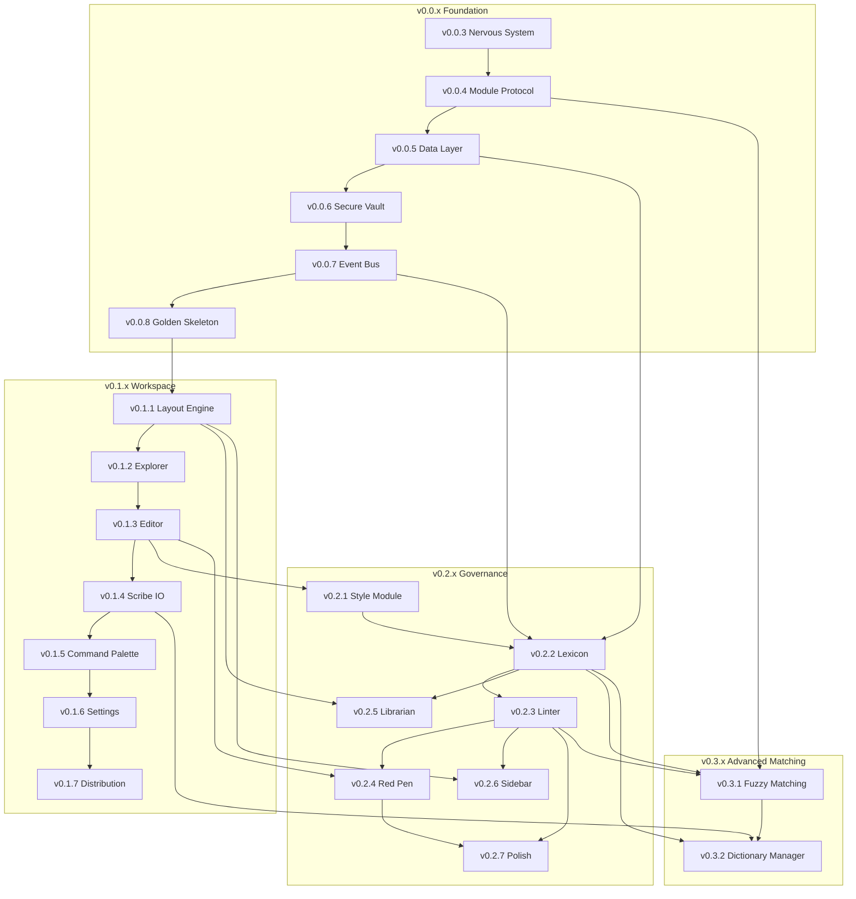

# Lexichord Specification Dependency Matrix

## Document Control

| Field | Value |
|:------|:------|
| **Document ID** | LCS-DEP-MATRIX |
| **Last Updated** | 2026-01-27 (v0.3.2 added) |
| **Purpose** | Cross-reference of all interfaces, services, and their source versions |

---

## 1. Interface Registry

### 1.1 v0.0.x Foundational Interfaces

| Interface | Defined In | Module | Purpose |
|:----------|:-----------|:-------|:--------|
| `IModule` | v0.0.4a | Abstractions | Module contract for dynamic loading |
| `ModuleInfo` | v0.0.4a | Abstractions | Module metadata record |
| `IModuleLoader` | v0.0.4b | Host | Module discovery and loading |
| `ILicenseContext` | v0.0.4c | Abstractions | Read-only license tier access |
| `LicenseTier` | v0.0.4c | Abstractions | Core/WriterPro/Teams/Enterprise enum |
| `RequiresLicenseAttribute` | v0.0.4c | Abstractions | License gating attribute |
| `IDbConnectionFactory` | v0.0.5b | Abstractions | Database connection creation |
| `IGenericRepository<T,TId>` | v0.0.5d | Abstractions | Base repository pattern |
| `ISecureVault` | v0.0.6a | Abstractions | Secure secrets storage |
| `VaultStatus` | v0.0.6a | Abstractions | Ready/Empty/Error/Unavailable enum |
| `IMediator` | v0.0.7a | MediatR (NuGet) | Event bus / CQRS mediator |
| `INotification` | v0.0.7a | MediatR (NuGet) | Domain event marker |
| `DomainEventBase` | v0.0.7b | Abstractions | Base class for domain events |
| `IShellRegionView` | v0.0.8a | Abstractions | Shell region contribution |
| `ShellRegion` | v0.0.8a | Abstractions | Top/Left/Center/Right/Bottom enum |
| `IConfigurationService` | v0.0.3d | Abstractions | Configuration access |
| `IThemeManager` | v0.0.2c | Host | Theme switching (Light/Dark/System) |
| `IWindowStateService` | v0.0.2c | Host | Window position/size persistence |

### 1.2 v0.1.x Workspace Interfaces

| Interface | Defined In | Module | Purpose |
|:----------|:-----------|:-------|:--------|
| `IDockFactory` | v0.1.1a | Abstractions | Dock layout creation |
| `IRegionManager` | v0.1.1b | Abstractions | Module view injection |
| `ILayoutService` | v0.1.1c | Abstractions | Layout serialization |
| `DocumentViewModel` | v0.1.1d | Abstractions | Base class for tabbed documents |
| `IWorkspaceService` | v0.1.2a | Abstractions | Current workspace state |
| `IRobustFileSystemWatcher` | v0.1.2b | Abstractions | External file change detection |
| `IFileOperationService` | v0.1.2d | Abstractions | File CRUD operations |
| `IEditorService` | v0.1.3a | Abstractions | Document editing coordination |
| `ISyntaxHighlightingService` | v0.1.3b | Abstractions | XSHD definition loading |
| `ISearchService` | v0.1.3c | Abstractions | Find/Replace operations |
| `IEditorConfigurationService` | v0.1.3d | Abstractions | Editor preferences |
| `IDirtyStateTracker` | v0.1.4a | Abstractions | Unsaved changes tracking |
| `IFileService` | v0.1.4b | Abstractions | Atomic file I/O |
| `IShutdownService` | v0.1.4c | Abstractions | Safe close workflow |
| `IRecentFilesService` | v0.1.4d | Abstractions | MRU file history |
| `ICommandRegistry` | v0.1.5a | Abstractions | Command registration |
| `IFileIndexService` | v0.1.5c | Abstractions | Workspace file indexing |
| `IKeyBindingService` | v0.1.5d | Abstractions | Keyboard shortcut management |
| `ISettingsPage` | v0.1.6a | Abstractions | Module settings contribution |
| `ISettingsService` | v0.1.6a | Abstractions | General preferences persistence |
| `ILicenseService` | v0.1.6c | Abstractions | License validation (extends ILicenseContext) |
| `IUpdateService` | v0.1.7a | Abstractions | Velopack update management |
| `IFirstRunService` | v0.1.7c | Abstractions | Version tracking / release notes |
| `ITelemetryService` | v0.1.7d | Abstractions | Optional Sentry crash reporting |

### 1.3 v0.2.x Governance Interfaces

| Interface | Defined In | Module | Purpose |
|:----------|:-----------|:-------|:--------|
| `IStyleEngine` | v0.2.1a | Modules.Style | Core style analysis |
| `IStyleSheetLoader` | v0.2.1c | Modules.Style | YAML stylesheet loading |
| `IStyleConfigurationWatcher` | v0.2.1d | Modules.Style | Live file reload |
| `StyleRule` | v0.2.1b | Abstractions | Rule definition record |
| `StyleSheet` | v0.2.1b | Abstractions | Aggregate rule container |
| `RuleCategory` | v0.2.1b | Abstractions | Terminology/Formatting/Syntax enum |
| `ViolationSeverity` | v0.2.1b | Abstractions | Error/Warning/Info/Hint enum |
| `StyleViolation` | v0.2.1b | Abstractions | Violation result record |
| `ITerminologyRepository` | v0.2.2b | Modules.Style | Cached DB access for terms |
| `ITerminologySeeder` | v0.2.2c | Modules.Style | Bootstrap seed data |
| `ITerminologyService` | v0.2.2d | Modules.Style | CRUD with events |
| `StyleTerm` | v0.2.2a | Abstractions | Term entity model |
| `ILintingOrchestrator` | v0.2.3a | Modules.Style | Reactive linting coordinator |
| `ILintingConfiguration` | v0.2.3b | Modules.Style | Debounce and settings |
| `IStyleScanner` | v0.2.3c | Modules.Style | Regex pattern matching |
| `IViolationAggregator` | v0.2.3d | Modules.Style | Result aggregation |
| `IViolationProvider` | v0.2.4a | Modules.Style | Violation data for renderer |
| `IViolationColorProvider` | v0.2.4b | Modules.Style | Theme-aware colors |
| `IViolationTooltipService` | v0.2.4c | Modules.Style | Hover tooltip display |
| `IQuickFixService` | v0.2.4d | Modules.Style | Context menu fixes |
| `ITerminologyImporter` | v0.2.5d | Modules.Style | CSV/Excel import |
| `ITerminologyExporter` | v0.2.5d | Modules.Style | JSON export |
| `IProblemsPanelViewModel` | v0.2.6a | Modules.Style | Problems panel state |
| `IEditorNavigationService` | v0.2.6b | Abstractions | Cross-document navigation |
| `IScorecardViewModel` | v0.2.6c | Modules.Style | Compliance score widget |
| `IProjectLintingService` | v0.2.6d | Modules.Style | Background project scanning |
| `IThreadMarshaller` | v0.2.7a | Abstractions | UI thread dispatching |
| `IContentFilter` | v0.2.7b | Modules.Style | Pre-scan content filtering |

### 1.4 v0.3.x Fuzzy Engine Interfaces

| Interface | Defined In | Module | Purpose |
|:----------|:-----------|:-------|:--------|
| `IFuzzyMatchService` | v0.3.1a | Abstractions | Levenshtein distance / fuzzy ratio calculation |
| `IDocumentTokenizer` | v0.3.1c | Abstractions | Text tokenization for scanning |
| `IFuzzyScanner` | v0.3.1c | Abstractions | Fuzzy violation detection |
| `FeatureKeys` | v0.3.1d | Abstractions | Feature gate key constants |
| `IFeatureMatrix` | v0.3.1d | Abstractions | Feature → License tier mapping |
| `IModuleFeatureRegistrar` | v0.3.1d | Abstractions | Module feature registration contract |
| `StyleFeatureRegistry` | v0.3.1d | Modules.Style | Style module feature registration |

### 1.5 v0.3.2 Dictionary Manager Interfaces

| Interface | Defined In | Module | Purpose |
|:----------|:-----------|:-------|:--------|
| `IDialogService` | v0.3.2b | Abstractions | Modal dialog management |
| `ITerminologyImporter` | v0.3.2d | Abstractions | CSV import contract (supersedes v0.2.5d) |
| `ITerminologyExporter` | v0.3.2d | Abstractions | JSON export contract (supersedes v0.2.5d) |

**New Records (v0.3.2):**

| Record | Defined In | Module | Purpose |
|:-------|:-----------|:-------|:--------|
| `StyleTermDto` | v0.3.2a | Modules.Style | View-layer term representation |
| `DialogResult<T>` | v0.3.2b | Abstractions | Dialog return value wrapper |
| `ImportMapping` | v0.3.2d | Abstractions | CSV column to DB field mapping |
| `ImportResult` | v0.3.2d | Abstractions | Import operation outcome |
| `ImportOptions` | v0.3.2d | Abstractions | Skip/overwrite configuration |
| `ImportError` | v0.3.2d | Abstractions | Row-level import failure details |
| `ExportDocument` | v0.3.2d | Modules.Style | Export JSON structure |
| `ExportedTerm` | v0.3.2d | Modules.Style | Term representation in export |

**New Classes (v0.3.2):**

| Class | Defined In | Module | Purpose |
|:------|:-----------|:-------|:--------|
| `StyleTermValidator` | v0.3.2c | Modules.Style | FluentValidation validator |
| `ValidationConstants` | v0.3.2c | Modules.Style | Centralized validation constants |
| `CsvTerminologyImporter` | v0.3.2d | Modules.Style | CSV import implementation |
| `JsonTerminologyExporter` | v0.3.2d | Modules.Style | JSON export implementation |
| `LexiconViewModel` | v0.3.2a | Modules.Style | DataGrid ViewModel |
| `TermEditorViewModel` | v0.3.2b | Modules.Style | Term editor dialog ViewModel |
| `ImportWizardViewModel` | v0.3.2d | Modules.Style | Import wizard ViewModel |

**Extended Records (v0.3.1):**

| Record | Extended In | New Properties | Purpose |
|:-------|:------------|:---------------|:--------|
| `StyleTerm` | v0.3.1b | `FuzzyEnabled`, `FuzzyThreshold` | Per-term fuzzy configuration |
| `StyleViolation` | v0.3.1c | `IsFuzzyMatch`, `FuzzyRatio` | Fuzzy match identification |

**Extended Interfaces (v0.3.1):**

| Interface | Extended In | New Methods | Purpose |
|:----------|:------------|:------------|:--------|
| `ITerminologyRepository` | v0.3.1b | `GetFuzzyEnabledTermsAsync()` | Query fuzzy-enabled terms |

---

## 2. MediatR Events Registry

| Event | Defined In | Purpose |
|:------|:-----------|:--------|
| `ModuleInitializedEvent` | v0.0.8 | Module loaded and ready |
| `SystemHealthChangedEvent` | v0.0.8 | Health status change |
| `VaultStatusChangedEvent` | v0.0.8 | Vault availability change |
| `SettingsChangedEvent` | v0.0.7b | Configuration value changed |
| `LayoutChangedEvent` | v0.1.1c | Layout state change |
| `ViewRegisteredEvent` | v0.1.1b | View added to region |
| `WorkspaceOpenedEvent` | v0.1.2a | Workspace folder opened |
| `WorkspaceClosedEvent` | v0.1.2a | Workspace folder closed |
| `FileCreatedEvent` | v0.1.2d | New file created |
| `FileDeletedEvent` | v0.1.2d | File deleted |
| `FileRenamedEvent` | v0.1.2d | File renamed |
| `ExternalFileChangesEvent` | v0.1.2b | Batch external changes |
| `DocumentChangedEvent` | v0.1.3a | Document content modified |
| `DocumentSavedEvent` | v0.1.4b | Document saved |
| `DocumentClosedEvent` | v0.1.4c | Document tab closed |
| `DocumentDirtyChangedEvent` | v0.1.4a | Dirty state changed |
| `CommandExecutedEvent` | v0.1.5b | Command invoked |
| `ThemeChangedEvent` | v0.1.6b | Theme selection changed |
| `StyleSheetReloadedEvent` | v0.2.1d | Style rules reloaded |
| `LexiconChangedEvent` | v0.2.2d | Terminology modified |
| `LintingCompletedEvent` | v0.2.3d | Linting analysis complete |
| `LintingStartedEvent` | v0.2.3a | Linting analysis started |

---

## 3. NuGet Package Registry

| Package | Version | Introduced In | Purpose |
|:--------|:--------|:--------------|:--------|
| `Serilog` | 4.x | v0.0.3b | Structured logging |
| `Serilog.Sinks.File` | 6.x | v0.0.3b | File sink |
| `Serilog.Sinks.Console` | 6.x | v0.0.3b | Console sink |
| `Microsoft.Extensions.DependencyInjection` | 9.0.x | v0.0.3a | DI container |
| `Microsoft.Extensions.Configuration` | 9.0.x | v0.0.3d | Configuration |
| `Microsoft.Extensions.Caching.Memory` | 9.0.x | v0.2.2b | In-memory caching |
| `MediatR` | 12.4.x | v0.0.7a | Event bus / CQRS |
| `Npgsql` | 9.0.x | v0.0.5b | PostgreSQL driver |
| `Dapper` | 2.1.x | v0.0.5d | Micro-ORM |
| `FluentMigrator` | 6.2.x | v0.0.5c | Schema migrations |
| `FluentValidation` | 11.9.x | v0.0.7d | Input validation |
| `Polly` | 8.5.x | v0.0.5d | Resilience policies |
| `Dock.Avalonia` | 11.x | v0.1.1a | Docking system |
| `AvaloniaEdit` | 11.x | v0.1.3a | Text editor control |
| `Material.Icons.Avalonia` | 2.x | v0.1.2c | File icons |
| `FuzzySharp` | 2.x | v0.1.5b | Fuzzy string matching |
| `YamlDotNet` | 16.x | v0.2.1c | YAML parsing |
| `System.Reactive` | 6.x | v0.2.3a | Reactive extensions |
| `Velopack` | 0.x | v0.1.7a | Auto-updater |
| `Sentry` | 4.x | v0.1.7d | Crash reporting |
| `CsvHelper` | 31.x | v0.3.2d | CSV parsing for terminology import |

---

## 4. Identified Issues and Corrections

### 4.1 Phantom References (FIXED)

| Spec | Incorrect Reference | Correct Reference |
|:-----|:--------------------|:------------------|
| v0.1.3d | `ISettingsService` from v0.0.6 | `ISettingsService` from **v0.1.6a** |
| v0.2.4 | `IThemeManager` from v0.0.5 | `IThemeManager` from **v0.0.2c** |
| v0.2.4 | `ILinterService` from v0.2.3b | `ILintingOrchestrator` from **v0.2.3a** |
| v0.2.5 | `ILicenseService` from v0.0.4c | `ILicenseService` from **v0.1.6c** (or use `ILicenseContext` from v0.0.4c) |
| v0.3.1d | `IFeatureMatrix` from v0.0.4b | `IFeatureMatrix` is **NEW** in **v0.3.1d** (not from v0.0.4b) |

### 4.2 Missing Definitions (Addressed)

| Interface | Status | Resolution |
|:----------|:-------|:-----------|
| `ISettingsService` | Was phantom in v0.0.x | Properly defined in v0.1.6a |
| `IThemeManager` | Referenced but not detailed | Defined in v0.0.2c (Shell specification) |
| `IEditorNavigationService` | New in v0.2.6b | Added to registry |
| `IFeatureMatrix` | Was incorrectly cited as v0.0.4b | New interface defined in v0.3.1d |
| `IModuleFeatureRegistrar` | New in v0.3.1d | Added to registry |

### 4.3 Interface Migrations (v0.3.2)

| Interface | Original Location | New Location | Reason |
|:----------|:------------------|:-------------|:-------|
| `ITerminologyImporter` | v0.2.5d Modules.Style | v0.3.2d Abstractions | Elevated to abstraction layer for broader use |
| `ITerminologyExporter` | v0.2.5d Modules.Style | v0.3.2d Abstractions | Elevated to abstraction layer for broader use |

**Note:** v0.3.2d redefines these interfaces with enhanced signatures in `Lexichord.Abstractions.Contracts`. The v0.2.5d definitions in `Modules.Style` are superseded.

---

## 5. Dependency Flow Diagram

---

## 6. Version Checklist

### v0.0.x Prerequisites for v0.1.x
- [x] IModule interface (v0.0.4a)
- [x] ILicenseContext (v0.0.4c)
- [x] IDbConnectionFactory (v0.0.5b)
- [x] ISecureVault (v0.0.6a)
- [x] MediatR Event Bus (v0.0.7a)
- [x] IShellRegionView (v0.0.8a)
- [x] IConfigurationService (v0.0.3d)
- [x] Serilog Pipeline (v0.0.3b)

### v0.1.x Prerequisites for v0.2.x
- [x] IRegionManager (v0.1.1b)
- [x] DocumentViewModel (v0.1.1d)
- [x] IWorkspaceService (v0.1.2a)
- [x] Editor Module / AvalonEdit (v0.1.3a)
- [x] ISettingsService (v0.1.6a)
- [x] ILicenseService (v0.1.6c)

### v0.2.x Internal Dependencies
- [x] StyleRule / StyleSheet (v0.2.1b)
- [x] ITerminologyRepository (v0.2.2b)
- [x] ILintingOrchestrator (v0.2.3a)
- [x] StyleViolation (v0.2.1b)
- [x] LintingCompletedEvent (v0.2.3d)

### v0.2.x Prerequisites for v0.3.x
- [x] StyleTerm entity (v0.2.2a)
- [x] ITerminologyRepository (v0.2.2b)
- [x] ITerminologySeeder (v0.2.2c)
- [x] ILintingOrchestrator (v0.2.3a)
- [x] IStyleScanner (v0.2.3c)
- [x] StyleViolation (v0.2.1b)
- [x] RuleCategory / ViolationSeverity enums (v0.2.1b)

### v0.0.x/v0.1.x Prerequisites for v0.3.x
- [x] ILicenseContext (v0.0.4c)
- [x] LicenseTier enum (v0.0.4c)
- [x] IDbConnectionFactory (v0.0.5b)
- [x] FuzzySharp NuGet (v0.1.5b)
- [x] Microsoft.Extensions.Caching.Memory (v0.2.2b)
- [x] FluentMigrator (v0.0.5c)

### v0.3.1 Prerequisites for v0.3.2
- [x] StyleTerm with FuzzyEnabled/FuzzyThreshold columns (v0.3.1b)
- [x] Feature.FuzzyMatching feature gate key (v0.3.1d)
- [x] IFuzzyMatchService (v0.3.1a)

### v0.2.x/v0.1.x/v0.0.x Prerequisites for v0.3.2
- [x] StyleTerm entity (v0.2.2a)
- [x] ITerminologyRepository (v0.2.2b)
- [x] ITerminologyService (v0.2.2d)
- [x] LexiconChangedEvent (v0.2.2d)
- [x] RuleCategory / ViolationSeverity enums (v0.2.1b)
- [x] ILicenseContext (v0.0.4c)
- [x] LicenseTier enum (v0.0.4c)
- [x] IFileService (v0.1.4b)
- [x] FluentValidation NuGet (v0.0.7d)
- [x] System.Reactive NuGet (v0.2.3a)
