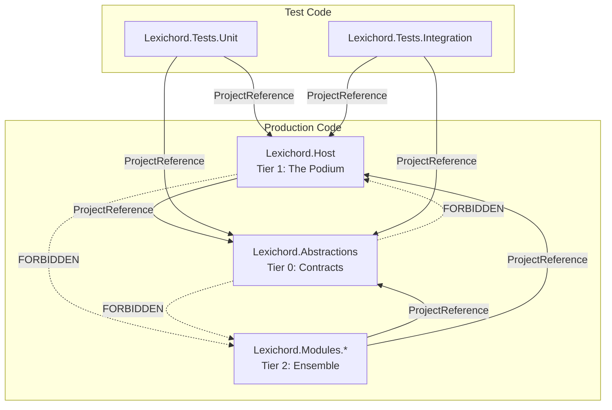

# LCS-DES-001: Design Specification Index — The Architecture Skeleton

## Document Control

| Field | Value |
| :--- | :--- |
| **Document ID** | LCS-DES-001-INDEX |
| **Feature ID** | INF-001 |
| **Feature Name** | The Architecture Skeleton |
| **Target Version** | v0.0.1 |
| **Module Scope** | Root |
| **Swimlane** | Infrastructure |
| **License Tier** | Core |
| **Feature Gate Key** | N/A |
| **Status** | Approved |
| **Last Updated** | 2026-01-27 |

---

## 1. Executive Summary

**v0.0.1** is the implementation of the "Modular Monolith" physical structure. No business logic or UI will be visible to a user. The success of this release is measured entirely by the **correctness of the dependency graph** and the **reliability of the build pipeline**.

### 1.1 The Problem

A production codebase requires a solid foundation before any business logic is implemented. Without a predefined structure, developers may inadvertently introduce circular dependencies, mix test code with production code, or create a "Big Ball of Mud" where feature boundaries are ambiguous.

### 1.2 The Solution

Establish the Modular Monolith architecture skeleton:

- **Solution Scaffolding** — Directory structure and project organization
- **Dependency Graph Enforcement** — Compile-time Onion Architecture rules
- **Test Suite Foundation** — Safety net before writing complex logic
- **CI/CD Pipeline** — Automated build and test on every commit

### 1.3 Business Value

| Value | Description |
| :--- | :--- |
| **Solid Foundation** | Clean architecture prevents technical debt |
| **Developer Confidence** | Automated tests catch regressions early |
| **Quality Gates** | CI/CD ensures only passing code merges |
| **Future-Proofing** | Plugin architecture (v0.0.4) depends on this foundation |

---

## 2. Related Documents

### 2.1 Scope Breakdown Document

The detailed scope breakdown for v0.0.1, including all sub-parts, implementation checklists, and acceptance criteria:

| Document | Description |
| :--- | :--- |
| **[LCS-SBD-001](./LCS-SBD-001.md)** | Scope Breakdown — The Architecture Skeleton |

### 2.2 Sub-Part Design Specifications

Each sub-part has its own detailed design specification following the LDS-01 template:

| Sub-Part | Document | Title | Description |
| :--- | :--- | :--- | :--- |
| v0.0.1a | **[LCS-DES-001a](./LCS-DES-001a.md)** | Solution Scaffolding | File system hierarchy and Solution file |
| v0.0.1b | **[LCS-DES-001b](./LCS-DES-001b.md)** | Dependency Graph Enforcement | Compile-time Onion Architecture rules |
| v0.0.1c | **[LCS-DES-001c](./LCS-DES-001c.md)** | Test Suite Foundation | Unit and Integration test infrastructure |
| v0.0.1d | **[LCS-DES-001d](./LCS-DES-001d.md)** | Continuous Integration Pipeline | GitHub Actions workflow |

---

## 3. Architecture Overview

### 3.1 Solution Structure

```text
/Lexichord (Root)
├── .github/
│   └── workflows/          # CI/CD pipelines (v0.0.1d)
├── docs/                   # LCS Documentation
├── src/
│   ├── Lexichord.Abstractions/   # Tier 0: Contracts
│   ├── Lexichord.Host/           # Tier 1: The Podium
│   └── Lexichord.Modules/        # Tier 2: Future plugins
├── tests/
│   ├── Lexichord.Tests.Unit/
│   └── Lexichord.Tests.Integration/
├── .editorconfig
├── .gitignore
├── Directory.Build.props
├── LICENSE
├── README.md
└── Lexichord.sln
```

### 3.2 Dependency Graph



---

## 4. Dependencies

### 4.1 External Tools

| Tool | Version | Purpose |
| :--- | :--- | :--- |
| .NET SDK | 9.0 | Runtime and build toolchain |
| Git | Latest | Source control |
| Docker Desktop | Latest | Integration test containers |
| Visual Studio / VS Code / Rider | Latest | IDE |

### 4.2 NuGet Packages (Test Projects)

| Project | Package | Purpose |
| :--- | :--- | :--- |
| Tests.Unit | `xunit` | Test framework |
| Tests.Unit | `FluentAssertions` | Readable assertions |
| Tests.Unit | `Moq` | Mocking framework |
| Tests.Integration | `Testcontainers` | Docker container management |
| Tests.Integration | `Testcontainers.PostgreSql` | PostgreSQL container builder |
| Tests.Integration | `Npgsql` | PostgreSQL client |

---

## 5. Implementation Checklist Summary

| Sub-Part | Key Deliverables | Status |
| :--- | :--- | :--- |
| v0.0.1a | Solution file, directory structure, Directory.Build.props | [ ] |
| v0.0.1b | Project references, dependency constraints | [ ] |
| v0.0.1c | Test projects, sanity tests, Docker connectivity test | [ ] |
| v0.0.1d | `.github/workflows/ci.yml`, GitHub Actions verification | [ ] |

See [LCS-SBD-001](./LCS-SBD-001.md) Section 3 for the detailed implementation checklist.

---

## 6. Success Criteria Summary

| Category | Criterion | Target |
| :--- | :--- | :--- |
| **Structure** | Root directory contains expected folders and files | Pass |
| **Compilation** | `dotnet build` succeeds with 0 Errors, 0 Warnings | Pass |
| **Dependencies** | Host references only Abstractions | Pass |
| **Tests** | `dotnet test` discovers and runs all tests | Pass |
| **CI/CD** | GitHub Actions shows green checkmark | Pass |

See individual design specs (Section 10/13) for detailed acceptance criteria.

---

## 7. Risks & Mitigations

| Risk | Impact | Mitigation |
| :--- | :--- | :--- |
| Docker not installed | High | Mark integration tests with `[Trait("Category", "Integration")]` for selective execution |
| Circular dependencies | High | `.csproj` structure prevents compile-time circular refs |
| GitHub Actions outage | Medium | Local testing provides backup confidence |

---

## 8. What This Enables

| Version | Feature | Depends On |
| :--- | :--- | :--- |
| v0.0.2 | Database Foundation | Test infrastructure (v0.0.1c) |
| v0.0.3 | User Settings & Preferences | CI/CD pipeline (v0.0.1d) |
| v0.0.4 | Plugin Architecture | Dependency graph (v0.0.1b) |

---

## Document History

| Version | Date | Author | Changes |
| :--- | :--- | :--- | :--- |
| 1.0 | 2026-01-27 | System Architect | Initial INDEX creation from legacy combined spec |
