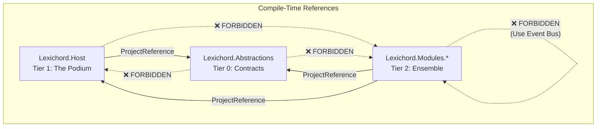

# LCS-01: Feature Design Composition

## 1. Metadata & Categorization

| Field                | Value                        | Description                                           |
| :------------------- | :--------------------------- | :---------------------------------------------------- |
| **Feature ID**       | `INF-001b`                   | Infrastructure - Project Reference Lock               |
| **Feature Name**     | Dependency Graph Enforcement | Compile-time enforcement of Onion Architecture rules. |
| **Target Version**   | `v0.0.1b`                    | Foundation Layer.                                     |
| **Module Scope**     | `Root`                       | Global Solution scope (`.csproj` configuration).      |
| **Swimlane**         | `Infrastructure`             | The Podium (Platform).                                |
| **License Tier**     | `Core`                       | Foundation (Required for all tiers).                  |
| **Feature Gate Key** | N/A                          | No runtime gating required for build configuration.   |
| **Author**           | System Architect             |                                                       |
| **Status**           | **Draft**                    | Pending approval.                                     |
| **Last Updated**     | 2026-01-26                   |                                                       |

---

## 2. Executive Summary

### 2.1 The Requirement

The Modular Monolith architecture **MUST** be enforced at compile-time rather than relying on developer discipline. Without explicit `.csproj` reference constraints:

- Developers may accidentally introduce circular dependencies between Host and Modules.
- The `Abstractions` layer may accumulate unwanted internal project references, violating its role as the lowest-tier contract layer.
- Future Plugin architecture (v0.0.4) **WILL** fail if the dependency graph is corrupted.

### 2.2 The Proposed Solution

We **SHALL** configure the project files (`.csproj`) to establish and enforce the canonical dependency hierarchy:

```text
┌──────────────────────────────────────────────────────────────┐
│                    Lexichord.Host (Tier 1)                   │
│                         The Podium                           │
│                            │                                 │
│                            ▼                                 │
│             Lexichord.Abstractions (Tier 0)                  │
│                    Interfaces & Contracts                    │
│                                                              │
│  ┌─────────────────────────────────────────────────────┐     │
│  │               Lexichord.Modules.* (Tier 2)          │     │
│  │   Future plugins load via Reflection only.          │     │
│  │   Host MUST NOT reference Modules at compile-time.  │     │
│  └─────────────────────────────────────────────────────┘     │
└──────────────────────────────────────────────────────────────┘
```

---

## 3. Architecture & Modular Strategy

### 3.1 Dependencies

- **External Tools:**
    - .NET 9.0 SDK (`net9.0`)
    - Visual Studio 2022 / VS Code / Rider

### 3.2 The Dependency Hierarchy Rules

These are the **Golden Rules** from `rules-general.md` Section 2.1, codified into `.csproj` constraints:

| Project                  | MAY Reference               | MUST NOT Reference                      |
| :----------------------- | :-------------------------- | :-------------------------------------- |
| `Lexichord.Abstractions` | Nothing (Tier 0—The Bottom) | Any internal project                    |
| `Lexichord.Host`         | `Lexichord.Abstractions`    | Any project in `src/Lexichord.Modules/` |
| `Lexichord.Modules.*`    | `Host` and `Abstractions`   | Other Modules (Event Bus communication) |

### 3.3 Licensing Behavior

- **N/A:** This specification concerns compile-time configuration. Licensing logic does not apply to `.csproj` settings.

---

## 4. Data Contract (The `.csproj` Configurations)

### 4.1 Lexichord.Abstractions.csproj

This project **SHALL** remain dependency-free to serve as the pure contract layer.

```xml
<Project Sdk="Microsoft.NET.Sdk">
  <!--
    CONSTRAINT: This project MUST NOT reference any other internal project.
    It defines shared interfaces, enums, and attributes only.
    All external dependencies SHOULD be minimal (standard system libraries).
  -->
</Project>
```

**Enforcement:** The absence of any `<ProjectReference>` elements is the constraint. Code review **MUST** reject any PR adding internal references.

### 4.2 Lexichord.Host.csproj

The Host (Podium) **SHALL** reference only `Abstractions` and **MUST NOT** reference any Module.

```xml
<Project Sdk="Microsoft.NET.Sdk">

  <PropertyGroup>
    <OutputType>Exe</OutputType>
  </PropertyGroup>

  <ItemGroup>
    <!-- ALLOWED: Reference to Abstractions (Tier 0) -->
    <ProjectReference Include="..\Lexichord.Abstractions\Lexichord.Abstractions.csproj" />

    <!-- DO NOT ADD: References to any project inside src/Lexichord.Modules/ -->
    <!-- Modules are loaded via Reflection at runtime, never compile-time. -->
  </ItemGroup>

</Project>
```

### 4.3 Future Module Template (For Reference)

When Modules are created in later versions, they **SHALL** follow this pattern:

```xml
<Project Sdk="Microsoft.NET.Sdk">
  <ItemGroup>
    <!-- ALLOWED: Reference to Host and Abstractions -->
    <ProjectReference Include="..\..\Lexichord.Host\Lexichord.Host.csproj" />
    <ProjectReference Include="..\..\Lexichord.Abstractions\Lexichord.Abstractions.csproj" />

    <!-- DO NOT ADD: References to other Lexichord.Modules.* projects -->
    <!-- Inter-module communication occurs via the Event Bus (Mediator pattern). -->
  </ItemGroup>
</Project>
```

---

## 5. Implementation Logic

### 5.1 Dependency Flow Diagram



### 5.2 CLI Execution Plan

The implementation **MUST** be performed via CLI for reproducibility:

1.  **Add Reference from Host to Abstractions:**

    ```bash
    dotnet add src/Lexichord.Host/Lexichord.Host.csproj reference src/Lexichord.Abstractions/Lexichord.Abstractions.csproj
    ```

2.  **Verify No Circular References:**
    ```bash
    dotnet build
    ```
    _Success criteria:_ Build completes with 0 Errors.

---

## 6. Data Persistence

- **N/A:** No database operations in this step.

---

## 7. UI/UX Specifications

- **N/A:** No runtime UI.
- **Developer Experience (DX):**
    - In Visual Studio's Solution Explorer, right-clicking `Lexichord.Host` and selecting "Project Dependencies" **MUST** show only `Lexichord.Abstractions`.
    - Attempting to add a reference to a future Module project from Host **MUST** be rejected during code review per `rules-general.md` Section 2.1.

---

## 8. Observability & Logging

- **N/A:** Runtime logging is not yet implemented.
- **Build Output:** The MSBuild output **SHALL** confirm the project reference graph through dependency resolution logs (visible in detailed verbosity: `dotnet build -v d`).

---

## 9. Security & Safety

- **Circular Dependency Prevention:** The `.csproj` structure prevents **compile-time** circular references.
- **Logical Circular References:** Code review **MUST** watch for event loops or callback chains that create **runtime** circular dependencies. These are architectural risks flagged in `LCS-SBD-001.md` Section 4.

> [!CAUTION]
> While `.csproj` constraints prevent direct circular references, developers **MUST** remain vigilant for logical circularity introduced through event subscriptions or interface callbacks.

---

## 10. Acceptance Criteria (QA)

These criteria feed directly into **LCS-02 (Rehearsal Strategy)**.

| #   | Category           | Criterion                                                                                         |
| --- | ------------------ | ------------------------------------------------------------------------------------------------- |
| 1   | **[Graph]**        | The dependency graph shows `Host → Abstractions` with no other internal references.               |
| 2   | **[Compilation]**  | Running `dotnet build` from the root succeeds with 0 Errors and 0 Warnings.                       |
| 3   | **[Abstractions]** | `Lexichord.Abstractions.csproj` contains **zero** `<ProjectReference>` elements.                  |
| 4   | **[Host]**         | `Lexichord.Host.csproj` contains exactly **one** `<ProjectReference>` pointing to `Abstractions`. |
| 5   | **[Forbidden]**    | No `.csproj` file references any project inside `src/Lexichord.Modules/`.                         |

---

## 11. Verification Commands

The following commands **SHALL** be executed to verify compliance:

```bash
# 1. Verify build succeeds
dotnet build --configuration Release

# 2. Verify Abstractions has no project references
grep -c "ProjectReference" src/Lexichord.Abstractions/Lexichord.Abstractions.csproj
# Expected output: 0 (or no match)

# 3. Verify Host references only Abstractions
grep "ProjectReference" src/Lexichord.Host/Lexichord.Host.csproj
# Expected output: Single line referencing Lexichord.Abstractions

# 4. Verify no Module references exist anywhere
grep -r "Lexichord.Modules" src/**/*.csproj
# Expected output: No matches
```
