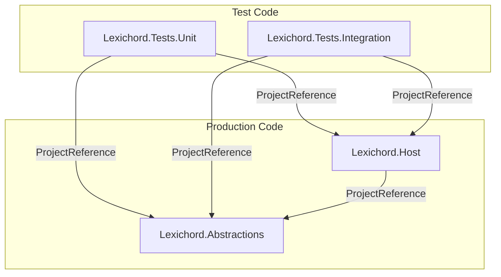
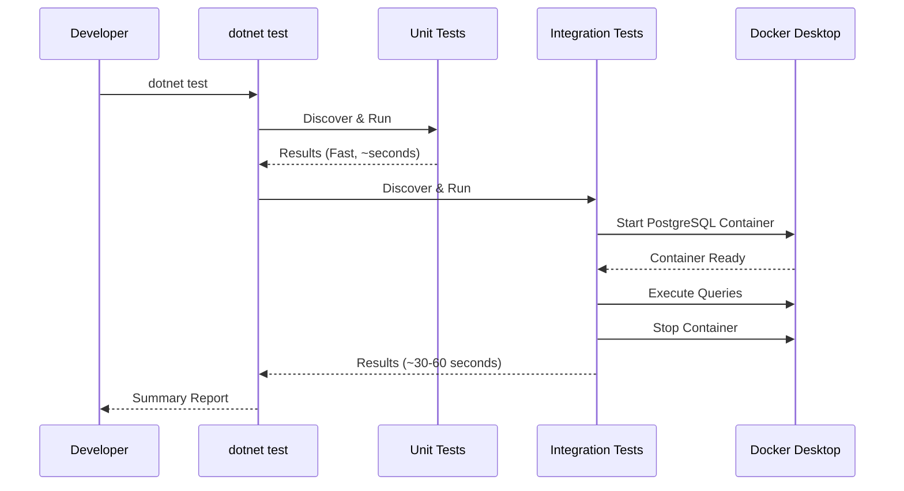

# LCS-01: Feature Design Composition

## 1. Metadata & Categorization

| Field                | Value                 | Description                                      |
| :------------------- | :-------------------- | :----------------------------------------------- |
| **Feature ID**       | `INF-001c`            | Infrastructure - Test Suite Genesis              |
| **Feature Name**     | Test Suite Foundation | Establishing the safety net for all future code. |
| **Target Version**   | `v0.0.1c`             | Foundation Layer.                                |
| **Module Scope**     | `tests/`              | Test project directory.                          |
| **Swimlane**         | `Infrastructure`      | The Podium (Platform).                           |
| **License Tier**     | `Core`                | Foundation (Required for all tiers).             |
| **Feature Gate Key** | N/A                   | No runtime gating for test infrastructure.       |
| **Author**           | System Architect      |                                                  |
| **Status**           | **Draft**             | Pending approval.                                |
| **Last Updated**     | 2026-01-26            |                                                  |

---

## 2. Executive Summary

### 2.1 The Requirement

A production codebase without automated tests is a liability. Before implementing any business logic (Style Engine, RAG Pipeline, Agents), we **MUST** establish:

1. **Unit Test Infrastructure** — Fast, isolated tests for logic verification.
2. **Integration Test Infrastructure** — Container-based tests proving external service connectivity.
3. **Execution Proof** — At least one passing test in each category to validate the pipeline.

Without this safety net:

- Refactoring becomes high-risk.
- Regressions go undetected until production.
- CI/CD (v0.0.1d) cannot provide meaningful feedback.

### 2.2 The Proposed Solution

We **SHALL** establish two test projects following industry best practices:

| Project                       | Purpose                                 | Framework & Tooling                              |
| :---------------------------- | :-------------------------------------- | :----------------------------------------------- |
| `Lexichord.Tests.Unit`        | Fast, isolated logic verification       | xUnit, FluentAssertions, Moq                     |
| `Lexichord.Tests.Integration` | External service & container validation | xUnit, Testcontainers, Testcontainers.PostgreSql |

---

## 3. Architecture & Modular Strategy

### 3.1 Test Project Dependency Graph



### 3.2 NuGet Package Matrix

| Project                       | Package                     | Version (Minimum) | Purpose                      |
| :---------------------------- | :-------------------------- | :---------------- | :--------------------------- |
| `Lexichord.Tests.Unit`        | `xunit`                     | 2.6.0             | Test framework               |
| `Lexichord.Tests.Unit`        | `xunit.runner.visualstudio` | 2.5.0             | IDE test discovery           |
| `Lexichord.Tests.Unit`        | `FluentAssertions`          | 6.12.0            | Readable assertion syntax    |
| `Lexichord.Tests.Unit`        | `Moq`                       | 4.20.0            | Mocking framework            |
| `Lexichord.Tests.Unit`        | `Microsoft.NET.Test.Sdk`    | 17.8.0            | Required for `dotnet test`   |
| `Lexichord.Tests.Integration` | `xunit`                     | 2.6.0             | Test framework               |
| `Lexichord.Tests.Integration` | `xunit.runner.visualstudio` | 2.5.0             | IDE test discovery           |
| `Lexichord.Tests.Integration` | `Testcontainers`            | 3.7.0             | Docker container management  |
| `Lexichord.Tests.Integration` | `Testcontainers.PostgreSql` | 3.7.0             | PostgreSQL container builder |
| `Lexichord.Tests.Integration` | `Microsoft.NET.Test.Sdk`    | 17.8.0            | Required for `dotnet test`   |
| `Lexichord.Tests.Integration` | `FluentAssertions`          | 6.12.0            | Readable assertion syntax    |

### 3.3 Licensing Behavior

- **N/A:** Tests are development-time artifacts and do not participate in runtime licensing.

---

## 4. Decision Tree: Test Categorization

When writing tests for Lexichord, developers **MUST** traverse this decision tree:

```text
START: "Where does this test belong?"
│
├── Does the test require external resources? (Database, API, File System, Network)
│   ├── YES → Integration Test Project
│   │   │
│   │   ├── Does it require Docker?
│   │   │   └── YES → Mark with [Trait("Category", "Integration")]
│   │   │
│   │   └── Does it call a real external API?
│   │       └── YES → Mark with [Trait("Category", "External")]
│   │
│   └── NO → Unit Test Project
│       │
│       ├── Does it test a single class in isolation?
│       │   └── YES → Standard unit test
│       │
│       └── Does it test interaction between internal classes?
│           └── YES → Consider if mocking is appropriate
│
└── FALLBACK: If uncertain, prefer Unit Test with mocks.
```

---

## 5. Data Contracts (Test Project Configurations)

### 5.1 Lexichord.Tests.Unit.csproj

```xml
<Project Sdk="Microsoft.NET.Sdk">

  <PropertyGroup>
    <IsPackable>false</IsPackable>
    <IsTestProject>true</IsTestProject>
  </PropertyGroup>

  <ItemGroup>
    <!-- Test Framework -->
    <PackageReference Include="Microsoft.NET.Test.Sdk" Version="17.8.0" />
    <PackageReference Include="xunit" Version="2.6.6" />
    <PackageReference Include="xunit.runner.visualstudio" Version="2.5.6">
      <PrivateAssets>all</PrivateAssets>
      <IncludeAssets>runtime; build; native; contentfiles; analyzers; buildtransitive</IncludeAssets>
    </PackageReference>

    <!-- Assertions & Mocking -->
    <PackageReference Include="FluentAssertions" Version="6.12.0" />
    <PackageReference Include="Moq" Version="4.20.70" />

    <!-- Code Coverage -->
    <PackageReference Include="coverlet.collector" Version="6.0.0">
      <PrivateAssets>all</PrivateAssets>
      <IncludeAssets>runtime; build; native; contentfiles; analyzers; buildtransitive</IncludeAssets>
    </PackageReference>
  </ItemGroup>

  <ItemGroup>
    <!-- Project References (Production Code) -->
    <ProjectReference Include="..\..\src\Lexichord.Abstractions\Lexichord.Abstractions.csproj" />
    <ProjectReference Include="..\..\src\Lexichord.Host\Lexichord.Host.csproj" />
  </ItemGroup>

</Project>
```

### 5.2 Lexichord.Tests.Integration.csproj

```xml
<Project Sdk="Microsoft.NET.Sdk">

  <PropertyGroup>
    <IsPackable>false</IsPackable>
    <IsTestProject>true</IsTestProject>
  </PropertyGroup>

  <ItemGroup>
    <!-- Test Framework -->
    <PackageReference Include="Microsoft.NET.Test.Sdk" Version="17.8.0" />
    <PackageReference Include="xunit" Version="2.6.6" />
    <PackageReference Include="xunit.runner.visualstudio" Version="2.5.6">
      <PrivateAssets>all</PrivateAssets>
      <IncludeAssets>runtime; build; native; contentfiles; analyzers; buildtransitive</IncludeAssets>
    </PackageReference>

    <!-- Assertions -->
    <PackageReference Include="FluentAssertions" Version="6.12.0" />

    <!-- Testcontainers -->
    <PackageReference Include="Testcontainers" Version="3.7.0" />
    <PackageReference Include="Testcontainers.PostgreSql" Version="3.7.0" />

    <!-- PostgreSQL Client (for connection verification) -->
    <PackageReference Include="Npgsql" Version="8.0.2" />

    <!-- Code Coverage -->
    <PackageReference Include="coverlet.collector" Version="6.0.0">
      <PrivateAssets>all</PrivateAssets>
      <IncludeAssets>runtime; build; native; contentfiles; analyzers; buildtransitive</IncludeAssets>
    </PackageReference>
  </ItemGroup>

  <ItemGroup>
    <!-- Project References (Production Code) -->
    <ProjectReference Include="..\..\src\Lexichord.Abstractions\Lexichord.Abstractions.csproj" />
    <ProjectReference Include="..\..\src\Lexichord.Host\Lexichord.Host.csproj" />
  </ItemGroup>

</Project>
```

---

## 6. Implementation Logic

### 6.1 Workflow: Test Execution Pipeline



### 6.2 CLI Execution Plan

```bash
# 1. Create Unit Test Project
dotnet new xunit -o tests/Lexichord.Tests.Unit -n Lexichord.Tests.Unit

# 2. Create Integration Test Project
dotnet new xunit -o tests/Lexichord.Tests.Integration -n Lexichord.Tests.Integration

# 3. Add Projects to Solution with Virtual Folder
dotnet sln add tests/Lexichord.Tests.Unit/Lexichord.Tests.Unit.csproj --solution-folder tests
dotnet sln add tests/Lexichord.Tests.Integration/Lexichord.Tests.Integration.csproj --solution-folder tests

# 4. Add Project References (Unit Tests)
dotnet add tests/Lexichord.Tests.Unit/Lexichord.Tests.Unit.csproj reference src/Lexichord.Abstractions/Lexichord.Abstractions.csproj
dotnet add tests/Lexichord.Tests.Unit/Lexichord.Tests.Unit.csproj reference src/Lexichord.Host/Lexichord.Host.csproj

# 5. Add Project References (Integration Tests)
dotnet add tests/Lexichord.Tests.Integration/Lexichord.Tests.Integration.csproj reference src/Lexichord.Abstractions/Lexichord.Abstractions.csproj
dotnet add tests/Lexichord.Tests.Integration/Lexichord.Tests.Integration.csproj reference src/Lexichord.Host/Lexichord.Host.csproj

# 6. Install NuGet Packages (Unit Tests)
dotnet add tests/Lexichord.Tests.Unit/Lexichord.Tests.Unit.csproj package FluentAssertions
dotnet add tests/Lexichord.Tests.Unit/Lexichord.Tests.Unit.csproj package Moq
dotnet add tests/Lexichord.Tests.Unit/Lexichord.Tests.Unit.csproj package coverlet.collector

# 7. Install NuGet Packages (Integration Tests)
dotnet add tests/Lexichord.Tests.Integration/Lexichord.Tests.Integration.csproj package FluentAssertions
dotnet add tests/Lexichord.Tests.Integration/Lexichord.Tests.Integration.csproj package Testcontainers
dotnet add tests/Lexichord.Tests.Integration/Lexichord.Tests.Integration.csproj package Testcontainers.PostgreSql
dotnet add tests/Lexichord.Tests.Integration/Lexichord.Tests.Integration.csproj package Npgsql
dotnet add tests/Lexichord.Tests.Integration/Lexichord.Tests.Integration.csproj package coverlet.collector
```

---

## 7. Code Examples & Inline Documentation

### 7.1 The "Sanity" Test (Unit Test)

**File:** `tests/Lexichord.Tests.Unit/InfrastructureTests.cs`

```csharp
namespace Lexichord.Tests.Unit;

/// <summary>
/// Infrastructure verification tests.
/// These tests validate that the test framework and build pipeline function correctly.
/// </summary>
public class InfrastructureTests
{
    /// <summary>
    /// Sanity check to verify the test runner executes correctly.
    /// </summary>
    /// <remarks>
    /// LOGIC: This test exists purely to prove the xUnit runner discovers and executes tests.
    /// If this test fails, it indicates a fundamental issue with the test infrastructure,
    /// not with any application logic.
    /// </remarks>
    [Fact]
    public void TestRunner_ExecutesSuccessfully_WhenInvoked()
    {
        // Arrange
        var expected = true;

        // Act
        var actual = true;

        // Assert
        actual.Should().Be(expected, because: "the test framework must execute assertions correctly");
    }

    /// <summary>
    /// Verifies that FluentAssertions is correctly configured.
    /// </summary>
    [Fact]
    public void FluentAssertions_IsConfigured_WhenPackageInstalled()
    {
        // Arrange
        var testString = "Lexichord";

        // Act & Assert
        testString.Should().NotBeNullOrEmpty()
            .And.StartWith("Lexi")
            .And.EndWith("chord")
            .And.HaveLength(9);
    }

    /// <summary>
    /// Verifies that Moq mocking framework is correctly configured.
    /// </summary>
    [Fact]
    public void Moq_CreatesMocks_WhenFrameworkInstalled()
    {
        // Arrange
        var mockService = new Mock<IDisposable>();
        mockService.Setup(s => s.Dispose());

        // Act
        mockService.Object.Dispose();

        // Assert
        mockService.Verify(s => s.Dispose(), Times.Once);
    }
}
```

### 7.2 The "Docker" Test (Integration Test)

**File:** `tests/Lexichord.Tests.Integration/DockerConnectivityTests.cs`

```csharp
using Testcontainers.PostgreSql;

namespace Lexichord.Tests.Integration;

/// <summary>
/// Integration tests verifying Docker Desktop connectivity.
/// These tests require Docker Desktop to be installed and running.
/// </summary>
/// <remarks>
/// LOGIC: Integration tests are marked with the "Integration" trait to allow
/// developers without Docker to skip them using:
/// <code>dotnet test --filter Category!=Integration</code>
/// </remarks>
[Trait("Category", "Integration")]
public class DockerConnectivityTests : IAsyncLifetime
{
    private PostgreSqlContainer? _postgresContainer;

    /// <summary>
    /// Initializes the PostgreSQL container before each test.
    /// </summary>
    public async Task InitializeAsync()
    {
        _postgresContainer = new PostgreSqlBuilder()
            .WithImage("postgres:16-alpine")
            .WithDatabase("lexichord_test")
            .WithUsername("test_user")
            .WithPassword("test_password")
            .Build();
    }

    /// <summary>
    /// Disposes the PostgreSQL container after each test.
    /// </summary>
    public async Task DisposeAsync()
    {
        if (_postgresContainer is not null)
        {
            await _postgresContainer.DisposeAsync();
        }
    }

    /// <summary>
    /// Verifies that Docker Desktop is reachable and can spin up a PostgreSQL container.
    /// </summary>
    /// <remarks>
    /// LOGIC: This test is the "canary in the coal mine" for Docker integration.
    /// If this test fails:
    /// 1. Verify Docker Desktop is running.
    /// 2. Verify the user has permission to create containers.
    /// 3. Check for port conflicts on the default PostgreSQL port range.
    /// </remarks>
    [Fact]
    public async Task Docker_StartsPostgreSqlContainer_WhenDockerDesktopIsRunning()
    {
        // Arrange
        _postgresContainer.Should().NotBeNull("PostgreSQL container should be initialized");

        // Act
        await _postgresContainer!.StartAsync();

        // Assert
        _postgresContainer.State.Should().Be(TestcontainersStates.Running,
            because: "the PostgreSQL container should be running after StartAsync completes");

        // Cleanup is handled by DisposeAsync via IAsyncLifetime
    }

    /// <summary>
    /// Verifies that we can establish a connection to the containerized PostgreSQL instance.
    /// </summary>
    [Fact]
    public async Task PostgreSql_AcceptsConnections_WhenContainerIsRunning()
    {
        // Arrange
        await _postgresContainer!.StartAsync();
        var connectionString = _postgresContainer.GetConnectionString();

        // Act
        await using var connection = new Npgsql.NpgsqlConnection(connectionString);
        await connection.OpenAsync();

        // Assert
        connection.State.Should().Be(System.Data.ConnectionState.Open,
            because: "we should be able to connect to the PostgreSQL container");

        // Verify we can execute a simple query
        await using var command = connection.CreateCommand();
        command.CommandText = "SELECT 1";
        var result = await command.ExecuteScalarAsync();
        result.Should().Be(1, because: "the database should respond to queries");
    }

    /// <summary>
    /// Verifies that the container gracefully stops when disposed.
    /// </summary>
    [Fact]
    public async Task Docker_StopsContainer_WhenDisposed()
    {
        // Arrange
        await _postgresContainer!.StartAsync();
        _postgresContainer.State.Should().Be(TestcontainersStates.Running);

        // Act
        await _postgresContainer.StopAsync();

        // Assert
        _postgresContainer.State.Should().Be(TestcontainersStates.Exited,
            because: "the container should stop gracefully when StopAsync is called");
    }
}
```

---

## 8. Use Cases & User Stories

### 8.1 User Stories

| ID    | Role        | Story                                                                                          | Acceptance Criteria                                   |
| :---- | :---------- | :--------------------------------------------------------------------------------------------- | :---------------------------------------------------- |
| US-01 | Developer   | As a developer, I want to run `dotnet test` and see all tests discovered and executed.         | Test summary shows ≥2 tests discovered.               |
| US-02 | Developer   | As a developer, I want unit tests to run in under 5 seconds.                                   | Unit test execution time < 5 seconds.                 |
| US-03 | Developer   | As a developer without Docker, I want to skip integration tests gracefully.                    | `--filter Category!=Integration` skips Docker tests.  |
| US-04 | CI Pipeline | As the CI system, I want tests to fail if Docker is unavailable rather than hang indefinitely. | Testcontainers times out after 60 seconds with error. |

### 8.2 Use Cases

#### UC-01: Running All Tests

**Preconditions:**

- .NET 9 SDK installed
- Docker Desktop running (for integration tests)

**Flow:**

1. Developer opens terminal in project root.
2. Developer executes `dotnet test`.
3. System discovers tests in both projects.
4. Unit tests execute first (~2 seconds).
5. Integration tests execute (~30-60 seconds).
6. System displays summary: `Passed: X, Failed: 0, Skipped: 0`.

**Postconditions:**

- All tests pass.
- No orphan Docker containers remain.

#### UC-02: Running Unit Tests Only

**Preconditions:**

- .NET 9 SDK installed
- Docker Desktop may or may not be running

**Flow:**

1. Developer executes `dotnet test --filter Category!=Integration`.
2. System skips all tests marked with `[Trait("Category", "Integration")]`.
3. Only unit tests execute.

**Postconditions:**

- Integration tests are skipped.
- Execution completes in < 5 seconds.

---

## 9. Observability & Logging

### 9.1 Test Output Standards

All tests **MUST** provide meaningful output via xUnit's `ITestOutputHelper`:

```csharp
public class ExampleTests(ITestOutputHelper output)
{
    [Fact]
    public void Example_LogsToOutput()
    {
        // Log test context
        output.WriteLine($"[{DateTime.UtcNow:O}] Starting test execution");

        // ... test logic ...

        output.WriteLine($"[{DateTime.UtcNow:O}] Test completed successfully");
    }
}
```

### 9.2 Container Logging

Integration tests using Testcontainers **SHOULD** enable container log forwarding for debugging:

```csharp
var container = new PostgreSqlBuilder()
    .WithImage("postgres:16-alpine")
    .WithLogger(LoggerFactory.Create(builder => builder.AddConsole()).CreateLogger<PostgreSqlContainer>())
    .Build();
```

---

## 10. Unit Testing Requirements

### 10.1 Test Naming Convention

All test methods **MUST** follow the pattern:

```
MethodUnderTest_ExpectedBehavior_WhenCondition
```

**Examples:**

- `TestRunner_ExecutesSuccessfully_WhenInvoked`
- `Docker_StartsPostgreSqlContainer_WhenDockerDesktopIsRunning`
- `Connection_ThrowsException_WhenContainerNotStarted`

### 10.2 Arrange-Act-Assert Pattern

All tests **MUST** follow the AAA pattern with explicit comments:

```csharp
[Fact]
public void Example_ReturnsExpectedValue_WhenInputIsValid()
{
    // Arrange
    var input = "test";
    var expected = "TEST";

    // Act
    var actual = input.ToUpperInvariant();

    // Assert
    actual.Should().Be(expected);
}
```

---

## 11. Security & Safety

### 11.1 Docker Isolation

> [!IMPORTANT]
> Integration tests **MUST** use isolated container networks. Testcontainers handles this automatically, but custom configurations **MUST NOT** expose containers to the host network.

### 11.2 Credential Management

Test database credentials:

- **MUST** be hardcoded test values (not production secrets).
- **MUST NOT** be reused for any non-test environment.
- **SHOULD** be obviously fake (e.g., `test_user`, `test_password`).

---

## 12. Risks & Mitigations

| Risk                                | Impact | Mitigation                                                                                    |
| :---------------------------------- | :----- | :-------------------------------------------------------------------------------------------- |
| Docker not installed on dev machine | High   | Mark integration tests with `[Trait("Category", "Integration")]` for selective execution.     |
| Container startup timeout           | Medium | Configure Testcontainers with explicit timeout: `.WithWaitStrategy(Wait.ForUnixContainer())`. |
| Port conflicts                      | Low    | Testcontainers uses random ports by default; no manual port binding required.                 |
| Orphan containers                   | Medium | Testcontainers' Resource Reaper automatically cleans up orphaned containers.                  |

---

## 13. Acceptance Criteria (QA)

| #   | Category          | Criterion                                                                                                  |
| :-- | :---------------- | :--------------------------------------------------------------------------------------------------------- |
| 1   | **[Discovery]**   | `dotnet test --list-tests` shows tests from both `Lexichord.Tests.Unit` and `Lexichord.Tests.Integration`. |
| 2   | **[Unit Pass]**   | All unit tests pass with `dotnet test --filter Category!=Integration`.                                     |
| 3   | **[Integration]** | All integration tests pass when Docker Desktop is running.                                                 |
| 4   | **[Filtering]**   | `dotnet test --filter Category!=Integration` completes without attempting Docker operations.               |
| 5   | **[Solution]**    | Both test projects appear under a `tests` solution folder in the IDE.                                      |
| 6   | **[Cleanup]**     | After test execution, `docker ps` shows no orphan Lexichord test containers.                               |

---

## 14. Verification Commands

```bash
# 1. Verify test discovery
dotnet test --list-tests

# 2. Run unit tests only (no Docker required)
dotnet test --filter Category!=Integration

# 3. Run all tests (requires Docker Desktop)
dotnet test

# 4. Run with verbose output
dotnet test --logger "console;verbosity=detailed"

# 5. Verify no orphan containers
docker ps --filter "label=org.testcontainers=true"
# Expected: No running containers after tests complete
```

---

## 15. Deliverable Checklist

| Step | Description                                                     | Status |
| :--- | :-------------------------------------------------------------- | :----- |
| 1    | `Lexichord.Tests.Unit.csproj` created with all NuGet packages.  | [ ]    |
| 2    | `Lexichord.Tests.Integration.csproj` created with all packages. | [ ]    |
| 3    | Both projects added to solution under `tests` folder.           | [ ]    |
| 4    | `InfrastructureTests.cs` created with sanity tests.             | [ ]    |
| 5    | `DockerConnectivityTests.cs` created with container tests.      | [ ]    |
| 6    | `dotnet test --filter Category!=Integration` passes.            | [ ]    |
| 7    | `dotnet test` passes (full suite with Docker).                  | [ ]    |
