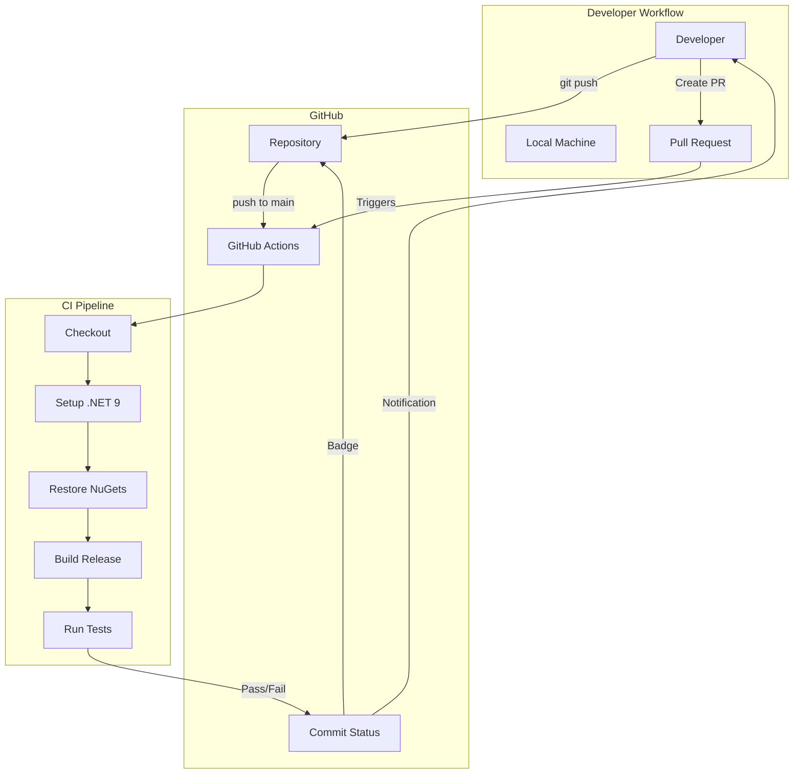
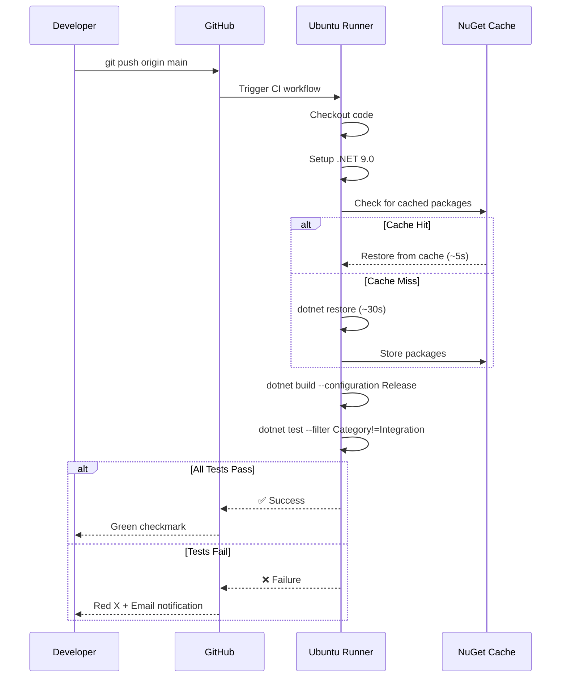

# LCS-01: Feature Design Composition

## 1. Metadata & Categorization

| Field                | Value                           | Description                                 |
| :------------------- | :------------------------------ | :------------------------------------------ |
| **Feature ID**       | `INF-001d`                      | Infrastructure - CI/CD Pipeline             |
| **Feature Name**     | Continuous Integration Pipeline | Automated build and test on every commit.   |
| **Target Version**   | `v0.0.1d`                       | Foundation Layer.                           |
| **Module Scope**     | `.github/workflows/`            | GitHub Actions configuration.               |
| **Swimlane**         | `Infrastructure`                | The Podium (Platform).                      |
| **License Tier**     | `Core`                          | Foundation (Required for all tiers).        |
| **Feature Gate Key** | N/A                             | No runtime gating for CI/CD infrastructure. |
| **Author**           | System Architect                |                                             |
| **Status**           | **Draft**                       | Pending approval.                           |
| **Last Updated**     | 2026-01-26                      |                                             |

---

## 2. Executive Summary

### 2.1 The Requirement

A codebase without automated CI/CD is vulnerable to:

- **Silent Regressions** — Broken builds go unnoticed until manual testing.
- **Integration Hell** — Developers work on divergent code that fails when merged.
- **False Confidence** — "It works on my machine" syndrome.

The Lexichord foundation **MUST** establish an automated pipeline that:

1. Triggers on every push to `main` and every pull request.
2. Builds the entire solution in Release configuration.
3. Runs all unit tests automatically.
4. Provides clear pass/fail feedback via GitHub's UI.

### 2.2 The Proposed Solution

We **SHALL** implement a GitHub Actions workflow (`.github/workflows/ci.yml`) that executes the Build → Test cycle on every code change targeting the `main` branch.

```text
┌─────────────────────────────────────────────────────────────────┐
│                    GitHub Actions Workflow                       │
├─────────────────────────────────────────────────────────────────┤
│  Trigger: push to main, pull_request to main                    │
│  Runner: ubuntu-latest                                          │
├─────────────────────────────────────────────────────────────────┤
│  Step 1: Checkout Code                                          │
│  Step 2: Setup .NET 9                                           │
│  Step 3: Restore Dependencies                                   │
│  Step 4: Build (Release)                                        │
│  Step 5: Test (Unit Only—No Docker in CI)                       │
└─────────────────────────────────────────────────────────────────┘
```

---

## 3. Architecture & Modular Strategy

### 3.1 CI/CD Architecture



### 3.2 Decision Tree: What Triggers the Pipeline?

```text
START: "Should this event trigger CI?"
│
├── Is this a push to the `main` branch?
│   └── YES → TRIGGER CI
│
├── Is this a pull request targeting `main`?
│   └── YES → TRIGGER CI
│
├── Is this a push to a feature branch (not main)?
│   └── NO → Do NOT trigger (saves runner minutes)
│
├── Is this a draft pull request?
│   └── YES → Still TRIGGER (catch issues early)
│
└── Is this a push to a non-protected branch?
    └── NO → Do NOT trigger
```

### 3.3 Decision Tree: Which Tests Run in CI?

```text
START: "Which tests should CI execute?"
│
├── Unit Tests (Category != Integration)
│   └── RUN → Fast, no external dependencies
│
├── Integration Tests (Category = Integration)
│   ├── Do we have Docker in CI?
│   │   ├── YES (future enhancement) → RUN
│   │   └── NO (current state) → SKIP
│   └── Rationale: Integration tests require Docker Desktop
│       which is not available on standard GitHub runners.
│
└── FALLBACK: Use --filter Category!=Integration
```

---

## 4. Data Contract (The Workflow File)

### 4.1 `.github/workflows/ci.yml`

```yaml
# =============================================================================
# Lexichord Continuous Integration Pipeline
# =============================================================================
# Purpose: Validate code quality on every push and pull request.
# Triggers: Push to main, Pull requests targeting main.
# Runner: Ubuntu Latest (Linux)
# =============================================================================

name: CI

on:
    push:
        branches:
            - main
    pull_request:
        branches:
            - main

# Cancel in-progress runs when a new commit is pushed to the same branch/PR
concurrency:
    group: ${{ github.workflow }}-${{ github.event.pull_request.number || github.ref }}
    cancel-in-progress: true

env:
    DOTNET_VERSION: "9.0.x"
    DOTNET_NOLOGO: true
    DOTNET_CLI_TELEMETRY_OPTOUT: true

jobs:
    build-and-test:
        name: Build & Test
        runs-on: ubuntu-latest

        steps:
            # =========================================================================
            # Step 1: Checkout Repository
            # =========================================================================
            - name: Checkout Code
              uses: actions/checkout@v4
              with:
                  fetch-depth: 0 # Full history for accurate versioning

            # =========================================================================
            # Step 2: Setup .NET SDK
            # =========================================================================
            - name: Setup .NET ${{ env.DOTNET_VERSION }}
              uses: actions/setup-dotnet@v4
              with:
                  dotnet-version: ${{ env.DOTNET_VERSION }}

            # =========================================================================
            # Step 3: Cache NuGet Packages
            # =========================================================================
            # LOGIC: Caching reduces restore time from ~30s to ~5s on subsequent runs.
            - name: Cache NuGet Packages
              uses: actions/cache@v4
              with:
                  path: ~/.nuget/packages
                  key: ${{ runner.os }}-nuget-${{ hashFiles('**/*.csproj') }}
                  restore-keys: |
                      ${{ runner.os }}-nuget-

            # =========================================================================
            # Step 4: Restore Dependencies
            # =========================================================================
            - name: Restore Dependencies
              run: dotnet restore

            # =========================================================================
            # Step 5: Build Solution
            # =========================================================================
            - name: Build Solution
              run: dotnet build --no-restore --configuration Release

            # =========================================================================
            # Step 6: Run Unit Tests
            # =========================================================================
            # LOGIC: We filter out Integration tests because they require Docker,
            # which is not available on standard GitHub-hosted runners.
            # Integration tests should be run locally before pushing.
            - name: Run Unit Tests
              run: dotnet test --no-build --configuration Release --filter Category!=Integration --verbosity normal

            # =========================================================================
            # Step 7: Upload Test Results (Optional, for future PR comments)
            # =========================================================================
            - name: Upload Test Results
              if: always()
              uses: actions/upload-artifact@v4
              with:
                  name: test-results
                  path: "**/TestResults/**"
                  retention-days: 7
```

---

## 5. Implementation Logic

### 5.1 Workflow Execution Sequence



### 5.2 CLI Execution Plan

```bash
# 1. Create the workflows directory
mkdir -p .github/workflows

# 2. Create the CI workflow file
touch .github/workflows/ci.yml
# (Populate with content from Section 4.1)

# 3. Verify YAML syntax locally (optional)
# Install yq or use online YAML validator
cat .github/workflows/ci.yml | python3 -c "import yaml, sys; yaml.safe_load(sys.stdin)"

# 4. Commit and push to trigger the workflow
git add .github/workflows/ci.yml
git commit -m "feat(infra): add CI/CD pipeline [INF-001d]"
git push origin main

# 5. Verify workflow triggered
# Navigate to: https://github.com/<owner>/lexichord/actions
```

---

## 6. Use Cases & User Stories

### 6.1 User Stories

| ID    | Role      | Story                                                                          | Acceptance Criteria                                       |
| :---- | :-------- | :----------------------------------------------------------------------------- | :-------------------------------------------------------- |
| US-01 | Developer | As a developer, I want every push to `main` to trigger automated tests.        | CI runs within 30 seconds of push.                        |
| US-02 | Developer | As a developer, I want to see a green checkmark when my code passes CI.        | GitHub shows ✅ on passing commits.                       |
| US-03 | Developer | As a developer, I want email notification when CI fails.                       | Failed CI sends email to commit author.                   |
| US-04 | Reviewer  | As a code reviewer, I want to see CI status on pull requests before approving. | PR page shows CI status check.                            |
| US-05 | Team Lead | As a team lead, I want to enforce passing CI before merging to main.           | Branch protection rule blocks failed PRs (future config). |

### 6.2 Use Cases

#### UC-01: Successful Build on Push

**Preconditions:**

- `.github/workflows/ci.yml` exists in repository.
- All tests pass locally.

**Flow:**

1. Developer commits and pushes to `main`.
2. GitHub detects push event matching workflow trigger.
3. GitHub spawns `ubuntu-latest` runner.
4. Runner executes all workflow steps in sequence.
5. All steps complete with exit code 0.
6. GitHub marks commit with green checkmark (✅).

**Postconditions:**

- Commit status shows "CI: Success."
- No email notification sent (success is silent).

---

#### UC-02: Failed Build on Pull Request

**Preconditions:**

- `.github/workflows/ci.yml` exists in repository.
- Developer introduces a syntax error.

**Flow:**

1. Developer creates pull request targeting `main`.
2. GitHub triggers CI workflow on `pull_request` event.
3. Runner executes checkout, setup, restore successfully.
4. `dotnet build` fails due to syntax error (exit code 1).
5. Workflow terminates immediately.
6. GitHub marks PR with red X (❌).
7. Developer receives email notification.

**Postconditions:**

- PR cannot be merged (if branch protection enabled).
- Build error message visible in Actions log.

---

#### UC-03: Cancelled Workflow on Rapid Pushes

**Preconditions:**

- Concurrency settings configured with `cancel-in-progress: true`.
- Developer pushes twice in quick succession.

**Flow:**

1. Developer pushes commit A.
2. CI starts for commit A.
3. Developer pushes commit B (30 seconds later).
4. GitHub cancels the in-progress run for commit A.
5. CI starts fresh for commit B.

**Postconditions:**

- Only the latest commit's CI result matters.
- Runner minutes are conserved.

---

## 7. Workflow Configuration Details

### 7.1 Environment Variables

| Variable                      | Value   | Purpose                                            |
| :---------------------------- | :------ | :------------------------------------------------- |
| `DOTNET_VERSION`              | `9.0.x` | Ensures consistent .NET SDK across all steps.      |
| `DOTNET_NOLOGO`               | `true`  | Suppresses the .NET welcome banner (cleaner logs). |
| `DOTNET_CLI_TELEMETRY_OPTOUT` | `true`  | Disables Microsoft telemetry in CI environment.    |

### 7.2 Caching Strategy

The workflow uses GitHub Actions cache to optimize NuGet restore:

```yaml
key: ${{ runner.os }}-nuget-${{ hashFiles('**/*.csproj') }}
```

**Cache Key Composition:**

- `runner.os`: Ensures Linux/Windows/macOS runners don't share caches.
- `hashFiles('**/*.csproj')`: Cache invalidates when project files change.

**Expected Performance:**
| Scenario | Restore Time |
|:---------------|:-------------|
| Cache Miss | ~30 seconds |
| Cache Hit | ~5 seconds |

---

## 8. Observability & Logging

### 8.1 Workflow Annotations

GitHub Actions automatically captures:

- **Build Errors**: Displayed inline in the PR diff.
- **Test Failures**: Displayed with stack traces in the Actions log.
- **Warnings**: Yellow annotations in the workflow summary.

### 8.2 Artifact Retention

Test results are uploaded as artifacts:

- **Retention**: 7 days
- **Path**: `**/TestResults/**`
- **Purpose**: Debug failed tests after the runner is terminated.

### 8.3 Workflow Run URL Pattern

```
https://github.com/<owner>/lexichord/actions/runs/<run_id>
```

---

## 9. Security & Safety

### 9.1 Secrets Management

> [!IMPORTANT]
> This workflow does **NOT** require any secrets for v0.0.1d.
> Future enhancements (code coverage, deployment) may require:
>
> - `CODECOV_TOKEN` for coverage uploads.
> - `NUGET_API_KEY` for package publishing.

### 9.2 Permissions

The workflow uses default `GITHUB_TOKEN` permissions:

- **Read**: Repository contents.
- **Write**: Commit status, workflow artifacts.

### 9.3 Third-Party Actions

| Action                    | Version | Purpose               | Security Note           |
| :------------------------ | :------ | :-------------------- | :---------------------- |
| `actions/checkout`        | v4      | Clone repository      | Official GitHub action. |
| `actions/setup-dotnet`    | v4      | Install .NET SDK      | Official GitHub action. |
| `actions/cache`           | v4      | NuGet package caching | Official GitHub action. |
| `actions/upload-artifact` | v4      | Store test results    | Official GitHub action. |

> [!NOTE]
> All actions are pinned to major versions (`v4`). For production hardening, consider pinning to full SHA hashes.

---

## 10. Risks & Mitigations

| Risk                               | Impact | Mitigation                                                                        |
| :--------------------------------- | :----- | :-------------------------------------------------------------------------------- |
| GitHub Actions outage              | High   | Monitor status.github.com; local testing provides backup confidence.              |
| Flaky tests causing false failures | Medium | Unit tests must be deterministic; no random data or timing dependencies.          |
| Integration tests fail in CI       | Medium | Filter with `Category!=Integration`; run integration tests locally before push.   |
| Long build times                   | Low    | NuGet caching reduces restore time; incremental builds not possible in clean CI.  |
| Secrets exposure in logs           | High   | No secrets used in v0.0.1d; future secrets must use `${{ secrets.NAME }}` syntax. |

---

## 11. Testing the CI Pipeline

### 11.1 Verification Scenarios

#### Scenario 1: Trigger Verification

**Given:** The CI workflow file exists.
**When:** Developer pushes a commit to `main`.
**Then:** The workflow appears in the "Actions" tab within 30 seconds.

#### Scenario 2: Successful Build

**Given:** All code compiles and tests pass.
**When:** CI completes.
**Then:** Commit shows green checkmark (✅).

#### Scenario 3: Failed Build Detection

**Given:** A syntax error exists in the code.
**When:** Developer pushes to `main`.
**Then:**

- Workflow fails at "Build Solution" step.
- Commit shows red X (❌).
- Error message visible in workflow logs.

#### Scenario 4: Failed Test Detection

**Given:** A unit test assertion fails.
**When:** CI reaches the "Run Unit Tests" step.
**Then:**

- Workflow fails at "Run Unit Tests" step.
- Test output shows failure reason.
- Commit shows red X (❌).

---

## 12. Branch Protection (Future Enhancement)

> [!NOTE]
> Branch protection rules are **NOT** part of v0.0.1d scope, but are documented for future implementation.

**Recommended Settings for `main`:**

```yaml
# Settings → Branches → Branch protection rules
Protection Rule:
    - Require status checks to pass before merging: ✅
    - Required status checks: "Build & Test"
    - Require branches to be up to date: ✅
    - Include administrators: ✅
```

---

## 13. Acceptance Criteria (QA)

| #   | Category          | Criterion                                                                       |
| :-- | :---------------- | :------------------------------------------------------------------------------ |
| 1   | **[File Exists]** | `.github/workflows/ci.yml` exists and is valid YAML.                            |
| 2   | **[Trigger]**     | Pushing to `main` triggers the workflow within 60 seconds.                      |
| 3   | **[Build]**       | Workflow executes `dotnet build --configuration Release` successfully.          |
| 4   | **[Test]**        | Workflow executes `dotnet test --filter Category!=Integration` successfully.    |
| 5   | **[Pass Status]** | Successful run shows green checkmark (✅) on the commit.                        |
| 6   | **[Fail Status]** | Introducing a deliberate syntax error causes red X (❌) and email notification. |
| 7   | **[Concurrency]** | Rapid sequential pushes cancel in-progress runs (only latest commit matters).   |

---

## 14. Verification Commands

```bash
# 1. Validate YAML syntax locally
python3 -c "import yaml; yaml.safe_load(open('.github/workflows/ci.yml'))"

# 2. Push to main and observe Actions tab
git push origin main
# Navigate to: https://github.com/<owner>/lexichord/actions

# 3. Verify workflow triggered
gh run list --workflow=ci.yml
# (Requires GitHub CLI installed)

# 4. View latest run status
gh run view --web

# 5. Deliberately break build to test failure detection
echo "SYNTAX ERROR" >> src/Lexichord.Host/Program.cs
git commit -am "test: deliberate break"
git push origin main
# Observe red X in Actions
# Revert immediately:
git revert HEAD --no-edit
git push origin main
```

---

## 15. Deliverable Checklist

| Step | Description                                                  | Status |
| :--- | :----------------------------------------------------------- | :----- |
| 1    | `.github/workflows/ci.yml` created with all steps.           | [ ]    |
| 2    | Workflow triggers on push to `main`.                         | [ ]    |
| 3    | Workflow triggers on pull request to `main`.                 | [ ]    |
| 4    | Build step executes without errors.                          | [ ]    |
| 5    | Test step executes with `--filter Category!=Integration`.    | [ ]    |
| 6    | Successful push shows green checkmark in GitHub.             | [ ]    |
| 7    | Deliberate failure shows red X and sends email notification. | [ ]    |
| 8    | Concurrency cancellation works for rapid pushes.             | [ ]    |
