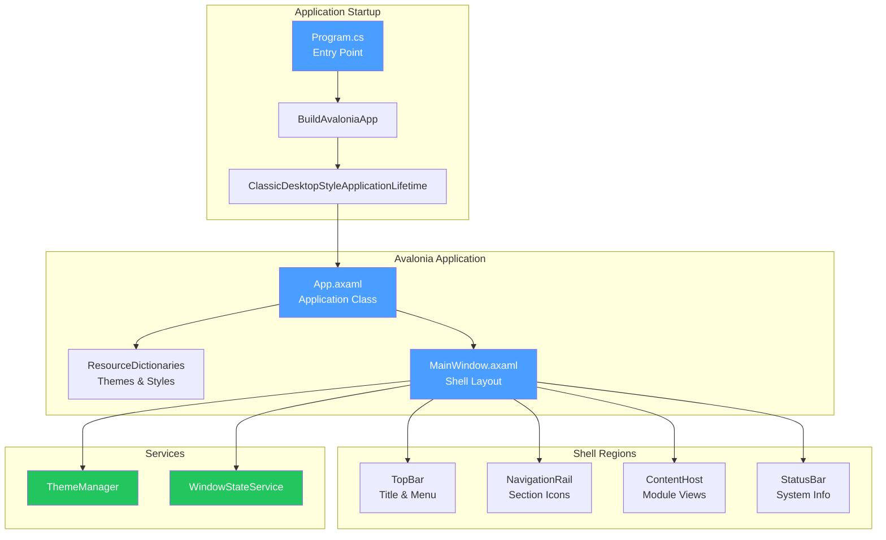
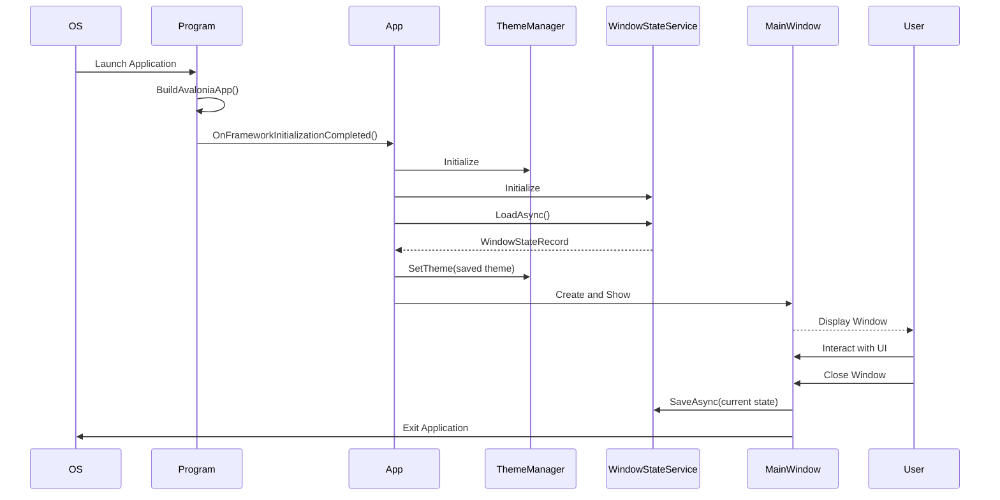

# LCS-DES-002: Design Specification Index — Host Shell & UI Foundation

## Document Control

| Field                | Value                      |
| :------------------- | :------------------------- |
| **Document ID**      | LCS-DES-002-INDEX          |
| **Feature ID**       | STY-002                    |
| **Feature Name**     | Host Shell & UI Foundation |
| **Target Version**   | v0.0.2                     |
| **Module Scope**     | Lexichord.Host             |
| **Swimlane**         | Infrastructure             |
| **License Tier**     | Core                       |
| **Feature Gate Key** | N/A                        |
| **Status**           | Draft                      |
| **Last Updated**     | 2026-01-27                 |

---

## 1. Executive Summary

**v0.0.2** establishes the visual foundation of Lexichord by implementing a cross-platform desktop UI shell using **Avalonia UI**. This release transforms the project from a headless console application into a functional desktop application with proper lifecycle management, theme support, and persistent window state.

### 1.1 The Problem

Without a visual host shell:

- Modules cannot register views or display UI components
- Users cannot interact with the application
- The modular architecture lacks a visual container
- No consistent cross-platform desktop experience exists

### 1.2 The Solution

Implement a complete Avalonia UI application lifecycle with:

- **Avalonia Bootstrap** — Proper application entry point and platform initialization
- **Podium Layout** — Structured MainWindow with regions for future module views
- **Theme Infrastructure** — Runtime Dark/Light mode switching with system detection
- **Window State Persistence** — Save/restore window geometry between sessions

### 1.3 Business Value

| Value                 | Description                                       |
| :-------------------- | :------------------------------------------------ |
| **Cross-Platform**    | Single codebase runs on Windows, macOS, and Linux |
| **Professional UX**   | Modern dark/light theme support                   |
| **User Preferences**  | Remembers window position and size                |
| **Module Foundation** | Enables UI-based modules (v0.0.4+)                |
| **Development Ready** | Visual debugging and designer support             |

---

## 2. Related Documents

### 2.1 Scope Breakdown Document

The detailed scope breakdown for v0.0.2, including all sub-parts, implementation checklists, and acceptance criteria:

| Document                            | Description                                  |
| :---------------------------------- | :------------------------------------------- |
| **[LCS-SBD-002](./LCS-SBD-002.md)** | Scope Breakdown — Host Shell & UI Foundation |

### 2.2 Sub-Part Design Specifications

Each sub-part has its own detailed design specification following the LDS-01 template:

| Sub-Part | Document                              | Title                    | Description                              |
| :------- | :------------------------------------ | :----------------------- | :--------------------------------------- |
| v0.0.2a  | **[LCS-DES-002a](./LCS-DES-002a.md)** | Avalonia Bootstrap       | Application lifecycle and entry point    |
| v0.0.2b  | **[LCS-DES-002b](./LCS-DES-002b.md)** | Podium Layout            | MainWindow shell with structured regions |
| v0.0.2c  | **[LCS-DES-002c](./LCS-DES-002c.md)** | Theme Infrastructure     | Runtime Dark/Light theme switching       |
| v0.0.2d  | **[LCS-DES-002d](./LCS-DES-002d.md)** | Window State Persistence | Save/restore window geometry             |

---

## 3. Architecture Overview

### 3.1 Component Diagram

### 3.2 Data Flow

---

## 4. Dependencies

### 4.1 Upstream Dependencies

| Dependency         | Source Version | Purpose                     |
| :----------------- | :------------- | :-------------------------- |
| .NET SDK           | 9.0            | Runtime and build toolchain |
| Solution Structure | v0.0.1a        | Project organization        |
| CI/CD Pipeline     | v0.0.1d        | Automated testing           |

### 4.2 NuGet Packages

| Package                  | Version | Purpose                       |
| :----------------------- | :------ | :---------------------------- |
| `Avalonia`               | 11.2.3  | Core Avalonia framework       |
| `Avalonia.Desktop`       | 11.2.3  | Desktop application support   |
| `Avalonia.Themes.Fluent` | 11.2.3  | Fluent design base theme      |
| `Avalonia.Fonts.Inter`   | 11.2.3  | Inter font family             |
| `Avalonia.Diagnostics`   | 11.2.3  | Dev tools (Debug builds only) |

### 4.3 Downstream Consumers (Future)

| Version | Feature       | Uses From v0.0.2                    |
| :------ | :------------ | :---------------------------------- |
| v0.0.3  | Logging & DI  | Application lifecycle hooks         |
| v0.0.4  | Module System | ContentHost region for module views |
| v0.2.x  | Editor Module | Theme resources and shell layout    |
| v0.3.x  | Style Module  | UI framework and theme system       |

---

## 5. License Gating Strategy

**N/A** — The host shell is Core infrastructure required by all license tiers. No runtime gating is applied to UI framework components.

---

## 6. Key Interfaces Summary

| Interface             | Defined In | Purpose                                |
| :-------------------- | :--------- | :------------------------------------- |
| `IThemeManager`       | v0.0.2c    | Manages application theme switching    |
| `IWindowStateService` | v0.0.2d    | Persists window state between sessions |

| Record/DTO          | Defined In | Purpose                                  |
| :------------------ | :--------- | :--------------------------------------- |
| `ThemeMode`         | v0.0.2c    | Enum for theme modes (System/Dark/Light) |
| `WindowStateRecord` | v0.0.2d    | Window position and size data            |

---

## 7. Implementation Checklist Summary

| Sub-Part  | Key Deliverables                                             | Est. Hours   | Status |
| :-------- | :----------------------------------------------------------- | :----------- | :----- |
| v0.0.2a   | Avalonia packages, Program.cs, App.axaml.cs, MainWindow stub | 4            | [ ]    |
| v0.0.2b   | Grid layout, TopBar, NavigationRail, ContentHost, StatusBar  | 6            | [ ]    |
| v0.0.2c   | ThemeManager, ResourceDictionaries, Theme toggle UI          | 5            | [ ]    |
| v0.0.2d   | WindowStateService, JSON persistence, Off-screen detection   | 4            | [ ]    |
| **Total** |                                                              | **19 hours** |        |

See [LCS-SBD-002](./LCS-SBD-002.md) Section 3 for the detailed implementation checklist.

---

## 8. Success Criteria Summary

| Category        | Criterion                               | Target        |
| :-------------- | :-------------------------------------- | :------------ |
| **Platform**    | Runs on Windows, macOS, Linux           | All platforms |
| **Launch**      | Window appears within 5 seconds         | Pass          |
| **Theme**       | Dark/Light toggle works instantly       | Pass          |
| **Persistence** | Window state survives restart           | Pass          |
| **Layout**      | All four regions visible and functional | Pass          |
| **Performance** | Startup time                            | < 3 seconds   |

See individual design specs for detailed acceptance criteria.

---

## 9. Test Coverage Summary

| Sub-Part | Unit Tests                       | Integration Tests       |
| :------- | :------------------------------- | :---------------------- |
| v0.0.2a  | AppBuilder configuration         | Manual launch test      |
| v0.0.2b  | Layout structure validation      | Visual verification     |
| v0.0.2c  | ThemeManager state transitions   | Theme toggle behavior   |
| v0.0.2d  | WindowStateService serialization | Multi-monitor scenarios |

See individual design specs (Section 10) for detailed test scenarios.

---

## 10. What This Enables

| Version | Feature       | Depends On v0.0.2                             |
| :------ | :------------ | :-------------------------------------------- |
| v0.0.3  | Logging & DI  | Application lifecycle and services            |
| v0.0.4  | Module System | ContentHost region for dynamic view injection |
| v0.1.x  | Settings UI   | Theme infrastructure and window chrome        |
| v0.2.x  | Editor Module | Shell layout and theme resources              |
| v0.3.x  | Style Module  | Visual feedback and HUD widgets               |

---

## 11. Risks & Mitigations

| Risk                               | Impact | Mitigation                                      |
| :--------------------------------- | :----- | :---------------------------------------------- |
| Avalonia version mismatch          | High   | Pin all Avalonia packages to 11.2.3             |
| Platform-specific rendering issues | Medium | Test on all three platforms in CI               |
| Window state corruption            | Low    | Fallback to defaults on deserialization error   |
| Multi-monitor position off-screen  | Medium | Validate saved position against current screens |

---

## Document History

| Version | Date       | Author           | Changes                                                      |
| :------ | :--------- | :--------------- | :----------------------------------------------------------- |
| 1.0     | 2026-01-27 | System Architect | Created INDEX from legacy LCS-INF-002 during standardization |
