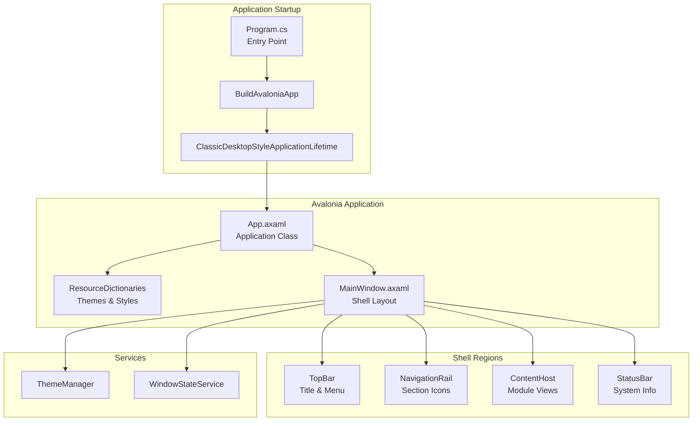

# LCS-01: Feature Design Composition

## 1. Metadata & Categorization

| Field                | Value                      | Description                                        |
| :------------------- | :------------------------- | :------------------------------------------------- |
| **Feature ID**       | `INF-002`                  | Infrastructure - Host Shell (UI Framework)         |
| **Feature Name**     | Host Shell & UI Foundation | Cross-platform Avalonia desktop application shell. |
| **Target Version**   | `v0.0.2`                   | Host Foundation Layer.                             |
| **Module Scope**     | `Lexichord.Host`           | Primary application executable.                    |
| **Swimlane**         | `Infrastructure`           | The Podium (Platform).                             |
| **License Tier**     | `Core`                     | Foundation (Required for all tiers).               |
| **Feature Gate Key** | N/A                        | No runtime gating for host shell.                  |
| **Author**           | System Architect           |                                                    |
| **Status**           | **Draft**                  | Pending approval.                                  |
| **Last Updated**     | 2026-01-26                 |                                                    |

---

## 2. Executive Summary

### 2.1 The Requirement

Lexichord requires a **cross-platform desktop UI shell** that:

- Runs on Windows, macOS, and Linux.
- Provides a consistent visual framework for all future modules.
- Supports runtime theme switching (Dark/Light modes).
- Remembers user preferences (window position, size).

Without this foundation:

- Modules cannot register views.
- Users cannot interact with the application.
- The modular architecture has no visual host.

### 2.2 The Proposed Solution

We **SHALL** implement a complete Avalonia UI application lifecycle with:

1. **v0.0.2a: Avalonia Bootstrap** — Proper application entry point and lifecycle.
2. **v0.0.2b: Podium Layout** — MainWindow with structured regions (TopBar, NavRail, Content, StatusBar).
3. **v0.0.2c: Theme Infrastructure** — Runtime Dark/Light mode switching with system detection.
4. **v0.0.2d: Window State Persistence** — Save/restore window geometry between sessions.

---

## 3. Architecture & Modular Strategy

### 3.1 High-Level Architecture



### 3.2 Dependencies

- **NuGet Packages:**

| Package                  | Version | Purpose                       |
| :----------------------- | :------ | :---------------------------- |
| `Avalonia`               | 11.2.x  | Core Avalonia framework       |
| `Avalonia.Desktop`       | 11.2.x  | Desktop application support   |
| `Avalonia.Themes.Fluent` | 11.2.x  | Fluent design base theme      |
| `Avalonia.Fonts.Inter`   | 11.2.x  | Inter font family             |
| `Avalonia.Diagnostics`   | 11.2.x  | Dev tools (Debug builds only) |

- **Project References:**

| Project                  | Reference Direction        |
| :----------------------- | :------------------------- |
| `Lexichord.Host`         | → `Lexichord.Abstractions` |
| `Lexichord.Abstractions` | (No references)            |

### 3.3 Licensing Behavior

- **N/A:** The host shell is Core infrastructure required by all license tiers.

---

## 4. Decision Tree: Application Startup

```text
START: "How does the application launch?"
│
├── Program.Main() called
│   └── BuildAvaloniaApp() creates Application configuration
│       ├── Configure platform (Desktop)
│       ├── Configure fonts (Inter)
│       ├── Configure logging (Trace in Debug)
│       └── StartWithClassicDesktopLifetime()
│
├── App.OnFrameworkInitializationCompleted() triggered
│   ├── Is this Desktop application? (ClassicDesktopStyleApplicationLifetime)
│   │   ├── YES → Create MainWindow
│   │   │   ├── Load WindowState from appstate.json
│   │   │   ├── Apply saved position/size (if valid)
│   │   │   └── Show MainWindow
│   │   └── NO → Exit (not supported)
│   └── Initialize services
│       ├── ThemeManager (Singleton)
│       └── WindowStateService (Singleton)
│
└── MainWindow.Closing event
    └── Save window state to appstate.json
```

---

## 5. Data Contracts

### 5.1 Interfaces (Lexichord.Abstractions)

```csharp
namespace Lexichord.Abstractions.Contracts;

/// <summary>
/// The supported theme modes for the Lexichord application.
/// </summary>
public enum ThemeMode
{
    /// <summary>Follow operating system theme preference.</summary>
    System,

    /// <summary>Force dark theme regardless of system settings.</summary>
    Dark,

    /// <summary>Force light theme regardless of system settings.</summary>
    Light
}

/// <summary>
/// Manages application theme switching and persistence.
/// </summary>
/// <remarks>
/// LOGIC: The ThemeManager is responsible for runtime swapping of ResourceDictionaries.
/// It subscribes to OS theme change events where supported (Windows/macOS).
/// </remarks>
public interface IThemeManager
{
    /// <summary>
    /// Gets the currently active theme mode.
    /// </summary>
    ThemeMode CurrentTheme { get; }

    /// <summary>
    /// Event raised when the theme changes.
    /// </summary>
    event EventHandler<ThemeMode>? ThemeChanged;

    /// <summary>
    /// Sets the application theme.
    /// </summary>
    /// <param name="mode">The theme mode to apply.</param>
    void SetTheme(ThemeMode mode);

    /// <summary>
    /// Toggles between Dark and Light themes.
    /// </summary>
    /// <remarks>
    /// If current mode is System, this switches to the opposite of the system theme.
    /// </remarks>
    void ToggleTheme();

    /// <summary>
    /// Gets the effective theme (resolves System to actual Dark/Light).
    /// </summary>
    ThemeMode GetEffectiveTheme();
}

/// <summary>
/// Manages window state persistence between application sessions.
/// </summary>
public interface IWindowStateService
{
    /// <summary>
    /// Loads the saved window state, or null if no saved state exists.
    /// </summary>
    /// <returns>The saved window state, or null.</returns>
    Task<WindowStateRecord?> LoadAsync();

    /// <summary>
    /// Saves the current window state.
    /// </summary>
    /// <param name="state">The window state to save.</param>
    Task SaveAsync(WindowStateRecord state);
}

/// <summary>
/// Represents the persisted state of the main application window.
/// </summary>
/// <param name="X">Window X position in screen coordinates.</param>
/// <param name="Y">Window Y position in screen coordinates.</param>
/// <param name="Width">Window width in pixels.</param>
/// <param name="Height">Window height in pixels.</param>
/// <param name="IsMaximized">Whether the window is maximized.</param>
/// <param name="Theme">The user's preferred theme mode.</param>
public record WindowStateRecord(
    double X,
    double Y,
    double Width,
    double Height,
    bool IsMaximized,
    ThemeMode Theme
);
```

### 5.2 Lexichord.Host.csproj

```xml
<Project Sdk="Microsoft.NET.Sdk">

  <PropertyGroup>
    <OutputType>WinExe</OutputType>
    <BuiltInComInteropSupport>true</BuiltInComInteropSupport>
    <ApplicationManifest>app.manifest</ApplicationManifest>
    <AvaloniaUseCompiledBindingsByDefault>true</AvaloniaUseCompiledBindingsByDefault>
  </PropertyGroup>

  <ItemGroup>
    <!-- Avalonia Framework -->
    <PackageReference Include="Avalonia" Version="11.2.3" />
    <PackageReference Include="Avalonia.Desktop" Version="11.2.3" />
    <PackageReference Include="Avalonia.Themes.Fluent" Version="11.2.3" />
    <PackageReference Include="Avalonia.Fonts.Inter" Version="11.2.3" />

    <!-- Development Tools (Debug only) -->
    <PackageReference Condition="'$(Configuration)' == 'Debug'" Include="Avalonia.Diagnostics" Version="11.2.3" />
  </ItemGroup>

  <ItemGroup>
    <ProjectReference Include="..\Lexichord.Abstractions\Lexichord.Abstractions.csproj" />
  </ItemGroup>

</Project>
```

---

## 6. Implementation Logic

### 6.1 Program.cs (Entry Point)

```csharp
using Avalonia;
using System;

namespace Lexichord.Host;

/// <summary>
/// Application entry point for Lexichord.
/// </summary>
/// <remarks>
/// LOGIC: The entry point configures Avalonia with platform-specific settings
/// and starts the desktop application lifecycle. All initialization happens
/// through App.OnFrameworkInitializationCompleted().
/// </remarks>
internal sealed class Program
{
    /// <summary>
    /// The main entry point for the application.
    /// </summary>
    /// <param name="args">Command-line arguments.</param>
    /// <remarks>
    /// This method MUST be marked with STAThread for Windows COM interop support.
    /// </remarks>
    [STAThread]
    public static void Main(string[] args)
    {
        BuildAvaloniaApp()
            .StartWithClassicDesktopLifetime(args);
    }

    /// <summary>
    /// Builds the Avalonia application configuration.
    /// </summary>
    /// <returns>The configured AppBuilder instance.</returns>
    /// <remarks>
    /// LOGIC: This method is called by the entry point and by the design-time previewer.
    /// It configures platform detection, fonts, and logging.
    /// </remarks>
    public static AppBuilder BuildAvaloniaApp()
        => AppBuilder.Configure<App>()
            .UsePlatformDetect()
            .WithInterFont()
            .LogToTrace();
}
```

### 6.2 App.axaml.cs (Application Class)

```csharp
using Avalonia;
using Avalonia.Controls.ApplicationLifetimes;
using Avalonia.Markup.Xaml;
using Lexichord.Host.Services;
using Lexichord.Host.Views;

namespace Lexichord.Host;

/// <summary>
/// The main Avalonia application class.
/// </summary>
/// <remarks>
/// LOGIC: This class manages application lifecycle and service initialization.
/// Services are created as singletons and injected into views that need them.
/// </remarks>
public partial class App : Application
{
    private ThemeManager? _themeManager;
    private WindowStateService? _windowStateService;

    /// <summary>
    /// Gets the application-wide ThemeManager instance.
    /// </summary>
    public IThemeManager ThemeManager => _themeManager
        ?? throw new InvalidOperationException("ThemeManager not initialized");

    /// <summary>
    /// Gets the application-wide WindowStateService instance.
    /// </summary>
    public IWindowStateService WindowStateService => _windowStateService
        ?? throw new InvalidOperationException("WindowStateService not initialized");

    /// <inheritdoc/>
    public override void Initialize()
    {
        AvaloniaXamlLoader.Load(this);
    }

    /// <inheritdoc/>
    /// <remarks>
    /// LOGIC: This is called after the framework is fully initialized.
    /// We create services here and then create the main window.
    /// </remarks>
    public override void OnFrameworkInitializationCompleted()
    {
        // Initialize services
        _themeManager = new ThemeManager(this);
        _windowStateService = new WindowStateService();

        if (ApplicationLifetime is IClassicDesktopStyleApplicationLifetime desktop)
        {
            desktop.MainWindow = new MainWindow
            {
                ThemeManager = _themeManager,
                WindowStateService = _windowStateService
            };

            // Apply persisted theme
            var savedState = _windowStateService.LoadAsync().GetAwaiter().GetResult();
            if (savedState is not null)
            {
                _themeManager.SetTheme(savedState.Theme);
            }
        }

        base.OnFrameworkInitializationCompleted();
    }
}
```

### 6.3 MainWindow Grid Layout

```xml
<!-- MainWindow.axaml -->
<Window xmlns="https://github.com/avaloniaui"
        xmlns:x="http://schemas.microsoft.com/winfx/2006/xaml"
        xmlns:views="using:Lexichord.Host.Views"
        x:Class="Lexichord.Host.Views.MainWindow"
        Title="Lexichord — The Orchestrator"
        MinWidth="1024" MinHeight="768"
        Width="1400" Height="900">

    <!--
    ═══════════════════════════════════════════════════════════════════
    PODIUM LAYOUT
    The main shell grid divides the window into four regions:
    - TopBar: Application title and menu
    - NavigationRail: Section switching icons
    - ContentHost: Dynamic module content area
    - StatusBar: System status and theme toggle
    ═══════════════════════════════════════════════════════════════════
    -->

    <Grid RowDefinitions="Auto,*,Auto">
        <!-- Row 0: Top Bar -->
        <views:TopBar Grid.Row="0" />

        <!-- Row 1: Content Area (Navigation + Content) -->
        <Grid Grid.Row="1" ColumnDefinitions="60,*">
            <!-- Column 0: Navigation Rail -->
            <views:NavigationRail Grid.Column="0" />

            <!-- Column 1: Content Host -->
            <views:ContentHostPanel Grid.Column="1" x:Name="ContentHost" />
        </Grid>

        <!-- Row 2: Status Bar -->
        <views:StatusBar Grid.Row="2" />
    </Grid>
</Window>
```

### 6.4 ThemeManager Implementation

```csharp
using Avalonia;
using Avalonia.Markup.Xaml.Styling;
using Avalonia.Styling;
using Lexichord.Abstractions.Contracts;
using System;

namespace Lexichord.Host.Services;

/// <summary>
/// Manages runtime theme switching for the Lexichord application.
/// </summary>
/// <remarks>
/// LOGIC: Theme switching is achieved by modifying Application.RequestedThemeVariant.
/// Avalonia's built-in theme variant support handles the resource dictionary swapping.
/// Custom colors are defined in Colors.Dark.axaml and Colors.Light.axaml.
/// </remarks>
public sealed class ThemeManager(Application application) : IThemeManager
{
    private ThemeMode _currentTheme = ThemeMode.System;

    /// <inheritdoc/>
    public ThemeMode CurrentTheme => _currentTheme;

    /// <inheritdoc/>
    public event EventHandler<ThemeMode>? ThemeChanged;

    /// <inheritdoc/>
    public void SetTheme(ThemeMode mode)
    {
        _currentTheme = mode;

        // LOGIC: Map our ThemeMode to Avalonia's ThemeVariant
        application.RequestedThemeVariant = mode switch
        {
            ThemeMode.Dark => ThemeVariant.Dark,
            ThemeMode.Light => ThemeVariant.Light,
            ThemeMode.System => ThemeVariant.Default,
            _ => ThemeVariant.Default
        };

        ThemeChanged?.Invoke(this, mode);
    }

    /// <inheritdoc/>
    public void ToggleTheme()
    {
        var effective = GetEffectiveTheme();
        SetTheme(effective == ThemeMode.Dark ? ThemeMode.Light : ThemeMode.Dark);
    }

    /// <inheritdoc/>
    public ThemeMode GetEffectiveTheme()
    {
        if (_currentTheme != ThemeMode.System)
            return _currentTheme;

        // LOGIC: Resolve system theme by checking platform settings
        return application.ActualThemeVariant == ThemeVariant.Dark
            ? ThemeMode.Dark
            : ThemeMode.Light;
    }
}
```

### 6.5 WindowStateService Implementation

```csharp
using System;
using System.IO;
using System.Text.Json;
using System.Threading.Tasks;
using Lexichord.Abstractions.Contracts;

namespace Lexichord.Host.Services;

/// <summary>
/// Persists window state to a JSON file in the user's AppData directory.
/// </summary>
/// <remarks>
/// LOGIC: Window state is saved on close and loaded on startup.
/// The file location follows platform conventions:
/// - Windows: %APPDATA%/Lexichord/appstate.json
/// - macOS: ~/Library/Application Support/Lexichord/appstate.json
/// - Linux: ~/.config/Lexichord/appstate.json
/// </remarks>
public sealed class WindowStateService : IWindowStateService
{
    private static readonly JsonSerializerOptions JsonOptions = new()
    {
        WriteIndented = true,
        PropertyNamingPolicy = JsonNamingPolicy.CamelCase
    };

    private readonly string _filePath;

    /// <summary>
    /// Initializes a new instance of the WindowStateService.
    /// </summary>
    public WindowStateService()
    {
        var appData = Environment.GetFolderPath(Environment.SpecialFolder.ApplicationData);
        var lexichordDir = Path.Combine(appData, "Lexichord");
        Directory.CreateDirectory(lexichordDir);
        _filePath = Path.Combine(lexichordDir, "appstate.json");
    }

    /// <inheritdoc/>
    public async Task<WindowStateRecord?> LoadAsync()
    {
        try
        {
            if (!File.Exists(_filePath))
                return null;

            var json = await File.ReadAllTextAsync(_filePath);
            return JsonSerializer.Deserialize<WindowStateRecord>(json, JsonOptions);
        }
        catch (Exception)
        {
            // LOGIC: Corrupted file or deserialization failure—return null to use defaults
            return null;
        }
    }

    /// <inheritdoc/>
    public async Task SaveAsync(WindowStateRecord state)
    {
        try
        {
            var json = JsonSerializer.Serialize(state, JsonOptions);
            await File.WriteAllTextAsync(_filePath, json);
        }
        catch (Exception)
        {
            // LOGIC: Failed to save—silently ignore, window state is not critical
        }
    }
}
```

---

## 7. Use Cases & User Stories

### 7.1 User Stories

| ID    | Role      | Story                                                                                    | Acceptance Criteria                                 |
| :---- | :-------- | :--------------------------------------------------------------------------------------- | :-------------------------------------------------- |
| US-01 | User      | As a user, I want to launch Lexichord and see a modern dark-themed window.               | Window appears with Dark theme on first launch.     |
| US-02 | User      | As a user, I want to switch between Dark and Light themes.                               | Theme toggle button changes theme instantly.        |
| US-03 | User      | As a user, I want my window position to be remembered when I reopen the app.             | Window opens at the same position and size.         |
| US-04 | User      | As a macOS user, I want Lexichord to respect my system Dark Mode preference.             | App matches system theme when set to "System" mode. |
| US-05 | Developer | As a developer, I want to see navigation placeholders to understand the shell structure. | NavigationRail displays placeholder icons.          |

### 7.2 Use Cases

#### UC-01: First Launch Experience

**Preconditions:**

- Lexichord is installed.
- No `appstate.json` exists.

**Flow:**

1. User launches Lexichord.
2. Application detects no saved state.
3. Window appears centered on primary monitor.
4. Theme matches system preference (or defaults to Dark).
5. User sees: TopBar with title, NavigationRail with icons, ContentHost with welcome message, StatusBar with version.

**Postconditions:**

- User can interact with all regions.
- Closing the app saves current state.

---

#### UC-02: Theme Toggle

**Preconditions:**

- Lexichord is running.
- Current theme is Dark.

**Flow:**

1. User clicks theme toggle button in StatusBar.
2. ThemeManager.ToggleTheme() is called.
3. Application.RequestedThemeVariant changes to Light.
4. All controls instantly re-render with Light colors.
5. ThemeChanged event fires.

**Postconditions:**

- UI is now in Light mode.
- Theme preference is saved on app close.

---

#### UC-03: Window State Restoration

**Preconditions:**

- User previously ran Lexichord.
- `appstate.json` exists with valid data.
- Window was positioned at (100, 200) with size 1600x1000.

**Flow:**

1. User launches Lexichord.
2. WindowStateService.LoadAsync() retrieves saved state.
3. MainWindow position set to (100, 200).
4. MainWindow size set to 1600x1000.
5. Theme from saved state is applied.

**Postconditions:**

- Window appears exactly as it was when closed.

---

## 8. Observability & Logging

### 8.1 Log Events

| Level   | Context            | Message Template                                                       |
| :------ | :----------------- | :--------------------------------------------------------------------- |
| Debug   | Program            | `Application starting with command line: {Args}`                       |
| Info    | App                | `Framework initialization complete. Creating MainWindow.`              |
| Info    | ThemeManager       | `Theme changed from {OldTheme} to {NewTheme}`                          |
| Debug   | WindowStateService | `Loaded window state: Position=({X},{Y}), Size=({Width}x{Height})`     |
| Debug   | WindowStateService | `Saved window state to {FilePath}`                                     |
| Warning | WindowStateService | `Failed to load window state: {ErrorMessage}`                          |
| Warning | WindowStateService | `Saved position ({X},{Y}) is off-screen, centering on primary monitor` |

### 8.2 Instrumentation

```csharp
// Example logging in ThemeManager
public void SetTheme(ThemeMode mode)
{
    var oldTheme = _currentTheme;
    _currentTheme = mode;

    _logger?.LogInformation(
        "Theme changed from {OldTheme} to {NewTheme}",
        oldTheme, mode);

    // ... rest of implementation
}
```

---

## 9. Unit Testing Requirements

### 9.1 Test Scenarios

#### ThemeManager Tests

```csharp
[Trait("Category", "Unit")]
public class ThemeManagerTests
{
    [Fact]
    public void SetTheme_ToLight_UpdatesCurrentTheme()
    {
        // Arrange
        var mockApp = CreateMockApplication();
        var sut = new ThemeManager(mockApp);

        // Act
        sut.SetTheme(ThemeMode.Light);

        // Assert
        sut.CurrentTheme.Should().Be(ThemeMode.Light);
    }

    [Fact]
    public void ToggleTheme_FromDark_SwitchesToLight()
    {
        // Arrange
        var mockApp = CreateMockApplication(currentVariant: ThemeVariant.Dark);
        var sut = new ThemeManager(mockApp);
        sut.SetTheme(ThemeMode.Dark);

        // Act
        sut.ToggleTheme();

        // Assert
        sut.CurrentTheme.Should().Be(ThemeMode.Light);
    }

    [Fact]
    public void SetTheme_RaisesThemeChangedEvent()
    {
        // Arrange
        var mockApp = CreateMockApplication();
        var sut = new ThemeManager(mockApp);
        ThemeMode? receivedTheme = null;
        sut.ThemeChanged += (_, theme) => receivedTheme = theme;

        // Act
        sut.SetTheme(ThemeMode.Light);

        // Assert
        receivedTheme.Should().Be(ThemeMode.Light);
    }
}
```

#### WindowStateService Tests

```csharp
[Trait("Category", "Unit")]
public class WindowStateServiceTests
{
    [Fact]
    public async Task LoadAsync_WhenNoFile_ReturnsNull()
    {
        // Arrange
        var tempDir = CreateTempDirectory();
        var sut = new WindowStateService(tempDir);

        // Act
        var result = await sut.LoadAsync();

        // Assert
        result.Should().BeNull();
    }

    [Fact]
    public async Task SaveAsync_ThenLoadAsync_RoundTripsCorrectly()
    {
        // Arrange
        var tempDir = CreateTempDirectory();
        var sut = new WindowStateService(tempDir);
        var state = new WindowStateRecord(100, 200, 1400, 900, false, ThemeMode.Dark);

        // Act
        await sut.SaveAsync(state);
        var loaded = await sut.LoadAsync();

        // Assert
        loaded.Should().BeEquivalentTo(state);
    }

    [Fact]
    public async Task LoadAsync_WithCorruptedFile_ReturnsNull()
    {
        // Arrange
        var tempDir = CreateTempDirectory();
        await File.WriteAllTextAsync(Path.Combine(tempDir, "appstate.json"), "not valid json");
        var sut = new WindowStateService(tempDir);

        // Act
        var result = await sut.LoadAsync();

        // Assert
        result.Should().BeNull();
    }
}
```

---

## 10. Security & Safety

### 10.1 File System Safety

> [!IMPORTANT]
> The `appstate.json` file is stored in the user's application data directory.
> This file contains no sensitive information (only window geometry and theme preference).

### 10.2 Input Validation

- **Position Validation:** Before applying saved window position, verify it falls within current screen bounds.
- **Dimension Validation:** Ensure saved width/height are >= minimum window dimensions.

```csharp
private bool IsPositionValid(WindowStateRecord state)
{
    // LOGIC: Check if saved position is within any connected screen
    var screens = Screens.All;
    var savedRect = new PixelRect((int)state.X, (int)state.Y, (int)state.Width, (int)state.Height);

    return screens.Any(screen =>
        screen.Bounds.Intersects(savedRect) &&
        savedRect.Right > screen.Bounds.Left + 50 &&
        savedRect.Bottom > screen.Bounds.Top + 50);
}
```

---

## 11. Risks & Mitigations

| Risk                           | Impact | Mitigation                                                         |
| :----------------------------- | :----- | :----------------------------------------------------------------- |
| Avalonia version mismatch      | High   | Pin Avalonia version in `Directory.Build.props`.                   |
| Theme resources not found      | High   | Verify all `ResourceInclude` paths at build time.                  |
| Window state file corruption   | Low    | Use try/catch with null fallback; never crash on load failure.     |
| Multi-monitor position invalid | Medium | Validate position against current screen geometry before applying. |
| Font not available             | Low    | Use font stack with fallbacks (Inter, Segoe UI, sans-serif).       |

---

## 12. Acceptance Criteria (QA)

| #   | Category            | Criterion                                                                       |
| :-- | :------------------ | :------------------------------------------------------------------------------ |
| 1   | **[Launch]**        | `dotnet run` launches a visible Avalonia window on all platforms.               |
| 2   | **[Layout]**        | MainWindow displays TopBar, NavigationRail, ContentHost, and StatusBar regions. |
| 3   | **[Theme Dark]**    | Application launches in Dark mode with correct colors.                          |
| 4   | **[Theme Toggle]**  | Clicking theme toggle switches to Light mode; all controls update instantly.    |
| 5   | **[Theme Persist]** | Theme preference persists after closing and reopening the application.          |
| 6   | **[Window Size]**   | Resizing window and reopening restores saved dimensions.                        |
| 7   | **[Window Pos]**    | Moving window and reopening restores saved position (if on-screen).             |
| 8   | **[Off-Screen]**    | If saved position is off-screen, window centers on primary monitor.             |
| 9   | **[Close]**         | Pressing window close button terminates the application cleanly.                |

---

## 13. Verification Commands

```bash
# 1. Build the application
dotnet build --configuration Release

# 2. Run the application
dotnet run --project src/Lexichord.Host

# 3. Verify window state file location
# Windows:
dir %APPDATA%\Lexichord\appstate.json
# macOS/Linux:
ls -la ~/.config/Lexichord/appstate.json

# 4. Run unit tests
dotnet test --filter Category=Unit

# 5. Check theme toggle (manual)
# 1. Launch app
# 2. Note current theme (should be Dark)
# 3. Click theme toggle button
# 4. Verify all colors change to Light
# 5. Close and reopen app
# 6. Verify Light theme is restored
```

---

## 14. Deliverable Checklist

| Step | Description                                                                                  | Status |
| :--- | :------------------------------------------------------------------------------------------- | :----- |
| 1    | `Lexichord.Host.csproj` configured with Avalonia packages.                                   | [ ]    |
| 2    | `Program.cs` implements BuildAvaloniaApp pattern.                                            | [ ]    |
| 3    | `App.axaml.cs` creates MainWindow on startup.                                                | [ ]    |
| 4    | `MainWindow.axaml` implements Podium Layout with 4 regions.                                  | [ ]    |
| 5    | `TopBar.axaml`, `NavigationRail.axaml`, `ContentHostPanel.axaml`, `StatusBar.axaml` created. | [ ]    |
| 6    | `IThemeManager` defined in Abstractions.                                                     | [ ]    |
| 7    | `ThemeManager` implementation with Dark/Light switching.                                     | [ ]    |
| 8    | `IWindowStateService` defined in Abstractions.                                               | [ ]    |
| 9    | `WindowStateService` implementation with JSON persistence.                                   | [ ]    |
| 10   | Theme toggle button in StatusBar functional.                                                 | [ ]    |
| 11   | Window state saves on close, restores on open.                                               | [ ]    |
| 12   | Unit tests for ThemeManager and WindowStateService passing.                                  | [ ]    |
