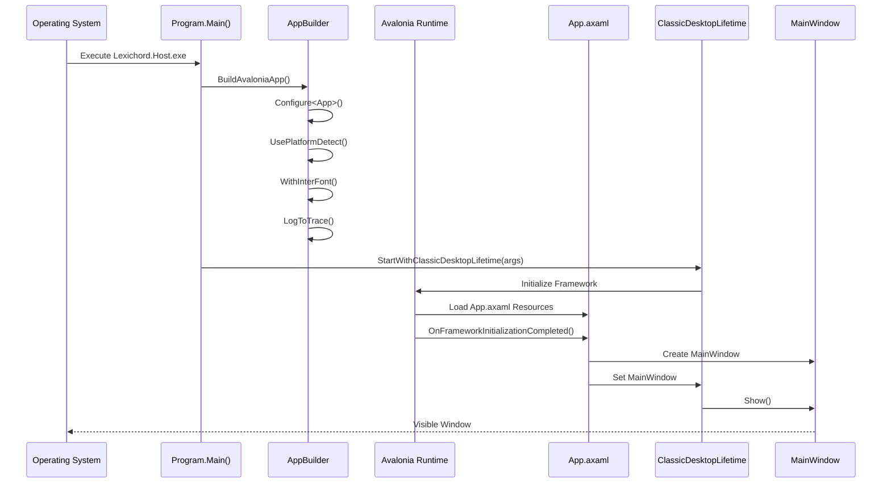

# LCS-01: Feature Design Composition

## 1. Metadata & Categorization

| Field                | Value                          | Description                                 |
| :------------------- | :----------------------------- | :------------------------------------------ |
| **Feature ID**       | `INF-002a`                     | Infrastructure - Avalonia Bootstrap         |
| **Feature Name**     | Avalonia Application Lifecycle | Cross-platform UI framework initialization. |
| **Target Version**   | `v0.0.2a`                      | Host Foundation Layer.                      |
| **Module Scope**     | `Lexichord.Host`               | Primary application executable.             |
| **Swimlane**         | `Infrastructure`               | The Podium (Platform).                      |
| **License Tier**     | `Core`                         | Foundation (Required for all tiers).        |
| **Feature Gate Key** | N/A                            | No runtime gating for bootstrap.            |
| **Author**           | System Architect               |                                             |
| **Status**           | **Draft**                      | Pending approval.                           |
| **Last Updated**     | 2026-01-26                     |                                             |

---

## 2. Executive Summary

### 2.1 The Requirement

The current `Lexichord.Host` project is a basic Console application with a placeholder `Program.cs` that outputs "Hello, World!". To display any UI, we **MUST** convert this into a proper **AvaloniaUI** desktop application with:

- Correct application lifecycle management.
- Platform-specific initialization.
- A visible main window.

### 2.2 The Proposed Solution

We **SHALL** implement the standard Avalonia desktop application pattern:

1. **Update `.csproj`** — Add Avalonia NuGet packages and configure output type.
2. **Replace `Program.cs`** — Implement `BuildAvaloniaApp()` entry point.
3. **Create `App.axaml.cs`** — Complete the Application class code-behind.
4. **Create `MainWindow`** — Minimal window stub to prove lifecycle works.

### 2.3 Current State vs Target State

| Component      | Current State                  | Target State (v0.0.2a)                                 |
| :------------- | :----------------------------- | :----------------------------------------------------- |
| `Program.cs`   | `Console.WriteLine("Hello")`;  | `BuildAvaloniaApp().StartWithClassicDesktopLifetime()` |
| `App.axaml`    | Exists (theme config)          | Unchanged (already configured)                         |
| `App.axaml.cs` | Missing                        | Create with `OnFrameworkInitializationCompleted`       |
| `.csproj`      | `OutputType: Exe`, no Avalonia | `OutputType: WinExe`, Avalonia packages                |
| `MainWindow`   | Missing                        | Create stub with title and minimum size                |

---

## 3. Architecture & Modular Strategy

### 3.1 Application Startup Sequence



### 3.2 Dependencies

- **NuGet Packages (New):**

| Package                  | Version | Purpose                       |
| :----------------------- | :------ | :---------------------------- |
| `Avalonia`               | 11.2.3  | Core Avalonia framework       |
| `Avalonia.Desktop`       | 11.2.3  | Desktop application support   |
| `Avalonia.Themes.Fluent` | 11.2.3  | Fluent design base theme      |
| `Avalonia.Fonts.Inter`   | 11.2.3  | Inter font family             |
| `Avalonia.Diagnostics`   | 11.2.3  | Dev tools (Debug builds only) |

- **Existing References:**

| Reference                | Status |
| :----------------------- | :----- |
| `Lexichord.Abstractions` | Keep   |

### 3.3 Licensing Behavior

- **N/A:** Bootstrap infrastructure is Core tier.

---

## 4. Decision Tree: Platform Detection

```text
START: "Which platform is this running on?"
│
├── UsePlatformDetect() analyzes environment
│   ├── Windows → Use Win32 subsystem
│   │   └── Enable DXGI hardware acceleration
│   ├── macOS → Use Cocoa subsystem
│   │   └── Enable Metal rendering
│   ├── Linux → Use X11 or Wayland
│   │   └── Enable OpenGL rendering
│   └── Unknown → Fallback to software rendering
│
└── Result: Platform-specific Application object created
```

---

## 5. Data Contracts

### 5.1 Updated Lexichord.Host.csproj

```xml
<Project Sdk="Microsoft.NET.Sdk">

  <PropertyGroup>
    <!-- WinExe prevents console window on Windows -->
    <OutputType>WinExe</OutputType>

    <!-- Required for Windows COM interop (drag-drop, file dialogs) -->
    <BuiltInComInteropSupport>true</BuiltInComInteropSupport>

    <!-- Use compiled bindings for performance -->
    <AvaloniaUseCompiledBindingsByDefault>true</AvaloniaUseCompiledBindingsByDefault>
  </PropertyGroup>

  <ItemGroup>
    <!-- Avalonia Framework -->
    <PackageReference Include="Avalonia" Version="11.2.3" />
    <PackageReference Include="Avalonia.Desktop" Version="11.2.3" />
    <PackageReference Include="Avalonia.Themes.Fluent" Version="11.2.3" />
    <PackageReference Include="Avalonia.Fonts.Inter" Version="11.2.3" />

    <!-- Development Tools (Debug builds only) -->
    <PackageReference Condition="'$(Configuration)' == 'Debug'" Include="Avalonia.Diagnostics" Version="11.2.3" />
  </ItemGroup>

  <ItemGroup>
    <ProjectReference Include="..\Lexichord.Abstractions\Lexichord.Abstractions.csproj" />
  </ItemGroup>

</Project>
```

### 5.2 File Structure After v0.0.2a

```text
src/Lexichord.Host/
├── App.axaml              # Exists (theme configuration)
├── App.axaml.cs           # NEW: Application code-behind
├── Lexichord.Host.csproj  # MODIFIED: Avalonia packages
├── Program.cs             # MODIFIED: Avalonia entry point
├── Views/
│   └── MainWindow.axaml   # NEW: Main window XAML
│   └── MainWindow.axaml.cs # NEW: Main window code-behind
├── Themes/                # Exists (theme dictionaries)
├── Resources/             # Exists (icons)
└── Controls/              # Exists (excluded from compile)
```

---

## 6. Implementation Logic

### 6.1 Program.cs (Entry Point)

```csharp
using Avalonia;
using System;

namespace Lexichord.Host;

/// <summary>
/// Application entry point for Lexichord.
/// </summary>
/// <remarks>
/// LOGIC: This class configures the Avalonia application builder and starts
/// the desktop application lifecycle. The Main method is the CLR entry point.
///
/// The BuildAvaloniaApp method is also called by the XAML previewer in IDEs,
/// so it must be a public static method that can be invoked independently.
/// </remarks>
internal sealed class Program
{
    /// <summary>
    /// The main entry point for the application.
    /// </summary>
    /// <param name="args">Command-line arguments passed to the application.</param>
    /// <remarks>
    /// LOGIC: STAThread is required on Windows for proper COM apartment threading.
    /// This enables clipboard operations, file dialogs, and drag-drop functionality.
    /// On other platforms, this attribute is ignored.
    /// </remarks>
    [STAThread]
    public static void Main(string[] args)
    {
        BuildAvaloniaApp()
            .StartWithClassicDesktopLifetime(args);
    }

    /// <summary>
    /// Builds and configures the Avalonia application.
    /// </summary>
    /// <returns>A configured <see cref="AppBuilder"/> instance.</returns>
    /// <remarks>
    /// LOGIC: This method chain configures:
    /// - Configure&lt;App&gt;: Specifies our Application class
    /// - UsePlatformDetect: Auto-detects Windows/macOS/Linux
    /// - WithInterFont: Includes Inter font family
    /// - LogToTrace: Enables trace-level logging (Debug builds)
    ///
    /// The method is public and static so the XAML previewer can invoke it.
    /// </remarks>
    public static AppBuilder BuildAvaloniaApp()
        => AppBuilder.Configure<App>()
            .UsePlatformDetect()
            .WithInterFont()
            .LogToTrace();
}
```

### 6.2 App.axaml.cs (Application Code-Behind)

```csharp
using Avalonia;
using Avalonia.Controls.ApplicationLifetimes;
using Avalonia.Markup.Xaml;
using Lexichord.Host.Views;

namespace Lexichord.Host;

/// <summary>
/// The main Avalonia application class for Lexichord.
/// </summary>
/// <remarks>
/// LOGIC: This class manages the application lifecycle. The key responsibilities are:
/// 1. Load XAML resources in Initialize()
/// 2. Create the MainWindow in OnFrameworkInitializationCompleted()
///
/// Future versions will add service initialization here (DI, logging, etc.).
/// </remarks>
public partial class App : Application
{
    /// <summary>
    /// Initializes the application and loads XAML resources.
    /// </summary>
    /// <remarks>
    /// LOGIC: This is called early in startup, before the UI is shown.
    /// AvaloniaXamlLoader.Load(this) processes App.axaml and merges
    /// all ResourceDictionaries (themes, styles, etc.) into the application.
    /// </remarks>
    public override void Initialize()
    {
        AvaloniaXamlLoader.Load(this);
    }

    /// <summary>
    /// Called when the Avalonia framework has completed initialization.
    /// </summary>
    /// <remarks>
    /// LOGIC: At this point, all resources are loaded and the platform
    /// subsystems are ready. We create and assign the MainWindow here.
    ///
    /// For desktop applications, ApplicationLifetime is always
    /// IClassicDesktopStyleApplicationLifetime, which manages the main window
    /// and application exit behavior.
    /// </remarks>
    public override void OnFrameworkInitializationCompleted()
    {
        if (ApplicationLifetime is IClassicDesktopStyleApplicationLifetime desktop)
        {
            // LOGIC: Create the main window and assign it to the desktop lifetime.
            // The application will exit when this window is closed.
            desktop.MainWindow = new MainWindow();
        }

        base.OnFrameworkInitializationCompleted();
    }
}
```

### 6.3 MainWindow.axaml (Window XAML)

```xml
<Window xmlns="https://github.com/avaloniaui"
        xmlns:x="http://schemas.microsoft.com/winfx/2006/xaml"
        x:Class="Lexichord.Host.Views.MainWindow"
        Title="Lexichord — The Orchestrator"
        Width="1400"
        Height="900"
        MinWidth="1024"
        MinHeight="768"
        WindowStartupLocation="CenterScreen">

    <!--
    ═══════════════════════════════════════════════════════════════════════════
    LEXICHORD MAIN WINDOW (v0.0.2a Stub)
    This is a minimal window to prove the Avalonia lifecycle is working.
    The full Podium Layout will be implemented in v0.0.2b.
    ═══════════════════════════════════════════════════════════════════════════
    -->

    <Grid>
        <TextBlock Text="Welcome to Lexichord"
                   HorizontalAlignment="Center"
                   VerticalAlignment="Center"
                   FontSize="32"
                   FontWeight="Light"
                   Foreground="{DynamicResource TextPrimaryBrush}" />
    </Grid>

</Window>
```

### 6.4 MainWindow.axaml.cs (Window Code-Behind)

```csharp
using Avalonia.Controls;

namespace Lexichord.Host.Views;

/// <summary>
/// The main application window for Lexichord.
/// </summary>
/// <remarks>
/// LOGIC: This is a minimal stub for v0.0.2a. The window:
/// - Displays centered welcome text
/// - Uses theme resources (TextPrimaryBrush)
/// - Has minimum dimensions enforced
///
/// Future versions will add:
/// - v0.0.2b: Podium Layout (TopBar, NavRail, ContentHost, StatusBar)
/// - v0.0.2c: Theme toggle button
/// - v0.0.2d: Window state persistence
/// </remarks>
public partial class MainWindow : Window
{
    /// <summary>
    /// Initializes a new instance of the MainWindow class.
    /// </summary>
    public MainWindow()
    {
        InitializeComponent();
    }
}
```

---

## 7. CLI Execution Plan

```bash
# ═══════════════════════════════════════════════════════════════════════════
# v0.0.2a Implementation Commands
# ═══════════════════════════════════════════════════════════════════════════

# 1. Verify Avalonia templates are available (optional, for new projects)
dotnet new list avalonia

# 2. Add Avalonia NuGet packages to Host project
dotnet add src/Lexichord.Host/Lexichord.Host.csproj package Avalonia --version 11.2.3
dotnet add src/Lexichord.Host/Lexichord.Host.csproj package Avalonia.Desktop --version 11.2.3
dotnet add src/Lexichord.Host/Lexichord.Host.csproj package Avalonia.Themes.Fluent --version 11.2.3
dotnet add src/Lexichord.Host/Lexichord.Host.csproj package Avalonia.Fonts.Inter --version 11.2.3

# 3. Add Diagnostics (Debug only) - manual edit required
# Add to .csproj: <PackageReference Condition="'$(Configuration)' == 'Debug'" Include="Avalonia.Diagnostics" Version="11.2.3" />

# 4. Create Views directory
mkdir -p src/Lexichord.Host/Views

# 5. Create MainWindow files
touch src/Lexichord.Host/Views/MainWindow.axaml
touch src/Lexichord.Host/Views/MainWindow.axaml.cs

# 6. Build to verify packages installed correctly
dotnet build

# 7. Run to verify window appears
dotnet run --project src/Lexichord.Host
```

---

## 8. Use Cases & User Stories

### 8.1 User Stories

| ID    | Role      | Story                                                                             | Acceptance Criteria                         |
| :---- | :-------- | :-------------------------------------------------------------------------------- | :------------------------------------------ |
| US-01 | Developer | As a developer, I want to run `dotnet run` and see an Avalonia window.            | Window appears with title visible.          |
| US-02 | Developer | As a developer, I want the window to have a minimum size to prevent tiny windows. | Window cannot be resized below 1024x768.    |
| US-03 | Developer | As a developer, I want the window to start centered on my screen.                 | Window appears centered, not at (0,0).      |
| US-04 | Developer | As a developer, I want the close button to terminate the application.             | Clicking X closes window and exits process. |

### 8.2 Use Cases

#### UC-01: Application Launch

**Preconditions:**

- .NET 9 SDK installed.
- Avalonia packages restored.

**Flow:**

1. Developer runs `dotnet run --project src/Lexichord.Host`.
2. Program.Main() executes.
3. BuildAvaloniaApp() configures platform.
4. StartWithClassicDesktopLifetime() starts event loop.
5. App.axaml resources load (themes, styles).
6. OnFrameworkInitializationCompleted() creates MainWindow.
7. MainWindow appears centered on primary monitor.
8. "Welcome to Lexichord" text is visible.

**Postconditions:**

- Application is running.
- Window accepts user input (resize, move, close).

---

#### UC-02: Application Close

**Preconditions:**

- Application is running.
- MainWindow is visible.

**Flow:**

1. User clicks the window close button (X).
2. MainWindow.Closing event fires.
3. ClassicDesktopStyleApplicationLifetime detects MainWindow closed.
4. Application.Shutdown() is called.
5. Avalonia event loop terminates.
6. Process exits with code 0.

**Postconditions:**

- No orphan processes.
- Clean exit.

---

## 9. Observability & Logging

### 9.1 Log Events

| Level | Source   | Message Template                     |
| :---- | :------- | :----------------------------------- |
| Debug | Avalonia | `Application starting...`            |
| Debug | Avalonia | `Platform detected: {Platform}`      |
| Info  | Avalonia | `Framework initialization completed` |
| Debug | App      | `Creating MainWindow`                |
| Debug | Avalonia | `Window shown: {Title}`              |
| Info  | Avalonia | `Application shutdown requested`     |

### 9.2 Enabling Trace Output

Trace logging is enabled by `LogToTrace()` in the AppBuilder. Output appears in:

- **Visual Studio**: Debug Output window
- **VS Code**: Debug Console
- **Terminal**: stderr (when running with `dotnet run`)

---

## 10. Unit Testing Requirements

### 10.1 Test Scenarios

> [!NOTE]
> Avalonia UI testing requires the Avalonia.Headless package for headless window creation.
> For v0.0.2a, we focus on verifying the build succeeds and application launches.

#### Build Verification Test

```csharp
[Trait("Category", "Unit")]
public class AvaloniaBootstrapTests
{
    /// <summary>
    /// Verifies that the Avalonia application can be configured without throwing.
    /// </summary>
    [Fact]
    public void BuildAvaloniaApp_ReturnsValidAppBuilder()
    {
        // Arrange & Act
        var builder = Program.BuildAvaloniaApp();

        // Assert
        builder.Should().NotBeNull();
    }
}
```

#### Integration Test (Manual)

**Test Steps:**

1. Run `dotnet run --project src/Lexichord.Host`
2. Verify: Window appears with title "Lexichord — The Orchestrator"
3. Verify: "Welcome to Lexichord" text is visible and readable
4. Verify: Window can be resized (but not below 1024x768)
5. Verify: Window can be moved
6. Verify: Clicking close button terminates the application
7. Verify: `echo $?` returns 0 (clean exit)

---

## 11. Security & Safety

### 11.1 Platform Security

| Platform | Security Consideration                           |
| :------- | :----------------------------------------------- |
| Windows  | STAThread ensures proper COM threading           |
| macOS    | App sandbox compatible (no special entitlements) |
| Linux    | Standard X11/Wayland permissions                 |

### 11.2 Resource Safety

> [!IMPORTANT]
> All ResourceInclude paths in App.axaml use the `avares://` protocol which references embedded resources. Missing resources will cause a build-time error, not a runtime crash.

---

## 12. Risks & Mitigations

| Risk                              | Impact | Mitigation                                                       |
| :-------------------------------- | :----- | :--------------------------------------------------------------- |
| Avalonia package version mismatch | High   | All Avalonia packages pinned to 11.2.3                           |
| Missing theme resources           | High   | Existing App.axaml already references themes; verified in v0.0.1 |
| STAThread forgotten               | Medium | Attribute included in Program.cs template                        |
| Console window appears on Windows | Low    | OutputType changed from Exe to WinExe                            |

---

## 13. Acceptance Criteria (QA)

| #   | Category        | Criterion                                                 |
| :-- | :-------------- | :-------------------------------------------------------- |
| 1   | **[Build]**     | `dotnet build` succeeds with 0 errors and 0 warnings.     |
| 2   | **[Launch]**    | `dotnet run` displays a visible window within 5 seconds.  |
| 3   | **[Title]**     | Window title bar shows "Lexichord — The Orchestrator".    |
| 4   | **[Content]**   | Window content shows "Welcome to Lexichord" text.         |
| 5   | **[Theme]**     | Text color follows theme (readable on dark background).   |
| 6   | **[Min Size]**  | Window cannot be resized smaller than 1024x768.           |
| 7   | **[Center]**    | Window appears centered on screen, not at (0,0).          |
| 8   | **[Close]**     | Clicking close button terminates the application process. |
| 9   | **[Exit Code]** | Application exits with code 0 on clean shutdown.          |

---

## 14. Verification Commands

```bash
# ═══════════════════════════════════════════════════════════════════════════
# v0.0.2a Verification
# ═══════════════════════════════════════════════════════════════════════════

# 1. Verify build succeeds
dotnet build --configuration Release
echo "Build exit code: $?"
# Expected: 0

# 2. Verify no console window on Windows (check OutputType)
grep -i "OutputType" src/Lexichord.Host/Lexichord.Host.csproj
# Expected: <OutputType>WinExe</OutputType>

# 3. Verify Avalonia packages are installed
dotnet list src/Lexichord.Host/Lexichord.Host.csproj package
# Expected: Avalonia, Avalonia.Desktop, Avalonia.Themes.Fluent, Avalonia.Fonts.Inter

# 4. Verify MainWindow exists
ls -la src/Lexichord.Host/Views/MainWindow.axaml
# Expected: File exists

# 5. Run application (manual verification)
dotnet run --project src/Lexichord.Host
# Expected: Window appears, centered, with welcome text
# Close the window and verify clean exit
```

---

## 15. Deliverable Checklist

| Step | Description                                                      | Status |
| :--- | :--------------------------------------------------------------- | :----- |
| 1    | `Lexichord.Host.csproj` OutputType changed to WinExe.            | [ ]    |
| 2    | `Lexichord.Host.csproj` includes all Avalonia packages (11.2.3). | [ ]    |
| 3    | `Program.cs` implements BuildAvaloniaApp() pattern.              | [ ]    |
| 4    | `Program.cs` has [STAThread] attribute on Main.                  | [ ]    |
| 5    | `App.axaml.cs` file created with code-behind.                    | [ ]    |
| 6    | `App.axaml.cs` implements OnFrameworkInitializationCompleted.    | [ ]    |
| 7    | `Views/MainWindow.axaml` created with title and min size.        | [ ]    |
| 8    | `Views/MainWindow.axaml.cs` created with InitializeComponent.    | [ ]    |
| 9    | `dotnet build` succeeds.                                         | [ ]    |
| 10   | `dotnet run` displays visible window.                            | [ ]    |
| 11   | Close button terminates application cleanly.                     | [ ]    |
