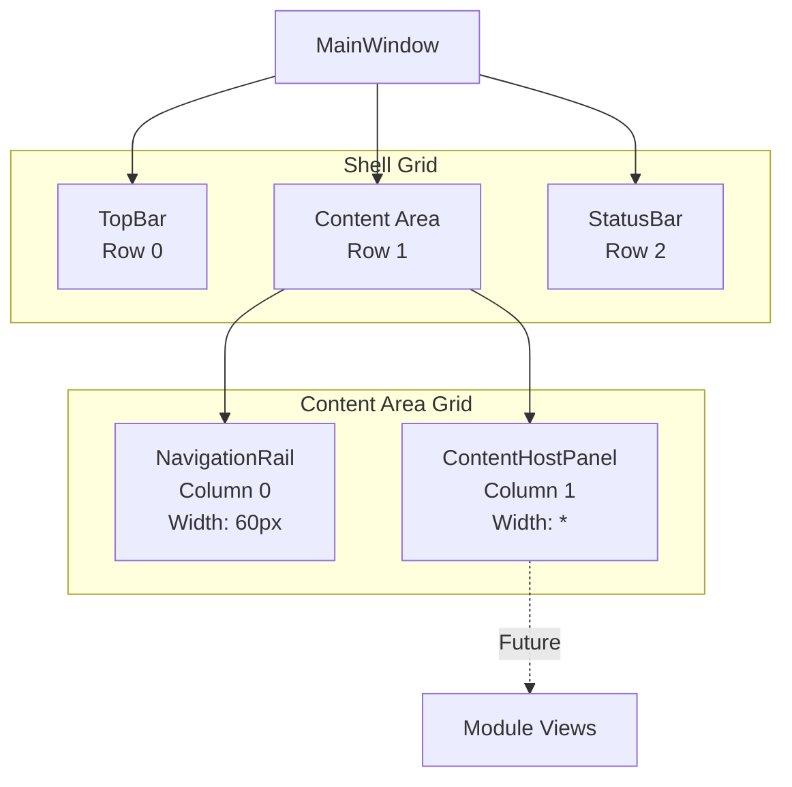

# LCS-01: Feature Design Composition

## 1. Metadata & Categorization

| Field                | Value                  | Description                               |
| :------------------- | :--------------------- | :---------------------------------------- |
| **Feature ID**       | `INF-002b`             | Infrastructure - Podium Layout            |
| **Feature Name**     | The Podium Layout      | MainWindow shell with structured regions. |
| **Target Version**   | `v0.0.2b`              | Host Foundation Layer.                    |
| **Module Scope**     | `Lexichord.Host/Views` | Shell UI components.                      |
| **Swimlane**         | `Infrastructure`       | The Podium (Platform).                    |
| **License Tier**     | `Core`                 | Foundation (Required for all tiers).      |
| **Feature Gate Key** | N/A                    | No runtime gating for shell layout.       |
| **Author**           | System Architect       |                                           |
| **Status**           | **Draft**              | Pending approval.                         |
| **Last Updated**     | 2026-01-26             |                                           |

---

## 2. Executive Summary

### 2.1 The Requirement

The v0.0.2a MainWindow is a blank stub with welcome text. To support the modular architecture, we need a structured shell that:

- Divides the window into **logical regions** (TopBar, Navigation, Content, StatusBar).
- Provides **injection points** for future module views.
- Uses the **established theme resources** from `Colors.Dark.axaml`.
- Follows the **"Orchestra" metaphor** — the Podium is where the Conductor (user) commands the Ensemble (modules).

### 2.2 The Proposed Solution

We **SHALL** implement a Grid-based layout with four distinct regions:

```text
┌──────────────────────────────────────────────────────────────────┐
│                           TOP BAR                                │
│   [Logo] Lexichord — The Orchestrator              [Controls]    │
├────────┬─────────────────────────────────────────────────────────┤
│        │                                                         │
│  NAV   │                   CONTENT HOST                          │
│  RAIL  │                                                         │
│        │        (Module views inject here)                       │
│  [📄]  │                                                         │
│  [⚙️]  │                                                         │
│  [🎵]  │                                                         │
│        │                                                         │
├────────┴─────────────────────────────────────────────────────────┤
│                          STATUS BAR                              │
│   Ready                                          v0.0.2  │  🌙   │
└──────────────────────────────────────────────────────────────────┘
```

---

## 3. Architecture & Modular Strategy

### 3.1 Region Hierarchy



### 3.2 File Structure After v0.0.2b

```text
src/Lexichord.Host/Views/
├── MainWindow.axaml          # MODIFIED: Grid layout with regions
├── MainWindow.axaml.cs       # MODIFIED: (minimal changes)
├── Shell/
│   ├── TopBar.axaml          # NEW: Title bar component
│   ├── TopBar.axaml.cs       # NEW: Code-behind
│   ├── NavigationRail.axaml  # NEW: Left navigation icons
│   ├── NavigationRail.axaml.cs # NEW: Code-behind
│   ├── ContentHostPanel.axaml # NEW: Content injection point
│   ├── ContentHostPanel.axaml.cs # NEW: Code-behind
│   ├── StatusBar.axaml       # NEW: Bottom status display
│   └── StatusBar.axaml.cs    # NEW: Code-behind
```

### 3.3 Theme Resources Used

| Region           | Background Brush       | Border Brush        | Purpose             |
| :--------------- | :--------------------- | :------------------ | :------------------ |
| TopBar           | `SurfaceElevatedBrush` | `BorderSubtleBrush` | Elevated panel look |
| NavigationRail   | `SurfaceElevatedBrush` | `BorderSubtleBrush` | Matches TopBar      |
| ContentHostPanel | `SurfaceBaseBrush`     | —                   | Deepest layer       |
| StatusBar        | `SurfaceElevatedBrush` | `BorderSubtleBrush` | Matches TopBar      |

---

## 4. Decision Tree: Region Selection

```text
START: "Which region should this content appear in?"
│
├── Is this application-level chrome? (Title, menu, window controls)
│   └── YES → TopBar
│
├── Is this navigation between major sections/modules?
│   └── YES → NavigationRail
│
├── Is this status/info that should always be visible?
│   ├── System status, theme toggle, version → StatusBar
│   └── Notifications, progress → StatusBar
│
└── Is this the main content/workspace?
    └── YES → ContentHostPanel
        └── Module views inject into the ContentControl
```

---

## 5. Data Contracts

### 5.1 MainWindow.axaml (Updated)

```xml
<Window xmlns="https://github.com/avaloniaui"
        xmlns:x="http://schemas.microsoft.com/winfx/2006/xaml"
        xmlns:shell="using:Lexichord.Host.Views.Shell"
        x:Class="Lexichord.Host.Views.MainWindow"
        Title="Lexichord — The Orchestrator"
        Width="1400"
        Height="900"
        MinWidth="1024"
        MinHeight="768"
        WindowStartupLocation="CenterScreen">

    <!--
    ═══════════════════════════════════════════════════════════════════════════
    PODIUM LAYOUT
    The main shell grid divides the window into three rows:
    - Row 0: TopBar (title, menu, window controls)
    - Row 1: Content Area (NavigationRail + ContentHost)
    - Row 2: StatusBar (status messages, theme toggle, version)
    ═══════════════════════════════════════════════════════════════════════════
    -->

    <Grid RowDefinitions="Auto,*,Auto">

        <!-- ═══════════════════════════════════════════════════════════════════
             ROW 0: TOP BAR
             Application title and optional menu/controls
             Height: Auto (sized to content, typically 48px)
             ═══════════════════════════════════════════════════════════════════ -->
        <shell:TopBar Grid.Row="0" />

        <!-- ═══════════════════════════════════════════════════════════════════
             ROW 1: CONTENT AREA
             Contains NavigationRail (left) and ContentHost (center)
             Height: * (fills remaining space)
             ═══════════════════════════════════════════════════════════════════ -->
        <Grid Grid.Row="1" ColumnDefinitions="60,*">

            <!-- Navigation Rail: Section switching icons -->
            <shell:NavigationRail Grid.Column="0" />

            <!-- Content Host: Module views inject here -->
            <shell:ContentHostPanel Grid.Column="1" x:Name="ContentHost" />

        </Grid>

        <!-- ═══════════════════════════════════════════════════════════════════
             ROW 2: STATUS BAR
             System status, theme toggle, version info
             Height: Auto (sized to content, typically 28px)
             ═══════════════════════════════════════════════════════════════════ -->
        <shell:StatusBar Grid.Row="2" />

    </Grid>

</Window>
```

### 5.2 TopBar.axaml

```xml
<UserControl xmlns="https://github.com/avaloniaui"
             xmlns:x="http://schemas.microsoft.com/winfx/2006/xaml"
             x:Class="Lexichord.Host.Views.Shell.TopBar">

    <!--
    ═══════════════════════════════════════════════════════════════════════════
    TOP BAR
    Application title bar with branding and optional controls.

    LOGIC: Uses SurfaceElevatedBrush for visual separation from content area.
    Border at bottom provides subtle divider line.
    ═══════════════════════════════════════════════════════════════════════════
    -->

    <Border Background="{DynamicResource SurfaceElevatedBrush}"
            BorderBrush="{DynamicResource BorderSubtleBrush}"
            BorderThickness="0,0,0,1"
            Padding="16,0">

        <Grid ColumnDefinitions="Auto,*,Auto" Height="48">

            <!-- Left: Application Title -->
            <StackPanel Grid.Column="0"
                        Orientation="Horizontal"
                        VerticalAlignment="Center"
                        Spacing="12">

                <!-- Logo placeholder (future: actual icon) -->
                <TextBlock Text="🎼"
                           FontSize="20"
                           VerticalAlignment="Center" />

                <!-- Application Name -->
                <TextBlock Text="Lexichord"
                           FontSize="{StaticResource FontSizeLG}"
                           FontWeight="SemiBold"
                           Foreground="{DynamicResource TextPrimaryBrush}"
                           VerticalAlignment="Center" />

                <!-- Tagline (subtle) -->
                <TextBlock Text="— The Orchestrator"
                           FontSize="{StaticResource FontSizeMD}"
                           Foreground="{DynamicResource TextSecondaryBrush}"
                           VerticalAlignment="Center" />
            </StackPanel>

            <!-- Center: Spacer (future: document tabs) -->
            <Border Grid.Column="1" />

            <!-- Right: Window controls placeholder -->
            <StackPanel Grid.Column="2"
                        Orientation="Horizontal"
                        VerticalAlignment="Center"
                        Spacing="8">
                <!-- Future: Search, notifications, user menu -->
            </StackPanel>

        </Grid>
    </Border>

</UserControl>
```

### 5.3 NavigationRail.axaml

```xml
<UserControl xmlns="https://github.com/avaloniaui"
             xmlns:x="http://schemas.microsoft.com/winfx/2006/xaml"
             x:Class="Lexichord.Host.Views.Shell.NavigationRail">

    <!--
    ═══════════════════════════════════════════════════════════════════════════
    NAVIGATION RAIL
    Vertical icon rail for section switching.

    LOGIC: Fixed width of 60px matches the Grid column definition.
    Icons use placeholder text until proper SVG icons are added.
    Hover states use AccentMutedBrush for subtle feedback.

    Future: Icons will be bound to an ItemsControl with INavigationItem models.
    ═══════════════════════════════════════════════════════════════════════════
    -->

    <Border Background="{DynamicResource SurfaceElevatedBrush}"
            BorderBrush="{DynamicResource BorderSubtleBrush}"
            BorderThickness="0,0,1,0"
            Width="60">

        <DockPanel>

            <!-- Top: Primary navigation items -->
            <StackPanel DockPanel.Dock="Top" Spacing="4" Margin="8,12">

                <!-- Documents Section -->
                <Button Classes="nav-icon" ToolTip.Tip="Documents">
                    <TextBlock Text="📄" FontSize="20" />
                </Button>

                <!-- Style/Governance Section -->
                <Button Classes="nav-icon" ToolTip.Tip="Style Guide">
                    <TextBlock Text="🎵" FontSize="20" />
                </Button>

                <!-- Memory/RAG Section -->
                <Button Classes="nav-icon" ToolTip.Tip="Memory">
                    <TextBlock Text="🧠" FontSize="20" />
                </Button>

                <!-- Agents Section -->
                <Button Classes="nav-icon" ToolTip.Tip="Agents">
                    <TextBlock Text="🤖" FontSize="20" />
                </Button>

            </StackPanel>

            <!-- Bottom: Secondary items (settings, etc.) -->
            <StackPanel DockPanel.Dock="Bottom" Spacing="4" Margin="8,12">

                <!-- Settings -->
                <Button Classes="nav-icon" ToolTip.Tip="Settings">
                    <TextBlock Text="⚙️" FontSize="20" />
                </Button>

            </StackPanel>

            <!-- Center: Spacer -->
            <Border />

        </DockPanel>
    </Border>

    <UserControl.Styles>
        <!-- Nav icon button style -->
        <Style Selector="Button.nav-icon">
            <Setter Property="Width" Value="44" />
            <Setter Property="Height" Value="44" />
            <Setter Property="Padding" Value="0" />
            <Setter Property="HorizontalContentAlignment" Value="Center" />
            <Setter Property="VerticalContentAlignment" Value="Center" />
            <Setter Property="Background" Value="Transparent" />
            <Setter Property="CornerRadius" Value="8" />
        </Style>

        <Style Selector="Button.nav-icon:pointerover">
            <Setter Property="Background" Value="{DynamicResource AccentMutedBrush}" />
        </Style>

        <Style Selector="Button.nav-icon:pressed">
            <Setter Property="Background" Value="{DynamicResource AccentGlowBrush}" />
        </Style>
    </UserControl.Styles>

</UserControl>
```

### 5.4 ContentHostPanel.axaml

```xml
<UserControl xmlns="https://github.com/avaloniaui"
             xmlns:x="http://schemas.microsoft.com/winfx/2006/xaml"
             x:Class="Lexichord.Host.Views.Shell.ContentHostPanel">

    <!--
    ═══════════════════════════════════════════════════════════════════════════
    CONTENT HOST PANEL
    The primary content area where module views are displayed.

    LOGIC: Uses SurfaceBaseBrush (deepest layer) to create visual depth.
    The ContentControl named "ModuleViewHost" is the injection point for
    module views loaded via the ModuleLoader (v0.0.4+).

    For now, displays a welcome message centered in the panel.
    ═══════════════════════════════════════════════════════════════════════════
    -->

    <Border Background="{DynamicResource SurfaceBaseBrush}">

        <!-- Module View Host: Content is injected here by the ModuleLoader -->
        <ContentControl x:Name="ModuleViewHost">

            <!-- Default content (shown when no module view is loaded) -->
            <StackPanel HorizontalAlignment="Center"
                        VerticalAlignment="Center"
                        Spacing="16">

                <!-- Welcome icon -->
                <TextBlock Text="🎼"
                           FontSize="64"
                           HorizontalAlignment="Center"
                           Foreground="{DynamicResource TextTertiaryBrush}" />

                <!-- Welcome message -->
                <TextBlock Text="Welcome to Lexichord"
                           FontSize="{StaticResource FontSize2XL}"
                           FontWeight="Light"
                           HorizontalAlignment="Center"
                           Foreground="{DynamicResource TextPrimaryBrush}" />

                <!-- Subtitle -->
                <TextBlock Text="The Agentic Orchestration Platform for Writers"
                           FontSize="{StaticResource FontSizeMD}"
                           HorizontalAlignment="Center"
                           Foreground="{DynamicResource TextSecondaryBrush}" />

                <!-- Getting started hint -->
                <TextBlock Text="Select a section from the navigation rail to begin"
                           FontSize="{StaticResource FontSizeSM}"
                           HorizontalAlignment="Center"
                           Foreground="{DynamicResource TextTertiaryBrush}"
                           Margin="0,24,0,0" />

            </StackPanel>

        </ContentControl>

    </Border>

</UserControl>
```

### 5.5 StatusBar.axaml

```xml
<UserControl xmlns="https://github.com/avaloniaui"
             xmlns:x="http://schemas.microsoft.com/winfx/2006/xaml"
             x:Class="Lexichord.Host.Views.Shell.StatusBar">

    <!--
    ═══════════════════════════════════════════════════════════════════════════
    STATUS BAR
    Bottom bar displaying system status, version, and quick actions.

    LOGIC: Three columns:
    - Left: Status message (e.g., "Ready", "Saving...", "Analyzing...")
    - Center: Notifications/progress (future)
    - Right: Version info, theme toggle (v0.0.2c)
    ═══════════════════════════════════════════════════════════════════════════
    -->

    <Border Background="{DynamicResource SurfaceElevatedBrush}"
            BorderBrush="{DynamicResource BorderSubtleBrush}"
            BorderThickness="0,1,0,0"
            Padding="12,0">

        <Grid ColumnDefinitions="*,Auto,Auto" Height="28">

            <!-- Left: Status message -->
            <StackPanel Grid.Column="0"
                        Orientation="Horizontal"
                        VerticalAlignment="Center"
                        Spacing="8">

                <!-- Status indicator dot -->
                <Ellipse Width="8" Height="8"
                         Fill="{DynamicResource StatusSuccessBrush}" />

                <!-- Status text -->
                <TextBlock Text="Ready"
                           FontSize="{StaticResource FontSizeSM}"
                           Foreground="{DynamicResource TextSecondaryBrush}"
                           VerticalAlignment="Center" />

            </StackPanel>

            <!-- Center: Spacer (future: notifications) -->
            <Border Grid.Column="1" />

            <!-- Right: Version and controls -->
            <StackPanel Grid.Column="2"
                        Orientation="Horizontal"
                        VerticalAlignment="Center"
                        Spacing="16">

                <!-- Separator -->
                <Border Width="1" Height="16"
                        Background="{DynamicResource BorderSubtleBrush}" />

                <!-- Version -->
                <TextBlock Text="v0.0.2"
                           FontSize="{StaticResource FontSizeXS}"
                           Foreground="{DynamicResource TextTertiaryBrush}"
                           VerticalAlignment="Center" />

                <!-- Theme toggle placeholder (implemented in v0.0.2c) -->
                <Button Classes="status-icon"
                        ToolTip.Tip="Toggle Theme"
                        x:Name="ThemeToggleButton">
                    <TextBlock Text="🌙" FontSize="14" />
                </Button>

            </StackPanel>

        </Grid>
    </Border>

    <UserControl.Styles>
        <!-- Status bar icon button style -->
        <Style Selector="Button.status-icon">
            <Setter Property="Width" Value="24" />
            <Setter Property="Height" Value="24" />
            <Setter Property="Padding" Value="0" />
            <Setter Property="Background" Value="Transparent" />
            <Setter Property="CornerRadius" Value="4" />
        </Style>

        <Style Selector="Button.status-icon:pointerover">
            <Setter Property="Background" Value="{DynamicResource AccentMutedBrush}" />
        </Style>
    </UserControl.Styles>

</UserControl>
```

### 5.6 Code-Behind Files

All code-behind files follow the same minimal pattern:

```csharp
using Avalonia.Controls;

namespace Lexichord.Host.Views.Shell;

/// <summary>
/// [Component Name] for the Lexichord shell.
/// </summary>
/// <remarks>
/// LOGIC: This is a presentation-only component for v0.0.2b.
/// Future versions will add ViewModel bindings and interactivity.
/// </remarks>
public partial class TopBar : UserControl
{
    public TopBar()
    {
        InitializeComponent();
    }
}
```

---

## 6. Use Cases & User Stories

### 6.1 User Stories

| ID    | Role      | Story                                                                     | Acceptance Criteria                         |
| :---- | :-------- | :------------------------------------------------------------------------ | :------------------------------------------ |
| US-01 | User      | As a user, I want to see a clear application title in the top bar.        | "Lexichord — The Orchestrator" visible.     |
| US-02 | User      | As a user, I want navigation icons to switch between sections.            | Icons visible, show tooltips on hover.      |
| US-03 | User      | As a user, I want to see status information at the bottom of the window.  | Status bar shows "Ready" and version.       |
| US-04 | User      | As a user, I want visual feedback when hovering over navigation icons.    | Icons highlight with accent color on hover. |
| US-05 | Developer | As a developer, I want a named ContentControl for injecting module views. | `ModuleViewHost` ContentControl exists.     |

### 6.2 Use Cases

#### UC-01: Visual Layout Verification

**Preconditions:**

- v0.0.2a complete (Avalonia bootstrap working).
- v0.0.2b shell components implemented.

**Flow:**

1. Developer runs `dotnet run --project src/Lexichord.Host`.
2. MainWindow appears with full Podium Layout.
3. TopBar displays: logo, "Lexichord", tagline.
4. NavigationRail displays: 5 icon buttons vertically arranged.
5. ContentHostPanel displays: welcome message centered.
6. StatusBar displays: green dot, "Ready", "v0.0.2", theme toggle.

**Postconditions:**

- All regions are visually distinct.
- Theme resources are applied correctly.

---

#### UC-02: Navigation Hover Feedback

**Preconditions:**

- Application is running.
- NavigationRail is visible.

**Flow:**

1. User moves mouse over a navigation icon.
2. Icon button background changes to `AccentMutedBrush` (subtle orange).
3. Tooltip appears showing the section name.
4. User moves mouse away.
5. Icon button background returns to transparent.

**Postconditions:**

- User understands the button is interactive.

---

## 7. Observability & Logging

### 7.1 Log Events

| Level | Source           | Message Template                                       |
| :---- | :--------------- | :----------------------------------------------------- |
| Debug | MainWindow       | `Podium layout initialized with {RegionCount} regions` |
| Debug | ContentHostPanel | `ModuleViewHost ready for view injection`              |
| Trace | NavigationRail   | `Navigation icon hovered: {IconName}`                  |

---

## 8. Unit Testing Requirements

### 8.1 Visual Testing (Manual)

For UI layout testing, we rely on manual verification:

**Test Steps:**

1. Run `dotnet run --project src/Lexichord.Host`
2. Verify TopBar:
    - [ ] Logo emoji visible (🎼)
    - [ ] "Lexichord" text visible
    - [ ] "— The Orchestrator" tagline visible
3. Verify NavigationRail:
    - [ ] 5 icon buttons visible (📄, 🎵, 🧠, 🤖, ⚙️)
    - [ ] Icons show tooltips on hover
    - [ ] Icons highlight on hover (orange tint)
4. Verify ContentHostPanel:
    - [ ] Welcome icon visible (🎼)
    - [ ] "Welcome to Lexichord" text visible
    - [ ] Subtitle and hint text visible
5. Verify StatusBar:
    - [ ] Green status dot visible
    - [ ] "Ready" text visible
    - [ ] "v0.0.2" version visible
    - [ ] Theme toggle button visible (🌙)

### 8.2 Architecture Test

```csharp
[Trait("Category", "Architecture")]
public class ShellLayoutTests
{
    [Fact]
    public void MainWindow_ContainsAllShellComponents()
    {
        // Arrange
        var types = typeof(MainWindow).Assembly.GetTypes();

        // Assert: All shell components exist
        types.Should().Contain(t => t.Name == "TopBar");
        types.Should().Contain(t => t.Name == "NavigationRail");
        types.Should().Contain(t => t.Name == "ContentHostPanel");
        types.Should().Contain(t => t.Name == "StatusBar");
    }
}
```

---

## 9. Security & Safety

### 9.1 No Security Concerns

This specification is purely presentational and introduces no security risks:

- No user input handling.
- No data persistence.
- No external communication.

---

## 10. Risks & Mitigations

| Risk                         | Impact | Mitigation                                                 |
| :--------------------------- | :----- | :--------------------------------------------------------- |
| Theme resources not found    | High   | Verify `Colors.Dark.axaml` is loaded via `App.axaml`       |
| Grid layout breaks on resize | Medium | Use `*` sizing for flexible columns, test at minimum size  |
| Emoji icons not rendering    | Low    | Fallback to text; proper SVG icons added in future version |

---

## 11. Acceptance Criteria (QA)

| #   | Category        | Criterion                                                            |
| :-- | :-------------- | :------------------------------------------------------------------- |
| 1   | **[Layout]**    | MainWindow displays 3-row Grid (TopBar, Content, StatusBar).         |
| 2   | **[TopBar]**    | TopBar shows logo, "Lexichord", and tagline.                         |
| 3   | **[NavRail]**   | NavigationRail shows 5 icon buttons with tooltips.                   |
| 4   | **[NavRail]**   | Navigation icons highlight on hover (accent color).                  |
| 5   | **[Content]**   | ContentHostPanel displays welcome message.                           |
| 6   | **[Content]**   | ContentHostPanel has `x:Name="ModuleViewHost"` ContentControl.       |
| 7   | **[StatusBar]** | StatusBar shows green dot, "Ready", version.                         |
| 8   | **[Theme]**     | All regions use correct theme brushes (dark background, light text). |
| 9   | **[MinSize]**   | Layout does not break at minimum window size (1024x768).             |

---

## 12. Verification Commands

```bash
# ═══════════════════════════════════════════════════════════════════════════
# v0.0.2b Verification
# ═══════════════════════════════════════════════════════════════════════════

# 1. Verify shell files exist
ls -la src/Lexichord.Host/Views/Shell/
# Expected: TopBar.axaml, NavigationRail.axaml, ContentHostPanel.axaml, StatusBar.axaml

# 2. Verify build succeeds
dotnet build --configuration Release

# 3. Run application and verify visually
dotnet run --project src/Lexichord.Host
# Expected: Full Podium Layout visible

# 4. Resize to minimum size and verify layout
# (Manual: Resize window to 1024x768 and verify no clipping/overlap)
```

---

## 13. Deliverable Checklist

| Step | Description                                                             | Status |
| :--- | :---------------------------------------------------------------------- | :----- |
| 1    | `Views/Shell/` directory created.                                       | [ ]    |
| 2    | `TopBar.axaml` and `.cs` created with logo and title.                   | [ ]    |
| 3    | `NavigationRail.axaml` and `.cs` created with 5 icon buttons.           | [ ]    |
| 4    | `ContentHostPanel.axaml` and `.cs` created with welcome message.        | [ ]    |
| 5    | `StatusBar.axaml` and `.cs` created with status and version.            | [ ]    |
| 6    | `MainWindow.axaml` updated with Grid layout referencing all components. | [ ]    |
| 7    | Navigation icons show tooltips on hover.                                | [ ]    |
| 8    | Navigation icons highlight on hover (accent color).                     | [ ]    |
| 9    | All regions use correct theme brushes.                                  | [ ]    |
| 10   | Build succeeds with no warnings.                                        | [ ]    |
| 11   | Visual verification complete at 1024x768 minimum size.                  | [ ]    |
