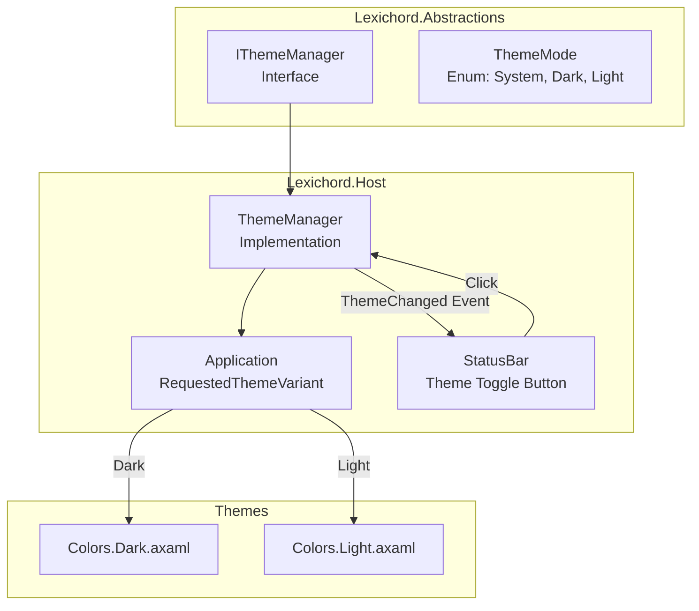
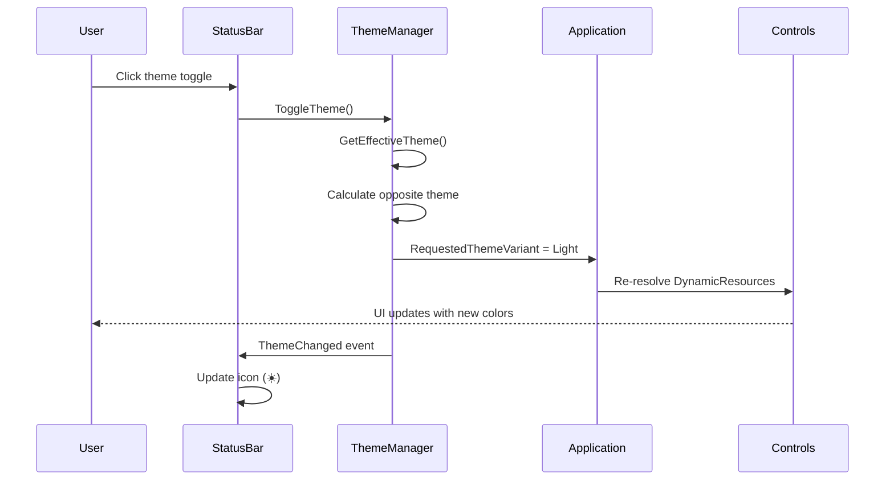
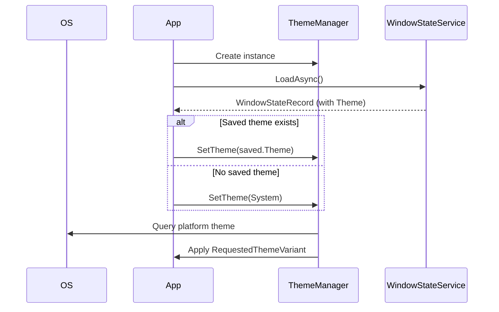

# LCS-01: Feature Design Composition

## 1. Metadata & Categorization

| Field                | Value                                      | Description                                 |
| :------------------- | :----------------------------------------- | :------------------------------------------ |
| **Feature ID**       | `INF-002c`                                 | Infrastructure - Theme Infrastructure       |
| **Feature Name**     | Runtime Theme Switching                    | Dark/Light mode with system detection.      |
| **Target Version**   | `v0.0.2c`                                  | Host Foundation Layer.                      |
| **Module Scope**     | `Lexichord.Abstractions`, `Lexichord.Host` | Theme contracts and implementation.         |
| **Swimlane**         | `Infrastructure`                           | The Podium (Platform).                      |
| **License Tier**     | `Core`                                     | Foundation (Required for all tiers).        |
| **Feature Gate Key** | N/A                                        | No runtime gating for theme infrastructure. |
| **Author**           | System Architect                           |                                             |
| **Status**           | **Draft**                                  | Pending approval.                           |
| **Last Updated**     | 2026-01-26                                 |                                             |

---

## 2. Executive Summary

### 2.1 The Requirement

Modern desktop applications are expected to:

- Support **Dark and Light themes** for user preference and accessibility.
- **Respect OS theme settings** on first launch.
- Allow users to **toggle themes at runtime** without restarting.

Lexichord's existing theme resources (`Colors.Dark.axaml`, `Colors.Light.axaml`) provide the color definitions, but there is no mechanism to switch between them at runtime.

### 2.2 The Proposed Solution

We **SHALL** implement a `ThemeManager` service that:

1. **Exposes a clean API** via `IThemeManager` in Abstractions.
2. **Leverages Avalonia's `RequestedThemeVariant`** for runtime switching.
3. **Detects system theme** on startup using `PlatformSettings`.
4. **Persists user preference** (coordinated with v0.0.2d WindowStateService).
5. **Updates the StatusBar toggle** to reflect and control the current theme.

---

## 3. Architecture & Modular Strategy

### 3.1 Theme Switching Architecture



### 3.2 File Structure After v0.0.2c

```text
src/Lexichord.Abstractions/
├── Contracts/
│   └── IThemeManager.cs           # NEW: Theme manager interface

src/Lexichord.Host/
├── Services/
│   └── ThemeManager.cs            # NEW: Theme manager implementation
├── Views/Shell/
│   └── StatusBar.axaml            # MODIFIED: Theme toggle wiring
│   └── StatusBar.axaml.cs         # MODIFIED: Click handler
```

### 3.3 Avalonia Theme Variant Mapping

| ThemeMode (Lexichord) | ThemeVariant (Avalonia) | Result                     |
| :-------------------- | :---------------------- | :------------------------- |
| `ThemeMode.Dark`      | `ThemeVariant.Dark`     | Uses Dark theme resources  |
| `ThemeMode.Light`     | `ThemeVariant.Light`    | Uses Light theme resources |
| `ThemeMode.System`    | `ThemeVariant.Default`  | Follows OS preference      |

---

## 4. Decision Tree: Theme Selection

```text
START: "What theme should be applied?"
│
├── Is there a saved user preference?
│   ├── YES → Load from WindowStateRecord.Theme
│   │   └── Apply saved theme
│   └── NO → First launch
│       └── Default to ThemeMode.System
│
├── User preference is ThemeMode.System
│   └── Query PlatformSettings.GetColorValues()
│       ├── PlatformThemeVariant.Dark → Apply Dark theme
│       └── PlatformThemeVariant.Light → Apply Light theme
│
├── User clicks theme toggle
│   ├── Current is Dark → Switch to Light
│   ├── Current is Light → Switch to Dark
│   └── Current is System → Switch to opposite of current effective theme
│
└── OS theme changes (background event)
    └── If current mode is System → Automatically re-apply
```

---

## 5. Data Contracts

### 5.1 ThemeMode Enum (Lexichord.Abstractions)

```csharp
namespace Lexichord.Abstractions.Contracts;

/// <summary>
/// Specifies the theme mode for the Lexichord application.
/// </summary>
public enum ThemeMode
{
    /// <summary>
    /// Follow the operating system's theme preference.
    /// </summary>
    /// <remarks>
    /// LOGIC: When System is selected, the application subscribes to OS theme change
    /// events and automatically switches when the user changes their system preference.
    /// </remarks>
    System = 0,

    /// <summary>
    /// Force dark theme regardless of system settings.
    /// </summary>
    Dark = 1,

    /// <summary>
    /// Force light theme regardless of system settings.
    /// </summary>
    Light = 2
}
```

### 5.2 IThemeManager Interface (Lexichord.Abstractions)

```csharp
namespace Lexichord.Abstractions.Contracts;

/// <summary>
/// Manages application theme switching and persistence.
/// </summary>
/// <remarks>
/// LOGIC: The ThemeManager is responsible for:
/// 1. Setting the application's RequestedThemeVariant
/// 2. Detecting and following system theme preferences
/// 3. Raising events when the theme changes
///
/// Modules can inject IThemeManager to respond to theme changes.
/// </remarks>
public interface IThemeManager
{
    /// <summary>
    /// Gets the currently selected theme mode.
    /// </summary>
    /// <remarks>
    /// This returns the user's preference (System/Dark/Light), not the
    /// effective theme. Use <see cref="GetEffectiveTheme"/> to get the
    /// actual Dark or Light theme being displayed.
    /// </remarks>
    ThemeMode CurrentTheme { get; }

    /// <summary>
    /// Raised when the theme changes.
    /// </summary>
    /// <remarks>
    /// LOGIC: This event fires when:
    /// - SetTheme() is called with a different value
    /// - ToggleTheme() is called
    /// - The OS theme changes (when CurrentTheme is System)
    /// </remarks>
    event EventHandler<ThemeMode>? ThemeChanged;

    /// <summary>
    /// Sets the application theme.
    /// </summary>
    /// <param name="mode">The theme mode to apply.</param>
    /// <remarks>
    /// LOGIC: This immediately updates Application.RequestedThemeVariant
    /// and raises the ThemeChanged event. All controls using DynamicResource
    /// bindings will automatically update.
    /// </remarks>
    void SetTheme(ThemeMode mode);

    /// <summary>
    /// Toggles between Dark and Light themes.
    /// </summary>
    /// <remarks>
    /// LOGIC: If current mode is System, this switches to the opposite of
    /// the current effective theme (e.g., if system is Dark, switches to Light).
    /// </remarks>
    void ToggleTheme();

    /// <summary>
    /// Gets the effective theme (resolves System to actual Dark or Light).
    /// </summary>
    /// <returns>Either <see cref="ThemeMode.Dark"/> or <see cref="ThemeMode.Light"/>.</returns>
    /// <remarks>
    /// LOGIC: This never returns System. It always returns the actual
    /// theme being displayed based on current settings and OS preference.
    /// </remarks>
    ThemeMode GetEffectiveTheme();
}
```

### 5.3 ThemeManager Implementation (Lexichord.Host)

```csharp
using Avalonia;
using Avalonia.Styling;
using Lexichord.Abstractions.Contracts;

namespace Lexichord.Host.Services;

/// <summary>
/// Manages runtime theme switching for the Lexichord application.
/// </summary>
/// <remarks>
/// LOGIC: This implementation uses Avalonia's built-in theme variant system.
/// When RequestedThemeVariant is changed, Avalonia automatically:
/// 1. Looks for theme variants in registered ResourceDictionaries
/// 2. Swaps all resources bound with {DynamicResource}
/// 3. Re-renders affected controls
///
/// Our Colors.Dark.axaml and Colors.Light.axaml define matching brush keys,
/// so all controls update seamlessly when the variant changes.
/// </remarks>
public sealed class ThemeManager : IThemeManager
{
    private readonly Application _application;
    private ThemeMode _currentTheme = ThemeMode.System;

    /// <summary>
    /// Initializes a new instance of the ThemeManager.
    /// </summary>
    /// <param name="application">The Avalonia application instance.</param>
    public ThemeManager(Application application)
    {
        _application = application ?? throw new ArgumentNullException(nameof(application));

        // LOGIC: Subscribe to platform theme changes for System mode
        if (_application.PlatformSettings is not null)
        {
            _application.PlatformSettings.ColorValuesChanged += OnPlatformColorValuesChanged;
        }
    }

    /// <inheritdoc/>
    public ThemeMode CurrentTheme => _currentTheme;

    /// <inheritdoc/>
    public event EventHandler<ThemeMode>? ThemeChanged;

    /// <inheritdoc/>
    public void SetTheme(ThemeMode mode)
    {
        if (_currentTheme == mode)
            return;

        _currentTheme = mode;
        ApplyTheme(mode);
        ThemeChanged?.Invoke(this, mode);
    }

    /// <inheritdoc/>
    public void ToggleTheme()
    {
        // LOGIC: Toggle based on effective theme, not preference
        var effective = GetEffectiveTheme();
        var newMode = effective == ThemeMode.Dark ? ThemeMode.Light : ThemeMode.Dark;
        SetTheme(newMode);
    }

    /// <inheritdoc/>
    public ThemeMode GetEffectiveTheme()
    {
        if (_currentTheme != ThemeMode.System)
            return _currentTheme;

        // LOGIC: Resolve system theme by checking Avalonia's actual theme variant
        return _application.ActualThemeVariant == ThemeVariant.Dark
            ? ThemeMode.Dark
            : ThemeMode.Light;
    }

    /// <summary>
    /// Applies the specified theme to the application.
    /// </summary>
    /// <param name="mode">The theme mode to apply.</param>
    private void ApplyTheme(ThemeMode mode)
    {
        // LOGIC: Map our ThemeMode to Avalonia's ThemeVariant
        _application.RequestedThemeVariant = mode switch
        {
            ThemeMode.Dark => ThemeVariant.Dark,
            ThemeMode.Light => ThemeVariant.Light,
            ThemeMode.System => ThemeVariant.Default,
            _ => ThemeVariant.Default
        };
    }

    /// <summary>
    /// Handles platform color values changed event.
    /// </summary>
    private void OnPlatformColorValuesChanged(object? sender, Avalonia.Platform.PlatformColorValues e)
    {
        // LOGIC: Only re-raise event if we're in System mode
        if (_currentTheme == ThemeMode.System)
        {
            ThemeChanged?.Invoke(this, ThemeMode.System);
        }
    }
}
```

### 5.4 Updated StatusBar.axaml.cs

```csharp
using Avalonia.Controls;
using Avalonia.Interactivity;
using Lexichord.Abstractions.Contracts;

namespace Lexichord.Host.Views.Shell;

/// <summary>
/// Status bar for the Lexichord shell.
/// </summary>
/// <remarks>
/// LOGIC: The StatusBar contains the theme toggle button which:
/// 1. Displays 🌙 (moon) for dark mode, ☀️ (sun) for light mode
/// 2. Calls ThemeManager.ToggleTheme() on click
/// 3. Updates icon when ThemeChanged event fires
/// </remarks>
public partial class StatusBar : UserControl
{
    private IThemeManager? _themeManager;
    private TextBlock? _themeIcon;

    public StatusBar()
    {
        InitializeComponent();
    }

    /// <summary>
    /// Initializes the theme manager reference and wires up events.
    /// </summary>
    /// <param name="themeManager">The theme manager instance.</param>
    public void Initialize(IThemeManager themeManager)
    {
        _themeManager = themeManager;
        _themeManager.ThemeChanged += OnThemeChanged;

        // Get reference to the theme icon TextBlock
        _themeIcon = this.FindControl<TextBlock>("ThemeIcon");

        // Set initial icon state
        UpdateThemeIcon();
    }

    /// <summary>
    /// Handles the theme toggle button click.
    /// </summary>
    private void OnThemeToggleClick(object? sender, RoutedEventArgs e)
    {
        _themeManager?.ToggleTheme();
    }

    /// <summary>
    /// Handles theme changed events.
    /// </summary>
    private void OnThemeChanged(object? sender, ThemeMode mode)
    {
        UpdateThemeIcon();
    }

    /// <summary>
    /// Updates the theme toggle icon based on current effective theme.
    /// </summary>
    private void UpdateThemeIcon()
    {
        if (_themeIcon is null || _themeManager is null)
            return;

        var effective = _themeManager.GetEffectiveTheme();
        _themeIcon.Text = effective == ThemeMode.Dark ? "🌙" : "☀️";
    }
}
```

### 5.5 Updated StatusBar.axaml (Theme Toggle Section)

```xml
<!-- Theme toggle button (replace existing placeholder) -->
<Button Classes="status-icon"
        ToolTip.Tip="Toggle Theme"
        x:Name="ThemeToggleButton"
        Click="OnThemeToggleClick">
    <TextBlock x:Name="ThemeIcon" Text="🌙" FontSize="14" />
</Button>
```

---

## 6. Implementation Workflow

### 6.1 Sequence: Theme Toggle



### 6.2 Sequence: Application Startup



---

## 7. Use Cases & User Stories

### 7.1 User Stories

| ID    | Role | Story                                                                        | Acceptance Criteria                      |
| :---- | :--- | :--------------------------------------------------------------------------- | :--------------------------------------- |
| US-01 | User | As a user, I want to click a button to toggle between Dark and Light themes. | Theme switch is instant (<100ms).        |
| US-02 | User | As a user, I want Lexichord to match my OS theme on first launch.            | Initial theme matches system preference. |
| US-03 | User | As a user, I want my theme preference remembered between sessions.           | Reopening app uses last selected theme.  |
| US-04 | User | As a user, I want the toggle icon to show the current theme.                 | 🌙 for dark, ☀️ for light.               |

### 7.2 Use Cases

#### UC-01: Toggle Theme

**Preconditions:**

- Application is running.
- Current theme is Dark.

**Flow:**

1. User clicks theme toggle button (🌙) in StatusBar.
2. StatusBar.OnThemeToggleClick fires.
3. ThemeManager.ToggleTheme() called.
4. ThemeManager sets RequestedThemeVariant to Light.
5. Avalonia re-resolves all DynamicResource bindings.
6. All UI elements update to Light theme colors.
7. ThemeChanged event fires.
8. StatusBar updates icon to ☀️.

**Postconditions:**

- Entire UI displays Light theme.
- Toggle icon shows ☀️.

---

#### UC-02: System Theme Detection

**Preconditions:**

- First launch (no appstate.json).
- OS is set to Dark mode.

**Flow:**

1. Application launches.
2. WindowStateService.LoadAsync returns null.
3. ThemeManager initialized with ThemeMode.System.
4. ThemeManager queries PlatformSettings.GetColorValues().
5. OS reports Dark preference.
6. Application.RequestedThemeVariant set to Dark.
7. UI renders in Dark theme.

**Postconditions:**

- Application matches OS theme.
- User can still toggle to Light if desired.

---

## 8. Observability & Logging

### 8.1 Log Events

| Level | Source       | Message Template                                  |
| :---- | :----------- | :------------------------------------------------ |
| Info  | ThemeManager | `Theme changed from {OldTheme} to {NewTheme}`     |
| Debug | ThemeManager | `Effective theme resolved to {EffectiveTheme}`    |
| Debug | ThemeManager | `Platform theme change detected: {PlatformTheme}` |
| Trace | StatusBar    | `Theme toggle clicked, current: {CurrentTheme}`   |

---

## 9. Unit Testing Requirements

### 9.1 ThemeManager Tests

```csharp
[Trait("Category", "Unit")]
public class ThemeManagerTests
{
    [Fact]
    public void SetTheme_ToDark_UpdatesCurrentTheme()
    {
        // Arrange
        var mockApp = CreateMockApplication();
        var sut = new ThemeManager(mockApp);

        // Act
        sut.SetTheme(ThemeMode.Dark);

        // Assert
        sut.CurrentTheme.Should().Be(ThemeMode.Dark);
    }

    [Fact]
    public void SetTheme_ToLight_SetsRequestedThemeVariant()
    {
        // Arrange
        var mockApp = CreateMockApplication();
        var sut = new ThemeManager(mockApp);

        // Act
        sut.SetTheme(ThemeMode.Light);

        // Assert
        mockApp.RequestedThemeVariant.Should().Be(ThemeVariant.Light);
    }

    [Fact]
    public void ToggleTheme_FromDark_SwitchesToLight()
    {
        // Arrange
        var mockApp = CreateMockApplication(actualVariant: ThemeVariant.Dark);
        var sut = new ThemeManager(mockApp);
        sut.SetTheme(ThemeMode.Dark);

        // Act
        sut.ToggleTheme();

        // Assert
        sut.CurrentTheme.Should().Be(ThemeMode.Light);
    }

    [Fact]
    public void SetTheme_RaisesThemeChangedEvent()
    {
        // Arrange
        var mockApp = CreateMockApplication();
        var sut = new ThemeManager(mockApp);
        ThemeMode? received = null;
        sut.ThemeChanged += (_, theme) => received = theme;

        // Act
        sut.SetTheme(ThemeMode.Light);

        // Assert
        received.Should().Be(ThemeMode.Light);
    }

    [Fact]
    public void GetEffectiveTheme_WhenSystem_ReturnsActualTheme()
    {
        // Arrange
        var mockApp = CreateMockApplication(actualVariant: ThemeVariant.Dark);
        var sut = new ThemeManager(mockApp);
        sut.SetTheme(ThemeMode.System);

        // Act
        var effective = sut.GetEffectiveTheme();

        // Assert
        effective.Should().Be(ThemeMode.Dark);
    }

    [Fact]
    public void SetTheme_SameValue_DoesNotRaiseEvent()
    {
        // Arrange
        var mockApp = CreateMockApplication();
        var sut = new ThemeManager(mockApp);
        sut.SetTheme(ThemeMode.Dark);
        var eventCount = 0;
        sut.ThemeChanged += (_, _) => eventCount++;

        // Act
        sut.SetTheme(ThemeMode.Dark);

        // Assert
        eventCount.Should().Be(0);
    }
}
```

---

## 10. Security & Safety

### 10.1 No Security Concerns

Theme switching is purely cosmetic and introduces no security risks:

- No user input validation required.
- No file system access beyond existing WindowStateService.
- No network communication.

---

## 11. Risks & Mitigations

| Risk                                | Impact | Mitigation                                                         |
| :---------------------------------- | :----- | :----------------------------------------------------------------- |
| Resources not using DynamicResource | Medium | Audit all AXAML to ensure DynamicResource is used for theme colors |
| Platform theme detection fails      | Low    | Fallback to Dark theme if PlatformSettings is null                 |
| ThemeChanged event null reference   | Low    | Use null-conditional operator (?.) when raising event              |

---

## 12. Acceptance Criteria (QA)

| #   | Category        | Criterion                                                          |
| :-- | :-------------- | :----------------------------------------------------------------- |
| 1   | **[Interface]** | `IThemeManager` exists in Abstractions with all specified methods. |
| 2   | **[Toggle]**    | Clicking theme toggle instantly switches all colors.               |
| 3   | **[Icon]**      | Toggle icon shows 🌙 in dark mode, ☀️ in light mode.               |
| 4   | **[System]**    | On first launch, theme matches OS preference.                      |
| 5   | **[Event]**     | ThemeChanged event fires when theme changes.                       |
| 6   | **[Persist]**   | Theme preference is saved (via WindowStateService integration).    |
| 7   | **[Restore]**   | Reopening app restores saved theme preference.                     |
| 8   | **[No Flash]**  | No visual "flash" of wrong theme during startup.                   |

---

## 13. Verification Commands

```bash
# ═══════════════════════════════════════════════════════════════════════════
# v0.0.2c Verification
# ═══════════════════════════════════════════════════════════════════════════

# 1. Verify interface exists
grep -l "IThemeManager" src/Lexichord.Abstractions/Contracts/*.cs
# Expected: IThemeManager.cs

# 2. Verify implementation exists
grep -l "class ThemeManager" src/Lexichord.Host/Services/*.cs
# Expected: ThemeManager.cs

# 3. Build and run
dotnet build
dotnet run --project src/Lexichord.Host

# 4. Manual verification:
# - Note initial theme (should match OS)
# - Click theme toggle in StatusBar
# - Verify all colors change (TopBar, NavRail, Content, StatusBar)
# - Verify icon changes (🌙 ↔ ☀️)
# - Close app, reopen, verify theme persists

# 5. Run unit tests
dotnet test --filter "FullyQualifiedName~ThemeManager"
```

---

## 14. Deliverable Checklist

| Step | Description                                                       | Status |
| :--- | :---------------------------------------------------------------- | :----- |
| 1    | `ThemeMode` enum created in Abstractions.                         | [ ]    |
| 2    | `IThemeManager` interface created in Abstractions.                | [ ]    |
| 3    | `ThemeManager` implementation created in Host/Services.           | [ ]    |
| 4    | ThemeManager wired up in App.axaml.cs.                            | [ ]    |
| 5    | StatusBar.axaml updated with Click handler on theme toggle.       | [ ]    |
| 6    | StatusBar.axaml.cs implements theme toggle logic.                 | [ ]    |
| 7    | Theme toggle icon updates based on effective theme.               | [ ]    |
| 8    | Theme persists via WindowStateService (integration with v0.0.2d). | [ ]    |
| 9    | System theme detected on first launch.                            | [ ]    |
| 10   | ThemeManager unit tests pass.                                     | [ ]    |
| 11   | Manual theme toggle verification complete.                        | [ ]    |
