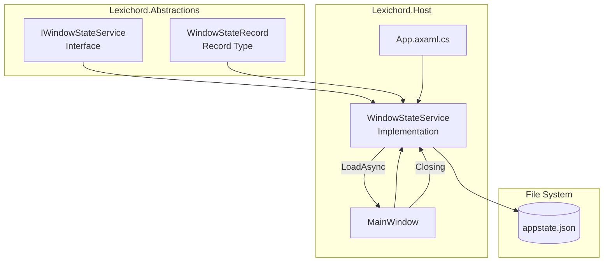

# LCS-01: Feature Design Composition

## 1. Metadata & Categorization

| Field                | Value                                      | Description                                    |
| :------------------- | :----------------------------------------- | :--------------------------------------------- |
| **Feature ID**       | `INF-002d`                                 | Infrastructure - Window State Persistence      |
| **Feature Name**     | Window State Persistence                   | Save/restore window geometry between sessions. |
| **Target Version**   | `v0.0.2d`                                  | Host Foundation Layer.                         |
| **Module Scope**     | `Lexichord.Abstractions`, `Lexichord.Host` | State contracts and implementation.            |
| **Swimlane**         | `Infrastructure`                           | The Podium (Platform).                         |
| **License Tier**     | `Core`                                     | Foundation (Required for all tiers).           |
| **Feature Gate Key** | N/A                                        | No runtime gating for window state.            |
| **Author**           | System Architect                           |                                                |
| **Status**           | **Draft**                                  | Pending approval.                              |
| **Last Updated**     | 2026-01-26                                 |                                                |

---

## 2. Executive Summary

### 2.1 The Requirement

Professional desktop applications remember user preferences. Users expect:

- **Window position** to restore where they left it.
- **Window size** to remain consistent across sessions.
- **Maximized/windowed state** to be remembered.
- **Theme preference** to persist (integration with v0.0.2c).

Failing to persist state forces users to re-arrange their workspace every launch—a poor UX.

### 2.2 The Proposed Solution

We **SHALL** implement a `WindowStateService` that:

1. **Persists state to JSON** in the platform-appropriate AppData directory.
2. **Saves on window close** by hooking into `MainWindow.Closing`.
3. **Restores on startup** with validation for off-screen positions.
4. **Integrates with ThemeManager** to persist theme preference.

---

## 3. Architecture & Modular Strategy

### 3.1 Persistence Architecture



### 3.2 File Structure After v0.0.2d

```text
src/Lexichord.Abstractions/
├── Contracts/
│   ├── IWindowStateService.cs   # NEW: Window state service interface
│   └── WindowStateRecord.cs     # NEW: State data record

src/Lexichord.Host/
├── Services/
│   └── WindowStateService.cs    # NEW: JSON persistence implementation
├── Views/
│   └── MainWindow.axaml.cs      # MODIFIED: Save/restore hooks
├── App.axaml.cs                 # MODIFIED: Service initialization
```

### 3.3 Platform-Specific File Locations

| Platform | Directory                           | Full Path                                                           |
| :------- | :---------------------------------- | :------------------------------------------------------------------ |
| Windows  | `%APPDATA%`                         | `C:\Users\{user}\AppData\Roaming\Lexichord\appstate.json`           |
| macOS    | `~/Library/Application Support`     | `/Users/{user}/Library/Application Support/Lexichord/appstate.json` |
| Linux    | `~/.config` (via `XDG_CONFIG_HOME`) | `/home/{user}/.config/Lexichord/appstate.json`                      |

---

## 4. Decision Tree: State Restoration

```text
START: "How should the window be positioned on launch?"
│
├── Does appstate.json exist?
│   ├── NO → Center on primary monitor, use default size (1400x900)
│   └── YES → Attempt to parse JSON
│       ├── Parse FAILED (corrupted) → Delete file, use defaults
│       └── Parse SUCCESS → Validate position
│
├── Validate saved position
│   ├── Is (X, Y) within any connected screen bounds?
│   │   ├── YES → Apply saved position
│   │   └── NO → Center on primary monitor (screen was disconnected)
│   │
│   ├── Is (Width, Height) >= minimum size (1024x768)?
│   │   ├── YES → Apply saved dimensions
│   │   └── NO → Use minimum size
│   │
│   └── Is IsMaximized true?
│       ├── YES → Maximize window after positioning
│       └── NO → Use windowed state
│
└── Apply theme from saved state (delegate to ThemeManager)
```

---

## 5. Data Contracts

### 5.1 WindowStateRecord (Lexichord.Abstractions)

```csharp
namespace Lexichord.Abstractions.Contracts;

/// <summary>
/// Represents the persisted state of the main application window.
/// </summary>
/// <remarks>
/// LOGIC: This record captures all state needed to restore the window
/// to its previous position, size, and configuration. The record is
/// immutable and serialized to JSON for persistence.
///
/// Platform coordinates use screen pixels, not logical units.
/// Multi-monitor setups may have negative coordinates (left/above primary).
/// </remarks>
/// <param name="X">Window X position in screen coordinates (can be negative).</param>
/// <param name="Y">Window Y position in screen coordinates (can be negative).</param>
/// <param name="Width">Window width in pixels (minimum: 1024).</param>
/// <param name="Height">Window height in pixels (minimum: 768).</param>
/// <param name="IsMaximized">Whether the window is maximized.</param>
/// <param name="Theme">The user's preferred theme mode.</param>
public record WindowStateRecord(
    double X,
    double Y,
    double Width,
    double Height,
    bool IsMaximized,
    ThemeMode Theme
)
{
    /// <summary>
    /// Default window state for first launch.
    /// </summary>
    /// <remarks>
    /// LOGIC: Uses centered positioning (handled by caller), default size,
    /// windowed mode, and system theme detection.
    /// </remarks>
    public static WindowStateRecord Default => new(
        X: 0,
        Y: 0,
        Width: 1400,
        Height: 900,
        IsMaximized: false,
        Theme: ThemeMode.System
    );
}
```

### 5.2 IWindowStateService Interface (Lexichord.Abstractions)

```csharp
namespace Lexichord.Abstractions.Contracts;

/// <summary>
/// Manages window state persistence between application sessions.
/// </summary>
/// <remarks>
/// LOGIC: The WindowStateService is responsible for:
/// 1. Loading saved window state from the file system
/// 2. Saving window state when the application closes
/// 3. Validating that loaded state is applicable to current screen configuration
///
/// The service uses async I/O to prevent blocking the UI thread.
/// </remarks>
public interface IWindowStateService
{
    /// <summary>
    /// Loads the saved window state from persistent storage.
    /// </summary>
    /// <returns>
    /// The saved window state, or null if no saved state exists or
    /// the saved state could not be loaded (corrupted file, etc.).
    /// </returns>
    /// <remarks>
    /// LOGIC: This method should never throw. File I/O errors or JSON
    /// deserialization errors are caught and result in null return.
    /// </remarks>
    Task<WindowStateRecord?> LoadAsync();

    /// <summary>
    /// Saves the current window state to persistent storage.
    /// </summary>
    /// <param name="state">The window state to save.</param>
    /// <returns>A task representing the async save operation.</returns>
    /// <remarks>
    /// LOGIC: This method should never throw. File I/O errors are caught
    /// and logged, but do not affect application behavior.
    /// </remarks>
    Task SaveAsync(WindowStateRecord state);

    /// <summary>
    /// Validates whether a saved position is visible on current screens.
    /// </summary>
    /// <param name="state">The state to validate.</param>
    /// <returns>True if the position is valid and visible.</returns>
    /// <remarks>
    /// LOGIC: A position is valid if at least a portion of the window
    /// (e.g., 100x100 pixels) would be visible on any connected screen.
    /// This handles cases where a monitor was disconnected.
    /// </remarks>
    bool IsPositionValid(WindowStateRecord state);
}
```

### 5.3 WindowStateService Implementation (Lexichord.Host)

```csharp
using System;
using System.IO;
using System.Text.Json;
using System.Threading.Tasks;
using Avalonia;
using Avalonia.Controls;
using Avalonia.Platform.Storage;
using Lexichord.Abstractions.Contracts;

namespace Lexichord.Host.Services;

/// <summary>
/// Persists window state to a JSON file in the user's AppData directory.
/// </summary>
/// <remarks>
/// LOGIC: Window state is saved on close and loaded on startup.
/// The file location follows platform conventions via Environment.SpecialFolder.
///
/// The service is designed to be fault-tolerant:
/// - LoadAsync returns null if file doesn't exist or is corrupted
/// - SaveAsync swallows exceptions to avoid disrupting app close
/// - IsPositionValid checks against current screen configuration
/// </remarks>
public sealed class WindowStateService : IWindowStateService
{
    private static readonly JsonSerializerOptions JsonOptions = new()
    {
        WriteIndented = true,
        PropertyNamingPolicy = JsonNamingPolicy.CamelCase
    };

    private readonly string _filePath;
    private readonly Screens? _screens;

    /// <summary>
    /// Initializes a new instance of the WindowStateService.
    /// </summary>
    /// <param name="screens">Screen configuration for position validation.</param>
    public WindowStateService(Screens? screens = null)
    {
        _screens = screens;

        // LOGIC: Use platform-appropriate AppData location
        var appData = Environment.GetFolderPath(Environment.SpecialFolder.ApplicationData);
        var lexichordDir = Path.Combine(appData, "Lexichord");

        // Create directory if it doesn't exist
        Directory.CreateDirectory(lexichordDir);

        _filePath = Path.Combine(lexichordDir, "appstate.json");
    }

    /// <inheritdoc/>
    public async Task<WindowStateRecord?> LoadAsync()
    {
        try
        {
            if (!File.Exists(_filePath))
            {
                // LOGIC: No saved state, return null to use defaults
                return null;
            }

            var json = await File.ReadAllTextAsync(_filePath);
            var state = JsonSerializer.Deserialize<WindowStateRecord>(json, JsonOptions);

            return state;
        }
        catch (JsonException)
        {
            // LOGIC: Corrupted JSON file—delete and return null
            TryDeleteCorruptedFile();
            return null;
        }
        catch (IOException)
        {
            // LOGIC: File access error—return null to use defaults
            return null;
        }
        catch (Exception)
        {
            // LOGIC: Unexpected error—fail safe to defaults
            return null;
        }
    }

    /// <inheritdoc/>
    public async Task SaveAsync(WindowStateRecord state)
    {
        try
        {
            var json = JsonSerializer.Serialize(state, JsonOptions);
            await File.WriteAllTextAsync(_filePath, json);
        }
        catch (Exception)
        {
            // LOGIC: Failed to save—silently ignore
            // Window state is non-critical, app close must not fail
        }
    }

    /// <inheritdoc/>
    public bool IsPositionValid(WindowStateRecord state)
    {
        if (_screens is null || _screens.All.Count == 0)
        {
            // LOGIC: No screen info available, assume valid
            return true;
        }

        // LOGIC: Check if at least 100x100 of the window is visible on any screen
        const int minVisiblePixels = 100;

        var windowRect = new PixelRect(
            (int)state.X,
            (int)state.Y,
            (int)state.Width,
            (int)state.Height
        );

        foreach (var screen in _screens.All)
        {
            var intersection = screen.Bounds.Intersect(windowRect);

            if (intersection.Width >= minVisiblePixels &&
                intersection.Height >= minVisiblePixels)
            {
                return true;
            }
        }

        // LOGIC: Window would be mostly off-screen
        return false;
    }

    /// <summary>
    /// Attempts to delete a corrupted state file.
    /// </summary>
    private void TryDeleteCorruptedFile()
    {
        try
        {
            File.Delete(_filePath);
        }
        catch
        {
            // Ignore deletion errors
        }
    }
}
```

### 5.4 MainWindow State Integration

```csharp
using Avalonia;
using Avalonia.Controls;
using Lexichord.Abstractions.Contracts;

namespace Lexichord.Host.Views;

/// <summary>
/// The main application window for Lexichord.
/// </summary>
public partial class MainWindow : Window
{
    private IWindowStateService? _windowStateService;
    private IThemeManager? _themeManager;

    /// <summary>
    /// Gets or sets the window state service.
    /// </summary>
    public IWindowStateService? WindowStateService
    {
        get => _windowStateService;
        set
        {
            _windowStateService = value;
            if (value is not null)
            {
                RestoreWindowState();
            }
        }
    }

    /// <summary>
    /// Gets or sets the theme manager.
    /// </summary>
    public IThemeManager? ThemeManager { get; set; }

    public MainWindow()
    {
        InitializeComponent();

        // LOGIC: Subscribe to Closing event to save state
        Closing += OnWindowClosing;
    }

    /// <summary>
    /// Restores window state from persisted storage.
    /// </summary>
    private async void RestoreWindowState()
    {
        if (_windowStateService is null)
            return;

        var state = await _windowStateService.LoadAsync();

        if (state is null)
        {
            // LOGIC: First launch or corrupted file—use defaults
            WindowStartupLocation = WindowStartupLocation.CenterScreen;
            return;
        }

        // LOGIC: Validate position before applying
        if (_windowStateService.IsPositionValid(state))
        {
            Position = new PixelPoint((int)state.X, (int)state.Y);
            Width = Math.Max(state.Width, MinWidth);
            Height = Math.Max(state.Height, MinHeight);
            WindowStartupLocation = WindowStartupLocation.Manual;
        }
        else
        {
            // LOGIC: Saved position is off-screen, center instead
            Width = Math.Max(state.Width, MinWidth);
            Height = Math.Max(state.Height, MinHeight);
            WindowStartupLocation = WindowStartupLocation.CenterScreen;
        }

        // LOGIC: Restore maximized state after size/position
        if (state.IsMaximized)
        {
            WindowState = WindowState.Maximized;
        }

        // LOGIC: Restore theme preference
        ThemeManager?.SetTheme(state.Theme);
    }

    /// <summary>
    /// Saves window state when the window is closing.
    /// </summary>
    private async void OnWindowClosing(object? sender, WindowClosingEventArgs e)
    {
        if (_windowStateService is null)
            return;

        // LOGIC: Capture current state
        // If maximized, save the restored position (not maximized bounds)
        var position = WindowState == WindowState.Maximized
            ? RestoreBounds.Position
            : Position;
        var size = WindowState == WindowState.Maximized
            ? RestoreBounds.Size
            : new Size(Width, Height);

        var state = new WindowStateRecord(
            X: position.X,
            Y: position.Y,
            Width: size.Width,
            Height: size.Height,
            IsMaximized: WindowState == WindowState.Maximized,
            Theme: ThemeManager?.CurrentTheme ?? ThemeMode.System
        );

        await _windowStateService.SaveAsync(state);
    }
}
```

### 5.5 App.axaml.cs Integration

```csharp
public override void OnFrameworkInitializationCompleted()
{
    // Initialize services
    _themeManager = new ThemeManager(this);
    _windowStateService = new WindowStateService(Screens);

    if (ApplicationLifetime is IClassicDesktopStyleApplicationLifetime desktop)
    {
        desktop.MainWindow = new MainWindow
        {
            ThemeManager = _themeManager,
            WindowStateService = _windowStateService
        };
    }

    base.OnFrameworkInitializationCompleted();
}
```

---

## 6. JSON File Format

### 6.1 Example appstate.json

```json
{
    "x": 100,
    "y": 200,
    "width": 1600,
    "height": 1000,
    "isMaximized": false,
    "theme": 1
}
```

**Field Mapping:**
| Field | Type | Description |
|:--------------|:--------|:-------------------------------------------|
| `x` | double | Window X position (screen pixels) |
| `y` | double | Window Y position (screen pixels) |
| `width` | double | Window width (pixels) |
| `height` | double | Window height (pixels) |
| `isMaximized` | bool | Whether window was maximized |
| `theme` | int | ThemeMode enum value (0=System, 1=Dark, 2=Light) |

---

## 7. Use Cases & User Stories

### 7.1 User Stories

| ID    | Role | Story                                                                                 | Acceptance Criteria                                |
| :---- | :--- | :------------------------------------------------------------------------------------ | :------------------------------------------------- |
| US-01 | User | As a user, I want my window size to be remembered.                                    | Reopening restores exact dimensions.               |
| US-02 | User | As a user, I want my window position to be remembered.                                | Reopening restores exact position.                 |
| US-03 | User | As a user, I want maximized state to be remembered.                                   | Maximized window stays maximized on reopen.        |
| US-04 | User | As a user with multiple monitors, I want the window to appear on the correct monitor. | Position restored to same monitor.                 |
| US-05 | User | As a user who disconnected a monitor, I want the window to appear on screen.          | Window centers on primary if saved pos off-screen. |

### 7.2 Use Cases

#### UC-01: Normal Restore

**Preconditions:**

- User previously ran Lexichord.
- `appstate.json` exists with valid position.
- Monitor configuration unchanged.

**Flow:**

1. User launches Lexichord.
2. WindowStateService.LoadAsync() returns saved state.
3. IsPositionValid() returns true.
4. MainWindow applies saved X, Y, Width, Height.
5. Window appears exactly as left.

**Postconditions:**

- Window geometry matches saved state.

---

#### UC-02: Off-Screen Recovery

**Preconditions:**

- User previously ran Lexichord on external monitor.
- External monitor is now disconnected.
- `appstate.json` has position on disconnected monitor.

**Flow:**

1. User launches Lexichord.
2. WindowStateService.LoadAsync() returns saved state.
3. IsPositionValid() returns false (position off-screen).
4. MainWindow uses saved Width/Height.
5. MainWindow centers on primary monitor.

**Postconditions:**

- Window is visible on primary monitor.
- Saved size is preserved.

---

#### UC-03: Corrupted File Recovery

**Preconditions:**

- `appstate.json` exists but contains invalid JSON.

**Flow:**

1. User launches Lexichord.
2. WindowStateService.LoadAsync() catches JsonException.
3. Corrupted file is deleted.
4. Method returns null.
5. MainWindow uses defaults (centered, 1400x900).

**Postconditions:**

- App launches successfully despite corruption.
- Fresh appstate.json will be created on close.

---

## 8. Observability & Logging

### 8.1 Log Events

| Level   | Source             | Message Template                                               |
| :------ | :----------------- | :------------------------------------------------------------- |
| Debug   | WindowStateService | `Loading window state from {FilePath}`                         |
| Debug   | WindowStateService | `Loaded state: X={X}, Y={Y}, Width={Width}, Height={Height}`   |
| Info    | WindowStateService | `Saved window state to {FilePath}`                             |
| Warning | WindowStateService | `Corrupted appstate.json deleted`                              |
| Warning | WindowStateService | `Saved position ({X},{Y}) is off-screen, centering on primary` |
| Debug   | MainWindow         | `Restored window: Position=({X},{Y}), Size={Width}x{Height}`   |

---

## 9. Unit Testing Requirements

### 9.1 WindowStateService Tests

```csharp
[Trait("Category", "Unit")]
public class WindowStateServiceTests
{
    [Fact]
    public async Task LoadAsync_WhenNoFile_ReturnsNull()
    {
        // Arrange
        var tempDir = CreateTempDirectory();
        var sut = CreateService(tempDir);

        // Act
        var result = await sut.LoadAsync();

        // Assert
        result.Should().BeNull();
    }

    [Fact]
    public async Task SaveAsync_ThenLoadAsync_RoundTripsCorrectly()
    {
        // Arrange
        var tempDir = CreateTempDirectory();
        var sut = CreateService(tempDir);
        var state = new WindowStateRecord(100, 200, 1400, 900, false, ThemeMode.Dark);

        // Act
        await sut.SaveAsync(state);
        var loaded = await sut.LoadAsync();

        // Assert
        loaded.Should().BeEquivalentTo(state);
    }

    [Fact]
    public async Task LoadAsync_WithCorruptedJson_ReturnsNull()
    {
        // Arrange
        var tempDir = CreateTempDirectory();
        var filePath = Path.Combine(tempDir, "appstate.json");
        await File.WriteAllTextAsync(filePath, "{ invalid json }");
        var sut = CreateService(tempDir);

        // Act
        var result = await sut.LoadAsync();

        // Assert
        result.Should().BeNull();
    }

    [Fact]
    public async Task LoadAsync_WithCorruptedJson_DeletesFile()
    {
        // Arrange
        var tempDir = CreateTempDirectory();
        var filePath = Path.Combine(tempDir, "appstate.json");
        await File.WriteAllTextAsync(filePath, "{ invalid }");
        var sut = CreateService(tempDir);

        // Act
        await sut.LoadAsync();

        // Assert
        File.Exists(filePath).Should().BeFalse();
    }

    [Fact]
    public void IsPositionValid_WhenOnScreen_ReturnsTrue()
    {
        // Arrange
        var mockScreens = CreateMockScreens(new PixelRect(0, 0, 1920, 1080));
        var sut = new WindowStateService(mockScreens);
        var state = new WindowStateRecord(100, 100, 800, 600, false, ThemeMode.Dark);

        // Act
        var result = sut.IsPositionValid(state);

        // Assert
        result.Should().BeTrue();
    }

    [Fact]
    public void IsPositionValid_WhenOffScreen_ReturnsFalse()
    {
        // Arrange
        var mockScreens = CreateMockScreens(new PixelRect(0, 0, 1920, 1080));
        var sut = new WindowStateService(mockScreens);
        var state = new WindowStateRecord(5000, 5000, 800, 600, false, ThemeMode.Dark);

        // Act
        var result = sut.IsPositionValid(state);

        // Assert
        result.Should().BeFalse();
    }

    [Fact]
    public void IsPositionValid_WhenPartiallyOnScreen_ReturnsTrue()
    {
        // Arrange
        var mockScreens = CreateMockScreens(new PixelRect(0, 0, 1920, 1080));
        var sut = new WindowStateService(mockScreens);
        // Window at (1800, 0) with width 800 = partially visible
        var state = new WindowStateRecord(1800, 0, 800, 600, false, ThemeMode.Dark);

        // Act
        var result = sut.IsPositionValid(state);

        // Assert
        result.Should().BeTrue();  // 120px visible
    }
}
```

---

## 10. Security & Safety

### 10.1 File System Safety

> [!IMPORTANT]
> The `appstate.json` file contains **non-sensitive** data:
>
> - Window coordinates
> - Window dimensions
> - Theme preference (enum value)
>
> No API keys, passwords, or personal data are stored.

### 10.2 Error Handling

- **LoadAsync**: Never throws; returns null on any error.
- **SaveAsync**: Never throws; silently fails on I/O errors.
- **File Corruption**: Detected, logged, and file deleted.

---

## 11. Risks & Mitigations

| Risk                                 | Impact | Mitigation                                                      |
| :----------------------------------- | :----- | :-------------------------------------------------------------- |
| File locked by another process       | Low    | Use try/catch; fall back to defaults                            |
| Invalid JSON after manual edit       | Low    | Catch JsonException; delete and use defaults                    |
| Negative coordinates (multi-monitor) | Medium | Validate against actual screen bounds, not just positive values |
| RestoreBounds null when maximized    | Low    | Check for null; fall back to Position/Width/Height              |

---

## 12. Acceptance Criteria (QA)

| #   | Category         | Criterion                                                           |
| :-- | :--------------- | :------------------------------------------------------------------ |
| 1   | **[Interface]**  | `IWindowStateService` exists in Abstractions.                       |
| 2   | **[Record]**     | `WindowStateRecord` exists in Abstractions with all fields.         |
| 3   | **[File]**       | `appstate.json` created in correct AppData location on first close. |
| 4   | **[Size]**       | Resizing window and reopening restores saved size.                  |
| 5   | **[Position]**   | Moving window and reopening restores saved position.                |
| 6   | **[Maximized]**  | Maximizing and reopening restores maximized state.                  |
| 7   | **[Theme]**      | Theme preference persists via WindowStateRecord.Theme.              |
| 8   | **[Off-Screen]** | If saved position is off-screen, window centers on primary monitor. |
| 9   | **[Corrupted]**  | If appstate.json is corrupted, app launches with defaults.          |

---

## 13. Verification Commands

```bash
# ═══════════════════════════════════════════════════════════════════════════
# v0.0.2d Verification
# ═══════════════════════════════════════════════════════════════════════════

# 1. Verify interface and record exist
grep -l "IWindowStateService" src/Lexichord.Abstractions/Contracts/*.cs
grep -l "WindowStateRecord" src/Lexichord.Abstractions/Contracts/*.cs

# 2. Verify implementation exists
grep -l "class WindowStateService" src/Lexichord.Host/Services/*.cs

# 3. Build and run
dotnet build
dotnet run --project src/Lexichord.Host

# 4. Manual verification steps:
# a) Resize window to 1200x800
# b) Move window to right side of screen
# c) Close app
# d) Verify appstate.json exists:
#    Windows: dir %APPDATA%\Lexichord\appstate.json
#    macOS: ls -la ~/Library/Application\ Support/Lexichord/appstate.json
#    Linux: ls -la ~/.config/Lexichord/appstate.json
# e) Reopen app, verify size and position restored
# f) Maximize window, close, reopen, verify maximized

# 5. Off-screen test:
# a) Edit appstate.json, change x/y to 5000
# b) Reopen app
# c) Verify window appears centered, not at (5000, 5000)

# 6. Run unit tests
dotnet test --filter "FullyQualifiedName~WindowStateService"
```

---

## 14. Deliverable Checklist

| Step | Description                                                     | Status |
| :--- | :-------------------------------------------------------------- | :----- |
| 1    | `WindowStateRecord` record created in Abstractions.             | [ ]    |
| 2    | `IWindowStateService` interface created in Abstractions.        | [ ]    |
| 3    | `WindowStateService` implementation created in Host/Services.   | [ ]    |
| 4    | WindowStateService uses platform-appropriate AppData path.      | [ ]    |
| 5    | MainWindow.Closing handler saves state.                         | [ ]    |
| 6    | MainWindow restores state on launch.                            | [ ]    |
| 7    | IsPositionValid validates against current screen configuration. | [ ]    |
| 8    | Off-screen positions fallback to center.                        | [ ]    |
| 9    | Corrupted JSON is handled gracefully.                           | [ ]    |
| 10   | Theme preference integrated with ThemeManager.                  | [ ]    |
| 11   | WindowStateService unit tests pass.                             | [ ]    |
| 12   | Manual verification complete.                                   | [ ]    |
