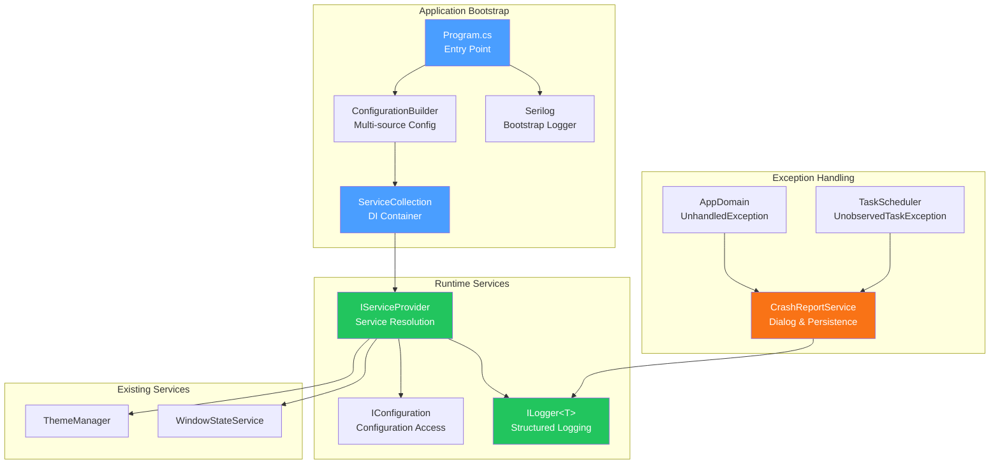
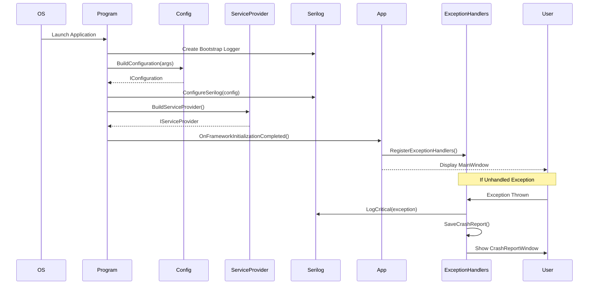

# LCS-DES-003: Design Specification Index — The Nervous System (Logging & DI)

## Document Control

| Field                | Value                                  |
| :------------------- | :------------------------------------- |
| **Document ID**      | LCS-DES-003-INDEX                      |
| **Feature ID**       | INF-003                                |
| **Feature Name**     | The Nervous System (Logging & DI)      |
| **Target Version**   | v0.0.3                                 |
| **Module Scope**     | Lexichord.Host / Lexichord.Abstractions |
| **Swimlane**         | Infrastructure                         |
| **License Tier**     | Core                                   |
| **Feature Gate Key** | N/A                                    |
| **Status**           | Draft                                  |
| **Last Updated**     | 2026-01-27                             |

---

## 1. Executive Summary

**v0.0.3** establishes the runtime infrastructure that enables the application to "think" and report errors. This release transforms the Avalonia shell from a static UI into a properly instrumented, dependency-injectable application with comprehensive logging and configuration capabilities.

### 1.1 The Problem

Without proper runtime infrastructure:

- Services cannot be injected or mocked for testing
- Production bugs are impossible to diagnose without structured logging
- Application crashes provide no actionable information to users
- Module loading (v0.0.4) cannot register services dynamically
- Configuration cannot be customized for different environments

### 1.2 The Solution

Implement a complete runtime infrastructure with:

- **Dependency Injection Root** — Microsoft.Extensions.DependencyInjection as the IoC container
- **Serilog Pipeline** — Structured logging with Console and File sinks
- **Global Exception Trap** — Crash Report dialog and exception persistence
- **Configuration Service** — Multi-source configuration with options pattern

### 1.3 Business Value

| Value                  | Description                                           |
| :--------------------- | :---------------------------------------------------- |
| **Testability**        | DI enables mocking and isolation in unit tests        |
| **Observability**      | Structured logs enable production debugging           |
| **User Experience**    | Crash dialogs provide actionable error information    |
| **Flexibility**        | Configuration can be customized per environment       |
| **Module Foundation**  | Enables module registration in v0.0.4                 |

---

## 2. Related Documents

### 2.1 Scope Breakdown Document

The detailed scope breakdown for v0.0.3, including all sub-parts, implementation checklists, and acceptance criteria:

| Document                            | Description                                         |
| :---------------------------------- | :-------------------------------------------------- |
| **[LCS-SBD-003](./LCS-SBD-003.md)** | Scope Breakdown — The Nervous System (Logging & DI) |

### 2.2 Sub-Part Design Specifications

Each sub-part has its own detailed design specification following the LDS-01 template:

| Sub-Part | Document                              | Title                    | Description                               |
| :------- | :------------------------------------ | :----------------------- | :---------------------------------------- |
| v0.0.3a  | **[LCS-DES-003a](./LCS-DES-003a.md)** | Dependency Injection Root | Microsoft.Extensions.DependencyInjection  |
| v0.0.3b  | **[LCS-DES-003b](./LCS-DES-003b.md)** | Serilog Pipeline         | Structured logging with Console and File  |
| v0.0.3c  | **[LCS-DES-003c](./LCS-DES-003c.md)** | Global Exception Trap    | Crash Report dialog and persistence       |
| v0.0.3d  | **[LCS-DES-003d](./LCS-DES-003d.md)** | Configuration Service    | Multi-source config with options pattern  |

---

## 3. Architecture Overview

### 3.1 Component Diagram

### 3.2 Data Flow

---

## 4. Dependencies

### 4.1 Upstream Dependencies

| Dependency         | Source Version | Purpose                           |
| :----------------- | :------------- | :-------------------------------- |
| Avalonia Bootstrap | v0.0.2a        | Application lifecycle             |
| ThemeManager       | v0.0.2c        | Will be registered in DI          |
| WindowStateService | v0.0.2d        | Will be registered in DI          |

### 4.2 NuGet Packages

| Package                                            | Version | Purpose                              |
| :------------------------------------------------- | :------ | :----------------------------------- |
| `Microsoft.Extensions.DependencyInjection`         | 9.0.x   | IoC container                        |
| `Microsoft.Extensions.Hosting.Abstractions`        | 9.0.x   | Host environment abstractions        |
| `Microsoft.Extensions.Configuration`               | 9.0.x   | Configuration core                   |
| `Microsoft.Extensions.Configuration.Json`          | 9.0.x   | JSON file configuration              |
| `Microsoft.Extensions.Configuration.EnvironmentVariables` | 9.0.x | Environment variable configuration |
| `Microsoft.Extensions.Configuration.CommandLine`   | 9.0.x   | CLI argument configuration           |
| `Microsoft.Extensions.Options`                     | 9.0.x   | Options pattern                      |
| `Serilog`                                          | 4.x     | Structured logging                   |
| `Serilog.Extensions.Logging`                       | 9.x     | Microsoft.Extensions.Logging integration |
| `Serilog.Sinks.Console`                            | 6.x     | Console output sink                  |
| `Serilog.Sinks.File`                               | 6.x     | Rolling file sink                    |
| `Serilog.Enrichers.Thread`                         | 4.x     | Thread ID enricher                   |
| `Serilog.Enrichers.Environment`                    | 3.x     | Machine name enricher                |

### 4.3 Downstream Consumers (Future)

| Version | Feature             | Uses From v0.0.3                              |
| :------ | :------------------ | :-------------------------------------------- |
| v0.0.4  | Module System       | IServiceProvider for module registration      |
| v0.0.5  | Database Foundation | ILogger<T>, IOptions for connection config    |
| v0.1.x  | Settings UI         | IConfiguration for settings persistence       |
| v0.3.x  | Style Module        | Logging for analysis operations               |

---

## 5. License Gating Strategy

**N/A** — Infrastructure services are Core foundation required by all license tiers. No runtime gating is applied to DI, logging, configuration, or exception handling.

---

## 6. Key Interfaces Summary

| Interface             | Defined In | Purpose                               |
| :-------------------- | :--------- | :------------------------------------ |
| `IServiceLocator`     | v0.0.3a    | Transitional service resolution       |
| `ICrashReportService` | v0.0.3c    | Crash report display and persistence  |

| Record/DTO             | Defined In | Purpose                               |
| :--------------------- | :--------- | :------------------------------------ |
| `LexichordOptions`     | v0.0.3d    | Core application configuration        |
| `DebugOptions`         | v0.0.3d    | Debug-specific settings               |
| `FeatureFlagOptions`   | v0.0.3d    | Feature flag configuration            |

---

## 7. Implementation Checklist Summary

| Sub-Part  | Key Deliverables                                             | Est. Hours   | Status |
| :-------- | :----------------------------------------------------------- | :----------- | :----- |
| v0.0.3a   | DI packages, HostServices.cs, App.axaml.cs integration       | 4            | [ ]    |
| v0.0.3b   | Serilog packages, Bootstrap logger, File sinks               | 5            | [ ]    |
| v0.0.3c   | Exception handlers, CrashReportWindow, CrashReportService    | 5            | [ ]    |
| v0.0.3d   | Configuration packages, appsettings.json, Options pattern    | 4            | [ ]    |
| **Total** |                                                              | **18 hours** |        |

See [LCS-SBD-003](./LCS-SBD-003.md) Section 3 for the detailed implementation checklist.

---

## 8. Success Criteria Summary

| Category        | Criterion                                              | Target        |
| :-------------- | :----------------------------------------------------- | :------------ |
| **DI**          | All services resolved via IServiceProvider             | Pass          |
| **DI**          | No `new` instantiation of registered services          | Pass          |
| **Logging**     | Console displays log messages during development       | Pass          |
| **Logging**     | Log files created in `{AppData}/Lexichord/Logs/`       | Pass          |
| **Exception**   | Unhandled exception shows Crash Report dialog          | Pass          |
| **Exception**   | Crash reports saved to `{AppData}/Lexichord/CrashReports/` | Pass      |
| **Config**      | `appsettings.json` values loaded on startup            | Pass          |
| **Config**      | `--debug-mode` CLI enables verbose logging             | Pass          |

See individual design specs for detailed acceptance criteria.

---

## 9. Test Coverage Summary

| Sub-Part | Unit Tests                                | Integration Tests                |
| :------- | :---------------------------------------- | :------------------------------- |
| v0.0.3a  | Service registration, Singleton behavior  | Service resolution in App        |
| v0.0.3b  | Serilog configuration, Log file creation  | End-to-end logging verification  |
| v0.0.3c  | CrashReportService file creation          | Manual crash dialog test         |
| v0.0.3d  | Configuration binding, Options pattern    | CLI argument parsing             |

See individual design specs (Section 5/6) for detailed test scenarios.

---

## 10. What This Enables

| Version | Feature             | Depends On v0.0.3                              |
| :------ | :------------------ | :--------------------------------------------- |
| v0.0.4  | Module System       | DI container for module service registration   |
| v0.0.5  | Database Foundation | Logging for migrations, Options for connection |
| v0.0.6  | Settings Service    | Configuration persistence infrastructure       |
| v0.1.x  | Settings UI         | IOptions for settings binding                  |
| v0.3.x  | Style Module        | Logging for analysis, crash reporting          |

---

## 11. Risks & Mitigations

| Risk                                    | Impact | Mitigation                                             |
| :-------------------------------------- | :----- | :----------------------------------------------------- |
| Serilog not flushing before crash       | High   | Call `Log.CloseAndFlush()` synchronously before dialog |
| Configuration file missing in build     | High   | Set CopyToOutputDirectory in .csproj                   |
| DI container not available in previewer | Medium | Use design-time fallbacks with null checks             |
| Crash dialog fails on UI thread death   | Medium | Always save crash report to file first                 |
| Log files consume excessive disk space  | Low    | Configure retention limits and file size caps          |

---

## Document History

| Version | Date       | Author           | Changes                                                   |
| :------ | :--------- | :--------------- | :-------------------------------------------------------- |
| 1.0     | 2026-01-27 | System Architect | Created INDEX from legacy LCS-INF-003 during standardization |
