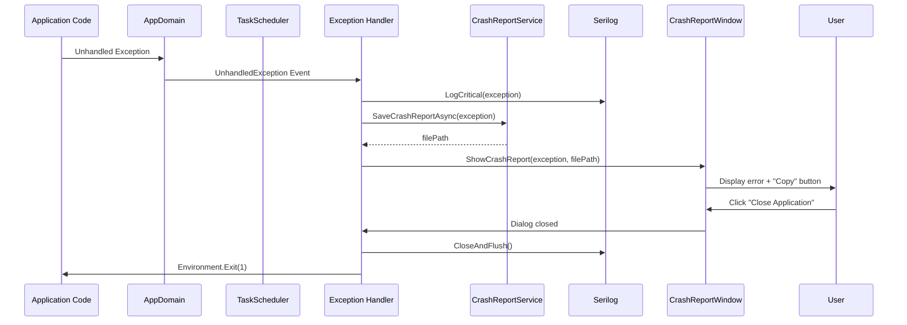

# LCS-DES-003c: Global Exception Trap

## 1. Metadata & Categorization

| Field                | Value                                | Description                                  |
| :------------------- | :----------------------------------- | :------------------------------------------- |
| **Feature ID**       | `INF-003c`                           | Infrastructure - Global Exception Handling   |
| **Feature Name**     | Global Exception Trap                | Crash Report dialog and exception persistence |
| **Target Version**   | `v0.0.3c`                            | Third sub-part of v0.0.3                     |
| **Module Scope**     | `Lexichord.Host`                     | Primary application executable               |
| **Swimlane**         | `Infrastructure`                     | The Podium (Platform)                        |
| **License Tier**     | `Core`                               | Foundation (Required for all tiers)          |
| **Author**           | System Architect                     |                                              |
| **Status**           | **Draft**                            | Pending implementation                       |
| **Last Updated**     | 2026-01-26                           |                                              |

---

## 2. Executive Summary

### 2.1 The Requirement

When an unhandled exception occurs, the application currently crashes without:

- Providing useful information to the user.
- Saving diagnostic data for support tickets.
- Ensuring logs are flushed before termination.

This creates a poor user experience and makes bug reports difficult to act upon.

### 2.2 The Proposed Solution

We **SHALL** implement a comprehensive exception handling system:

1. **Exception Handlers** — Subscribe to AppDomain and TaskScheduler events.
2. **Crash Report Service** — Save detailed crash reports to disk.
3. **Crash Report Dialog** — Display user-friendly error information with copy functionality.
4. **Graceful Shutdown** — Ensure logs are flushed and resources are released.

---

## 3. Architecture

### 3.1 Exception Flow Diagram



---

## 4. Implementation Tasks

### Task 1.1: Exception Handlers

**File:** `src/Lexichord.Host/App.axaml.cs` (Add to OnFrameworkInitializationCompleted)

```csharp
private void RegisterExceptionHandlers()
{
    var crashService = _services!.GetRequiredService<ICrashReportService>();
    var logger = _services.GetRequiredService<ILogger<App>>();

    // LOGIC: AppDomain.UnhandledException captures exceptions on any thread
    // that are not caught by any handler. IsTerminating indicates if the
    // CLR is about to terminate the process.
    AppDomain.CurrentDomain.UnhandledException += (sender, e) =>
    {
        var exception = e.ExceptionObject as Exception
            ?? new Exception($"Unknown exception object: {e.ExceptionObject}");

        logger.LogCritical(exception,
            "Unhandled domain exception. IsTerminating: {IsTerminating}",
            e.IsTerminating);

        if (e.IsTerminating)
        {
            // LOGIC: If CLR is terminating, show crash dialog
            // This gives user a chance to copy the report
            crashService.ShowCrashReport(exception);
        }
    };

    // LOGIC: TaskScheduler.UnobservedTaskException captures exceptions from
    // Tasks that were never awaited or had their exceptions checked.
    // We mark them as observed to prevent process termination.
    TaskScheduler.UnobservedTaskException += (sender, e) =>
    {
        logger.LogError(e.Exception, "Unobserved task exception");

        // LOGIC: Mark as observed to prevent CLR from terminating
        // The exception is logged but we don't crash for unobserved tasks
        e.SetObserved();
    };

    logger.LogDebug("Global exception handlers registered");
}
```

---

### Task 1.2: Crash Report Dialog

**File:** `src/Lexichord.Host/Views/CrashReportWindow.axaml`

```xml
<Window xmlns="https://github.com/avaloniaui"
        xmlns:x="http://schemas.microsoft.com/winfx/2006/xaml"
        x:Class="Lexichord.Host.Views.CrashReportWindow"
        Title="Lexichord - Crash Report"
        Width="700" Height="500"
        MinWidth="500" MinHeight="400"
        WindowStartupLocation="CenterScreen"
        CanResize="True"
        ShowInTaskbar="True"
        SystemDecorations="Full">

    <!--
    ═══════════════════════════════════════════════════════════════════
    CRASH REPORT DIALOG
    Displays exception details with copy-to-clipboard functionality.
    The user can copy the report for support tickets.
    ═══════════════════════════════════════════════════════════════════
    -->

    <Grid RowDefinitions="Auto,*,Auto" Margin="20">
        <!-- Header -->
        <StackPanel Grid.Row="0" Spacing="10" Margin="0,0,0,15">
            <TextBlock Text="An unexpected error occurred"
                       FontSize="20"
                       FontWeight="SemiBold"
                       Foreground="{DynamicResource SystemFillColorCriticalBrush}" />
            <TextBlock Text="Lexichord encountered a problem and needs to close. We apologize for the inconvenience."
                       TextWrapping="Wrap"
                       Foreground="{DynamicResource TextFillColorSecondaryBrush}" />
            <TextBlock x:Name="ReportPathText"
                       Text="Crash report saved to: [path]"
                       FontSize="12"
                       Foreground="{DynamicResource TextFillColorTertiaryBrush}" />
        </StackPanel>

        <!-- Exception Details -->
        <Border Grid.Row="1"
                Background="{DynamicResource CardBackgroundFillColorDefaultBrush}"
                BorderBrush="{DynamicResource CardStrokeColorDefaultBrush}"
                BorderThickness="1"
                CornerRadius="4"
                Padding="10">
            <ScrollViewer HorizontalScrollBarVisibility="Auto"
                          VerticalScrollBarVisibility="Auto">
                <TextBox x:Name="ExceptionDetails"
                         IsReadOnly="True"
                         AcceptsReturn="True"
                         TextWrapping="Wrap"
                         FontFamily="Consolas, Monaco, 'Courier New', monospace"
                         FontSize="12"
                         Background="Transparent"
                         BorderThickness="0" />
            </ScrollViewer>
        </Border>

        <!-- Buttons -->
        <StackPanel Grid.Row="2"
                    Orientation="Horizontal"
                    HorizontalAlignment="Right"
                    Spacing="10"
                    Margin="0,15,0,0">
            <Button x:Name="CopyButton"
                    Content="Copy to Clipboard"
                    Click="OnCopyClicked"
                    Width="140" />
            <Button x:Name="OpenFolderButton"
                    Content="Open Reports Folder"
                    Click="OnOpenFolderClicked"
                    Width="150" />
            <Button x:Name="CloseButton"
                    Content="Close Application"
                    Click="OnCloseClicked"
                    Classes="accent"
                    Width="140" />
        </StackPanel>
    </Grid>
</Window>
```

**File:** `src/Lexichord.Host/Views/CrashReportWindow.axaml.cs`

```csharp
using Avalonia.Controls;
using Avalonia.Interactivity;
using System;
using System.Diagnostics;
using System.IO;
using System.Runtime.InteropServices;

namespace Lexichord.Host.Views;

/// <summary>
/// Window that displays crash report details to the user.
/// </summary>
/// <remarks>
/// LOGIC: This window is shown when an unhandled exception occurs.
/// It provides:
/// - Exception type, message, and stack trace
/// - Copy to clipboard functionality for support tickets
/// - Link to open the crash reports folder
/// - Clean application exit
/// </remarks>
public partial class CrashReportWindow : Window
{
    private readonly string _reportPath;
    private readonly string _reportContent;

    /// <summary>
    /// Initializes a new CrashReportWindow with exception details.
    /// </summary>
    /// <param name="exception">The exception that caused the crash.</param>
    /// <param name="reportPath">The file path where the crash report was saved.</param>
    public CrashReportWindow(Exception exception, string reportPath)
    {
        InitializeComponent();

        _reportPath = reportPath;
        _reportContent = FormatExceptionReport(exception);

        ReportPathText.Text = $"Crash report saved to: {reportPath}";
        ExceptionDetails.Text = _reportContent;
    }

    /// <summary>
    /// Formats the exception into a user-readable report.
    /// </summary>
    private static string FormatExceptionReport(Exception exception)
    {
        return $"""
            ══════════════════════════════════════════════════════════════
            EXCEPTION TYPE
            ══════════════════════════════════════════════════════════════
            {exception.GetType().FullName}

            ══════════════════════════════════════════════════════════════
            MESSAGE
            ══════════════════════════════════════════════════════════════
            {exception.Message}

            ══════════════════════════════════════════════════════════════
            STACK TRACE
            ══════════════════════════════════════════════════════════════
            {exception.StackTrace ?? "(no stack trace available)"}

            {FormatInnerExceptions(exception)}
            """;
    }

    /// <summary>
    /// Formats inner exceptions recursively.
    /// </summary>
    private static string FormatInnerExceptions(Exception exception)
    {
        if (exception.InnerException is null)
            return string.Empty;

        var result = new System.Text.StringBuilder();
        var inner = exception.InnerException;
        var depth = 1;

        while (inner is not null)
        {
            result.AppendLine($"""

                ══════════════════════════════════════════════════════════════
                INNER EXCEPTION #{depth}
                ══════════════════════════════════════════════════════════════
                Type: {inner.GetType().FullName}
                Message: {inner.Message}
                Stack Trace:
                {inner.StackTrace ?? "(no stack trace available)"}
                """);

            inner = inner.InnerException;
            depth++;
        }

        return result.ToString();
    }

    /// <summary>
    /// Handles the Copy to Clipboard button click.
    /// </summary>
    private async void OnCopyClicked(object sender, RoutedEventArgs e)
    {
        var clipboard = TopLevel.GetTopLevel(this)?.Clipboard;
        if (clipboard is not null)
        {
            await clipboard.SetTextAsync(_reportContent);

            // LOGIC: Provide visual feedback that copy succeeded
            var button = (Button)sender;
            var originalContent = button.Content;
            button.Content = "Copied!";
            button.IsEnabled = false;

            await System.Threading.Tasks.Task.Delay(1500);

            button.Content = originalContent;
            button.IsEnabled = true;
        }
    }

    /// <summary>
    /// Handles the Open Reports Folder button click.
    /// </summary>
    private void OnOpenFolderClicked(object sender, RoutedEventArgs e)
    {
        var folderPath = Path.GetDirectoryName(_reportPath);
        if (folderPath is null) return;

        // LOGIC: Open folder in platform-appropriate file manager
        try
        {
            if (RuntimeInformation.IsOSPlatform(OSPlatform.Windows))
            {
                Process.Start("explorer.exe", folderPath);
            }
            else if (RuntimeInformation.IsOSPlatform(OSPlatform.OSX))
            {
                Process.Start("open", folderPath);
            }
            else if (RuntimeInformation.IsOSPlatform(OSPlatform.Linux))
            {
                Process.Start("xdg-open", folderPath);
            }
        }
        catch
        {
            // LOGIC: Silently fail if we can't open the folder
            // The path is displayed in the dialog anyway
        }
    }

    /// <summary>
    /// Handles the Close Application button click.
    /// </summary>
    private void OnCloseClicked(object sender, RoutedEventArgs e)
    {
        // LOGIC: Close the dialog, which will allow the exception
        // handler to proceed with application termination
        Close();
    }
}
```

---

### Task 1.3: Crash Report Service

**File:** `src/Lexichord.Abstractions/Contracts/ICrashReportService.cs`

```csharp
namespace Lexichord.Abstractions.Contracts;

/// <summary>
/// Service for displaying and persisting crash reports.
/// </summary>
/// <remarks>
/// LOGIC: Crash reports are saved to disk first, then displayed to the user.
/// This ensures data capture even if the UI fails to display.
/// </remarks>
public interface ICrashReportService
{
    /// <summary>
    /// Displays the crash report dialog to the user.
    /// </summary>
    /// <param name="exception">The exception that caused the crash.</param>
    /// <remarks>
    /// This method should be called from the UI thread if possible.
    /// If the dialog cannot be shown, the report is still saved to disk.
    /// </remarks>
    void ShowCrashReport(Exception exception);

    /// <summary>
    /// Saves a crash report to disk without displaying a dialog.
    /// </summary>
    /// <param name="exception">The exception to save.</param>
    /// <returns>The file path where the report was saved.</returns>
    Task<string> SaveCrashReportAsync(Exception exception);

    /// <summary>
    /// Gets the directory where crash reports are stored.
    /// </summary>
    string CrashReportDirectory { get; }
}
```

**File:** `src/Lexichord.Host/Services/CrashReportService.cs`

```csharp
using Lexichord.Abstractions.Contracts;
using Lexichord.Host.Views;
using Microsoft.Extensions.Logging;
using System;
using System.IO;
using System.Reflection;
using System.Threading.Tasks;

namespace Lexichord.Host.Services;

/// <summary>
/// Service for displaying and persisting crash reports.
/// </summary>
/// <remarks>
/// LOGIC: When an unhandled exception occurs:
/// 1. Save the crash report to disk immediately (ensure data capture)
/// 2. Attempt to show the crash dialog (best effort)
/// 3. Log all details to Serilog before any UI interaction
///
/// File location follows platform conventions:
/// - Windows: %APPDATA%/Lexichord/CrashReports/
/// - macOS: ~/Library/Application Support/Lexichord/CrashReports/
/// - Linux: ~/.config/Lexichord/CrashReports/
/// </remarks>
public sealed class CrashReportService : ICrashReportService
{
    private readonly ILogger<CrashReportService> _logger;
    private readonly string _crashReportDir;

    /// <summary>
    /// Initializes a new instance of CrashReportService.
    /// </summary>
    /// <param name="logger">The logger instance.</param>
    public CrashReportService(ILogger<CrashReportService> logger)
        : this(logger, null)
    {
    }

    /// <summary>
    /// Initializes a new instance with a custom crash report directory (for testing).
    /// </summary>
    internal CrashReportService(ILogger<CrashReportService> logger, string? customPath)
    {
        _logger = logger;
        var appData = Environment.GetFolderPath(Environment.SpecialFolder.ApplicationData);
        _crashReportDir = customPath ?? Path.Combine(appData, "Lexichord", "CrashReports");
        Directory.CreateDirectory(_crashReportDir);
    }

    /// <inheritdoc/>
    public string CrashReportDirectory => _crashReportDir;

    /// <inheritdoc/>
    public void ShowCrashReport(Exception exception)
    {
        _logger.LogCritical(exception, "Crash report requested for exception: {ExceptionType}",
            exception.GetType().Name);

        try
        {
            // LOGIC: Save to disk first, before attempting UI
            // This ensures we capture the report even if dialog fails
            var reportPath = SaveCrashReportAsync(exception).GetAwaiter().GetResult();
            _logger.LogInformation("Crash report saved to {Path}", reportPath);

            // Attempt to show dialog (may fail if UI thread is dead)
            var dialog = new CrashReportWindow(exception, reportPath);
            dialog.ShowDialog(null);
        }
        catch (Exception dialogEx)
        {
            // LOGIC: Dialog failed, but we've already saved the report
            _logger.LogError(dialogEx, "Failed to show crash dialog, report saved to disk");
        }
    }

    /// <inheritdoc/>
    public async Task<string> SaveCrashReportAsync(Exception exception)
    {
        var timestamp = DateTime.UtcNow.ToString("yyyy-MM-dd_HH-mm-ss-fff");
        var fileName = $"crash-{timestamp}.log";
        var filePath = Path.Combine(_crashReportDir, fileName);

        var version = Assembly.GetExecutingAssembly().GetName().Version?.ToString() ?? "unknown";

        var report = $"""
            ════════════════════════════════════════════════════════════════
            LEXICHORD CRASH REPORT
            ════════════════════════════════════════════════════════════════

            Timestamp (UTC): {DateTime.UtcNow:yyyy-MM-dd HH:mm:ss.fff}
            Application Version: {version}
            OS: {Environment.OSVersion}
            .NET Version: {Environment.Version}
            Machine: {Environment.MachineName}
            64-bit OS: {Environment.Is64BitOperatingSystem}
            64-bit Process: {Environment.Is64BitProcess}
            Working Set: {Environment.WorkingSet / 1024 / 1024} MB
            Processor Count: {Environment.ProcessorCount}

            ════════════════════════════════════════════════════════════════
            EXCEPTION DETAILS
            ════════════════════════════════════════════════════════════════

            Type: {exception.GetType().FullName}
            Message: {exception.Message}
            Source: {exception.Source}
            HResult: 0x{exception.HResult:X8}

            ════════════════════════════════════════════════════════════════
            STACK TRACE
            ════════════════════════════════════════════════════════════════

            {exception.StackTrace ?? "(no stack trace available)"}

            ════════════════════════════════════════════════════════════════
            INNER EXCEPTION(S)
            ════════════════════════════════════════════════════════════════

            {GetInnerExceptionDetails(exception)}

            ════════════════════════════════════════════════════════════════
            ADDITIONAL DATA
            ════════════════════════════════════════════════════════════════

            {GetExceptionData(exception)}

            ════════════════════════════════════════════════════════════════
            END OF REPORT
            ════════════════════════════════════════════════════════════════
            """;

        await File.WriteAllTextAsync(filePath, report);
        _logger.LogDebug("Crash report written to {FilePath}", filePath);

        return filePath;
    }

    /// <summary>
    /// Formats inner exceptions recursively.
    /// </summary>
    private static string GetInnerExceptionDetails(Exception exception)
    {
        var inner = exception.InnerException;
        if (inner is null)
            return "(none)";

        var details = new System.Text.StringBuilder();
        var depth = 1;

        while (inner is not null)
        {
            details.AppendLine($"""
                [Inner Exception {depth}]
                Type: {inner.GetType().FullName}
                Message: {inner.Message}
                Source: {inner.Source}
                Stack Trace:
                {inner.StackTrace ?? "(no stack trace available)"}

                """);

            inner = inner.InnerException;
            depth++;
        }

        return details.ToString();
    }

    /// <summary>
    /// Formats exception Data dictionary.
    /// </summary>
    private static string GetExceptionData(Exception exception)
    {
        if (exception.Data.Count == 0)
            return "(none)";

        var data = new System.Text.StringBuilder();
        foreach (var key in exception.Data.Keys)
        {
            data.AppendLine($"  {key}: {exception.Data[key]}");
        }

        return data.ToString();
    }
}
```

---

### Task 1.4: Graceful Shutdown

**File:** `src/Lexichord.Host/Program.cs` (Ensure proper shutdown)

```csharp
[STAThread]
public static int Main(string[] args)
{
    // Bootstrap logger...

    try
    {
        Log.Information("Starting Lexichord application");
        BuildAvaloniaApp().StartWithClassicDesktopLifetime(args);
        Log.Information("Lexichord application shutdown complete");
        return 0;
    }
    catch (Exception ex)
    {
        Log.Fatal(ex, "Lexichord application terminated unexpectedly");
        return 1;
    }
    finally
    {
        // LOGIC: CRITICAL - Ensure all log entries are written before process exits
        // This must happen regardless of how the application terminates
        Log.CloseAndFlush();
    }
}
```

---

## 5. Decision Tree: Exception Handling Strategy

```text
START: "An exception occurred. What do I do?"
│
├── Is it caught by application code?
│   └── Handle appropriately in the catch block
│       - Log the exception
│       - Show user-friendly error message if applicable
│       - Continue or gracefully degrade
│
├── Is it an unobserved Task exception?
│   └── TaskScheduler.UnobservedTaskException fires
│       - Log as Error
│       - Mark as Observed (prevent termination)
│       - Application continues running
│
├── Is it an unhandled exception on any thread?
│   └── AppDomain.UnhandledException fires
│       - Log as Critical
│       ├── IsTerminating == false?
│       │   └── Log and continue (rare on desktop)
│       └── IsTerminating == true?
│           └── Save crash report → Show dialog → Exit(1)
│
└── Is it during startup (before handlers registered)?
    └── Caught by Program.Main() catch block
        - Log as Fatal
        - Return exit code 1
        - CloseAndFlush in finally
```

---

## 6. Unit Testing Requirements

### 6.1 CrashReportService Tests

```csharp
[TestFixture]
[Category("Unit")]
public class CrashReportServiceTests
{
    private CrashReportService _sut = null!;
    private Mock<ILogger<CrashReportService>> _mockLogger = null!;
    private string _tempDir = null!;

    [SetUp]
    public void SetUp()
    {
        _mockLogger = new Mock<ILogger<CrashReportService>>();
        _tempDir = Path.Combine(Path.GetTempPath(), Guid.NewGuid().ToString());
        Directory.CreateDirectory(_tempDir);
        _sut = new CrashReportService(_mockLogger.Object, _tempDir);
    }

    [TearDown]
    public void TearDown()
    {
        if (Directory.Exists(_tempDir))
            Directory.Delete(_tempDir, recursive: true);
    }

    [Test]
    public async Task SaveCrashReportAsync_CreatesFile()
    {
        // Arrange
        var exception = new InvalidOperationException("Test exception");

        // Act
        var filePath = await _sut.SaveCrashReportAsync(exception);

        // Assert
        Assert.That(File.Exists(filePath), Is.True);
    }

    [Test]
    public async Task SaveCrashReportAsync_ContainsExceptionType()
    {
        // Arrange
        var exception = new ArgumentNullException("paramName", "Test message");

        // Act
        var filePath = await _sut.SaveCrashReportAsync(exception);
        var content = await File.ReadAllTextAsync(filePath);

        // Assert
        Assert.That(content, Does.Contain("ArgumentNullException"));
        Assert.That(content, Does.Contain("Test message"));
        Assert.That(content, Does.Contain("paramName"));
    }

    [Test]
    public async Task SaveCrashReportAsync_ContainsStackTrace()
    {
        // Arrange
        Exception? exception = null;
        try
        {
            ThrowException();
        }
        catch (Exception ex)
        {
            exception = ex;
        }

        // Act
        var filePath = await _sut.SaveCrashReportAsync(exception!);
        var content = await File.ReadAllTextAsync(filePath);

        // Assert
        Assert.That(content, Does.Contain("ThrowException"));
        Assert.That(content, Does.Contain("STACK TRACE"));
    }

    [Test]
    public async Task SaveCrashReportAsync_IncludesInnerException()
    {
        // Arrange
        var inner = new ArgumentNullException("innerParam");
        var outer = new InvalidOperationException("Outer message", inner);

        // Act
        var filePath = await _sut.SaveCrashReportAsync(outer);
        var content = await File.ReadAllTextAsync(filePath);

        // Assert
        Assert.That(content, Does.Contain("INNER EXCEPTION"));
        Assert.That(content, Does.Contain("ArgumentNullException"));
        Assert.That(content, Does.Contain("innerParam"));
    }

    [Test]
    public async Task SaveCrashReportAsync_IncludesSystemInfo()
    {
        // Arrange
        var exception = new Exception("Test");

        // Act
        var filePath = await _sut.SaveCrashReportAsync(exception);
        var content = await File.ReadAllTextAsync(filePath);

        // Assert
        Assert.That(content, Does.Contain("OS:"));
        Assert.That(content, Does.Contain(".NET Version:"));
        Assert.That(content, Does.Contain("Machine:"));
    }

    [Test]
    public void CrashReportDirectory_ReturnsConfiguredPath()
    {
        // Assert
        Assert.That(_sut.CrashReportDirectory, Is.EqualTo(_tempDir));
    }

    [Test]
    public async Task SaveCrashReportAsync_CreatesUniqueFilenames()
    {
        // Arrange
        var exception = new Exception("Test");

        // Act
        var path1 = await _sut.SaveCrashReportAsync(exception);
        await Task.Delay(10); // Ensure different timestamp
        var path2 = await _sut.SaveCrashReportAsync(exception);

        // Assert
        Assert.That(path1, Is.Not.EqualTo(path2));
        Assert.That(File.Exists(path1), Is.True);
        Assert.That(File.Exists(path2), Is.True);
    }

    private static void ThrowException()
    {
        throw new InvalidOperationException("Test exception with stack trace");
    }
}
```

---

## 7. Observability & Logging

| Level    | Context            | Message Template                                                  |
| :------- | :----------------- | :---------------------------------------------------------------- |
| Critical | App                | `Unhandled domain exception. IsTerminating: {IsTerminating}`      |
| Error    | App                | `Unobserved task exception`                                       |
| Debug    | App                | `Global exception handlers registered`                            |
| Critical | CrashReportService | `Crash report requested for exception: {ExceptionType}`           |
| Information | CrashReportService | `Crash report saved to {Path}`                                 |
| Debug    | CrashReportService | `Crash report written to {FilePath}`                              |
| Error    | CrashReportService | `Failed to show crash dialog, report saved to disk`               |

---

## 8. Security & Safety

### 8.1 Information Disclosure

> [!NOTE]
> Crash reports include:
> - Full stack traces (may reveal internal code structure)
> - System information (OS version, machine name)
> - .NET version and process details
>
> This is acceptable for desktop applications where users have access to binaries.
> No user credentials, API keys, or PII should ever appear in crash reports.

### 8.2 File System Safety

Crash reports are written to the user's application data directory with default permissions. The directory is created if it doesn't exist.

---

## 9. Definition of Done

- [ ] `ICrashReportService` interface defined in Abstractions
- [ ] `CrashReportService` implementation in Host
- [ ] `CrashReportWindow.axaml` created with exception display
- [ ] `CrashReportWindow.axaml.cs` code-behind with button handlers
- [ ] "Copy to Clipboard" button copies full crash report
- [ ] "Open Reports Folder" button opens platform file manager
- [ ] "Close Application" button closes dialog and allows exit
- [ ] `AppDomain.UnhandledException` handler registered in App.axaml.cs
- [ ] `TaskScheduler.UnobservedTaskException` handler registered
- [ ] Crash reports saved to `{AppData}/Lexichord/CrashReports/`
- [ ] Crash report includes: exception type, message, stack trace, inner exceptions, system info
- [ ] `Log.CloseAndFlush()` called in Program.Main finally block
- [ ] Unit tests for CrashReportService passing

---

## 10. Verification Commands

```bash
# Build the application
dotnet build src/Lexichord.Host

# Run unit tests
dotnet test --filter "FullyQualifiedName~CrashReportServiceTests"

# Manual test: Trigger crash dialog
# Add temporary code to throw exception on button click
# Verify dialog appears with full crash report

# Verify crash report directory
# Windows:
dir "%APPDATA%\Lexichord\CrashReports"
# macOS/Linux:
ls -la ~/.config/Lexichord/CrashReports/

# View a crash report
# macOS/Linux:
cat ~/.config/Lexichord/CrashReports/crash-*.log | head -50
```
