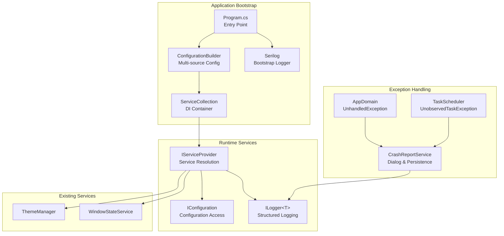

# LCS-01: Feature Design Composition

## 1. Metadata & Categorization

| Field                | Value                                    | Description                                           |
| :------------------- | :--------------------------------------- | :---------------------------------------------------- |
| **Feature ID**       | `INF-003`                                | Infrastructure - Nervous System (Logging & DI)        |
| **Feature Name**     | Logging, DI, Exception Handling & Config | Core runtime infrastructure for observability.        |
| **Target Version**   | `v0.0.3`                                 | Core Services Foundation Layer.                       |
| **Module Scope**     | `Lexichord.Host` / `Lexichord.Abstractions` | Primary application infrastructure.                |
| **Swimlane**         | `Infrastructure`                         | The Podium (Platform).                                |
| **License Tier**     | `Core`                                   | Foundation (Required for all tiers).                  |
| **Feature Gate Key** | N/A                                      | No runtime gating for infrastructure services.        |
| **Author**           | System Architect                         |                                                       |
| **Status**           | **Draft**                                | Pending approval.                                     |
| **Last Updated**     | 2026-01-26                               |                                                       |

---

## 2. Executive Summary

### 2.1 The Requirement

Lexichord requires a **robust runtime infrastructure** that:

- Provides dependency injection for loose coupling and testability.
- Captures structured logs for debugging, auditing, and troubleshooting.
- Handles unhandled exceptions gracefully with user-friendly crash reporting.
- Loads configuration from multiple sources with proper precedence.

Without this foundation:

- Services cannot be injected or mocked for testing.
- Production bugs are impossible to diagnose.
- Application crashes provide no actionable information.
- Module loading (v0.0.4) cannot register services.

### 2.2 The Proposed Solution

We **SHALL** implement a complete runtime infrastructure with:

1. **v0.0.3a: Dependency Injection Root** — Microsoft.Extensions.DependencyInjection as the IoC container.
2. **v0.0.3b: Serilog Pipeline** — Structured logging with Console and File sinks.
3. **v0.0.3c: Global Exception Trap** — Crash Report dialog and exception persistence.
4. **v0.0.3d: Configuration Service** — Multi-source configuration with options pattern.

---

## 3. Architecture & Modular Strategy

### 3.1 High-Level Architecture



### 3.2 Dependencies

- **NuGet Packages:**

| Package                                        | Version | Purpose                                  |
| :--------------------------------------------- | :------ | :--------------------------------------- |
| `Microsoft.Extensions.DependencyInjection`     | 9.0.x   | IoC container                            |
| `Microsoft.Extensions.Hosting.Abstractions`    | 9.0.x   | Host environment abstractions            |
| `Microsoft.Extensions.Configuration`           | 9.0.x   | Configuration core                       |
| `Microsoft.Extensions.Configuration.Json`      | 9.0.x   | JSON file configuration                  |
| `Microsoft.Extensions.Configuration.EnvironmentVariables` | 9.0.x | Environment variable configuration |
| `Microsoft.Extensions.Configuration.CommandLine` | 9.0.x | CLI argument configuration              |
| `Microsoft.Extensions.Options`                 | 9.0.x   | Options pattern                          |
| `Serilog`                                      | 4.x     | Structured logging                       |
| `Serilog.Extensions.Logging`                   | 9.x     | Microsoft.Extensions.Logging integration |
| `Serilog.Sinks.Console`                        | 6.x     | Console output sink                      |
| `Serilog.Sinks.File`                           | 6.x     | Rolling file sink                        |
| `Serilog.Enrichers.Thread`                     | 4.x     | Thread ID enricher                       |
| `Serilog.Enrichers.Environment`                | 3.x     | Machine name enricher                    |

- **Project References:**

| Project                  | Reference Direction        |
| :----------------------- | :------------------------- |
| `Lexichord.Host`         | → `Lexichord.Abstractions` |
| `Lexichord.Abstractions` | (No references)            |

### 3.3 Licensing Behavior

- **N/A:** Infrastructure services are Core foundation required by all license tiers.

---

## 4. Decision Tree: Service Resolution

```text
START: "How do I get a service instance?"
│
├── Is this a View/Window that needs services?
│   ├── Can use constructor injection?
│   │   └── YES → Inject via primary constructor
│   │       public MainWindow(IThemeManager theme, ILogger<MainWindow> logger)
│   │
│   └── Cannot use constructor (XAML instantiation)?
│       └── Use App.Current.Services.GetRequiredService<T>()
│           // Mark as transitional, migrate to proper DI later
│
├── Is this a Service/ViewModel?
│   └── ALWAYS use constructor injection
│       public class MyService(ILogger<MyService> logger, IOtherService other)
│
├── Is this a static utility method?
│   └── Services MUST be passed as parameters
│       public static void DoWork(ILogger logger, IConfig config)
│       // Never resolve services inside static methods
│
└── Is this during application startup (before DI)?
    └── Use bootstrap logger only
        Log.Logger.Information("Starting up...");
```

---

## 5. Data Contracts

### 5.1 Interfaces (Lexichord.Abstractions)

```csharp
namespace Lexichord.Abstractions.Contracts;

/// <summary>
/// Application-wide configuration options for Lexichord.
/// </summary>
/// <remarks>
/// LOGIC: These options are loaded from appsettings.json, environment variables,
/// and command-line arguments. CLI args take highest precedence.
/// </remarks>
public record LexichordOptions
{
    /// <summary>
    /// Application display name shown in title bars and dialogs.
    /// </summary>
    public string ApplicationName { get; init; } = "Lexichord";

    /// <summary>
    /// Current environment (Development, Staging, Production).
    /// </summary>
    public string Environment { get; init; } = "Production";

    /// <summary>
    /// Base path for application data storage.
    /// </summary>
    /// <remarks>
    /// Defaults to {AppData}/Lexichord on all platforms.
    /// </remarks>
    public string? DataPath { get; init; }

    /// <summary>
    /// Enable verbose debug logging regardless of environment.
    /// </summary>
    public bool DebugMode { get; init; }
}

/// <summary>
/// Debug-specific options for development and troubleshooting.
/// </summary>
public record DebugOptions
{
    /// <summary>
    /// Show Avalonia DevTools window on startup.
    /// </summary>
    public bool ShowDevTools { get; init; }

    /// <summary>
    /// Enable performance timing logs for all service methods.
    /// </summary>
    public bool EnablePerformanceLogging { get; init; }

    /// <summary>
    /// Simulate slow network for testing loading states.
    /// </summary>
    public int SimulatedNetworkDelayMs { get; init; }
}

/// <summary>
/// Service for displaying and persisting crash reports.
/// </summary>
/// <remarks>
/// LOGIC: Crash reports are saved to disk first, then displayed to the user.
/// This ensures data capture even if the UI fails to display.
/// </remarks>
public interface ICrashReportService
{
    /// <summary>
    /// Displays the crash report dialog to the user.
    /// </summary>
    /// <param name="exception">The exception that caused the crash.</param>
    /// <remarks>
    /// This method should be called from the UI thread.
    /// If the dialog cannot be shown, the report is still saved to disk.
    /// </remarks>
    void ShowCrashReport(Exception exception);

    /// <summary>
    /// Saves a crash report to disk without displaying a dialog.
    /// </summary>
    /// <param name="exception">The exception to save.</param>
    /// <returns>The file path where the report was saved.</returns>
    Task<string> SaveCrashReportAsync(Exception exception);

    /// <summary>
    /// Gets the directory where crash reports are stored.
    /// </summary>
    string CrashReportDirectory { get; }
}

/// <summary>
/// Provides access to application services for components that cannot use constructor injection.
/// </summary>
/// <remarks>
/// IMPORTANT: This is a transitional pattern. Prefer constructor injection where possible.
/// This interface is marked obsolete to encourage migration to proper DI patterns.
/// </remarks>
[Obsolete("Use constructor injection where possible. This is for XAML-instantiated components only.")]
public interface IServiceLocator
{
    /// <summary>
    /// Gets a service of the specified type.
    /// </summary>
    /// <typeparam name="T">The service type to resolve.</typeparam>
    /// <returns>The resolved service instance.</returns>
    /// <exception cref="InvalidOperationException">Service not registered.</exception>
    T GetRequiredService<T>() where T : notnull;

    /// <summary>
    /// Gets a service of the specified type, or null if not registered.
    /// </summary>
    /// <typeparam name="T">The service type to resolve.</typeparam>
    /// <returns>The resolved service instance, or null.</returns>
    T? GetService<T>() where T : class;
}
```

### 5.2 Lexichord.Host.csproj Updates

```xml
<Project Sdk="Microsoft.NET.Sdk">

  <PropertyGroup>
    <OutputType>WinExe</OutputType>
    <BuiltInComInteropSupport>true</BuiltInComInteropSupport>
    <ApplicationManifest>app.manifest</ApplicationManifest>
    <AvaloniaUseCompiledBindingsByDefault>true</AvaloniaUseCompiledBindingsByDefault>
  </PropertyGroup>

  <ItemGroup>
    <!-- Avalonia Framework -->
    <PackageReference Include="Avalonia" Version="11.2.3" />
    <PackageReference Include="Avalonia.Desktop" Version="11.2.3" />
    <PackageReference Include="Avalonia.Themes.Fluent" Version="11.2.3" />
    <PackageReference Include="Avalonia.Fonts.Inter" Version="11.2.3" />
    <PackageReference Condition="'$(Configuration)' == 'Debug'" Include="Avalonia.Diagnostics" Version="11.2.3" />

    <!-- Dependency Injection -->
    <PackageReference Include="Microsoft.Extensions.DependencyInjection" Version="9.0.0" />
    <PackageReference Include="Microsoft.Extensions.Hosting.Abstractions" Version="9.0.0" />

    <!-- Configuration -->
    <PackageReference Include="Microsoft.Extensions.Configuration" Version="9.0.0" />
    <PackageReference Include="Microsoft.Extensions.Configuration.Json" Version="9.0.0" />
    <PackageReference Include="Microsoft.Extensions.Configuration.EnvironmentVariables" Version="9.0.0" />
    <PackageReference Include="Microsoft.Extensions.Configuration.CommandLine" Version="9.0.0" />
    <PackageReference Include="Microsoft.Extensions.Options" Version="9.0.0" />
    <PackageReference Include="Microsoft.Extensions.Options.ConfigurationExtensions" Version="9.0.0" />

    <!-- Logging -->
    <PackageReference Include="Serilog" Version="4.2.0" />
    <PackageReference Include="Serilog.Extensions.Logging" Version="9.0.0" />
    <PackageReference Include="Serilog.Sinks.Console" Version="6.0.0" />
    <PackageReference Include="Serilog.Sinks.File" Version="6.0.0" />
    <PackageReference Include="Serilog.Enrichers.Thread" Version="4.0.0" />
    <PackageReference Include="Serilog.Enrichers.Environment" Version="3.0.1" />
  </ItemGroup>

  <ItemGroup>
    <ProjectReference Include="..\Lexichord.Abstractions\Lexichord.Abstractions.csproj" />
  </ItemGroup>

  <!-- Configuration files -->
  <ItemGroup>
    <None Update="appsettings.json">
      <CopyToOutputDirectory>PreserveNewest</CopyToOutputDirectory>
    </None>
    <None Update="appsettings.Development.json">
      <CopyToOutputDirectory>PreserveNewest</CopyToOutputDirectory>
    </None>
  </ItemGroup>

</Project>
```

---

## 6. Implementation Logic

### 6.1 Program.cs (Entry Point with Bootstrap Logging)

```csharp
using Avalonia;
using Serilog;
using Serilog.Events;
using System;

namespace Lexichord.Host;

/// <summary>
/// Application entry point for Lexichord with bootstrap logging and exception handling.
/// </summary>
/// <remarks>
/// LOGIC: The entry point establishes a bootstrap logger before Avalonia initializes.
/// This captures any startup failures that occur before the full logging pipeline is ready.
/// The entire application lifecycle is wrapped in try/catch for global exception capture.
/// </remarks>
internal sealed class Program
{
    /// <summary>
    /// The main entry point for the application.
    /// </summary>
    /// <param name="args">Command-line arguments.</param>
    /// <returns>Exit code (0 = success, 1 = error).</returns>
    [STAThread]
    public static int Main(string[] args)
    {
        // LOGIC: Create bootstrap logger immediately for startup error capture
        // This minimal logger writes to console only until full configuration loads
        Log.Logger = new LoggerConfiguration()
            .MinimumLevel.Debug()
            .MinimumLevel.Override("Microsoft", LogEventLevel.Information)
            .MinimumLevel.Override("System", LogEventLevel.Warning)
            .WriteTo.Console(
                outputTemplate: "[{Timestamp:HH:mm:ss} {Level:u3}] {Message:lj}{NewLine}{Exception}")
            .CreateBootstrapLogger();

        try
        {
            Log.Information("Starting Lexichord application");
            Log.Debug("Command line arguments: {Args}", args);

            BuildAvaloniaApp()
                .StartWithClassicDesktopLifetime(args);

            Log.Information("Lexichord application shutdown complete");
            return 0;
        }
        catch (Exception ex)
        {
            Log.Fatal(ex, "Lexichord application terminated unexpectedly");
            return 1;
        }
        finally
        {
            // LOGIC: Ensure all log entries are written before process exits
            Log.CloseAndFlush();
        }
    }

    /// <summary>
    /// Builds the Avalonia application configuration.
    /// </summary>
    /// <returns>The configured AppBuilder instance.</returns>
    public static AppBuilder BuildAvaloniaApp()
        => AppBuilder.Configure<App>()
            .UsePlatformDetect()
            .WithInterFont()
            .LogToTrace();
}
```

### 6.2 HostServices.cs (Service Registration)

```csharp
using Microsoft.Extensions.Configuration;
using Microsoft.Extensions.DependencyInjection;
using Microsoft.Extensions.Logging;
using Serilog;
using Lexichord.Abstractions.Contracts;
using Lexichord.Host.Services;

namespace Lexichord.Host;

/// <summary>
/// Static helper for configuring Host services and DI container.
/// </summary>
/// <remarks>
/// LOGIC: All service registration is centralized here to provide a single source of truth
/// for the application's dependency graph. This enables easy testing and module integration.
/// </remarks>
public static class HostServices
{
    /// <summary>
    /// Configures all Host services in the DI container.
    /// </summary>
    /// <param name="services">The service collection to configure.</param>
    /// <param name="configuration">The application configuration.</param>
    /// <returns>The configured service collection for chaining.</returns>
    public static IServiceCollection ConfigureServices(
        this IServiceCollection services,
        IConfiguration configuration)
    {
        // LOGIC: Register configuration options using the Options pattern
        // This enables strongly-typed access to configuration sections
        services.Configure<LexichordOptions>(configuration.GetSection("Lexichord"));
        services.Configure<DebugOptions>(configuration.GetSection("Debug"));

        // LOGIC: Register Serilog as the logging provider
        // This replaces Microsoft.Extensions.Logging with Serilog
        services.AddLogging(builder =>
        {
            builder.ClearProviders();
            builder.AddSerilog(dispose: true);
        });

        // LOGIC: Register core Host services as Singletons
        // These services maintain state across the application lifetime
        services.AddSingleton<IThemeManager, ThemeManager>();
        services.AddSingleton<IWindowStateService, WindowStateService>();
        services.AddSingleton<ICrashReportService, CrashReportService>();

        // LOGIC: Register transitional service locator for XAML components
        // This will be removed once all Views support proper DI
        #pragma warning disable CS0618 // Intentionally using obsolete interface
        services.AddSingleton<IServiceLocator, ServiceLocator>();
        #pragma warning restore CS0618

        return services;
    }

    /// <summary>
    /// Builds the application configuration from multiple sources.
    /// </summary>
    /// <param name="args">Command-line arguments.</param>
    /// <returns>The built configuration.</returns>
    /// <remarks>
    /// LOGIC: Configuration sources are loaded in order of increasing precedence:
    /// 1. appsettings.json (base settings)
    /// 2. appsettings.{Environment}.json (environment overrides)
    /// 3. Environment variables (deployment overrides)
    /// 4. Command-line arguments (runtime overrides)
    /// </remarks>
    public static IConfiguration BuildConfiguration(string[] args)
    {
        var environment = Environment.GetEnvironmentVariable("LEXICHORD_ENVIRONMENT")
            ?? Environment.GetEnvironmentVariable("DOTNET_ENVIRONMENT")
            ?? "Production";

        return new ConfigurationBuilder()
            .SetBasePath(AppContext.BaseDirectory)
            .AddJsonFile("appsettings.json", optional: false, reloadOnChange: true)
            .AddJsonFile($"appsettings.{environment}.json", optional: true, reloadOnChange: true)
            .AddEnvironmentVariables(prefix: "LEXICHORD_")
            .AddCommandLine(args, new Dictionary<string, string>
            {
                { "--debug-mode", "Lexichord:DebugMode" },
                { "--log-level", "Serilog:MinimumLevel:Default" },
                { "--data-path", "Lexichord:DataPath" }
            })
            .Build();
    }
}
```

### 6.3 SerilogExtensions.cs (Full Logger Configuration)

```csharp
using Microsoft.Extensions.Configuration;
using Serilog;
using Serilog.Events;
using Serilog.Sinks.SystemConsole.Themes;
using System;
using System.IO;
using System.Reflection;

namespace Lexichord.Host.Extensions;

/// <summary>
/// Extension methods for configuring Serilog logging.
/// </summary>
public static class SerilogExtensions
{
    /// <summary>
    /// Configures the full Serilog pipeline from configuration.
    /// </summary>
    /// <param name="configuration">The application configuration.</param>
    /// <remarks>
    /// LOGIC: This method replaces the bootstrap logger with the full configuration.
    /// It sets up multiple sinks (Console, File, Error-only File) with appropriate
    /// output templates and rolling policies.
    /// </remarks>
    public static void ConfigureSerilog(IConfiguration configuration)
    {
        var appDataPath = Environment.GetFolderPath(Environment.SpecialFolder.ApplicationData);
        var logPath = Path.Combine(appDataPath, "Lexichord", "Logs");
        Directory.CreateDirectory(logPath);

        var version = Assembly.GetExecutingAssembly().GetName().Version?.ToString() ?? "0.0.0";
        var debugMode = configuration.GetValue<bool>("Lexichord:DebugMode");
        var minimumLevel = debugMode ? LogEventLevel.Debug : LogEventLevel.Information;

        Log.Logger = new LoggerConfiguration()
            // Minimum Levels
            .MinimumLevel.Is(minimumLevel)
            .MinimumLevel.Override("Microsoft", LogEventLevel.Warning)
            .MinimumLevel.Override("System", LogEventLevel.Warning)
            .MinimumLevel.Override("Avalonia", LogEventLevel.Warning)

            // Enrichers
            .Enrich.FromLogContext()
            .Enrich.WithMachineName()
            .Enrich.WithThreadId()
            .Enrich.WithProperty("Application", "Lexichord")
            .Enrich.WithProperty("Version", version)

            // Console Sink (Development)
            .WriteTo.Console(
                outputTemplate: "[{Timestamp:HH:mm:ss} {Level:u3}] {Message:lj} <{SourceContext}>{NewLine}{Exception}",
                theme: AnsiConsoleTheme.Code,
                restrictedToMinimumLevel: debugMode ? LogEventLevel.Debug : LogEventLevel.Information)

            // File Sink (Rolling daily)
            .WriteTo.File(
                path: Path.Combine(logPath, "lexichord-.log"),
                rollingInterval: RollingInterval.Day,
                retainedFileCountLimit: 30,
                fileSizeLimitBytes: 10_000_000, // 10 MB
                rollOnFileSizeLimit: true,
                outputTemplate: "{Timestamp:yyyy-MM-dd HH:mm:ss.fff zzz} [{Level:u3}] [{SourceContext}] {Message:lj}{NewLine}{Exception}",
                shared: true,
                flushToDiskInterval: TimeSpan.FromSeconds(1))

            // Error-only File Sink (Longer retention)
            .WriteTo.File(
                path: Path.Combine(logPath, "lexichord-errors-.log"),
                restrictedToMinimumLevel: LogEventLevel.Error,
                rollingInterval: RollingInterval.Day,
                retainedFileCountLimit: 90,
                outputTemplate: "{Timestamp:yyyy-MM-dd HH:mm:ss.fff zzz} [{Level:u3}] [{SourceContext}] {Message:lj}{NewLine}{Properties:j}{NewLine}{Exception}")

            .CreateLogger();

        Log.Information("Serilog configured. Log path: {LogPath}, Debug mode: {DebugMode}",
            logPath, debugMode);
    }
}
```

### 6.4 App.axaml.cs (Updated with DI)

```csharp
using Avalonia;
using Avalonia.Controls.ApplicationLifetimes;
using Avalonia.Markup.Xaml;
using Microsoft.Extensions.Configuration;
using Microsoft.Extensions.DependencyInjection;
using Microsoft.Extensions.Logging;
using Lexichord.Abstractions.Contracts;
using Lexichord.Host.Extensions;
using Lexichord.Host.Services;
using Lexichord.Host.Views;
using System;

namespace Lexichord.Host;

/// <summary>
/// The main Avalonia application class with DI integration.
/// </summary>
/// <remarks>
/// LOGIC: This class manages application lifecycle, DI container, and service initialization.
/// Services are built during OnFrameworkInitializationCompleted and stored for application-wide access.
/// </remarks>
public partial class App : Application
{
    private IServiceProvider? _services;
    private IConfiguration? _configuration;

    /// <summary>
    /// Gets the application-wide service provider.
    /// </summary>
    /// <remarks>
    /// LOGIC: This property is used by components that cannot receive services via constructor.
    /// Prefer constructor injection where possible.
    /// </remarks>
    public static IServiceProvider Services =>
        ((App)Current!).GetServices();

    private IServiceProvider GetServices() =>
        _services ?? throw new InvalidOperationException("Services not initialized");

    /// <inheritdoc/>
    public override void Initialize()
    {
        AvaloniaXamlLoader.Load(this);
    }

    /// <inheritdoc/>
    /// <remarks>
    /// LOGIC: This is called after the framework is fully initialized.
    /// We build configuration, configure Serilog, build the DI container,
    /// register exception handlers, and create the main window.
    /// </remarks>
    public override void OnFrameworkInitializationCompleted()
    {
        if (ApplicationLifetime is IClassicDesktopStyleApplicationLifetime desktop)
        {
            // LOGIC: Get command-line arguments from the application lifetime
            var args = desktop.Args ?? [];

            // Build configuration from all sources
            _configuration = HostServices.BuildConfiguration(args);

            // Configure full Serilog pipeline (replaces bootstrap logger)
            SerilogExtensions.ConfigureSerilog(_configuration);

            // Build DI container
            var services = new ServiceCollection();
            services.AddSingleton<IConfiguration>(_configuration);
            services.ConfigureServices(_configuration);
            _services = services.BuildServiceProvider();

            // Register global exception handlers
            RegisterExceptionHandlers();

            // Create and show main window
            var logger = _services.GetRequiredService<ILogger<App>>();
            logger.LogInformation("Application framework initialized. Creating MainWindow.");

            desktop.MainWindow = CreateMainWindow();

            // Apply persisted settings
            ApplyPersistedSettings();
        }

        base.OnFrameworkInitializationCompleted();
    }

    private MainWindow CreateMainWindow()
    {
        var themeManager = _services!.GetRequiredService<IThemeManager>();
        var windowStateService = _services.GetRequiredService<IWindowStateService>();
        var logger = _services.GetRequiredService<ILogger<MainWindow>>();

        return new MainWindow(themeManager, windowStateService, logger);
    }

    private void ApplyPersistedSettings()
    {
        var windowStateService = _services!.GetRequiredService<IWindowStateService>();
        var themeManager = _services.GetRequiredService<IThemeManager>();

        var savedState = windowStateService.LoadAsync().GetAwaiter().GetResult();
        if (savedState is not null)
        {
            themeManager.SetTheme(savedState.Theme);
        }
    }

    private void RegisterExceptionHandlers()
    {
        var crashService = _services!.GetRequiredService<ICrashReportService>();
        var logger = _services.GetRequiredService<ILogger<App>>();

        // LOGIC: AppDomain handles unhandled exceptions on any thread
        AppDomain.CurrentDomain.UnhandledException += (sender, e) =>
        {
            var exception = e.ExceptionObject as Exception ?? new Exception("Unknown exception");
            logger.LogCritical(exception, "Unhandled domain exception. IsTerminating: {IsTerminating}",
                e.IsTerminating);

            if (e.IsTerminating)
            {
                crashService.ShowCrashReport(exception);
            }
        };

        // LOGIC: TaskScheduler handles unobserved exceptions in Tasks
        TaskScheduler.UnobservedTaskException += (sender, e) =>
        {
            logger.LogError(e.Exception, "Unobserved task exception");
            e.SetObserved(); // Prevent process termination
        };

        logger.LogDebug("Global exception handlers registered");
    }
}
```

### 6.5 CrashReportService Implementation

```csharp
using Lexichord.Abstractions.Contracts;
using Lexichord.Host.Views;
using Microsoft.Extensions.Logging;
using System;
using System.IO;
using System.Reflection;
using System.Threading.Tasks;

namespace Lexichord.Host.Services;

/// <summary>
/// Service for displaying and persisting crash reports.
/// </summary>
/// <remarks>
/// LOGIC: When an unhandled exception occurs:
/// 1. Save the crash report to disk immediately (ensure data capture)
/// 2. Attempt to show the crash dialog (best effort)
/// 3. Log all details to Serilog before any UI interaction
/// </remarks>
public sealed class CrashReportService(ILogger<CrashReportService> logger) : ICrashReportService
{
    private readonly string _crashReportDir;

    /// <summary>
    /// Initializes a new instance of CrashReportService.
    /// </summary>
    public CrashReportService(ILogger<CrashReportService> logger) : this(logger, null)
    {
    }

    internal CrashReportService(ILogger<CrashReportService> logger, string? customPath)
    {
        this.logger = logger;
        var appData = Environment.GetFolderPath(Environment.SpecialFolder.ApplicationData);
        _crashReportDir = customPath ?? Path.Combine(appData, "Lexichord", "CrashReports");
        Directory.CreateDirectory(_crashReportDir);
    }

    /// <inheritdoc/>
    public string CrashReportDirectory => _crashReportDir;

    /// <inheritdoc/>
    public void ShowCrashReport(Exception exception)
    {
        logger.LogCritical(exception, "Crash report requested for exception: {ExceptionType}",
            exception.GetType().Name);

        try
        {
            // LOGIC: Save to disk first, before attempting UI
            var reportPath = SaveCrashReportAsync(exception).GetAwaiter().GetResult();
            logger.LogInformation("Crash report saved to {Path}", reportPath);

            // Attempt to show dialog (may fail if UI thread is dead)
            var dialog = new CrashReportWindow(exception, reportPath);
            dialog.ShowDialog(null);
        }
        catch (Exception dialogEx)
        {
            // LOGIC: Dialog failed, but we've already saved the report
            logger.LogError(dialogEx, "Failed to show crash dialog, report saved to disk");
        }
    }

    /// <inheritdoc/>
    public async Task<string> SaveCrashReportAsync(Exception exception)
    {
        var timestamp = DateTime.UtcNow.ToString("yyyy-MM-dd_HH-mm-ss");
        var fileName = $"crash-{timestamp}.log";
        var filePath = Path.Combine(_crashReportDir, fileName);

        var version = Assembly.GetExecutingAssembly().GetName().Version?.ToString() ?? "unknown";

        var report = $"""
            ════════════════════════════════════════════════════════════════
            LEXICHORD CRASH REPORT
            ════════════════════════════════════════════════════════════════

            Timestamp (UTC): {DateTime.UtcNow:yyyy-MM-dd HH:mm:ss.fff}
            Application Version: {version}
            OS: {Environment.OSVersion}
            .NET Version: {Environment.Version}
            Machine: {Environment.MachineName}
            64-bit OS: {Environment.Is64BitOperatingSystem}
            64-bit Process: {Environment.Is64BitProcess}

            ════════════════════════════════════════════════════════════════
            EXCEPTION DETAILS
            ════════════════════════════════════════════════════════════════

            Type: {exception.GetType().FullName}
            Message: {exception.Message}
            Source: {exception.Source}

            ════════════════════════════════════════════════════════════════
            STACK TRACE
            ════════════════════════════════════════════════════════════════

            {exception.StackTrace}

            ════════════════════════════════════════════════════════════════
            INNER EXCEPTION(S)
            ════════════════════════════════════════════════════════════════

            {GetInnerExceptionDetails(exception)}

            ════════════════════════════════════════════════════════════════
            END OF REPORT
            ════════════════════════════════════════════════════════════════
            """;

        await File.WriteAllTextAsync(filePath, report);
        logger.LogDebug("Crash report written to {FilePath}", filePath);

        return filePath;
    }

    private static string GetInnerExceptionDetails(Exception exception)
    {
        var inner = exception.InnerException;
        if (inner is null)
            return "(none)";

        var details = new System.Text.StringBuilder();
        var depth = 1;

        while (inner is not null)
        {
            details.AppendLine($"[Inner Exception {depth}]");
            details.AppendLine($"Type: {inner.GetType().FullName}");
            details.AppendLine($"Message: {inner.Message}");
            details.AppendLine($"Stack Trace: {inner.StackTrace}");
            details.AppendLine();

            inner = inner.InnerException;
            depth++;
        }

        return details.ToString();
    }
}
```

### 6.6 appsettings.json

```json
{
  "Lexichord": {
    "ApplicationName": "Lexichord",
    "Environment": "Production",
    "DataPath": null,
    "DebugMode": false
  },
  "Debug": {
    "ShowDevTools": false,
    "EnablePerformanceLogging": false,
    "SimulatedNetworkDelayMs": 0
  },
  "Serilog": {
    "MinimumLevel": {
      "Default": "Information",
      "Override": {
        "Microsoft": "Warning",
        "System": "Warning",
        "Avalonia": "Warning"
      }
    }
  }
}
```

### 6.7 appsettings.Development.json

```json
{
  "Lexichord": {
    "Environment": "Development",
    "DebugMode": true
  },
  "Debug": {
    "ShowDevTools": true,
    "EnablePerformanceLogging": true
  },
  "Serilog": {
    "MinimumLevel": {
      "Default": "Debug",
      "Override": {
        "Lexichord": "Verbose"
      }
    }
  }
}
```

---

## 7. Use Cases & User Stories

### 7.1 User Stories

| ID    | Role      | Story                                                                                          | Acceptance Criteria                                      |
| :---- | :-------- | :--------------------------------------------------------------------------------------------- | :------------------------------------------------------- |
| US-01 | Developer | As a developer, I want services injected via constructor so I can mock them in tests.          | All services use constructor injection.                  |
| US-02 | Developer | As a developer, I want structured logs so I can search and filter in log aggregators.          | All log messages use message templates.                  |
| US-03 | User      | As a user, I want to see a crash dialog when something goes wrong so I can report the issue.   | Crash dialog shows exception details with copy button.   |
| US-04 | Developer | As a developer, I want to enable debug mode via CLI so I can troubleshoot production issues.   | `--debug-mode` flag enables verbose logging.             |
| US-05 | Developer | As a developer, I want logs persisted to disk so I can analyze issues after the fact.          | Rolling log files created in AppData.                    |

### 7.2 Use Cases

#### UC-01: Application Startup with Configuration

**Preconditions:**

- Lexichord executable exists.
- `appsettings.json` is present in application directory.

**Flow:**

1. User launches Lexichord with optional `--debug-mode` flag.
2. Bootstrap logger captures startup messages.
3. Configuration loads from JSON → Environment → CLI.
4. Serilog pipeline configured with appropriate sinks.
5. DI container built with all registered services.
6. Exception handlers registered.
7. MainWindow created with injected services.
8. Application ready for user interaction.

**Postconditions:**

- All services are resolvable from DI container.
- Logs appear in console (if debug) and file.
- Exception handlers are active.

---

#### UC-02: Unhandled Exception

**Preconditions:**

- Lexichord is running.
- An unhandled exception occurs in application code.

**Flow:**

1. AppDomain.UnhandledException event fires.
2. Exception logged to Serilog at Fatal level.
3. CrashReportService.SaveCrashReportAsync() called.
4. Report saved to `{AppData}/Lexichord/CrashReports/crash-{timestamp}.log`.
5. CrashReportWindow displayed with exception details.
6. User clicks "Copy to Clipboard" to capture report.
7. User clicks "Close Application".
8. Log.CloseAndFlush() ensures all logs written.
9. Application terminates with exit code 1.

**Postconditions:**

- Crash report saved to disk.
- All log entries persisted before exit.

---

#### UC-03: Environment-Specific Configuration

**Preconditions:**

- `LEXICHORD_ENVIRONMENT=Development` environment variable is set.
- `appsettings.Development.json` exists.

**Flow:**

1. User launches Lexichord.
2. ConfigurationBuilder detects environment variable.
3. `appsettings.json` loaded as base configuration.
4. `appsettings.Development.json` loaded and merged (overrides base).
5. Debug mode enabled, DevTools shown.
6. Minimum log level set to Debug.

**Postconditions:**

- Application runs in Development mode.
- Verbose logging enabled.
- Avalonia DevTools available.

---

## 8. Observability & Logging

### 8.1 Log Events

| Level       | Context            | Message Template                                                         |
| :---------- | :----------------- | :----------------------------------------------------------------------- |
| Information | Program            | `Starting Lexichord application`                                         |
| Debug       | Program            | `Command line arguments: {Args}`                                         |
| Information | Program            | `Lexichord application shutdown complete`                                |
| Fatal       | Program            | `Lexichord application terminated unexpectedly`                          |
| Information | SerilogExtensions  | `Serilog configured. Log path: {LogPath}, Debug mode: {DebugMode}`       |
| Information | App                | `Application framework initialized. Creating MainWindow.`                |
| Debug       | App                | `Global exception handlers registered`                                   |
| Critical    | App                | `Unhandled domain exception. IsTerminating: {IsTerminating}`             |
| Error       | App                | `Unobserved task exception`                                              |
| Critical    | CrashReportService | `Crash report requested for exception: {ExceptionType}`                  |
| Information | CrashReportService | `Crash report saved to {Path}`                                           |
| Debug       | CrashReportService | `Crash report written to {FilePath}`                                     |
| Error       | CrashReportService | `Failed to show crash dialog, report saved to disk`                      |
| Information | ThemeManager       | `Theme changed from {OldTheme} to {NewTheme}`                            |
| Debug       | WindowStateService | `Loaded window state: Position=({X},{Y}), Size=({Width}x{Height})`       |
| Debug       | WindowStateService | `Saved window state to {FilePath}`                                       |

### 8.2 Log Format Examples

```
Console (Development):
[14:32:05 INF] Starting Lexichord application
[14:32:05 DBG] Command line arguments: ["--debug-mode"]
[14:32:06 INF] Serilog configured. Log path: /Users/dev/Library/Application Support/Lexichord/Logs, Debug mode: True <Lexichord.Host.Extensions.SerilogExtensions>
[14:32:06 INF] Application framework initialized. Creating MainWindow. <Lexichord.Host.App>
[14:32:06 INF] Theme changed from System to Dark <Lexichord.Host.Services.ThemeManager>

File (Rolling):
2026-01-26 14:32:05.123 +00:00 [INF] [Lexichord.Host.Program] Starting Lexichord application
2026-01-26 14:32:05.456 +00:00 [DBG] [Lexichord.Host.Program] Command line arguments: ["--debug-mode"]
```

---

## 9. Unit Testing Requirements

### 9.1 Test Scenarios

#### CrashReportService Tests

```csharp
[TestFixture]
[Category("Unit")]
public class CrashReportServiceTests
{
    private CrashReportService _sut = null!;
    private Mock<ILogger<CrashReportService>> _mockLogger = null!;
    private string _tempDir = null!;

    [SetUp]
    public void SetUp()
    {
        _mockLogger = new Mock<ILogger<CrashReportService>>();
        _tempDir = Path.Combine(Path.GetTempPath(), Guid.NewGuid().ToString());
        Directory.CreateDirectory(_tempDir);
        _sut = new CrashReportService(_mockLogger.Object, _tempDir);
    }

    [TearDown]
    public void TearDown()
    {
        if (Directory.Exists(_tempDir))
            Directory.Delete(_tempDir, recursive: true);
    }

    [Test]
    public async Task SaveCrashReportAsync_CreatesFile()
    {
        // Arrange
        var exception = new InvalidOperationException("Test exception");

        // Act
        var filePath = await _sut.SaveCrashReportAsync(exception);

        // Assert
        Assert.That(File.Exists(filePath), Is.True);
        var content = await File.ReadAllTextAsync(filePath);
        Assert.That(content, Does.Contain("Test exception"));
        Assert.That(content, Does.Contain("InvalidOperationException"));
    }

    [Test]
    public async Task SaveCrashReportAsync_IncludesInnerException()
    {
        // Arrange
        var inner = new ArgumentNullException("param");
        var outer = new InvalidOperationException("Outer", inner);

        // Act
        var filePath = await _sut.SaveCrashReportAsync(outer);

        // Assert
        var content = await File.ReadAllTextAsync(filePath);
        Assert.That(content, Does.Contain("ArgumentNullException"));
        Assert.That(content, Does.Contain("param"));
    }

    [Test]
    public void CrashReportDirectory_ReturnsConfiguredPath()
    {
        // Assert
        Assert.That(_sut.CrashReportDirectory, Is.EqualTo(_tempDir));
    }
}
```

#### Configuration Tests

```csharp
[TestFixture]
[Category("Unit")]
public class ConfigurationTests
{
    [Test]
    public void BuildConfiguration_LoadsJsonFile()
    {
        // Arrange
        var tempDir = Path.Combine(Path.GetTempPath(), Guid.NewGuid().ToString());
        Directory.CreateDirectory(tempDir);
        var jsonPath = Path.Combine(tempDir, "appsettings.json");
        File.WriteAllText(jsonPath, """
            {
              "Lexichord": {
                "ApplicationName": "TestApp"
              }
            }
            """);

        try
        {
            // Act
            var config = new ConfigurationBuilder()
                .SetBasePath(tempDir)
                .AddJsonFile("appsettings.json")
                .Build();

            // Assert
            Assert.That(config["Lexichord:ApplicationName"], Is.EqualTo("TestApp"));
        }
        finally
        {
            Directory.Delete(tempDir, true);
        }
    }

    [Test]
    public void BuildConfiguration_CliOverridesJson()
    {
        // Arrange
        var args = new[] { "--debug-mode", "true" };

        // Act
        var config = new ConfigurationBuilder()
            .AddCommandLine(args, new Dictionary<string, string>
            {
                { "--debug-mode", "Lexichord:DebugMode" }
            })
            .Build();

        // Assert
        Assert.That(config.GetValue<bool>("Lexichord:DebugMode"), Is.True);
    }
}
```

#### DI Integration Tests

```csharp
[TestFixture]
[Category("Unit")]
public class HostServicesTests
{
    [Test]
    public void ConfigureServices_RegistersAllCoreServices()
    {
        // Arrange
        var services = new ServiceCollection();
        var config = new ConfigurationBuilder()
            .AddInMemoryCollection(new Dictionary<string, string?>
            {
                { "Lexichord:DebugMode", "false" }
            })
            .Build();

        // Act
        services.AddSingleton<IConfiguration>(config);
        services.ConfigureServices(config);
        var provider = services.BuildServiceProvider();

        // Assert
        Assert.Multiple(() =>
        {
            Assert.That(provider.GetService<IThemeManager>(), Is.Not.Null);
            Assert.That(provider.GetService<IWindowStateService>(), Is.Not.Null);
            Assert.That(provider.GetService<ICrashReportService>(), Is.Not.Null);
            Assert.That(provider.GetService<ILogger<HostServicesTests>>(), Is.Not.Null);
        });
    }

    [Test]
    public void ConfigureServices_SingletonServicesAreSameInstance()
    {
        // Arrange
        var services = new ServiceCollection();
        var config = new ConfigurationBuilder().Build();
        services.AddSingleton<IConfiguration>(config);
        services.ConfigureServices(config);
        var provider = services.BuildServiceProvider();

        // Act
        var instance1 = provider.GetService<IThemeManager>();
        var instance2 = provider.GetService<IThemeManager>();

        // Assert
        Assert.That(instance1, Is.SameAs(instance2));
    }
}
```

---

## 10. Security & Safety

### 10.1 File System Safety

> [!IMPORTANT]
> Log files and crash reports are stored in the user's application data directory.
> These may contain sensitive debugging information but no user credentials.

### 10.2 Logging Safety

> [!WARNING]
> Never log sensitive data such as passwords, API keys, or PII.
> Use structured logging with named parameters to enable redaction.

```csharp
// ✅ CORRECT: Log identifier, not value
logger.LogInformation("User {UserId} authenticated", userId);

// ❌ WRONG: Never log credentials
logger.LogInformation("User authenticated with password {Password}", password);
```

### 10.3 Exception Information

> [!NOTE]
> Crash reports include stack traces which may reveal internal code structure.
> This is acceptable for desktop applications where users have access to binaries.

---

## 11. Risks & Mitigations

| Risk                                    | Impact | Mitigation                                                      |
| :-------------------------------------- | :----- | :-------------------------------------------------------------- |
| Serilog not flushing before crash       | High   | Call `Log.CloseAndFlush()` synchronously in exception handler.  |
| Configuration file missing in build     | High   | Set CopyToOutputDirectory in .csproj for all JSON files.        |
| DI container not available in previewer | Medium | Use design-time fallbacks with null checks in ViewModels.       |
| Crash dialog fails on UI thread death   | Medium | Always save crash report to file first; dialog is best-effort.  |
| Log files consume disk space            | Low    | Configure retention limits and file size caps.                  |
| Circular dependency in DI               | High   | Use factory patterns and lazy initialization where needed.      |

---

## 12. Acceptance Criteria (QA)

| #   | Category            | Criterion                                                                            |
| :-- | :------------------ | :----------------------------------------------------------------------------------- |
| 1   | **[DI]**            | All services are resolved via `IServiceProvider`.                                    |
| 2   | **[DI]**            | No `new` instantiation of registered services in application code.                   |
| 3   | **[Logging]**       | Console displays log messages during development.                                    |
| 4   | **[Logging]**       | Log files are created in `{AppData}/Lexichord/Logs/`.                                |
| 5   | **[Logging]**       | All log messages use structured templates (no string interpolation).                 |
| 6   | **[Exception]**     | Throwing unhandled exception shows Crash Report dialog.                              |
| 7   | **[Exception]**     | Crash reports are saved to `{AppData}/Lexichord/CrashReports/`.                      |
| 8   | **[Exception]**     | Crash Report dialog has "Copy to Clipboard" button that works.                       |
| 9   | **[Config]**        | `appsettings.json` values are loaded on startup.                                     |
| 10  | **[Config]**        | Environment variables with `LEXICHORD_` prefix override JSON settings.              |
| 11  | **[Config]**        | CLI argument `--debug-mode` enables verbose logging.                                 |
| 12  | **[Config]**        | `IOptions<LexichordOptions>` provides typed access to configuration.                 |

---

## 13. Verification Commands

```bash
# 1. Build the application
dotnet build --configuration Release

# 2. Run with debug mode enabled
dotnet run --project src/Lexichord.Host -- --debug-mode

# 3. Verify log file location
# Windows:
dir "%APPDATA%\Lexichord\Logs"
# macOS/Linux:
ls -la ~/.config/Lexichord/Logs/

# 4. Run unit tests
dotnet test --filter "Category=Unit"

# 5. Verify crash report location (after simulated crash)
# Windows:
dir "%APPDATA%\Lexichord\CrashReports"
# macOS/Linux:
ls -la ~/.config/Lexichord/CrashReports/

# 6. Test environment variable override
# Windows:
set LEXICHORD_DEBUGMODE=true && dotnet run --project src/Lexichord.Host
# macOS/Linux:
LEXICHORD_DEBUGMODE=true dotnet run --project src/Lexichord.Host

# 7. Verify configuration binding
dotnet run --project src/Lexichord.Host -- --log-level Debug
```

---

## 14. Deliverable Checklist

| Step | Description                                                               | Status |
| :--- | :------------------------------------------------------------------------ | :----- |
| 1    | `Microsoft.Extensions.DependencyInjection` and related packages installed | [ ]    |
| 2    | `HostServices.ConfigureServices()` registers all services                 | [ ]    |
| 3    | `App.axaml.cs` builds `IServiceProvider` on startup                       | [ ]    |
| 4    | Serilog packages installed and configured                                 | [ ]    |
| 5    | Bootstrap logger captures startup errors                                  | [ ]    |
| 6    | Rolling log files created with proper format                              | [ ]    |
| 7    | `ILogger<T>` injected into all existing services                          | [ ]    |
| 8    | `AppDomain.UnhandledException` handler registered                         | [ ]    |
| 9    | `TaskScheduler.UnobservedTaskException` handler registered                | [ ]    |
| 10   | `CrashReportWindow.axaml` created with exception display                  | [ ]    |
| 11   | `CrashReportService` saves reports to disk                                | [ ]    |
| 12   | `appsettings.json` created with all sections                              | [ ]    |
| 13   | `appsettings.Development.json` created with debug settings                | [ ]    |
| 14   | Configuration loads from JSON, Environment, and CLI                       | [ ]    |
| 15   | `LexichordOptions` and `DebugOptions` records defined                     | [ ]    |
| 16   | CLI argument `--debug-mode` enables verbose logging                       | [ ]    |
| 17   | Unit tests for CrashReportService passing                                 | [ ]    |
| 18   | Unit tests for Configuration loading passing                              | [ ]    |
| 19   | Unit tests for DI registration passing                                    | [ ]    |
