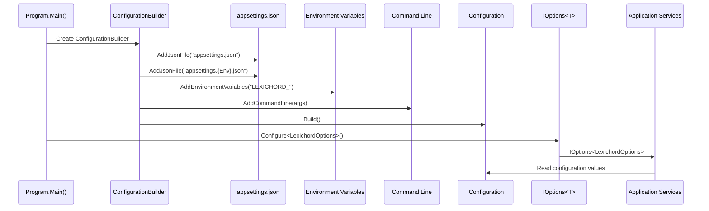

# LCS-INF-003d: Configuration Service

## 1. Metadata & Categorization

| Field                | Value                                | Description                                      |
| :------------------- | :----------------------------------- | :----------------------------------------------- |
| **Feature ID**       | `INF-003d`                           | Infrastructure - Configuration Service           |
| **Feature Name**     | Configuration Service                | Multi-source configuration with options pattern  |
| **Target Version**   | `v0.0.3d`                            | Fourth sub-part of v0.0.3                        |
| **Module Scope**     | `Lexichord.Host` / `Lexichord.Abstractions` | Primary application infrastructure        |
| **Swimlane**         | `Infrastructure`                     | The Podium (Platform)                            |
| **License Tier**     | `Core`                               | Foundation (Required for all tiers)              |
| **Author**           | System Architect                     |                                                  |
| **Status**           | **Draft**                            | Pending implementation                           |
| **Last Updated**     | 2026-01-26                           |                                                  |

---

## 2. Executive Summary

### 2.1 The Requirement

The application needs to load configuration from multiple sources with proper precedence:

- Default values in code.
- `appsettings.json` for base configuration.
- `appsettings.{Environment}.json` for environment-specific overrides.
- Environment variables for deployment overrides.
- Command-line arguments for runtime overrides.

Without this, there's no way to:

- Configure different behaviors for Development vs Production.
- Enable debug features without recompiling.
- Override settings in CI/CD pipelines.

### 2.2 The Proposed Solution

We **SHALL** implement Microsoft.Extensions.Configuration with:

1. **Configuration Builder** — Load settings from JSON, environment, and CLI.
2. **Options Pattern** — Strongly-typed configuration via `IOptions<T>`.
3. **Environment Detection** — Automatic `appsettings.{Env}.json` loading.
4. **CLI Argument Mapping** — `--debug-mode` and `--log-level` support.

---

## 3. Architecture

### 3.1 Configuration Precedence

```text
PRECEDENCE (highest wins):
│
├── 4. Command-Line Arguments (--debug-mode)
│       ↑ Runtime overrides from user
│
├── 3. Environment Variables (LEXICHORD_*)
│       ↑ Deployment/CI overrides
│
├── 2. appsettings.{Environment}.json
│       ↑ Environment-specific (Development, Staging, Production)
│
└── 1. appsettings.json
        Base configuration (shipped with application)
```

### 3.2 Configuration Flow



---

## 4. Implementation Tasks

### Task 1.1: Install Configuration Packages

**NuGet Packages to Add:**

```xml
<PackageReference Include="Microsoft.Extensions.Configuration" Version="9.0.0" />
<PackageReference Include="Microsoft.Extensions.Configuration.Json" Version="9.0.0" />
<PackageReference Include="Microsoft.Extensions.Configuration.EnvironmentVariables" Version="9.0.0" />
<PackageReference Include="Microsoft.Extensions.Configuration.CommandLine" Version="9.0.0" />
<PackageReference Include="Microsoft.Extensions.Options" Version="9.0.0" />
<PackageReference Include="Microsoft.Extensions.Options.ConfigurationExtensions" Version="9.0.0" />
```

---

### Task 1.2: Create appsettings.json

**File:** `src/Lexichord.Host/appsettings.json`

```json
{
  "Lexichord": {
    "ApplicationName": "Lexichord",
    "Environment": "Production",
    "DataPath": null,
    "DebugMode": false
  },
  "Debug": {
    "ShowDevTools": false,
    "EnablePerformanceLogging": false,
    "SimulatedNetworkDelayMs": 0
  },
  "Serilog": {
    "MinimumLevel": {
      "Default": "Information",
      "Override": {
        "Microsoft": "Warning",
        "System": "Warning",
        "Avalonia": "Warning"
      }
    }
  },
  "FeatureFlags": {
    "EnableExperimentalFeatures": false
  }
}
```

**File:** `src/Lexichord.Host/appsettings.Development.json`

```json
{
  "Lexichord": {
    "Environment": "Development",
    "DebugMode": true
  },
  "Debug": {
    "ShowDevTools": true,
    "EnablePerformanceLogging": true
  },
  "Serilog": {
    "MinimumLevel": {
      "Default": "Debug",
      "Override": {
        "Lexichord": "Verbose"
      }
    }
  },
  "FeatureFlags": {
    "EnableExperimentalFeatures": true
  }
}
```

**File:** `src/Lexichord.Host/Lexichord.Host.csproj` (Add copy rules)

```xml
<!-- Configuration files -->
<ItemGroup>
  <None Update="appsettings.json">
    <CopyToOutputDirectory>PreserveNewest</CopyToOutputDirectory>
  </None>
  <None Update="appsettings.Development.json">
    <CopyToOutputDirectory>PreserveNewest</CopyToOutputDirectory>
  </None>
  <None Update="appsettings.Staging.json" Condition="Exists('appsettings.Staging.json')">
    <CopyToOutputDirectory>PreserveNewest</CopyToOutputDirectory>
  </None>
</ItemGroup>
```

---

### Task 1.3: Configuration Builder

**File:** `src/Lexichord.Host/HostServices.cs` (Add BuildConfiguration method)

```csharp
using Microsoft.Extensions.Configuration;
using System;
using System.Collections.Generic;
using System.IO;

namespace Lexichord.Host;

public static class HostServices
{
    /// <summary>
    /// Builds the application configuration from multiple sources.
    /// </summary>
    /// <param name="args">Command-line arguments.</param>
    /// <returns>The built configuration.</returns>
    /// <remarks>
    /// LOGIC: Configuration sources are loaded in order of increasing precedence:
    /// 1. appsettings.json (base settings, always present)
    /// 2. appsettings.{Environment}.json (environment overrides, optional)
    /// 3. Environment variables (deployment overrides, LEXICHORD_ prefix)
    /// 4. Command-line arguments (runtime overrides, highest priority)
    ///
    /// Environment is determined by:
    /// 1. LEXICHORD_ENVIRONMENT environment variable (preferred)
    /// 2. DOTNET_ENVIRONMENT environment variable (fallback)
    /// 3. "Production" (default)
    /// </remarks>
    public static IConfiguration BuildConfiguration(string[] args)
    {
        // LOGIC: Determine environment from multiple sources
        var environment = Environment.GetEnvironmentVariable("LEXICHORD_ENVIRONMENT")
            ?? Environment.GetEnvironmentVariable("DOTNET_ENVIRONMENT")
            ?? "Production";

        return new ConfigurationBuilder()
            // Set base path to application directory (where exe lives)
            .SetBasePath(AppContext.BaseDirectory)

            // 1. Base configuration (required)
            .AddJsonFile("appsettings.json", optional: false, reloadOnChange: true)

            // 2. Environment-specific configuration (optional)
            .AddJsonFile($"appsettings.{environment}.json", optional: true, reloadOnChange: true)

            // 3. Environment variables with LEXICHORD_ prefix
            // e.g., LEXICHORD_DEBUGMODE=true becomes Lexichord:DebugMode
            .AddEnvironmentVariables(prefix: "LEXICHORD_")

            // 4. Command-line arguments (highest precedence)
            .AddCommandLine(args, new Dictionary<string, string>
            {
                // Map CLI switches to configuration keys
                { "--debug-mode", "Lexichord:DebugMode" },
                { "-d", "Lexichord:DebugMode" },
                { "--log-level", "Serilog:MinimumLevel:Default" },
                { "-l", "Serilog:MinimumLevel:Default" },
                { "--data-path", "Lexichord:DataPath" },
                { "--environment", "Lexichord:Environment" },
                { "-e", "Lexichord:Environment" },
                { "--show-devtools", "Debug:ShowDevTools" }
            })
            .Build();
    }

    // ... existing ConfigureServices method ...
}
```

---

### Task 1.4: Configuration Options Pattern

**File:** `src/Lexichord.Abstractions/Contracts/ConfigurationOptions.cs`

```csharp
namespace Lexichord.Abstractions.Contracts;

/// <summary>
/// Application-wide configuration options for Lexichord.
/// </summary>
/// <remarks>
/// LOGIC: These options are loaded from appsettings.json, environment variables,
/// and command-line arguments. Later sources override earlier ones.
///
/// Configuration key: "Lexichord"
/// </remarks>
public record LexichordOptions
{
    /// <summary>
    /// Configuration section name.
    /// </summary>
    public const string SectionName = "Lexichord";

    /// <summary>
    /// Application display name shown in title bars and dialogs.
    /// </summary>
    /// <example>Lexichord</example>
    public string ApplicationName { get; init; } = "Lexichord";

    /// <summary>
    /// Current environment (Development, Staging, Production).
    /// </summary>
    /// <remarks>
    /// LOGIC: Determines which appsettings.{Environment}.json to load.
    /// Also affects logging verbosity and feature flag defaults.
    /// </remarks>
    public string Environment { get; init; } = "Production";

    /// <summary>
    /// Base path for application data storage.
    /// </summary>
    /// <remarks>
    /// LOGIC: When null, defaults to platform-appropriate location:
    /// - Windows: %APPDATA%/Lexichord
    /// - macOS: ~/Library/Application Support/Lexichord
    /// - Linux: ~/.config/Lexichord
    /// </remarks>
    public string? DataPath { get; init; }

    /// <summary>
    /// Enable verbose debug logging regardless of environment.
    /// </summary>
    /// <remarks>
    /// LOGIC: Can be enabled via:
    /// - appsettings.json: "Lexichord:DebugMode": true
    /// - Environment: LEXICHORD_DEBUGMODE=true
    /// - CLI: --debug-mode or -d
    /// </remarks>
    public bool DebugMode { get; init; }

    /// <summary>
    /// Gets the resolved data path (uses default if not configured).
    /// </summary>
    public string GetResolvedDataPath()
    {
        if (!string.IsNullOrEmpty(DataPath))
            return DataPath;

        var appData = System.Environment.GetFolderPath(
            System.Environment.SpecialFolder.ApplicationData);
        return System.IO.Path.Combine(appData, "Lexichord");
    }
}

/// <summary>
/// Debug-specific options for development and troubleshooting.
/// </summary>
/// <remarks>
/// Configuration key: "Debug"
/// These options are typically only enabled in Development environment.
/// </remarks>
public record DebugOptions
{
    /// <summary>
    /// Configuration section name.
    /// </summary>
    public const string SectionName = "Debug";

    /// <summary>
    /// Show Avalonia DevTools window on startup.
    /// </summary>
    /// <remarks>
    /// LOGIC: Only has effect in Debug builds. Allows F12 to open DevTools.
    /// </remarks>
    public bool ShowDevTools { get; init; }

    /// <summary>
    /// Enable performance timing logs for all service methods.
    /// </summary>
    /// <remarks>
    /// LOGIC: Logs entry/exit times for methods decorated with [LogPerformance].
    /// Useful for identifying slow operations.
    /// </remarks>
    public bool EnablePerformanceLogging { get; init; }

    /// <summary>
    /// Simulate slow network for testing loading states.
    /// </summary>
    /// <remarks>
    /// LOGIC: Adds artificial delay to all HTTP requests.
    /// 0 = disabled, any positive value = delay in milliseconds.
    /// </remarks>
    public int SimulatedNetworkDelayMs { get; init; }
}

/// <summary>
/// Feature flags for gradual rollout and A/B testing.
/// </summary>
/// <remarks>
/// Configuration key: "FeatureFlags"
/// These flags control access to experimental or in-development features.
/// </remarks>
public record FeatureFlagOptions
{
    /// <summary>
    /// Configuration section name.
    /// </summary>
    public const string SectionName = "FeatureFlags";

    /// <summary>
    /// Enable experimental features that are not yet production-ready.
    /// </summary>
    public bool EnableExperimentalFeatures { get; init; }
}
```

**File:** `src/Lexichord.Host/HostServices.cs` (Update ConfigureServices)

```csharp
using Microsoft.Extensions.Configuration;
using Microsoft.Extensions.DependencyInjection;
using Microsoft.Extensions.Options;
using Lexichord.Abstractions.Contracts;

public static IServiceCollection ConfigureServices(
    this IServiceCollection services,
    IConfiguration configuration)
{
    // LOGIC: Register configuration options using the Options pattern
    // This enables strongly-typed access to configuration sections
    services.Configure<LexichordOptions>(
        configuration.GetSection(LexichordOptions.SectionName));
    services.Configure<DebugOptions>(
        configuration.GetSection(DebugOptions.SectionName));
    services.Configure<FeatureFlagOptions>(
        configuration.GetSection(FeatureFlagOptions.SectionName));

    // LOGIC: Also register IConfiguration for services that need raw access
    services.AddSingleton<IConfiguration>(configuration);

    // Register Serilog (from v0.0.3b)
    services.AddLogging(builder =>
    {
        builder.ClearProviders();
        builder.AddSerilog(dispose: true);
    });

    // Register core services
    services.AddSingleton<IThemeManager, ThemeManager>();
    services.AddSingleton<IWindowStateService, WindowStateService>();
    services.AddSingleton<ICrashReportService, CrashReportService>();

    #pragma warning disable CS0618
    services.AddSingleton<IServiceLocator>(sp => new ServiceLocator(sp));
    #pragma warning restore CS0618

    return services;
}
```

---

## 5. Decision Tree: Configuration Access

```text
START: "How do I access configuration?"
│
├── Do I need a specific section with strong typing?
│   └── Use IOptions<T>
│       public class MyService(IOptions<LexichordOptions> options)
│       {
│           var debugMode = options.Value.DebugMode;
│       }
│
├── Do I need to watch for configuration changes?
│   └── Use IOptionsMonitor<T>
│       public class MyService(IOptionsMonitor<DebugOptions> options)
│       {
│           options.OnChange(newValue => { /* react to changes */ });
│       }
│
├── Do I need to create new options instances?
│   └── Use IOptionsSnapshot<T> (Scoped)
│       // Gets fresh values for each request/scope
│
├── Do I need raw key-value access?
│   └── Use IConfiguration directly
│       public class MyService(IConfiguration config)
│       {
│           var value = config["Lexichord:DataPath"];
│           var intValue = config.GetValue<int>("Section:Key");
│       }
│
└── Am I in startup code (before DI)?
    └── Use configuration from BuildConfiguration() directly
        var config = HostServices.BuildConfiguration(args);
        var debugMode = config.GetValue<bool>("Lexichord:DebugMode");
```

---

## 6. Unit Testing Requirements

### 6.1 Configuration Builder Tests

```csharp
[TestFixture]
[Category("Unit")]
public class ConfigurationBuilderTests
{
    private string _tempDir = null!;

    [SetUp]
    public void SetUp()
    {
        _tempDir = Path.Combine(Path.GetTempPath(), Guid.NewGuid().ToString());
        Directory.CreateDirectory(_tempDir);
    }

    [TearDown]
    public void TearDown()
    {
        if (Directory.Exists(_tempDir))
            Directory.Delete(_tempDir, recursive: true);
    }

    [Test]
    public void BuildConfiguration_LoadsJsonFile()
    {
        // Arrange
        var jsonPath = Path.Combine(_tempDir, "appsettings.json");
        File.WriteAllText(jsonPath, """
            {
              "Lexichord": {
                "ApplicationName": "TestApp",
                "DebugMode": true
              }
            }
            """);

        // Act
        var config = new ConfigurationBuilder()
            .SetBasePath(_tempDir)
            .AddJsonFile("appsettings.json")
            .Build();

        // Assert
        Assert.That(config["Lexichord:ApplicationName"], Is.EqualTo("TestApp"));
        Assert.That(config.GetValue<bool>("Lexichord:DebugMode"), Is.True);
    }

    [Test]
    public void BuildConfiguration_EnvironmentOverridesBase()
    {
        // Arrange
        var basePath = Path.Combine(_tempDir, "appsettings.json");
        var devPath = Path.Combine(_tempDir, "appsettings.Development.json");

        File.WriteAllText(basePath, """
            {
              "Lexichord": { "DebugMode": false }
            }
            """);
        File.WriteAllText(devPath, """
            {
              "Lexichord": { "DebugMode": true }
            }
            """);

        // Act
        var config = new ConfigurationBuilder()
            .SetBasePath(_tempDir)
            .AddJsonFile("appsettings.json")
            .AddJsonFile("appsettings.Development.json")
            .Build();

        // Assert
        Assert.That(config.GetValue<bool>("Lexichord:DebugMode"), Is.True);
    }

    [Test]
    public void BuildConfiguration_CliOverridesJson()
    {
        // Arrange
        var jsonPath = Path.Combine(_tempDir, "appsettings.json");
        File.WriteAllText(jsonPath, """
            {
              "Lexichord": { "DebugMode": false }
            }
            """);

        var args = new[] { "--debug-mode", "true" };

        // Act
        var config = new ConfigurationBuilder()
            .SetBasePath(_tempDir)
            .AddJsonFile("appsettings.json")
            .AddCommandLine(args, new Dictionary<string, string>
            {
                { "--debug-mode", "Lexichord:DebugMode" }
            })
            .Build();

        // Assert
        Assert.That(config.GetValue<bool>("Lexichord:DebugMode"), Is.True);
    }

    [Test]
    public void BuildConfiguration_EnvironmentVariablesWithPrefix()
    {
        // Arrange
        Environment.SetEnvironmentVariable("LEXICHORD_DEBUGMODE", "true");

        try
        {
            // Act
            var config = new ConfigurationBuilder()
                .AddEnvironmentVariables(prefix: "LEXICHORD_")
                .Build();

            // Assert
            Assert.That(config.GetValue<bool>("DEBUGMODE"), Is.True);
        }
        finally
        {
            Environment.SetEnvironmentVariable("LEXICHORD_DEBUGMODE", null);
        }
    }
}
```

### 6.2 Options Pattern Tests

```csharp
[TestFixture]
[Category("Unit")]
public class ConfigurationOptionsTests
{
    [Test]
    public void LexichordOptions_BindsFromConfiguration()
    {
        // Arrange
        var config = new ConfigurationBuilder()
            .AddInMemoryCollection(new Dictionary<string, string?>
            {
                { "Lexichord:ApplicationName", "TestApp" },
                { "Lexichord:Environment", "Testing" },
                { "Lexichord:DebugMode", "true" }
            })
            .Build();

        var services = new ServiceCollection();
        services.Configure<LexichordOptions>(config.GetSection("Lexichord"));
        var provider = services.BuildServiceProvider();

        // Act
        var options = provider.GetRequiredService<IOptions<LexichordOptions>>();

        // Assert
        Assert.Multiple(() =>
        {
            Assert.That(options.Value.ApplicationName, Is.EqualTo("TestApp"));
            Assert.That(options.Value.Environment, Is.EqualTo("Testing"));
            Assert.That(options.Value.DebugMode, Is.True);
        });
    }

    [Test]
    public void DebugOptions_DefaultValues()
    {
        // Arrange
        var options = new DebugOptions();

        // Assert
        Assert.Multiple(() =>
        {
            Assert.That(options.ShowDevTools, Is.False);
            Assert.That(options.EnablePerformanceLogging, Is.False);
            Assert.That(options.SimulatedNetworkDelayMs, Is.EqualTo(0));
        });
    }

    [Test]
    public void LexichordOptions_GetResolvedDataPath_UsesDefault()
    {
        // Arrange
        var options = new LexichordOptions { DataPath = null };

        // Act
        var path = options.GetResolvedDataPath();

        // Assert
        Assert.That(path, Does.Contain("Lexichord"));
        Assert.That(path, Does.Not.Contain("null"));
    }

    [Test]
    public void LexichordOptions_GetResolvedDataPath_UsesConfigured()
    {
        // Arrange
        var customPath = "/custom/path/data";
        var options = new LexichordOptions { DataPath = customPath };

        // Act
        var path = options.GetResolvedDataPath();

        // Assert
        Assert.That(path, Is.EqualTo(customPath));
    }
}
```

---

## 7. Observability & Logging

| Level       | Context      | Message Template                                                    |
| :---------- | :----------- | :------------------------------------------------------------------ |
| Information | App          | `Configuration loaded. Environment: {Environment}`                  |
| Debug       | App          | `Configuration sources: {Sources}`                                  |
| Debug       | App          | `Lexichord options: DebugMode={DebugMode}, DataPath={DataPath}`     |
| Warning     | App          | `appsettings.{Environment}.json not found, using base configuration`|

---

## 8. Security & Safety

### 8.1 Sensitive Configuration

> [!WARNING]
> Never store secrets in appsettings.json or environment variables:

```json
// ❌ WRONG - Never put secrets in config files
{
  "ApiKeys": {
    "OpenAI": "sk-12345..."  // FORBIDDEN
  }
}

// ✅ CORRECT - Reference secure storage
{
  "ApiKeys": {
    "OpenAI": "{{vault:openai-key}}"  // Placeholder for ISecureVault
  }
}
```

### 8.2 Configuration File Security

- `appsettings.json` is shipped with the application and should only contain non-sensitive defaults.
- `appsettings.Development.json` should be in `.gitignore` if it contains developer-specific paths.
- Environment variables with `LEXICHORD_` prefix are acceptable for CI/CD but not for secrets.

---

## 9. Definition of Done

- [ ] Configuration packages installed (`Microsoft.Extensions.Configuration`, `Microsoft.Extensions.Configuration.Json`, `Microsoft.Extensions.Configuration.EnvironmentVariables`, `Microsoft.Extensions.Configuration.CommandLine`, `Microsoft.Extensions.Options`)
- [ ] `appsettings.json` created with Lexichord, Debug, Serilog, and FeatureFlags sections
- [ ] `appsettings.Development.json` created with debug settings
- [ ] `appsettings.*.json` files set to `CopyToOutputDirectory=PreserveNewest`
- [ ] `HostServices.BuildConfiguration()` method created
- [ ] Configuration loads from JSON → Environment → CLI with proper precedence
- [ ] Environment detection via `LEXICHORD_ENVIRONMENT` or `DOTNET_ENVIRONMENT`
- [ ] `LexichordOptions` record defined in Abstractions
- [ ] `DebugOptions` record defined in Abstractions
- [ ] `FeatureFlagOptions` record defined in Abstractions
- [ ] Options registered via `services.Configure<T>()` in HostServices
- [ ] `IOptions<LexichordOptions>` injectable into services
- [ ] CLI argument `--debug-mode` enables verbose logging
- [ ] CLI argument `--log-level` sets Serilog minimum level
- [ ] Unit tests for configuration loading passing
- [ ] Unit tests for options binding passing

---

## 10. Verification Commands

```bash
# Build the application
dotnet build src/Lexichord.Host

# Run with default configuration
dotnet run --project src/Lexichord.Host

# Run with debug mode enabled via CLI
dotnet run --project src/Lexichord.Host -- --debug-mode

# Run with custom log level
dotnet run --project src/Lexichord.Host -- --log-level Debug

# Run with environment variable override
# Windows:
set LEXICHORD_DEBUGMODE=true && dotnet run --project src/Lexichord.Host
# macOS/Linux:
LEXICHORD_DEBUGMODE=true dotnet run --project src/Lexichord.Host

# Run in Development environment
# Windows:
set LEXICHORD_ENVIRONMENT=Development && dotnet run --project src/Lexichord.Host
# macOS/Linux:
LEXICHORD_ENVIRONMENT=Development dotnet run --project src/Lexichord.Host

# Run unit tests
dotnet test --filter "FullyQualifiedName~ConfigurationBuilderTests"
dotnet test --filter "FullyQualifiedName~ConfigurationOptionsTests"

# Verify configuration file is in output
ls bin/Debug/net9.0/appsettings*.json
```
