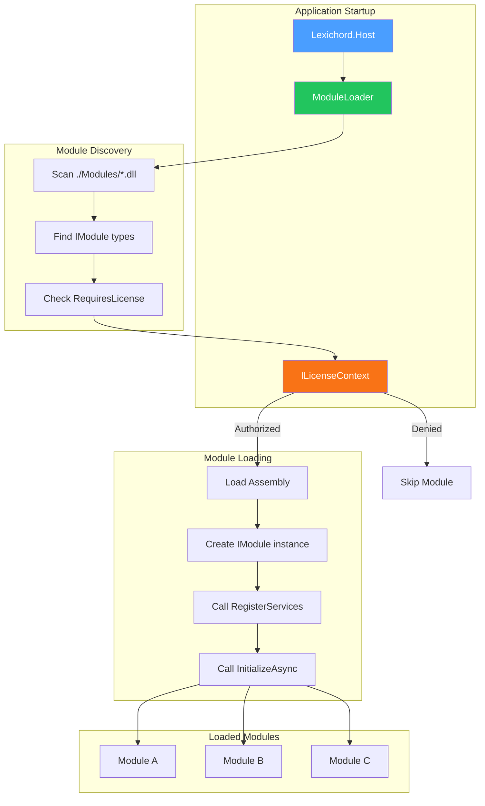
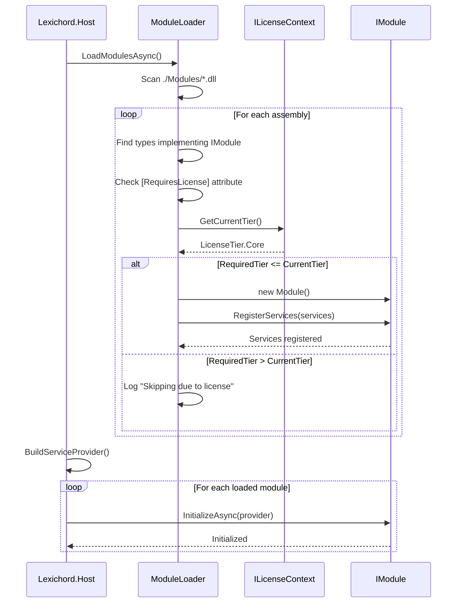

# LCS-DES-004: Design Specification Index — The Module Protocol

## Document Control

| Field                | Value                                       |
| :------------------- | :------------------------------------------ |
| **Document ID**      | LCS-DES-004-INDEX                           |
| **Feature ID**       | INF-004                                     |
| **Feature Name**     | The Module Protocol (The Core)              |
| **Target Version**   | v0.0.4                                      |
| **Module Scope**     | Lexichord.Host / Lexichord.Abstractions     |
| **Swimlane**         | Infrastructure                              |
| **License Tier**     | Core                                        |
| **Feature Gate Key** | N/A                                         |
| **Status**           | Draft                                       |
| **Last Updated**     | 2026-01-27                                  |

---

## 1. Executive Summary

**v0.0.4** establishes the most critical architectural component of Lexichord: the **Module Loading System**. This release transforms the application from a monolithic executable into a true **Modular Monolith** capable of dynamically loading feature DLLs.

### 1.1 The Problem

Without a module loading system:

- All features must be compiled into a single monolithic executable
- License enforcement at load time becomes impossible
- The Teams/Enterprise tier business model cannot be implemented
- Testing modules in isolation becomes difficult
- Features cannot be decoupled into separate assemblies

### 1.2 The Solution

Implement a complete module loading system with:

- **The Contract** — `IModule` interface defining the module lifecycle
- **The Discovery Engine** — `ModuleLoader` scanning and loading assemblies
- **The License Gate** — `[RequiresLicense]` attribute for tier enforcement
- **The Sandbox Module** — Proof of concept demonstrating the architecture

### 1.3 Business Value

| Value                   | Description                                          |
| :---------------------- | :--------------------------------------------------- |
| **Modularity**          | Features can be developed and deployed independently |
| **License Enforcement** | Tier-gated features at load time                     |
| **Testability**         | Modules can be tested in isolation                   |
| **Scalability**         | New features as separate DLLs without Host changes   |
| **Business Model**      | Enables Teams/Enterprise feature tiers               |

---

## 2. Related Documents

### 2.1 Scope Breakdown Document

The detailed scope breakdown for v0.0.4, including all sub-parts, implementation checklists, and acceptance criteria:

| Document                            | Description                                  |
| :---------------------------------- | :------------------------------------------- |
| **[LCS-SBD-004](./LCS-SBD-004.md)** | Scope Breakdown — The Module Protocol        |

### 2.2 Sub-Part Design Specifications

Each sub-part has its own detailed design specification following the LDS-01 template:

| Sub-Part | Document                              | Title                              | Description                             |
| :------- | :------------------------------------ | :--------------------------------- | :-------------------------------------- |
| v0.0.4a  | **[LCS-DES-004a](./LCS-DES-004a.md)** | The Contract (IModule Interface)   | Module lifecycle contract definition    |
| v0.0.4b  | **[LCS-DES-004b](./LCS-DES-004b.md)** | The Discovery Engine (ModuleLoader)| Module discovery and loading service    |
| v0.0.4c  | **[LCS-DES-004c](./LCS-DES-004c.md)** | The License Gate (Skeleton)        | License tier and feature gating         |
| v0.0.4d  | **[LCS-DES-004d](./LCS-DES-004d.md)** | The Sandbox Module (Proof of Concept)| Test module validating architecture   |

---

## 3. Architecture Overview

### 3.1 Component Diagram

### 3.2 Module Lifecycle Sequence

---

## 4. Dependencies

### 4.1 Upstream Dependencies

| Dependency           | Source Version | Purpose                           |
| :------------------- | :------------- | :-------------------------------- |
| DI Container         | v0.0.3a        | Service registration              |
| Serilog Pipeline     | v0.0.3b        | Module loading logs               |
| Configuration        | v0.0.3d        | Future module configuration       |

### 4.2 NuGet Packages

| Package                                    | Version  | Purpose                    |
| :----------------------------------------- | :------- | :------------------------- |
| `System.Runtime.Loader`                    | Built-in | Assembly loading context   |
| `Microsoft.Extensions.DependencyInjection` | 9.0.x    | Service registration       |

### 4.3 Downstream Consumers (Future)

| Version | Feature          | Uses From v0.0.4                         |
| :------ | :--------------- | :--------------------------------------- |
| v0.0.5  | Database Module  | IModule for service registration         |
| v0.1.x  | Settings Module  | Module lifecycle hooks                   |
| v0.2.x  | Editor Module    | IModule for editor components            |
| v0.3.x  | Style Module     | IModule for style engine                 |
| v1.x    | License System   | ILicenseContext for real validation      |

---

## 5. License Gating Strategy

**N/A for ModuleLoader** — The loader itself is Core infrastructure.

**Module Licensing** — Individual modules declare their required tier via the `[RequiresLicense]` attribute:

| Tier         | Features                                                |
| :----------- | :------------------------------------------------------ |
| **Core**     | Basic editor, fundamental writing tools                 |
| **WriterPro**| Style engine, readability metrics, AI assistance        |
| **Teams**    | Collaboration, shared style guides, team agents         |
| **Enterprise**| SSO, audit logs, compliance features, priority support |

---

## 6. Key Interfaces Summary

| Interface             | Defined In | Purpose                               |
| :-------------------- | :--------- | :------------------------------------ |
| `IModule`             | v0.0.4a    | Module lifecycle contract             |
| `IModuleLoader`       | v0.0.4b    | Module discovery and loading          |
| `ILicenseContext`     | v0.0.4c    | License tier checking                 |

| Record/DTO               | Defined In | Purpose                            |
| :----------------------- | :--------- | :--------------------------------- |
| `ModuleInfo`             | v0.0.4a    | Module metadata (id, version, etc) |
| `ModuleLoadFailure`      | v0.0.4b    | Failed module information          |
| `LicenseTier`            | v0.0.4c    | License tier enumeration           |
| `RequiresLicenseAttribute`| v0.0.4c   | License requirement declaration    |

---

## 7. Implementation Checklist Summary

| Sub-Part  | Key Deliverables                                             | Est. Hours   | Status |
| :-------- | :----------------------------------------------------------- | :----------- | :----- |
| v0.0.4a   | IModule interface, ModuleInfo record, lifecycle events       | 4            | [ ]    |
| v0.0.4b   | ModuleLoader, assembly scanning, service registration        | 6            | [ ]    |
| v0.0.4c   | LicenseTier enum, RequiresLicense attribute, ILicenseContext | 4            | [ ]    |
| v0.0.4d   | Sandbox project, ISandboxService, integration test           | 4            | [ ]    |
| **Total** |                                                              | **18 hours** |        |

See [LCS-SBD-004](./LCS-SBD-004.md) Section 3 for the detailed implementation checklist.

---

## 8. Success Criteria Summary

| Category        | Criterion                                              | Target |
| :-------------- | :----------------------------------------------------- | :----- |
| **Contract**    | `IModule` interface exists with lifecycle methods      | Pass   |
| **Discovery**   | `ModuleLoader` scans `./Modules/` directory            | Pass   |
| **Discovery**   | Non-module DLLs are skipped without error              | Pass   |
| **Loading**     | Module's `RegisterServices` called before DI build     | Pass   |
| **Loading**     | Module's `InitializeAsync` called after DI build       | Pass   |
| **License**     | `[RequiresLicense]` modules skipped when tier too low  | Pass   |
| **Resilience**  | Application starts even if a module fails              | Pass   |
| **Sandbox**     | `ISandboxService` is resolvable from DI                | Pass   |

See individual design specs for detailed acceptance criteria.

---

## 9. Test Coverage Summary

| Sub-Part | Unit Tests                                | Integration Tests                  |
| :------- | :---------------------------------------- | :--------------------------------- |
| v0.0.4a  | ModuleInfo validation, interface contract | N/A                                |
| v0.0.4b  | ModuleLoader discovery, error handling    | Module loading end-to-end          |
| v0.0.4c  | License attribute, tier comparison        | License-gated module skip          |
| v0.0.4d  | N/A                                       | Sandbox module loads and registers |

See individual design specs for detailed test scenarios.

---

## 10. What This Enables

| Version | Feature          | Depends On v0.0.4                             |
| :------ | :--------------- | :-------------------------------------------- |
| v0.0.5  | Database Module  | Module registration for repository services   |
| v0.1.x  | Settings Module  | Module lifecycle for settings persistence     |
| v0.2.x  | Editor Module    | Module registration for editor components     |
| v0.3.x  | Style Module     | Module lifecycle for style engine             |
| v0.4.x  | Memory Module    | Module registration for vector services       |
| v1.x    | License System   | ILicenseContext implementation                |

---

## 11. Risks & Mitigations

| Risk                                  | Impact | Mitigation                                        |
| :------------------------------------ | :----- | :------------------------------------------------ |
| Assembly version conflicts            | High   | Pin versions in Directory.Build.props             |
| Module crashes during initialization  | Medium | Try/catch in InitializeAsync, log and continue    |
| Circular module dependencies          | High   | Future: Dependency graph analysis before loading  |
| License bypass via reflection         | Low    | Acceptable for v0.0.4; real security in v1.x      |
| Host references Module                | High   | Architecture tests prevent at build time          |

---

## Document History

| Version | Date       | Author           | Changes                                                   |
| :------ | :--------- | :--------------- | :-------------------------------------------------------- |
| 1.0     | 2026-01-27 | System Architect | Created INDEX from legacy LCS-INF-004 during standardization |
