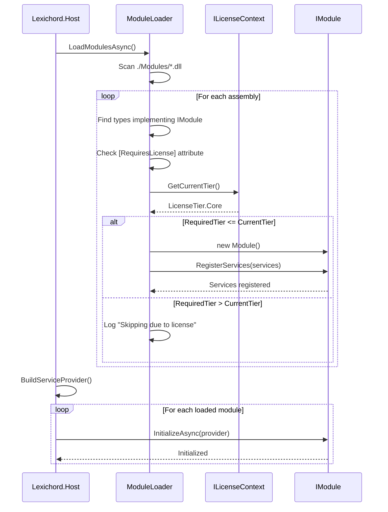

# LCS-01: Feature Design Composition

## 1. Metadata & Categorization

| Field                | Value                                    | Description                                           |
| :------------------- | :--------------------------------------- | :---------------------------------------------------- |
| **Feature ID**       | `INF-004`                                | Infrastructure - Module Protocol                      |
| **Feature Name**     | Module Loading System                    | Dynamic assembly loading and registration             |
| **Target Version**   | `v0.0.4`                                 | Module Architecture Foundation                        |
| **Module Scope**     | `Lexichord.Host` / `Lexichord.Abstractions` | Core infrastructure                                |
| **Swimlane**         | `Infrastructure`                         | The Podium (Platform)                                 |
| **License Tier**     | `Core`                                   | Foundation (Required for all tiers)                   |
| **Feature Gate Key** | N/A                                      | No runtime gating for module loader                   |
| **Author**           | System Architect                         |                                                       |
| **Status**           | **Draft**                                | Pending approval                                      |
| **Last Updated**     | 2026-01-26                               |                                                       |

---

## 2. Executive Summary

### 2.1 The Requirement

Lexichord requires a **module loading system** that:

- Dynamically discovers and loads feature DLLs at runtime.
- Allows modules to register services in the DI container.
- Enforces license tier restrictions at load time.
- Maintains strict separation between Host and Modules.

Without this foundation:

- All features must be compiled into a single monolithic executable.
- License enforcement becomes impossible.
- The Teams/Enterprise business model cannot be implemented.
- Testing modules in isolation becomes difficult.

### 2.2 The Proposed Solution

We **SHALL** implement a complete module loading system with:

1. **v0.0.4a: The Contract** — `IModule` interface defining the module lifecycle.
2. **v0.0.4b: The Discovery Engine** — `ModuleLoader` scanning and loading assemblies.
3. **v0.0.4c: The License Gate** — `[RequiresLicense]` attribute for tier enforcement.
4. **v0.0.4d: The Sandbox Module** — Proof of concept demonstrating the architecture.

---

## 3. Architecture & Modular Strategy

### 3.1 High-Level Architecture

```mermaid
graph TB
    subgraph "Application Startup"
        HOST[Lexichord.Host]
        LOADER[ModuleLoader]
        LICENSE[ILicenseContext]
    end

    subgraph "Module Discovery"
        SCAN[Scan ./Modules/*.dll]
        REFLECT[Find IModule types]
        CHECK[Check [RequiresLicense]]
    end

    subgraph "Module Loading"
        LOAD[Load Assembly]
        CREATE[Create IModule instance]
        REGISTER[Call RegisterServices]
        INIT[Call InitializeAsync]
    end

    subgraph "Loaded Modules"
        MOD1[Module A]
        MOD2[Module B]
        MOD3[Module C]
    end

    HOST --> LOADER
    LOADER --> SCAN
    SCAN --> REFLECT
    REFLECT --> CHECK
    CHECK --> LICENSE
    LICENSE -->|Authorized| LOAD
    LICENSE -->|Denied| SKIP[Skip Module]
    LOAD --> CREATE
    CREATE --> REGISTER
    REGISTER --> INIT
    INIT --> MOD1
    INIT --> MOD2
    INIT --> MOD3
```

### 3.2 Module Lifecycle Sequence



### 3.3 Dependencies

- **NuGet Packages:**

| Package                                    | Version | Purpose                          |
| :----------------------------------------- | :------ | :------------------------------- |
| `System.Runtime.Loader`                    | Built-in| Assembly loading context         |
| `Microsoft.Extensions.DependencyInjection` | 9.0.x   | Service registration             |

- **Project References:**

| Project                      | Reference Direction        |
| :--------------------------- | :------------------------- |
| `Lexichord.Host`             | → `Lexichord.Abstractions` |
| `Lexichord.Abstractions`     | (No references)            |
| `Lexichord.Modules.Sandbox`  | → `Lexichord.Abstractions` |

### 3.4 Licensing Behavior

- **N/A for ModuleLoader:** The loader itself is Core infrastructure.
- **Module Licensing:** Individual modules declare their tier via `[RequiresLicense]`.

---

## 4. Decision Tree: Module Loading

```text
START: "Should this assembly be loaded as a module?"
│
├── Does the DLL exist in ./Modules/ directory?
│   ├── NO → Skip (not a module)
│   └── YES → Continue
│
├── Can the assembly be loaded without errors?
│   ├── NO → Log error, add to FailedModules, continue to next
│   └── YES → Continue
│
├── Does it contain a type implementing IModule?
│   ├── NO → Skip (library dependency, not a module)
│   └── YES → Continue
│
├── Does the IModule type have [RequiresLicense]?
│   ├── NO → Treat as Core tier (always load)
│   └── YES → Check license tier
│       ├── RequiredTier <= CurrentTier → Load module
│       └── RequiredTier > CurrentTier → Skip, log warning
│
└── Module Loading
    ├── Create instance via Activator.CreateInstance
    ├── Call RegisterServices(IServiceCollection)
    ├── Store in LoadedModules collection
    └── Later: Call InitializeAsync(IServiceProvider)
```

---

## 5. Data Contracts

### 5.1 IModule Interface

```csharp
namespace Lexichord.Abstractions.Contracts;

/// <summary>
/// Defines the contract for Lexichord feature modules.
/// </summary>
/// <remarks>
/// LOGIC: Modules are the building blocks of Lexichord's modular monolith architecture.
/// Each module is a separate assembly that:
/// - Lives in the ./Modules/ directory
/// - Implements this interface
/// - Registers its services during startup
/// - Initializes after the DI container is built
///
/// Module Loading Lifecycle:
/// 1. ModuleLoader discovers the assembly in ./Modules/
/// 2. Reflection finds the IModule implementation
/// 3. [RequiresLicense] attribute is checked against current license
/// 4. Module is instantiated (parameterless constructor)
/// 5. RegisterServices() is called with the ServiceCollection
/// 6. After all modules register, ServiceProvider is built
/// 7. InitializeAsync() is called with the ServiceProvider
/// </remarks>
/// <example>
/// <code>
/// [RequiresLicense(LicenseTier.WriterPro)]
/// public class StyleModule : IModule
/// {
///     public ModuleInfo Info => new(
///         Id: "style",
///         Name: "Style Engine",
///         Version: new Version(1, 0, 0),
///         Author: "Lexichord Team",
///         Description: "Grammar and style checking engine"
///     );
///
///     public void RegisterServices(IServiceCollection services)
///     {
///         services.AddSingleton&lt;IStyleEngine, StyleEngine&gt;();
///         services.AddScoped&lt;ILinterService, LinterService&gt;();
///     }
///
///     public async Task InitializeAsync(IServiceProvider provider)
///     {
///         var logger = provider.GetRequiredService&lt;ILogger&lt;StyleModule&gt;&gt;();
///         logger.LogInformation("Style module initialized");
///
///         // Load dictionaries, warm up caches, etc.
///         var engine = provider.GetRequiredService&lt;IStyleEngine&gt;();
///         await engine.WarmUpAsync();
///     }
/// }
/// </code>
/// </example>
public interface IModule
{
    /// <summary>
    /// Gets the module metadata.
    /// </summary>
    ModuleInfo Info { get; }

    /// <summary>
    /// Registers module services in the DI container.
    /// </summary>
    /// <param name="services">The service collection to register services with.</param>
    /// <remarks>
    /// LOGIC: This method is called BEFORE the ServiceProvider is built.
    /// - Register services using the standard DI patterns
    /// - Do NOT resolve services here (ServiceProvider doesn't exist yet)
    /// - Do NOT perform I/O or async operations (use InitializeAsync instead)
    /// </remarks>
    void RegisterServices(IServiceCollection services);

    /// <summary>
    /// Initializes the module after the DI container is built.
    /// </summary>
    /// <param name="provider">The service provider for resolving dependencies.</param>
    /// <returns>A task representing the async initialization.</returns>
    /// <remarks>
    /// LOGIC: This method is called AFTER the ServiceProvider is built.
    /// - Resolve services from the provider
    /// - Perform async initialization (load data, warm caches)
    /// - Subscribe to events if needed
    /// </remarks>
    Task InitializeAsync(IServiceProvider provider);
}
```

### 5.2 ModuleInfo Record

```csharp
namespace Lexichord.Abstractions.Contracts;

/// <summary>
/// Contains metadata about a module.
/// </summary>
/// <param name="Id">Unique identifier for the module (lowercase, no spaces).</param>
/// <param name="Name">Human-readable display name.</param>
/// <param name="Version">Semantic version of the module.</param>
/// <param name="Author">Module author or team name.</param>
/// <param name="Description">Brief description of module functionality.</param>
/// <param name="Dependencies">List of module IDs this module depends on.</param>
public record ModuleInfo(
    string Id,
    string Name,
    Version Version,
    string Author,
    string Description,
    IReadOnlyList<string>? Dependencies = null
)
{
    /// <summary>
    /// Gets the module dependencies, or empty list if none.
    /// </summary>
    public IReadOnlyList<string> Dependencies { get; init; } = Dependencies ?? [];
}
```

### 5.3 License Tier Enum and Attribute

```csharp
namespace Lexichord.Abstractions.Contracts;

/// <summary>
/// Defines the license tiers for Lexichord features.
/// </summary>
/// <remarks>
/// LOGIC: License tiers are hierarchical. Higher tiers include all features of lower tiers.
/// - Core: Free/Community edition
/// - WriterPro: Individual professional writer
/// - Teams: Business/Agency license
/// - Enterprise: Corporate with compliance features
/// </remarks>
public enum LicenseTier
{
    /// <summary>Free/Community edition with basic features.</summary>
    Core = 0,

    /// <summary>Individual professional writer license.</summary>
    WriterPro = 1,

    /// <summary>Business/Agency team license.</summary>
    Teams = 2,

    /// <summary>Corporate license with compliance features.</summary>
    Enterprise = 3
}

/// <summary>
/// Specifies the minimum license tier required to load a module or use a service.
/// </summary>
/// <remarks>
/// LOGIC: This attribute is checked by ModuleLoader during assembly discovery.
/// If the current license tier is lower than the required tier, the module is skipped.
///
/// Can be applied to:
/// - IModule implementations (checked at load time)
/// - Service implementations (checked at runtime via ILicenseService)
/// </remarks>
/// <example>
/// <code>
/// [RequiresLicense(LicenseTier.Teams)]
/// public class ReleaseNotesAgent : IAgent { }
///
/// [RequiresLicense(LicenseTier.WriterPro, FeatureCode = "RAG-01")]
/// public class VectorMemoryService : IMemoryService { }
/// </code>
/// </example>
[AttributeUsage(AttributeTargets.Class, AllowMultiple = false, Inherited = false)]
public sealed class RequiresLicenseAttribute : Attribute
{
    /// <summary>
    /// Gets the minimum required license tier.
    /// </summary>
    public LicenseTier Tier { get; }

    /// <summary>
    /// Gets or sets the feature code for granular license checks.
    /// </summary>
    /// <remarks>
    /// Used by ILicenseService for feature-level gating within a tier.
    /// Example: "RAG-01", "AGT-05"
    /// </remarks>
    public string? FeatureCode { get; init; }

    /// <summary>
    /// Creates a new RequiresLicenseAttribute.
    /// </summary>
    /// <param name="tier">The minimum required license tier.</param>
    public RequiresLicenseAttribute(LicenseTier tier)
    {
        Tier = tier;
    }
}
```

### 5.4 IModuleLoader Interface

```csharp
namespace Lexichord.Abstractions.Contracts;

/// <summary>
/// Service responsible for discovering and loading modules.
/// </summary>
public interface IModuleLoader
{
    /// <summary>
    /// Gets the collection of successfully loaded modules.
    /// </summary>
    IReadOnlyList<IModule> LoadedModules { get; }

    /// <summary>
    /// Gets information about modules that failed to load.
    /// </summary>
    IReadOnlyList<ModuleLoadFailure> FailedModules { get; }

    /// <summary>
    /// Discovers and loads all modules from the modules directory.
    /// </summary>
    /// <param name="services">The service collection for module registration.</param>
    /// <param name="cancellationToken">Cancellation token.</param>
    /// <returns>A task representing the async operation.</returns>
    Task DiscoverAndLoadAsync(IServiceCollection services, CancellationToken cancellationToken = default);

    /// <summary>
    /// Initializes all loaded modules after the service provider is built.
    /// </summary>
    /// <param name="provider">The service provider.</param>
    /// <param name="cancellationToken">Cancellation token.</param>
    /// <returns>A task representing the async operation.</returns>
    Task InitializeModulesAsync(IServiceProvider provider, CancellationToken cancellationToken = default);
}

/// <summary>
/// Contains information about a module that failed to load.
/// </summary>
/// <param name="AssemblyPath">The file path of the assembly.</param>
/// <param name="ModuleName">The name of the module type, if discovered.</param>
/// <param name="FailureReason">The reason for the failure.</param>
/// <param name="Exception">The exception that caused the failure, if any.</param>
public record ModuleLoadFailure(
    string AssemblyPath,
    string? ModuleName,
    string FailureReason,
    Exception? Exception
);
```

### 5.5 ILicenseContext Interface

```csharp
namespace Lexichord.Abstractions.Contracts;

/// <summary>
/// Provides access to the current license context for tier and feature checks.
/// </summary>
/// <remarks>
/// LOGIC: This is a skeleton interface for v0.0.4. The full implementation
/// with license file validation will be in v1.x.
///
/// The HardcodedLicenseContext implementation returns Core tier for now.
/// </remarks>
public interface ILicenseContext
{
    /// <summary>
    /// Gets the current license tier.
    /// </summary>
    /// <returns>The active license tier.</returns>
    LicenseTier GetCurrentTier();

    /// <summary>
    /// Checks if a specific feature is enabled.
    /// </summary>
    /// <param name="featureCode">The feature code (e.g., "RAG-01").</param>
    /// <returns>True if the feature is enabled, false otherwise.</returns>
    bool IsFeatureEnabled(string featureCode);

    /// <summary>
    /// Gets the license expiration date, if applicable.
    /// </summary>
    /// <returns>The expiration date, or null for perpetual licenses.</returns>
    DateTime? GetExpirationDate();
}
```

---

## 6. Implementation Logic

### 6.1 ModuleLoader Implementation

```csharp
using Lexichord.Abstractions.Contracts;
using Microsoft.Extensions.DependencyInjection;
using Microsoft.Extensions.Logging;
using System.Reflection;
using System.Runtime.Loader;

namespace Lexichord.Host.Services;

/// <summary>
/// Discovers and loads modules from the Modules directory.
/// </summary>
/// <remarks>
/// LOGIC: The ModuleLoader is the heart of Lexichord's modular architecture.
/// It scans the ./Modules/ directory for DLLs, uses reflection to find IModule
/// implementations, checks license requirements, and orchestrates the module lifecycle.
///
/// Key Design Decisions:
/// - Modules are loaded into separate AssemblyLoadContexts for isolation
/// - License checks happen BEFORE module instantiation
/// - Failed modules don't crash the application (fail-safe)
/// - Module order is determined by dependency graph (future enhancement)
/// </remarks>
public sealed class ModuleLoader(
    ILogger<ModuleLoader> logger,
    ILicenseContext licenseContext) : IModuleLoader
{
    private readonly List<IModule> _loadedModules = [];
    private readonly List<ModuleLoadFailure> _failedModules = [];
    private readonly string _modulesPath = Path.Combine(AppContext.BaseDirectory, "Modules");

    /// <inheritdoc/>
    public IReadOnlyList<IModule> LoadedModules => _loadedModules.AsReadOnly();

    /// <inheritdoc/>
    public IReadOnlyList<ModuleLoadFailure> FailedModules => _failedModules.AsReadOnly();

    /// <inheritdoc/>
    public async Task DiscoverAndLoadAsync(
        IServiceCollection services,
        CancellationToken cancellationToken = default)
    {
        logger.LogInformation("Starting module discovery in {ModulesPath}", _modulesPath);

        if (!Directory.Exists(_modulesPath))
        {
            logger.LogWarning("Modules directory not found: {ModulesPath}", _modulesPath);
            Directory.CreateDirectory(_modulesPath);
            return;
        }

        var dllFiles = Directory.GetFiles(_modulesPath, "*.dll");
        logger.LogDebug("Found {Count} DLL files in modules directory", dllFiles.Length);

        var currentTier = licenseContext.GetCurrentTier();
        logger.LogInformation("Current license tier: {Tier}", currentTier);

        foreach (var dllPath in dllFiles)
        {
            cancellationToken.ThrowIfCancellationRequested();
            await LoadModuleFromAssemblyAsync(dllPath, services, currentTier);
        }

        logger.LogInformation(
            "Module discovery complete. Loaded: {LoadedCount}, Failed: {FailedCount}",
            _loadedModules.Count, _failedModules.Count);
    }

    private async Task LoadModuleFromAssemblyAsync(
        string dllPath,
        IServiceCollection services,
        LicenseTier currentTier)
    {
        var fileName = Path.GetFileName(dllPath);
        logger.LogDebug("Processing assembly: {FileName}", fileName);

        try
        {
            // LOGIC: Load assembly into custom context for isolation
            var loadContext = new AssemblyLoadContext(fileName, isCollectible: false);
            var assembly = loadContext.LoadFromAssemblyPath(dllPath);

            // LOGIC: Find all types implementing IModule
            var moduleTypes = assembly.GetTypes()
                .Where(t => typeof(IModule).IsAssignableFrom(t)
                         && t.IsClass
                         && !t.IsAbstract)
                .ToList();

            if (moduleTypes.Count == 0)
            {
                logger.LogDebug("No IModule implementations found in {FileName}", fileName);
                return; // Not a module assembly, might be a dependency
            }

            foreach (var moduleType in moduleTypes)
            {
                await LoadModuleTypeAsync(moduleType, services, currentTier, dllPath);
            }
        }
        catch (Exception ex)
        {
            logger.LogError(ex, "Failed to load assembly: {FileName}", fileName);
            _failedModules.Add(new ModuleLoadFailure(
                dllPath,
                null,
                $"Assembly load failed: {ex.Message}",
                ex));
        }
    }

    private async Task LoadModuleTypeAsync(
        Type moduleType,
        IServiceCollection services,
        LicenseTier currentTier,
        string dllPath)
    {
        var moduleName = moduleType.Name;
        logger.LogDebug("Found module type: {ModuleName}", moduleName);

        try
        {
            // LOGIC: Check license requirements before instantiation
            var licenseAttr = moduleType.GetCustomAttribute<RequiresLicenseAttribute>();
            if (licenseAttr is not null && licenseAttr.Tier > currentTier)
            {
                logger.LogWarning(
                    "Skipping module {ModuleName} due to license restrictions. " +
                    "Required: {RequiredTier}, Current: {CurrentTier}",
                    moduleName, licenseAttr.Tier, currentTier);

                _failedModules.Add(new ModuleLoadFailure(
                    dllPath,
                    moduleName,
                    $"License tier {licenseAttr.Tier} required, current tier is {currentTier}",
                    null));
                return;
            }

            // LOGIC: Create module instance (requires parameterless constructor)
            var module = (IModule)Activator.CreateInstance(moduleType)!;

            logger.LogInformation(
                "Loading module: {ModuleName} v{Version} by {Author}",
                module.Info.Name, module.Info.Version, module.Info.Author);

            // LOGIC: Let module register its services
            module.RegisterServices(services);

            _loadedModules.Add(module);

            logger.LogInformation("Module {ModuleName} services registered", module.Info.Name);
        }
        catch (Exception ex)
        {
            logger.LogError(ex, "Failed to load module type: {ModuleName}", moduleName);
            _failedModules.Add(new ModuleLoadFailure(
                dllPath,
                moduleName,
                $"Module instantiation failed: {ex.Message}",
                ex));
        }
    }

    /// <inheritdoc/>
    public async Task InitializeModulesAsync(
        IServiceProvider provider,
        CancellationToken cancellationToken = default)
    {
        logger.LogInformation("Initializing {Count} loaded modules", _loadedModules.Count);

        foreach (var module in _loadedModules)
        {
            cancellationToken.ThrowIfCancellationRequested();

            try
            {
                logger.LogDebug("Initializing module: {ModuleName}", module.Info.Name);
                await module.InitializeAsync(provider);
                logger.LogInformation("Module {ModuleName} initialized", module.Info.Name);
            }
            catch (Exception ex)
            {
                // LOGIC: Log error but continue initializing other modules
                logger.LogError(ex, "Failed to initialize module: {ModuleName}", module.Info.Name);
            }
        }

        logger.LogInformation("Module initialization complete");
    }
}
```

### 6.2 HardcodedLicenseContext (Stub)

```csharp
namespace Lexichord.Host.Services;

/// <summary>
/// Stub implementation of ILicenseContext that returns Core tier.
/// </summary>
/// <remarks>
/// LOGIC: This is a placeholder for v0.0.4. The real license validation
/// system will be implemented in v1.x with:
/// - Encrypted license files
/// - Online validation
/// - Feature-level gating
/// - Token counting (for BYOK)
/// </remarks>
public sealed class HardcodedLicenseContext : ILicenseContext
{
    /// <inheritdoc/>
    public LicenseTier GetCurrentTier() => LicenseTier.Core;

    /// <inheritdoc/>
    public bool IsFeatureEnabled(string featureCode)
    {
        // LOGIC: In stub, all Core features are enabled
        // This will be replaced with actual feature matrix lookup
        return true;
    }

    /// <inheritdoc/>
    public DateTime? GetExpirationDate() => null; // Perpetual for stub
}
```

### 6.3 Integration in App.axaml.cs

```csharp
public override void OnFrameworkInitializationCompleted()
{
    if (ApplicationLifetime is IClassicDesktopStyleApplicationLifetime desktop)
    {
        var args = desktop.Args ?? [];
        _configuration = HostServices.BuildConfiguration(args);
        SerilogExtensions.ConfigureSerilog(_configuration);

        var services = new ServiceCollection();
        services.AddSingleton<IConfiguration>(_configuration);
        services.ConfigureServices(_configuration);

        // LOGIC: Create module loader and discover modules
        var licenseContext = new HardcodedLicenseContext();
        var moduleLoaderLogger = services.BuildServiceProvider()
            .GetRequiredService<ILogger<ModuleLoader>>();
        var moduleLoader = new ModuleLoader(moduleLoaderLogger, licenseContext);

        // LOGIC: Discover modules and let them register services
        moduleLoader.DiscoverAndLoadAsync(services).GetAwaiter().GetResult();

        // LOGIC: Register the module loader itself
        services.AddSingleton<IModuleLoader>(moduleLoader);
        services.AddSingleton<ILicenseContext>(licenseContext);

        // Build final service provider
        _serviceProvider = services.BuildServiceProvider();

        // LOGIC: Initialize modules after DI container is built
        moduleLoader.InitializeModulesAsync(_serviceProvider).GetAwaiter().GetResult();

        // Register exception handlers, create window, etc.
        RegisterExceptionHandlers();
        desktop.MainWindow = CreateMainWindow();
        ApplyPersistedSettings();
    }

    base.OnFrameworkInitializationCompleted();
}
```

---

## 7. Use Cases & User Stories

### 7.1 User Stories

| ID    | Role      | Story                                                                                    | Acceptance Criteria                               |
| :---- | :-------- | :--------------------------------------------------------------------------------------- | :------------------------------------------------ |
| US-01 | Developer | As a module developer, I want to create a DLL that loads automatically on Host startup. | DLL in ./Modules/ loads and registers services.   |
| US-02 | Developer | As a module developer, I want my services registered in the main DI container.          | Services from module are resolvable.              |
| US-03 | Architect | As the architect, I want modules restricted by license tier.                             | [RequiresLicense] prevents unauthorized loading.  |
| US-04 | Developer | As a developer, I want to see which modules loaded in the logs.                          | Startup logs list all loaded modules with info.   |
| US-05 | Developer | As a developer, I want failed modules to not crash the application.                      | App starts even if a module fails to load.        |

### 7.2 Use Cases

#### UC-01: Successful Module Loading

**Preconditions:**
- `Lexichord.Modules.Sandbox.dll` exists in `./Modules/`.
- License tier is Core.
- Sandbox module requires Core tier.

**Flow:**
1. Host starts and calls `ModuleLoader.DiscoverAndLoadAsync()`.
2. Loader scans `./Modules/` and finds `Sandbox.dll`.
3. Assembly is loaded via `AssemblyLoadContext`.
4. `SandboxModule` type is found implementing `IModule`.
5. `[RequiresLicense(Core)]` check passes.
6. `SandboxModule` is instantiated.
7. `RegisterServices()` registers `ISandboxService`.
8. Module added to `LoadedModules`.
9. After DI build, `InitializeAsync()` is called.
10. Log: "Module Sandbox initialized".

**Postconditions:**
- `ISandboxService` is resolvable from DI.
- Module appears in `LoadedModules`.

---

#### UC-02: Module Blocked by License

**Preconditions:**
- `Lexichord.Modules.Premium.dll` exists in `./Modules/`.
- License tier is Core.
- Premium module has `[RequiresLicense(LicenseTier.Teams)]`.

**Flow:**
1. Host starts and calls `ModuleLoader.DiscoverAndLoadAsync()`.
2. Loader finds `Premium.dll` and loads assembly.
3. `PremiumModule` type is found.
4. `[RequiresLicense(Teams)]` check fails (Core < Teams).
5. Log warning: "Skipping PremiumModule due to license restrictions."
6. Module added to `FailedModules` with reason.
7. Application continues startup without Premium features.

**Postconditions:**
- Premium services are NOT available.
- Module appears in `FailedModules`.
- Application runs normally.

---

## 8. Observability & Logging

### 8.1 Log Events

| Level       | Context      | Message Template                                                              |
| :---------- | :----------- | :---------------------------------------------------------------------------- |
| Information | ModuleLoader | `Starting module discovery in {ModulesPath}`                                  |
| Warning     | ModuleLoader | `Modules directory not found: {ModulesPath}`                                  |
| Debug       | ModuleLoader | `Found {Count} DLL files in modules directory`                                |
| Information | ModuleLoader | `Current license tier: {Tier}`                                                |
| Debug       | ModuleLoader | `Processing assembly: {FileName}`                                             |
| Debug       | ModuleLoader | `No IModule implementations found in {FileName}`                              |
| Debug       | ModuleLoader | `Found module type: {ModuleName}`                                             |
| Warning     | ModuleLoader | `Skipping module {ModuleName} due to license restrictions...`                 |
| Information | ModuleLoader | `Loading module: {ModuleName} v{Version} by {Author}`                         |
| Information | ModuleLoader | `Module {ModuleName} services registered`                                     |
| Error       | ModuleLoader | `Failed to load assembly: {FileName}`                                         |
| Error       | ModuleLoader | `Failed to load module type: {ModuleName}`                                    |
| Information | ModuleLoader | `Module discovery complete. Loaded: {LoadedCount}, Failed: {FailedCount}`     |
| Information | ModuleLoader | `Initializing {Count} loaded modules`                                         |
| Debug       | ModuleLoader | `Initializing module: {ModuleName}`                                           |
| Information | ModuleLoader | `Module {ModuleName} initialized`                                             |
| Error       | ModuleLoader | `Failed to initialize module: {ModuleName}`                                   |
| Information | ModuleLoader | `Module initialization complete`                                              |

---

## 9. Unit Testing Requirements

### 9.1 IModule Contract Tests

```csharp
[TestFixture]
[Category("Unit")]
public class ModuleContractTests
{
    [Test]
    public void ModuleInfo_RequiredFields_AreNotNull()
    {
        // Arrange
        var info = new ModuleInfo(
            Id: "test",
            Name: "Test Module",
            Version: new Version(1, 0, 0),
            Author: "Test Author",
            Description: "Test description"
        );

        // Assert
        Assert.Multiple(() =>
        {
            Assert.That(info.Id, Is.Not.Null.And.Not.Empty);
            Assert.That(info.Name, Is.Not.Null.And.Not.Empty);
            Assert.That(info.Version, Is.Not.Null);
            Assert.That(info.Author, Is.Not.Null.And.Not.Empty);
            Assert.That(info.Description, Is.Not.Null);
            Assert.That(info.Dependencies, Is.Not.Null);
        });
    }
}
```

### 9.2 ModuleLoader Tests

```csharp
[TestFixture]
[Category("Unit")]
public class ModuleLoaderTests
{
    private Mock<ILogger<ModuleLoader>> _mockLogger = null!;
    private Mock<ILicenseContext> _mockLicense = null!;
    private string _tempModulesDir = null!;

    [SetUp]
    public void SetUp()
    {
        _mockLogger = new Mock<ILogger<ModuleLoader>>();
        _mockLicense = new Mock<ILicenseContext>();
        _mockLicense.Setup(x => x.GetCurrentTier()).Returns(LicenseTier.Core);

        _tempModulesDir = Path.Combine(Path.GetTempPath(), Guid.NewGuid().ToString(), "Modules");
        Directory.CreateDirectory(_tempModulesDir);
    }

    [TearDown]
    public void TearDown()
    {
        var parent = Directory.GetParent(_tempModulesDir)?.FullName;
        if (parent is not null && Directory.Exists(parent))
            Directory.Delete(parent, recursive: true);
    }

    [Test]
    public async Task DiscoverAndLoadAsync_EmptyDirectory_LoadsNoModules()
    {
        // Arrange
        var services = new ServiceCollection();
        var sut = new ModuleLoader(_mockLogger.Object, _mockLicense.Object, _tempModulesDir);

        // Act
        await sut.DiscoverAndLoadAsync(services);

        // Assert
        Assert.That(sut.LoadedModules, Is.Empty);
        Assert.That(sut.FailedModules, Is.Empty);
    }

    [Test]
    public async Task DiscoverAndLoadAsync_NonModuleDll_SkipsGracefully()
    {
        // Arrange
        var services = new ServiceCollection();
        // Copy a non-module DLL to the modules directory
        var systemDll = typeof(object).Assembly.Location;
        File.Copy(systemDll, Path.Combine(_tempModulesDir, "System.Runtime.dll"));

        var sut = new ModuleLoader(_mockLogger.Object, _mockLicense.Object, _tempModulesDir);

        // Act
        await sut.DiscoverAndLoadAsync(services);

        // Assert
        Assert.That(sut.LoadedModules, Is.Empty);
        Assert.That(sut.FailedModules, Is.Empty); // Non-module DLLs are not failures
    }
}
```

### 9.3 License Attribute Tests

```csharp
[TestFixture]
[Category("Unit")]
public class RequiresLicenseAttributeTests
{
    [Test]
    public void RequiresLicense_TierIsSet()
    {
        // Arrange
        var attr = new RequiresLicenseAttribute(LicenseTier.Teams);

        // Assert
        Assert.That(attr.Tier, Is.EqualTo(LicenseTier.Teams));
    }

    [Test]
    public void RequiresLicense_FeatureCodeIsOptional()
    {
        // Arrange
        var attr = new RequiresLicenseAttribute(LicenseTier.WriterPro)
        {
            FeatureCode = "RAG-01"
        };

        // Assert
        Assert.That(attr.FeatureCode, Is.EqualTo("RAG-01"));
    }

    [Test]
    public void LicenseTier_HierarchyIsCorrect()
    {
        // Assert - Higher tiers have higher numeric values
        Assert.That(LicenseTier.Core, Is.LessThan(LicenseTier.WriterPro));
        Assert.That(LicenseTier.WriterPro, Is.LessThan(LicenseTier.Teams));
        Assert.That(LicenseTier.Teams, Is.LessThan(LicenseTier.Enterprise));
    }
}
```

---

## 10. Security & Safety

### 10.1 Module Security

> [!WARNING]
> **Modules execute with full trust.** The current implementation does not sandbox module code.
> Only load modules from trusted sources.

In v1.x, consider:
- Code signing validation
- Assembly hash verification
- Sandboxed AssemblyLoadContext

### 10.2 License Security

> [!NOTE]
> The v0.0.4 license check is a skeleton. It does NOT provide real security.
> Users can bypass by modifying the license context or removing attributes.
> Real license validation (encrypted files, online activation) comes in v1.x.

---

## 11. Risks & Mitigations

| Risk                                  | Impact | Mitigation                                                |
| :------------------------------------ | :----- | :-------------------------------------------------------- |
| Assembly version conflicts            | High   | Pin versions in Directory.Build.props                     |
| Module crashes during initialization  | Medium | Try/catch in InitializeAsync, log and continue            |
| Circular module dependencies          | High   | Future: Dependency graph analysis before loading          |
| License bypass via reflection         | Low    | Acceptable for v0.0.4; real security in v1.x              |
| Module output path misconfigured      | Medium | Document in CONTRIBUTING.md; verify in CI                 |
| Host references Module                | High   | Architecture tests prevent this at build time             |

---

## 12. Acceptance Criteria (QA)

| #   | Category        | Criterion                                                                         |
| :-- | :-------------- | :-------------------------------------------------------------------------------- |
| 1   | **[Contract]**  | `IModule` interface exists with `Info`, `RegisterServices`, `InitializeAsync`     |
| 2   | **[Discovery]** | `ModuleLoader` scans `./Modules/` directory on startup                            |
| 3   | **[Discovery]** | Non-module DLLs in `./Modules/` are skipped without error                         |
| 4   | **[Loading]**   | Module implementing `IModule` is loaded and instantiated                          |
| 5   | **[Loading]**   | Module's `RegisterServices` is called before `BuildServiceProvider`               |
| 6   | **[Loading]**   | Module's `InitializeAsync` is called after `BuildServiceProvider`                 |
| 7   | **[License]**   | `[RequiresLicense(Teams)]` module is skipped when license is `Core`               |
| 8   | **[License]**   | Skipped modules appear in `FailedModules` with reason                             |
| 9   | **[Resilience]**| Application starts even if a module fails to load                                 |
| 10  | **[Sandbox]**   | `Lexichord.Modules.Sandbox` loads and `ISandboxService` is resolvable             |
| 11  | **[Logging]**   | All module loading events are logged with appropriate levels                      |
| 12  | **[Arch]**      | Sandbox module has NO reference to Lexichord.Host                                 |

---

## 13. Verification Commands

```bash
# Build all projects including Sandbox module
dotnet build

# Verify Sandbox DLL is in Modules directory
ls bin/Debug/net9.0/Modules/

# Run application and check logs for module loading
dotnet run --project src/Lexichord.Host

# Look for these log messages:
# - "Starting module discovery in..."
# - "Loading module: Sandbox..."
# - "Module Sandbox initialized"

# Run unit tests
dotnet test --filter "Category=Unit"

# Run architecture tests
dotnet test --filter "Category=Architecture"

# Verify no Host reference in Sandbox
dotnet list src/Lexichord.Modules.Sandbox package
dotnet list src/Lexichord.Modules.Sandbox reference
```

---

## 14. Deliverable Checklist

| Step | Description                                                                    | Status |
| :--- | :----------------------------------------------------------------------------- | :----- |
| 1    | `IModule` interface defined in `Lexichord.Abstractions.Contracts`              | [ ]    |
| 2    | `ModuleInfo` record defined with all metadata fields                           | [ ]    |
| 3    | `LicenseTier` enum defined (Core, WriterPro, Teams, Enterprise)                | [ ]    |
| 4    | `RequiresLicenseAttribute` defined with Tier and FeatureCode                   | [ ]    |
| 5    | `IModuleLoader` interface defined in Abstractions                              | [ ]    |
| 6    | `ModuleLoader` implementation scans `./Modules/*.dll`                          | [ ]    |
| 7    | `ModuleLoader` checks `[RequiresLicense]` against current tier                 | [ ]    |
| 8    | `ModuleLoader` calls `RegisterServices` for authorized modules                 | [ ]    |
| 9    | `ModuleLoader` calls `InitializeAsync` after DI is built                       | [ ]    |
| 10   | `ILicenseContext` interface defined in Abstractions                            | [ ]    |
| 11   | `HardcodedLicenseContext` returns Core tier                                    | [ ]    |
| 12   | `Lexichord.Modules.Sandbox` project created                                    | [ ]    |
| 13   | Sandbox references only `Lexichord.Abstractions`                               | [ ]    |
| 14   | Sandbox outputs to `./Modules/` directory                                      | [ ]    |
| 15   | Host logs "Loaded Module: Sandbox" on startup                                  | [ ]    |
| 16   | `ISandboxService` is resolvable from DI container                              | [ ]    |
| 17   | Architecture test verifies no Module→Host references                           | [ ]    |
| 18   | Unit tests for ModuleLoader passing                                            | [ ]    |
| 19   | Unit tests for license attribute passing                                       | [ ]    |
