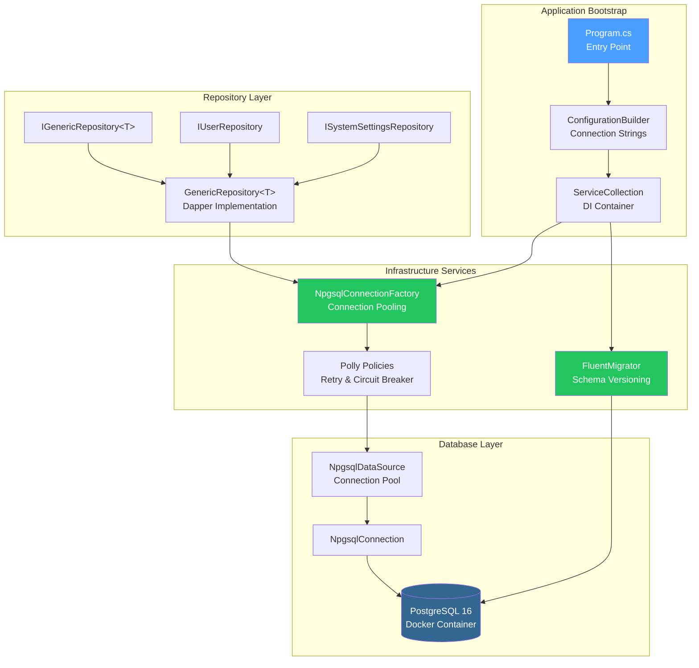
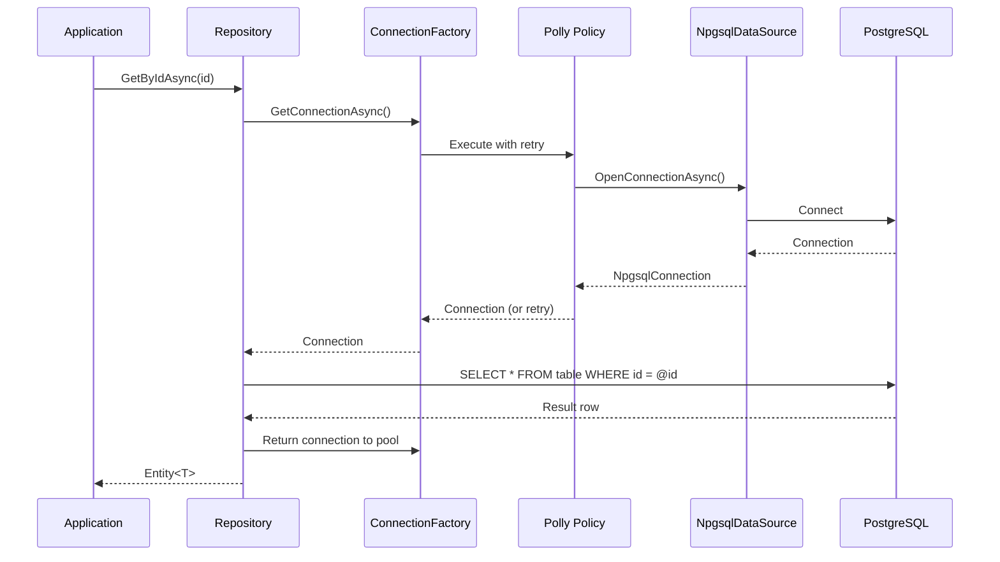

# LCS-DES-005: Design Specification Index — The Memory (Data Layer)

## Document Control

| Field                | Value                                       |
| :------------------- | :------------------------------------------ |
| **Document ID**      | LCS-DES-005-INDEX                           |
| **Feature ID**       | INF-005                                     |
| **Feature Name**     | The Memory (Data Layer & Persistence)       |
| **Target Version**   | v0.0.5                                      |
| **Module Scope**     | Lexichord.Infrastructure                    |
| **Swimlane**         | Infrastructure                              |
| **License Tier**     | Core                                        |
| **Feature Gate Key** | N/A                                         |
| **Status**           | Draft                                       |
| **Last Updated**     | 2026-01-27                                  |

---

## 1. Executive Summary

**v0.0.5** establishes the **persistent data layer** that gives Lexichord its "memory." This release transforms the application from a stateless tool into one capable of storing user data, settings, and application state across sessions using PostgreSQL.

### 1.1 The Problem

Without a persistent data layer:

- User data cannot be persisted between application restarts
- Settings and preferences are lost on every session
- Modules cannot store or retrieve structured data
- The application cannot scale to production workloads
- Future features (documents, style guides, RAG) have no storage foundation

### 1.2 The Solution

Implement a complete data persistence layer with:

- **Docker Orchestration** — docker-compose.yml for PostgreSQL 16 development environment
- **Database Connector** — Npgsql with connection pooling and Polly resilience
- **FluentMigrator Runner** — Migration infrastructure for schema versioning
- **Repository Base** — IGenericRepository<T> with Dapper for type-safe data access

### 1.3 Business Value

| Value                   | Description                                           |
| :---------------------- | :---------------------------------------------------- |
| **Data Persistence**    | User data survives application restarts               |
| **Schema Evolution**    | Migrations enable safe database updates               |
| **Resilience**          | Polly patterns handle transient failures              |
| **Developer Experience**| Docker Compose provides consistent dev environment    |
| **Foundation**          | Enables all data-dependent features (v0.0.6+)         |

---

## 2. Related Documents

### 2.1 Scope Breakdown Document

The detailed scope breakdown for v0.0.5, including all sub-parts, implementation checklists, and acceptance criteria:

| Document                            | Description                                  |
| :---------------------------------- | :------------------------------------------- |
| **[LCS-SBD-005](./LCS-SBD-005.md)** | Scope Breakdown — The Memory (Data Layer)    |

### 2.2 Sub-Part Design Specifications

Each sub-part has its own detailed design specification following the LDS-01 template:

| Sub-Part | Document                              | Title                   | Description                              |
| :------- | :------------------------------------ | :---------------------- | :--------------------------------------- |
| v0.0.5a  | **[LCS-DES-005a](./LCS-DES-005a.md)** | Docker Orchestration    | PostgreSQL 16 development environment    |
| v0.0.5b  | **[LCS-DES-005b](./LCS-DES-005b.md)** | Database Connector      | Npgsql with connection pooling and Polly |
| v0.0.5c  | **[LCS-DES-005c](./LCS-DES-005c.md)** | FluentMigrator Runner   | Migration infrastructure and base schema |
| v0.0.5d  | **[LCS-DES-005d](./LCS-DES-005d.md)** | Repository Base         | IGenericRepository<T> with Dapper        |

---

## 3. Architecture Overview

### 3.1 Component Diagram

### 3.2 Data Flow Sequence

---

## 4. Dependencies

### 4.1 Upstream Dependencies

| Dependency           | Source Version | Purpose                           |
| :------------------- | :------------- | :-------------------------------- |
| DI Container         | v0.0.3a        | Service registration              |
| Serilog Pipeline     | v0.0.3b        | Database operation logging        |
| Configuration        | v0.0.3d        | Connection string management      |
| Module System        | v0.0.4         | Infrastructure module loading     |

### 4.2 NuGet Packages

| Package                          | Version | Purpose                                 |
| :------------------------------- | :------ | :-------------------------------------- |
| `Npgsql`                         | 9.0.x   | PostgreSQL ADO.NET provider             |
| `Dapper`                         | 2.1.x   | Micro ORM for data access               |
| `Dapper.Contrib`                 | 2.0.x   | CRUD extensions for Dapper              |
| `FluentMigrator`                 | 6.x     | Database migration framework            |
| `FluentMigrator.Runner`          | 6.x     | Migration execution                     |
| `FluentMigrator.Runner.Postgres` | 6.x     | PostgreSQL migration support            |
| `Polly`                          | 8.x     | Resilience and transient fault handling |
| `Polly.Extensions`               | 8.x     | DI integration for Polly                |

### 4.3 Downstream Consumers (Future)

| Version | Feature             | Uses From v0.0.5                          |
| :------ | :------------------ | :---------------------------------------- |
| v0.0.6  | Settings Service    | Repository for settings persistence       |
| v0.1.x  | User Management     | User repository and migrations            |
| v0.2.x  | Document Storage    | Repository pattern for documents          |
| v0.3.x  | Style Profiles      | Database tables for style configuration   |
| v0.4.x  | Vector Storage      | pgvector extension on PostgreSQL          |

---

## 5. License Gating Strategy

**N/A** — Data layer infrastructure is Core foundation required by all license tiers. No runtime gating is applied to database connectivity, migrations, or repository access.

---

## 6. Key Interfaces Summary

| Interface                  | Defined In | Purpose                               |
| :------------------------- | :--------- | :------------------------------------ |
| `IConnectionFactory`       | v0.0.5b    | Database connection management        |
| `IGenericRepository<T>`    | v0.0.5d    | Generic CRUD operations               |
| `IUserRepository`          | v0.0.5d    | User-specific data operations         |
| `ISystemSettingsRepository`| v0.0.5d    | System settings data operations       |

| Record/DTO          | Defined In | Purpose                               |
| :------------------ | :--------- | :------------------------------------ |
| `DatabaseOptions`   | v0.0.5b    | Connection configuration              |
| `UserEntity`        | v0.0.5c    | User table mapping                    |
| `SystemSettingEntity`| v0.0.5c   | System settings table mapping         |

---

## 7. Implementation Checklist Summary

| Sub-Part  | Key Deliverables                                             | Est. Hours   | Status |
| :-------- | :----------------------------------------------------------- | :----------- | :----- |
| v0.0.5a   | docker-compose.yml, PostgreSQL 16, pgAdmin, health checks    | 3            | [ ]    |
| v0.0.5b   | NpgsqlDataSource, ConnectionFactory, Polly policies          | 5            | [ ]    |
| v0.0.5c   | FluentMigrator setup, Migration_001_InitSystem, base tables  | 5            | [ ]    |
| v0.0.5d   | IGenericRepository<T>, Dapper implementation, entity mapping | 5            | [ ]    |
| **Total** |                                                              | **18 hours** |        |

See [LCS-SBD-005](./LCS-SBD-005.md) Section 3 for the detailed implementation checklist.

---

## 8. Success Criteria Summary

| Category        | Criterion                                              | Target |
| :-------------- | :----------------------------------------------------- | :----- |
| **Docker**      | `docker-compose up` starts PostgreSQL successfully     | Pass   |
| **Connection**  | Application connects to database on startup            | Pass   |
| **Resilience**  | Transient failures trigger retry with backoff          | Pass   |
| **Migration**   | Migrations run automatically on first startup          | Pass   |
| **Schema**      | Users and SystemSettings tables created                | Pass   |
| **Repository**  | CRUD operations work via IGenericRepository<T>         | Pass   |
| **Performance** | Connection pooling reduces connection overhead         | Pass   |

See individual design specs for detailed acceptance criteria.

---

## 9. Test Coverage Summary

| Sub-Part | Unit Tests                                | Integration Tests                  |
| :------- | :---------------------------------------- | :--------------------------------- |
| v0.0.5a  | N/A (infrastructure)                      | Docker container health check      |
| v0.0.5b  | ConnectionFactory mock tests              | Real database connection test      |
| v0.0.5c  | Migration versioning logic                | Migration execution on test DB     |
| v0.0.5d  | Repository CRUD operations                | End-to-end data persistence        |

See individual design specs for detailed test scenarios.

---

## 10. What This Enables

| Version | Feature             | Depends On v0.0.5                             |
| :------ | :------------------ | :-------------------------------------------- |
| v0.0.6  | Settings Service    | SystemSettings repository                     |
| v0.1.x  | User Preferences    | User repository and authentication tables     |
| v0.2.x  | Document Management | Document/Chapter tables and repositories      |
| v0.3.x  | Style Profiles      | StyleProfile tables and repository            |
| v0.4.x  | Vector Memory       | pgvector extension and embedding storage      |
| v0.5.x  | Knowledge Graph     | Neo4j integration (separate from PostgreSQL)  |

---

## 11. Risks & Mitigations

| Risk                                  | Impact | Mitigation                                        |
| :------------------------------------ | :----- | :------------------------------------------------ |
| Docker not installed on dev machine   | High   | Document Docker Desktop installation requirement  |
| PostgreSQL connection refused         | Medium | Polly retry with exponential backoff              |
| Migration conflicts in team dev       | Medium | Strict migration naming convention with timestamps|
| Connection pool exhaustion            | High   | Configure pool size limits and monitoring         |
| Data loss during development          | Low    | Docker volume persistence, backup scripts         |

---

## Document History

| Version | Date       | Author           | Changes                                                   |
| :------ | :--------- | :--------------- | :-------------------------------------------------------- |
| 1.0     | 2026-01-27 | System Architect | Created INDEX from legacy LCS-INF-005 during standardization |
