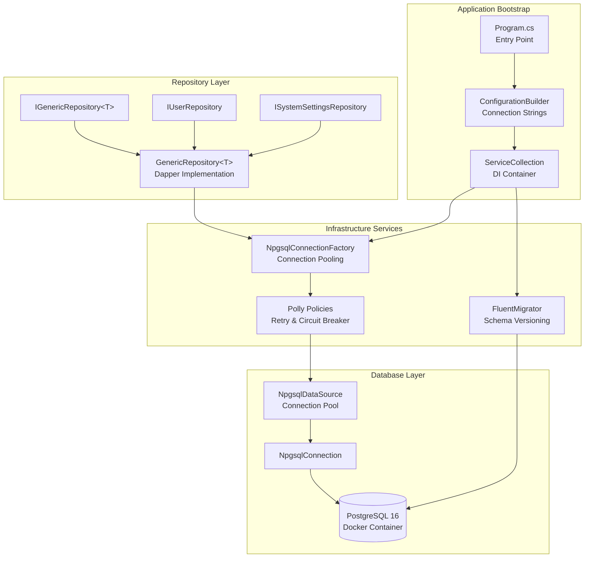

# LCS-01: Feature Design Composition

## 1. Metadata & Categorization

| Field                | Value                                    | Description                                           |
| :------------------- | :--------------------------------------- | :---------------------------------------------------- |
| **Feature ID**       | `INF-005`                                | Infrastructure - The Memory (Data Layer)              |
| **Feature Name**     | Data Layer & Persistence                 | PostgreSQL, Migrations, and Repository Pattern        |
| **Target Version**   | `v0.0.5`                                 | Persistence Foundation Layer                          |
| **Module Scope**     | `Lexichord.Infrastructure`               | Data access and persistence infrastructure            |
| **Swimlane**         | `Infrastructure`                         | The Podium (Platform)                                 |
| **License Tier**     | `Core`                                   | Foundation (Required for all tiers)                   |
| **Feature Gate Key** | N/A                                      | No runtime gating for data layer                      |
| **Author**           | System Architect                         |                                                       |
| **Status**           | **Draft**                                | Pending approval                                      |
| **Last Updated**     | 2026-01-26                               |                                                       |

---

## 2. Executive Summary

### 2.1 The Requirement

Lexichord requires a **persistent data layer** that:

- Stores user data, settings, and application state across sessions.
- Provides reliable, transactional database operations.
- Supports schema evolution through versioned migrations.
- Handles transient failures gracefully with retry and circuit breaker patterns.

Without this foundation:

- User data cannot be persisted between application restarts.
- Settings and preferences are lost on every session.
- Modules cannot store or retrieve structured data.
- The application cannot scale to production workloads.

### 2.2 The Proposed Solution

We **SHALL** implement a complete data persistence layer with:

1. **v0.0.5a: Docker Orchestration** — docker-compose.yml for PostgreSQL 16 development environment.
2. **v0.0.5b: Database Connector** — Npgsql with connection pooling and Polly resilience.
3. **v0.0.5c: FluentMigrator Runner** — Migration_001_InitSystem for Users/SystemSettings tables.
4. **v0.0.5d: Repository Base** — IGenericRepository<T> with Dapper for type-safe data access.

---

## 3. Architecture & Modular Strategy

### 3.1 High-Level Architecture



### 3.2 Dependencies

- **NuGet Packages:**

| Package                              | Version | Purpose                                  |
| :----------------------------------- | :------ | :--------------------------------------- |
| `Npgsql`                             | 9.0.x   | PostgreSQL ADO.NET provider              |
| `Dapper`                             | 2.1.x   | Micro ORM for data access                |
| `Dapper.Contrib`                     | 2.0.x   | CRUD extensions for Dapper               |
| `FluentMigrator`                     | 6.x     | Database migration framework             |
| `FluentMigrator.Runner`              | 6.x     | Migration execution                      |
| `FluentMigrator.Runner.Postgres`     | 6.x     | PostgreSQL migration support             |
| `Polly`                              | 8.x     | Resilience and transient fault handling  |
| `Polly.Extensions`                   | 8.x     | DI integration for Polly                 |

- **Project References:**

| Project                      | Reference Direction              |
| :--------------------------- | :------------------------------- |
| `Lexichord.Infrastructure`   | -> `Lexichord.Abstractions`      |
| `Lexichord.Host`             | -> `Lexichord.Infrastructure`    |
| `Lexichord.Abstractions`     | (No references)                  |

### 3.3 Licensing Behavior

- **N/A:** Data layer infrastructure is Core foundation required by all license tiers.

---

## 4. Decision Tree: Data Access Pattern Selection

```text
START: "How should I access data?"
|
+-- Is this a simple CRUD operation?
|   +-- YES -> Use IGenericRepository<T>
|   |   - GetByIdAsync(id)
|   |   - InsertAsync(entity)
|   |   - UpdateAsync(entity)
|   |   - DeleteAsync(id)
|   |
|   +-- NO -> Continue to next question
|
+-- Is this a custom query with joins or aggregations?
|   +-- YES -> Use QueryAsync<T> with raw SQL
|   |   - repository.QueryAsync<UserWithStats>("SELECT u.*, COUNT(d.Id) as DocCount...")
|   |
|   +-- NO -> Continue to next question
|
+-- Is this a bulk operation (insert/update many)?
|   +-- YES -> Use ExecuteAsync with batch SQL
|   |   - Batch inserts with COPY command
|   |   - Bulk updates with CTE
|   |
|   +-- NO -> Continue to next question
|
+-- Is this a transaction spanning multiple operations?
|   +-- YES -> Use IUnitOfWork pattern
|   |   using var uow = await unitOfWork.BeginAsync();
|   |   await userRepo.InsertAsync(user);
|   |   await settingsRepo.SetValueAsync("key", "value");
|   |   await uow.CommitAsync();
|   |
|   +-- NO -> Something is wrong with the question!
```

---

## 5. Data Contracts

### 5.1 Interfaces (Lexichord.Abstractions)

```csharp
namespace Lexichord.Abstractions.Contracts;

/// <summary>
/// Configuration options for database connectivity.
/// </summary>
/// <remarks>
/// LOGIC: These options are loaded from appsettings.json and environment variables.
/// Connection strings should NEVER be committed to source control.
/// Use environment variables or secrets management in production.
/// </remarks>
public record DatabaseOptions
{
    /// <summary>
    /// The PostgreSQL connection string.
    /// </summary>
    /// <example>Host=localhost;Port=5432;Database=lexichord;Username=lexichord;Password=secret</example>
    public required string ConnectionString { get; init; }

    /// <summary>
    /// Maximum number of connections in the pool.
    /// </summary>
    /// <remarks>Default: 100. Adjust based on expected concurrency.</remarks>
    public int MaxPoolSize { get; init; } = 100;

    /// <summary>
    /// Minimum number of connections to maintain in the pool.
    /// </summary>
    /// <remarks>Default: 10. Keeps warm connections ready.</remarks>
    public int MinPoolSize { get; init; } = 10;

    /// <summary>
    /// Maximum lifetime of a connection in seconds before recycling.
    /// </summary>
    /// <remarks>Default: 300 (5 minutes). Helps with load balancing.</remarks>
    public int ConnectionLifetimeSeconds { get; init; } = 300;

    /// <summary>
    /// Connection timeout in seconds.
    /// </summary>
    public int ConnectionTimeoutSeconds { get; init; } = 30;

    /// <summary>
    /// Command timeout in seconds for query execution.
    /// </summary>
    public int CommandTimeoutSeconds { get; init; } = 30;

    /// <summary>
    /// Enable multiplexing for improved throughput.
    /// </summary>
    /// <remarks>Multiplexing allows multiple commands on a single connection.</remarks>
    public bool EnableMultiplexing { get; init; } = true;
}

/// <summary>
/// Factory for creating database connections with pooling support.
/// </summary>
public interface IDbConnectionFactory
{
    /// <summary>
    /// Creates and opens a database connection from the pool.
    /// </summary>
    /// <param name="cancellationToken">Cancellation token.</param>
    /// <returns>An open database connection.</returns>
    /// <remarks>
    /// LOGIC: Connections are pooled and reused. Always dispose connections
    /// when done to return them to the pool.
    /// </remarks>
    Task<IDbConnection> CreateConnectionAsync(CancellationToken cancellationToken = default);

    /// <summary>
    /// Gets the underlying data source for advanced scenarios.
    /// </summary>
    NpgsqlDataSource DataSource { get; }
}

/// <summary>
/// Generic repository interface for CRUD operations.
/// </summary>
/// <typeparam name="T">The entity type.</typeparam>
/// <typeparam name="TId">The primary key type.</typeparam>
public interface IGenericRepository<T, TId> where T : class
{
    /// <summary>
    /// Gets an entity by its primary key.
    /// </summary>
    /// <param name="id">The primary key value.</param>
    /// <param name="cancellationToken">Cancellation token.</param>
    /// <returns>The entity, or null if not found.</returns>
    Task<T?> GetByIdAsync(TId id, CancellationToken cancellationToken = default);

    /// <summary>
    /// Gets all entities of this type.
    /// </summary>
    /// <param name="cancellationToken">Cancellation token.</param>
    /// <returns>All entities.</returns>
    /// <remarks>Use with caution on large tables. Consider pagination.</remarks>
    Task<IEnumerable<T>> GetAllAsync(CancellationToken cancellationToken = default);

    /// <summary>
    /// Inserts a new entity.
    /// </summary>
    /// <param name="entity">The entity to insert.</param>
    /// <param name="cancellationToken">Cancellation token.</param>
    /// <returns>The generated primary key.</returns>
    Task<TId> InsertAsync(T entity, CancellationToken cancellationToken = default);

    /// <summary>
    /// Updates an existing entity.
    /// </summary>
    /// <param name="entity">The entity with updated values.</param>
    /// <param name="cancellationToken">Cancellation token.</param>
    /// <returns>True if the entity was updated, false if not found.</returns>
    Task<bool> UpdateAsync(T entity, CancellationToken cancellationToken = default);

    /// <summary>
    /// Deletes an entity by its primary key.
    /// </summary>
    /// <param name="id">The primary key value.</param>
    /// <param name="cancellationToken">Cancellation token.</param>
    /// <returns>True if the entity was deleted, false if not found.</returns>
    Task<bool> DeleteAsync(TId id, CancellationToken cancellationToken = default);

    /// <summary>
    /// Executes a custom query and maps results to the specified type.
    /// </summary>
    /// <typeparam name="TResult">The result type.</typeparam>
    /// <param name="sql">The SQL query.</param>
    /// <param name="parameters">Query parameters.</param>
    /// <param name="cancellationToken">Cancellation token.</param>
    /// <returns>The query results.</returns>
    Task<IEnumerable<TResult>> QueryAsync<TResult>(
        string sql,
        object? parameters = null,
        CancellationToken cancellationToken = default);

    /// <summary>
    /// Executes a non-query command (INSERT, UPDATE, DELETE).
    /// </summary>
    /// <param name="sql">The SQL command.</param>
    /// <param name="parameters">Command parameters.</param>
    /// <param name="cancellationToken">Cancellation token.</param>
    /// <returns>The number of affected rows.</returns>
    Task<int> ExecuteAsync(
        string sql,
        object? parameters = null,
        CancellationToken cancellationToken = default);
}

/// <summary>
/// Unit of work pattern for transactional operations.
/// </summary>
public interface IUnitOfWork : IAsyncDisposable
{
    /// <summary>
    /// Gets the database connection for this unit of work.
    /// </summary>
    IDbConnection Connection { get; }

    /// <summary>
    /// Gets the active transaction.
    /// </summary>
    IDbTransaction? Transaction { get; }

    /// <summary>
    /// Begins a new transaction.
    /// </summary>
    /// <param name="isolationLevel">The transaction isolation level.</param>
    /// <param name="cancellationToken">Cancellation token.</param>
    Task BeginTransactionAsync(
        IsolationLevel isolationLevel = IsolationLevel.ReadCommitted,
        CancellationToken cancellationToken = default);

    /// <summary>
    /// Commits the current transaction.
    /// </summary>
    /// <param name="cancellationToken">Cancellation token.</param>
    Task CommitAsync(CancellationToken cancellationToken = default);

    /// <summary>
    /// Rolls back the current transaction.
    /// </summary>
    /// <param name="cancellationToken">Cancellation token.</param>
    Task RollbackAsync(CancellationToken cancellationToken = default);
}
```

### 5.2 Entity Models

```csharp
namespace Lexichord.Abstractions.Entities;

/// <summary>
/// Base entity with common audit fields.
/// </summary>
public abstract record EntityBase
{
    /// <summary>
    /// When the entity was created.
    /// </summary>
    public DateTimeOffset CreatedAt { get; init; } = DateTimeOffset.UtcNow;

    /// <summary>
    /// When the entity was last updated.
    /// </summary>
    public DateTimeOffset UpdatedAt { get; init; } = DateTimeOffset.UtcNow;
}

/// <summary>
/// User entity representing a Lexichord user account.
/// </summary>
/// <remarks>
/// LOGIC: Users are identified by a UUID primary key for distributed systems compatibility.
/// Email is unique and serves as the login identifier.
/// PasswordHash is nullable to support OAuth-only users.
/// </remarks>
[Table("Users")]
public record User : EntityBase
{
    /// <summary>
    /// Unique identifier for the user.
    /// </summary>
    [Key]
    public Guid Id { get; init; } = Guid.NewGuid();

    /// <summary>
    /// User's email address (unique, used for login).
    /// </summary>
    public required string Email { get; init; }

    /// <summary>
    /// Display name shown in the UI.
    /// </summary>
    public required string DisplayName { get; init; }

    /// <summary>
    /// Hashed password (null for OAuth-only users).
    /// </summary>
    public string? PasswordHash { get; init; }

    /// <summary>
    /// Whether the user account is active.
    /// </summary>
    public bool IsActive { get; init; } = true;
}

/// <summary>
/// System setting entity for key-value configuration storage.
/// </summary>
/// <remarks>
/// LOGIC: SystemSettings stores application-wide configuration that may change
/// without requiring a restart. Keys are unique and serve as the primary key.
/// Values are stored as text and parsed by the consuming code.
/// </remarks>
[Table("SystemSettings")]
public record SystemSetting
{
    /// <summary>
    /// Setting key (primary key).
    /// </summary>
    [Key]
    [ExplicitKey]
    public required string Key { get; init; }

    /// <summary>
    /// Setting value as text.
    /// </summary>
    public required string Value { get; init; }

    /// <summary>
    /// Human-readable description of the setting.
    /// </summary>
    public string? Description { get; init; }

    /// <summary>
    /// When the setting was last updated.
    /// </summary>
    public DateTimeOffset UpdatedAt { get; init; } = DateTimeOffset.UtcNow;
}
```

### 5.3 Repository Interfaces

```csharp
namespace Lexichord.Abstractions.Contracts;

/// <summary>
/// Repository for User entity operations.
/// </summary>
public interface IUserRepository : IGenericRepository<User, Guid>
{
    /// <summary>
    /// Gets a user by email address.
    /// </summary>
    /// <param name="email">The email address.</param>
    /// <param name="cancellationToken">Cancellation token.</param>
    /// <returns>The user, or null if not found.</returns>
    Task<User?> GetByEmailAsync(string email, CancellationToken cancellationToken = default);

    /// <summary>
    /// Gets all active users.
    /// </summary>
    /// <param name="cancellationToken">Cancellation token.</param>
    /// <returns>All active users.</returns>
    Task<IEnumerable<User>> GetActiveUsersAsync(CancellationToken cancellationToken = default);

    /// <summary>
    /// Checks if an email address is already registered.
    /// </summary>
    /// <param name="email">The email address.</param>
    /// <param name="cancellationToken">Cancellation token.</param>
    /// <returns>True if the email exists.</returns>
    Task<bool> EmailExistsAsync(string email, CancellationToken cancellationToken = default);
}

/// <summary>
/// Repository for SystemSettings operations.
/// </summary>
public interface ISystemSettingsRepository
{
    /// <summary>
    /// Gets a setting value by key.
    /// </summary>
    /// <param name="key">The setting key.</param>
    /// <param name="cancellationToken">Cancellation token.</param>
    /// <returns>The setting, or null if not found.</returns>
    Task<SystemSetting?> GetByKeyAsync(string key, CancellationToken cancellationToken = default);

    /// <summary>
    /// Gets a setting value by key, returning a default if not found.
    /// </summary>
    /// <param name="key">The setting key.</param>
    /// <param name="defaultValue">The default value if not found.</param>
    /// <param name="cancellationToken">Cancellation token.</param>
    /// <returns>The setting value or default.</returns>
    Task<string> GetValueAsync(string key, string defaultValue = "", CancellationToken cancellationToken = default);

    /// <summary>
    /// Sets a setting value (upsert).
    /// </summary>
    /// <param name="key">The setting key.</param>
    /// <param name="value">The setting value.</param>
    /// <param name="description">Optional description.</param>
    /// <param name="cancellationToken">Cancellation token.</param>
    Task SetValueAsync(string key, string value, string? description = null, CancellationToken cancellationToken = default);

    /// <summary>
    /// Gets all settings.
    /// </summary>
    /// <param name="cancellationToken">Cancellation token.</param>
    /// <returns>All settings.</returns>
    Task<IEnumerable<SystemSetting>> GetAllAsync(CancellationToken cancellationToken = default);

    /// <summary>
    /// Deletes a setting by key.
    /// </summary>
    /// <param name="key">The setting key.</param>
    /// <param name="cancellationToken">Cancellation token.</param>
    /// <returns>True if deleted, false if not found.</returns>
    Task<bool> DeleteAsync(string key, CancellationToken cancellationToken = default);
}
```

### 5.4 Lexichord.Infrastructure.csproj

```xml
<Project Sdk="Microsoft.NET.Sdk">

  <PropertyGroup>
    <TargetFramework>net9.0</TargetFramework>
    <ImplicitUsings>enable</ImplicitUsings>
    <Nullable>enable</Nullable>
    <LangVersion>13.0</LangVersion>
  </PropertyGroup>

  <ItemGroup>
    <!-- Database Connectivity -->
    <PackageReference Include="Npgsql" Version="9.0.2" />
    <PackageReference Include="Dapper" Version="2.1.35" />
    <PackageReference Include="Dapper.Contrib" Version="2.0.78" />

    <!-- Migrations -->
    <PackageReference Include="FluentMigrator" Version="6.2.0" />
    <PackageReference Include="FluentMigrator.Runner" Version="6.2.0" />
    <PackageReference Include="FluentMigrator.Runner.Postgres" Version="6.2.0" />

    <!-- Resilience -->
    <PackageReference Include="Polly" Version="8.5.0" />
    <PackageReference Include="Polly.Extensions" Version="8.5.0" />
    <PackageReference Include="Microsoft.Extensions.Http.Resilience" Version="9.0.0" />

    <!-- DI & Logging -->
    <PackageReference Include="Microsoft.Extensions.DependencyInjection.Abstractions" Version="9.0.0" />
    <PackageReference Include="Microsoft.Extensions.Logging.Abstractions" Version="9.0.0" />
    <PackageReference Include="Microsoft.Extensions.Options" Version="9.0.0" />
  </ItemGroup>

  <ItemGroup>
    <ProjectReference Include="..\Lexichord.Abstractions\Lexichord.Abstractions.csproj" />
  </ItemGroup>

</Project>
```

---

## 6. Implementation Logic

### 6.1 NpgsqlConnectionFactory Implementation

```csharp
using System.Data;
using Microsoft.Extensions.Logging;
using Microsoft.Extensions.Options;
using Npgsql;
using Polly;
using Polly.CircuitBreaker;
using Polly.Retry;
using Lexichord.Abstractions.Contracts;

namespace Lexichord.Infrastructure.Data;

/// <summary>
/// Factory for creating PostgreSQL database connections with pooling and resilience.
/// </summary>
/// <remarks>
/// LOGIC: This factory wraps NpgsqlDataSource which manages connection pooling internally.
/// Polly policies provide retry logic for transient failures and circuit breaker for
/// catastrophic failures. All connection attempts are logged for observability.
/// </remarks>
public sealed class NpgsqlConnectionFactory : IDbConnectionFactory, IDisposable
{
    private readonly NpgsqlDataSource _dataSource;
    private readonly ILogger<NpgsqlConnectionFactory> _logger;
    private readonly ResiliencePipeline _resiliencePipeline;

    public NpgsqlConnectionFactory(
        IOptions<DatabaseOptions> options,
        ILogger<NpgsqlConnectionFactory> logger)
    {
        _logger = logger;

        var dbOptions = options.Value;

        // LOGIC: Build data source with connection pooling settings
        var dataSourceBuilder = new NpgsqlDataSourceBuilder(dbOptions.ConnectionString);

        // Configure pooling
        dataSourceBuilder.ConnectionString = new NpgsqlConnectionStringBuilder(dbOptions.ConnectionString)
        {
            MaxPoolSize = dbOptions.MaxPoolSize,
            MinPoolSize = dbOptions.MinPoolSize,
            ConnectionIdleLifetime = dbOptions.ConnectionLifetimeSeconds,
            Timeout = dbOptions.ConnectionTimeoutSeconds,
            CommandTimeout = dbOptions.CommandTimeoutSeconds,
            Multiplexing = dbOptions.EnableMultiplexing
        }.ConnectionString;

        _dataSource = dataSourceBuilder.Build();

        // LOGIC: Build resilience pipeline with retry and circuit breaker
        _resiliencePipeline = new ResiliencePipelineBuilder()
            .AddRetry(new RetryStrategyOptions
            {
                ShouldHandle = new PredicateBuilder()
                    .Handle<NpgsqlException>(ex => IsTransientError(ex))
                    .Handle<TimeoutException>(),
                MaxRetryAttempts = 4,
                Delay = TimeSpan.FromSeconds(1),
                BackoffType = DelayBackoffType.Exponential,
                UseJitter = true,
                OnRetry = args =>
                {
                    _logger.LogWarning(
                        args.Outcome.Exception,
                        "Database connection retry {AttemptNumber} of {MaxRetries} after {Delay}ms",
                        args.AttemptNumber,
                        4,
                        args.RetryDelay.TotalMilliseconds);
                    return ValueTask.CompletedTask;
                }
            })
            .AddCircuitBreaker(new CircuitBreakerStrategyOptions
            {
                ShouldHandle = new PredicateBuilder()
                    .Handle<NpgsqlException>(ex => IsTransientError(ex))
                    .Handle<TimeoutException>(),
                FailureRatio = 0.5,
                SamplingDuration = TimeSpan.FromSeconds(30),
                MinimumThroughput = 5,
                BreakDuration = TimeSpan.FromSeconds(30),
                OnOpened = args =>
                {
                    _logger.LogError(
                        args.Outcome.Exception,
                        "Circuit breaker OPENED for database connections. Duration: {Duration}s",
                        args.BreakDuration.TotalSeconds);
                    return ValueTask.CompletedTask;
                },
                OnClosed = args =>
                {
                    _logger.LogInformation("Circuit breaker CLOSED. Database connections restored.");
                    return ValueTask.CompletedTask;
                },
                OnHalfOpened = args =>
                {
                    _logger.LogInformation("Circuit breaker HALF-OPEN. Testing database connection...");
                    return ValueTask.CompletedTask;
                }
            })
            .Build();

        _logger.LogInformation(
            "Database connection factory initialized. Pool: {MinPool}-{MaxPool}, Multiplexing: {Multiplexing}",
            dbOptions.MinPoolSize,
            dbOptions.MaxPoolSize,
            dbOptions.EnableMultiplexing);
    }

    /// <inheritdoc/>
    public NpgsqlDataSource DataSource => _dataSource;

    /// <inheritdoc/>
    public async Task<IDbConnection> CreateConnectionAsync(CancellationToken cancellationToken = default)
    {
        return await _resiliencePipeline.ExecuteAsync(async ct =>
        {
            var connection = await _dataSource.OpenConnectionAsync(ct);
            _logger.LogDebug("Database connection opened from pool");
            return connection;
        }, cancellationToken);
    }

    /// <summary>
    /// Determines if an NpgsqlException is transient and should be retried.
    /// </summary>
    private static bool IsTransientError(NpgsqlException ex)
    {
        // LOGIC: PostgreSQL error codes that are typically transient
        // https://www.postgresql.org/docs/current/errcodes-appendix.html
        return ex.SqlState switch
        {
            "08000" => true,  // connection_exception
            "08003" => true,  // connection_does_not_exist
            "08006" => true,  // connection_failure
            "08001" => true,  // sqlclient_unable_to_establish_sqlconnection
            "08004" => true,  // sqlserver_rejected_establishment_of_sqlconnection
            "57P01" => true,  // admin_shutdown
            "57P02" => true,  // crash_shutdown
            "57P03" => true,  // cannot_connect_now
            "40001" => true,  // serialization_failure
            "40P01" => true,  // deadlock_detected
            _ => ex.IsTransient
        };
    }

    public void Dispose()
    {
        _dataSource.Dispose();
        _logger.LogDebug("Database connection factory disposed");
    }
}
```

### 6.2 GenericRepository Implementation

```csharp
using System.Data;
using Dapper;
using Dapper.Contrib.Extensions;
using Microsoft.Extensions.Logging;
using Lexichord.Abstractions.Contracts;

namespace Lexichord.Infrastructure.Data;

/// <summary>
/// Generic repository implementation using Dapper for data access.
/// </summary>
/// <typeparam name="T">The entity type.</typeparam>
/// <typeparam name="TId">The primary key type.</typeparam>
/// <remarks>
/// LOGIC: This repository provides a consistent interface for CRUD operations.
/// All operations use parameterized queries to prevent SQL injection.
/// Connection management is handled by the factory; connections are returned to
/// the pool when the using statement completes.
/// </remarks>
public class GenericRepository<T, TId>(
    IDbConnectionFactory connectionFactory,
    ILogger<GenericRepository<T, TId>> logger) : IGenericRepository<T, TId>
    where T : class
{
    private readonly string _tableName = GetTableName();

    /// <inheritdoc/>
    public async Task<T?> GetByIdAsync(TId id, CancellationToken cancellationToken = default)
    {
        await using var connection = (NpgsqlConnection)await connectionFactory.CreateConnectionAsync(cancellationToken);

        var result = await connection.GetAsync<T>(id);

        logger.LogDebug(
            "GetById {TableName} with Id={Id}: {Found}",
            _tableName, id, result is not null ? "Found" : "Not Found");

        return result;
    }

    /// <inheritdoc/>
    public async Task<IEnumerable<T>> GetAllAsync(CancellationToken cancellationToken = default)
    {
        await using var connection = (NpgsqlConnection)await connectionFactory.CreateConnectionAsync(cancellationToken);

        var results = await connection.GetAllAsync<T>();
        var count = results.Count();

        logger.LogDebug("GetAll {TableName}: {Count} records", _tableName, count);

        return results;
    }

    /// <inheritdoc/>
    public async Task<TId> InsertAsync(T entity, CancellationToken cancellationToken = default)
    {
        await using var connection = (NpgsqlConnection)await connectionFactory.CreateConnectionAsync(cancellationToken);

        var id = await connection.InsertAsync(entity);

        logger.LogDebug("Insert {TableName}: Id={Id}", _tableName, id);

        // LOGIC: Dapper.Contrib returns long for auto-increment, cast to TId
        return (TId)Convert.ChangeType(id, typeof(TId));
    }

    /// <inheritdoc/>
    public async Task<bool> UpdateAsync(T entity, CancellationToken cancellationToken = default)
    {
        await using var connection = (NpgsqlConnection)await connectionFactory.CreateConnectionAsync(cancellationToken);

        var updated = await connection.UpdateAsync(entity);

        logger.LogDebug("Update {TableName}: {Result}", _tableName, updated ? "Success" : "Not Found");

        return updated;
    }

    /// <inheritdoc/>
    public async Task<bool> DeleteAsync(TId id, CancellationToken cancellationToken = default)
    {
        await using var connection = (NpgsqlConnection)await connectionFactory.CreateConnectionAsync(cancellationToken);

        // LOGIC: Dapper.Contrib.Delete requires the entity, so we fetch first
        var entity = await connection.GetAsync<T>(id);
        if (entity is null)
        {
            logger.LogDebug("Delete {TableName} Id={Id}: Not Found", _tableName, id);
            return false;
        }

        var deleted = await connection.DeleteAsync(entity);

        logger.LogDebug("Delete {TableName} Id={Id}: {Result}", _tableName, id, deleted ? "Deleted" : "Failed");

        return deleted;
    }

    /// <inheritdoc/>
    public async Task<IEnumerable<TResult>> QueryAsync<TResult>(
        string sql,
        object? parameters = null,
        CancellationToken cancellationToken = default)
    {
        await using var connection = (NpgsqlConnection)await connectionFactory.CreateConnectionAsync(cancellationToken);

        var command = new CommandDefinition(sql, parameters, cancellationToken: cancellationToken);
        var results = await connection.QueryAsync<TResult>(command);
        var count = results.Count();

        logger.LogDebug("Query executed: {Count} results", count);

        return results;
    }

    /// <inheritdoc/>
    public async Task<int> ExecuteAsync(
        string sql,
        object? parameters = null,
        CancellationToken cancellationToken = default)
    {
        await using var connection = (NpgsqlConnection)await connectionFactory.CreateConnectionAsync(cancellationToken);

        var command = new CommandDefinition(sql, parameters, cancellationToken: cancellationToken);
        var affected = await connection.ExecuteAsync(command);

        logger.LogDebug("Execute completed: {Affected} rows affected", affected);

        return affected;
    }

    /// <summary>
    /// Gets the table name from the entity type's Table attribute.
    /// </summary>
    private static string GetTableName()
    {
        var tableAttr = typeof(T).GetCustomAttributes(typeof(TableAttribute), true)
            .FirstOrDefault() as TableAttribute;

        return tableAttr?.Name ?? typeof(T).Name + "s";
    }
}
```

### 6.3 UnitOfWork Implementation

```csharp
using System.Data;
using Microsoft.Extensions.Logging;
using Npgsql;
using Lexichord.Abstractions.Contracts;

namespace Lexichord.Infrastructure.Data;

/// <summary>
/// Unit of work implementation for transactional operations.
/// </summary>
/// <remarks>
/// LOGIC: The unit of work pattern ensures that multiple repository operations
/// can be executed within a single database transaction. If any operation fails,
/// all changes are rolled back.
/// </remarks>
public sealed class UnitOfWork : IUnitOfWork
{
    private readonly NpgsqlConnection _connection;
    private readonly ILogger<UnitOfWork> _logger;
    private NpgsqlTransaction? _transaction;
    private bool _disposed;

    public UnitOfWork(
        IDbConnectionFactory connectionFactory,
        ILogger<UnitOfWork> logger)
    {
        _connection = (NpgsqlConnection)connectionFactory.CreateConnectionAsync().GetAwaiter().GetResult();
        _logger = logger;

        _logger.LogDebug("UnitOfWork created with connection");
    }

    /// <inheritdoc/>
    public IDbConnection Connection => _connection;

    /// <inheritdoc/>
    public IDbTransaction? Transaction => _transaction;

    /// <inheritdoc/>
    public async Task BeginTransactionAsync(
        IsolationLevel isolationLevel = IsolationLevel.ReadCommitted,
        CancellationToken cancellationToken = default)
    {
        if (_transaction is not null)
        {
            throw new InvalidOperationException("Transaction already started");
        }

        _transaction = await _connection.BeginTransactionAsync(isolationLevel, cancellationToken);

        _logger.LogDebug("Transaction started with isolation level {IsolationLevel}", isolationLevel);
    }

    /// <inheritdoc/>
    public async Task CommitAsync(CancellationToken cancellationToken = default)
    {
        if (_transaction is null)
        {
            throw new InvalidOperationException("No active transaction to commit");
        }

        await _transaction.CommitAsync(cancellationToken);
        await _transaction.DisposeAsync();
        _transaction = null;

        _logger.LogDebug("Transaction committed");
    }

    /// <inheritdoc/>
    public async Task RollbackAsync(CancellationToken cancellationToken = default)
    {
        if (_transaction is null)
        {
            _logger.LogWarning("Rollback called but no active transaction");
            return;
        }

        await _transaction.RollbackAsync(cancellationToken);
        await _transaction.DisposeAsync();
        _transaction = null;

        _logger.LogDebug("Transaction rolled back");
    }

    /// <inheritdoc/>
    public async ValueTask DisposeAsync()
    {
        if (_disposed) return;

        if (_transaction is not null)
        {
            _logger.LogWarning("UnitOfWork disposed with uncommitted transaction, rolling back");
            await _transaction.RollbackAsync();
            await _transaction.DisposeAsync();
        }

        await _connection.DisposeAsync();
        _disposed = true;

        _logger.LogDebug("UnitOfWork disposed");
    }
}
```

---

## 7. Use Cases & User Stories

### 7.1 User Stories

| ID    | Role      | Story                                                                                          | Acceptance Criteria                                      |
| :---- | :-------- | :--------------------------------------------------------------------------------------------- | :------------------------------------------------------- |
| US-01 | Developer | As a developer, I want to start PostgreSQL with one command so I can focus on coding.          | `docker compose up -d` starts the database.              |
| US-02 | Developer | As a developer, I want database schema to be versioned so I can track changes over time.       | Migrations are stored in source control.                 |
| US-03 | Developer | As a developer, I want connection failures to be retried automatically.                        | Transient failures retry with exponential backoff.       |
| US-04 | Developer | As a developer, I want CRUD operations to be consistent across all entities.                   | All entities use IGenericRepository<T>.                  |
| US-05 | User      | As a user, I want my data to persist across application restarts.                              | User data survives app restart.                          |

### 7.2 Use Cases

#### UC-01: Database Startup

**Preconditions:**

- Docker is installed and running.
- `docker-compose.yml` exists in repository root.

**Flow:**

1. Developer runs `docker compose up -d`.
2. PostgreSQL container starts.
3. Health check runs `pg_isready` every 10 seconds.
4. Container marked healthy after successful check.
5. Application can connect to `localhost:5432`.

**Postconditions:**

- PostgreSQL accepting connections.
- Data volume created for persistence.

---

#### UC-02: Schema Migration

**Preconditions:**

- PostgreSQL is running and healthy.
- New migration class exists in `Migrations/` directory.

**Flow:**

1. Developer runs `dotnet run -- --migrate` or starts application.
2. FluentMigrator scans for migration classes.
3. Compares migrations against `VersionInfo` table.
4. Executes pending migrations in version order.
5. Updates `VersionInfo` with applied versions.

**Postconditions:**

- Database schema matches latest migration.
- `VersionInfo` table contains all applied versions.

---

#### UC-03: Transient Failure Recovery

**Preconditions:**

- Application is running.
- PostgreSQL container is temporarily unavailable.

**Flow:**

1. Application attempts database query.
2. Connection fails with transient error.
3. Polly retry policy activates.
4. First retry after 1 second fails.
5. Second retry after 2 seconds succeeds (container recovered).
6. Query completes successfully.

**Postconditions:**

- Application recovered without user intervention.
- Retry attempts logged for diagnostics.

---

#### UC-04: Circuit Breaker Activation

**Preconditions:**

- Application is running under load.
- PostgreSQL container crashes repeatedly.

**Flow:**

1. Multiple requests fail with transient errors.
2. 5 failures occur within 30 seconds.
3. Circuit breaker opens.
4. Subsequent requests fail immediately with BrokenCircuitException.
5. After 30 seconds, circuit enters half-open state.
6. Test request sent; if successful, circuit closes.

**Postconditions:**

- Failed requests did not overwhelm the database.
- Application preserved resources during outage.

---

## 8. Observability & Logging

### 8.1 Log Events

| Level       | Context                  | Message Template                                                                 |
| :---------- | :----------------------- | :------------------------------------------------------------------------------- |
| Information | NpgsqlConnectionFactory  | `Database connection factory initialized. Pool: {MinPool}-{MaxPool}, Multiplexing: {Multiplexing}` |
| Debug       | NpgsqlConnectionFactory  | `Database connection opened from pool`                                           |
| Warning     | NpgsqlConnectionFactory  | `Database connection retry {AttemptNumber} of {MaxRetries} after {Delay}ms`      |
| Error       | NpgsqlConnectionFactory  | `Circuit breaker OPENED for database connections. Duration: {Duration}s`         |
| Information | NpgsqlConnectionFactory  | `Circuit breaker CLOSED. Database connections restored.`                         |
| Debug       | GenericRepository        | `GetById {TableName} with Id={Id}: {Found}`                                      |
| Debug       | GenericRepository        | `GetAll {TableName}: {Count} records`                                            |
| Debug       | GenericRepository        | `Insert {TableName}: Id={Id}`                                                    |
| Debug       | GenericRepository        | `Update {TableName}: {Result}`                                                   |
| Debug       | GenericRepository        | `Delete {TableName} Id={Id}: {Result}`                                           |
| Debug       | GenericRepository        | `Query executed: {Count} results`                                                |
| Debug       | GenericRepository        | `Execute completed: {Affected} rows affected`                                    |
| Debug       | UnitOfWork               | `Transaction started with isolation level {IsolationLevel}`                      |
| Debug       | UnitOfWork               | `Transaction committed`                                                          |
| Debug       | UnitOfWork               | `Transaction rolled back`                                                        |
| Warning     | UnitOfWork               | `UnitOfWork disposed with uncommitted transaction, rolling back`                 |
| Information | MigrationRunner          | `Running migration {Version}: {Description}`                                     |
| Information | MigrationRunner          | `Migration completed: {Version}`                                                 |
| Error       | MigrationRunner          | `Migration {Version} failed: {Error}`                                            |

### 8.2 Metrics (Future)

| Metric Name                          | Type    | Description                                |
| :----------------------------------- | :------ | :----------------------------------------- |
| `db_connection_pool_size`            | Gauge   | Current number of connections in pool      |
| `db_connection_acquire_duration_ms`  | Histogram | Time to acquire connection from pool     |
| `db_query_duration_ms`               | Histogram | Query execution time                     |
| `db_circuit_breaker_state`           | Gauge   | Circuit breaker state (0=closed, 1=open)   |
| `db_retry_count`                     | Counter | Total number of retry attempts             |

---

## 9. Unit Testing Requirements

### 9.1 Test Scenarios

#### Connection Factory Tests

```csharp
[TestFixture]
[Category("Unit")]
public class NpgsqlConnectionFactoryTests
{
    private Mock<ILogger<NpgsqlConnectionFactory>> _mockLogger = null!;
    private NpgsqlConnectionFactory _sut = null!;

    [SetUp]
    public void SetUp()
    {
        _mockLogger = new Mock<ILogger<NpgsqlConnectionFactory>>();

        var options = Options.Create(new DatabaseOptions
        {
            ConnectionString = "Host=localhost;Database=test;Username=test;Password=test",
            MaxPoolSize = 10,
            MinPoolSize = 1,
            EnableMultiplexing = false
        });

        _sut = new NpgsqlConnectionFactory(options, _mockLogger.Object);
    }

    [TearDown]
    public void TearDown()
    {
        _sut.Dispose();
    }

    [Test]
    public void Constructor_LogsInitialization()
    {
        // Assert
        _mockLogger.Verify(
            x => x.Log(
                LogLevel.Information,
                It.IsAny<EventId>(),
                It.Is<It.IsAnyType>((v, t) => v.ToString()!.Contains("Database connection factory initialized")),
                null,
                It.IsAny<Func<It.IsAnyType, Exception?, string>>()),
            Times.Once);
    }

    [Test]
    public void DataSource_ReturnsNonNull()
    {
        // Assert
        Assert.That(_sut.DataSource, Is.Not.Null);
    }
}
```

#### Repository Tests

```csharp
[TestFixture]
[Category("Integration")]
public class GenericRepositoryTests
{
    private IDbConnectionFactory _connectionFactory = null!;
    private GenericRepository<User, Guid> _sut = null!;
    private Mock<ILogger<GenericRepository<User, Guid>>> _mockLogger = null!;

    [SetUp]
    public async Task SetUp()
    {
        // Integration tests require running PostgreSQL
        var options = Options.Create(new DatabaseOptions
        {
            ConnectionString = GetTestConnectionString()
        });

        var factoryLogger = new Mock<ILogger<NpgsqlConnectionFactory>>();
        _connectionFactory = new NpgsqlConnectionFactory(options, factoryLogger.Object);

        _mockLogger = new Mock<ILogger<GenericRepository<User, Guid>>>();
        _sut = new GenericRepository<User, Guid>(_connectionFactory, _mockLogger.Object);

        // Clean up test data
        await _sut.ExecuteAsync("DELETE FROM \"Users\" WHERE \"Email\" LIKE '%@test.local'");
    }

    [Test]
    public async Task InsertAsync_ReturnsGeneratedId()
    {
        // Arrange
        var user = new User
        {
            Email = $"test-{Guid.NewGuid()}@test.local",
            DisplayName = "Test User"
        };

        // Act
        var id = await _sut.InsertAsync(user);

        // Assert
        Assert.That(id, Is.Not.EqualTo(Guid.Empty));
    }

    [Test]
    public async Task GetByIdAsync_AfterInsert_ReturnsEntity()
    {
        // Arrange
        var user = new User
        {
            Email = $"test-{Guid.NewGuid()}@test.local",
            DisplayName = "Test User"
        };
        var id = await _sut.InsertAsync(user);

        // Act
        var result = await _sut.GetByIdAsync(id);

        // Assert
        Assert.That(result, Is.Not.Null);
        Assert.That(result!.Email, Is.EqualTo(user.Email));
        Assert.That(result.DisplayName, Is.EqualTo(user.DisplayName));
    }

    [Test]
    public async Task UpdateAsync_ModifiesEntity()
    {
        // Arrange
        var user = new User
        {
            Email = $"test-{Guid.NewGuid()}@test.local",
            DisplayName = "Original Name"
        };
        var id = await _sut.InsertAsync(user);
        var inserted = await _sut.GetByIdAsync(id);

        var updated = inserted! with { DisplayName = "Updated Name" };

        // Act
        var result = await _sut.UpdateAsync(updated);
        var retrieved = await _sut.GetByIdAsync(id);

        // Assert
        Assert.That(result, Is.True);
        Assert.That(retrieved!.DisplayName, Is.EqualTo("Updated Name"));
    }

    [Test]
    public async Task DeleteAsync_RemovesEntity()
    {
        // Arrange
        var user = new User
        {
            Email = $"test-{Guid.NewGuid()}@test.local",
            DisplayName = "To Be Deleted"
        };
        var id = await _sut.InsertAsync(user);

        // Act
        var deleted = await _sut.DeleteAsync(id);
        var result = await _sut.GetByIdAsync(id);

        // Assert
        Assert.That(deleted, Is.True);
        Assert.That(result, Is.Null);
    }

    [Test]
    public async Task QueryAsync_ReturnsMatchingRecords()
    {
        // Arrange
        var email = $"query-test-{Guid.NewGuid()}@test.local";
        var user = new User { Email = email, DisplayName = "Query Test" };
        await _sut.InsertAsync(user);

        // Act
        var results = await _sut.QueryAsync<User>(
            "SELECT * FROM \"Users\" WHERE \"Email\" = @Email",
            new { Email = email });

        // Assert
        Assert.That(results.Count(), Is.EqualTo(1));
    }

    private static string GetTestConnectionString()
    {
        return Environment.GetEnvironmentVariable("LEXICHORD_TEST_DB")
            ?? "Host=localhost;Port=5432;Database=lexichord_test;Username=lexichord;Password=lexichord_dev";
    }
}
```

#### Unit of Work Tests

```csharp
[TestFixture]
[Category("Integration")]
public class UnitOfWorkTests
{
    private IDbConnectionFactory _connectionFactory = null!;
    private Mock<ILogger<UnitOfWork>> _mockLogger = null!;

    [SetUp]
    public void SetUp()
    {
        var options = Options.Create(new DatabaseOptions
        {
            ConnectionString = GetTestConnectionString()
        });

        var factoryLogger = new Mock<ILogger<NpgsqlConnectionFactory>>();
        _connectionFactory = new NpgsqlConnectionFactory(options, factoryLogger.Object);
        _mockLogger = new Mock<ILogger<UnitOfWork>>();
    }

    [Test]
    public async Task CommitAsync_PersistsChanges()
    {
        // Arrange
        await using var uow = new UnitOfWork(_connectionFactory, _mockLogger.Object);
        await uow.BeginTransactionAsync();

        var email = $"uow-commit-{Guid.NewGuid()}@test.local";
        await uow.Connection.ExecuteAsync(
            "INSERT INTO \"Users\" (\"Id\", \"Email\", \"DisplayName\") VALUES (@Id, @Email, @DisplayName)",
            new { Id = Guid.NewGuid(), Email = email, DisplayName = "UoW Test" },
            uow.Transaction);

        // Act
        await uow.CommitAsync();

        // Assert - Query outside transaction should find the record
        await using var verifyConnection = (NpgsqlConnection)await _connectionFactory.CreateConnectionAsync();
        var count = await verifyConnection.ExecuteScalarAsync<int>(
            "SELECT COUNT(*) FROM \"Users\" WHERE \"Email\" = @Email",
            new { Email = email });

        Assert.That(count, Is.EqualTo(1));
    }

    [Test]
    public async Task RollbackAsync_DiscardsChanges()
    {
        // Arrange
        await using var uow = new UnitOfWork(_connectionFactory, _mockLogger.Object);
        await uow.BeginTransactionAsync();

        var email = $"uow-rollback-{Guid.NewGuid()}@test.local";
        await uow.Connection.ExecuteAsync(
            "INSERT INTO \"Users\" (\"Id\", \"Email\", \"DisplayName\") VALUES (@Id, @Email, @DisplayName)",
            new { Id = Guid.NewGuid(), Email = email, DisplayName = "UoW Test" },
            uow.Transaction);

        // Act
        await uow.RollbackAsync();

        // Assert - Query should not find the record
        await using var verifyConnection = (NpgsqlConnection)await _connectionFactory.CreateConnectionAsync();
        var count = await verifyConnection.ExecuteScalarAsync<int>(
            "SELECT COUNT(*) FROM \"Users\" WHERE \"Email\" = @Email",
            new { Email = email });

        Assert.That(count, Is.EqualTo(0));
    }

    private static string GetTestConnectionString()
    {
        return Environment.GetEnvironmentVariable("LEXICHORD_TEST_DB")
            ?? "Host=localhost;Port=5432;Database=lexichord_test;Username=lexichord;Password=lexichord_dev";
    }
}
```

---

## 10. Security & Safety

### 10.1 Connection String Security

> [!IMPORTANT]
> Connection strings contain database credentials and MUST NOT be committed to source control.

**Best Practices:**

1. Use `.env` files for local development (excluded from git).
2. Use environment variables in CI/CD pipelines.
3. Use secrets management (Azure Key Vault, AWS Secrets Manager) in production.
4. Never log connection strings; log sanitized versions only.

```csharp
// CORRECT: Log sanitized connection info
logger.LogInformation("Connecting to {Host}:{Port}/{Database}",
    connectionBuilder.Host, connectionBuilder.Port, connectionBuilder.Database);

// WRONG: Never log full connection string
logger.LogInformation("Connection string: {ConnectionString}", connectionString);
```

### 10.2 SQL Injection Prevention

> [!WARNING]
> Always use parameterized queries. Never concatenate user input into SQL strings.

```csharp
// CORRECT: Parameterized query
await connection.QueryAsync<User>(
    "SELECT * FROM \"Users\" WHERE \"Email\" = @Email",
    new { Email = userInput });

// WRONG: SQL injection vulnerability
await connection.QueryAsync<User>(
    $"SELECT * FROM \"Users\" WHERE \"Email\" = '{userInput}'");
```

### 10.3 Password Storage

Passwords are stored as bcrypt hashes, never in plain text. The `PasswordHash` field should use:

```csharp
// Hashing (during registration)
var hash = BCrypt.Net.BCrypt.HashPassword(password, workFactor: 12);

// Verification (during login)
var isValid = BCrypt.Net.BCrypt.Verify(password, storedHash);
```

---

## 11. Risks & Mitigations

| Risk                                    | Impact | Mitigation                                                               |
| :-------------------------------------- | :----- | :----------------------------------------------------------------------- |
| Docker not installed on dev machine     | High   | Document installation in CONTRIBUTING.md; provide SQLite fallback.       |
| Connection string in source control     | High   | Use `.env` files; add to `.gitignore`; CI/CD uses secrets.               |
| Migration fails mid-execution           | High   | Wrap migrations in transactions; implement rollback procedures.          |
| SQL injection in custom queries         | High   | Always use parameterized queries; code review all QueryAsync calls.      |
| Connection pool exhaustion              | Medium | Configure appropriate pool sizes; monitor active connections.            |
| Polly retry causes duplicate inserts    | Medium | Use UUIDs for primary keys; ensure operations are idempotent.            |
| Circuit breaker opens during deployment | Medium | Stagger deployments; use health checks before routing traffic.           |
| Database schema drift between envs      | Medium | Run migrations in CI pipeline; verify schema in health checks.           |

---

## 12. Acceptance Criteria (QA)

| #   | Category            | Criterion                                                                                   |
| :-- | :------------------ | :------------------------------------------------------------------------------------------ |
| 1   | **[Docker]**        | `docker compose up -d` starts PostgreSQL container successfully.                            |
| 2   | **[Docker]**        | Health check passes within 60 seconds.                                                      |
| 3   | **[Docker]**        | Data persists after `docker compose down && docker compose up -d`.                          |
| 4   | **[Connection]**    | Application connects to database on startup without errors.                                 |
| 5   | **[Connection]**    | Connection pool reuses connections (verify via logging).                                    |
| 6   | **[Resilience]**    | Transient failure triggers retry with exponential backoff.                                  |
| 7   | **[Resilience]**    | Circuit breaker opens after 5 failures in 30 seconds.                                       |
| 8   | **[Resilience]**    | Circuit breaker closes after 30 seconds and successful test.                                |
| 9   | **[Migration]**     | `--migrate` flag executes pending migrations.                                               |
| 10  | **[Migration]**     | `Users` and `SystemSettings` tables exist after migration.                                  |
| 11  | **[Migration]**     | Migration version stored in `VersionInfo` table.                                            |
| 12  | **[Repository]**    | `IUserRepository.InsertAsync()` inserts and returns generated ID.                           |
| 13  | **[Repository]**    | `IUserRepository.GetByIdAsync()` retrieves inserted user.                                   |
| 14  | **[Repository]**    | `IUserRepository.UpdateAsync()` modifies existing user.                                     |
| 15  | **[Repository]**    | `IUserRepository.DeleteAsync()` removes user from database.                                 |
| 16  | **[Repository]**    | `ISystemSettingsRepository.SetValueAsync()` upserts setting.                                |
| 17  | **[Transaction]**   | `IUnitOfWork.CommitAsync()` persists changes.                                               |
| 18  | **[Transaction]**   | `IUnitOfWork.RollbackAsync()` discards changes.                                             |

---

## 13. Verification Commands

```bash
# 1. Start PostgreSQL container
docker compose up -d

# 2. Verify container health
docker compose ps
# Should show "healthy" status

# 3. Connect with psql (if installed)
psql -h localhost -p 5432 -U lexichord -d lexichord

# 4. Run migrations
dotnet run --project src/Lexichord.Host -- --migrate

# 5. Verify tables exist
psql -h localhost -p 5432 -U lexichord -d lexichord -c "\dt"

# 6. Run unit tests
dotnet test --filter "Category=Unit"

# 7. Run integration tests (requires PostgreSQL)
dotnet test --filter "Category=Integration"

# 8. Stop and clean up
docker compose down

# 9. Full reset (removes data volume)
docker compose down -v
```

---

## 14. Deliverable Checklist

| Step | Description                                                               | Status |
| :--- | :------------------------------------------------------------------------ | :----- |
| 1    | `docker-compose.yml` created with PostgreSQL 16 service                   | [ ]    |
| 2    | Health check configured with `pg_isready`                                 | [ ]    |
| 3    | `.env.example` created with placeholder values                            | [ ]    |
| 4    | Development scripts created (`db-start.sh`, `db-stop.sh`, `db-reset.sh`)  | [ ]    |
| 5    | `Npgsql` and `Polly` packages installed                                   | [ ]    |
| 6    | `DatabaseOptions` record created with connection settings                 | [ ]    |
| 7    | `IDbConnectionFactory` interface defined in Abstractions                  | [ ]    |
| 8    | `NpgsqlConnectionFactory` implemented with connection pooling             | [ ]    |
| 9    | Polly retry and circuit breaker policies configured                       | [ ]    |
| 10   | FluentMigrator packages installed                                         | [ ]    |
| 11   | Migration runner configured in DI container                               | [ ]    |
| 12   | `Migration_001_InitSystem` creates `Users` and `SystemSettings` tables    | [ ]    |
| 13   | `--migrate` CLI flag executes pending migrations                          | [ ]    |
| 14   | `Dapper` packages installed                                               | [ ]    |
| 15   | `IGenericRepository<T>` interface defined                                 | [ ]    |
| 16   | `GenericRepository<T>` implementation with Dapper                         | [ ]    |
| 17   | `IUserRepository` and `ISystemSettingsRepository` interfaces defined      | [ ]    |
| 18   | Repository implementations registered in DI container                     | [ ]    |
| 19   | `IUnitOfWork` interface and implementation complete                       | [ ]    |
| 20   | Unit tests for connection factory passing                                 | [ ]    |
| 21   | Integration tests for repositories passing                                | [ ]    |
| 22   | Integration tests for unit of work passing                                | [ ]    |
