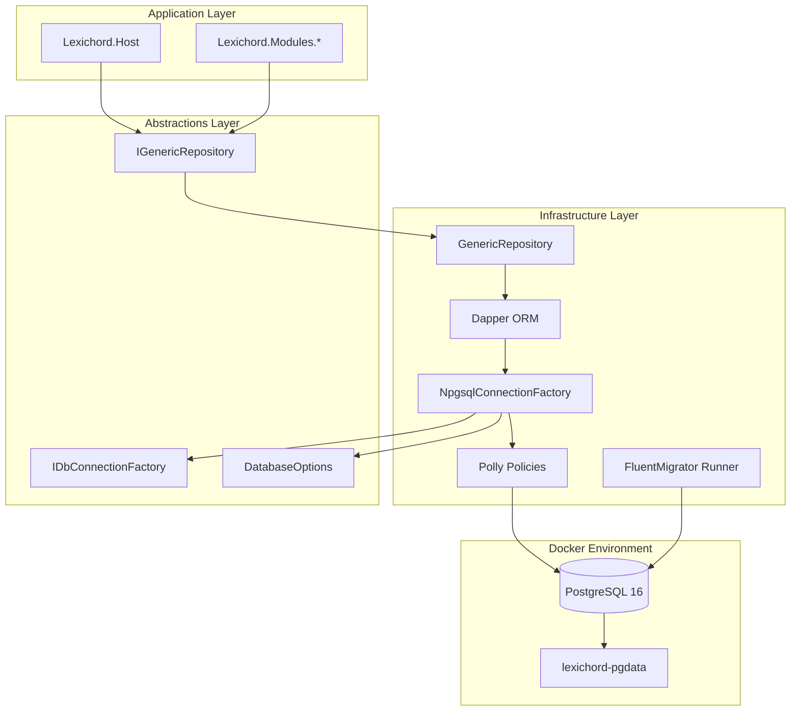

# LCS-SBD: Scope Breakdown - v0.0.5

**Target Version:** `v0.0.5`
**Codename:** The Memory (Data Layer)
**Timeline:** Sprint 3 (Persistence Foundation)
**Owner:** Lead Architect
**Prerequisites:** v0.0.4d complete (Module System with Hot Reload).

## 1. Executive Summary

**v0.0.5** establishes the data persistence layer that enables Lexichord to "remember" across sessions. This release transforms the application from a stateless tool into a persistent, data-aware system. The success of this release is measured by:

1. PostgreSQL 16 runs locally via Docker Compose with proper health checks.
2. Npgsql connects to PostgreSQL with connection pooling and Polly-based resilience.
3. FluentMigrator manages schema versioning with the initial `Users` and `SystemSettings` tables.
4. A generic repository pattern provides consistent CRUD operations via Dapper.

If this foundation is flawed, user data will be lost, migrations will fail, and the application will be unable to persist any state beyond in-memory caches.

---

## 2. Sub-Part Specifications

### v0.0.5a: Docker Orchestration

**Goal:** Provide a reproducible PostgreSQL 16 development environment via Docker Compose.

- **Task 1.1: Create docker-compose.yml**
    - Define PostgreSQL 16 service with Alpine image for minimal footprint.
    - Configure persistent volume `lexichord-pgdata` for data durability.
    - Map port 5432 to host for local development connections.
    - Set environment variables for `POSTGRES_USER`, `POSTGRES_PASSWORD`, `POSTGRES_DB`.
- **Task 1.2: Health Check Configuration**
    - Add `healthcheck` block using `pg_isready` command.
    - Configure interval: 10s, timeout: 5s, retries: 5.
    - Ensure dependent services wait for healthy state.
- **Task 1.3: Environment File**
    - Create `.env.example` with placeholder connection strings.
    - Add `.env` to `.gitignore` for local secrets.
    - Document required environment variables in README.
- **Task 1.4: Development Scripts**
    - Create `scripts/db-start.sh` for container startup.
    - Create `scripts/db-stop.sh` for container shutdown.
    - Create `scripts/db-reset.sh` for volume cleanup and fresh start.

**Definition of Done:**

- `docker compose up -d` starts PostgreSQL container.
- Container passes health check within 60 seconds.
- Data persists across container restarts.
- `psql` can connect to `localhost:5432` with configured credentials.

---

### v0.0.5b: Database Connector

**Goal:** Establish reliable database connectivity with connection pooling and resilience patterns.

- **Task 1.1: Install Npgsql Packages**
    - Add `Npgsql` NuGet package to `Lexichord.Infrastructure`.
    - Add `Microsoft.Extensions.Configuration.Binder` for options binding.
    - Add `Polly` for resilience and retry policies.
- **Task 1.2: Connection String Configuration**
    - Create `DatabaseOptions` record in `Lexichord.Abstractions`.
    - Define properties: `ConnectionString`, `MaxPoolSize`, `MinPoolSize`, `ConnectionLifetime`.
    - Register options via `services.Configure<DatabaseOptions>()`.
- **Task 1.3: Npgsql Data Source Factory**
    - Create `IDbConnectionFactory` interface in Abstractions.
    - Implement `NpgsqlConnectionFactory` in Infrastructure.
    - Configure `NpgsqlDataSourceBuilder` with connection pooling.
    - Enable multiplexing for improved throughput.
- **Task 1.4: Polly Resilience Policies**
    - Create retry policy for transient failures (network, timeout).
    - Configure exponential backoff: 1s, 2s, 4s, 8s.
    - Add circuit breaker: 5 failures in 30s opens for 30s.
    - Log all retries and circuit breaker state changes.

**Definition of Done:**

- `IDbConnectionFactory.CreateConnectionAsync()` returns open connection.
- Connection pool reuses connections (verify with logging).
- Transient failures trigger retry with exponential backoff.
- Circuit breaker opens after repeated failures, preventing cascading failures.

---

### v0.0.5c: FluentMigrator Runner

**Goal:** Implement database schema versioning with reversible migrations.

- **Task 1.1: Install FluentMigrator Packages**
    - Add `FluentMigrator` NuGet package.
    - Add `FluentMigrator.Runner` for migration execution.
    - Add `FluentMigrator.Runner.Postgres` for PostgreSQL support.
- **Task 1.2: Migration Infrastructure**
    - Create `Lexichord.Infrastructure/Migrations/` directory.
    - Create base migration conventions (naming, table prefixes).
    - Configure migration runner in DI container.
    - Add `--migrate` CLI flag for startup migration.
- **Task 1.3: Migration_001_InitSystem**
    - Create `Users` table with: `Id` (UUID PK), `Email`, `DisplayName`, `CreatedAt`, `UpdatedAt`.
    - Create `SystemSettings` table with: `Key` (PK), `Value`, `Description`, `UpdatedAt`.
    - Add indexes for common query patterns.
    - Implement `Down()` method for rollback.
- **Task 1.4: Migration Execution**
    - Run migrations automatically on first startup.
    - Support `--migrate` flag for manual execution.
    - Log migration progress and any errors.
    - Handle migration version conflicts gracefully.

**Definition of Done:**

- `dotnet run -- --migrate` executes all pending migrations.
- `Users` and `SystemSettings` tables exist after migration.
- Migration can be rolled back via `--rollback` flag.
- Version history stored in `VersionInfo` table.

---

### v0.0.5d: Repository Base

**Goal:** Implement a generic repository pattern with Dapper for type-safe CRUD operations.

- **Task 1.1: Install Dapper Packages**
    - Add `Dapper` NuGet package to `Lexichord.Infrastructure`.
    - Add `Dapper.Contrib` for simplified CRUD operations.
- **Task 1.2: Generic Repository Interface**
    - Create `IGenericRepository<T>` interface in Abstractions.
    - Define methods: `GetByIdAsync`, `GetAllAsync`, `InsertAsync`, `UpdateAsync`, `DeleteAsync`.
    - Add `QueryAsync<T>` for custom queries.
    - Add `ExecuteAsync` for non-query operations.
- **Task 1.3: Dapper Repository Implementation**
    - Implement `GenericRepository<T>` in Infrastructure.
    - Use Dapper for all query execution.
    - Implement optimistic concurrency with `UpdatedAt` timestamps.
    - Add transaction support via `IUnitOfWork` pattern.
- **Task 1.4: Specific Repositories**
    - Create `IUserRepository : IGenericRepository<User>`.
    - Create `ISystemSettingsRepository` with `GetByKeyAsync`, `SetValueAsync`.
    - Register repositories in DI container.
    - Add repository-level logging for all operations.

**Definition of Done:**

- `IUserRepository.GetByIdAsync(id)` returns user from database.
- `IUserRepository.InsertAsync(user)` inserts and returns generated ID.
- `ISystemSettingsRepository.SetValueAsync("key", "value")` upserts setting.
- All repository methods log execution time and row counts.

---

## 3. Implementation Checklist (for Developer)

| Step     | Description                                                                 | Status |
| :------- | :-------------------------------------------------------------------------- | :----- |
| **0.5a** | `docker-compose.yml` created with PostgreSQL 16 service.                    | [ ]    |
| **0.5a** | Health check configured with `pg_isready`.                                  | [ ]    |
| **0.5a** | `.env.example` created with placeholder values.                             | [ ]    |
| **0.5a** | Development scripts created (`db-start.sh`, `db-stop.sh`, `db-reset.sh`).   | [ ]    |
| **0.5b** | `Npgsql` and `Polly` packages installed.                                    | [ ]    |
| **0.5b** | `DatabaseOptions` record created with connection settings.                  | [ ]    |
| **0.5b** | `NpgsqlConnectionFactory` implemented with connection pooling.              | [ ]    |
| **0.5b** | Polly retry and circuit breaker policies configured.                        | [ ]    |
| **0.5c** | FluentMigrator packages installed.                                          | [ ]    |
| **0.5c** | Migration runner configured in DI container.                                | [ ]    |
| **0.5c** | `Migration_001_InitSystem` creates `Users` and `SystemSettings` tables.     | [ ]    |
| **0.5c** | `--migrate` CLI flag executes pending migrations.                           | [ ]    |
| **0.5d** | `Dapper` packages installed.                                                | [ ]    |
| **0.5d** | `IGenericRepository<T>` interface defined.                                  | [ ]    |
| **0.5d** | `GenericRepository<T>` implementation with Dapper.                          | [ ]    |
| **0.5d** | `IUserRepository` and `ISystemSettingsRepository` created.                  | [ ]    |

## 4. Risks & Mitigations

- **Risk:** Docker not installed on developer machine.
    - _Mitigation:_ Document Docker Desktop installation in CONTRIBUTING.md; provide alternative SQLite fallback for local-only development.
- **Risk:** Connection string contains secrets in source control.
    - _Mitigation:_ Use `.env` files excluded from git; provide `.env.example` template.
- **Risk:** Migration fails mid-execution, leaving database in inconsistent state.
    - _Mitigation:_ Wrap migrations in transactions where possible; implement rollback procedures.
- **Risk:** Dapper SQL injection vulnerabilities.
    - _Mitigation:_ Always use parameterized queries; never concatenate user input into SQL.
- **Risk:** Connection pool exhaustion under load.
    - _Mitigation:_ Configure appropriate pool sizes; monitor active connections; add circuit breaker.
- **Risk:** Polly retry causes duplicate operations.
    - _Mitigation:_ Ensure all retried operations are idempotent; use UUIDs for primary keys.

## 5. Architecture Diagram



## 6. Database Schema (Initial)

```sql
-- Users table: Core user identity
CREATE TABLE "Users" (
    "Id" UUID PRIMARY KEY DEFAULT gen_random_uuid(),
    "Email" VARCHAR(255) NOT NULL UNIQUE,
    "DisplayName" VARCHAR(100) NOT NULL,
    "PasswordHash" VARCHAR(255) NULL,
    "IsActive" BOOLEAN NOT NULL DEFAULT TRUE,
    "CreatedAt" TIMESTAMPTZ NOT NULL DEFAULT NOW(),
    "UpdatedAt" TIMESTAMPTZ NOT NULL DEFAULT NOW()
);

CREATE INDEX "IX_Users_Email" ON "Users" ("Email");
CREATE INDEX "IX_Users_IsActive" ON "Users" ("IsActive") WHERE "IsActive" = TRUE;

-- SystemSettings table: Key-value configuration store
CREATE TABLE "SystemSettings" (
    "Key" VARCHAR(100) PRIMARY KEY,
    "Value" TEXT NOT NULL,
    "Description" VARCHAR(500) NULL,
    "UpdatedAt" TIMESTAMPTZ NOT NULL DEFAULT NOW()
);

-- Version tracking (FluentMigrator)
-- Automatically created by FluentMigrator as "VersionInfo"
```
