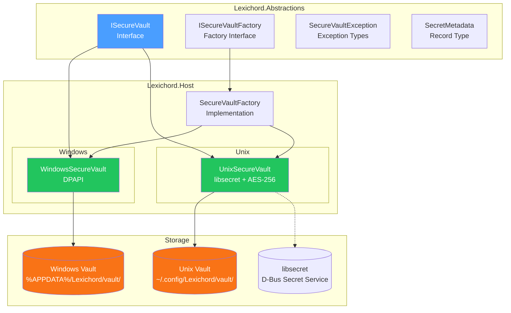

# LCS-DES-006: Design Specification Index — The Vault (Secure Secrets Storage)

## Document Control

| Field                | Value                                   |
| :------------------- | :-------------------------------------- |
| **Document ID**      | LCS-DES-006-INDEX                       |
| **Feature ID**       | INF-006                                 |
| **Feature Name**     | The Vault (Secure Secrets Storage)      |
| **Target Version**   | v0.0.6                                  |
| **Module Scope**     | Lexichord.Abstractions / Lexichord.Host |
| **Swimlane**         | Infrastructure                          |
| **License Tier**     | Core                                    |
| **Feature Gate Key** | N/A                                     |
| **Status**           | Draft                                   |
| **Last Updated**     | 2026-01-27                              |

---

## 1. Executive Summary

**v0.0.6** establishes the **secure secrets storage infrastructure** that protects sensitive credentials. This release provides platform-specific encrypted storage for API keys, connection strings, and OAuth tokens using OS-native security mechanisms.

### 1.1 The Problem

Lexichord modules require access to sensitive credentials:

- **LLM API Keys** (OpenAI, Anthropic, Ollama tokens)
- **Cloud Service Credentials** (S3 buckets, Azure Blob)
- **Database Connection Strings** (with embedded passwords)
- **OAuth Tokens** (for third-party integrations)

Storing these in plain text is a critical security vulnerability:

- Config files can be accidentally committed to Git
- Environment variables are visible in process listings
- Plain text files can be read by any process with file access

### 1.2 The Solution

Implement a secure vault infrastructure with:

- **ISecureVault Interface** — Platform-agnostic contract in Abstractions
- **WindowsSecureVault** — DPAPI-based encryption using `ProtectedData`
- **UnixSecureVault** — `libsecret` integration with AES-256 fallback
- **Integration Testing** — Verify secrets survive restart

### 1.3 Business Value

| Value                    | Description                                        |
| :----------------------- | :------------------------------------------------- |
| **Security**             | Credentials encrypted at rest using OS-native APIs |
| **Cross-Platform**       | Windows DPAPI, Linux/macOS libsecret support       |
| **Compliance**           | Meets security requirements for credential storage |
| **Developer Experience** | Simple API hides platform complexity               |
| **Foundation**           | Enables secure LLM API key storage (v0.3.x+)       |

---

## 2. Related Documents

### 2.1 Scope Breakdown Document

The detailed scope breakdown for v0.0.6, including all sub-parts, implementation checklists, and acceptance criteria:

| Document                            | Description                 |
| :---------------------------------- | :-------------------------- |
| **[LCS-SBD-006](./LCS-SBD-006.md)** | Scope Breakdown — The Vault |

### 2.2 Sub-Part Design Specifications

Each sub-part has its own detailed design specification following the LDS-01 template:

| Sub-Part | Document                              | Title                               | Description                               |
| :------- | :------------------------------------ | :---------------------------------- | :---------------------------------------- |
| v0.0.6a  | **[LCS-DES-006a](./LCS-DES-006a.md)** | ISecureVault Interface              | Platform-agnostic secure storage contract |
| v0.0.6b  | **[LCS-DES-006b](./LCS-DES-006b.md)** | WindowsSecureVault (DPAPI)          | DPAPI-based encryption for Windows        |
| v0.0.6c  | **[LCS-DES-006c](./LCS-DES-006c.md)** | UnixSecureVault (libsecret/AES-256) | Secret storage for Linux and macOS        |
| v0.0.6d  | **[LCS-DES-006d](./LCS-DES-006d.md)** | Integration Testing                 | End-to-end vault verification             |

---

## 3. Architecture Overview

### 3.1 Component Diagram



### 3.2 Security Model

```text
┌────────────────────────────────────────────────────────────────────────┐
│                         THREAT MODEL                                    │
├────────────────────────────────────────────────────────────────────────┤
│ Attacker with:                                                          │
│   - File system read access (other user)        → PROTECTED (encrypted) │
│   - Process memory dump (same user)             → PARTIALLY PROTECTED   │
│   - Physical access (different machine)         → PROTECTED (machine-key)│
│   - Malware as same user                        → NOT PROTECTED         │
├────────────────────────────────────────────────────────────────────────┤
│ Design Assumption: If attacker has same-user code execution,            │
│ they can access anything the user can. We protect against EXTERNAL      │
│ threats, not same-user malware (requires endpoint security).            │
└────────────────────────────────────────────────────────────────────────┘
```

---

## 4. Dependencies

### 4.1 Upstream Dependencies

| Dependency       | Source Version | Purpose                  |
| :--------------- | :------------- | :----------------------- |
| DI Container     | v0.0.3a        | Service registration     |
| Serilog Pipeline | v0.0.3b        | Security event logging   |
| Configuration    | v0.0.3d        | Vault path configuration |

### 4.2 NuGet Packages

| Package                                      | Version  | Purpose                       |
| :------------------------------------------- | :------- | :---------------------------- |
| `System.Security.Cryptography`               | Built-in | AES-256 encryption primitives |
| `System.Security.Cryptography.ProtectedData` | 9.0.x    | Windows DPAPI access          |

### 4.3 Platform Dependencies

| Platform | Dependency  | Purpose                              |
| :------- | :---------- | :----------------------------------- |
| Windows  | DPAPI       | Machine/user-scoped encryption       |
| Linux    | libsecret   | D-Bus Secret Service (GNOME Keyring) |
| macOS    | libsecret   | Keychain integration via libsecret   |
| All      | AES-256-GCM | Fallback when libsecret unavailable  |

### 4.4 Downstream Consumers (Future)

| Version | Feature            | Uses From v0.0.6                      |
| :------ | :----------------- | :------------------------------------ |
| v0.1.x  | Settings Service   | Secure storage for sensitive settings |
| v0.3.x  | LLM Integration    | API key storage for OpenAI/Anthropic  |
| v0.4.x  | BYOK Configuration | User's own API keys securely stored   |
| v1.x    | License System     | License key encryption                |

---

## 5. License Gating Strategy

**N/A** — Secure vault infrastructure is Core foundation required by all license tiers. No runtime gating is applied to credential storage.

---

## 6. Key Interfaces Summary

| Interface             | Defined In | Purpose                          |
| :-------------------- | :--------- | :------------------------------- |
| `ISecureVault`        | v0.0.6a    | Platform-agnostic secret storage |
| `ISecureVaultFactory` | v0.0.6a    | Creates platform-specific vault  |

| Record/DTO             | Defined In | Purpose                             |
| :--------------------- | :--------- | :---------------------------------- |
| `SecretMetadata`       | v0.0.6a    | Secret metadata (created, modified) |
| `SecureVaultException` | v0.0.6a    | Vault-specific exceptions           |

---

## 7. Implementation Checklist Summary

| Sub-Part  | Key Deliverables                                     | Est. Hours   | Status |
| :-------- | :--------------------------------------------------- | :----------- | :----- |
| v0.0.6a   | ISecureVault, ISecureVaultFactory, SecretMetadata    | 3            | [ ]    |
| v0.0.6b   | WindowsSecureVault with DPAPI, file-based storage    | 5            | [ ]    |
| v0.0.6c   | UnixSecureVault with libsecret, AES-256-GCM fallback | 6            | [ ]    |
| v0.0.6d   | Integration tests, cross-platform verification       | 4            | [x]    |
| **Total** |                                                      | **18 hours** |        |

See [LCS-SBD-006](./LCS-SBD-006.md) Section 3 for the detailed implementation checklist.

---

## 8. Success Criteria Summary

| Category      | Criterion                                        | Target |
| :------------ | :----------------------------------------------- | :----- |
| **Storage**   | Secrets stored encrypted at rest                 | Pass   |
| **Retrieval** | Secrets retrieved correctly after app restart    | Pass   |
| **Windows**   | DPAPI encryption works on Windows 10/11          | Pass   |
| **Linux**     | libsecret or AES fallback works on Ubuntu/Fedora | Pass   |
| **macOS**     | libsecret or AES fallback works on macOS         | Pass   |
| **Security**  | Plain text secrets never written to disk         | Pass   |
| **Isolation** | Secrets not accessible by other users            | Pass   |

See individual design specs for detailed acceptance criteria.

---

## 9. Test Coverage Summary

| Sub-Part | Unit Tests                              | Integration Tests                |
| :------- | :-------------------------------------- | :------------------------------- |
| v0.0.6a  | Interface contract, metadata validation | N/A                              |
| v0.0.6b  | DPAPI mock tests, error handling        | Real DPAPI on Windows CI         |
| v0.0.6c  | AES encryption tests, libsecret mocks   | Real libsecret on Linux CI       |
| v0.0.6d  | N/A                                     | Full round-trip on all platforms |

See individual design specs for detailed test scenarios.

---

## 10. What This Enables

| Version | Feature            | Depends On v0.0.6                           |
| :------ | :----------------- | :------------------------------------------ |
| v0.1.x  | Settings Service   | Encrypted storage for sensitive preferences |
| v0.3.x  | LLM Integration    | Secure API key storage                      |
| v0.4.x  | BYOK Mode          | User API keys stored securely               |
| v0.5.x  | Cloud Sync         | OAuth token secure storage                  |
| v1.x    | License Activation | License key encryption                      |

---

## 11. Risks & Mitigations

| Risk                             | Impact | Mitigation                                    |
| :------------------------------- | :----- | :-------------------------------------------- |
| libsecret not available on Linux | Medium | AES-256-GCM fallback with derived key         |
| DPAPI unavailable (server Core)  | Low    | Detect and use fallback encryption            |
| Key derivation weakness          | High   | Use PBKDF2 with sufficient iterations         |
| Secrets exposed in memory dumps  | Medium | Clear sensitive data after use (SecureString) |
| Vault file permissions too open  | High   | Set restrictive permissions on creation       |

---

## Document History

| Version | Date       | Author           | Changes                                                      |
| :------ | :--------- | :--------------- | :----------------------------------------------------------- |
| 1.0     | 2026-01-27 | System Architect | Created INDEX from legacy LCS-INF-006 during standardization |
