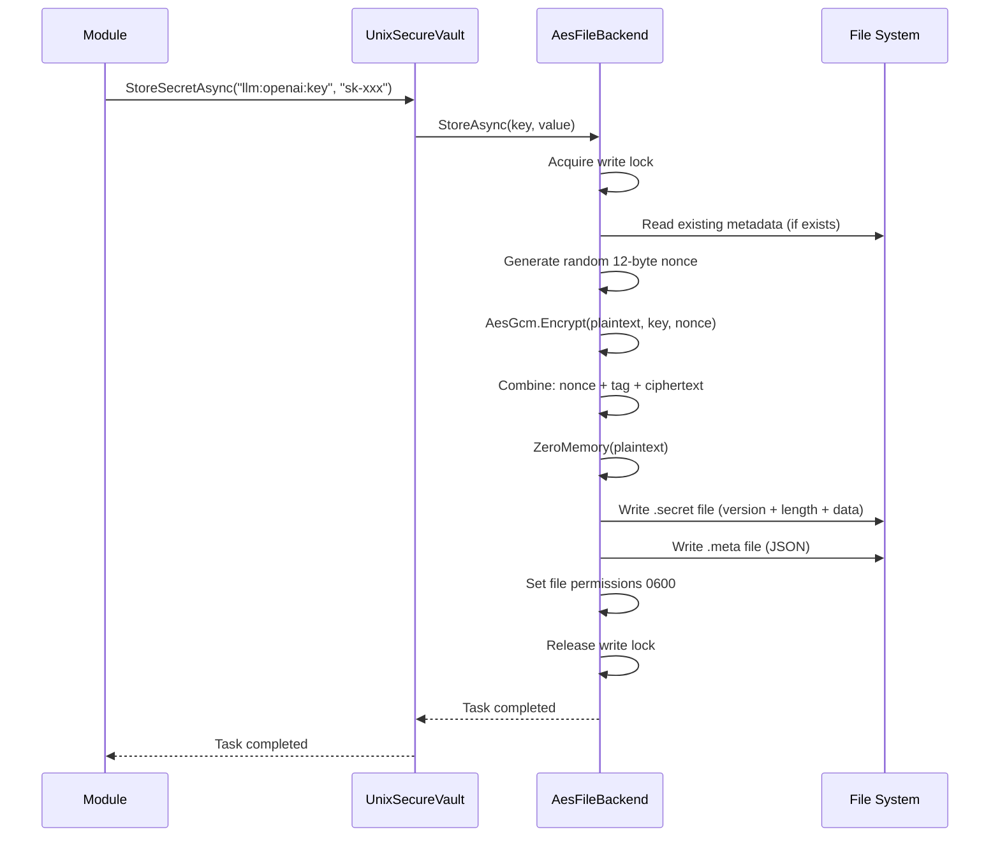
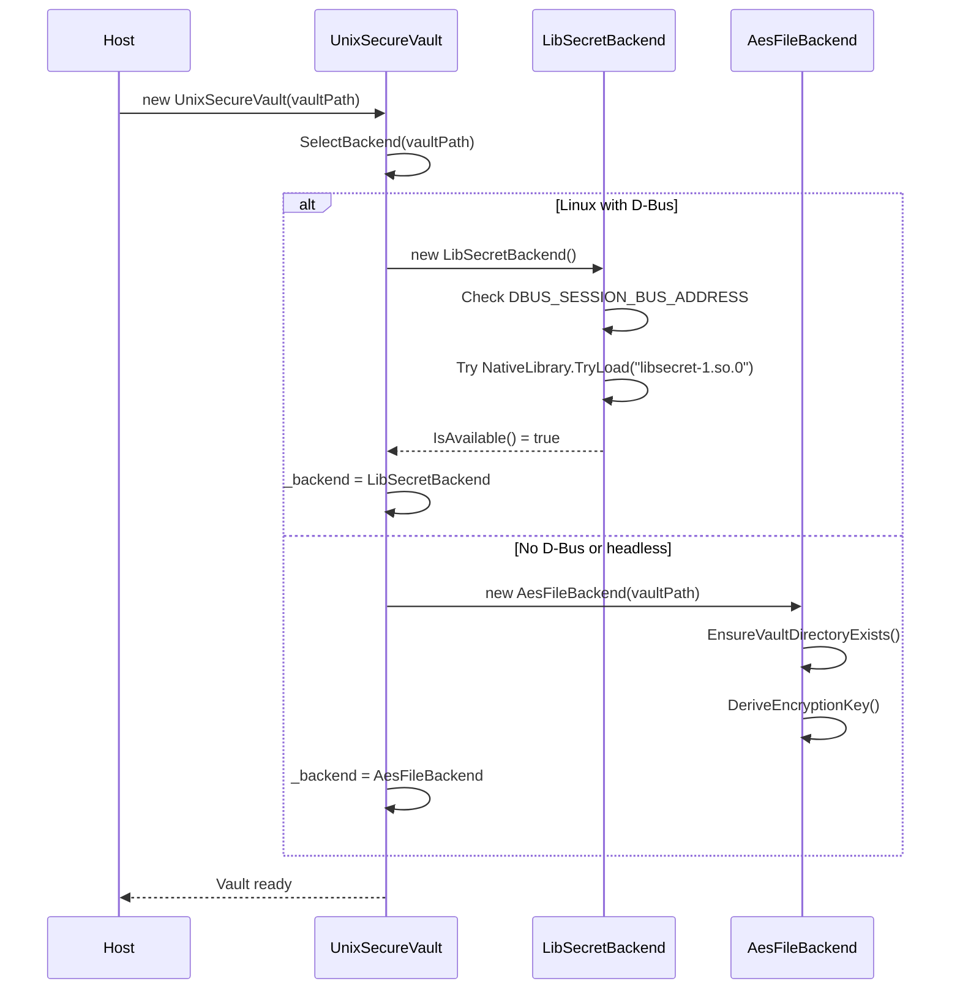

# LCS-DES-006c: UnixSecureVault (libsecret/AES-256)

## 1. Metadata & Categorization

| Field                | Value                                   | Description                                            |
| :------------------- | :-------------------------------------- | :----------------------------------------------------- |
| **Feature ID**       | `INF-006c`                              | Infrastructure - Unix Secure Vault                     |
| **Feature Name**     | UnixSecureVault (libsecret/AES-256)     | Secret storage for Linux and macOS.                    |
| **Target Version**   | `v0.0.6c`                               | Infrastructure Foundation Layer.                       |
| **Module Scope**     | `Lexichord.Host/Services/Security`      | Platform implementation.                               |
| **Swimlane**         | `Infrastructure`                        | The Vault (Security).                                  |
| **License Tier**     | `Core`                                  | Foundation (Required for all tiers).                   |
| **Feature Gate Key** | N/A                                     | No runtime gating for security infrastructure.         |
| **Author**           | System Architect                        |                                                        |
| **Status**           | **Draft**                               | Pending approval.                                      |
| **Last Updated**     | 2026-01-26                              |                                                        |

---

## 2. Executive Summary

### 2.1 The Requirement

On Unix-like systems (Linux, macOS), we need a secure vault implementation that:

- Integrates with **desktop secret services** where available (GNOME Keyring, KDE Wallet).
- Provides a **fallback mechanism** for headless/server environments.
- Works consistently across **Linux distributions** and **macOS versions**.
- Uses **industry-standard encryption** (AES-256-GCM) for the fallback.

### 2.2 The Proposed Solution

We **SHALL** implement `UnixSecureVault` with a two-tier strategy:

1. **Primary (Desktop):** Use `libsecret` to communicate with D-Bus Secret Service (GNOME Keyring, KDE Wallet).
2. **Fallback (Headless):** Use file-based AES-256-GCM encryption with machine-derived keys.

### 2.3 Platform Strategy

```text
+------------------------------------------------------------------------+
|                      UNIX VAULT STRATEGY                                |
+------------------------------------------------------------------------+
|                                                                         |
|   Desktop Environment Detected?                                         |
|   +-- YES (GNOME, KDE, etc.)                                           |
|   |   +-- D-Bus Secret Service available?                              |
|   |       +-- YES --> Use libsecret                                    |
|   |       |           - Secrets stored in system keyring               |
|   |       |           - Unlock prompt handled by desktop               |
|   |       |                                                            |
|   |       +-- NO --> Use AES-256 Fallback                              |
|   |                                                                     |
|   +-- NO (Headless Server, Container, WSL)                             |
|       +-- Use AES-256 Fallback                                         |
|           - File-based encryption                                       |
|           - Machine-derived key                                         |
|                                                                         |
+------------------------------------------------------------------------+
```

---

## 3. Architecture & Modular Strategy

### 3.1 Implementation Architecture

```mermaid
graph TB
    subgraph "Lexichord.Host"
        USV[UnixSecureVault<br/>Hybrid Implementation]
        LSB[LibSecretBackend<br/>D-Bus Integration]
        AES[AesFileBackend<br/>AES-256-GCM]
    end

    subgraph "Desktop Services"
        DBUS[D-Bus<br/>Secret Service API]
        GNOME[GNOME Keyring]
        KDE[KDE Wallet]
    end

    subgraph "File Storage"
        VAULT[(Vault Directory<br/>~/.config/Lexichord/vault/)]
        SECRET[*.secret files<br/>AES-256-GCM encrypted]
        META[*.meta files<br/>JSON metadata]
        SALT[.salt file<br/>Key derivation salt]
    end

    subgraph "Key Derivation"
        MID[Machine ID<br/>/etc/machine-id]
        UID[User ID<br/>getuid()]
        KDF[PBKDF2-SHA256<br/>100,000 iterations]
    end

    USV --> LSB
    USV --> AES
    LSB --> DBUS
    DBUS --> GNOME
    DBUS --> KDE
    AES --> VAULT
    VAULT --> SECRET
    VAULT --> META
    VAULT --> SALT
    AES --> KDF
    KDF --> MID
    KDF --> UID
```

### 3.2 File Structure After v0.0.6c

```text
src/Lexichord.Host/
+-- Services/
    +-- Security/
        +-- UnixSecureVault.cs        # NEW: Hybrid Unix implementation
        +-- LibSecretBackend.cs       # NEW: D-Bus Secret Service client
        +-- AesFileBackend.cs         # NEW: AES-256-GCM file encryption
        +-- MachineKeyDerivation.cs   # NEW: Machine-specific key derivation
        +-- KeyValidator.cs           # (existing from 006b)
        +-- KeyHasher.cs              # (existing from 006b)
```

### 3.3 Storage Paths

| Platform | Vault Directory                                    |
| :------- | :------------------------------------------------- |
| Linux    | `~/.config/Lexichord/vault/` (XDG_CONFIG_HOME)     |
| macOS    | `~/Library/Application Support/Lexichord/vault/`   |

---

## 4. Decision Tree: Backend Selection

```text
START: "Which backend should UnixSecureVault use?"
|
+-- OperatingSystem.IsLinux()?
|   |
|   +-- YES --> Is D-Bus available?
|   |   |
|   |   +-- Check: System.Environment.GetEnvironmentVariable("DBUS_SESSION_BUS_ADDRESS")
|   |   |
|   |   +-- NULL (no D-Bus session) --> Use AesFileBackend
|   |   |                               Log: "D-Bus not available, using file-based encryption"
|   |   |
|   |   +-- SET --> Is Secret Service running?
|   |       |
|   |       +-- Check: Try to connect to org.freedesktop.secrets
|   |       |
|   |       +-- SUCCESS --> Use LibSecretBackend
|   |       |               Log: "Using libsecret ({ServiceName})"
|   |       |
|   |       +-- FAILURE --> Use AesFileBackend
|   |                       Log: "Secret Service not responding, using file-based encryption"
|   |
|   +-- NO --> OperatingSystem.IsMacOS()?
|       |
|       +-- YES --> Is Keychain available?
|       |   |
|       |   +-- (Future: Security.framework integration)
|       |   |
|       |   +-- For now: Use AesFileBackend
|       |       Log: "macOS Keychain integration not yet implemented, using file-based encryption"
|       |
|       +-- NO --> Unsupported platform
|                  throw PlatformNotSupportedException
```

---

## 5. Data Contracts

### 5.1 UnixSecureVault Implementation

```csharp
using System;
using System.Collections.Generic;
using System.Runtime.Versioning;
using System.Threading;
using System.Threading.Tasks;
using Lexichord.Abstractions.Contracts.Security;
using Microsoft.Extensions.Logging;

namespace Lexichord.Host.Services.Security;

/// <summary>
/// Unix implementation of <see cref="ISecureVault"/> with libsecret and AES-256 fallback.
/// </summary>
/// <remarks>
/// LOGIC: This implementation uses a two-tier strategy:
///
/// <list type="number">
///   <item><b>Primary:</b> libsecret via D-Bus Secret Service (GNOME Keyring, KDE Wallet)</item>
///   <item><b>Fallback:</b> File-based AES-256-GCM encryption with machine-derived key</item>
/// </list>
///
/// <para><b>Backend Selection:</b></para>
/// The backend is determined at construction time based on environment detection.
/// Once selected, the backend does not change for the lifetime of the vault instance.
///
/// <para><b>Thread Safety:</b></para>
/// This implementation is thread-safe. The underlying backend handles its own locking.
/// </remarks>
[SupportedOSPlatform("linux")]
[SupportedOSPlatform("macos")]
public sealed class UnixSecureVault : ISecureVault, IDisposable
{
    private readonly ISecretStorageBackend _backend;
    private readonly ILogger<UnixSecureVault>? _logger;
    private bool _disposed;

    /// <summary>
    /// Gets the name of the active backend implementation.
    /// </summary>
    public string BackendName => _backend.Name;

    /// <summary>
    /// Initializes a new instance of the UnixSecureVault.
    /// </summary>
    /// <param name="vaultPath">Path to the vault storage directory (for AES fallback).</param>
    /// <param name="logger">Optional logger for diagnostics.</param>
    public UnixSecureVault(string vaultPath, ILogger<UnixSecureVault>? logger = null)
    {
        ArgumentNullException.ThrowIfNull(vaultPath);
        _logger = logger;

        // LOGIC: Attempt to use libsecret, fall back to AES file encryption
        _backend = SelectBackend(vaultPath);

        _logger?.LogInformation(
            "UnixSecureVault initialized: Backend={BackendName}, Path={VaultPath}",
            _backend.Name,
            vaultPath);
    }

    /// <summary>
    /// Initializes a new instance with a specific backend (for testing).
    /// </summary>
    internal UnixSecureVault(ISecretStorageBackend backend, ILogger<UnixSecureVault>? logger = null)
    {
        _backend = backend ?? throw new ArgumentNullException(nameof(backend));
        _logger = logger;
    }

    private ISecretStorageBackend SelectBackend(string vaultPath)
    {
        // LOGIC: Try libsecret first on Linux
        if (OperatingSystem.IsLinux())
        {
            try
            {
                var libsecretBackend = new LibSecretBackend(_logger);
                if (libsecretBackend.IsAvailable())
                {
                    _logger?.LogDebug("libsecret is available, using Secret Service");
                    return libsecretBackend;
                }
            }
            catch (Exception ex)
            {
                _logger?.LogDebug(ex, "libsecret detection failed");
            }
        }

        // LOGIC: Fall back to AES file encryption
        _logger?.LogDebug("Using AES-256-GCM file backend");
        return new AesFileBackend(vaultPath, _logger);
    }

    /// <inheritdoc/>
    public Task StoreSecretAsync(string key, string value, CancellationToken cancellationToken = default)
    {
        ThrowIfDisposed();
        KeyValidator.ValidateKey(key);
        ArgumentNullException.ThrowIfNull(value);

        return _backend.StoreAsync(key, value, cancellationToken);
    }

    /// <inheritdoc/>
    public Task<string> GetSecretAsync(string key, CancellationToken cancellationToken = default)
    {
        ThrowIfDisposed();
        KeyValidator.ValidateKey(key);

        return _backend.GetAsync(key, cancellationToken);
    }

    /// <inheritdoc/>
    public Task<bool> DeleteSecretAsync(string key, CancellationToken cancellationToken = default)
    {
        ThrowIfDisposed();
        KeyValidator.ValidateKey(key);

        return _backend.DeleteAsync(key, cancellationToken);
    }

    /// <inheritdoc/>
    public Task<bool> SecretExistsAsync(string key, CancellationToken cancellationToken = default)
    {
        ThrowIfDisposed();
        KeyValidator.ValidateKey(key);

        return _backend.ExistsAsync(key, cancellationToken);
    }

    /// <inheritdoc/>
    public Task<SecretMetadata?> GetSecretMetadataAsync(string key, CancellationToken cancellationToken = default)
    {
        ThrowIfDisposed();
        KeyValidator.ValidateKey(key);

        return _backend.GetMetadataAsync(key, cancellationToken);
    }

    /// <inheritdoc/>
    public IAsyncEnumerable<string> ListSecretsAsync(string? prefix = null, CancellationToken cancellationToken = default)
    {
        ThrowIfDisposed();
        return _backend.ListAsync(prefix, cancellationToken);
    }

    /// <inheritdoc/>
    public void Dispose()
    {
        if (_disposed) return;
        _disposed = true;

        if (_backend is IDisposable disposable)
        {
            disposable.Dispose();
        }
    }

    private void ThrowIfDisposed()
    {
        if (_disposed)
        {
            throw new ObjectDisposedException(nameof(UnixSecureVault));
        }
    }
}

/// <summary>
/// Internal interface for secret storage backends.
/// </summary>
internal interface ISecretStorageBackend
{
    string Name { get; }
    Task StoreAsync(string key, string value, CancellationToken cancellationToken);
    Task<string> GetAsync(string key, CancellationToken cancellationToken);
    Task<bool> DeleteAsync(string key, CancellationToken cancellationToken);
    Task<bool> ExistsAsync(string key, CancellationToken cancellationToken);
    Task<SecretMetadata?> GetMetadataAsync(string key, CancellationToken cancellationToken);
    IAsyncEnumerable<string> ListAsync(string? prefix, CancellationToken cancellationToken);
}
```

### 5.2 LibSecretBackend (D-Bus Secret Service)

```csharp
using System;
using System.Collections.Generic;
using System.Runtime.CompilerServices;
using System.Runtime.InteropServices;
using System.Threading;
using System.Threading.Tasks;
using Lexichord.Abstractions.Contracts.Security;
using Microsoft.Extensions.Logging;

namespace Lexichord.Host.Services.Security;

/// <summary>
/// Backend using libsecret to communicate with D-Bus Secret Service.
/// </summary>
/// <remarks>
/// LOGIC: This backend communicates with GNOME Keyring, KDE Wallet, or other
/// implementations of the org.freedesktop.secrets specification.
///
/// <para><b>Schema:</b></para>
/// Secrets are stored with schema "org.lexichord.vault" and attribute "key".
///
/// <para><b>Dependencies:</b></para>
/// Requires libsecret-1.so to be installed on the system:
/// - Debian/Ubuntu: libsecret-1-0
/// - Fedora/RHEL: libsecret
/// - Arch: libsecret
/// </remarks>
internal sealed class LibSecretBackend : ISecretStorageBackend, IDisposable
{
    private const string SchemaName = "org.lexichord.vault";
    private readonly ILogger? _logger;
    private bool _available;
    private bool _disposed;

    public string Name => "libsecret (Secret Service)";

    public LibSecretBackend(ILogger? logger = null)
    {
        _logger = logger;
        _available = CheckAvailability();
    }

    /// <summary>
    /// Checks if libsecret and D-Bus Secret Service are available.
    /// </summary>
    public bool IsAvailable() => _available;

    private bool CheckAvailability()
    {
        try
        {
            // LOGIC: Check if D-Bus session is available
            var dbusAddress = Environment.GetEnvironmentVariable("DBUS_SESSION_BUS_ADDRESS");
            if (string.IsNullOrEmpty(dbusAddress))
            {
                _logger?.LogDebug("DBUS_SESSION_BUS_ADDRESS not set");
                return false;
            }

            // LOGIC: Check if libsecret library is available
            if (!NativeLibrary.TryLoad("libsecret-1.so.0", out _))
            {
                _logger?.LogDebug("libsecret-1.so.0 not found");
                return false;
            }

            // LOGIC: Try to connect to Secret Service
            // This is a simplified check - actual implementation would
            // attempt a D-Bus connection to org.freedesktop.secrets
            return true;
        }
        catch (Exception ex)
        {
            _logger?.LogDebug(ex, "libsecret availability check failed");
            return false;
        }
    }

    public async Task StoreAsync(string key, string value, CancellationToken cancellationToken)
    {
        ThrowIfNotAvailable();

        try
        {
            // LOGIC: Store secret using libsecret API
            // secret_password_store_sync(schema, collection, label, password, cancellable, error, attributes...)
            //
            // For now, this is a placeholder. Full implementation requires:
            // 1. P/Invoke declarations for libsecret functions
            // 2. GLib memory management
            // 3. Error handling translation

            await Task.Run(() =>
            {
                // Native call: secret_password_store_sync(...)
                _logger?.LogDebug(
                    "libsecret: Storing secret KeyHash={KeyHash}",
                    KeyHasher.ComputeLogHash(key));

                // Placeholder: Actual P/Invoke implementation
                throw new NotImplementedException(
                    "libsecret P/Invoke not yet implemented. Use AES fallback.");
            }, cancellationToken);
        }
        catch (NotImplementedException)
        {
            throw;
        }
        catch (Exception ex)
        {
            _logger?.LogError(ex, "libsecret store failed");
            throw new SecureVaultException("Failed to store secret in Secret Service.", ex);
        }
    }

    public async Task<string> GetAsync(string key, CancellationToken cancellationToken)
    {
        ThrowIfNotAvailable();

        try
        {
            return await Task.Run(() =>
            {
                // Native call: secret_password_lookup_sync(...)
                _logger?.LogDebug(
                    "libsecret: Retrieving secret KeyHash={KeyHash}",
                    KeyHasher.ComputeLogHash(key));

                // Placeholder: Actual P/Invoke implementation
                throw new NotImplementedException(
                    "libsecret P/Invoke not yet implemented. Use AES fallback.");
            }, cancellationToken);
        }
        catch (NotImplementedException)
        {
            throw;
        }
        catch (Exception ex)
        {
            _logger?.LogError(ex, "libsecret get failed");
            throw new SecureVaultException("Failed to retrieve secret from Secret Service.", ex);
        }
    }

    public async Task<bool> DeleteAsync(string key, CancellationToken cancellationToken)
    {
        ThrowIfNotAvailable();

        return await Task.Run(() =>
        {
            // Native call: secret_password_clear_sync(...)
            throw new NotImplementedException(
                "libsecret P/Invoke not yet implemented. Use AES fallback.");
        }, cancellationToken);
    }

    public Task<bool> ExistsAsync(string key, CancellationToken cancellationToken)
    {
        ThrowIfNotAvailable();

        // LOGIC: Lookup returns null if not found
        return Task.FromResult(false); // Placeholder
    }

    public Task<SecretMetadata?> GetMetadataAsync(string key, CancellationToken cancellationToken)
    {
        ThrowIfNotAvailable();

        // LOGIC: libsecret doesn't provide creation timestamps
        // We could store metadata in the label or a parallel file
        return Task.FromResult<SecretMetadata?>(null);
    }

    public async IAsyncEnumerable<string> ListAsync(
        string? prefix,
        [EnumeratorCancellation] CancellationToken cancellationToken)
    {
        ThrowIfNotAvailable();

        // LOGIC: Search for items with our schema
        // This requires secret_service_search_sync(...)

        await Task.Yield(); // Make compiler happy
        yield break; // Placeholder
    }

    public void Dispose()
    {
        if (_disposed) return;
        _disposed = true;
        // No native resources to free in current implementation
    }

    private void ThrowIfNotAvailable()
    {
        if (!_available)
        {
            throw new SecureVaultException("libsecret is not available on this system.");
        }
    }
}
```

### 5.3 AesFileBackend (AES-256-GCM File Encryption)

```csharp
using System;
using System.Collections.Generic;
using System.IO;
using System.Runtime.CompilerServices;
using System.Security.Cryptography;
using System.Text;
using System.Text.Json;
using System.Threading;
using System.Threading.Tasks;
using Lexichord.Abstractions.Contracts.Security;
using Microsoft.Extensions.Logging;

namespace Lexichord.Host.Services.Security;

/// <summary>
/// Backend using AES-256-GCM file-based encryption.
/// </summary>
/// <remarks>
/// LOGIC: This backend provides secure secret storage without requiring
/// system keyring services. It uses:
///
/// <list type="bullet">
///   <item><b>Algorithm:</b> AES-256-GCM (authenticated encryption)</item>
///   <item><b>Key Derivation:</b> PBKDF2-SHA256, 100,000 iterations</item>
///   <item><b>Key Material:</b> Machine ID + User ID + Installation Salt</item>
/// </list>
///
/// <para><b>Security Model:</b></para>
/// The encryption key is derived from machine-specific identifiers, making
/// secrets unreadable if the vault directory is copied to another machine.
///
/// <para><b>Thread Safety:</b></para>
/// Write operations are serialized via SemaphoreSlim.
/// </remarks>
internal sealed class AesFileBackend : ISecretStorageBackend, IDisposable
{
    private readonly string _vaultPath;
    private readonly ILogger? _logger;
    private readonly SemaphoreSlim _writeLock = new(1, 1);
    private readonly byte[] _encryptionKey;
    private bool _disposed;

    private const int KeySize = 32; // 256 bits
    private const int NonceSize = 12; // 96 bits for GCM
    private const int TagSize = 16; // 128 bits
    private const int SaltSize = 32;
    private const int Pbkdf2Iterations = 100_000;
    private const int FileVersion = 1;

    public string Name => "AES-256-GCM (File)";

    /// <summary>
    /// Initializes a new instance of the AesFileBackend.
    /// </summary>
    /// <param name="vaultPath">Path to the vault storage directory.</param>
    /// <param name="logger">Optional logger.</param>
    public AesFileBackend(string vaultPath, ILogger? logger = null)
    {
        _vaultPath = vaultPath ?? throw new ArgumentNullException(nameof(vaultPath));
        _logger = logger;

        EnsureVaultDirectoryExists();
        _encryptionKey = DeriveEncryptionKey();

        _logger?.LogDebug("AesFileBackend initialized: Path={VaultPath}", _vaultPath);
    }

    public async Task StoreAsync(string key, string value, CancellationToken cancellationToken)
    {
        var keyHash = KeyHasher.ComputeFileName(key);
        var secretPath = GetSecretPath(keyHash);
        var metaPath = GetMetadataPath(keyHash);

        await _writeLock.WaitAsync(cancellationToken);
        try
        {
            // LOGIC: Check for existing metadata to preserve CreatedAt
            var existingMeta = await ReadMetadataAsync(metaPath, cancellationToken);
            var now = DateTimeOffset.UtcNow;

            // LOGIC: Encrypt the value using AES-256-GCM
            var plainBytes = Encoding.UTF8.GetBytes(value);
            var encryptedData = EncryptAesGcm(plainBytes);

            // LOGIC: Clear plaintext from memory
            CryptographicOperations.ZeroMemory(plainBytes);

            // LOGIC: Write encrypted file
            await WriteSecretFileAsync(secretPath, encryptedData, cancellationToken);

            // LOGIC: Write metadata
            var metadata = new StoredMetadata
            {
                KeyName = key,
                CreatedAt = existingMeta?.CreatedAt ?? now,
                LastModifiedAt = now,
                LastAccessedAt = existingMeta?.LastAccessedAt,
                Version = FileVersion
            };
            await WriteMetadataAsync(metaPath, metadata, cancellationToken);

            _logger?.LogInformation("Secret stored: KeyHash={KeyHash}", keyHash.Substring(0, 8));
        }
        finally
        {
            _writeLock.Release();
        }
    }

    public async Task<string> GetAsync(string key, CancellationToken cancellationToken)
    {
        var keyHash = KeyHasher.ComputeFileName(key);
        var secretPath = GetSecretPath(keyHash);
        var metaPath = GetMetadataPath(keyHash);

        if (!File.Exists(secretPath))
        {
            _logger?.LogWarning("Secret not found: KeyHash={KeyHash}", keyHash.Substring(0, 8));
            throw new SecretNotFoundException(key);
        }

        try
        {
            // LOGIC: Read and decrypt
            var encryptedData = await ReadSecretFileAsync(secretPath, cancellationToken);
            var plainBytes = DecryptAesGcm(encryptedData);
            var value = Encoding.UTF8.GetString(plainBytes);

            // LOGIC: Clear decrypted bytes
            CryptographicOperations.ZeroMemory(plainBytes);

            // LOGIC: Update LastAccessedAt (fire and forget)
            _ = UpdateLastAccessedAsync(metaPath, cancellationToken);

            _logger?.LogInformation("Secret retrieved: KeyHash={KeyHash}", keyHash.Substring(0, 8));
            return value;
        }
        catch (CryptographicException ex)
        {
            _logger?.LogError(ex, "Decryption failed: KeyHash={KeyHash}", keyHash.Substring(0, 8));
            throw new SecretDecryptionException(key, ex);
        }
    }

    public async Task<bool> DeleteAsync(string key, CancellationToken cancellationToken)
    {
        var keyHash = KeyHasher.ComputeFileName(key);
        var secretPath = GetSecretPath(keyHash);
        var metaPath = GetMetadataPath(keyHash);

        await _writeLock.WaitAsync(cancellationToken);
        try
        {
            if (!File.Exists(secretPath))
            {
                return false;
            }

            // LOGIC: Secure delete
            await SecureDeleteFileAsync(secretPath, cancellationToken);
            if (File.Exists(metaPath))
            {
                File.Delete(metaPath);
            }

            _logger?.LogInformation("Secret deleted: KeyHash={KeyHash}", keyHash.Substring(0, 8));
            return true;
        }
        finally
        {
            _writeLock.Release();
        }
    }

    public Task<bool> ExistsAsync(string key, CancellationToken cancellationToken)
    {
        var keyHash = KeyHasher.ComputeFileName(key);
        var secretPath = GetSecretPath(keyHash);
        return Task.FromResult(File.Exists(secretPath));
    }

    public async Task<SecretMetadata?> GetMetadataAsync(string key, CancellationToken cancellationToken)
    {
        var keyHash = KeyHasher.ComputeFileName(key);
        var metaPath = GetMetadataPath(keyHash);

        var stored = await ReadMetadataAsync(metaPath, cancellationToken);
        if (stored is null) return null;

        return new SecretMetadata(
            stored.KeyName,
            stored.CreatedAt,
            stored.LastAccessedAt,
            stored.LastModifiedAt);
    }

    public async IAsyncEnumerable<string> ListAsync(
        string? prefix,
        [EnumeratorCancellation] CancellationToken cancellationToken)
    {
        if (!Directory.Exists(_vaultPath))
        {
            yield break;
        }

        var metaFiles = Directory.GetFiles(_vaultPath, "*.meta");

        foreach (var metaPath in metaFiles)
        {
            cancellationToken.ThrowIfCancellationRequested();

            var stored = await ReadMetadataAsync(metaPath, cancellationToken);
            if (stored is null) continue;

            if (prefix is null || stored.KeyName.StartsWith(prefix, StringComparison.Ordinal))
            {
                yield return stored.KeyName;
            }
        }
    }

    public void Dispose()
    {
        if (_disposed) return;
        _disposed = true;

        CryptographicOperations.ZeroMemory(_encryptionKey);
        _writeLock.Dispose();
    }

    #region Encryption/Decryption

    /// <summary>
    /// Encrypts plaintext using AES-256-GCM.
    /// </summary>
    /// <returns>nonce (12 bytes) + tag (16 bytes) + ciphertext</returns>
    private byte[] EncryptAesGcm(byte[] plaintext)
    {
        // LOGIC: Generate random nonce
        var nonce = RandomNumberGenerator.GetBytes(NonceSize);

        // LOGIC: Allocate output buffer
        var ciphertext = new byte[plaintext.Length];
        var tag = new byte[TagSize];

        // LOGIC: Encrypt using AES-GCM
        using var aes = new AesGcm(_encryptionKey, TagSize);
        aes.Encrypt(nonce, plaintext, ciphertext, tag);

        // LOGIC: Combine: nonce + tag + ciphertext
        var result = new byte[NonceSize + TagSize + ciphertext.Length];
        Buffer.BlockCopy(nonce, 0, result, 0, NonceSize);
        Buffer.BlockCopy(tag, 0, result, NonceSize, TagSize);
        Buffer.BlockCopy(ciphertext, 0, result, NonceSize + TagSize, ciphertext.Length);

        return result;
    }

    /// <summary>
    /// Decrypts ciphertext using AES-256-GCM.
    /// </summary>
    /// <param name="encryptedData">nonce (12 bytes) + tag (16 bytes) + ciphertext</param>
    /// <returns>Decrypted plaintext.</returns>
    private byte[] DecryptAesGcm(byte[] encryptedData)
    {
        if (encryptedData.Length < NonceSize + TagSize)
        {
            throw new CryptographicException("Encrypted data is too short.");
        }

        // LOGIC: Extract nonce, tag, and ciphertext
        var nonce = new byte[NonceSize];
        var tag = new byte[TagSize];
        var ciphertextLength = encryptedData.Length - NonceSize - TagSize;
        var ciphertext = new byte[ciphertextLength];
        var plaintext = new byte[ciphertextLength];

        Buffer.BlockCopy(encryptedData, 0, nonce, 0, NonceSize);
        Buffer.BlockCopy(encryptedData, NonceSize, tag, 0, TagSize);
        Buffer.BlockCopy(encryptedData, NonceSize + TagSize, ciphertext, 0, ciphertextLength);

        // LOGIC: Decrypt and verify authentication tag
        using var aes = new AesGcm(_encryptionKey, TagSize);
        aes.Decrypt(nonce, ciphertext, tag, plaintext);

        return plaintext;
    }

    #endregion

    #region Key Derivation

    /// <summary>
    /// Derives the encryption key from machine-specific identifiers.
    /// </summary>
    private byte[] DeriveEncryptionKey()
    {
        // LOGIC: Get or create installation salt
        var salt = LoadOrCreateSalt();

        // LOGIC: Build key material from machine identifiers
        var machineId = GetMachineId();
        var userId = Environment.UserName;
        var keyMaterial = $"{machineId}:{userId}:lexichord-vault";
        var keyMaterialBytes = Encoding.UTF8.GetBytes(keyMaterial);

        // LOGIC: Derive key using PBKDF2
        using var pbkdf2 = new Rfc2898DeriveBytes(
            keyMaterialBytes,
            salt,
            Pbkdf2Iterations,
            HashAlgorithmName.SHA256);

        var key = pbkdf2.GetBytes(KeySize);

        // LOGIC: Clear intermediate material
        CryptographicOperations.ZeroMemory(keyMaterialBytes);

        _logger?.LogDebug("Encryption key derived using PBKDF2-SHA256");
        return key;
    }

    /// <summary>
    /// Gets the machine identifier.
    /// </summary>
    private string GetMachineId()
    {
        // LOGIC: Linux: Read /etc/machine-id
        if (OperatingSystem.IsLinux())
        {
            var machineIdPath = "/etc/machine-id";
            if (File.Exists(machineIdPath))
            {
                return File.ReadAllText(machineIdPath).Trim();
            }

            // Fallback: DBus machine-id
            var dbusPath = "/var/lib/dbus/machine-id";
            if (File.Exists(dbusPath))
            {
                return File.ReadAllText(dbusPath).Trim();
            }
        }

        // LOGIC: macOS: Use IOPlatformUUID (simplified fallback)
        if (OperatingSystem.IsMacOS())
        {
            // In real implementation: ioreg -rd1 -c IOPlatformExpertDevice | grep IOPlatformUUID
            // For now, use hostname as fallback
            return Environment.MachineName;
        }

        // LOGIC: Fallback: hostname
        _logger?.LogWarning("Could not determine machine ID, using hostname");
        return Environment.MachineName;
    }

    private byte[] LoadOrCreateSalt()
    {
        var saltPath = Path.Combine(_vaultPath, ".salt");

        if (File.Exists(saltPath))
        {
            var existingSalt = File.ReadAllBytes(saltPath);
            if (existingSalt.Length == SaltSize)
            {
                return existingSalt;
            }
            _logger?.LogWarning("Invalid salt file, regenerating");
        }

        // LOGIC: Generate new salt
        var salt = RandomNumberGenerator.GetBytes(SaltSize);
        File.WriteAllBytes(saltPath, salt);

        // LOGIC: Set restrictive permissions (owner read/write only)
        if (OperatingSystem.IsLinux() || OperatingSystem.IsMacOS())
        {
            File.SetUnixFileMode(saltPath, UnixFileMode.UserRead | UnixFileMode.UserWrite);
        }

        _logger?.LogInformation("Generated new vault salt");
        return salt;
    }

    #endregion

    #region File Operations

    private void EnsureVaultDirectoryExists()
    {
        if (!Directory.Exists(_vaultPath))
        {
            var dirInfo = Directory.CreateDirectory(_vaultPath);

            // LOGIC: Set restrictive permissions (owner only)
            if (OperatingSystem.IsLinux() || OperatingSystem.IsMacOS())
            {
                File.SetUnixFileMode(
                    _vaultPath,
                    UnixFileMode.UserRead | UnixFileMode.UserWrite | UnixFileMode.UserExecute);
            }
        }
    }

    private string GetSecretPath(string keyHash) => Path.Combine(_vaultPath, $"{keyHash}.secret");
    private string GetMetadataPath(string keyHash) => Path.Combine(_vaultPath, $"{keyHash}.meta");

    private static async Task WriteSecretFileAsync(string path, byte[] data, CancellationToken ct)
    {
        using var stream = new FileStream(path, FileMode.Create, FileAccess.Write, FileShare.None, 4096, true);

        // LOGIC: Write version header
        await stream.WriteAsync(BitConverter.GetBytes(FileVersion), ct);
        // LOGIC: Write data length
        await stream.WriteAsync(BitConverter.GetBytes(data.Length), ct);
        // LOGIC: Write encrypted data
        await stream.WriteAsync(data, ct);

        // LOGIC: Set restrictive permissions
        if (OperatingSystem.IsLinux() || OperatingSystem.IsMacOS())
        {
            File.SetUnixFileMode(path, UnixFileMode.UserRead | UnixFileMode.UserWrite);
        }
    }

    private static async Task<byte[]> ReadSecretFileAsync(string path, CancellationToken ct)
    {
        using var stream = new FileStream(path, FileMode.Open, FileAccess.Read, FileShare.Read, 4096, true);

        var versionBytes = new byte[4];
        await stream.ReadExactlyAsync(versionBytes, ct);
        var version = BitConverter.ToInt32(versionBytes);

        if (version != FileVersion)
        {
            throw new SecureVaultException($"Unsupported secret file version: {version}");
        }

        var lengthBytes = new byte[4];
        await stream.ReadExactlyAsync(lengthBytes, ct);
        var length = BitConverter.ToInt32(lengthBytes);

        var data = new byte[length];
        await stream.ReadExactlyAsync(data, ct);

        return data;
    }

    private async Task WriteMetadataAsync(string path, StoredMetadata metadata, CancellationToken ct)
    {
        var json = JsonSerializer.Serialize(metadata, _jsonOptions);
        await File.WriteAllTextAsync(path, json, ct);
    }

    private async Task<StoredMetadata?> ReadMetadataAsync(string path, CancellationToken ct)
    {
        if (!File.Exists(path)) return null;

        try
        {
            var json = await File.ReadAllTextAsync(path, ct);
            return JsonSerializer.Deserialize<StoredMetadata>(json, _jsonOptions);
        }
        catch (JsonException)
        {
            _logger?.LogWarning("Corrupted metadata file: {Path}", path);
            return null;
        }
    }

    private async Task UpdateLastAccessedAsync(string metaPath, CancellationToken ct)
    {
        try
        {
            var metadata = await ReadMetadataAsync(metaPath, ct);
            if (metadata is not null)
            {
                metadata.LastAccessedAt = DateTimeOffset.UtcNow;
                await WriteMetadataAsync(metaPath, metadata, ct);
            }
        }
        catch (Exception ex)
        {
            _logger?.LogDebug(ex, "Failed to update LastAccessedAt");
        }
    }

    private static async Task SecureDeleteFileAsync(string path, CancellationToken ct)
    {
        var info = new FileInfo(path);
        var length = info.Length;

        using (var stream = new FileStream(path, FileMode.Open, FileAccess.Write))
        {
            var zeros = new byte[Math.Min(length, 8192)];
            var remaining = length;
            while (remaining > 0)
            {
                var toWrite = (int)Math.Min(remaining, zeros.Length);
                await stream.WriteAsync(zeros.AsMemory(0, toWrite), ct);
                remaining -= toWrite;
            }
        }

        File.Delete(path);
    }

    private static readonly JsonSerializerOptions _jsonOptions = new()
    {
        WriteIndented = true,
        PropertyNamingPolicy = JsonNamingPolicy.CamelCase
    };

    #endregion

    #region Internal Types

    private sealed class StoredMetadata
    {
        public string KeyName { get; set; } = string.Empty;
        public DateTimeOffset CreatedAt { get; set; }
        public DateTimeOffset? LastAccessedAt { get; set; }
        public DateTimeOffset LastModifiedAt { get; set; }
        public int Version { get; set; }
    }

    #endregion
}
```

---

## 6. Decision Tree: AES Key Derivation

```text
START: "How is the AES encryption key derived?"
|
+-- Load or Create Salt
|   +-- Check ~/.config/Lexichord/vault/.salt
|   |   +-- EXISTS and valid (32 bytes) --> Use existing salt
|   |   +-- NOT EXISTS or invalid --> Generate new salt (CSPRNG)
|   |
|   +-- Set permissions 0600 (owner read/write only)
|
+-- Collect Key Material
|   +-- Linux: Read /etc/machine-id (or /var/lib/dbus/machine-id)
|   +-- macOS: Read IOPlatformUUID (or fallback to hostname)
|   +-- Append: User name (Environment.UserName)
|   +-- Append: Static string "lexichord-vault"
|   +-- Result: "{machineId}:{userName}:lexichord-vault"
|
+-- Derive Key (PBKDF2)
|   +-- Algorithm: SHA-256
|   +-- Iterations: 100,000
|   +-- Output: 32 bytes (256 bits)
|
+-- Clear intermediate key material from memory
|
+-- Result: 256-bit AES key unique to this machine/user/installation
```

---

## 7. Implementation Workflow

### 7.1 Sequence: Store Secret (AES Backend)



### 7.2 Sequence: Backend Selection



---

## 8. Use Cases & User Stories

### 8.1 User Stories

| ID    | Role      | Story                                                                             | Acceptance Criteria                                  |
| :---- | :-------- | :-------------------------------------------------------------------------------- | :--------------------------------------------------- |
| US-01 | User      | As a GNOME user, my secrets are stored in GNOME Keyring.                          | libsecret backend is selected when available.        |
| US-02 | User      | As a server admin, I can securely store API keys without a desktop environment.   | AES fallback works in headless environments.         |
| US-03 | User      | As a macOS user, my secrets are encrypted locally.                                | AES fallback works on macOS.                         |
| US-04 | Developer | As a developer, I can test vault behavior in Docker containers.                   | AES fallback works in containers (no D-Bus).         |
| US-05 | Developer | As a developer, the vault works consistently regardless of backend.               | Same ISecureVault behavior across all backends.      |

### 8.2 Use Cases

#### UC-01: Desktop Linux with GNOME

**Preconditions:**
- Running GNOME desktop.
- GNOME Keyring is unlocked.

**Flow:**
1. Application creates UnixSecureVault.
2. SelectBackend detects DBUS_SESSION_BUS_ADDRESS.
3. LibSecretBackend checks libsecret availability.
4. Secret Service connection succeeds.
5. libsecret backend is selected.
6. StoreSecretAsync stores in GNOME Keyring.

**Postconditions:**
- Secret visible in Seahorse (GNOME Passwords).

---

#### UC-02: Headless Server (Docker)

**Preconditions:**
- Running in Docker container.
- No D-Bus session.

**Flow:**
1. Application creates UnixSecureVault.
2. SelectBackend finds no DBUS_SESSION_BUS_ADDRESS.
3. AesFileBackend is selected.
4. DeriveEncryptionKey reads /etc/machine-id.
5. StoreSecretAsync encrypts with AES-256-GCM.

**Postconditions:**
- Secret stored in ~/.config/Lexichord/vault/.

---

## 9. Observability & Logging

### 9.1 Log Events

| Level | Context         | Message Template                                                        |
| :---- | :-------------- | :---------------------------------------------------------------------- |
| Info  | UnixSecureVault | `UnixSecureVault initialized: Backend={BackendName}, Path={VaultPath}`  |
| Debug | UnixSecureVault | `libsecret is available, using Secret Service`                          |
| Debug | UnixSecureVault | `Using AES-256-GCM file backend`                                        |
| Info  | AesFileBackend  | `Secret stored: KeyHash={KeyHash}`                                      |
| Info  | AesFileBackend  | `Secret retrieved: KeyHash={KeyHash}`                                   |
| Info  | AesFileBackend  | `Generated new vault salt`                                              |
| Debug | AesFileBackend  | `Encryption key derived using PBKDF2-SHA256`                            |
| Warn  | AesFileBackend  | `Could not determine machine ID, using hostname`                        |
| Error | AesFileBackend  | `Decryption failed: KeyHash={KeyHash}`                                  |
| Debug | LibSecretBackend| `DBUS_SESSION_BUS_ADDRESS not set`                                      |
| Debug | LibSecretBackend| `libsecret-1.so.0 not found`                                            |

---

## 10. Unit Testing Requirements

### 10.1 Test Scenarios

```csharp
[Trait("Category", "Unit")]
public class AesFileBackendTests : IDisposable
{
    private readonly string _testVaultPath;
    private readonly AesFileBackend _backend;

    public AesFileBackendTests()
    {
        _testVaultPath = Path.Combine(Path.GetTempPath(), $"vault-test-{Guid.NewGuid()}");
        _backend = new AesFileBackend(_testVaultPath);
    }

    public void Dispose()
    {
        (_backend as IDisposable)?.Dispose();
        if (Directory.Exists(_testVaultPath))
        {
            Directory.Delete(_testVaultPath, recursive: true);
        }
    }

    [Fact]
    public async Task StoreAndGet_RoundTripsCorrectly()
    {
        // Arrange
        const string key = "test:api-key";
        const string value = "sk-1234567890";

        // Act
        await _backend.StoreAsync(key, value, default);
        var retrieved = await _backend.GetAsync(key, default);

        // Assert
        retrieved.Should().Be(value);
    }

    [Fact]
    public async Task StoreSecret_CreatesEncryptedFile()
    {
        // Arrange
        const string key = "test:key";
        const string value = "secret-value-12345";

        // Act
        await _backend.StoreAsync(key, value, default);

        // Assert - File should not contain plaintext
        var hash = KeyHasher.ComputeFileName(key);
        var secretPath = Path.Combine(_testVaultPath, $"{hash}.secret");
        var fileContent = await File.ReadAllBytesAsync(secretPath);
        var plainBytes = Encoding.UTF8.GetBytes(value);

        fileContent.Should().NotContain(plainBytes,
            "Encrypted file should not contain plaintext");
    }

    [Fact]
    public async Task StoreSecret_CreatesSaltFile()
    {
        // Arrange
        const string key = "test:key";

        // Act
        await _backend.StoreAsync(key, "value", default);

        // Assert
        var saltPath = Path.Combine(_testVaultPath, ".salt");
        File.Exists(saltPath).Should().BeTrue();
        var salt = await File.ReadAllBytesAsync(saltPath);
        salt.Should().HaveCount(32, "Salt should be 32 bytes");
    }

    [Fact]
    public async Task GetSecret_WhenNotExists_ThrowsSecretNotFoundException()
    {
        // Act
        Func<Task> act = () => _backend.GetAsync("nonexistent:key", default);

        // Assert
        await act.Should().ThrowAsync<SecretNotFoundException>();
    }

    [Fact]
    public async Task DeleteSecret_RemovesFiles()
    {
        // Arrange
        const string key = "test:delete-me";
        await _backend.StoreAsync(key, "value", default);

        // Act
        var result = await _backend.DeleteAsync(key, default);

        // Assert
        result.Should().BeTrue();
        (await _backend.ExistsAsync(key, default)).Should().BeFalse();
    }

    [Fact]
    public async Task ListSecrets_WithPrefix_FiltersCorrectly()
    {
        // Arrange
        await _backend.StoreAsync("llm:openai:key", "v1", default);
        await _backend.StoreAsync("llm:anthropic:key", "v2", default);
        await _backend.StoreAsync("storage:s3:key", "v3", default);

        // Act
        var llmKeys = await _backend.ListAsync("llm:", default).ToListAsync();

        // Assert
        llmKeys.Should().HaveCount(2);
        llmKeys.Should().Contain("llm:openai:key");
        llmKeys.Should().Contain("llm:anthropic:key");
    }

    [Fact]
    public async Task DifferentInstallations_CannotDecryptEachOther()
    {
        // Arrange - Create two backends with different salts
        var vaultPath1 = Path.Combine(Path.GetTempPath(), $"vault-1-{Guid.NewGuid()}");
        var vaultPath2 = Path.Combine(Path.GetTempPath(), $"vault-2-{Guid.NewGuid()}");

        try
        {
            using var backend1 = new AesFileBackend(vaultPath1);
            await backend1.StoreAsync("test:key", "secret", default);

            // Copy encrypted file to second vault
            var hash = KeyHasher.ComputeFileName("test:key");
            var sourcePath = Path.Combine(vaultPath1, $"{hash}.secret");
            Directory.CreateDirectory(vaultPath2);
            File.Copy(sourcePath, Path.Combine(vaultPath2, $"{hash}.secret"));

            using var backend2 = new AesFileBackend(vaultPath2);

            // Act - Try to decrypt with different key
            Func<Task> act = () => backend2.GetAsync("test:key", default);

            // Assert - Should fail (different salt = different key)
            await act.Should().ThrowAsync<CryptographicException>();
        }
        finally
        {
            if (Directory.Exists(vaultPath1)) Directory.Delete(vaultPath1, true);
            if (Directory.Exists(vaultPath2)) Directory.Delete(vaultPath2, true);
        }
    }
}

[Trait("Category", "Unit")]
public class UnixSecureVaultTests
{
    [Fact]
    public void Constructor_WithValidPath_InitializesWithAesFallback()
    {
        // Arrange
        var vaultPath = Path.Combine(Path.GetTempPath(), $"vault-test-{Guid.NewGuid()}");

        try
        {
            // Act - In test environment, libsecret is typically unavailable
            using var vault = new UnixSecureVault(vaultPath);

            // Assert
            vault.BackendName.Should().Contain("AES");
        }
        finally
        {
            if (Directory.Exists(vaultPath))
                Directory.Delete(vaultPath, true);
        }
    }
}
```

---

## 11. Security & Safety

### 11.1 Cryptographic Specifications

| Component        | Algorithm/Value                        |
| :--------------- | :------------------------------------- |
| Encryption       | AES-256-GCM                            |
| Key Size         | 256 bits                               |
| Nonce Size       | 96 bits (12 bytes)                     |
| Authentication   | 128-bit GCM tag                        |
| Key Derivation   | PBKDF2-SHA256                          |
| KDF Iterations   | 100,000                                |
| Salt Size        | 256 bits (32 bytes)                    |

### 11.2 Security Properties

| Property                 | Description                                                        |
| :----------------------- | :----------------------------------------------------------------- |
| Authenticated Encryption | GCM provides both confidentiality and integrity                    |
| Unique Nonces            | Random 12-byte nonce per encryption (must never repeat with same key) |
| Machine Binding          | Key derived from machine-id prevents vault portability             |
| User Binding             | Key includes username for multi-user isolation                     |
| Salt Protection          | Per-installation salt prevents rainbow table attacks               |

### 11.3 File Permissions

```csharp
// LOGIC: Set restrictive Unix permissions
File.SetUnixFileMode(saltPath, UnixFileMode.UserRead | UnixFileMode.UserWrite);  // 0600
File.SetUnixFileMode(secretPath, UnixFileMode.UserRead | UnixFileMode.UserWrite); // 0600
File.SetUnixFileMode(vaultDir, UnixFileMode.UserRead | UnixFileMode.UserWrite | UnixFileMode.UserExecute); // 0700
```

---

## 12. Risks & Mitigations

| Risk                                    | Impact | Mitigation                                                         |
| :-------------------------------------- | :----- | :----------------------------------------------------------------- |
| libsecret not fully implemented         | Medium | AES fallback is always available and production-ready.             |
| /etc/machine-id missing                 | Low    | Fall back to hostname; log warning.                                |
| Salt file deleted                       | High   | Secrets become unreadable; document recovery requires re-storing.  |
| Docker container has no machine-id      | Medium | Use container ID or hostname as fallback.                          |
| Nonce collision (random 12 bytes)       | Very Low | 2^96 space makes collision astronomically unlikely.              |
| Multi-process concurrent access         | Medium | File locking via SemaphoreSlim (within process).                   |

---

## 13. Acceptance Criteria (QA)

| #   | Category         | Criterion                                                              |
| :-- | :--------------- | :--------------------------------------------------------------------- |
| 1   | **[Platform]**   | Implementation only loads on Linux/macOS (SupportedOSPlatform).        |
| 2   | **[Detection]**  | libsecret availability is correctly detected.                          |
| 3   | **[Fallback]**   | AES fallback activates when libsecret unavailable.                     |
| 4   | **[Encrypt]**    | Stored files are AES-256-GCM encrypted.                                |
| 5   | **[Decrypt]**    | Round-trip Store->Get returns identical value.                         |
| 6   | **[Persist]**    | Secrets survive application restart.                                   |
| 7   | **[Isolation]**  | Different installations cannot decrypt each other's secrets.           |
| 8   | **[Permissions]**| Vault files have 0600 permissions.                                     |
| 9   | **[Container]**  | AES fallback works in Docker containers.                               |
| 10  | **[Logging]**    | Operations log with KeyHash (not full key or value).                   |

---

## 14. Verification Commands

```bash
# ===========================================================================
# v0.0.6c Verification (Linux/macOS)
# ===========================================================================

# 1. Verify implementations exist
ls -la src/Lexichord.Host/Services/Security/*.cs
# Expected: UnixSecureVault.cs, AesFileBackend.cs, etc.

# 2. Build for current platform
dotnet build --configuration Release

# 3. Run unit tests
dotnet test --filter "Category=Unit&FullyQualifiedName~AesFileBackend"
dotnet test --filter "Category=Unit&FullyQualifiedName~UnixSecureVault"

# 4. Manual verification:
# a) Run app and store a test secret
# b) Check vault directory:
ls -la ~/.config/Lexichord/vault/

# c) Verify .salt file exists with correct permissions:
ls -la ~/.config/Lexichord/vault/.salt
# Expected: -rw------- (0600)

# d) Verify .secret files are encrypted:
xxd ~/.config/Lexichord/vault/*.secret | head
# Expected: Binary data, not readable

# e) Restart app and retrieve secret
# f) Test in Docker (no libsecret):
docker run --rm -v $(pwd):/app -w /app mcr.microsoft.com/dotnet/sdk:9.0 \
    dotnet test --filter "FullyQualifiedName~AesFileBackend"
```

---

## 15. Deliverable Checklist

| Step | Description                                                        | Status |
| :--- | :----------------------------------------------------------------- | :----- |
| 1    | `UnixSecureVault.cs` with backend selection logic.                 | [ ]    |
| 2    | `ISecretStorageBackend` internal interface.                        | [ ]    |
| 3    | `LibSecretBackend.cs` stub with availability detection.            | [ ]    |
| 4    | `AesFileBackend.cs` with AES-256-GCM encryption.                   | [ ]    |
| 5    | Machine ID detection (Linux: /etc/machine-id, macOS: hostname).    | [ ]    |
| 6    | PBKDF2-SHA256 key derivation with 100,000 iterations.              | [ ]    |
| 7    | Salt file generation and persistence.                              | [ ]    |
| 8    | File permissions set to 0600/0700.                                 | [ ]    |
| 9    | `[SupportedOSPlatform]` attributes applied.                        | [ ]    |
| 10   | Secure deletion (zero-fill before delete).                         | [ ]    |
| 11   | Thread safety via SemaphoreSlim.                                   | [ ]    |
| 12   | Memory clearing with CryptographicOperations.ZeroMemory.           | [ ]    |
| 13   | Unit tests for AES backend.                                        | [ ]    |
| 14   | Unit tests for cross-installation isolation.                       | [ ]    |
| 15   | Docker/container verification.                                     | [ ]    |
