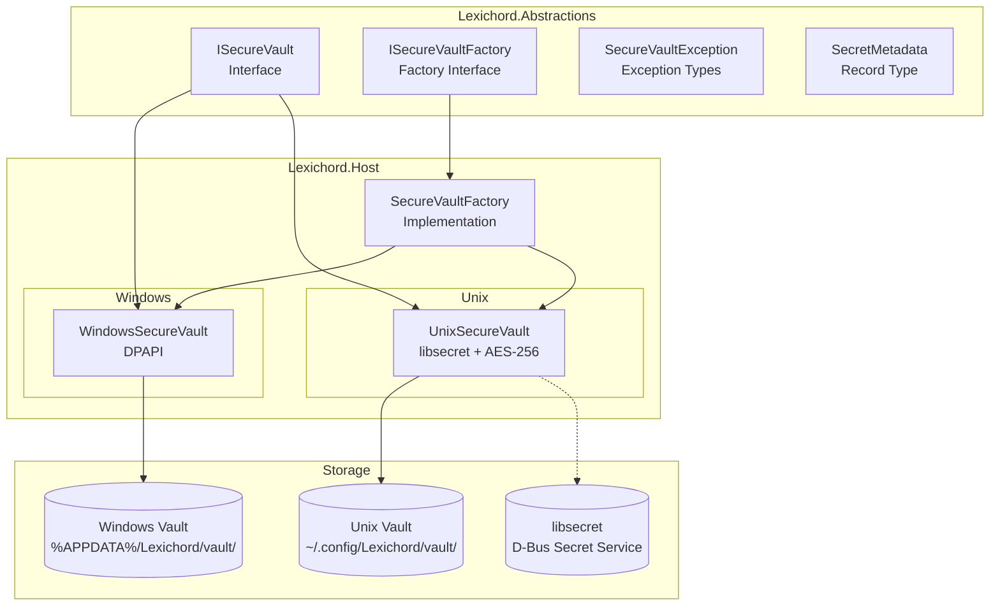
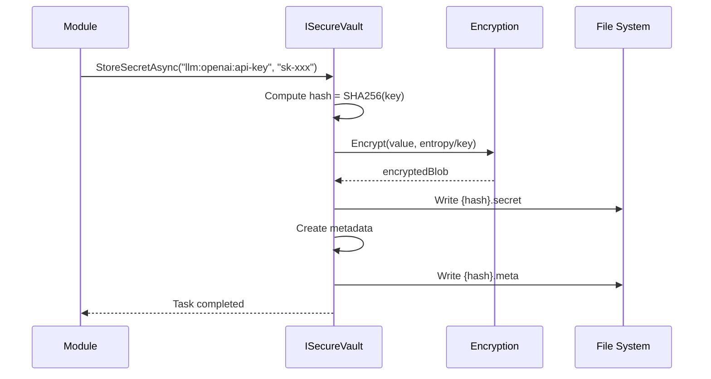
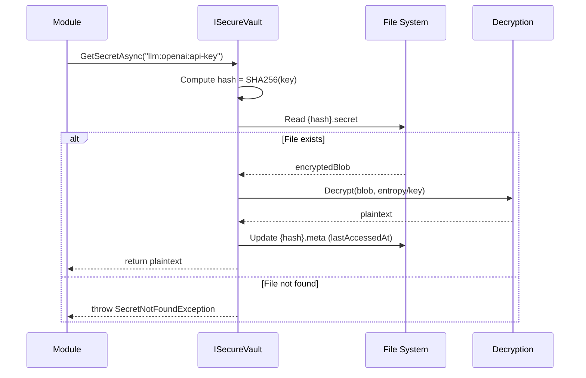

# LCS-01: Feature Design Composition

## 1. Metadata & Categorization

| Field                | Value                                      | Description                                      |
| :------------------- | :----------------------------------------- | :----------------------------------------------- |
| **Feature ID**       | `INF-006`                                  | Infrastructure - The Vault (Security)            |
| **Feature Name**     | Secure Secrets Storage                     | Platform-specific encrypted credential storage.  |
| **Target Version**   | `v0.0.6`                                   | Infrastructure Foundation Layer.                 |
| **Module Scope**     | `Lexichord.Abstractions`, `Lexichord.Host` | Vault contracts and platform implementations.    |
| **Swimlane**         | `Infrastructure`                           | The Vault (Security).                            |
| **License Tier**     | `Core`                                     | Foundation (Required for all tiers).             |
| **Feature Gate Key** | N/A                                        | No runtime gating for security infrastructure.   |
| **Author**           | System Architect                           |                                                  |
| **Status**           | **Draft**                                  | Pending approval.                                |
| **Last Updated**     | 2026-01-26                                 |                                                  |

---

## 2. Executive Summary

### 2.1 The Requirement

Lexichord modules require access to sensitive credentials:

- **LLM API Keys** (OpenAI, Anthropic, Ollama tokens)
- **Cloud Service Credentials** (S3 buckets, Azure Blob)
- **Database Connection Strings** (with embedded passwords)
- **OAuth Tokens** (for third-party integrations)

Storing these in plain text (config files, environment variables) is a **critical security vulnerability**:

- Config files can be accidentally committed to Git.
- Environment variables are visible in process listings.
- Plain text files can be read by any process with file access.

### 2.2 The Proposed Solution

We **SHALL** implement a secure vault infrastructure with:

1. **v0.0.6a: ISecureVault Interface** — Platform-agnostic contract in Abstractions.
2. **v0.0.6b: WindowsSecureVault** — DPAPI-based encryption using `ProtectedData`.
3. **v0.0.6c: UnixSecureVault** — `libsecret` integration with AES-256 fallback.
4. **v0.0.6d: Integration Test** — Verify secrets survive restart.

### 2.3 Security Model

```text
┌────────────────────────────────────────────────────────────────────────┐
│                         THREAT MODEL                                    │
├────────────────────────────────────────────────────────────────────────┤
│ Attacker with:                                                          │
│   - File system read access (other user)        → PROTECTED (encrypted) │
│   - Process memory dump (same user)             → PARTIALLY PROTECTED   │
│   - Physical access (different machine)         → PROTECTED (machine-key)│
│   - Malware as same user                        → NOT PROTECTED         │
├────────────────────────────────────────────────────────────────────────┤
│ Design Assumption: If attacker has same-user code execution,            │
│ they can access anything the user can. We protect against EXTERNAL      │
│ threats, not same-user malware (requires endpoint security).            │
└────────────────────────────────────────────────────────────────────────┘
```

---

## 3. Architecture & Modular Strategy

### 3.1 High-Level Architecture



### 3.2 Dependencies

- **NuGet Packages:**

| Package                                 | Version | Purpose                           |
| :-------------------------------------- | :------ | :-------------------------------- |
| `System.Security.Cryptography`          | (BCL)   | DPAPI, AES-256 primitives         |
| `Tmds.DBus` (optional)                  | 0.15.x  | D-Bus communication for libsecret |
| `Konscious.Security.Cryptography.Argon2`| 1.3.x   | Memory-hard key derivation        |

- **Project References:**

| Project                  | Reference Direction        |
| :----------------------- | :------------------------- |
| `Lexichord.Host`         | -> `Lexichord.Abstractions` |
| `Lexichord.Abstractions` | (No references)            |

### 3.3 Licensing Behavior

- **N/A:** The vault is Core infrastructure required by all license tiers.

---

## 4. Decision Tree: Platform Selection

```text
START: "Which vault implementation should be used?"
|
+-- OperatingSystem.IsWindows()?
|   |
|   +-- YES --> Is DPAPI available?
|   |   |
|   |   +-- YES --> Use WindowsSecureVault (DPAPI)
|   |   |           Scope: CurrentUser
|   |   |           Storage: %APPDATA%/Lexichord/vault/
|   |   |
|   |   +-- NO --> Use WindowsSecureVault (AES-256 Fallback)
|   |              Log: "DPAPI unavailable, using AES-256 fallback"
|   |
|   +-- NO --> OperatingSystem.IsLinux()?
|       |
|       +-- YES --> Is D-Bus Secret Service available?
|       |   |
|       |   +-- YES --> Use UnixSecureVault (libsecret)
|       |   |           Schema: org.lexichord.vault
|       |   |
|       |   +-- NO --> Use UnixSecureVault (AES-256)
|       |              Storage: ~/.config/Lexichord/vault/
|       |
|       +-- NO --> OperatingSystem.IsMacOS()?
|           |
|           +-- YES --> Use UnixSecureVault (AES-256)
|                       Storage: ~/Library/Application Support/Lexichord/vault/
|                       (Future: Keychain Services integration)
```

---

## 5. Data Contracts

### 5.1 Interfaces (Lexichord.Abstractions)

```csharp
namespace Lexichord.Abstractions.Contracts;

/// <summary>
/// Provides secure storage for sensitive secrets (API keys, tokens, credentials).
/// </summary>
/// <remarks>
/// LOGIC: The vault encrypts secrets at rest using platform-specific mechanisms:
/// - Windows: DPAPI (Data Protection API) with CurrentUser scope
/// - Linux: libsecret (D-Bus Secret Service) or AES-256 with machine-derived key
/// - macOS: AES-256 with machine-derived key (future: Keychain Services)
///
/// Keys are namespace-qualified strings (e.g., "llm:openai:api-key") to avoid
/// collisions between modules. All operations are async for potential I/O.
/// </remarks>
public interface ISecureVault
{
    /// <summary>
    /// Stores a secret value securely.
    /// </summary>
    /// <param name="key">The unique identifier for the secret (namespace-qualified).</param>
    /// <param name="value">The secret value to encrypt and store.</param>
    /// <param name="cancellationToken">Cancellation token.</param>
    /// <returns>A task representing the async operation.</returns>
    /// <exception cref="VaultAccessDeniedException">Permission denied to vault storage.</exception>
    /// <exception cref="SecureVaultException">General vault operation failure.</exception>
    /// <remarks>
    /// LOGIC: If a secret with the same key exists, it will be overwritten.
    /// The operation is atomic—either fully succeeds or fails without partial state.
    /// </remarks>
    Task StoreSecretAsync(string key, string value, CancellationToken cancellationToken = default);

    /// <summary>
    /// Retrieves a secret value.
    /// </summary>
    /// <param name="key">The unique identifier for the secret.</param>
    /// <param name="cancellationToken">Cancellation token.</param>
    /// <returns>The decrypted secret value.</returns>
    /// <exception cref="SecretNotFoundException">The specified key does not exist.</exception>
    /// <exception cref="VaultAccessDeniedException">Permission denied to vault storage.</exception>
    /// <exception cref="SecureVaultException">Decryption or general failure.</exception>
    /// <remarks>
    /// LOGIC: This method updates the LastAccessedAt metadata for the secret.
    /// The returned string is the original plaintext; callers should avoid
    /// logging or persisting this value.
    /// </remarks>
    Task<string> GetSecretAsync(string key, CancellationToken cancellationToken = default);

    /// <summary>
    /// Deletes a secret from the vault.
    /// </summary>
    /// <param name="key">The unique identifier for the secret.</param>
    /// <param name="cancellationToken">Cancellation token.</param>
    /// <returns>True if the secret existed and was deleted; false if it didn't exist.</returns>
    /// <exception cref="VaultAccessDeniedException">Permission denied to vault storage.</exception>
    /// <exception cref="SecureVaultException">General vault operation failure.</exception>
    /// <remarks>
    /// LOGIC: This operation is idempotent—deleting a non-existent key returns false
    /// without throwing. The underlying storage is securely wiped.
    /// </remarks>
    Task<bool> DeleteSecretAsync(string key, CancellationToken cancellationToken = default);

    /// <summary>
    /// Checks if a secret exists in the vault.
    /// </summary>
    /// <param name="key">The unique identifier for the secret.</param>
    /// <param name="cancellationToken">Cancellation token.</param>
    /// <returns>True if the secret exists; false otherwise.</returns>
    /// <exception cref="VaultAccessDeniedException">Permission denied to vault storage.</exception>
    /// <remarks>
    /// LOGIC: This method does NOT update LastAccessedAt (read-without-access pattern).
    /// Use this to check availability before prompting user for credentials.
    /// </remarks>
    Task<bool> SecretExistsAsync(string key, CancellationToken cancellationToken = default);

    /// <summary>
    /// Retrieves metadata about a stored secret without accessing its value.
    /// </summary>
    /// <param name="key">The unique identifier for the secret.</param>
    /// <param name="cancellationToken">Cancellation token.</param>
    /// <returns>Metadata about the secret, or null if it doesn't exist.</returns>
    /// <remarks>
    /// LOGIC: Use this to display secret information in UI without decrypting.
    /// LastAccessedAt is NOT updated by this call.
    /// </remarks>
    Task<SecretMetadata?> GetSecretMetadataAsync(string key, CancellationToken cancellationToken = default);

    /// <summary>
    /// Lists all secret keys stored in the vault.
    /// </summary>
    /// <param name="prefix">Optional prefix filter (e.g., "llm:" to list all LLM keys).</param>
    /// <param name="cancellationToken">Cancellation token.</param>
    /// <returns>Enumerable of secret keys matching the prefix.</returns>
    /// <remarks>
    /// LOGIC: Returns only key names, not values. Use this to populate
    /// settings UI with available credentials.
    /// </remarks>
    IAsyncEnumerable<string> ListSecretsAsync(string? prefix = null, CancellationToken cancellationToken = default);
}
```

### 5.2 SecretMetadata Record

```csharp
namespace Lexichord.Abstractions.Contracts;

/// <summary>
/// Metadata about a stored secret.
/// </summary>
/// <param name="KeyName">The full key name of the secret.</param>
/// <param name="CreatedAt">When the secret was first stored.</param>
/// <param name="LastAccessedAt">When the secret was last retrieved (decrypted).</param>
/// <param name="LastModifiedAt">When the secret value was last updated.</param>
/// <remarks>
/// LOGIC: Metadata is stored alongside the encrypted secret to enable
/// audit logging and stale credential detection without decryption.
/// </remarks>
public record SecretMetadata(
    string KeyName,
    DateTimeOffset CreatedAt,
    DateTimeOffset? LastAccessedAt,
    DateTimeOffset LastModifiedAt
);
```

### 5.3 Exception Types

```csharp
namespace Lexichord.Abstractions.Contracts;

/// <summary>
/// Base exception for all secure vault operations.
/// </summary>
public class SecureVaultException : Exception
{
    public SecureVaultException(string message) : base(message) { }
    public SecureVaultException(string message, Exception innerException)
        : base(message, innerException) { }
}

/// <summary>
/// Thrown when a requested secret does not exist in the vault.
/// </summary>
public class SecretNotFoundException : SecureVaultException
{
    public string KeyName { get; }

    public SecretNotFoundException(string keyName)
        : base($"Secret '{keyName}' was not found in the vault.")
    {
        KeyName = keyName;
    }
}

/// <summary>
/// Thrown when the vault cannot be accessed due to permission issues.
/// </summary>
public class VaultAccessDeniedException : SecureVaultException
{
    public VaultAccessDeniedException(string message)
        : base(message) { }

    public VaultAccessDeniedException(string message, Exception innerException)
        : base(message, innerException) { }
}

/// <summary>
/// Thrown when secret decryption fails (corrupted data, key mismatch).
/// </summary>
public class SecretDecryptionException : SecureVaultException
{
    public string KeyName { get; }

    public SecretDecryptionException(string keyName, Exception innerException)
        : base($"Failed to decrypt secret '{keyName}'. The vault may be corrupted or the encryption key has changed.", innerException)
    {
        KeyName = keyName;
    }
}
```

### 5.4 Factory Interface

```csharp
namespace Lexichord.Abstractions.Contracts;

/// <summary>
/// Factory for creating platform-specific secure vault instances.
/// </summary>
/// <remarks>
/// LOGIC: The factory abstracts platform detection from consumers.
/// Modules should inject ISecureVault directly; the Host registers
/// the appropriate implementation via ISecureVaultFactory at startup.
/// </remarks>
public interface ISecureVaultFactory
{
    /// <summary>
    /// Creates the appropriate secure vault for the current platform.
    /// </summary>
    /// <returns>A configured ISecureVault instance.</returns>
    ISecureVault CreateVault();

    /// <summary>
    /// Gets the name of the vault implementation being used.
    /// </summary>
    /// <remarks>
    /// Examples: "WindowsSecureVault (DPAPI)", "UnixSecureVault (libsecret)",
    /// "UnixSecureVault (AES-256 Fallback)"
    /// </remarks>
    string VaultImplementationName { get; }
}
```

---

## 6. Implementation Logic

### 6.1 Storage Format

Each secret is stored as a pair of files:

```text
vault/
+-- {hash}.secret      # Encrypted secret blob
+-- {hash}.meta        # JSON metadata (unencrypted, no sensitive data)
+-- .entropy           # Installation-specific entropy (Windows DPAPI)
+-- .salt              # Key derivation salt (AES-256 mode)
```

**File naming:** `{hash}` = SHA256(keyName) encoded as hex, truncated to 32 chars.

### 6.2 Secret File Format (.secret)

**Windows (DPAPI):**
```
[4 bytes: version (0x01)]
[4 bytes: encrypted length]
[N bytes: ProtectedData blob]
```

**Unix (AES-256-GCM):**
```
[4 bytes: version (0x01)]
[12 bytes: IV/nonce]
[16 bytes: authentication tag]
[N bytes: ciphertext]
```

### 6.3 Metadata File Format (.meta)

```json
{
  "keyName": "llm:openai:api-key",
  "createdAt": "2026-01-26T10:30:00Z",
  "lastAccessedAt": "2026-01-26T14:22:00Z",
  "lastModifiedAt": "2026-01-26T10:30:00Z",
  "version": 1
}
```

---

## 7. Implementation Workflow

### 7.1 Sequence: Store Secret



### 7.2 Sequence: Get Secret



---

## 8. Use Cases & User Stories

### 8.1 User Stories

| ID    | Role      | Story                                                                          | Acceptance Criteria                                 |
| :---- | :-------- | :----------------------------------------------------------------------------- | :-------------------------------------------------- |
| US-01 | User      | As a user, I want my API keys encrypted so they can't be read from disk.       | Secrets are stored in encrypted binary format.      |
| US-02 | User      | As a user, I want my secrets to persist across app restarts.                   | Stored secret retrievable after restart.            |
| US-03 | User      | As a user, I want to delete stored credentials when revoking access.           | DeleteSecretAsync removes secret completely.        |
| US-04 | Developer | As a developer, I want to check if a credential exists before prompting user.  | SecretExistsAsync returns true/false without decrypt.|
| US-05 | Developer | As a developer, I want to list all configured API keys in settings UI.         | ListSecretsAsync returns key names for display.     |
| US-06 | Admin     | As an admin, I want vault operations logged for security audit.                | All vault operations emit structured log events.    |

### 8.2 Use Cases

#### UC-01: First-Time API Key Storage

**Preconditions:**
- Lexichord is running.
- No API key for "openai" exists in vault.

**Flow:**
1. User navigates to Settings > API Keys.
2. User enters OpenAI API key in input field.
3. User clicks "Save".
4. Settings module calls `vault.StoreSecretAsync("llm:openai:api-key", userInput)`.
5. Vault encrypts key using platform mechanism.
6. Vault writes encrypted file to disk.
7. UI shows success confirmation.

**Postconditions:**
- Secret exists in vault.
- Original input cleared from memory.

---

#### UC-02: Module Retrieves API Key

**Preconditions:**
- API key "llm:openai:api-key" exists in vault.
- LLM module needs to make API call.

**Flow:**
1. LLM module calls `vault.GetSecretAsync("llm:openai:api-key")`.
2. Vault reads encrypted file.
3. Vault decrypts using platform mechanism.
4. Vault updates LastAccessedAt metadata.
5. Module receives plaintext API key.
6. Module uses key for HTTP request.
7. Module clears key from memory after use.

**Postconditions:**
- API call succeeds.
- Metadata reflects access time.

---

## 9. Observability & Logging

### 9.1 Log Events

| Level   | Context       | Message Template                                                        |
| :------ | :------------ | :---------------------------------------------------------------------- |
| Info    | SecureVault   | `Secret stored: Key={KeyHash}, Implementation={VaultType}`              |
| Info    | SecureVault   | `Secret retrieved: Key={KeyHash}, Age={DaysSinceCreation}d`             |
| Info    | SecureVault   | `Secret deleted: Key={KeyHash}`                                         |
| Warning | SecureVault   | `Secret not found: Key={KeyHash}`                                       |
| Warning | SecureVault   | `Decryption failed: Key={KeyHash}, Reason={ErrorMessage}`               |
| Error   | SecureVault   | `Vault access denied: Path={VaultPath}, Error={ErrorMessage}`           |
| Debug   | SecureVault   | `Vault initialized: Implementation={VaultType}, Path={VaultPath}`       |
| Debug   | SecureVault   | `libsecret: Service available={Available}, Schema={SchemaName}`         |

> [!IMPORTANT]
> **NEVER log secret values.** Use hashed key names for identification.
> KeyHash = First 8 characters of SHA256(keyName).

### 9.2 Audit Trail

```csharp
// Example: Structured logging for audit compliance
_logger.LogInformation(
    "Vault operation completed: Operation={Operation}, KeyHash={KeyHash}, Timestamp={Timestamp}",
    "Store",
    ComputeKeyHash(key),
    DateTimeOffset.UtcNow);
```

---

## 10. Unit Testing Requirements

### 10.1 Test Scenarios

#### ISecureVault Interface Tests (Mocked)

```csharp
[Trait("Category", "Unit")]
public class SecureVaultContractTests
{
    [Fact]
    public async Task StoreAndRetrieve_RoundTripsCorrectly()
    {
        // Arrange
        var vault = CreateTestVault();
        const string key = "test:api-key";
        const string value = "sk-1234567890abcdef";

        // Act
        await vault.StoreSecretAsync(key, value);
        var retrieved = await vault.GetSecretAsync(key);

        // Assert
        retrieved.Should().Be(value);
    }

    [Fact]
    public async Task GetSecret_WhenNotExists_ThrowsSecretNotFoundException()
    {
        // Arrange
        var vault = CreateTestVault();

        // Act
        Func<Task> act = () => vault.GetSecretAsync("nonexistent:key");

        // Assert
        await act.Should().ThrowAsync<SecretNotFoundException>()
            .Where(ex => ex.KeyName == "nonexistent:key");
    }

    [Fact]
    public async Task DeleteSecret_WhenExists_ReturnsTrue()
    {
        // Arrange
        var vault = CreateTestVault();
        await vault.StoreSecretAsync("test:key", "value");

        // Act
        var result = await vault.DeleteSecretAsync("test:key");

        // Assert
        result.Should().BeTrue();
        (await vault.SecretExistsAsync("test:key")).Should().BeFalse();
    }

    [Fact]
    public async Task DeleteSecret_WhenNotExists_ReturnsFalse()
    {
        // Arrange
        var vault = CreateTestVault();

        // Act
        var result = await vault.DeleteSecretAsync("nonexistent:key");

        // Assert
        result.Should().BeFalse();
    }

    [Fact]
    public async Task SecretExists_WhenStored_ReturnsTrue()
    {
        // Arrange
        var vault = CreateTestVault();
        await vault.StoreSecretAsync("test:key", "value");

        // Act
        var exists = await vault.SecretExistsAsync("test:key");

        // Assert
        exists.Should().BeTrue();
    }

    [Fact]
    public async Task GetMetadata_ReturnsCorrectTimestamps()
    {
        // Arrange
        var vault = CreateTestVault();
        var beforeStore = DateTimeOffset.UtcNow;
        await vault.StoreSecretAsync("test:key", "value");

        // Act
        var metadata = await vault.GetSecretMetadataAsync("test:key");

        // Assert
        metadata.Should().NotBeNull();
        metadata!.CreatedAt.Should().BeOnOrAfter(beforeStore);
        metadata.KeyName.Should().Be("test:key");
    }

    [Fact]
    public async Task ListSecrets_WithPrefix_FiltersCorrectly()
    {
        // Arrange
        var vault = CreateTestVault();
        await vault.StoreSecretAsync("llm:openai:key", "value1");
        await vault.StoreSecretAsync("llm:anthropic:key", "value2");
        await vault.StoreSecretAsync("storage:s3:key", "value3");

        // Act
        var llmKeys = await vault.ListSecretsAsync("llm:").ToListAsync();

        // Assert
        llmKeys.Should().HaveCount(2);
        llmKeys.Should().Contain("llm:openai:key");
        llmKeys.Should().Contain("llm:anthropic:key");
    }
}
```

---

## 11. Security & Safety

### 11.1 Cryptographic Standards

| Component       | Algorithm          | Notes                                        |
| :-------------- | :----------------- | :------------------------------------------- |
| Windows         | DPAPI (AES-256)    | OS-managed key, CurrentUser scope            |
| AES Mode        | AES-256-GCM        | Authenticated encryption, 256-bit key        |
| Key Derivation  | PBKDF2-SHA256      | 100,000 iterations minimum                   |
| Key Hash        | SHA256             | For file naming (not security-critical)      |
| Nonce/IV        | CSPRNG             | 12 bytes for AES-GCM, never reused           |

### 11.2 Security Best Practices

```csharp
// DO: Clear sensitive data from memory after use
private void ClearSensitiveData(byte[] data)
{
    if (data != null)
    {
        CryptographicOperations.ZeroMemory(data.AsSpan());
    }
}

// DO: Use constant-time comparison for authentication tags
private bool ValidateTag(ReadOnlySpan<byte> expected, ReadOnlySpan<byte> actual)
{
    return CryptographicOperations.FixedTimeEquals(expected, actual);
}

// DON'T: Log or expose secret values
// BAD: _logger.LogDebug("Retrieved secret: {Value}", secretValue);
// GOOD: _logger.LogDebug("Retrieved secret: Key={KeyHash}", ComputeKeyHash(key));
```

### 11.3 File Permissions

| Platform | Permission | Description                        |
| :------- | :--------- | :--------------------------------- |
| Windows  | User ACL   | Only creating user has access      |
| Linux    | 0600       | Owner read/write only              |
| macOS    | 0600       | Owner read/write only              |

---

## 12. Risks & Mitigations

| Risk                                    | Impact | Mitigation                                                        |
| :-------------------------------------- | :----- | :---------------------------------------------------------------- |
| DPAPI unavailable (Windows Server Core) | Medium | Detect and fall back to AES-256 implementation.                   |
| libsecret not running (headless Linux)  | Low    | AES-256 fallback is always available.                             |
| Machine key changes (reinstall)         | High   | Document that vault is machine-specific; provide migration guide. |
| Entropy file deleted                    | High   | Regenerate entropy, but existing secrets become unreadable.       |
| Same-user malware                       | High   | Out of scope—requires endpoint security solution.                 |
| Memory scraping                         | Medium | Clear buffers after use; use SecureString where applicable.       |

---

## 13. Acceptance Criteria (QA)

| #   | Category         | Criterion                                                                    |
| :-- | :--------------- | :--------------------------------------------------------------------------- |
| 1   | **[Interface]**  | `ISecureVault` exists in Abstractions with all specified methods.            |
| 2   | **[Exceptions]** | `SecretNotFoundException`, `VaultAccessDeniedException` types exist.         |
| 3   | **[Windows]**    | `WindowsSecureVault` encrypts using DPAPI with CurrentUser scope.            |
| 4   | **[Unix]**       | `UnixSecureVault` uses libsecret when available.                             |
| 5   | **[Fallback]**   | AES-256 fallback works when libsecret unavailable.                           |
| 6   | **[Persist]**    | Secrets survive application restart.                                         |
| 7   | **[Delete]**     | DeleteSecretAsync removes secret completely.                                 |
| 8   | **[Metadata]**   | GetSecretMetadataAsync returns accurate timestamps.                          |
| 9   | **[List]**       | ListSecretsAsync returns keys with optional prefix filter.                   |
| 10  | **[Logging]**    | Vault operations emit structured log events (no secret values logged).       |
| 11  | **[Factory]**    | ISecureVaultFactory returns correct implementation per platform.             |

---

## 14. Verification Commands

```bash
# ===========================================================================
# v0.0.6 Verification
# ===========================================================================

# 1. Verify interface exists
grep -l "ISecureVault" src/Lexichord.Abstractions/Contracts/*.cs
# Expected: ISecureVault.cs

# 2. Verify implementations exist
grep -l "class WindowsSecureVault" src/Lexichord.Host/Services/Security/*.cs
grep -l "class UnixSecureVault" src/Lexichord.Host/Services/Security/*.cs

# 3. Build and run
dotnet build --configuration Release

# 4. Run unit tests
dotnet test --filter "Category=Unit&FullyQualifiedName~SecureVault"

# 5. Run integration tests
dotnet test --filter "Category=Integration&FullyQualifiedName~SecureVault"

# 6. Manual verification:
# a) Run app and store a test secret via debug console
# b) Check vault directory exists:
#    Windows: dir %APPDATA%\Lexichord\vault\
#    Linux: ls -la ~/.config/Lexichord/vault/
# c) Restart app and retrieve secret
# d) Verify exact match
```

---

## 15. Deliverable Checklist

| Step | Description                                                           | Status |
| :--- | :-------------------------------------------------------------------- | :----- |
| 1    | `ISecureVault` interface defined in Abstractions.                     | [ ]    |
| 2    | `SecretMetadata` record defined in Abstractions.                      | [ ]    |
| 3    | `SecureVaultException` and derived types defined.                     | [ ]    |
| 4    | `ISecureVaultFactory` interface defined.                              | [ ]    |
| 5    | `WindowsSecureVault` implementation using DPAPI.                      | [ ]    |
| 6    | `UnixSecureVault` implementation with libsecret + AES-256 fallback.   | [ ]    |
| 7    | `SecureVaultFactory` platform detection implementation.               | [ ]    |
| 8    | Vault registered in DI container.                                     | [ ]    |
| 9    | Unit tests for vault contract pass.                                   | [ ]    |
| 10   | Integration test for store-restart-retrieve passes.                   | [ ]    |
| 11   | Structured logging implemented (no secret values).                    | [ ]    |
| 12   | CI pipeline runs vault tests on Windows and Linux.                    | [ ]    |
