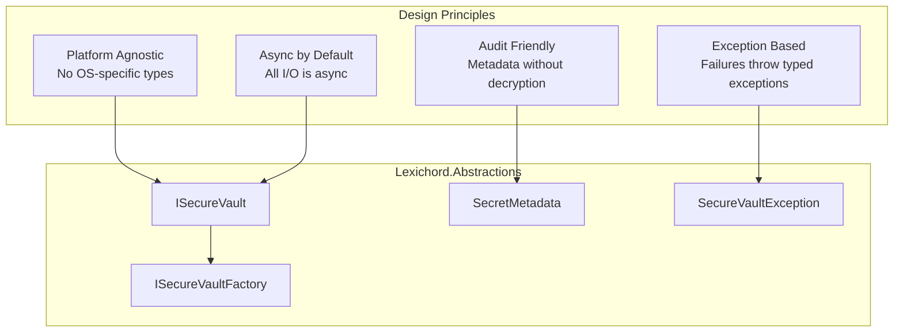

# LCS-01: Feature Design Composition

## 1. Metadata & Categorization

| Field                | Value                       | Description                                         |
| :------------------- | :-------------------------- | :-------------------------------------------------- |
| **Feature ID**       | `INF-006a`                  | Infrastructure - Vault Interface                    |
| **Feature Name**     | ISecureVault Interface      | Platform-agnostic secure storage contract.          |
| **Target Version**   | `v0.0.6a`                   | Infrastructure Foundation Layer.                    |
| **Module Scope**     | `Lexichord.Abstractions`    | Contract definitions only.                          |
| **Swimlane**         | `Infrastructure`            | The Vault (Security).                               |
| **License Tier**     | `Core`                      | Foundation (Required for all tiers).                |
| **Feature Gate Key** | N/A                         | No runtime gating for interface definition.         |
| **Author**           | System Architect            |                                                     |
| **Status**           | **Draft**                   | Pending approval.                                   |
| **Last Updated**     | 2026-01-26                  |                                                     |

---

## 2. Executive Summary

### 2.1 The Requirement

To implement secure secret storage across multiple platforms (Windows, Linux, macOS), we need:

- A **unified interface** that modules can depend on without knowing platform specifics.
- **Exception types** for predictable error handling across implementations.
- **Metadata support** for audit trails and credential lifecycle management.
- **Factory pattern** for platform-appropriate implementation selection.

### 2.2 The Proposed Solution

We **SHALL** define in `Lexichord.Abstractions`:

1. **ISecureVault** interface with CRUD operations for secrets.
2. **SecretMetadata** record for non-sensitive secret information.
3. **SecureVaultException** hierarchy for typed error handling.
4. **ISecureVaultFactory** for platform detection and vault creation.

### 2.3 Current State vs Target State

| Component               | Current State | Target State (v0.0.6a)                       |
| :---------------------- | :------------ | :------------------------------------------- |
| `ISecureVault`          | Missing       | Interface with Store/Get/Delete/Exists/List  |
| `SecretMetadata`        | Missing       | Record with timestamps and key name          |
| `SecureVaultException`  | Missing       | Base + derived exception types               |
| `ISecureVaultFactory`   | Missing       | Factory interface for vault creation         |

---

## 3. Architecture & Modular Strategy

### 3.1 Interface Design Philosophy



### 3.2 File Structure After v0.0.6a

```text
src/Lexichord.Abstractions/
+-- Contracts/
|   +-- Security/
|       +-- ISecureVault.cs          # NEW: Main vault interface
|       +-- ISecureVaultFactory.cs   # NEW: Factory interface
|       +-- SecretMetadata.cs        # NEW: Metadata record
|       +-- SecureVaultException.cs  # NEW: Exception types
```

### 3.3 Dependencies

- **No external dependencies** — Abstractions remains dependency-free.
- Uses only BCL types (`Task`, `string`, `DateTimeOffset`, `IAsyncEnumerable`).

---

## 4. Decision Tree: Method Design

```text
START: "Should this operation require decryption?"
|
+-- Store operation
|   +-- Requires encryption (write encrypted bytes)
|   +-- Updates CreatedAt/LastModifiedAt metadata
|   +-- Overwrites existing secret if key matches
|
+-- Get operation
|   +-- Requires decryption (read encrypted bytes)
|   +-- Updates LastAccessedAt metadata
|   +-- Throws SecretNotFoundException if missing
|
+-- Delete operation
|   +-- No decryption needed
|   +-- Returns bool (idempotent)
|   +-- Removes both .secret and .meta files
|
+-- Exists operation
|   +-- No decryption needed (check file existence)
|   +-- Does NOT update LastAccessedAt
|   +-- Use for UI "check before prompt" pattern
|
+-- GetMetadata operation
|   +-- No decryption needed (read .meta file only)
|   +-- Does NOT update LastAccessedAt
|   +-- Returns null if secret doesn't exist
|
+-- List operation
|   +-- No decryption needed (read .meta files)
|   +-- Streams results via IAsyncEnumerable
|   +-- Supports prefix filtering
```

---

## 5. Data Contracts

### 5.1 ISecureVault Interface

```csharp
using System;
using System.Collections.Generic;
using System.Threading;
using System.Threading.Tasks;

namespace Lexichord.Abstractions.Contracts.Security;

/// <summary>
/// Provides secure storage for sensitive secrets (API keys, tokens, credentials).
/// </summary>
/// <remarks>
/// LOGIC: The vault encrypts secrets at rest using platform-specific mechanisms:
/// - Windows: DPAPI (Data Protection API) with CurrentUser scope
/// - Linux: libsecret (D-Bus Secret Service) or AES-256 with machine-derived key
/// - macOS: AES-256 with machine-derived key (future: Keychain Services)
///
/// <para><b>Key Naming Convention:</b></para>
/// Keys are namespace-qualified strings to avoid collisions between modules:
/// <list type="bullet">
///   <item><c>llm:openai:api-key</c> - LLM module, OpenAI provider</item>
///   <item><c>storage:s3:access-key</c> - Storage module, S3 provider</item>
///   <item><c>auth:oauth:{provider}:token</c> - OAuth tokens</item>
/// </list>
///
/// <para><b>Thread Safety:</b></para>
/// Implementations MUST be thread-safe. Multiple concurrent operations on
/// different keys are allowed. Operations on the same key are serialized.
///
/// <para><b>Memory Safety:</b></para>
/// Callers SHOULD clear returned secret values from memory after use.
/// Implementations SHOULD use <see cref="System.Security.Cryptography.CryptographicOperations.ZeroMemory"/>
/// to clear internal buffers.
/// </remarks>
public interface ISecureVault
{
    /// <summary>
    /// Stores a secret value securely.
    /// </summary>
    /// <param name="key">
    /// The unique identifier for the secret (namespace-qualified).
    /// Must be non-null, non-empty, and contain only printable ASCII characters.
    /// Maximum length: 256 characters.
    /// </param>
    /// <param name="value">
    /// The secret value to encrypt and store.
    /// Must be non-null. Empty string is allowed (though unusual).
    /// Maximum length: 1MB (1,048,576 bytes when UTF-8 encoded).
    /// </param>
    /// <param name="cancellationToken">Cancellation token.</param>
    /// <returns>A task representing the async operation.</returns>
    /// <exception cref="ArgumentNullException">
    /// <paramref name="key"/> or <paramref name="value"/> is null.
    /// </exception>
    /// <exception cref="ArgumentException">
    /// <paramref name="key"/> is empty, exceeds 256 characters, or contains invalid characters.
    /// </exception>
    /// <exception cref="VaultAccessDeniedException">
    /// Permission denied to vault storage location.
    /// </exception>
    /// <exception cref="SecureVaultException">
    /// General vault operation failure (I/O error, encryption failure).
    /// </exception>
    /// <remarks>
    /// LOGIC: If a secret with the same key exists, it will be overwritten.
    /// The operation is atomic—either fully succeeds or fails without partial state.
    ///
    /// <para><b>Metadata Updates:</b></para>
    /// <list type="bullet">
    ///   <item>New secret: Sets CreatedAt, LastModifiedAt to current UTC time.</item>
    ///   <item>Overwrite: Preserves CreatedAt, updates LastModifiedAt.</item>
    /// </list>
    /// </remarks>
    Task StoreSecretAsync(string key, string value, CancellationToken cancellationToken = default);

    /// <summary>
    /// Retrieves a secret value by decrypting it from storage.
    /// </summary>
    /// <param name="key">The unique identifier for the secret.</param>
    /// <param name="cancellationToken">Cancellation token.</param>
    /// <returns>The decrypted secret value (original plaintext).</returns>
    /// <exception cref="ArgumentNullException">
    /// <paramref name="key"/> is null.
    /// </exception>
    /// <exception cref="SecretNotFoundException">
    /// The specified key does not exist in the vault.
    /// </exception>
    /// <exception cref="SecretDecryptionException">
    /// The secret exists but cannot be decrypted (corrupted or key mismatch).
    /// </exception>
    /// <exception cref="VaultAccessDeniedException">
    /// Permission denied to vault storage location.
    /// </exception>
    /// <exception cref="SecureVaultException">
    /// General vault operation failure.
    /// </exception>
    /// <remarks>
    /// LOGIC: This method updates the LastAccessedAt metadata timestamp.
    ///
    /// <para><b>Security Warning:</b></para>
    /// The returned string contains the plaintext secret. Callers SHOULD:
    /// <list type="bullet">
    ///   <item>Avoid logging or persisting the returned value.</item>
    ///   <item>Clear the string from memory after use (where possible).</item>
    ///   <item>Minimize the lifetime of the returned value.</item>
    /// </list>
    /// </remarks>
    Task<string> GetSecretAsync(string key, CancellationToken cancellationToken = default);

    /// <summary>
    /// Deletes a secret from the vault.
    /// </summary>
    /// <param name="key">The unique identifier for the secret.</param>
    /// <param name="cancellationToken">Cancellation token.</param>
    /// <returns>
    /// <c>true</c> if the secret existed and was deleted;
    /// <c>false</c> if the secret did not exist.
    /// </returns>
    /// <exception cref="ArgumentNullException">
    /// <paramref name="key"/> is null.
    /// </exception>
    /// <exception cref="VaultAccessDeniedException">
    /// Permission denied to vault storage location.
    /// </exception>
    /// <exception cref="SecureVaultException">
    /// General vault operation failure (I/O error).
    /// </exception>
    /// <remarks>
    /// LOGIC: This operation is idempotent—deleting a non-existent key returns
    /// <c>false</c> without throwing an exception.
    ///
    /// <para><b>Secure Deletion:</b></para>
    /// Implementations SHOULD overwrite the file with zeros before deletion
    /// to prevent recovery from disk forensics (where supported by filesystem).
    /// </remarks>
    Task<bool> DeleteSecretAsync(string key, CancellationToken cancellationToken = default);

    /// <summary>
    /// Checks if a secret exists in the vault without decrypting it.
    /// </summary>
    /// <param name="key">The unique identifier for the secret.</param>
    /// <param name="cancellationToken">Cancellation token.</param>
    /// <returns><c>true</c> if the secret exists; <c>false</c> otherwise.</returns>
    /// <exception cref="ArgumentNullException">
    /// <paramref name="key"/> is null.
    /// </exception>
    /// <exception cref="VaultAccessDeniedException">
    /// Permission denied to vault storage location.
    /// </exception>
    /// <remarks>
    /// LOGIC: This method does NOT:
    /// <list type="bullet">
    ///   <item>Decrypt the secret (no cryptographic operations).</item>
    ///   <item>Update the LastAccessedAt timestamp.</item>
    ///   <item>Verify the secret is still decryptable.</item>
    /// </list>
    ///
    /// <para><b>Use Case:</b></para>
    /// Check credential availability before prompting user for input:
    /// <code>
    /// if (!await vault.SecretExistsAsync("llm:openai:api-key"))
    /// {
    ///     // Prompt user to enter API key
    /// }
    /// </code>
    /// </remarks>
    Task<bool> SecretExistsAsync(string key, CancellationToken cancellationToken = default);

    /// <summary>
    /// Retrieves metadata about a stored secret without decrypting it.
    /// </summary>
    /// <param name="key">The unique identifier for the secret.</param>
    /// <param name="cancellationToken">Cancellation token.</param>
    /// <returns>
    /// Metadata about the secret, or <c>null</c> if the secret doesn't exist.
    /// </returns>
    /// <exception cref="ArgumentNullException">
    /// <paramref name="key"/> is null.
    /// </exception>
    /// <exception cref="VaultAccessDeniedException">
    /// Permission denied to vault storage location.
    /// </exception>
    /// <remarks>
    /// LOGIC: This method does NOT update LastAccessedAt.
    ///
    /// <para><b>Use Case:</b></para>
    /// Display credential information in settings UI:
    /// <code>
    /// var meta = await vault.GetSecretMetadataAsync("llm:openai:api-key");
    /// if (meta != null)
    /// {
    ///     Console.WriteLine($"Stored on: {meta.CreatedAt}");
    ///     Console.WriteLine($"Last used: {meta.LastAccessedAt}");
    /// }
    /// </code>
    /// </remarks>
    Task<SecretMetadata?> GetSecretMetadataAsync(string key, CancellationToken cancellationToken = default);

    /// <summary>
    /// Lists all secret keys stored in the vault.
    /// </summary>
    /// <param name="prefix">
    /// Optional prefix filter. If provided, only keys starting with this
    /// prefix are returned. Example: <c>"llm:"</c> returns all LLM keys.
    /// </param>
    /// <param name="cancellationToken">Cancellation token.</param>
    /// <returns>
    /// An async enumerable of secret keys matching the prefix filter.
    /// Keys are returned in no guaranteed order.
    /// </returns>
    /// <exception cref="VaultAccessDeniedException">
    /// Permission denied to vault storage location.
    /// </exception>
    /// <remarks>
    /// LOGIC: Returns only key names, not secret values. No decryption occurs.
    ///
    /// <para><b>Streaming:</b></para>
    /// Results are streamed via <see cref="IAsyncEnumerable{T}"/> to support
    /// vaults with many secrets without loading all into memory:
    /// <code>
    /// await foreach (var key in vault.ListSecretsAsync("llm:"))
    /// {
    ///     Console.WriteLine(key);
    /// }
    /// </code>
    /// </remarks>
    IAsyncEnumerable<string> ListSecretsAsync(string? prefix = null, CancellationToken cancellationToken = default);
}
```

### 5.2 SecretMetadata Record

```csharp
using System;

namespace Lexichord.Abstractions.Contracts.Security;

/// <summary>
/// Metadata about a stored secret, accessible without decryption.
/// </summary>
/// <remarks>
/// LOGIC: Metadata is stored in a separate unencrypted file alongside each
/// secret. This enables audit logging, stale credential detection, and UI
/// display without exposing the secret value.
///
/// <para><b>Privacy Note:</b></para>
/// The <see cref="KeyName"/> is stored in plaintext. Avoid including
/// sensitive information in key names (e.g., user IDs, email addresses).
/// </remarks>
/// <param name="KeyName">
/// The full key name of the secret (e.g., "llm:openai:api-key").
/// </param>
/// <param name="CreatedAt">
/// UTC timestamp when the secret was first stored.
/// Immutable—does not change on updates.
/// </param>
/// <param name="LastAccessedAt">
/// UTC timestamp when the secret was last decrypted via <see cref="ISecureVault.GetSecretAsync"/>.
/// Null if the secret has never been retrieved since creation.
/// </param>
/// <param name="LastModifiedAt">
/// UTC timestamp when the secret value was last updated via <see cref="ISecureVault.StoreSecretAsync"/>.
/// Equals <see cref="CreatedAt"/> if never updated.
/// </param>
public record SecretMetadata(
    string KeyName,
    DateTimeOffset CreatedAt,
    DateTimeOffset? LastAccessedAt,
    DateTimeOffset LastModifiedAt
)
{
    /// <summary>
    /// Calculates the age of the secret since creation.
    /// </summary>
    /// <remarks>
    /// Useful for identifying stale credentials that may need rotation.
    /// </remarks>
    public TimeSpan Age => DateTimeOffset.UtcNow - CreatedAt;

    /// <summary>
    /// Calculates time since the secret was last accessed.
    /// </summary>
    /// <returns>
    /// Time since last access, or null if never accessed.
    /// </returns>
    public TimeSpan? TimeSinceLastAccess => LastAccessedAt.HasValue
        ? DateTimeOffset.UtcNow - LastAccessedAt.Value
        : null;

    /// <summary>
    /// Indicates whether the secret appears unused (never accessed after creation).
    /// </summary>
    public bool IsUnused => LastAccessedAt is null;
}
```

### 5.3 Exception Types

```csharp
using System;

namespace Lexichord.Abstractions.Contracts.Security;

/// <summary>
/// Base exception for all secure vault operations.
/// </summary>
/// <remarks>
/// LOGIC: Provides a common catch-all for vault errors while allowing
/// more specific exception types for targeted error handling.
///
/// <para><b>Exception Hierarchy:</b></para>
/// <list type="bullet">
///   <item><see cref="SecureVaultException"/> - Base type</item>
///   <item><see cref="SecretNotFoundException"/> - Key doesn't exist</item>
///   <item><see cref="SecretDecryptionException"/> - Decryption failed</item>
///   <item><see cref="VaultAccessDeniedException"/> - Permission denied</item>
/// </list>
/// </remarks>
public class SecureVaultException : Exception
{
    /// <summary>
    /// Initializes a new instance with a message.
    /// </summary>
    /// <param name="message">The error message.</param>
    public SecureVaultException(string message) : base(message) { }

    /// <summary>
    /// Initializes a new instance with a message and inner exception.
    /// </summary>
    /// <param name="message">The error message.</param>
    /// <param name="innerException">The underlying exception.</param>
    public SecureVaultException(string message, Exception innerException)
        : base(message, innerException) { }
}

/// <summary>
/// Thrown when a requested secret does not exist in the vault.
/// </summary>
/// <remarks>
/// LOGIC: This is the expected exception when calling <see cref="ISecureVault.GetSecretAsync"/>
/// for a key that has never been stored or has been deleted.
///
/// <para><b>Handling Pattern:</b></para>
/// <code>
/// try
/// {
///     var key = await vault.GetSecretAsync("llm:openai:api-key");
/// }
/// catch (SecretNotFoundException ex)
/// {
///     // Prompt user to configure API key
///     Logger.LogInformation("API key not configured: {Key}", ex.KeyName);
/// }
/// </code>
/// </remarks>
public class SecretNotFoundException : SecureVaultException
{
    /// <summary>
    /// The key that was not found.
    /// </summary>
    public string KeyName { get; }

    /// <summary>
    /// Initializes a new instance for the specified key.
    /// </summary>
    /// <param name="keyName">The key that was not found.</param>
    public SecretNotFoundException(string keyName)
        : base($"Secret '{keyName}' was not found in the vault.")
    {
        KeyName = keyName;
    }
}

/// <summary>
/// Thrown when the vault cannot decrypt a stored secret.
/// </summary>
/// <remarks>
/// LOGIC: This exception indicates a serious problem:
/// <list type="bullet">
///   <item>The encrypted file is corrupted.</item>
///   <item>The encryption key has changed (machine reinstall, user change).</item>
///   <item>The entropy file is missing or modified.</item>
/// </list>
///
/// <para><b>Recovery:</b></para>
/// The secret must be re-stored. The corrupted entry should be deleted
/// and the user prompted to re-enter the credential.
/// </remarks>
public class SecretDecryptionException : SecureVaultException
{
    /// <summary>
    /// The key that failed to decrypt.
    /// </summary>
    public string KeyName { get; }

    /// <summary>
    /// Initializes a new instance for the specified key.
    /// </summary>
    /// <param name="keyName">The key that failed to decrypt.</param>
    /// <param name="innerException">The underlying cryptographic exception.</param>
    public SecretDecryptionException(string keyName, Exception innerException)
        : base($"Failed to decrypt secret '{keyName}'. The vault may be corrupted or the encryption key has changed.", innerException)
    {
        KeyName = keyName;
    }
}

/// <summary>
/// Thrown when access to the vault storage location is denied.
/// </summary>
/// <remarks>
/// LOGIC: This exception indicates a permission or access control issue:
/// <list type="bullet">
///   <item>Vault directory has incorrect permissions.</item>
///   <item>Another process has exclusive lock on vault files.</item>
///   <item>libsecret service denied the request (Linux).</item>
///   <item>User account lacks necessary privileges.</item>
/// </list>
///
/// <para><b>Recovery:</b></para>
/// Check file permissions, ensure exclusive access, or run with elevated privileges.
/// </remarks>
public class VaultAccessDeniedException : SecureVaultException
{
    /// <summary>
    /// Initializes a new instance with a message.
    /// </summary>
    /// <param name="message">Detailed description of the access denial.</param>
    public VaultAccessDeniedException(string message)
        : base(message) { }

    /// <summary>
    /// Initializes a new instance with a message and inner exception.
    /// </summary>
    /// <param name="message">Detailed description of the access denial.</param>
    /// <param name="innerException">The underlying I/O or security exception.</param>
    public VaultAccessDeniedException(string message, Exception innerException)
        : base(message, innerException) { }
}
```

### 5.4 ISecureVaultFactory Interface

```csharp
namespace Lexichord.Abstractions.Contracts.Security;

/// <summary>
/// Factory for creating platform-specific secure vault instances.
/// </summary>
/// <remarks>
/// LOGIC: The factory encapsulates platform detection and vault instantiation.
/// Modules inject <see cref="ISecureVault"/> directly; the Host uses
/// <see cref="ISecureVaultFactory"/> during DI container setup.
///
/// <para><b>Registration Pattern:</b></para>
/// <code>
/// // In Host startup
/// services.AddSingleton&lt;ISecureVaultFactory, SecureVaultFactory&gt;();
/// services.AddSingleton(sp => sp.GetRequiredService&lt;ISecureVaultFactory&gt;().CreateVault());
/// </code>
///
/// <para><b>Platform Selection:</b></para>
/// <list type="bullet">
///   <item>Windows: WindowsSecureVault (DPAPI)</item>
///   <item>Linux (desktop): UnixSecureVault (libsecret)</item>
///   <item>Linux (headless): UnixSecureVault (AES-256)</item>
///   <item>macOS: UnixSecureVault (AES-256)</item>
/// </list>
/// </remarks>
public interface ISecureVaultFactory
{
    /// <summary>
    /// Creates the appropriate secure vault for the current platform.
    /// </summary>
    /// <returns>A fully configured <see cref="ISecureVault"/> instance.</returns>
    /// <exception cref="PlatformNotSupportedException">
    /// The current platform is not supported.
    /// </exception>
    /// <remarks>
    /// LOGIC: The returned instance is thread-safe and can be registered
    /// as a singleton in the DI container.
    /// </remarks>
    ISecureVault CreateVault();

    /// <summary>
    /// Gets a human-readable name for the vault implementation.
    /// </summary>
    /// <remarks>
    /// Examples:
    /// <list type="bullet">
    ///   <item>"WindowsSecureVault (DPAPI)"</item>
    ///   <item>"UnixSecureVault (libsecret)"</item>
    ///   <item>"UnixSecureVault (AES-256 Fallback)"</item>
    /// </list>
    /// </remarks>
    string VaultImplementationName { get; }

    /// <summary>
    /// Gets the path to the vault storage directory.
    /// </summary>
    /// <remarks>
    /// Platform-specific paths:
    /// <list type="bullet">
    ///   <item>Windows: %APPDATA%/Lexichord/vault/</item>
    ///   <item>Linux: ~/.config/Lexichord/vault/</item>
    ///   <item>macOS: ~/Library/Application Support/Lexichord/vault/</item>
    /// </list>
    /// </remarks>
    string VaultStoragePath { get; }
}
```

---

## 6. Implementation Logic

### 6.1 Key Validation

```csharp
/// <summary>
/// Validates a secret key according to naming rules.
/// </summary>
/// <remarks>
/// LOGIC: Keys must be:
/// - Non-null and non-empty
/// - Max 256 characters
/// - Printable ASCII only (0x20-0x7E)
/// - Colon (:) allowed for namespacing
/// </remarks>
internal static class KeyValidator
{
    public const int MaxKeyLength = 256;

    public static void ValidateKey(string key)
    {
        ArgumentNullException.ThrowIfNull(key);

        if (string.IsNullOrWhiteSpace(key))
        {
            throw new ArgumentException("Key cannot be empty or whitespace.", nameof(key));
        }

        if (key.Length > MaxKeyLength)
        {
            throw new ArgumentException($"Key exceeds maximum length of {MaxKeyLength} characters.", nameof(key));
        }

        foreach (var c in key)
        {
            if (c < 0x20 || c > 0x7E)
            {
                throw new ArgumentException(
                    $"Key contains invalid character at position {key.IndexOf(c)}. Only printable ASCII (0x20-0x7E) is allowed.",
                    nameof(key));
            }
        }
    }
}
```

### 6.2 File Name Hashing

```csharp
/// <summary>
/// Computes the storage file name for a secret key.
/// </summary>
/// <remarks>
/// LOGIC: Using SHA256 hash avoids issues with:
/// - Special characters in keys
/// - Case sensitivity differences between filesystems
/// - Path length limits on Windows
/// </remarks>
internal static class KeyHasher
{
    public static string ComputeFileName(string key)
    {
        using var sha256 = System.Security.Cryptography.SHA256.Create();
        var hashBytes = sha256.ComputeHash(System.Text.Encoding.UTF8.GetBytes(key));
        // Use first 16 bytes (32 hex chars) for reasonable uniqueness
        return Convert.ToHexString(hashBytes.AsSpan(0, 16)).ToLowerInvariant();
    }
}
```

---

## 7. Use Cases & User Stories

### 7.1 User Stories

| ID    | Role      | Story                                                                         | Acceptance Criteria                              |
| :---- | :-------- | :---------------------------------------------------------------------------- | :----------------------------------------------- |
| US-01 | Developer | As a developer, I want a unified interface for secret storage.                | ISecureVault works identically across platforms. |
| US-02 | Developer | As a developer, I want typed exceptions for error handling.                   | Specific exceptions for not-found, denied, etc.  |
| US-03 | Developer | As a developer, I want to check existence without decryption.                 | SecretExistsAsync doesn't trigger decrypt.       |
| US-04 | Developer | As a developer, I want metadata for audit displays.                           | GetSecretMetadataAsync returns timestamps.       |
| US-05 | Developer | As a developer, I want to list secrets for settings UI.                       | ListSecretsAsync returns key names.              |

### 7.2 Use Cases

#### UC-01: Module Stores API Key

**Preconditions:**
- Module has obtained API key from user input.

**Flow:**
1. Module validates key is non-empty.
2. Module calls `vault.StoreSecretAsync("llm:openai:api-key", apiKey)`.
3. Vault validates key format.
4. Vault encrypts value (platform-specific).
5. Vault writes encrypted file.
6. Vault updates metadata.
7. Method returns successfully.

**Postconditions:**
- Secret is encrypted at rest.
- Metadata reflects creation time.

---

#### UC-02: Module Checks for Existing Credential

**Preconditions:**
- Module is initializing.

**Flow:**
1. Module calls `vault.SecretExistsAsync("llm:openai:api-key")`.
2. Vault checks if storage file exists.
3. Vault returns `true` or `false`.
4. Module decides whether to prompt user.

**Postconditions:**
- No decryption occurred.
- LastAccessedAt unchanged.

---

## 8. Observability & Logging

### 8.1 Log Events (Specification for Implementations)

Implementations SHOULD emit these log events:

| Level | Context     | Message Template                                             |
| :---- | :---------- | :----------------------------------------------------------- |
| Debug | Vault       | `Key validated: KeyHash={KeyHash}, Length={Length}`          |
| Debug | Vault       | `Secret exists check: KeyHash={KeyHash}, Exists={Exists}`    |
| Warn  | Vault       | `Invalid key rejected: Reason={Reason}`                      |
| Error | Vault       | `Vault exception: Operation={Operation}, Error={Message}`    |

> [!WARNING]
> Implementations MUST NOT log secret values or full key names.
> Use `KeyHash = SHA256(key).Substring(0, 8)` for log identification.

---

## 9. Unit Testing Requirements

### 9.1 Interface Contract Tests

```csharp
[Trait("Category", "Unit")]
public class SecretMetadataTests
{
    [Fact]
    public void Age_ReturnsCorrectDuration()
    {
        // Arrange
        var createdAt = DateTimeOffset.UtcNow.AddDays(-7);
        var metadata = new SecretMetadata("test:key", createdAt, null, createdAt);

        // Act
        var age = metadata.Age;

        // Assert
        age.Should().BeCloseTo(TimeSpan.FromDays(7), TimeSpan.FromMinutes(1));
    }

    [Fact]
    public void IsUnused_WhenNeverAccessed_ReturnsTrue()
    {
        // Arrange
        var createdAt = DateTimeOffset.UtcNow;
        var metadata = new SecretMetadata("test:key", createdAt, null, createdAt);

        // Assert
        metadata.IsUnused.Should().BeTrue();
    }

    [Fact]
    public void IsUnused_WhenAccessed_ReturnsFalse()
    {
        // Arrange
        var createdAt = DateTimeOffset.UtcNow;
        var metadata = new SecretMetadata("test:key", createdAt, DateTimeOffset.UtcNow, createdAt);

        // Assert
        metadata.IsUnused.Should().BeFalse();
    }
}

[Trait("Category", "Unit")]
public class SecureVaultExceptionTests
{
    [Fact]
    public void SecretNotFoundException_IncludesKeyName()
    {
        // Arrange & Act
        var ex = new SecretNotFoundException("test:api-key");

        // Assert
        ex.KeyName.Should().Be("test:api-key");
        ex.Message.Should().Contain("test:api-key");
    }

    [Fact]
    public void SecretDecryptionException_IncludesKeyNameAndInnerException()
    {
        // Arrange
        var inner = new Exception("Crypto error");

        // Act
        var ex = new SecretDecryptionException("test:key", inner);

        // Assert
        ex.KeyName.Should().Be("test:key");
        ex.InnerException.Should().Be(inner);
    }
}
```

---

## 10. Security & Safety

### 10.1 Interface Security Guarantees

| Guarantee            | Description                                                    |
| :------------------- | :------------------------------------------------------------- |
| No Plaintext Keys    | Secret values never appear in interface method signatures      |
| Exception Safety     | Exceptions never contain secret values                         |
| Metadata Separation  | Metadata is accessible without decryption                      |
| Async I/O            | All operations are async to prevent blocking                   |

### 10.2 Implementation Requirements

Implementations MUST:
- Encrypt secrets at rest using approved algorithms (AES-256-GCM minimum).
- Clear sensitive buffers from memory after use.
- Set restrictive file permissions (0600 Unix, user-only ACL Windows).
- Never log secret values or full key names.

---

## 11. Risks & Mitigations

| Risk                                | Impact | Mitigation                                              |
| :---------------------------------- | :----- | :------------------------------------------------------ |
| Interface changes break modules     | High   | Interface is stable after v0.0.6; versioning strategy   |
| Key naming collisions               | Medium | Document namespace convention; prefix with module name  |
| Async enumerable not supported      | Low    | Provide ToListAsync extension for older consumers       |

---

## 12. Acceptance Criteria (QA)

| #   | Category        | Criterion                                                            |
| :-- | :-------------- | :------------------------------------------------------------------- |
| 1   | **[Interface]** | `ISecureVault` exists with all specified methods.                    |
| 2   | **[Async]**     | All I/O methods are async (return Task or IAsyncEnumerable).         |
| 3   | **[Metadata]**  | `SecretMetadata` record has all specified properties.                |
| 4   | **[Computed]**  | `SecretMetadata.Age` and `IsUnused` compute correctly.               |
| 5   | **[Exceptions]**| All exception types exist with specified constructors.               |
| 6   | **[Factory]**   | `ISecureVaultFactory` interface exists with specified members.       |
| 7   | **[NoDeps]**    | Abstractions assembly has no external package dependencies.          |

---

## 13. Verification Commands

```bash
# ===========================================================================
# v0.0.6a Verification
# ===========================================================================

# 1. Verify files exist
ls -la src/Lexichord.Abstractions/Contracts/Security/
# Expected: ISecureVault.cs, ISecureVaultFactory.cs,
#           SecretMetadata.cs, SecureVaultException.cs

# 2. Verify no external dependencies
grep -E "<PackageReference" src/Lexichord.Abstractions/*.csproj
# Expected: No output (or only analyzer packages)

# 3. Build Abstractions alone
dotnet build src/Lexichord.Abstractions/Lexichord.Abstractions.csproj

# 4. Run unit tests
dotnet test --filter "Category=Unit&FullyQualifiedName~SecretMetadata"
dotnet test --filter "Category=Unit&FullyQualifiedName~SecureVaultException"
```

---

## 14. Deliverable Checklist

| Step | Description                                                        | Status |
| :--- | :----------------------------------------------------------------- | :----- |
| 1    | Create `Contracts/Security/` directory in Abstractions.            | [ ]    |
| 2    | `ISecureVault.cs` with all CRUD + metadata methods.                | [ ]    |
| 3    | `SecretMetadata.cs` record with computed properties.               | [ ]    |
| 4    | `SecureVaultException.cs` with all derived exception types.        | [ ]    |
| 5    | `ISecureVaultFactory.cs` factory interface.                        | [ ]    |
| 6    | XML documentation complete on all public members.                  | [ ]    |
| 7    | Unit tests for SecretMetadata computed properties.                 | [ ]    |
| 8    | Unit tests for exception types.                                    | [ ]    |
| 9    | Abstractions builds without external package dependencies.         | [ ]    |
