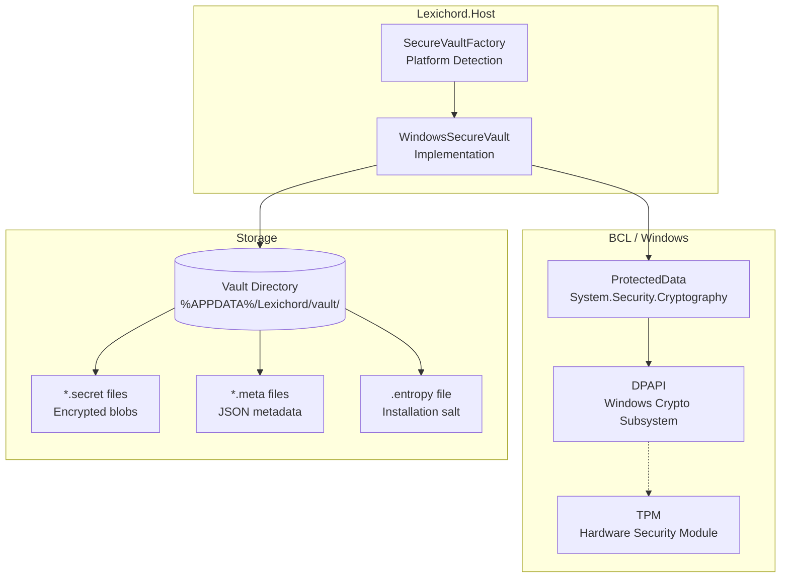
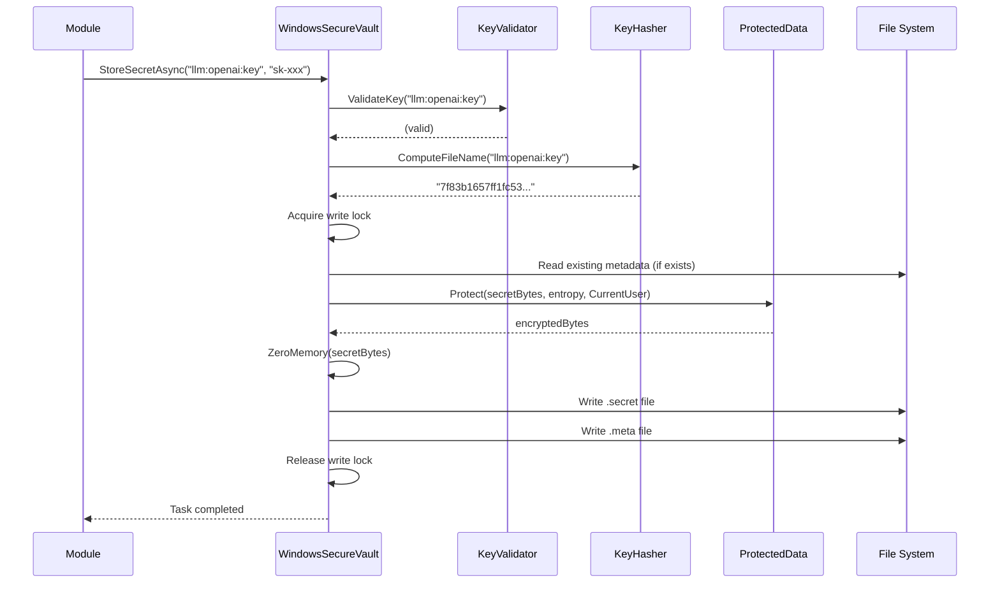
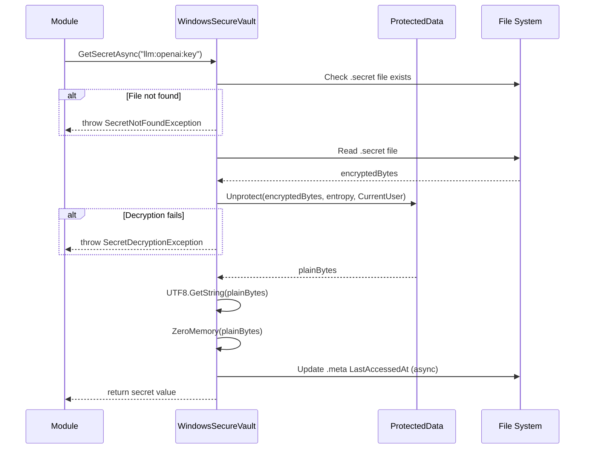

# LCS-01: Feature Design Composition

## 1. Metadata & Categorization

| Field                | Value                                   | Description                                      |
| :------------------- | :-------------------------------------- | :----------------------------------------------- |
| **Feature ID**       | `INF-006b`                              | Infrastructure - Windows Secure Vault            |
| **Feature Name**     | WindowsSecureVault (DPAPI)              | DPAPI-based secret encryption for Windows.       |
| **Target Version**   | `v0.0.6b`                               | Infrastructure Foundation Layer.                 |
| **Module Scope**     | `Lexichord.Host/Services/Security`      | Platform implementation.                         |
| **Swimlane**         | `Infrastructure`                        | The Vault (Security).                            |
| **License Tier**     | `Core`                                  | Foundation (Required for all tiers).             |
| **Feature Gate Key** | N/A                                     | No runtime gating for security infrastructure.   |
| **Author**           | System Architect                        |                                                  |
| **Status**           | **Draft**                               | Pending approval.                                |
| **Last Updated**     | 2026-01-26                              |                                                  |

---

## 2. Executive Summary

### 2.1 The Requirement

On Windows, we need a secure vault implementation that:

- Encrypts secrets using **Windows-native cryptographic APIs**.
- Ties encryption to the **current user account** (secrets unreadable by other users).
- Provides **hardware-backed protection** where available (TPM).
- Works on all Windows versions from **Windows 10** onward.

### 2.2 The Proposed Solution

We **SHALL** implement `WindowsSecureVault` using:

1. **System.Security.Cryptography.ProtectedData** (DPAPI wrapper).
2. **DataProtectionScope.CurrentUser** for user-specific encryption.
3. **Additional entropy** for per-installation uniqueness.
4. **File-based storage** in `%APPDATA%/Lexichord/vault/`.

### 2.3 DPAPI Overview

```text
+------------------------------------------------------------------------+
|                    WINDOWS DATA PROTECTION API (DPAPI)                  |
+------------------------------------------------------------------------+
| - OS-managed key derivation from user credentials                      |
| - Keys stored in user profile (encrypted with password)                |
| - TPM-backed protection when available                                 |
| - Automatic key rotation on password change                            |
| - No key management burden on application                              |
+------------------------------------------------------------------------+
| Scope Options:                                                          |
|   CurrentUser  -> Only the encrypting user can decrypt                 |
|   LocalMachine -> Any user on the machine can decrypt (NOT USED)       |
+------------------------------------------------------------------------+
```

---

## 3. Architecture & Modular Strategy

### 3.1 Implementation Architecture



### 3.2 File Structure After v0.0.6b

```text
src/Lexichord.Host/
+-- Services/
    +-- Security/
        +-- WindowsSecureVault.cs     # NEW: DPAPI implementation
        +-- SecureVaultFactory.cs     # NEW: Platform factory
        +-- VaultStorageHelper.cs     # NEW: Shared file operations
        +-- KeyHasher.cs              # NEW: Key to filename mapping
```

### 3.3 Storage Directory Structure

```text
%APPDATA%/Lexichord/vault/
+-- .entropy                    # 32-byte random entropy (per-install)
+-- 7f83b1657ff1fc53...secret  # Encrypted secret (hash of key name)
+-- 7f83b1657ff1fc53...meta    # JSON metadata
+-- a591a6d40bf42040...secret  # Another encrypted secret
+-- a591a6d40bf42040...meta    # Another metadata file
```

---

## 4. Decision Tree: DPAPI Availability

```text
START: "Can we use DPAPI on this Windows system?"
|
+-- Is OperatingSystem.IsWindows()?
|   |
|   +-- NO --> Use different vault implementation (Unix)
|   |
|   +-- YES --> Check Windows version
|       |
|       +-- Windows 10+ --> Full DPAPI support
|       |   |
|       |   +-- Is user interactive (has profile)?
|       |       |
|       |       +-- YES --> Use ProtectedData with CurrentUser scope
|       |       |
|       |       +-- NO --> Windows Service account
|       |           |
|       |           +-- Log warning: "Service accounts have limited DPAPI support"
|       |           +-- Use LocalMachine scope OR machine key fallback
|       |
|       +-- Windows 8.1 --> Supported (but consider upgrade warning)
|       |
|       +-- Windows 7 --> Not supported by .NET 9
```

---

## 5. Data Contracts

### 5.1 WindowsSecureVault Implementation

```csharp
using System;
using System.Collections.Generic;
using System.IO;
using System.Runtime.Versioning;
using System.Security.Cryptography;
using System.Text;
using System.Text.Json;
using System.Threading;
using System.Threading.Tasks;
using Lexichord.Abstractions.Contracts.Security;
using Microsoft.Extensions.Logging;

namespace Lexichord.Host.Services.Security;

/// <summary>
/// Windows implementation of <see cref="ISecureVault"/> using DPAPI.
/// </summary>
/// <remarks>
/// LOGIC: This implementation uses Windows Data Protection API (DPAPI) via
/// <see cref="ProtectedData"/>. DPAPI provides:
///
/// <list type="bullet">
///   <item>Encryption tied to the current Windows user account</item>
///   <item>OS-managed key derivation (no key management required)</item>
///   <item>Hardware-backed protection via TPM when available</item>
/// </list>
///
/// <para><b>Encryption Process:</b></para>
/// <code>
/// encryptedData = ProtectedData.Protect(
///     userData: secretBytes,
///     optionalEntropy: installationEntropy,
///     scope: DataProtectionScope.CurrentUser
/// );
/// </code>
///
/// <para><b>Storage:</b></para>
/// Encrypted secrets are stored as individual files in %APPDATA%/Lexichord/vault/
/// with filenames derived from SHA256 hash of the key name.
///
/// <para><b>Thread Safety:</b></para>
/// This implementation is thread-safe. File operations use locking to prevent
/// corruption from concurrent writes to the same key.
/// </remarks>
[SupportedOSPlatform("windows")]
public sealed class WindowsSecureVault : ISecureVault, IDisposable
{
    private readonly string _vaultPath;
    private readonly byte[] _entropy;
    private readonly ILogger<WindowsSecureVault>? _logger;
    private readonly SemaphoreSlim _writeLock = new(1, 1);
    private bool _disposed;

    private const int EntropyLength = 32;
    private const int SecretFileVersion = 1;

    /// <summary>
    /// Initializes a new instance of the WindowsSecureVault.
    /// </summary>
    /// <param name="vaultPath">Path to the vault storage directory.</param>
    /// <param name="logger">Optional logger for diagnostics.</param>
    /// <exception cref="VaultAccessDeniedException">
    /// Cannot create or access the vault directory.
    /// </exception>
    public WindowsSecureVault(string vaultPath, ILogger<WindowsSecureVault>? logger = null)
    {
        _vaultPath = vaultPath ?? throw new ArgumentNullException(nameof(vaultPath));
        _logger = logger;

        // LOGIC: Create vault directory with restrictive permissions
        EnsureVaultDirectoryExists();

        // LOGIC: Load or generate installation-specific entropy
        _entropy = LoadOrCreateEntropy();

        _logger?.LogDebug(
            "WindowsSecureVault initialized: Path={VaultPath}",
            _vaultPath);
    }

    /// <inheritdoc/>
    public async Task StoreSecretAsync(string key, string value, CancellationToken cancellationToken = default)
    {
        ThrowIfDisposed();
        KeyValidator.ValidateKey(key);
        ArgumentNullException.ThrowIfNull(value);

        var keyHash = KeyHasher.ComputeFileName(key);
        var secretPath = GetSecretPath(keyHash);
        var metaPath = GetMetadataPath(keyHash);

        await _writeLock.WaitAsync(cancellationToken);
        try
        {
            // LOGIC: Check if updating existing secret (preserve CreatedAt)
            var existingMeta = await ReadMetadataAsync(metaPath, cancellationToken);
            var now = DateTimeOffset.UtcNow;

            // LOGIC: Encrypt the secret value using DPAPI
            var plainBytes = Encoding.UTF8.GetBytes(value);
            var encryptedBytes = ProtectedData.Protect(
                plainBytes,
                _entropy,
                DataProtectionScope.CurrentUser);

            // LOGIC: Clear plaintext from memory
            CryptographicOperations.ZeroMemory(plainBytes);

            // LOGIC: Write encrypted file with version header
            await WriteSecretFileAsync(secretPath, encryptedBytes, cancellationToken);

            // LOGIC: Write metadata
            var metadata = new StoredSecretMetadata
            {
                KeyName = key,
                CreatedAt = existingMeta?.CreatedAt ?? now,
                LastModifiedAt = now,
                LastAccessedAt = existingMeta?.LastAccessedAt,
                Version = SecretFileVersion
            };
            await WriteMetadataAsync(metaPath, metadata, cancellationToken);

            _logger?.LogInformation(
                "Secret stored: KeyHash={KeyHash}",
                keyHash.Substring(0, 8));
        }
        catch (CryptographicException ex)
        {
            _logger?.LogError(ex, "DPAPI encryption failed: KeyHash={KeyHash}", keyHash.Substring(0, 8));
            throw new SecureVaultException("Failed to encrypt secret using DPAPI.", ex);
        }
        catch (UnauthorizedAccessException ex)
        {
            throw new VaultAccessDeniedException($"Access denied to vault path: {_vaultPath}", ex);
        }
        finally
        {
            _writeLock.Release();
        }
    }

    /// <inheritdoc/>
    public async Task<string> GetSecretAsync(string key, CancellationToken cancellationToken = default)
    {
        ThrowIfDisposed();
        KeyValidator.ValidateKey(key);

        var keyHash = KeyHasher.ComputeFileName(key);
        var secretPath = GetSecretPath(keyHash);
        var metaPath = GetMetadataPath(keyHash);

        if (!File.Exists(secretPath))
        {
            _logger?.LogWarning("Secret not found: KeyHash={KeyHash}", keyHash.Substring(0, 8));
            throw new SecretNotFoundException(key);
        }

        try
        {
            // LOGIC: Read encrypted file
            var encryptedBytes = await ReadSecretFileAsync(secretPath, cancellationToken);

            // LOGIC: Decrypt using DPAPI
            var plainBytes = ProtectedData.Unprotect(
                encryptedBytes,
                _entropy,
                DataProtectionScope.CurrentUser);

            var value = Encoding.UTF8.GetString(plainBytes);

            // LOGIC: Clear decrypted bytes from memory
            CryptographicOperations.ZeroMemory(plainBytes);

            // LOGIC: Update LastAccessedAt (fire and forget, don't fail on error)
            _ = UpdateLastAccessedAsync(metaPath, cancellationToken);

            _logger?.LogInformation(
                "Secret retrieved: KeyHash={KeyHash}",
                keyHash.Substring(0, 8));

            return value;
        }
        catch (CryptographicException ex)
        {
            _logger?.LogError(ex, "DPAPI decryption failed: KeyHash={KeyHash}", keyHash.Substring(0, 8));
            throw new SecretDecryptionException(key, ex);
        }
        catch (UnauthorizedAccessException ex)
        {
            throw new VaultAccessDeniedException($"Access denied to vault path: {_vaultPath}", ex);
        }
    }

    /// <inheritdoc/>
    public async Task<bool> DeleteSecretAsync(string key, CancellationToken cancellationToken = default)
    {
        ThrowIfDisposed();
        KeyValidator.ValidateKey(key);

        var keyHash = KeyHasher.ComputeFileName(key);
        var secretPath = GetSecretPath(keyHash);
        var metaPath = GetMetadataPath(keyHash);

        await _writeLock.WaitAsync(cancellationToken);
        try
        {
            if (!File.Exists(secretPath))
            {
                return false;
            }

            // LOGIC: Securely delete by overwriting with zeros first
            await SecureDeleteFileAsync(secretPath, cancellationToken);

            // LOGIC: Delete metadata file
            if (File.Exists(metaPath))
            {
                File.Delete(metaPath);
            }

            _logger?.LogInformation(
                "Secret deleted: KeyHash={KeyHash}",
                keyHash.Substring(0, 8));

            return true;
        }
        catch (UnauthorizedAccessException ex)
        {
            throw new VaultAccessDeniedException($"Access denied to delete secret: {key}", ex);
        }
        finally
        {
            _writeLock.Release();
        }
    }

    /// <inheritdoc/>
    public Task<bool> SecretExistsAsync(string key, CancellationToken cancellationToken = default)
    {
        ThrowIfDisposed();
        KeyValidator.ValidateKey(key);

        var keyHash = KeyHasher.ComputeFileName(key);
        var secretPath = GetSecretPath(keyHash);

        return Task.FromResult(File.Exists(secretPath));
    }

    /// <inheritdoc/>
    public async Task<SecretMetadata?> GetSecretMetadataAsync(string key, CancellationToken cancellationToken = default)
    {
        ThrowIfDisposed();
        KeyValidator.ValidateKey(key);

        var keyHash = KeyHasher.ComputeFileName(key);
        var metaPath = GetMetadataPath(keyHash);

        var stored = await ReadMetadataAsync(metaPath, cancellationToken);
        if (stored is null)
        {
            return null;
        }

        return new SecretMetadata(
            stored.KeyName,
            stored.CreatedAt,
            stored.LastAccessedAt,
            stored.LastModifiedAt);
    }

    /// <inheritdoc/>
    public async IAsyncEnumerable<string> ListSecretsAsync(
        string? prefix = null,
        [System.Runtime.CompilerServices.EnumeratorCancellation] CancellationToken cancellationToken = default)
    {
        ThrowIfDisposed();

        if (!Directory.Exists(_vaultPath))
        {
            yield break;
        }

        var metaFiles = Directory.GetFiles(_vaultPath, "*.meta");

        foreach (var metaPath in metaFiles)
        {
            cancellationToken.ThrowIfCancellationRequested();

            var stored = await ReadMetadataAsync(metaPath, cancellationToken);
            if (stored is null)
            {
                continue;
            }

            // LOGIC: Apply prefix filter if specified
            if (prefix is null || stored.KeyName.StartsWith(prefix, StringComparison.Ordinal))
            {
                yield return stored.KeyName;
            }
        }
    }

    /// <summary>
    /// Disposes resources used by the vault.
    /// </summary>
    public void Dispose()
    {
        if (_disposed) return;
        _disposed = true;

        // LOGIC: Clear entropy from memory
        CryptographicOperations.ZeroMemory(_entropy);

        _writeLock.Dispose();
    }

    #region Private Methods

    private void ThrowIfDisposed()
    {
        if (_disposed)
        {
            throw new ObjectDisposedException(nameof(WindowsSecureVault));
        }
    }

    private void EnsureVaultDirectoryExists()
    {
        try
        {
            if (!Directory.Exists(_vaultPath))
            {
                var dirInfo = Directory.CreateDirectory(_vaultPath);

                // LOGIC: On Windows, set restrictive ACL (owner-only access)
                // This requires additional P/Invoke or Windows-specific APIs
                // For now, rely on default user folder permissions
            }
        }
        catch (UnauthorizedAccessException ex)
        {
            throw new VaultAccessDeniedException($"Cannot create vault directory: {_vaultPath}", ex);
        }
    }

    private byte[] LoadOrCreateEntropy()
    {
        var entropyPath = Path.Combine(_vaultPath, ".entropy");

        if (File.Exists(entropyPath))
        {
            var existingEntropy = File.ReadAllBytes(entropyPath);
            if (existingEntropy.Length == EntropyLength)
            {
                return existingEntropy;
            }
            // LOGIC: Invalid entropy file, regenerate
            _logger?.LogWarning("Invalid entropy file found, regenerating");
        }

        // LOGIC: Generate new entropy using CSPRNG
        var entropy = RandomNumberGenerator.GetBytes(EntropyLength);
        File.WriteAllBytes(entropyPath, entropy);

        // LOGIC: Make entropy file hidden
        File.SetAttributes(entropyPath, FileAttributes.Hidden);

        _logger?.LogInformation("Generated new vault entropy");

        return entropy;
    }

    private string GetSecretPath(string keyHash)
        => Path.Combine(_vaultPath, $"{keyHash}.secret");

    private string GetMetadataPath(string keyHash)
        => Path.Combine(_vaultPath, $"{keyHash}.meta");

    private static async Task WriteSecretFileAsync(
        string path,
        byte[] encryptedData,
        CancellationToken cancellationToken)
    {
        using var stream = new FileStream(
            path,
            FileMode.Create,
            FileAccess.Write,
            FileShare.None,
            bufferSize: 4096,
            useAsync: true);

        // LOGIC: Write version header
        var version = BitConverter.GetBytes(SecretFileVersion);
        await stream.WriteAsync(version, cancellationToken);

        // LOGIC: Write encrypted data length
        var length = BitConverter.GetBytes(encryptedData.Length);
        await stream.WriteAsync(length, cancellationToken);

        // LOGIC: Write encrypted data
        await stream.WriteAsync(encryptedData, cancellationToken);
    }

    private static async Task<byte[]> ReadSecretFileAsync(
        string path,
        CancellationToken cancellationToken)
    {
        using var stream = new FileStream(
            path,
            FileMode.Open,
            FileAccess.Read,
            FileShare.Read,
            bufferSize: 4096,
            useAsync: true);

        // LOGIC: Read and validate version
        var versionBytes = new byte[4];
        await stream.ReadExactlyAsync(versionBytes, cancellationToken);
        var version = BitConverter.ToInt32(versionBytes);

        if (version != SecretFileVersion)
        {
            throw new SecureVaultException($"Unsupported secret file version: {version}");
        }

        // LOGIC: Read data length
        var lengthBytes = new byte[4];
        await stream.ReadExactlyAsync(lengthBytes, cancellationToken);
        var length = BitConverter.ToInt32(lengthBytes);

        // LOGIC: Read encrypted data
        var encryptedData = new byte[length];
        await stream.ReadExactlyAsync(encryptedData, cancellationToken);

        return encryptedData;
    }

    private async Task WriteMetadataAsync(
        string path,
        StoredSecretMetadata metadata,
        CancellationToken cancellationToken)
    {
        var json = JsonSerializer.Serialize(metadata, JsonOptions);
        await File.WriteAllTextAsync(path, json, cancellationToken);
    }

    private async Task<StoredSecretMetadata?> ReadMetadataAsync(
        string path,
        CancellationToken cancellationToken)
    {
        if (!File.Exists(path))
        {
            return null;
        }

        try
        {
            var json = await File.ReadAllTextAsync(path, cancellationToken);
            return JsonSerializer.Deserialize<StoredSecretMetadata>(json, JsonOptions);
        }
        catch (JsonException)
        {
            _logger?.LogWarning("Corrupted metadata file: {Path}", path);
            return null;
        }
    }

    private async Task UpdateLastAccessedAsync(string metaPath, CancellationToken cancellationToken)
    {
        try
        {
            var metadata = await ReadMetadataAsync(metaPath, cancellationToken);
            if (metadata is not null)
            {
                metadata.LastAccessedAt = DateTimeOffset.UtcNow;
                await WriteMetadataAsync(metaPath, metadata, cancellationToken);
            }
        }
        catch (Exception ex)
        {
            // LOGIC: Non-critical operation, log but don't throw
            _logger?.LogDebug(ex, "Failed to update LastAccessedAt");
        }
    }

    private static async Task SecureDeleteFileAsync(string path, CancellationToken cancellationToken)
    {
        // LOGIC: Overwrite file with zeros before deletion
        var fileInfo = new FileInfo(path);
        var length = fileInfo.Length;

        using (var stream = new FileStream(path, FileMode.Open, FileAccess.Write))
        {
            var zeros = new byte[Math.Min(length, 8192)];
            var remaining = length;
            while (remaining > 0)
            {
                var toWrite = (int)Math.Min(remaining, zeros.Length);
                await stream.WriteAsync(zeros.AsMemory(0, toWrite), cancellationToken);
                remaining -= toWrite;
            }
            await stream.FlushAsync(cancellationToken);
        }

        File.Delete(path);
    }

    private static readonly JsonSerializerOptions JsonOptions = new()
    {
        WriteIndented = true,
        PropertyNamingPolicy = JsonNamingPolicy.CamelCase
    };

    #endregion

    #region Internal Types

    /// <summary>
    /// Internal representation of stored metadata.
    /// </summary>
    private sealed class StoredSecretMetadata
    {
        public string KeyName { get; set; } = string.Empty;
        public DateTimeOffset CreatedAt { get; set; }
        public DateTimeOffset? LastAccessedAt { get; set; }
        public DateTimeOffset LastModifiedAt { get; set; }
        public int Version { get; set; }
    }

    #endregion
}
```

### 5.2 KeyValidator Helper

```csharp
using System;

namespace Lexichord.Host.Services.Security;

/// <summary>
/// Validates secret key names according to vault naming rules.
/// </summary>
internal static class KeyValidator
{
    public const int MaxKeyLength = 256;

    /// <summary>
    /// Validates that a key conforms to vault naming rules.
    /// </summary>
    /// <param name="key">The key to validate.</param>
    /// <exception cref="ArgumentNullException">Key is null.</exception>
    /// <exception cref="ArgumentException">Key is invalid.</exception>
    /// <remarks>
    /// LOGIC: Valid keys must be:
    /// - Non-null and non-empty
    /// - Max 256 characters
    /// - Printable ASCII only (0x20-0x7E)
    /// - Colon (:) allowed for namespacing
    /// </remarks>
    public static void ValidateKey(string key)
    {
        ArgumentNullException.ThrowIfNull(key);

        if (string.IsNullOrWhiteSpace(key))
        {
            throw new ArgumentException("Key cannot be empty or whitespace.", nameof(key));
        }

        if (key.Length > MaxKeyLength)
        {
            throw new ArgumentException(
                $"Key exceeds maximum length of {MaxKeyLength} characters.",
                nameof(key));
        }

        for (var i = 0; i < key.Length; i++)
        {
            var c = key[i];
            if (c < 0x20 || c > 0x7E)
            {
                throw new ArgumentException(
                    $"Key contains invalid character (0x{(int)c:X2}) at position {i}. Only printable ASCII (0x20-0x7E) is allowed.",
                    nameof(key));
            }
        }
    }
}
```

### 5.3 KeyHasher Helper

```csharp
using System;
using System.Security.Cryptography;
using System.Text;

namespace Lexichord.Host.Services.Security;

/// <summary>
/// Computes storage file names from secret keys.
/// </summary>
internal static class KeyHasher
{
    /// <summary>
    /// Computes a safe filename from a secret key.
    /// </summary>
    /// <param name="key">The secret key.</param>
    /// <returns>A 32-character hex string suitable for use as a filename.</returns>
    /// <remarks>
    /// LOGIC: Using SHA256 hash avoids issues with:
    /// - Special characters in keys
    /// - Case sensitivity differences between filesystems
    /// - Path length limits on Windows
    ///
    /// We use first 16 bytes (32 hex chars) for reasonable uniqueness
    /// while keeping filenames manageable.
    /// </remarks>
    public static string ComputeFileName(string key)
    {
        var keyBytes = Encoding.UTF8.GetBytes(key);
        var hashBytes = SHA256.HashData(keyBytes);

        // Use first 16 bytes (128 bits) - collision probability is negligible
        return Convert.ToHexString(hashBytes.AsSpan(0, 16)).ToLowerInvariant();
    }

    /// <summary>
    /// Computes a short hash for logging purposes.
    /// </summary>
    /// <param name="key">The secret key.</param>
    /// <returns>First 8 characters of the hash.</returns>
    public static string ComputeLogHash(string key)
    {
        return ComputeFileName(key).Substring(0, 8);
    }
}
```

---

## 6. Decision Tree: Encryption Flow

```text
START: "StoreSecretAsync called"
|
+-- Validate key (KeyValidator)
|   +-- Null/empty -> throw ArgumentException
|   +-- Invalid chars -> throw ArgumentException
|   +-- Too long -> throw ArgumentException
|
+-- Compute file hash (KeyHasher)
|   +-- SHA256(key) -> hex filename
|
+-- Acquire write lock
|   +-- Prevent concurrent writes to same key
|
+-- Check existing metadata
|   +-- Exists -> preserve CreatedAt
|   +-- Not exists -> use current time
|
+-- Encrypt with DPAPI
|   +-- Convert value to UTF-8 bytes
|   +-- ProtectedData.Protect(bytes, entropy, CurrentUser)
|   +-- Clear plaintext bytes from memory
|
+-- Write secret file
|   +-- [4 bytes: version]
|   +-- [4 bytes: length]
|   +-- [N bytes: encrypted data]
|
+-- Write metadata file
|   +-- JSON: keyName, createdAt, lastModifiedAt
|
+-- Release write lock
|
+-- Log success (KeyHash only)
```

---

## 7. Implementation Workflow

### 7.1 Sequence: Store Secret



### 7.2 Sequence: Get Secret



---

## 8. Use Cases & User Stories

### 8.1 User Stories

| ID    | Role      | Story                                                                      | Acceptance Criteria                              |
| :---- | :-------- | :------------------------------------------------------------------------- | :----------------------------------------------- |
| US-01 | User      | As a Windows user, my API keys are encrypted using Windows security.       | DPAPI with CurrentUser scope is used.            |
| US-02 | User      | As a Windows user, other accounts on my PC cannot read my secrets.         | Secrets unreadable by other Windows users.       |
| US-03 | User      | As a Windows user, secrets survive Windows password changes.               | DPAPI handles credential rotation automatically. |
| US-04 | Developer | As a developer, I can store and retrieve secrets with exact fidelity.      | Round-trip returns identical value.              |
| US-05 | Developer | As a developer, I get meaningful exceptions on vault errors.               | Specific exception types for different failures. |

### 8.2 Use Cases

#### UC-01: First-Time Secret Storage

**Preconditions:**
- Lexichord running on Windows 10+.
- Vault directory does not exist.

**Flow:**
1. Module calls `StoreSecretAsync("llm:openai:api-key", "sk-123...")`.
2. Vault creates `%APPDATA%/Lexichord/vault/` directory.
3. Vault generates `.entropy` file (32 bytes random).
4. Vault encrypts secret using DPAPI + entropy.
5. Vault writes `.secret` and `.meta` files.
6. Method returns successfully.

**Postconditions:**
- Secret encrypted on disk.
- Entropy file created and hidden.

---

#### UC-02: Retrieve Secret After Reboot

**Preconditions:**
- Secret was stored in previous session.
- System has been rebooted.

**Flow:**
1. Module calls `GetSecretAsync("llm:openai:api-key")`.
2. Vault loads entropy from `.entropy` file.
3. Vault reads encrypted data from `.secret` file.
4. Vault decrypts using DPAPI + entropy.
5. Vault returns plaintext secret.

**Postconditions:**
- Original secret value returned.
- LastAccessedAt updated.

---

## 9. Observability & Logging

### 9.1 Log Events

| Level | Context            | Message Template                                                        |
| :---- | :----------------- | :---------------------------------------------------------------------- |
| Debug | WindowsSecureVault | `WindowsSecureVault initialized: Path={VaultPath}`                      |
| Info  | WindowsSecureVault | `Secret stored: KeyHash={KeyHash}`                                      |
| Info  | WindowsSecureVault | `Secret retrieved: KeyHash={KeyHash}`                                   |
| Info  | WindowsSecureVault | `Secret deleted: KeyHash={KeyHash}`                                     |
| Info  | WindowsSecureVault | `Generated new vault entropy`                                           |
| Warn  | WindowsSecureVault | `Secret not found: KeyHash={KeyHash}`                                   |
| Warn  | WindowsSecureVault | `Invalid entropy file found, regenerating`                              |
| Warn  | WindowsSecureVault | `Corrupted metadata file: {Path}`                                       |
| Error | WindowsSecureVault | `DPAPI encryption failed: KeyHash={KeyHash}`                            |
| Error | WindowsSecureVault | `DPAPI decryption failed: KeyHash={KeyHash}`                            |

> [!IMPORTANT]
> KeyHash is first 8 characters only. NEVER log full keys or secret values.

---

## 10. Unit Testing Requirements

### 10.1 Test Scenarios

```csharp
[Trait("Category", "Unit")]
[SupportedOSPlatform("windows")]
public class WindowsSecureVaultTests : IDisposable
{
    private readonly string _testVaultPath;
    private readonly WindowsSecureVault _vault;

    public WindowsSecureVaultTests()
    {
        _testVaultPath = Path.Combine(Path.GetTempPath(), $"vault-test-{Guid.NewGuid()}");
        _vault = new WindowsSecureVault(_testVaultPath);
    }

    public void Dispose()
    {
        _vault.Dispose();
        if (Directory.Exists(_testVaultPath))
        {
            Directory.Delete(_testVaultPath, recursive: true);
        }
    }

    [Fact]
    public async Task StoreAndRetrieve_RoundTripsCorrectly()
    {
        // Arrange
        const string key = "test:api-key";
        const string value = "sk-1234567890abcdef";

        // Act
        await _vault.StoreSecretAsync(key, value);
        var retrieved = await _vault.GetSecretAsync(key);

        // Assert
        retrieved.Should().Be(value);
    }

    [Fact]
    public async Task StoreSecret_CreatesEncryptedFile()
    {
        // Arrange
        const string key = "test:key";
        const string value = "secret-value";

        // Act
        await _vault.StoreSecretAsync(key, value);

        // Assert
        var hash = KeyHasher.ComputeFileName(key);
        var secretPath = Path.Combine(_testVaultPath, $"{hash}.secret");
        File.Exists(secretPath).Should().BeTrue();

        // Verify file is not plaintext
        var fileContent = await File.ReadAllBytesAsync(secretPath);
        var plainBytes = Encoding.UTF8.GetBytes(value);
        fileContent.Should().NotContain(plainBytes);
    }

    [Fact]
    public async Task GetSecret_WhenNotExists_ThrowsSecretNotFoundException()
    {
        // Act
        Func<Task> act = () => _vault.GetSecretAsync("nonexistent:key");

        // Assert
        await act.Should().ThrowAsync<SecretNotFoundException>()
            .Where(ex => ex.KeyName == "nonexistent:key");
    }

    [Fact]
    public async Task DeleteSecret_WhenExists_RemovesFiles()
    {
        // Arrange
        const string key = "test:to-delete";
        await _vault.StoreSecretAsync(key, "value");
        var hash = KeyHasher.ComputeFileName(key);
        var secretPath = Path.Combine(_testVaultPath, $"{hash}.secret");
        var metaPath = Path.Combine(_testVaultPath, $"{hash}.meta");

        // Act
        var result = await _vault.DeleteSecretAsync(key);

        // Assert
        result.Should().BeTrue();
        File.Exists(secretPath).Should().BeFalse();
        File.Exists(metaPath).Should().BeFalse();
    }

    [Fact]
    public async Task SecretExists_WhenStored_ReturnsTrue()
    {
        // Arrange
        await _vault.StoreSecretAsync("test:exists", "value");

        // Act
        var exists = await _vault.SecretExistsAsync("test:exists");

        // Assert
        exists.Should().BeTrue();
    }

    [Fact]
    public async Task GetMetadata_ReturnsCorrectTimestamps()
    {
        // Arrange
        var beforeStore = DateTimeOffset.UtcNow;
        await _vault.StoreSecretAsync("test:meta", "value");

        // Act
        var meta = await _vault.GetSecretMetadataAsync("test:meta");

        // Assert
        meta.Should().NotBeNull();
        meta!.KeyName.Should().Be("test:meta");
        meta.CreatedAt.Should().BeOnOrAfter(beforeStore);
        meta.LastModifiedAt.Should().BeOnOrAfter(beforeStore);
    }

    [Fact]
    public async Task ListSecrets_WithPrefix_FiltersCorrectly()
    {
        // Arrange
        await _vault.StoreSecretAsync("llm:openai:key", "value1");
        await _vault.StoreSecretAsync("llm:anthropic:key", "value2");
        await _vault.StoreSecretAsync("storage:s3:key", "value3");

        // Act
        var llmKeys = await _vault.ListSecretsAsync("llm:").ToListAsync();

        // Assert
        llmKeys.Should().HaveCount(2);
        llmKeys.Should().Contain("llm:openai:key");
        llmKeys.Should().Contain("llm:anthropic:key");
        llmKeys.Should().NotContain("storage:s3:key");
    }

    [Fact]
    public void ValidateKey_WithInvalidChars_ThrowsArgumentException()
    {
        // Act
        Action act = () => KeyValidator.ValidateKey("test\x00key");

        // Assert
        act.Should().Throw<ArgumentException>();
    }

    [Fact]
    public async Task StoreSecret_OverwritesExisting_PreservesCreatedAt()
    {
        // Arrange
        await _vault.StoreSecretAsync("test:overwrite", "original");
        var originalMeta = await _vault.GetSecretMetadataAsync("test:overwrite");
        await Task.Delay(100); // Ensure time difference

        // Act
        await _vault.StoreSecretAsync("test:overwrite", "updated");
        var updatedMeta = await _vault.GetSecretMetadataAsync("test:overwrite");

        // Assert
        updatedMeta!.CreatedAt.Should().Be(originalMeta!.CreatedAt);
        updatedMeta.LastModifiedAt.Should().BeAfter(originalMeta.CreatedAt);
    }
}
```

---

## 11. Security & Safety

### 11.1 DPAPI Security Properties

| Property               | Description                                              |
| :--------------------- | :------------------------------------------------------- |
| User-Scoped            | Only the encrypting user account can decrypt             |
| Credential-Bound       | Keys derived from user's Windows credentials             |
| TPM-Backed             | Hardware protection when TPM available                   |
| Roaming-Safe           | Works with roaming profiles (DPAPI handles sync)         |

### 11.2 Additional Protections

```csharp
// LOGIC: Additional entropy prevents cross-application decryption
// Even if another app uses DPAPI with same user, it cannot decrypt
// Lexichord secrets without the entropy file.

var encryptedBytes = ProtectedData.Protect(
    userData: plainBytes,
    optionalEntropy: _entropy,  // Installation-specific
    scope: DataProtectionScope.CurrentUser
);
```

### 11.3 Memory Safety

```csharp
// LOGIC: Clear sensitive data from memory after use
try
{
    var plainBytes = Encoding.UTF8.GetBytes(value);
    var encrypted = ProtectedData.Protect(plainBytes, _entropy, DataProtectionScope.CurrentUser);
    // ... use encrypted data
}
finally
{
    // Clear plaintext immediately
    CryptographicOperations.ZeroMemory(plainBytes);
}
```

---

## 12. Risks & Mitigations

| Risk                                   | Impact | Mitigation                                                   |
| :------------------------------------- | :----- | :----------------------------------------------------------- |
| DPAPI unavailable (service account)    | Medium | Detect and provide fallback or clear error message.          |
| Entropy file deleted                   | High   | Existing secrets become unreadable; document recovery steps. |
| User profile corruption                | High   | DPAPI may fail; handle gracefully with meaningful error.     |
| File locked by antivirus               | Low    | Retry with exponential backoff; log warning.                 |
| Concurrent access from multiple instances | Medium | File locking via SemaphoreSlim; atomic file operations.   |

---

## 13. Acceptance Criteria (QA)

| #   | Category        | Criterion                                                              |
| :-- | :-------------- | :--------------------------------------------------------------------- |
| 1   | **[Platform]**  | Implementation only loads on Windows (SupportedOSPlatform).            |
| 2   | **[Encrypt]**   | Stored files are not readable as plaintext.                            |
| 3   | **[Decrypt]**   | Round-trip Store->Get returns identical value.                         |
| 4   | **[Entropy]**   | .entropy file is created on first use.                                 |
| 5   | **[Persist]**   | Secrets survive application restart.                                   |
| 6   | **[UserScope]** | Another Windows user cannot decrypt secrets.                           |
| 7   | **[Delete]**    | DeleteSecretAsync removes both .secret and .meta files.                |
| 8   | **[Metadata]**  | GetSecretMetadataAsync returns correct timestamps.                     |
| 9   | **[List]**      | ListSecretsAsync returns all keys, respects prefix filter.             |
| 10  | **[Logging]**   | Operations log with KeyHash (not full key or value).                   |

---

## 14. Verification Commands

```powershell
# ===========================================================================
# v0.0.6b Verification (Windows)
# ===========================================================================

# 1. Verify implementation exists
Get-ChildItem src\Lexichord.Host\Services\Security\*.cs

# 2. Build for Windows
dotnet build --configuration Release

# 3. Run unit tests
dotnet test --filter "Category=Unit&FullyQualifiedName~WindowsSecureVault"

# 4. Manual verification:
# a) Run app and store a test secret
# b) Check vault directory exists:
$vaultPath = "$env:APPDATA\Lexichord\vault"
Get-ChildItem $vaultPath

# c) Verify .entropy file exists and is hidden
Get-Item "$vaultPath\.entropy" -Force

# d) Verify .secret files are encrypted (not plaintext):
$secretFile = Get-ChildItem "$vaultPath\*.secret" | Select-Object -First 1
[System.Text.Encoding]::UTF8.GetString([System.IO.File]::ReadAllBytes($secretFile.FullName))
# Expected: Binary garbage, not readable

# e) Restart app and retrieve secret - should match original
```

---

## 15. Deliverable Checklist

| Step | Description                                                        | Status |
| :--- | :----------------------------------------------------------------- | :----- |
| 1    | `WindowsSecureVault.cs` implementation using DPAPI.                | [ ]    |
| 2    | `KeyValidator.cs` helper for key validation.                       | [ ]    |
| 3    | `KeyHasher.cs` helper for filename computation.                    | [ ]    |
| 4    | `[SupportedOSPlatform("windows")]` attribute applied.              | [ ]    |
| 5    | Entropy file generation and storage.                               | [ ]    |
| 6    | Secret file format with version header.                            | [ ]    |
| 7    | Metadata file JSON serialization.                                  | [ ]    |
| 8    | Secure deletion (zero-fill before delete).                         | [ ]    |
| 9    | Thread safety via SemaphoreSlim.                                   | [ ]    |
| 10   | Memory clearing with CryptographicOperations.ZeroMemory.           | [ ]    |
| 11   | Structured logging (no secret values).                             | [ ]    |
| 12   | Unit tests for all CRUD operations.                                | [ ]    |
| 13   | Unit tests for edge cases (not found, invalid key, etc.).          | [ ]    |
