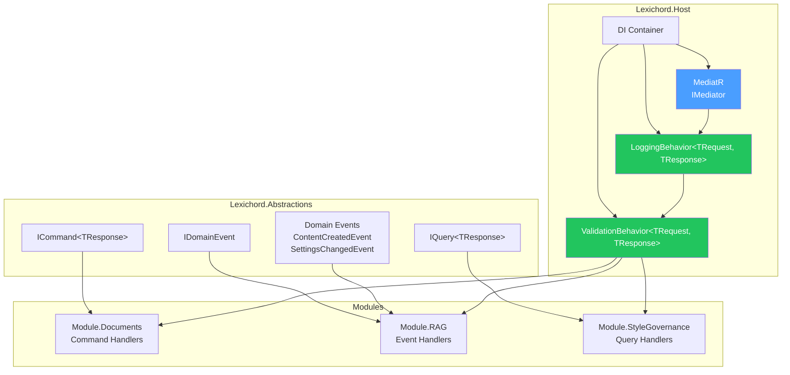
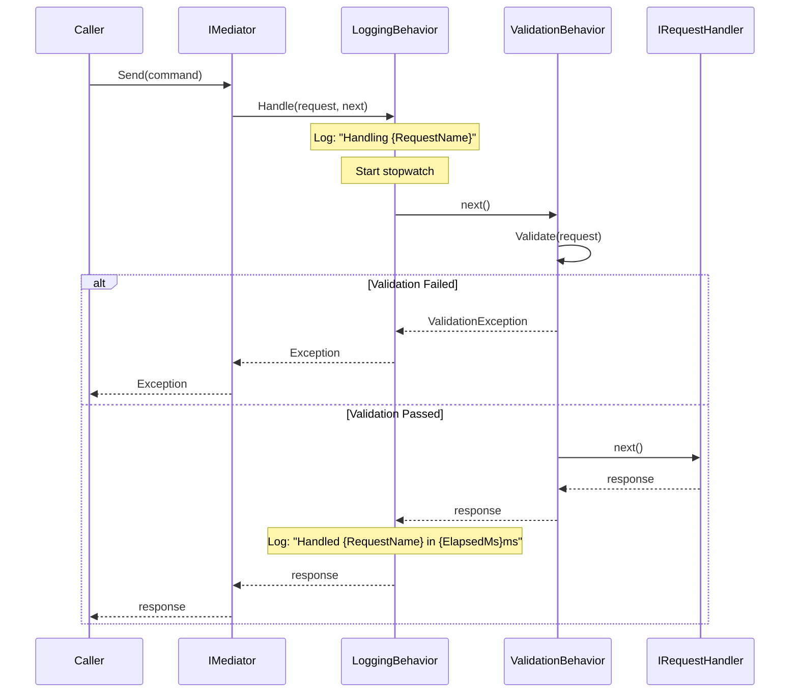

# LCS-DES-007: Design Specification Index — The Event Bus (Communication)

## Document Control

| Field                | Value                                       |
| :------------------- | :------------------------------------------ |
| **Document ID**      | LCS-DES-007-INDEX                           |
| **Feature ID**       | INF-007                                     |
| **Feature Name**     | The Event Bus (MediatR Communication)       |
| **Target Version**   | v0.0.7                                      |
| **Module Scope**     | Lexichord.Abstractions / Lexichord.Host     |
| **Swimlane**         | Infrastructure                              |
| **License Tier**     | Core                                        |
| **Feature Gate Key** | N/A                                         |
| **Status**           | Draft                                       |
| **Last Updated**     | 2026-01-27                                  |

---

## 1. Executive Summary

**v0.0.7** establishes the **in-process messaging infrastructure** that enables loose coupling between modules. This release implements a MediatR-based command/query/event bus with cross-cutting pipeline behaviors for logging and validation.

### 1.1 The Problem

Lexichord's modular architecture requires a mechanism for loose coupling between modules:

- **Module A** must communicate with **Module B** without a direct project reference
- Commands and queries must flow through a central mediator
- Domain events must support publish/subscribe patterns
- Cross-cutting concerns (logging, validation) must apply transparently

Without this infrastructure:

- Modules would need circular references
- Cross-cutting concerns would be duplicated in every handler
- Testing would require complex mocking of direct dependencies

### 1.2 The Solution

Implement a complete MediatR-based communication layer with:

- **MediatR Bootstrap** — Install packages, configure DI, define marker interfaces
- **Shared Domain Events** — Define reusable events in Abstractions
- **Logging Pipeline Behavior** — Auto-log every command/query with timing
- **Validation Pipeline Behavior** — FluentValidation integration

### 1.3 Business Value

| Value                   | Description                                           |
| :---------------------- | :---------------------------------------------------- |
| **Loose Coupling**      | Modules communicate without direct references         |
| **Testability**         | Handlers can be tested in isolation                   |
| **Cross-Cutting**       | Logging and validation applied transparently          |
| **Extensibility**       | New behaviors can be added to the pipeline            |
| **Foundation**          | Enables module communication for all future features  |

---

## 2. Related Documents

### 2.1 Scope Breakdown Document

The detailed scope breakdown for v0.0.7, including all sub-parts, implementation checklists, and acceptance criteria:

| Document                            | Description                                  |
| :---------------------------------- | :------------------------------------------- |
| **[LCS-SBD-007](./LCS-SBD-007.md)** | Scope Breakdown — The Event Bus              |

### 2.2 Sub-Part Design Specifications

Each sub-part has its own detailed design specification following the LDS-01 template:

| Sub-Part | Document                              | Title                        | Description                              |
| :------- | :------------------------------------ | :--------------------------- | :--------------------------------------- |
| v0.0.7a  | **[LCS-DES-007a](./LCS-DES-007a.md)** | MediatR Bootstrap            | Package installation and DI configuration|
| v0.0.7b  | **[LCS-DES-007b](./LCS-DES-007b.md)** | Shared Domain Events         | ContentCreatedEvent, SettingsChangedEvent|
| v0.0.7c  | **[LCS-DES-007c](./LCS-DES-007c.md)** | Logging Pipeline Behavior    | Auto-log with timing and correlation     |
| v0.0.7d  | **[LCS-DES-007d](./LCS-DES-007d.md)** | Validation Pipeline Behavior | FluentValidation integration             |

---

## 3. Architecture Overview

### 3.1 Component Diagram

### 3.2 Pipeline Behavior Sequence

---

## 4. Dependencies

### 4.1 Upstream Dependencies

| Dependency           | Source Version | Purpose                           |
| :------------------- | :------------- | :-------------------------------- |
| DI Container         | v0.0.3a        | MediatR service registration      |
| Serilog Pipeline     | v0.0.3b        | Pipeline behavior logging         |
| Module System        | v0.0.4         | Handler discovery from modules    |

### 4.2 NuGet Packages

| Package                          | Version | Purpose                                 |
| :------------------------------- | :------ | :-------------------------------------- |
| `MediatR`                        | 12.x    | Mediator pattern implementation         |
| `MediatR.Extensions.Microsoft.DependencyInjection` | 12.x | DI integration       |
| `FluentValidation`               | 11.x    | Request validation framework            |
| `FluentValidation.DependencyInjectionExtensions` | 11.x | DI integration        |

### 4.3 Downstream Consumers (Future)

| Version | Feature             | Uses From v0.0.7                          |
| :------ | :------------------ | :---------------------------------------- |
| v0.0.8  | Settings Commands   | ICommand for settings operations          |
| v0.2.x  | Document Module     | Commands, queries, and events             |
| v0.3.x  | Style Module        | Style analysis commands and events        |
| v0.4.x  | RAG Module          | Embedding commands, search queries        |

---

## 5. License Gating Strategy

**N/A** — Event bus infrastructure is Core foundation required by all license tiers. No runtime gating is applied to MediatR or pipeline behaviors.

---

## 6. Key Interfaces Summary

| Interface                    | Defined In | Purpose                               |
| :--------------------------- | :--------- | :------------------------------------ |
| `ICommand<TResponse>`        | v0.0.7a    | Marker for command requests           |
| `IQuery<TResponse>`          | v0.0.7a    | Marker for query requests             |
| `IDomainEvent`               | v0.0.7a    | Marker for domain events              |
| `IPipelineBehavior<TReq,TRes>`| MediatR   | Pipeline behavior contract            |

| Record/DTO               | Defined In | Purpose                               |
| :----------------------- | :--------- | :------------------------------------ |
| `ContentCreatedEvent`    | v0.0.7b    | Raised when content is created        |
| `SettingsChangedEvent`   | v0.0.7b    | Raised when settings are modified     |

---

## 7. Implementation Checklist Summary

| Sub-Part  | Key Deliverables                                             | Est. Hours   | Status |
| :-------- | :----------------------------------------------------------- | :----------- | :----- |
| v0.0.7a   | MediatR packages, DI setup, marker interfaces                | 3            | [ ]    |
| v0.0.7b   | IDomainEvent, ContentCreatedEvent, SettingsChangedEvent      | 3            | [ ]    |
| v0.0.7c   | LoggingBehavior with timing, correlation ID                  | 4            | [ ]    |
| v0.0.7d   | ValidationBehavior, FluentValidation integration             | 4            | [ ]    |
| **Total** |                                                              | **14 hours** |        |

See [LCS-SBD-007](./LCS-SBD-007.md) Section 3 for the detailed implementation checklist.

---

## 8. Success Criteria Summary

| Category        | Criterion                                              | Target |
| :-------------- | :----------------------------------------------------- | :----- |
| **MediatR**     | IMediator resolves from DI container                   | Pass   |
| **Commands**    | Commands are handled by registered handlers            | Pass   |
| **Queries**     | Queries return data through pipeline                   | Pass   |
| **Events**      | Domain events are published to all subscribers         | Pass   |
| **Logging**     | All requests logged with timing information            | Pass   |
| **Validation**  | Invalid requests rejected before handler execution     | Pass   |
| **Pipeline**    | Behaviors execute in correct order                     | Pass   |

See individual design specs for detailed acceptance criteria.

---

## 9. Test Coverage Summary

| Sub-Part | Unit Tests                                | Integration Tests                  |
| :------- | :---------------------------------------- | :--------------------------------- |
| v0.0.7a  | MediatR DI registration                   | Handler resolution from modules    |
| v0.0.7b  | Event serialization, equality             | Event publish/subscribe            |
| v0.0.7c  | Logging output, timing accuracy           | Full pipeline logging              |
| v0.0.7d  | Validation rules, exception handling      | Validation rejection flow          |

See individual design specs for detailed test scenarios.

---

## 10. What This Enables

| Version | Feature             | Depends On v0.0.7                             |
| :------ | :------------------ | :-------------------------------------------- |
| v0.0.8  | Settings Service    | Commands for settings CRUD operations         |
| v0.2.x  | Document Module     | Document commands, queries, and events        |
| v0.3.x  | Style Module        | Style analysis commands and result events     |
| v0.4.x  | RAG Module          | Embedding commands, semantic search queries   |
| v0.5.x  | Agent Workflows     | Agent commands with validation                |

---

## 11. Risks & Mitigations

| Risk                                  | Impact | Mitigation                                        |
| :------------------------------------ | :----- | :------------------------------------------------ |
| MediatR version conflicts             | Medium | Pin version in Directory.Build.props              |
| Handler not found at runtime          | High   | Integration tests verify all handlers resolve     |
| Validation too strict                 | Low    | Make validators configurable                      |
| Pipeline behavior order incorrect     | Medium | Unit tests verify execution order                 |
| Event handlers throw exceptions       | Medium | Wrap event handling in try/catch, log errors      |

---

## Document History

| Version | Date       | Author           | Changes                                                   |
| :------ | :--------- | :--------------- | :-------------------------------------------------------- |
| 1.0     | 2026-01-27 | System Architect | Created INDEX from legacy LCS-INF-007 during standardization |
