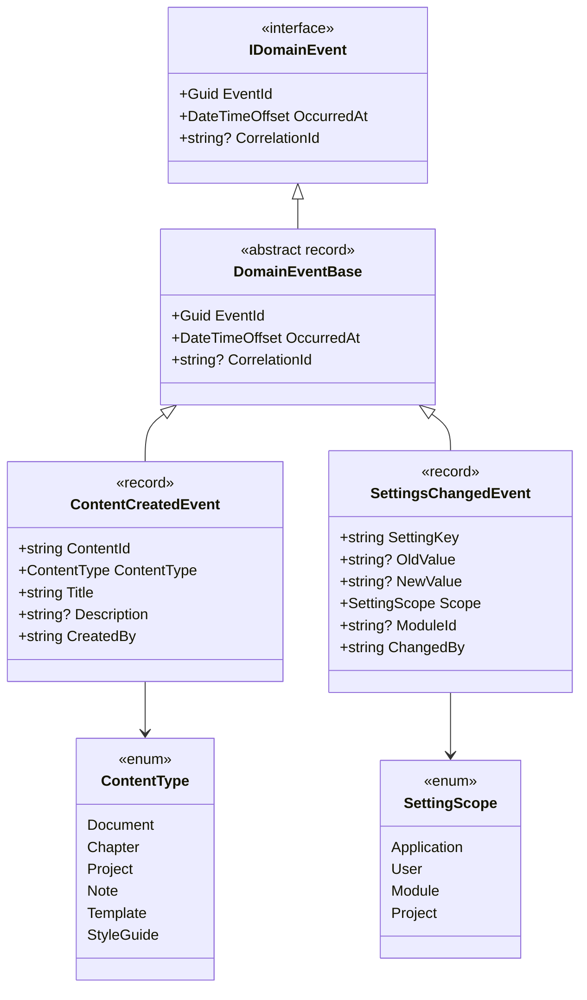
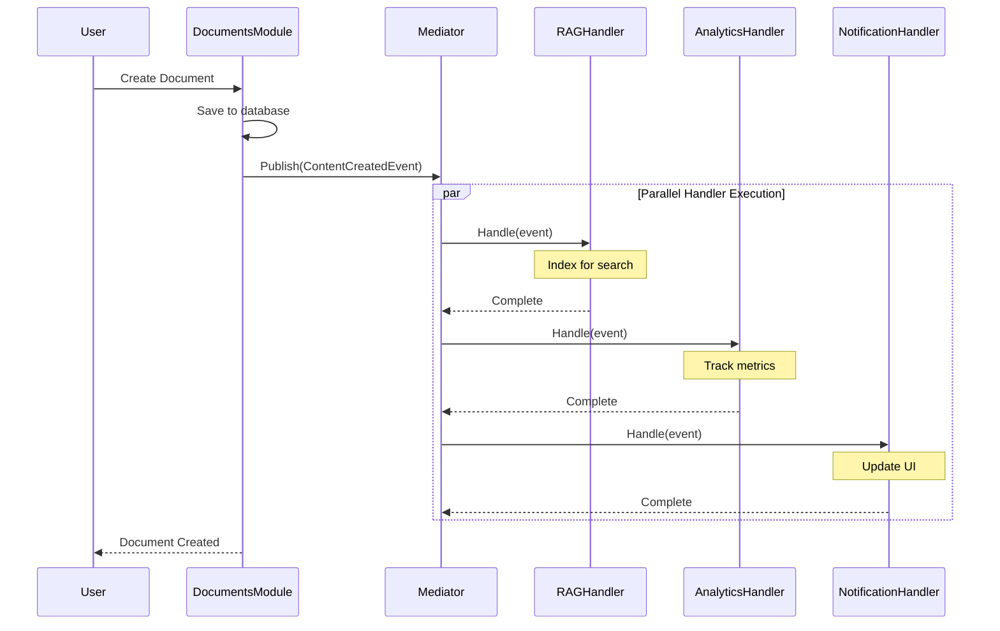

# LCS-DES-007b: Shared Domain Events

## 1. Metadata & Categorization

| Field                | Value                       | Description                                          |
| :------------------- | :-------------------------- | :--------------------------------------------------- |
| **Feature ID**       | `INF-007b`                  | Infrastructure - Shared Domain Events                |
| **Feature Name**     | Shared Events               | ContentCreatedEvent, SettingsChangedEvent            |
| **Target Version**   | `v0.0.7b`                   | Core Infrastructure Layer.                           |
| **Module Scope**     | `Lexichord.Abstractions`    | Event contracts in shared layer.                     |
| **Swimlane**         | `Infrastructure`            | The Podium (Platform).                               |
| **License Tier**     | `Core`                      | Foundation (Required for all tiers).                 |
| **Feature Gate Key** | N/A                         | No runtime gating for shared events.                 |
| **Author**           | System Architect            |                                                      |
| **Status**           | **Draft**                   | Pending approval.                                    |
| **Last Updated**     | 2026-01-26                  |                                                      |

---

## 2. Executive Summary

### 2.1 The Requirement

With MediatR configured (v0.0.7a), we need **shared domain events** that multiple modules can publish and subscribe to:

- **ContentCreatedEvent** — Published when any content (document, chapter, project) is created.
- **SettingsChangedEvent** — Published when application or module settings change.

These events live in `Lexichord.Abstractions` so all modules can reference them without coupling to each other.

### 2.2 The Proposed Solution

We **SHALL** implement:

1. **DomainEventBase** — Abstract base record with common event properties.
2. **ContentCreatedEvent** — Notifies modules when content is created.
3. **SettingsChangedEvent** — Notifies modules when settings change.
4. **ContentType enum** — Classifies the type of content created.

### 2.3 Event-Driven Architecture Benefits

```text
Without Events:                          With Events:
+------------------+                     +------------------+
|  Documents       |                     |  Documents       |
|  Module          |──────────────────>  |  Module          |
+--------┬---------+                     +--------┬---------+
         │                                        │
         │ Direct Reference                       │ Publish(ContentCreatedEvent)
         │                                        ▼
         ▼                               +------------------+
+------------------+                     |   MediatR        |
|  RAG Module      |                     |   Event Bus      |
+------------------+                     +--------┬---------+
         │                                        │
         │ Direct Reference               ┌───────┼───────┐
         │                                │       │       │
         ▼                                ▼       ▼       ▼
+------------------+                     RAG   Agents  Analytics
|  Agents Module   |                   Handler Handler Handler
+------------------+

Coupling: High                           Coupling: Low (via Abstractions only)
```

---

## 3. Architecture & Modular Strategy

### 3.1 Event Hierarchy



### 3.2 File Structure After v0.0.7b

```text
src/Lexichord.Abstractions/
├── Messaging/
│   ├── ICommand.cs              # From v0.0.7a
│   ├── IQuery.cs                # From v0.0.7a
│   └── IDomainEvent.cs          # From v0.0.7a
├── Events/
│   ├── DomainEventBase.cs       # NEW: Abstract base record
│   ├── ContentCreatedEvent.cs   # NEW: Content creation notification
│   ├── SettingsChangedEvent.cs  # NEW: Settings change notification
│   ├── ContentType.cs           # NEW: Content type enumeration
│   └── SettingScope.cs          # NEW: Setting scope enumeration
```

### 3.3 Event Flow Example



---

## 4. Data Contracts

### 4.1 DomainEventBase

```csharp
namespace Lexichord.Abstractions.Events;

/// <summary>
/// Base record for all domain events providing common metadata.
/// </summary>
/// <remarks>
/// LOGIC: This abstract record provides consistent event properties across
/// all domain events. Using a record ensures:
///
/// 1. **Immutability**: Events represent something that HAS happened and
///    cannot be changed.
///
/// 2. **Value Equality**: Two events with the same data are considered equal.
///
/// 3. **Easy Cloning**: With-expressions allow creating modified copies.
///
/// All domain events should inherit from this base to ensure consistent
/// metadata for logging, tracing, and event sourcing scenarios.
/// </remarks>
public abstract record DomainEventBase : IDomainEvent
{
    /// <inheritdoc/>
    /// <remarks>
    /// LOGIC: Auto-generated on creation. Used for:
    /// - Event deduplication (idempotency)
    /// - Event sourcing/replay identification
    /// - Distributed tracing correlation
    /// </remarks>
    public Guid EventId { get; init; } = Guid.NewGuid();

    /// <inheritdoc/>
    /// <remarks>
    /// LOGIC: UTC timestamp of when the state change occurred.
    /// This is NOT the time the event was processed or published.
    /// </remarks>
    public DateTimeOffset OccurredAt { get; init; } = DateTimeOffset.UtcNow;

    /// <inheritdoc/>
    /// <remarks>
    /// LOGIC: Flows from the originating request to enable distributed
    /// tracing. Should be set from the incoming request's correlation ID.
    /// </remarks>
    public string? CorrelationId { get; init; }
}
```

### 4.2 ContentType Enum

```csharp
namespace Lexichord.Abstractions.Events;

/// <summary>
/// Specifies the type of content that was created, modified, or deleted.
/// </summary>
/// <remarks>
/// LOGIC: This enumeration allows handlers to filter events based on
/// content type. Not all handlers care about all content types.
///
/// Example: RAG indexing might handle Documents but skip Templates.
/// </remarks>
public enum ContentType
{
    /// <summary>
    /// A standalone document (manuscript, article, story).
    /// </summary>
    Document = 0,

    /// <summary>
    /// A chapter within a project.
    /// </summary>
    Chapter = 1,

    /// <summary>
    /// A project containing multiple chapters/documents.
    /// </summary>
    Project = 2,

    /// <summary>
    /// A quick note or snippet.
    /// </summary>
    Note = 3,

    /// <summary>
    /// A reusable document template.
    /// </summary>
    Template = 4,

    /// <summary>
    /// A style guide or writing guidelines document.
    /// </summary>
    StyleGuide = 5,

    /// <summary>
    /// Character profile or worldbuilding element.
    /// </summary>
    WorldbuildingElement = 6,

    /// <summary>
    /// Research material or reference document.
    /// </summary>
    Reference = 7
}
```

### 4.3 ContentCreatedEvent

```csharp
namespace Lexichord.Abstractions.Events;

/// <summary>
/// Published when new content is created in the system.
/// </summary>
/// <remarks>
/// LOGIC: This event enables loose coupling between content producers
/// (e.g., Documents module) and content consumers (e.g., RAG, Analytics).
///
/// **When to Publish:**
/// - After a document, chapter, project, or other content is persisted.
/// - The content should be in a stable, queryable state.
///
/// **Expected Handlers:**
/// - RAG Module: Index content for semantic search.
/// - Analytics Module: Track content creation metrics.
/// - Notification Service: Notify collaborators.
/// - Backup Service: Trigger incremental backup.
///
/// **Handler Responsibilities:**
/// - Handlers SHOULD be idempotent (safe to process same event twice).
/// - Handlers SHOULD NOT modify the source content.
/// - Handlers MAY query additional data using ContentId.
/// </remarks>
/// <example>
/// Publishing the event:
/// <code>
/// await _mediator.Publish(new ContentCreatedEvent
/// {
///     ContentId = document.Id.ToString(),
///     ContentType = ContentType.Document,
///     Title = document.Title,
///     Description = document.Synopsis,
///     CreatedBy = currentUser.Id,
///     CorrelationId = correlationId
/// });
/// </code>
/// </example>
public record ContentCreatedEvent : DomainEventBase
{
    /// <summary>
    /// Unique identifier of the created content.
    /// </summary>
    /// <remarks>
    /// LOGIC: String representation of the content ID to avoid type
    /// dependencies. Handlers can parse to their expected ID type.
    /// </remarks>
    public required string ContentId { get; init; }

    /// <summary>
    /// The type of content that was created.
    /// </summary>
    /// <remarks>
    /// LOGIC: Allows handlers to filter events. A handler that only
    /// processes Documents can check this before proceeding.
    /// </remarks>
    public required ContentType ContentType { get; init; }

    /// <summary>
    /// Human-readable title of the content.
    /// </summary>
    /// <remarks>
    /// LOGIC: Included directly in the event to avoid requiring handlers
    /// to query the database for basic display/logging purposes.
    /// </remarks>
    public required string Title { get; init; }

    /// <summary>
    /// Optional description or synopsis of the content.
    /// </summary>
    public string? Description { get; init; }

    /// <summary>
    /// Identifier of the user who created the content.
    /// </summary>
    /// <remarks>
    /// LOGIC: String representation to avoid user model dependencies.
    /// Could be a GUID, email, or username depending on the system.
    /// </remarks>
    public required string CreatedBy { get; init; }

    /// <summary>
    /// Optional metadata associated with the content creation.
    /// </summary>
    /// <remarks>
    /// LOGIC: Dictionary allows attaching arbitrary metadata without
    /// schema changes. Examples: "wordCount", "language", "tags".
    /// </remarks>
    public IReadOnlyDictionary<string, string>? Metadata { get; init; }
}
```

### 4.4 SettingScope Enum

```csharp
namespace Lexichord.Abstractions.Events;

/// <summary>
/// Specifies the scope at which a setting applies.
/// </summary>
/// <remarks>
/// LOGIC: Settings can be scoped to different levels. Handlers may
/// only care about certain scopes.
///
/// Example: UI theme handler cares about User scope; build pipeline
/// handler cares about Application scope.
/// </remarks>
public enum SettingScope
{
    /// <summary>
    /// Application-wide settings (affect all users).
    /// </summary>
    Application = 0,

    /// <summary>
    /// User-specific settings (preferences, customizations).
    /// </summary>
    User = 1,

    /// <summary>
    /// Module-specific settings (module configuration).
    /// </summary>
    Module = 2,

    /// <summary>
    /// Project-specific settings (per-project configuration).
    /// </summary>
    Project = 3,

    /// <summary>
    /// Document-specific settings (per-document overrides).
    /// </summary>
    Document = 4
}
```

### 4.5 SettingsChangedEvent

```csharp
namespace Lexichord.Abstractions.Events;

/// <summary>
/// Published when application or module settings are changed.
/// </summary>
/// <remarks>
/// LOGIC: This event enables reactive configuration updates across modules.
/// Instead of polling for changes, modules subscribe to settings they care about.
///
/// **When to Publish:**
/// - After a setting value is persisted.
/// - Include both old and new values for diffing.
///
/// **Expected Handlers:**
/// - Theme Manager: React to appearance settings.
/// - Module Loaders: React to enabled/disabled modules.
/// - Agents: React to API key or model changes.
/// - Cache Invalidators: Clear cached data on relevant changes.
///
/// **Handler Responsibilities:**
/// - Handlers SHOULD filter by SettingKey or Scope before processing.
/// - Handlers MAY perform validation on NewValue.
/// - Handlers SHOULD NOT throw on invalid values (log warning instead).
///
/// **Setting Key Conventions:**
/// - Use dot notation: "module.documents.autoSaveInterval"
/// - Use lowercase with dots as separators
/// - Prefix with module name for module-specific settings
/// </remarks>
/// <example>
/// Publishing the event:
/// <code>
/// await _mediator.Publish(new SettingsChangedEvent
/// {
///     SettingKey = "appearance.theme",
///     OldValue = "Dark",
///     NewValue = "Light",
///     Scope = SettingScope.User,
///     ChangedBy = currentUser.Id,
///     CorrelationId = correlationId
/// });
/// </code>
/// </example>
public record SettingsChangedEvent : DomainEventBase
{
    /// <summary>
    /// The unique key identifying the setting that changed.
    /// </summary>
    /// <remarks>
    /// LOGIC: Follows dot-notation convention for hierarchical keys.
    /// Examples: "appearance.theme", "editor.autoSave.enabled",
    /// "module.rag.embeddingModel".
    /// </remarks>
    public required string SettingKey { get; init; }

    /// <summary>
    /// The previous value of the setting (null if newly created).
    /// </summary>
    /// <remarks>
    /// LOGIC: String representation allows generic handling without
    /// knowing the actual type. Handlers can parse as needed.
    /// </remarks>
    public string? OldValue { get; init; }

    /// <summary>
    /// The new value of the setting (null if deleted).
    /// </summary>
    public string? NewValue { get; init; }

    /// <summary>
    /// The scope at which this setting applies.
    /// </summary>
    /// <remarks>
    /// LOGIC: Handlers can filter by scope. A handler for user preferences
    /// might ignore Application-scoped changes.
    /// </remarks>
    public required SettingScope Scope { get; init; }

    /// <summary>
    /// The module ID if this is a module-specific setting.
    /// </summary>
    /// <remarks>
    /// LOGIC: Only set when Scope is Module. Allows handlers to
    /// filter for their specific module's settings.
    /// </remarks>
    public string? ModuleId { get; init; }

    /// <summary>
    /// Identifier of the user or system that changed the setting.
    /// </summary>
    /// <remarks>
    /// LOGIC: "system" for programmatic changes, user ID for user changes.
    /// Useful for audit logging.
    /// </remarks>
    public required string ChangedBy { get; init; }

    /// <summary>
    /// Optional reason for the change.
    /// </summary>
    /// <remarks>
    /// LOGIC: Useful for audit logging and understanding why a
    /// change was made. Example: "User preference", "Migration script".
    /// </remarks>
    public string? Reason { get; init; }
}
```

---

## 5. Implementation Logic

### 5.1 Publishing Events

```csharp
// In a command handler (e.g., CreateDocumentCommandHandler)
public class CreateDocumentCommandHandler : IRequestHandler<CreateDocumentCommand, DocumentId>
{
    private readonly IDocumentRepository _repository;
    private readonly IMediator _mediator;
    private readonly ILogger<CreateDocumentCommandHandler> _logger;

    public CreateDocumentCommandHandler(
        IDocumentRepository repository,
        IMediator mediator,
        ILogger<CreateDocumentCommandHandler> logger)
    {
        _repository = repository;
        _mediator = mediator;
        _logger = logger;
    }

    public async Task<DocumentId> Handle(
        CreateDocumentCommand request,
        CancellationToken cancellationToken)
    {
        // Create and persist the document
        var document = Document.Create(request.Title, request.Content);
        await _repository.AddAsync(document, cancellationToken);

        _logger.LogInformation(
            "Document created: {DocumentId}, Title: {Title}",
            document.Id, document.Title);

        // LOGIC: Publish event AFTER successful persistence
        // This ensures handlers don't process events for uncommitted data
        await _mediator.Publish(new ContentCreatedEvent
        {
            ContentId = document.Id.ToString(),
            ContentType = ContentType.Document,
            Title = document.Title,
            Description = document.Synopsis,
            CreatedBy = request.UserId,
            CorrelationId = request.CorrelationId,
            Metadata = new Dictionary<string, string>
            {
                ["wordCount"] = document.WordCount.ToString(),
                ["format"] = document.Format.ToString()
            }
        }, cancellationToken);

        return document.Id;
    }
}
```

### 5.2 Handling Events

```csharp
// In RAG module (doesn't need reference to Documents module)
public class IndexContentOnCreatedHandler : INotificationHandler<ContentCreatedEvent>
{
    private readonly IContentIndexer _indexer;
    private readonly ILogger<IndexContentOnCreatedHandler> _logger;

    public IndexContentOnCreatedHandler(
        IContentIndexer indexer,
        ILogger<IndexContentOnCreatedHandler> logger)
    {
        _indexer = indexer;
        _logger = logger;
    }

    public async Task Handle(
        ContentCreatedEvent notification,
        CancellationToken cancellationToken)
    {
        // LOGIC: Filter by content types we care about
        if (notification.ContentType is ContentType.Template or ContentType.StyleGuide)
        {
            _logger.LogDebug(
                "Skipping indexing for content type {ContentType}",
                notification.ContentType);
            return;
        }

        _logger.LogInformation(
            "Indexing content: {ContentId}, Type: {ContentType}",
            notification.ContentId,
            notification.ContentType);

        // LOGIC: Idempotent operation - safe to run multiple times
        await _indexer.IndexAsync(
            notification.ContentId,
            notification.Title,
            notification.Description,
            notification.Metadata,
            cancellationToken);
    }
}
```

### 5.3 Settings Change Handler Example

```csharp
// Theme manager reacts to theme setting changes
public class ThemeSettingsChangedHandler : INotificationHandler<SettingsChangedEvent>
{
    private readonly IThemeManager _themeManager;
    private readonly ILogger<ThemeSettingsChangedHandler> _logger;

    public ThemeSettingsChangedHandler(
        IThemeManager themeManager,
        ILogger<ThemeSettingsChangedHandler> logger)
    {
        _themeManager = themeManager;
        _logger = logger;
    }

    public Task Handle(
        SettingsChangedEvent notification,
        CancellationToken cancellationToken)
    {
        // LOGIC: Only handle theme-related settings
        if (!notification.SettingKey.StartsWith("appearance.theme"))
        {
            return Task.CompletedTask;
        }

        // LOGIC: Only handle user-scoped changes (not app defaults)
        if (notification.Scope != SettingScope.User)
        {
            return Task.CompletedTask;
        }

        _logger.LogInformation(
            "Theme setting changed: {OldValue} -> {NewValue}",
            notification.OldValue,
            notification.NewValue);

        // Apply the new theme
        if (Enum.TryParse<ThemeMode>(notification.NewValue, out var themeMode))
        {
            _themeManager.SetTheme(themeMode);
        }
        else
        {
            _logger.LogWarning(
                "Invalid theme value: {Value}",
                notification.NewValue);
        }

        return Task.CompletedTask;
    }
}
```

---

## 6. Use Cases & User Stories

### 6.1 User Stories

| ID    | Role      | Story                                                                             | Acceptance Criteria                               |
| :---- | :-------- | :-------------------------------------------------------------------------------- | :------------------------------------------------ |
| US-01 | Developer | As a developer, I want to publish ContentCreatedEvent when creating content.      | Event is published with all required properties.  |
| US-02 | Developer | As a developer, I want to handle ContentCreatedEvent in my module.                | Handler receives event without coupling.          |
| US-03 | Developer | As a developer, I want to filter events by ContentType.                           | Handler can skip irrelevant content types.        |
| US-04 | Developer | As a developer, I want to publish SettingsChangedEvent when settings change.      | Event includes old and new values.                |
| US-05 | Developer | As a developer, I want to react to specific setting keys.                         | Handler can filter by SettingKey prefix.          |

### 6.2 Use Cases

#### UC-01: Document Creation Triggers Indexing

**Preconditions:**

- Documents module is loaded.
- RAG module with ContentCreatedEvent handler is loaded.
- MediatR is configured.

**Flow:**

1. User creates a new document via Documents module.
2. Documents module saves document to database.
3. Documents module publishes `ContentCreatedEvent`.
4. MediatR discovers RAG module's `IndexContentOnCreatedHandler`.
5. Handler receives event and indexes the content.

**Postconditions:**

- Document is saved.
- Document is indexed for search.
- No direct coupling between Documents and RAG modules.

---

#### UC-02: Theme Change Updates UI

**Preconditions:**

- Settings service is available.
- Theme manager is registered as event handler.

**Flow:**

1. User changes theme from Dark to Light in settings UI.
2. Settings service persists the change.
3. Settings service publishes `SettingsChangedEvent`.
4. ThemeSettingsChangedHandler receives the event.
5. Handler calls `ThemeManager.SetTheme(Light)`.
6. UI updates to light theme.

**Postconditions:**

- Setting is persisted.
- Theme is applied immediately.
- Other handlers can also react (e.g., analytics tracking preference changes).

---

## 7. Observability & Logging

### 7.1 Log Events

| Level   | Source                      | Message Template                                                    |
| :------ | :-------------------------- | :------------------------------------------------------------------ |
| Info    | Publisher                   | `Publishing {EventType} for {ContentId}`                            |
| Debug   | Publisher                   | `Event details: {@Event}`                                           |
| Info    | Handler                     | `Handling {EventType}, ContentId: {ContentId}`                      |
| Debug   | Handler                     | `Skipping {EventType} for content type {ContentType}`               |
| Warning | Handler                     | `Failed to process {EventType}: {ErrorMessage}`                     |
| Info    | SettingsHandler             | `Setting changed: {SettingKey}, {OldValue} -> {NewValue}`           |

### 7.2 Correlation ID Flow

```csharp
// LOGIC: CorrelationId should flow from the original request
// through all events to enable distributed tracing

// In API Controller
[HttpPost]
public async Task<ActionResult<DocumentId>> CreateDocument(
    CreateDocumentRequest request)
{
    var correlationId = HttpContext.TraceIdentifier;

    var command = new CreateDocumentCommand
    {
        Title = request.Title,
        Content = request.Content,
        CorrelationId = correlationId
    };

    var result = await _mediator.Send(command);
    return Ok(result);
}

// In Command Handler
await _mediator.Publish(new ContentCreatedEvent
{
    // ... other properties
    CorrelationId = request.CorrelationId  // Flow through
});

// In Event Handler - logs include correlation ID
_logger.LogInformation(
    "Indexing content {ContentId} [CorrelationId: {CorrelationId}]",
    notification.ContentId,
    notification.CorrelationId);
```

---

## 8. Unit Testing Requirements

### 8.1 Event Contract Tests

```csharp
[Trait("Category", "Unit")]
public class ContentCreatedEventTests
{
    [Fact]
    public void Constructor_WithRequiredProperties_CreatesValidEvent()
    {
        // Arrange & Act
        var evt = new ContentCreatedEvent
        {
            ContentId = "doc-123",
            ContentType = ContentType.Document,
            Title = "My Document",
            CreatedBy = "user-456"
        };

        // Assert
        evt.ContentId.Should().Be("doc-123");
        evt.ContentType.Should().Be(ContentType.Document);
        evt.Title.Should().Be("My Document");
        evt.CreatedBy.Should().Be("user-456");
        evt.EventId.Should().NotBeEmpty();
        evt.OccurredAt.Should().BeCloseTo(DateTimeOffset.UtcNow, TimeSpan.FromSeconds(1));
    }

    [Fact]
    public void Event_ImplementsIDomainEvent()
    {
        // Assert
        typeof(ContentCreatedEvent).Should().Implement<IDomainEvent>();
    }

    [Fact]
    public void Event_InheritsFromDomainEventBase()
    {
        // Assert
        typeof(ContentCreatedEvent).Should().BeDerivedFrom<DomainEventBase>();
    }

    [Fact]
    public void Event_IsImmutable()
    {
        // Arrange
        var evt = new ContentCreatedEvent
        {
            ContentId = "doc-123",
            ContentType = ContentType.Document,
            Title = "My Document",
            CreatedBy = "user-456"
        };

        // Act - Create new instance with modified property
        var modified = evt with { Title = "Modified Title" };

        // Assert - Original unchanged
        evt.Title.Should().Be("My Document");
        modified.Title.Should().Be("Modified Title");
    }
}
```

### 8.2 Settings Event Tests

```csharp
[Trait("Category", "Unit")]
public class SettingsChangedEventTests
{
    [Fact]
    public void Constructor_WithRequiredProperties_CreatesValidEvent()
    {
        // Arrange & Act
        var evt = new SettingsChangedEvent
        {
            SettingKey = "appearance.theme",
            OldValue = "Dark",
            NewValue = "Light",
            Scope = SettingScope.User,
            ChangedBy = "user-123"
        };

        // Assert
        evt.SettingKey.Should().Be("appearance.theme");
        evt.OldValue.Should().Be("Dark");
        evt.NewValue.Should().Be("Light");
        evt.Scope.Should().Be(SettingScope.User);
        evt.ChangedBy.Should().Be("user-123");
    }

    [Fact]
    public void Event_WithNewSetting_HasNullOldValue()
    {
        // Arrange & Act
        var evt = new SettingsChangedEvent
        {
            SettingKey = "new.setting",
            OldValue = null,
            NewValue = "initial",
            Scope = SettingScope.Application,
            ChangedBy = "system"
        };

        // Assert
        evt.OldValue.Should().BeNull();
        evt.NewValue.Should().Be("initial");
    }

    [Fact]
    public void Event_WithDeletedSetting_HasNullNewValue()
    {
        // Arrange & Act
        var evt = new SettingsChangedEvent
        {
            SettingKey = "deprecated.setting",
            OldValue = "old-value",
            NewValue = null,
            Scope = SettingScope.Application,
            ChangedBy = "migration"
        };

        // Assert
        evt.OldValue.Should().Be("old-value");
        evt.NewValue.Should().BeNull();
    }
}
```

### 8.3 Handler Integration Tests

```csharp
[Trait("Category", "Integration")]
public class ContentCreatedEventHandlerTests
{
    [Fact]
    public async Task Handler_ReceivesPublishedEvent()
    {
        // Arrange
        var services = new ServiceCollection();
        services.AddMediatRServices(typeof(TestContentCreatedHandler).Assembly);
        var provider = services.BuildServiceProvider();
        var mediator = provider.GetRequiredService<IMediator>();

        TestContentCreatedHandler.ReceivedEvents.Clear();

        var evt = new ContentCreatedEvent
        {
            ContentId = "test-123",
            ContentType = ContentType.Document,
            Title = "Test Document",
            CreatedBy = "test-user"
        };

        // Act
        await mediator.Publish(evt);

        // Assert
        TestContentCreatedHandler.ReceivedEvents.Should().ContainSingle()
            .Which.ContentId.Should().Be("test-123");
    }
}

// Test handler for verification
public class TestContentCreatedHandler : INotificationHandler<ContentCreatedEvent>
{
    public static List<ContentCreatedEvent> ReceivedEvents { get; } = new();

    public Task Handle(ContentCreatedEvent notification, CancellationToken cancellationToken)
    {
        ReceivedEvents.Add(notification);
        return Task.CompletedTask;
    }
}
```

---

## 9. Security & Safety

### 9.1 Event Data Sensitivity

> [!IMPORTANT]
> Events should contain **identifiers**, not sensitive content.

- **DO**: Include `ContentId` to reference the content.
- **DON'T**: Include full document content in the event.
- **DO**: Include `Title` for logging/display purposes.
- **DON'T**: Include sensitive metadata (API keys, passwords).

### 9.2 Handler Isolation

- Handlers execute independently.
- One handler's failure should not prevent other handlers from executing.
- MediatR aggregates exceptions from all handlers.

---

## 10. Risks & Mitigations

| Risk                                    | Impact | Mitigation                                                          |
| :-------------------------------------- | :----- | :------------------------------------------------------------------ |
| Event schema changes break handlers     | High   | Version events; use optional properties for additions.              |
| Handler throws and breaks publishing    | Medium | MediatR continues to other handlers; aggregates exceptions.         |
| Sensitive data in events                | High   | Document what data is safe to include; code review events.          |
| Event ordering assumptions              | Medium | Document that handler execution order is not guaranteed.            |
| Large metadata dictionaries             | Low    | Document size limits; validate in publishers.                       |

---

## 11. Acceptance Criteria (QA)

| #   | Category        | Criterion                                                                 |
| :-- | :-------------- | :------------------------------------------------------------------------ |
| 1   | **[Base]**      | `DomainEventBase` exists with EventId, OccurredAt, CorrelationId.         |
| 2   | **[Event]**     | `ContentCreatedEvent` has ContentId, ContentType, Title, CreatedBy.       |
| 3   | **[Event]**     | `SettingsChangedEvent` has SettingKey, OldValue, NewValue, Scope.         |
| 4   | **[Enum]**      | `ContentType` enum has Document, Chapter, Project, Note, Template.        |
| 5   | **[Enum]**      | `SettingScope` enum has Application, User, Module, Project.               |
| 6   | **[Interface]** | All events implement `IDomainEvent`.                                      |
| 7   | **[Publish]**   | Events can be published via `IMediator.Publish()`.                        |
| 8   | **[Handle]**    | Multiple handlers can receive the same event.                             |
| 9   | **[Immutable]** | Events are immutable (record types).                                      |

---

## 12. Verification Commands

```bash
# 1. Verify Events directory exists
ls -la src/Lexichord.Abstractions/Events/

# 2. Verify all event files exist
ls src/Lexichord.Abstractions/Events/*.cs
# Expected: DomainEventBase.cs, ContentCreatedEvent.cs, SettingsChangedEvent.cs,
#           ContentType.cs, SettingScope.cs

# 3. Verify events implement IDomainEvent
grep -l "IDomainEvent" src/Lexichord.Abstractions/Events/*.cs

# 4. Verify events inherit from DomainEventBase
grep "DomainEventBase" src/Lexichord.Abstractions/Events/*.cs

# 5. Build solution
dotnet build --configuration Release

# 6. Run unit tests
dotnet test --filter "FullyQualifiedName~Event"
```

---

## 13. Deliverable Checklist

| Step | Description                                                          | Status |
| :--- | :------------------------------------------------------------------- | :----- |
| 1    | `Events/` directory created in Abstractions.                         | [ ]    |
| 2    | `DomainEventBase.cs` created with common properties.                 | [ ]    |
| 3    | `ContentType.cs` enum created with all content types.                | [ ]    |
| 4    | `ContentCreatedEvent.cs` created with all properties.                | [ ]    |
| 5    | `SettingScope.cs` enum created with all scopes.                      | [ ]    |
| 6    | `SettingsChangedEvent.cs` created with all properties.               | [ ]    |
| 7    | All events inherit from `DomainEventBase`.                           | [ ]    |
| 8    | All events implement `IDomainEvent` (via base class).                | [ ]    |
| 9    | Unit tests for event construction pass.                              | [ ]    |
| 10   | Integration tests for event publishing pass.                         | [ ]    |
| 11   | XML documentation complete for all public members.                   | [ ]    |
