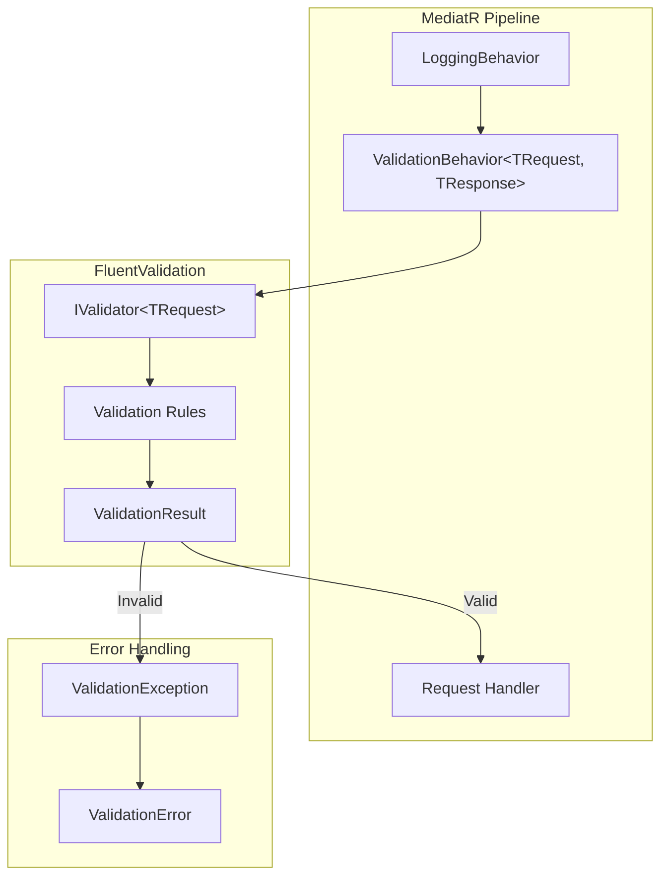
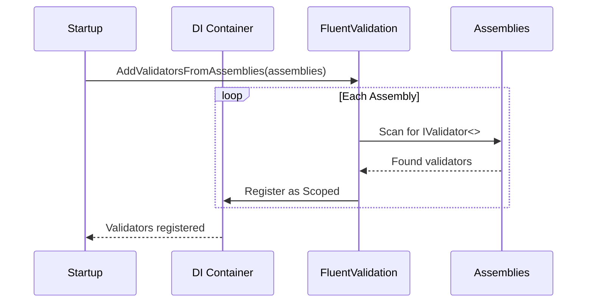
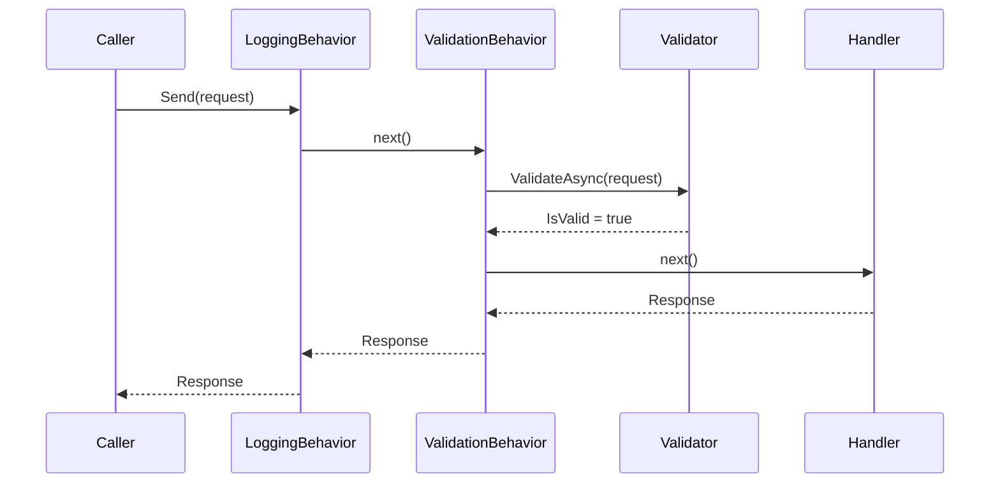
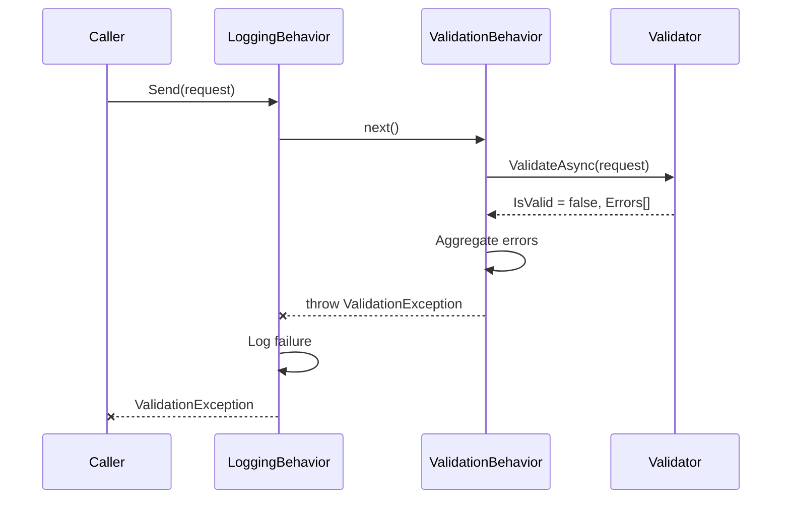
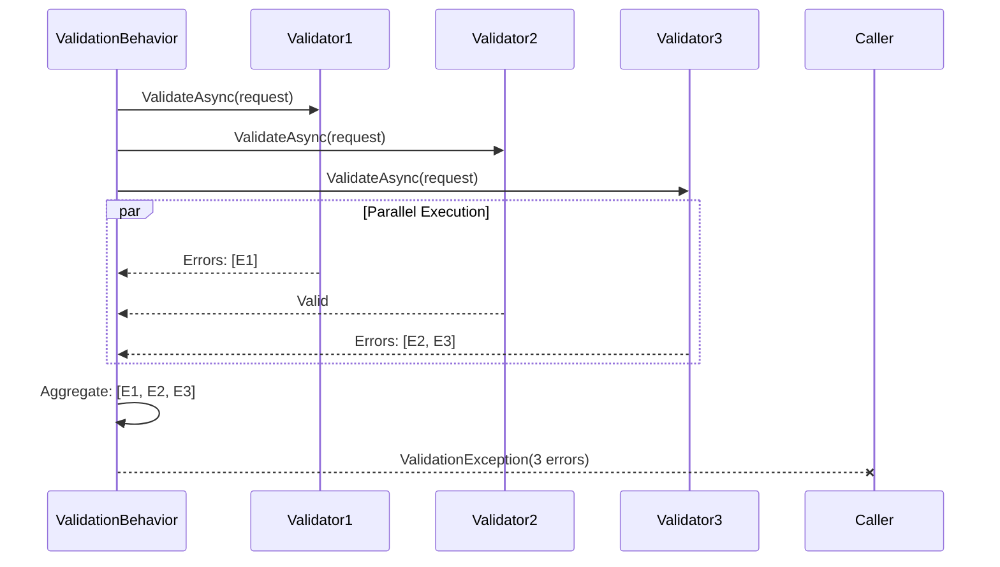

# LCS-DES-007d: Validation Pipeline Behavior

## 1. Metadata & Categorization

| Field                | Value                                      | Description                                          |
| :------------------- | :----------------------------------------- | :--------------------------------------------------- |
| **Feature ID**       | `INF-007d`                                 | Infrastructure - Validation Pipeline Behavior        |
| **Feature Name**     | Validation Pipeline Behavior               | FluentValidation integration for request validation. |
| **Target Version**   | `v0.0.7d`                                  | Core Infrastructure Layer.                           |
| **Module Scope**     | `Lexichord.Abstractions`, `Lexichord.Host` | Validation contracts and implementation.             |
| **Swimlane**         | `Infrastructure`                           | The Podium (Platform).                               |
| **License Tier**     | `Core`                                     | Foundation (Required for all tiers).                 |
| **Feature Gate Key** | N/A                                        | No runtime gating for validation infrastructure.     |
| **Author**           | System Architect                           |                                                      |
| **Status**           | **Draft**                                  | Pending approval.                                    |
| **Last Updated**     | 2026-01-26                                 |                                                      |

---

## 2. Executive Summary

### 2.1 The Requirement

All requests entering the system should be validated before reaching handlers:

- **Automatic Validation** — Validators are discovered and executed automatically.
- **Early Failure** — Invalid requests fail before business logic executes.
- **Structured Errors** — Validation failures return detailed, actionable errors.
- **Separation of Concerns** — Validation logic lives in dedicated validator classes.

### 2.2 The Proposed Solution

We **SHALL** implement validation infrastructure using FluentValidation:

1. **Install FluentValidation** packages with DI integration.
2. **Create ValidationBehavior** pipeline behavior.
3. **Define ValidationException** with structured error details.
4. **Configure auto-discovery** of validators from assemblies.
5. **Provide sample validator** demonstrating FluentValidation patterns.

### 2.3 Pipeline Position

```text
Request Flow:
┌───────────────────────────────────────────────────────────────────┐
│  Caller  →  LoggingBehavior  →  ValidationBehavior  →  Handler    │
│                                        │                          │
│                                        ├─ Valid: Continue         │
│                                        └─ Invalid: Throw          │
└───────────────────────────────────────────────────────────────────┘

ValidationBehavior is AFTER LoggingBehavior:
- Logging captures request start (before validation)
- Validation runs before handler
- Invalid requests are rejected with detailed errors
- Logging captures validation failures
```

---

## 3. Architecture & Modular Strategy

### 3.1 Validation Architecture



### 3.2 File Structure After v0.0.7d

```text
src/Lexichord.Abstractions/
├── Lexichord.Abstractions.csproj  # MODIFIED: Add FluentValidation
├── Validation/
│   ├── ValidationException.cs     # NEW: Custom exception with details
│   └── ValidationError.cs         # NEW: Structured error record

src/Lexichord.Host/
├── Lexichord.Host.csproj          # MODIFIED: Add FluentValidation.DI
├── Infrastructure/
│   ├── MediatRServiceExtensions.cs # MODIFIED: Register ValidationBehavior
│   └── Behaviors/
│       ├── LoggingBehavior.cs     # From v0.0.7c
│       └── ValidationBehavior.cs  # NEW: Pipeline behavior
├── Validators/
│   └── SampleCommandValidator.cs  # NEW: Example validator
```

### 3.3 Validator Discovery



---

## 4. Data Contracts

### 4.1 Updated Directory.Build.props

```xml
<Project>
  <PropertyGroup>
    <!-- Existing properties... -->

    <!-- FluentValidation Version (centralized) -->
    <FluentValidationVersion>11.9.0</FluentValidationVersion>
  </PropertyGroup>
</Project>
```

### 4.2 Lexichord.Abstractions.csproj Updates

```xml
<Project Sdk="Microsoft.NET.Sdk">

  <PropertyGroup>
    <!-- Existing properties... -->
  </PropertyGroup>

  <ItemGroup>
    <!-- MediatR (existing) -->
    <PackageReference Include="MediatR.Contracts" Version="$(MediatRVersion)" />

    <!-- FluentValidation (core library, no DI) -->
    <PackageReference Include="FluentValidation" Version="$(FluentValidationVersion)" />
  </ItemGroup>

</Project>
```

### 4.3 Lexichord.Host.csproj Updates

```xml
<Project Sdk="Microsoft.NET.Sdk">

  <PropertyGroup>
    <!-- Existing properties... -->
  </PropertyGroup>

  <ItemGroup>
    <!-- MediatR (existing) -->
    <PackageReference Include="MediatR" Version="$(MediatRVersion)" />

    <!-- FluentValidation with DI -->
    <PackageReference Include="FluentValidation.DependencyInjectionExtensions" Version="$(FluentValidationVersion)" />
  </ItemGroup>

</Project>
```

### 4.4 ValidationError Record

```csharp
namespace Lexichord.Abstractions.Validation;

/// <summary>
/// Represents a single validation error.
/// </summary>
/// <remarks>
/// LOGIC: This record provides a structured representation of validation errors
/// that can be easily serialized to JSON for API responses. It captures:
///
/// - **PropertyName**: Which property failed validation.
/// - **ErrorMessage**: Human-readable error description.
/// - **ErrorCode**: Machine-readable error identifier for programmatic handling.
/// - **AttemptedValue**: The value that failed validation (for debugging).
///
/// Example JSON output:
/// <code>
/// {
///   "propertyName": "Title",
///   "errorMessage": "Title must not be empty.",
///   "errorCode": "NotEmptyValidator",
///   "attemptedValue": ""
/// }
/// </code>
/// </remarks>
/// <param name="PropertyName">The name of the property that failed validation.</param>
/// <param name="ErrorMessage">A human-readable description of the validation failure.</param>
/// <param name="ErrorCode">A machine-readable error code for programmatic handling.</param>
/// <param name="AttemptedValue">The value that was validated (may be null).</param>
public record ValidationError(
    string PropertyName,
    string ErrorMessage,
    string? ErrorCode = null,
    object? AttemptedValue = null
);
```

### 4.5 ValidationException

```csharp
namespace Lexichord.Abstractions.Validation;

/// <summary>
/// Exception thrown when request validation fails.
/// </summary>
/// <remarks>
/// LOGIC: This exception is thrown by the ValidationBehavior when one or more
/// validation errors are detected. It aggregates all validation failures into
/// a single exception that can be:
///
/// 1. **Caught by middleware/filters** to return HTTP 400 with structured errors.
/// 2. **Logged** with full error details for debugging.
/// 3. **Displayed to users** with actionable error messages.
///
/// The exception is designed for easy serialization:
/// - Errors property contains all validation failures.
/// - Message property provides a summary.
///
/// Example usage in API middleware:
/// <code>
/// catch (ValidationException ex)
/// {
///     return BadRequest(new
///     {
///         type = "ValidationError",
///         errors = ex.Errors
///     });
/// }
/// </code>
/// </remarks>
public sealed class ValidationException : Exception
{
    /// <summary>
    /// Gets the collection of validation errors.
    /// </summary>
    public IReadOnlyCollection<ValidationError> Errors { get; }

    /// <summary>
    /// Initializes a new instance of ValidationException with the specified errors.
    /// </summary>
    /// <param name="errors">The validation errors that caused the exception.</param>
    public ValidationException(IEnumerable<ValidationError> errors)
        : base(BuildMessage(errors))
    {
        Errors = errors.ToList().AsReadOnly();
    }

    /// <summary>
    /// Initializes a new instance of ValidationException with a single error.
    /// </summary>
    /// <param name="propertyName">The property that failed validation.</param>
    /// <param name="errorMessage">The error message.</param>
    public ValidationException(string propertyName, string errorMessage)
        : this(new[] { new ValidationError(propertyName, errorMessage) })
    {
    }

    /// <summary>
    /// Initializes a new instance of ValidationException from FluentValidation results.
    /// </summary>
    /// <param name="failures">The FluentValidation failures.</param>
    public ValidationException(IEnumerable<FluentValidation.Results.ValidationFailure> failures)
        : this(failures.Select(f => new ValidationError(
            f.PropertyName,
            f.ErrorMessage,
            f.ErrorCode,
            f.AttemptedValue)))
    {
    }

    /// <summary>
    /// Builds a summary message from the validation errors.
    /// </summary>
    private static string BuildMessage(IEnumerable<ValidationError> errors)
    {
        var errorList = errors.ToList();
        var count = errorList.Count;

        if (count == 0)
            return "Validation failed.";

        if (count == 1)
            return $"Validation failed: {errorList[0].ErrorMessage}";

        return $"Validation failed with {count} errors. First error: {errorList[0].ErrorMessage}";
    }
}
```

---

## 5. Implementation Logic

### 5.1 ValidationBehavior Implementation

```csharp
using FluentValidation;
using MediatR;
using Microsoft.Extensions.Logging;
using Lexichord.Abstractions.Validation;
using ValidationException = Lexichord.Abstractions.Validation.ValidationException;

namespace Lexichord.Host.Infrastructure.Behaviors;

/// <summary>
/// Pipeline behavior that validates requests using FluentValidation before handler execution.
/// </summary>
/// <typeparam name="TRequest">The type of request being validated.</typeparam>
/// <typeparam name="TResponse">The type of response from the handler.</typeparam>
/// <remarks>
/// LOGIC: This behavior runs AFTER LoggingBehavior and BEFORE the handler.
/// It collects all validators for the request type and executes them.
///
/// Behavior:
/// 1. Resolve all IValidator&lt;TRequest&gt; from DI.
/// 2. Execute all validators (may run in parallel for performance).
/// 3. Aggregate all failures into a single ValidationException.
/// 4. Throw if any failures exist; otherwise continue pipeline.
///
/// Design decisions:
/// - Validators are optional: If no validators exist, request passes through.
/// - All validators run: Even if first fails, others execute for complete error list.
/// - Async validators supported: Uses ValidateAsync for async rules.
/// </remarks>
public sealed class ValidationBehavior<TRequest, TResponse> : IPipelineBehavior<TRequest, TResponse>
    where TRequest : notnull
{
    private readonly IEnumerable<IValidator<TRequest>> _validators;
    private readonly ILogger<ValidationBehavior<TRequest, TResponse>> _logger;

    /// <summary>
    /// Initializes a new instance of the ValidationBehavior.
    /// </summary>
    /// <param name="validators">All registered validators for this request type.</param>
    /// <param name="logger">The logger instance.</param>
    public ValidationBehavior(
        IEnumerable<IValidator<TRequest>> validators,
        ILogger<ValidationBehavior<TRequest, TResponse>> logger)
    {
        _validators = validators ?? throw new ArgumentNullException(nameof(validators));
        _logger = logger ?? throw new ArgumentNullException(nameof(logger));
    }

    /// <summary>
    /// Validates the request before passing to the next handler in the pipeline.
    /// </summary>
    public async Task<TResponse> Handle(
        TRequest request,
        RequestHandlerDelegate<TResponse> next,
        CancellationToken cancellationToken)
    {
        // LOGIC: If no validators exist for this request type, skip validation
        if (!_validators.Any())
        {
            return await next();
        }

        var requestTypeName = typeof(TRequest).Name;

        _logger.LogDebug(
            "Validating {RequestType} with {ValidatorCount} validator(s)",
            requestTypeName,
            _validators.Count());

        // LOGIC: Create validation context with the request instance
        var context = new ValidationContext<TRequest>(request);

        // LOGIC: Execute all validators and collect results
        var validationResults = await Task.WhenAll(
            _validators.Select(v => v.ValidateAsync(context, cancellationToken)));

        // LOGIC: Aggregate all failures from all validators
        var failures = validationResults
            .Where(r => !r.IsValid)
            .SelectMany(r => r.Errors)
            .ToList();

        if (failures.Count > 0)
        {
            _logger.LogWarning(
                "Validation failed for {RequestType}: {ErrorCount} error(s)",
                requestTypeName,
                failures.Count);

            // Log individual errors at debug level
            foreach (var failure in failures)
            {
                _logger.LogDebug(
                    "Validation error: {PropertyName} - {ErrorMessage}",
                    failure.PropertyName,
                    failure.ErrorMessage);
            }

            // LOGIC: Throw with all failures aggregated
            throw new ValidationException(failures);
        }

        _logger.LogDebug("Validation passed for {RequestType}", requestTypeName);

        // LOGIC: Validation passed, continue to handler
        return await next();
    }
}
```

### 5.2 Updated MediatRServiceExtensions

```csharp
using FluentValidation;
using MediatR;
using Microsoft.Extensions.DependencyInjection;
using System.Reflection;
using Lexichord.Host.Infrastructure.Behaviors;
using Lexichord.Host.Infrastructure.Options;

namespace Lexichord.Host.Infrastructure;

public static class MediatRServiceExtensions
{
    public static IServiceCollection AddMediatRServices(
        this IServiceCollection services,
        params Assembly[] moduleAssemblies)
    {
        // Configure logging behavior options
        services.AddOptions<LoggingBehaviorOptions>()
            .BindConfiguration(LoggingBehaviorOptions.SectionName);

        var assembliesToScan = new List<Assembly>
        {
            typeof(MediatRServiceExtensions).Assembly
        };
        assembliesToScan.AddRange(moduleAssemblies);

        // Register MediatR
        services.AddMediatR(configuration =>
        {
            configuration.RegisterServicesFromAssemblies(assembliesToScan.ToArray());

            // LOGIC: Pipeline behaviors execute in registration order
            // 1. LoggingBehavior (outermost - logs start/end/duration)
            // 2. ValidationBehavior (validates before handler)
            configuration.AddBehavior(typeof(IPipelineBehavior<,>), typeof(LoggingBehavior<,>));
            configuration.AddBehavior(typeof(IPipelineBehavior<,>), typeof(ValidationBehavior<,>));
        });

        // LOGIC: Register FluentValidation validators from all assemblies
        // Validators are registered as Scoped to allow per-request dependencies
        services.AddValidatorsFromAssemblies(assembliesToScan);

        return services;
    }
}
```

### 5.3 Sample Command Validator

```csharp
using FluentValidation;
using Lexichord.Abstractions.Messaging;

namespace Lexichord.Host.Validators;

/// <summary>
/// Sample command to demonstrate FluentValidation patterns.
/// </summary>
/// <remarks>
/// LOGIC: This command represents a typical create operation with
/// properties that need validation.
/// </remarks>
public record CreateDocumentCommand : ICommand<Guid>
{
    /// <summary>
    /// The document title (required, max 200 chars).
    /// </summary>
    public string Title { get; init; } = string.Empty;

    /// <summary>
    /// The document content (required).
    /// </summary>
    public string Content { get; init; } = string.Empty;

    /// <summary>
    /// Optional description (max 500 chars).
    /// </summary>
    public string? Description { get; init; }

    /// <summary>
    /// List of tags (optional, each tag max 50 chars).
    /// </summary>
    public List<string>? Tags { get; init; }

    /// <summary>
    /// Word count target (optional, must be positive if set).
    /// </summary>
    public int? TargetWordCount { get; init; }
}

/// <summary>
/// Validator for CreateDocumentCommand demonstrating FluentValidation patterns.
/// </summary>
/// <remarks>
/// LOGIC: This validator demonstrates common validation patterns:
///
/// 1. **NotEmpty**: Required string fields.
/// 2. **MaximumLength**: String length limits.
/// 3. **Must**: Custom validation logic.
/// 4. **When**: Conditional validation.
/// 5. **ForEach**: Collection item validation.
/// 6. **WithMessage**: Custom error messages.
/// 7. **WithErrorCode**: Custom error codes for programmatic handling.
///
/// Validators are auto-discovered and registered by FluentValidation DI extensions.
/// </remarks>
public sealed class CreateDocumentCommandValidator : AbstractValidator<CreateDocumentCommand>
{
    public CreateDocumentCommandValidator()
    {
        // LOGIC: Title is required and has length limits
        RuleFor(x => x.Title)
            .NotEmpty()
                .WithMessage("Document title is required.")
                .WithErrorCode("TITLE_REQUIRED")
            .MaximumLength(200)
                .WithMessage("Document title must not exceed {MaxLength} characters.")
                .WithErrorCode("TITLE_TOO_LONG");

        // LOGIC: Content is required and cannot be just whitespace
        RuleFor(x => x.Content)
            .NotEmpty()
                .WithMessage("Document content is required.")
                .WithErrorCode("CONTENT_REQUIRED")
            .Must(content => !string.IsNullOrWhiteSpace(content))
                .WithMessage("Document content cannot be only whitespace.")
                .WithErrorCode("CONTENT_WHITESPACE");

        // LOGIC: Description is optional but has length limit if provided
        RuleFor(x => x.Description)
            .MaximumLength(500)
                .WithMessage("Description must not exceed {MaxLength} characters.")
                .WithErrorCode("DESCRIPTION_TOO_LONG")
            .When(x => !string.IsNullOrEmpty(x.Description));

        // LOGIC: Tags are optional but each tag has rules if provided
        RuleForEach(x => x.Tags)
            .NotEmpty()
                .WithMessage("Tags cannot be empty strings.")
                .WithErrorCode("TAG_EMPTY")
            .MaximumLength(50)
                .WithMessage("Each tag must not exceed {MaxLength} characters.")
                .WithErrorCode("TAG_TOO_LONG")
            .Must(tag => !tag.Contains(','))
                .WithMessage("Tags cannot contain commas.")
                .WithErrorCode("TAG_INVALID_CHARS")
            .When(x => x.Tags is not null && x.Tags.Count > 0);

        // LOGIC: Collection-level validation for tags
        RuleFor(x => x.Tags)
            .Must(tags => tags == null || tags.Count <= 10)
                .WithMessage("Cannot have more than {ComparisonValue} tags.")
                .WithErrorCode("TOO_MANY_TAGS")
            .When(x => x.Tags is not null);

        // LOGIC: TargetWordCount must be positive if provided
        RuleFor(x => x.TargetWordCount)
            .GreaterThan(0)
                .WithMessage("Target word count must be a positive number.")
                .WithErrorCode("INVALID_WORD_COUNT")
            .When(x => x.TargetWordCount.HasValue);
    }
}
```

---

## 6. Sequence Diagrams

### 6.1 Validation Success Flow



### 6.2 Validation Failure Flow



### 6.3 Multiple Validators Flow



---

## 7. Use Cases & User Stories

### 7.1 User Stories

| ID    | Role      | Story                                                                               | Acceptance Criteria                               |
| :---- | :-------- | :---------------------------------------------------------------------------------- | :------------------------------------------------ |
| US-01 | Developer | As a developer, I want requests validated before reaching handlers.                 | Handler never sees invalid requests.              |
| US-02 | Developer | As a developer, I want validators auto-discovered from assemblies.                  | No manual registration required.                  |
| US-03 | Developer | As a developer, I want all validation errors returned at once.                      | Single exception contains all errors.             |
| US-04 | Developer | As a developer, I want custom error codes for programmatic handling.                | ErrorCode property in ValidationError.            |
| US-05 | API User  | As an API user, I want clear error messages explaining what's wrong.                | Human-readable ErrorMessage in response.          |

### 7.2 Use Cases

#### UC-01: Valid Request Passes Through

**Preconditions:**

- ValidationBehavior is registered.
- Validator exists for request type.
- Request has valid data.

**Flow:**

1. Caller sends valid CreateDocumentCommand.
2. LoggingBehavior logs request start.
3. ValidationBehavior resolves validator.
4. Validator executes all rules.
5. All rules pass (IsValid = true).
6. Request continues to handler.
7. Handler processes and returns response.

**Postconditions:**

- Request was validated.
- Handler executed successfully.

---

#### UC-02: Invalid Request Rejected

**Preconditions:**

- ValidationBehavior is registered.
- Validator exists for request type.
- Request has invalid data (empty title).

**Flow:**

1. Caller sends invalid CreateDocumentCommand.
2. LoggingBehavior logs request start.
3. ValidationBehavior resolves validator.
4. Validator executes rules.
5. Title rule fails: "Document title is required."
6. ValidationBehavior throws ValidationException.
7. LoggingBehavior logs the failure.
8. Exception propagates to caller.

**Postconditions:**

- Handler never executed.
- Caller receives structured validation errors.

---

#### UC-03: No Validator Exists

**Preconditions:**

- ValidationBehavior is registered.
- No validator exists for request type.

**Flow:**

1. Caller sends request without validator.
2. ValidationBehavior checks _validators.Any().
3. No validators found (empty collection).
4. Request passes through to handler.

**Postconditions:**

- Request was not blocked.
- Handler executed normally.

---

## 8. Observability & Logging

### 8.1 Log Events

| Level   | Source             | Message Template                                                      |
| :------ | :----------------- | :-------------------------------------------------------------------- |
| Debug   | ValidationBehavior | `Validating {RequestType} with {ValidatorCount} validator(s)`         |
| Debug   | ValidationBehavior | `Validation passed for {RequestType}`                                 |
| Warning | ValidationBehavior | `Validation failed for {RequestType}: {ErrorCount} error(s)`          |
| Debug   | ValidationBehavior | `Validation error: {PropertyName} - {ErrorMessage}`                   |

### 8.2 Structured Logging Properties

```csharp
// Properties available for structured logging queries
{
    "RequestType": "CreateDocumentCommand",
    "ValidatorCount": 1,
    "ErrorCount": 2,
    "PropertyName": "Title",
    "ErrorMessage": "Document title is required.",
    "ErrorCode": "TITLE_REQUIRED"
}
```

---

## 9. Unit Testing Requirements

### 9.1 ValidationBehavior Tests

```csharp
[Trait("Category", "Unit")]
public class ValidationBehaviorTests
{
    [Fact]
    public async Task Handle_WithNoValidators_PassesThrough()
    {
        // Arrange
        var validators = Enumerable.Empty<IValidator<TestCommand>>();
        var logger = new FakeLogger<ValidationBehavior<TestCommand, string>>();
        var behavior = new ValidationBehavior<TestCommand, string>(validators, logger);
        var request = new TestCommand { Value = "test" };

        // Act
        var result = await behavior.Handle(
            request,
            () => Task.FromResult("success"),
            CancellationToken.None);

        // Assert
        result.Should().Be("success");
    }

    [Fact]
    public async Task Handle_WithValidRequest_PassesThrough()
    {
        // Arrange
        var validator = new TestCommandValidator();
        var validators = new[] { validator };
        var logger = new FakeLogger<ValidationBehavior<TestCommand, string>>();
        var behavior = new ValidationBehavior<TestCommand, string>(validators, logger);
        var request = new TestCommand { Value = "valid" };

        // Act
        var result = await behavior.Handle(
            request,
            () => Task.FromResult("success"),
            CancellationToken.None);

        // Assert
        result.Should().Be("success");
    }

    [Fact]
    public async Task Handle_WithInvalidRequest_ThrowsValidationException()
    {
        // Arrange
        var validator = new TestCommandValidator();
        var validators = new[] { validator };
        var logger = new FakeLogger<ValidationBehavior<TestCommand, string>>();
        var behavior = new ValidationBehavior<TestCommand, string>(validators, logger);
        var request = new TestCommand { Value = "" }; // Invalid: empty

        // Act & Assert
        var exception = await Assert.ThrowsAsync<ValidationException>(async () =>
            await behavior.Handle(
                request,
                () => Task.FromResult("success"),
                CancellationToken.None));

        exception.Errors.Should().ContainSingle()
            .Which.PropertyName.Should().Be("Value");
    }

    [Fact]
    public async Task Handle_WithMultipleErrors_AggregatesAll()
    {
        // Arrange
        var validator = new MultiErrorValidator();
        var validators = new[] { validator };
        var logger = new FakeLogger<ValidationBehavior<MultiFieldCommand, string>>();
        var behavior = new ValidationBehavior<MultiFieldCommand, string>(validators, logger);
        var request = new MultiFieldCommand { Field1 = "", Field2 = "" };

        // Act & Assert
        var exception = await Assert.ThrowsAsync<ValidationException>(async () =>
            await behavior.Handle(
                request,
                () => Task.FromResult("success"),
                CancellationToken.None));

        exception.Errors.Should().HaveCount(2);
    }
}

// Test fixtures
public record TestCommand : ICommand<string>
{
    public string Value { get; init; } = string.Empty;
}

public class TestCommandValidator : AbstractValidator<TestCommand>
{
    public TestCommandValidator()
    {
        RuleFor(x => x.Value).NotEmpty();
    }
}
```

### 9.2 Sample Validator Tests

```csharp
[Trait("Category", "Unit")]
public class CreateDocumentCommandValidatorTests
{
    private readonly CreateDocumentCommandValidator _validator = new();

    [Fact]
    public void Validate_WithValidCommand_ReturnsValid()
    {
        // Arrange
        var command = new CreateDocumentCommand
        {
            Title = "My Document",
            Content = "Some content here"
        };

        // Act
        var result = _validator.Validate(command);

        // Assert
        result.IsValid.Should().BeTrue();
    }

    [Fact]
    public void Validate_WithEmptyTitle_ReturnsInvalid()
    {
        // Arrange
        var command = new CreateDocumentCommand
        {
            Title = "",
            Content = "Some content"
        };

        // Act
        var result = _validator.Validate(command);

        // Assert
        result.IsValid.Should().BeFalse();
        result.Errors.Should().ContainSingle()
            .Which.PropertyName.Should().Be("Title");
    }

    [Fact]
    public void Validate_WithTitleTooLong_ReturnsInvalid()
    {
        // Arrange
        var command = new CreateDocumentCommand
        {
            Title = new string('x', 201),
            Content = "Some content"
        };

        // Act
        var result = _validator.Validate(command);

        // Assert
        result.IsValid.Should().BeFalse();
        result.Errors.Should().Contain(e =>
            e.ErrorCode == "TITLE_TOO_LONG");
    }

    [Fact]
    public void Validate_WithTooManyTags_ReturnsInvalid()
    {
        // Arrange
        var command = new CreateDocumentCommand
        {
            Title = "My Document",
            Content = "Some content",
            Tags = Enumerable.Range(1, 11).Select(i => $"tag{i}").ToList()
        };

        // Act
        var result = _validator.Validate(command);

        // Assert
        result.IsValid.Should().BeFalse();
        result.Errors.Should().Contain(e =>
            e.ErrorCode == "TOO_MANY_TAGS");
    }

    [Theory]
    [InlineData(0)]
    [InlineData(-1)]
    [InlineData(-100)]
    public void Validate_WithInvalidWordCount_ReturnsInvalid(int wordCount)
    {
        // Arrange
        var command = new CreateDocumentCommand
        {
            Title = "My Document",
            Content = "Some content",
            TargetWordCount = wordCount
        };

        // Act
        var result = _validator.Validate(command);

        // Assert
        result.IsValid.Should().BeFalse();
        result.Errors.Should().Contain(e =>
            e.ErrorCode == "INVALID_WORD_COUNT");
    }
}
```

### 9.3 Integration Tests

```csharp
[Trait("Category", "Integration")]
public class ValidationIntegrationTests
{
    [Fact]
    public async Task MediatR_WithInvalidRequest_ThrowsValidationException()
    {
        // Arrange
        var services = new ServiceCollection();
        services.AddLogging();
        services.AddMediatRServices(typeof(CreateDocumentCommandValidator).Assembly);
        var provider = services.BuildServiceProvider();
        var mediator = provider.GetRequiredService<IMediator>();

        var invalidCommand = new CreateDocumentCommand
        {
            Title = "", // Invalid
            Content = "Content"
        };

        // Act & Assert
        await Assert.ThrowsAsync<ValidationException>(async () =>
            await mediator.Send(invalidCommand));
    }

    [Fact]
    public async Task MediatR_ValidatorsAreAutoDiscovered()
    {
        // Arrange
        var services = new ServiceCollection();
        services.AddLogging();
        services.AddMediatRServices(typeof(CreateDocumentCommandValidator).Assembly);
        var provider = services.BuildServiceProvider();

        // Act
        var validators = provider.GetServices<IValidator<CreateDocumentCommand>>();

        // Assert
        validators.Should().ContainSingle();
    }
}
```

---

## 10. Security & Safety

### 10.1 Validation Security

> [!IMPORTANT]
> Validation is the first line of defense against malicious input.
> All external input MUST be validated before processing.

**Security Considerations:**

- **Input Sanitization**: Validate length limits to prevent DoS.
- **Injection Prevention**: Validate format constraints where applicable.
- **Error Messages**: Don't leak internal details in error messages.

### 10.2 Error Message Guidelines

```csharp
// DO: Use generic, user-friendly messages
.WithMessage("Title is required.")

// DON'T: Leak implementation details
.WithMessage("SQL column 'doc_title' cannot be NULL")

// DO: Include helpful context
.WithMessage("Title must not exceed {MaxLength} characters. You provided {TotalLength}.")

// DON'T: Include sensitive data
.WithMessage($"User {userId} attempted invalid access")
```

---

## 11. Risks & Mitigations

| Risk                                     | Impact | Mitigation                                                           |
| :--------------------------------------- | :----- | :------------------------------------------------------------------- |
| Validator not discovered                 | High   | Integration tests verify discovery; explicit assembly list.          |
| Async validator blocks thread            | Medium | Use ValidateAsync; avoid blocking calls in validators.               |
| Validation slows all requests            | Medium | Keep validators lightweight; measure and optimize hot paths.         |
| Error messages leak sensitive info       | Medium | Code review error messages; use error codes, not details.            |
| Multiple validators conflict             | Low    | Document validator responsibilities; use composition over duplication.|

---

## 12. Acceptance Criteria (QA)

| #   | Category          | Criterion                                                                    |
| :-- | :---------------- | :--------------------------------------------------------------------------- |
| 1   | **[Package]**     | FluentValidation packages installed in Abstractions and Host.                |
| 2   | **[Exception]**   | ValidationException exists with Errors collection.                           |
| 3   | **[Record]**      | ValidationError exists with PropertyName, ErrorMessage, ErrorCode.           |
| 4   | **[Behavior]**    | ValidationBehavior is registered in MediatR pipeline.                        |
| 5   | **[Order]**       | ValidationBehavior runs after LoggingBehavior, before handler.               |
| 6   | **[Discovery]**   | Validators are auto-discovered from assemblies.                              |
| 7   | **[Valid]**       | Valid requests pass through to handlers.                                     |
| 8   | **[Invalid]**     | Invalid requests throw ValidationException before handler.                   |
| 9   | **[Aggregate]**   | Multiple validation errors are aggregated into single exception.             |
| 10  | **[NoValidator]** | Requests without validators pass through without error.                      |
| 11  | **[Logging]**     | Validation failures are logged with property and message.                    |
| 12  | **[Sample]**      | Sample validator demonstrates common FluentValidation patterns.              |

---

## 13. Verification Commands

```bash
# 1. Verify FluentValidation packages installed
dotnet list src/Lexichord.Abstractions package | grep FluentValidation
# Expected: FluentValidation

dotnet list src/Lexichord.Host package | grep FluentValidation
# Expected: FluentValidation.DependencyInjectionExtensions

# 2. Verify validation classes exist
ls src/Lexichord.Abstractions/Validation/
# Expected: ValidationException.cs, ValidationError.cs

# 3. Verify behavior exists
ls src/Lexichord.Host/Infrastructure/Behaviors/
# Expected: LoggingBehavior.cs, ValidationBehavior.cs

# 4. Verify sample validator exists
ls src/Lexichord.Host/Validators/
# Expected: SampleCommandValidator.cs (or CreateDocumentCommandValidator.cs)

# 5. Build solution
dotnet build --configuration Release

# 6. Run unit tests
dotnet test --filter "FullyQualifiedName~Validation"

# 7. Run integration tests
dotnet test --filter "Category=Integration"
```

---

## 14. Deliverable Checklist

| Step | Description                                                              | Status |
| :--- | :----------------------------------------------------------------------- | :----- |
| 1    | FluentValidation version added to Directory.Build.props.                 | [ ]    |
| 2    | `FluentValidation` added to Lexichord.Abstractions.csproj.               | [ ]    |
| 3    | `FluentValidation.DependencyInjectionExtensions` added to Host.csproj.   | [ ]    |
| 4    | `Validation/` directory created in Abstractions.                         | [ ]    |
| 5    | `ValidationError.cs` record created with all properties.                 | [ ]    |
| 6    | `ValidationException.cs` created with Errors collection.                 | [ ]    |
| 7    | `ValidationBehavior.cs` created in Host/Infrastructure/Behaviors.        | [ ]    |
| 8    | MediatRServiceExtensions updated to register ValidationBehavior.         | [ ]    |
| 9    | AddValidatorsFromAssemblies() called for auto-discovery.                 | [ ]    |
| 10   | `Validators/` directory created in Host.                                 | [ ]    |
| 11   | Sample validator demonstrates common FluentValidation patterns.          | [ ]    |
| 12   | Unit tests for ValidationBehavior pass.                                  | [ ]    |
| 13   | Unit tests for sample validator pass.                                    | [ ]    |
| 14   | Integration tests verify end-to-end validation.                          | [ ]    |
