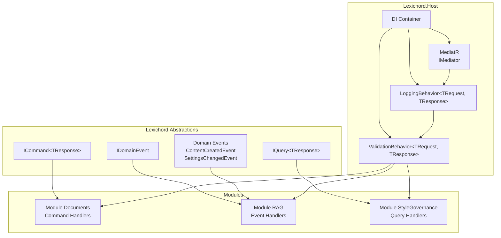
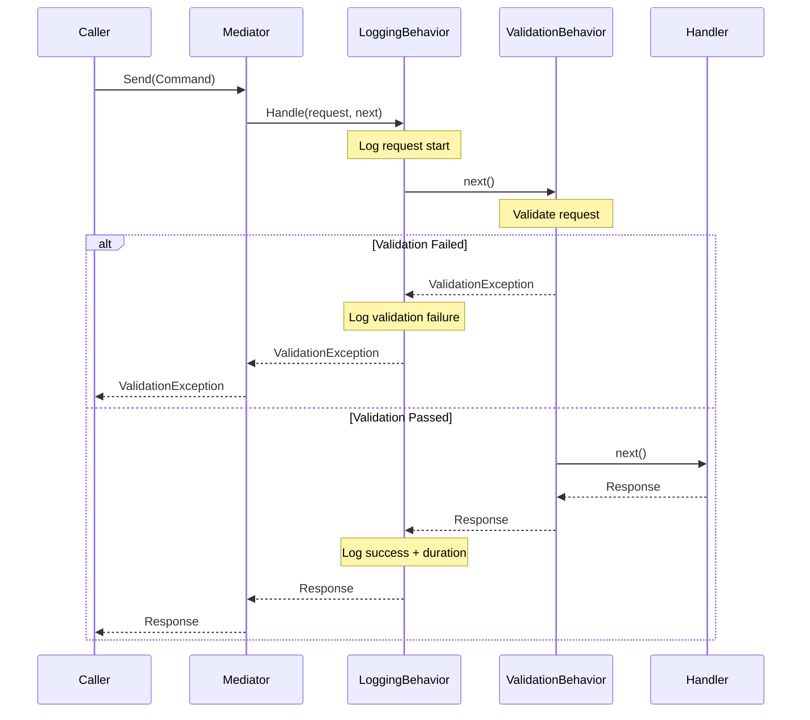

# LCS-01: Feature Design Composition

## 1. Metadata & Categorization

| Field                | Value                                      | Description                                        |
| :------------------- | :----------------------------------------- | :------------------------------------------------- |
| **Feature ID**       | `INF-007`                                  | Infrastructure - Event Bus (Communication)         |
| **Feature Name**     | The Event Bus                              | MediatR-based in-process message bus.              |
| **Target Version**   | `v0.0.7`                                   | Core Infrastructure Layer.                         |
| **Module Scope**     | `Lexichord.Abstractions`, `Lexichord.Host` | Contracts and implementation.                      |
| **Swimlane**         | `Infrastructure`                           | The Podium (Platform).                             |
| **License Tier**     | `Core`                                     | Foundation (Required for all tiers).               |
| **Feature Gate Key** | N/A                                        | No runtime gating for core infrastructure.         |
| **Author**           | System Architect                           |                                                    |
| **Status**           | **Draft**                                  | Pending approval.                                  |
| **Last Updated**     | 2026-01-26                                 |                                                    |

---

## 2. Executive Summary

### 2.1 The Requirement

Lexichord's modular architecture requires a mechanism for **loose coupling** between modules:

- **Module A** must communicate with **Module B** without a direct project reference.
- Commands and queries must flow through a **central mediator**.
- Domain events must support **publish/subscribe** patterns.
- Cross-cutting concerns (logging, validation) must apply **transparently**.

Without this infrastructure:

- Modules would need circular references.
- Cross-cutting concerns would be duplicated in every handler.
- Testing would require complex mocking of direct dependencies.

### 2.2 The Proposed Solution

We **SHALL** implement a complete MediatR-based communication layer with:

1. **v0.0.7a: MediatR Setup** — Install packages, configure DI, define marker interfaces.
2. **v0.0.7b: Shared Domain Events** — Define `ContentCreatedEvent`, `SettingsChangedEvent` in Abstractions.
3. **v0.0.7c: Logging Pipeline Behavior** — Auto-log every command/query with timing and correlation.
4. **v0.0.7d: Validation Pipeline Behavior** — Integrate FluentValidation for request validation.

---

## 3. Architecture & Modular Strategy

### 3.1 High-Level Architecture



### 3.2 Pipeline Behavior Execution Order



### 3.3 Dependencies

- **NuGet Packages:**

| Package                                     | Version | Purpose                              |
| :------------------------------------------ | :------ | :----------------------------------- |
| `MediatR`                                   | 12.4.x  | In-process messaging                 |
| `MediatR.Extensions.Microsoft.DependencyInjection` | 12.4.x  | DI integration                       |
| `FluentValidation`                          | 11.9.x  | Request validation                   |
| `FluentValidation.DependencyInjectionExtensions` | 11.9.x  | Validator auto-discovery             |

- **Project References:**

| Project                  | Reference Direction              |
| :----------------------- | :------------------------------- |
| `Lexichord.Host`         | -> `Lexichord.Abstractions`      |
| `Lexichord.Abstractions` | (No references)                  |
| All Modules              | -> `Lexichord.Abstractions`      |

### 3.4 Licensing Behavior

- **N/A:** The event bus is Core infrastructure required by all license tiers.

---

## 4. Decision Tree: Message Routing

```text
START: "What type of message is being sent?"
|
+-- Is it a Command? (changes state, single handler)
|   +-- YES -> IMediator.Send(command)
|   |   +-- Exactly ONE handler must exist
|   |   +-- Returns TResponse (result of operation)
|   |   +-- Example: CreateDocumentCommand -> DocumentId
|   +-- NO -> Continue
|
+-- Is it a Query? (reads state, single handler)
|   +-- YES -> IMediator.Send(query)
|   |   +-- Exactly ONE handler must exist
|   |   +-- Returns TResponse (data requested)
|   |   +-- Example: GetDocumentQuery -> DocumentDto
|   +-- NO -> Continue
|
+-- Is it an Event? (notification, multiple handlers)
    +-- YES -> IMediator.Publish(event)
        +-- ZERO or MORE handlers respond
        +-- No return value (fire-and-forget)
        +-- Example: ContentCreatedEvent -> IndexHandler, NotifyHandler
```

---

## 5. Data Contracts

### 5.1 Core Interfaces (Lexichord.Abstractions)

```csharp
namespace Lexichord.Abstractions.Messaging;

/// <summary>
/// Marker interface for commands that change application state.
/// </summary>
/// <typeparam name="TResponse">The type of response returned by the handler.</typeparam>
/// <remarks>
/// LOGIC: Commands represent intent to change state. Each command MUST have
/// exactly ONE handler. Commands are sent via IMediator.Send().
///
/// Example: CreateDocumentCommand returns DocumentId after creation.
/// </remarks>
public interface ICommand<out TResponse> : MediatR.IRequest<TResponse>
{
}

/// <summary>
/// Marker interface for commands that do not return a value.
/// </summary>
/// <remarks>
/// LOGIC: Use this for commands where success is indicated by no exception.
/// </remarks>
public interface ICommand : ICommand<Unit>
{
}

/// <summary>
/// Marker interface for queries that read application state.
/// </summary>
/// <typeparam name="TResponse">The type of data returned by the handler.</typeparam>
/// <remarks>
/// LOGIC: Queries represent intent to read state WITHOUT side effects.
/// Each query MUST have exactly ONE handler. Queries are sent via IMediator.Send().
///
/// Example: GetDocumentQuery returns DocumentDto.
/// </remarks>
public interface IQuery<out TResponse> : MediatR.IRequest<TResponse>
{
}

/// <summary>
/// Marker interface for domain events that notify of state changes.
/// </summary>
/// <remarks>
/// LOGIC: Events represent something that HAS happened. Events can have
/// ZERO or MORE handlers. Events are published via IMediator.Publish().
///
/// Example: ContentCreatedEvent notifies RAG and Analytics modules.
/// </remarks>
public interface IDomainEvent : MediatR.INotification
{
    /// <summary>
    /// Unique identifier for this event instance.
    /// </summary>
    Guid EventId { get; }

    /// <summary>
    /// When this event occurred.
    /// </summary>
    DateTimeOffset OccurredAt { get; }

    /// <summary>
    /// Correlation ID for distributed tracing.
    /// </summary>
    string? CorrelationId { get; }
}
```

### 5.2 Domain Event Base (Lexichord.Abstractions)

```csharp
namespace Lexichord.Abstractions.Events;

/// <summary>
/// Base record for all domain events with common properties.
/// </summary>
/// <remarks>
/// LOGIC: Provides consistent event metadata across all domain events.
/// Using a record ensures immutability and value-based equality.
/// </remarks>
public abstract record DomainEventBase : IDomainEvent
{
    /// <inheritdoc/>
    public Guid EventId { get; init; } = Guid.NewGuid();

    /// <inheritdoc/>
    public DateTimeOffset OccurredAt { get; init; } = DateTimeOffset.UtcNow;

    /// <inheritdoc/>
    public string? CorrelationId { get; init; }
}
```

### 5.3 Package Configuration (Directory.Build.props)

```xml
<!-- Add to existing PropertyGroup -->
<MediatRVersion>12.4.0</MediatRVersion>
<FluentValidationVersion>11.9.0</FluentValidationVersion>
```

---

## 6. Implementation Logic

### 6.1 Event Bus Service Registration

```csharp
using MediatR;
using FluentValidation;
using Microsoft.Extensions.DependencyInjection;
using System.Reflection;

namespace Lexichord.Host.Infrastructure;

/// <summary>
/// Extension methods for registering MediatR and pipeline behaviors.
/// </summary>
/// <remarks>
/// LOGIC: This centralizes all event bus configuration. Assembly scanning
/// is configured to find handlers in Host and all loaded module assemblies.
/// </remarks>
public static class MediatRServiceExtensions
{
    /// <summary>
    /// Adds MediatR services and pipeline behaviors to the DI container.
    /// </summary>
    /// <param name="services">The service collection.</param>
    /// <param name="assemblies">Assemblies to scan for handlers and validators.</param>
    /// <returns>The service collection for chaining.</returns>
    public static IServiceCollection AddMediatRServices(
        this IServiceCollection services,
        params Assembly[] assemblies)
    {
        // LOGIC: Include Host assembly by default, plus any module assemblies
        var assembliesToScan = new List<Assembly>
        {
            typeof(MediatRServiceExtensions).Assembly // Lexichord.Host
        };
        assembliesToScan.AddRange(assemblies);

        // Register MediatR with assembly scanning
        services.AddMediatR(cfg =>
        {
            cfg.RegisterServicesFromAssemblies(assembliesToScan.ToArray());

            // LOGIC: Pipeline behaviors execute in registration order
            // Order: Logging -> Validation -> Handler
            cfg.AddBehavior(typeof(IPipelineBehavior<,>), typeof(LoggingBehavior<,>));
            cfg.AddBehavior(typeof(IPipelineBehavior<,>), typeof(ValidationBehavior<,>));
        });

        // Register FluentValidation validators from all assemblies
        services.AddValidatorsFromAssemblies(assembliesToScan);

        return services;
    }
}
```

### 6.2 Module Communication Example

```csharp
// In Module.Documents - Publishing an event
public class CreateDocumentHandler : IRequestHandler<CreateDocumentCommand, DocumentId>
{
    private readonly IMediator _mediator;
    private readonly IDocumentRepository _repository;

    public async Task<DocumentId> Handle(
        CreateDocumentCommand request,
        CancellationToken cancellationToken)
    {
        // Create the document
        var document = new Document(request.Title, request.Content);
        await _repository.AddAsync(document, cancellationToken);

        // LOGIC: Publish event - other modules can react without coupling
        await _mediator.Publish(new ContentCreatedEvent
        {
            ContentId = document.Id.ToString(),
            ContentType = ContentType.Document,
            Title = document.Title,
            CreatedAt = DateTimeOffset.UtcNow,
            CreatedBy = request.UserId
        }, cancellationToken);

        return document.Id;
    }
}

// In Module.RAG - Handling the event
public class IndexContentOnCreatedHandler : INotificationHandler<ContentCreatedEvent>
{
    private readonly IIndexingService _indexingService;

    public async Task Handle(
        ContentCreatedEvent notification,
        CancellationToken cancellationToken)
    {
        // LOGIC: RAG module indexes the content without knowing about Documents module
        await _indexingService.IndexAsync(
            notification.ContentId,
            notification.ContentType,
            cancellationToken);
    }
}
```

---

## 7. Use Cases & User Stories

### 7.1 User Stories

| ID    | Role      | Story                                                                                     | Acceptance Criteria                              |
| :---- | :-------- | :---------------------------------------------------------------------------------------- | :----------------------------------------------- |
| US-01 | Developer | As a developer, I want to send commands via IMediator without knowing the handler.        | Commands reach handlers without direct reference.|
| US-02 | Developer | As a developer, I want to publish events that multiple modules can handle.                | Events reach all registered handlers.            |
| US-03 | Developer | As a developer, I want all requests to be automatically logged.                           | Log entries appear for every command/query.      |
| US-04 | Developer | As a developer, I want invalid requests rejected before reaching handlers.                | ValidationException thrown for invalid requests. |
| US-05 | Developer | As a developer, I want to add validators without modifying handler code.                  | Validators are auto-discovered and executed.     |

### 7.2 Use Cases

#### UC-01: Command Dispatch

**Preconditions:**

- MediatR is configured in DI.
- A handler exists for `CreateDocumentCommand`.

**Flow:**

1. Controller receives HTTP POST request.
2. Controller calls `_mediator.Send(new CreateDocumentCommand(...))`.
3. MediatR resolves `IRequestHandler<CreateDocumentCommand, DocumentId>`.
4. LoggingBehavior logs request start.
5. ValidationBehavior validates command (if validator exists).
6. Handler executes and returns `DocumentId`.
7. LoggingBehavior logs request completion with duration.
8. Controller receives `DocumentId`.

**Postconditions:**

- Document is created.
- Log entries record the operation.

---

#### UC-02: Event Publication

**Preconditions:**

- `ContentCreatedEvent` is defined.
- Multiple handlers exist for the event.

**Flow:**

1. Documents module creates a document.
2. Documents module calls `_mediator.Publish(new ContentCreatedEvent(...))`.
3. MediatR resolves all `INotificationHandler<ContentCreatedEvent>`.
4. Each handler executes (order not guaranteed).
5. All handlers complete (or exceptions are aggregated).

**Postconditions:**

- All handlers have processed the event.
- Modules remain decoupled.

---

#### UC-03: Validation Failure

**Preconditions:**

- A validator exists for `CreateDocumentCommand`.
- Command has invalid data (empty title).

**Flow:**

1. Controller sends `new CreateDocumentCommand { Title = "" }`.
2. LoggingBehavior logs request start.
3. ValidationBehavior executes `CreateDocumentCommandValidator`.
4. Validator returns failure: "Title cannot be empty".
5. ValidationBehavior throws `ValidationException`.
6. LoggingBehavior logs validation failure.
7. Exception propagates to controller.

**Postconditions:**

- Handler never executes.
- Controller receives structured validation errors.

---

## 8. Observability & Logging

### 8.1 Log Events

| Level   | Source             | Message Template                                                              |
| :------ | :----------------- | :---------------------------------------------------------------------------- |
| Debug   | LoggingBehavior    | `Handling {RequestType} with CorrelationId {CorrelationId}`                   |
| Debug   | LoggingBehavior    | `Request properties: {@RequestProperties}`                                    |
| Info    | LoggingBehavior    | `Handled {RequestType} in {ElapsedMs}ms`                                      |
| Warning | LoggingBehavior    | `Slow request: {RequestType} took {ElapsedMs}ms (threshold: {ThresholdMs}ms)` |
| Warning | LoggingBehavior    | `Request {RequestType} failed: {ExceptionType}`                               |
| Warning | ValidationBehavior | `Validation failed for {RequestType}: {ErrorCount} errors`                    |
| Debug   | ValidationBehavior | `Validation errors: {@ValidationErrors}`                                      |

### 8.2 Correlation ID Flow

```csharp
// LOGIC: Correlation ID flows through the entire request pipeline
public record CreateDocumentCommand : ICommand<DocumentId>
{
    public string Title { get; init; } = string.Empty;
    public string Content { get; init; } = string.Empty;
    public string? CorrelationId { get; init; }
}

// LoggingBehavior extracts and uses CorrelationId
_logger.LogDebug(
    "Handling {RequestType} with CorrelationId {CorrelationId}",
    typeof(TRequest).Name,
    GetCorrelationId(request));
```

---

## 9. Unit Testing Requirements

### 9.1 Test Scenarios

#### MediatR Integration Tests

```csharp
[Trait("Category", "Integration")]
public class MediatRIntegrationTests
{
    [Fact]
    public async Task Send_WithValidCommand_ReturnsResponse()
    {
        // Arrange
        var services = new ServiceCollection();
        services.AddMediatRServices(typeof(TestCommandHandler).Assembly);
        var provider = services.BuildServiceProvider();
        var mediator = provider.GetRequiredService<IMediator>();

        // Act
        var result = await mediator.Send(new TestCommand { Value = "test" });

        // Assert
        result.Should().Be("Handled: test");
    }

    [Fact]
    public async Task Publish_WithEvent_NotifiesAllHandlers()
    {
        // Arrange
        var services = new ServiceCollection();
        services.AddMediatRServices(typeof(TestEventHandler1).Assembly);
        var provider = services.BuildServiceProvider();
        var mediator = provider.GetRequiredService<IMediator>();

        // Act
        await mediator.Publish(new TestEvent { Message = "test" });

        // Assert
        TestEventHandler1.WasHandled.Should().BeTrue();
        TestEventHandler2.WasHandled.Should().BeTrue();
    }
}
```

#### Pipeline Behavior Tests

```csharp
[Trait("Category", "Unit")]
public class LoggingBehaviorTests
{
    [Fact]
    public async Task Handle_LogsRequestStartAndCompletion()
    {
        // Arrange
        var logger = new TestLogger<LoggingBehavior<TestCommand, string>>();
        var behavior = new LoggingBehavior<TestCommand, string>(logger);
        var request = new TestCommand { Value = "test" };
        var next = () => Task.FromResult("result");

        // Act
        await behavior.Handle(request, next, CancellationToken.None);

        // Assert
        logger.LoggedMessages.Should().Contain(m => m.Contains("Handling"));
        logger.LoggedMessages.Should().Contain(m => m.Contains("Handled"));
    }
}
```

---

## 10. Security & Safety

### 10.1 Sensitive Data Protection

> [!IMPORTANT]
> Request logging must exclude sensitive data. Use the `[SensitiveData]` attribute
> on properties that should not appear in logs.

```csharp
public record CreateUserCommand : ICommand<UserId>
{
    public string Username { get; init; } = string.Empty;

    [SensitiveData]
    public string Password { get; init; } = string.Empty;

    [SensitiveData]
    public string Email { get; init; } = string.Empty;
}
```

### 10.2 Validation Security

- **All external input MUST be validated** before processing.
- Validators should check for injection attacks where applicable.
- Validation errors should not expose internal implementation details.

---

## 11. Risks & Mitigations

| Risk                                    | Impact | Mitigation                                                               |
| :-------------------------------------- | :----- | :----------------------------------------------------------------------- |
| Handler not found for command           | High   | MediatR throws clear exception; test coverage for all commands.          |
| Validation slows down all requests      | Medium | Validators should be lightweight; cache reflection results.              |
| Event handlers fail silently            | Medium | Aggregate exceptions; log all handler failures.                          |
| Logging exposes sensitive data          | High   | Implement `[SensitiveData]` attribute; audit log output.                 |
| Pipeline behavior order changes         | High   | Explicit registration order; integration tests verify order.             |
| Assembly scanning performance           | Low    | Scan once at startup; cache handler registrations.                       |

---

## 12. Acceptance Criteria (QA)

| #   | Category           | Criterion                                                                     |
| :-- | :----------------- | :---------------------------------------------------------------------------- |
| 1   | **[DI]**           | `IMediator` is resolvable from the DI container.                              |
| 2   | **[Command]**      | Commands are dispatched to their single handler.                              |
| 3   | **[Query]**        | Queries are dispatched to their single handler.                               |
| 4   | **[Event]**        | Events are published to all registered handlers.                              |
| 5   | **[Logging]**      | Every command/query generates start and completion log entries.               |
| 6   | **[Logging]**      | Slow requests (>500ms) generate warning logs.                                 |
| 7   | **[Logging]**      | Sensitive data is redacted from logs.                                         |
| 8   | **[Validation]**   | Invalid requests throw `ValidationException` before handler execution.        |
| 9   | **[Validation]**   | Validation errors include property names and messages.                        |
| 10  | **[Validation]**   | Validators are auto-discovered from registered assemblies.                    |
| 11  | **[Order]**        | Pipeline executes in order: Logging -> Validation -> Handler.                 |
| 12  | **[Events]**       | `ContentCreatedEvent` and `SettingsChangedEvent` are defined and functional.  |

---

## 13. Verification Commands

```bash
# 1. Build the solution
dotnet build --configuration Release

# 2. Verify MediatR packages are installed
dotnet list src/Lexichord.Host package | grep MediatR
# Expected: MediatR, MediatR.Extensions.Microsoft.DependencyInjection

# 3. Verify FluentValidation packages are installed
dotnet list src/Lexichord.Host package | grep FluentValidation
# Expected: FluentValidation, FluentValidation.DependencyInjectionExtensions

# 4. Verify interfaces exist
grep -r "ICommand<" src/Lexichord.Abstractions/
grep -r "IQuery<" src/Lexichord.Abstractions/
grep -r "IDomainEvent" src/Lexichord.Abstractions/

# 5. Verify events exist
grep -r "ContentCreatedEvent" src/Lexichord.Abstractions/
grep -r "SettingsChangedEvent" src/Lexichord.Abstractions/

# 6. Run unit tests
dotnet test --filter "Category=Unit"

# 7. Run integration tests
dotnet test --filter "Category=Integration"
```

---

## 14. Deliverable Checklist

| Step | Description                                                                         | Status |
| :--- | :---------------------------------------------------------------------------------- | :----- |
| 1    | MediatR packages added to solution.                                                 | [ ]    |
| 2    | FluentValidation packages added to solution.                                        | [ ]    |
| 3    | `ICommand<T>`, `IQuery<T>`, `IDomainEvent` interfaces defined in Abstractions.      | [ ]    |
| 4    | `DomainEventBase` abstract record defined in Abstractions.                          | [ ]    |
| 5    | `ContentCreatedEvent` defined with all properties.                                  | [ ]    |
| 6    | `SettingsChangedEvent` defined with all properties.                                 | [ ]    |
| 7    | `AddMediatRServices()` extension method implemented.                                | [ ]    |
| 8    | `LoggingBehavior<TRequest, TResponse>` implemented.                                 | [ ]    |
| 9    | `[SensitiveData]` attribute implemented.                                            | [ ]    |
| 10   | `ValidationBehavior<TRequest, TResponse>` implemented.                              | [ ]    |
| 11   | `ValidationException` with structured errors implemented.                           | [ ]    |
| 12   | Sample validator demonstrates FluentValidation usage.                               | [ ]    |
| 13   | Unit tests for pipeline behaviors pass.                                             | [ ]    |
| 14   | Integration tests for MediatR pass.                                                 | [ ]    |
