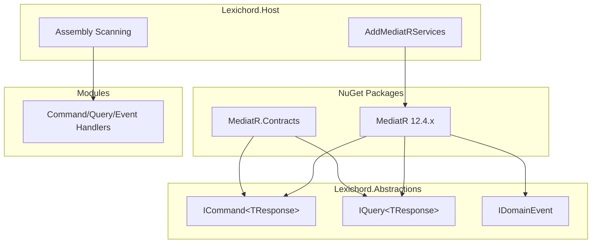
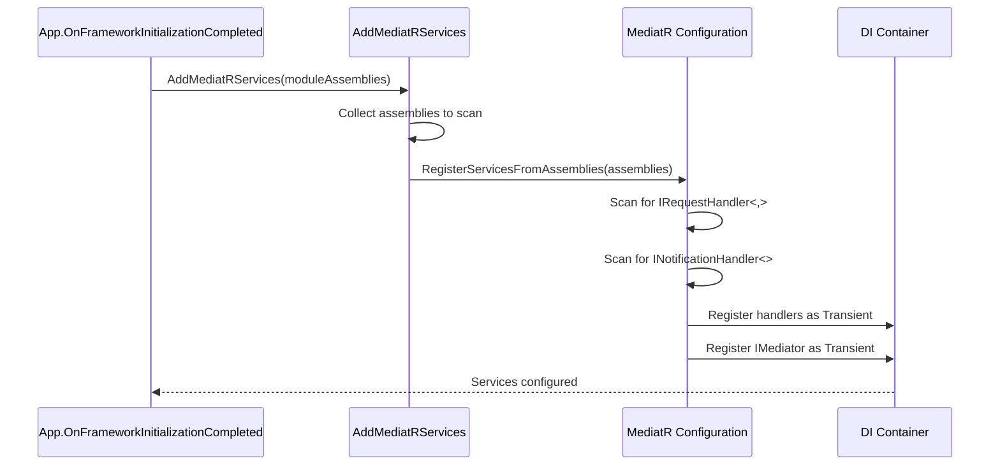
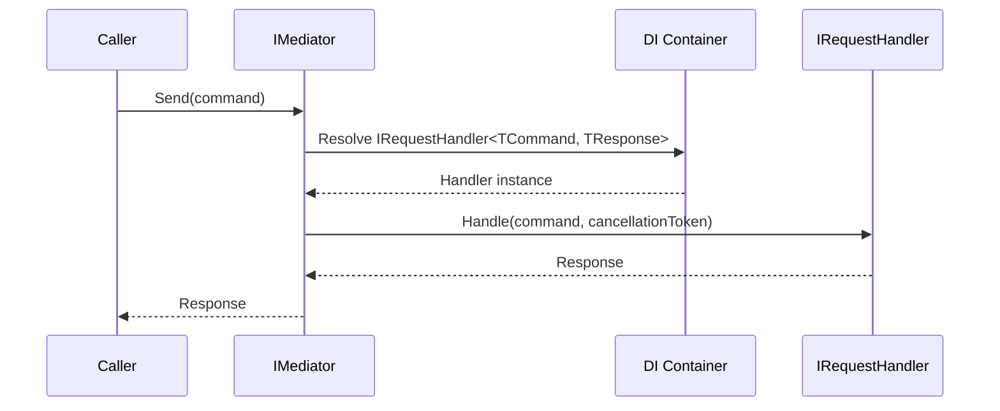

# LCS-01: Feature Design Composition

## 1. Metadata & Categorization

| Field                | Value                                      | Description                                    |
| :------------------- | :----------------------------------------- | :--------------------------------------------- |
| **Feature ID**       | `INF-007a`                                 | Infrastructure - MediatR Setup                 |
| **Feature Name**     | MediatR Bootstrap                          | Install MediatR and configure DI container.    |
| **Target Version**   | `v0.0.7a`                                  | Core Infrastructure Layer.                     |
| **Module Scope**     | `Lexichord.Abstractions`, `Lexichord.Host` | Contracts and DI registration.                 |
| **Swimlane**         | `Infrastructure`                           | The Podium (Platform).                         |
| **License Tier**     | `Core`                                     | Foundation (Required for all tiers).           |
| **Feature Gate Key** | N/A                                        | No runtime gating for core infrastructure.     |
| **Author**           | System Architect                           |                                                |
| **Status**           | **Draft**                                  | Pending approval.                              |
| **Last Updated**     | 2026-01-26                                 |                                                |

---

## 2. Executive Summary

### 2.1 The Requirement

Before modules can communicate via the event bus, we need:

- **MediatR installed** in the solution with consistent versioning.
- **DI container configured** to resolve `IMediator` and discover handlers.
- **Base contracts defined** (`ICommand<T>`, `IQuery<T>`, `IDomainEvent`) for type safety.
- **Assembly scanning** configured to find handlers from all loaded modules.

### 2.2 The Proposed Solution

We **SHALL** implement a complete MediatR bootstrap:

1. **Add NuGet packages** to Abstractions and Host projects.
2. **Define marker interfaces** that extend MediatR's base types.
3. **Create registration extension** for centralized DI configuration.
4. **Configure assembly scanning** to discover handlers across modules.

### 2.3 Current State vs Target State

| Component                  | Current State         | Target State (v0.0.7a)                        |
| :------------------------- | :-------------------- | :-------------------------------------------- |
| MediatR Package            | Not installed         | Installed in Abstractions and Host            |
| `ICommand<T>` interface    | Not defined           | Defined in Abstractions                       |
| `IQuery<T>` interface      | Not defined           | Defined in Abstractions                       |
| `IDomainEvent` interface   | Not defined           | Defined in Abstractions                       |
| DI Registration            | N/A                   | `AddMediatRServices()` extension method       |
| Handler Discovery          | N/A                   | Assembly scanning configured                  |

---

## 3. Architecture & Modular Strategy

### 3.1 Package Distribution



### 3.2 File Structure After v0.0.7a

```text
src/Lexichord.Abstractions/
├── Lexichord.Abstractions.csproj  # MODIFIED: Add MediatR package
├── Messaging/
│   ├── ICommand.cs                # NEW: Command marker interface
│   ├── IQuery.cs                  # NEW: Query marker interface
│   └── IDomainEvent.cs            # NEW: Event marker interface

src/Lexichord.Host/
├── Lexichord.Host.csproj          # MODIFIED: Add MediatR.DI package
├── Infrastructure/
│   └── MediatRServiceExtensions.cs # NEW: DI registration
├── App.axaml.cs                   # MODIFIED: Register MediatR services
```

### 3.3 Assembly Scanning Strategy

```text
START: "Which assemblies contain handlers?"
│
├── Lexichord.Host
│   └── Always scanned (contains infrastructure handlers)
│
├── Module Assemblies
│   ├── Lexichord.Module.Documents.dll
│   ├── Lexichord.Module.RAG.dll
│   ├── Lexichord.Module.StyleGovernance.dll
│   └── Lexichord.Module.Agents.dll
│
└── Discovery Method:
    ├── Option A: Explicit assembly list (chosen for v0.0.7)
    └── Option B: Convention-based (Lexichord.Module.*.dll)
```

---

## 4. Data Contracts

### 4.1 Updated Directory.Build.props

```xml
<Project>
  <PropertyGroup>
    <!-- Existing properties... -->

    <!-- MediatR Version (centralized) -->
    <MediatRVersion>12.4.0</MediatRVersion>
  </PropertyGroup>
</Project>
```

### 4.2 Lexichord.Abstractions.csproj Updates

```xml
<Project Sdk="Microsoft.NET.Sdk">

  <PropertyGroup>
    <!-- Existing properties... -->
  </PropertyGroup>

  <ItemGroup>
    <!-- MediatR Contracts (interfaces only, no DI) -->
    <PackageReference Include="MediatR.Contracts" Version="$(MediatRVersion)" />
  </ItemGroup>

</Project>
```

### 4.3 Lexichord.Host.csproj Updates

```xml
<Project Sdk="Microsoft.NET.Sdk">

  <PropertyGroup>
    <!-- Existing properties... -->
  </PropertyGroup>

  <ItemGroup>
    <!-- MediatR with DI integration -->
    <PackageReference Include="MediatR" Version="$(MediatRVersion)" />
  </ItemGroup>

  <ItemGroup>
    <ProjectReference Include="..\Lexichord.Abstractions\Lexichord.Abstractions.csproj" />
  </ItemGroup>

</Project>
```

### 4.4 ICommand Interface

```csharp
namespace Lexichord.Abstractions.Messaging;

/// <summary>
/// Marker interface for commands that change application state.
/// </summary>
/// <typeparam name="TResponse">The type of response returned by the handler.</typeparam>
/// <remarks>
/// LOGIC: Commands represent an intent to CHANGE state. Key characteristics:
///
/// 1. **Single Handler**: Each command type MUST have exactly ONE handler.
///    MediatR will throw if zero or multiple handlers exist.
///
/// 2. **Return Value**: Commands return a response indicating the result
///    (e.g., created entity ID, success/failure result).
///
/// 3. **Side Effects**: Commands MAY cause side effects (database writes,
///    file changes, event publications).
///
/// 4. **Dispatch**: Commands are dispatched via IMediator.Send().
///
/// Example:
/// <code>
/// public record CreateDocumentCommand : ICommand&lt;DocumentId&gt;
/// {
///     public string Title { get; init; }
///     public string Content { get; init; }
/// }
/// </code>
/// </remarks>
public interface ICommand<out TResponse> : MediatR.IRequest<TResponse>
{
}

/// <summary>
/// Marker interface for commands that do not return a value.
/// </summary>
/// <remarks>
/// LOGIC: Use this for commands where success is indicated by the absence
/// of an exception. Internally returns MediatR.Unit.
///
/// Example:
/// <code>
/// public record DeleteDocumentCommand : ICommand
/// {
///     public DocumentId Id { get; init; }
/// }
/// </code>
/// </remarks>
public interface ICommand : ICommand<MediatR.Unit>
{
}
```

### 4.5 IQuery Interface

```csharp
namespace Lexichord.Abstractions.Messaging;

/// <summary>
/// Marker interface for queries that read application state.
/// </summary>
/// <typeparam name="TResponse">The type of data returned by the handler.</typeparam>
/// <remarks>
/// LOGIC: Queries represent an intent to READ state. Key characteristics:
///
/// 1. **Single Handler**: Each query type MUST have exactly ONE handler.
///
/// 2. **No Side Effects**: Queries MUST NOT cause side effects. The same
///    query with the same parameters should return the same result
///    (within a consistent read context).
///
/// 3. **Return Value**: Queries always return data (DTOs, view models, etc.).
///
/// 4. **Dispatch**: Queries are dispatched via IMediator.Send() (same as commands).
///
/// Example:
/// <code>
/// public record GetDocumentByIdQuery : IQuery&lt;DocumentDto&gt;
/// {
///     public DocumentId Id { get; init; }
/// }
/// </code>
/// </remarks>
public interface IQuery<out TResponse> : MediatR.IRequest<TResponse>
{
}
```

### 4.6 IDomainEvent Interface

```csharp
namespace Lexichord.Abstractions.Messaging;

/// <summary>
/// Marker interface for domain events that notify of state changes.
/// </summary>
/// <remarks>
/// LOGIC: Events represent something that HAS HAPPENED. Key characteristics:
///
/// 1. **Multiple Handlers**: Events can have ZERO or MORE handlers.
///    Unlike commands/queries, MediatR does not require a handler.
///
/// 2. **Fire and Forget**: Publishers do not receive a return value.
///    Handlers execute asynchronously.
///
/// 3. **Immutability**: Events should be immutable records of past state changes.
///
/// 4. **Dispatch**: Events are published via IMediator.Publish().
///
/// Example:
/// <code>
/// public record DocumentCreatedEvent : IDomainEvent
/// {
///     public Guid EventId { get; init; }
///     public DateTimeOffset OccurredAt { get; init; }
///     public string? CorrelationId { get; init; }
///     public DocumentId DocumentId { get; init; }
///     public string Title { get; init; }
/// }
/// </code>
/// </remarks>
public interface IDomainEvent : MediatR.INotification
{
    /// <summary>
    /// Unique identifier for this event instance.
    /// </summary>
    /// <remarks>
    /// LOGIC: Useful for event deduplication in distributed scenarios
    /// and for event sourcing/replay.
    /// </remarks>
    Guid EventId { get; }

    /// <summary>
    /// UTC timestamp when this event occurred.
    /// </summary>
    /// <remarks>
    /// LOGIC: Use DateTimeOffset for timezone-aware timestamps.
    /// This represents the actual time of the state change, not
    /// the time the event was processed.
    /// </remarks>
    DateTimeOffset OccurredAt { get; }

    /// <summary>
    /// Correlation ID for distributed tracing.
    /// </summary>
    /// <remarks>
    /// LOGIC: Links related events and operations across service boundaries.
    /// Should flow from the originating request through all downstream events.
    /// </remarks>
    string? CorrelationId { get; }
}
```

---

## 5. Implementation Logic

### 5.1 MediatRServiceExtensions.cs

```csharp
using MediatR;
using Microsoft.Extensions.DependencyInjection;
using System.Reflection;

namespace Lexichord.Host.Infrastructure;

/// <summary>
/// Extension methods for registering MediatR services.
/// </summary>
/// <remarks>
/// LOGIC: This class centralizes all MediatR configuration. The design goals are:
///
/// 1. **Single Point of Configuration**: All MediatR setup in one place.
/// 2. **Assembly Scanning**: Automatically discover handlers from modules.
/// 3. **Pipeline Behaviors**: Register behaviors in correct execution order.
/// 4. **Extensibility**: Accept additional assemblies for module support.
/// </remarks>
public static class MediatRServiceExtensions
{
    /// <summary>
    /// Adds MediatR services to the dependency injection container.
    /// </summary>
    /// <param name="services">The service collection to configure.</param>
    /// <param name="moduleAssemblies">Additional assemblies to scan for handlers.</param>
    /// <returns>The service collection for method chaining.</returns>
    /// <remarks>
    /// LOGIC: Assembly scanning order:
    /// 1. Lexichord.Host (always included - contains infrastructure handlers)
    /// 2. Module assemblies (passed as parameters)
    ///
    /// Pipeline behavior registration order determines execution order:
    /// - First registered = outermost in pipeline
    /// - Last registered = closest to handler
    ///
    /// For v0.0.7a, we register MediatR only. Pipeline behaviors are added in
    /// v0.0.7c (LoggingBehavior) and v0.0.7d (ValidationBehavior).
    /// </remarks>
    public static IServiceCollection AddMediatRServices(
        this IServiceCollection services,
        params Assembly[] moduleAssemblies)
    {
        // LOGIC: Collect all assemblies to scan for handlers
        var assembliesToScan = new List<Assembly>
        {
            // Always include Host assembly
            typeof(MediatRServiceExtensions).Assembly
        };

        // Add module assemblies
        assembliesToScan.AddRange(moduleAssemblies);

        // Register MediatR
        services.AddMediatR(configuration =>
        {
            // Scan assemblies for handlers
            configuration.RegisterServicesFromAssemblies(assembliesToScan.ToArray());

            // LOGIC: Pipeline behaviors will be added in v0.0.7c and v0.0.7d
            // Order of AddBehavior calls determines execution order:
            // - First added = outermost (executes first on request, last on response)
            // - Last added = innermost (executes last on request, first on response)

            // v0.0.7c: configuration.AddBehavior(typeof(IPipelineBehavior<,>), typeof(LoggingBehavior<,>));
            // v0.0.7d: configuration.AddBehavior(typeof(IPipelineBehavior<,>), typeof(ValidationBehavior<,>));
        });

        return services;
    }

    /// <summary>
    /// Adds MediatR services with automatic module assembly discovery.
    /// </summary>
    /// <param name="services">The service collection to configure.</param>
    /// <param name="moduleDirectory">Directory containing module assemblies.</param>
    /// <param name="modulePattern">Glob pattern for module DLLs (default: "Lexichord.Module.*.dll").</param>
    /// <returns>The service collection for method chaining.</returns>
    /// <remarks>
    /// LOGIC: This overload discovers module assemblies dynamically at startup.
    /// Useful when modules are loaded as plugins from a directory.
    ///
    /// NOTE: This is for future use with the plugin system (v0.0.8+).
    /// </remarks>
    public static IServiceCollection AddMediatRServicesWithDiscovery(
        this IServiceCollection services,
        string moduleDirectory,
        string modulePattern = "Lexichord.Module.*.dll")
    {
        var moduleAssemblies = new List<Assembly>();

        if (Directory.Exists(moduleDirectory))
        {
            var dllFiles = Directory.GetFiles(moduleDirectory, modulePattern);

            foreach (var dllPath in dllFiles)
            {
                try
                {
                    var assembly = Assembly.LoadFrom(dllPath);
                    moduleAssemblies.Add(assembly);
                }
                catch (Exception)
                {
                    // LOGIC: Log warning but continue - one bad module shouldn't
                    // prevent others from loading
                }
            }
        }

        return services.AddMediatRServices(moduleAssemblies.ToArray());
    }
}
```

### 5.2 App Integration

```csharp
// In App.axaml.cs or Program.cs (where DI is configured)

public override void OnFrameworkInitializationCompleted()
{
    var services = new ServiceCollection();

    // ... other service registrations ...

    // Register MediatR services
    // For v0.0.7a, just Host assembly
    // Modules will be added as they're implemented
    services.AddMediatRServices();

    // Build service provider
    var serviceProvider = services.BuildServiceProvider();

    // Verify MediatR is registered
    var mediator = serviceProvider.GetRequiredService<IMediator>();

    // ... rest of initialization ...
}
```

---

## 6. Sequence Diagrams

### 6.1 Handler Discovery at Startup



### 6.2 Command Dispatch Flow



---

## 7. Use Cases & User Stories

### 7.1 User Stories

| ID    | Role      | Story                                                                        | Acceptance Criteria                            |
| :---- | :-------- | :--------------------------------------------------------------------------- | :--------------------------------------------- |
| US-01 | Developer | As a developer, I want to resolve IMediator from DI.                         | IMediator.Send() works without exceptions.     |
| US-02 | Developer | As a developer, I want to define commands using ICommand<T>.                 | Commands compile and are type-safe.            |
| US-03 | Developer | As a developer, I want to define queries using IQuery<T>.                    | Queries compile and are type-safe.             |
| US-04 | Developer | As a developer, I want to define events using IDomainEvent.                  | Events compile and include required metadata.  |
| US-05 | Developer | As a developer, I want handlers auto-discovered from assemblies.             | Handlers work without manual registration.     |

### 7.2 Use Cases

#### UC-01: Resolve IMediator

**Preconditions:**

- `AddMediatRServices()` has been called during startup.
- DI container has been built.

**Flow:**

1. Component requests `IMediator` from DI.
2. DI container resolves `IMediator` (MediatR's internal implementation).
3. Component receives a valid `IMediator` instance.

**Postconditions:**

- `IMediator` is ready for use.
- No exceptions thrown.

---

#### UC-02: Create and Handle a Test Command

**Preconditions:**

- MediatR is configured.
- A test command and handler exist.

**Flow:**

1. Developer creates `TestCommand : ICommand<string>`.
2. Developer creates `TestCommandHandler : IRequestHandler<TestCommand, string>`.
3. Caller sends command: `await mediator.Send(new TestCommand())`.
4. MediatR resolves handler from DI.
5. Handler processes command and returns response.
6. Caller receives response.

**Postconditions:**

- Command was handled successfully.
- Response matches expected value.

---

## 8. Observability & Logging

### 8.1 Log Events

| Level | Source     | Message Template                                               |
| :---- | :--------- | :------------------------------------------------------------- |
| Debug | MediatR    | `Registering handler {HandlerType} for {RequestType}`          |
| Info  | Startup    | `MediatR configured with {HandlerCount} handlers`              |
| Error | MediatR    | `No handler found for request type {RequestType}`              |
| Error | MediatR    | `Multiple handlers found for request type {RequestType}`       |

### 8.2 Diagnostics

```csharp
// Useful for debugging handler registration issues
public static void LogRegisteredHandlers(IServiceProvider provider, ILogger logger)
{
    var handlerTypes = provider.GetServices<IRequestHandler<IRequest<object>, object>>();
    foreach (var handler in handlerTypes)
    {
        logger.LogDebug("Registered handler: {HandlerType}", handler.GetType().Name);
    }
}
```

---

## 9. Unit Testing Requirements

### 9.1 Test Scenarios

#### MediatR Registration Tests

```csharp
[Trait("Category", "Unit")]
public class MediatRRegistrationTests
{
    [Fact]
    public void AddMediatRServices_RegistersIMediator()
    {
        // Arrange
        var services = new ServiceCollection();

        // Act
        services.AddMediatRServices();
        var provider = services.BuildServiceProvider();

        // Assert
        var mediator = provider.GetService<IMediator>();
        mediator.Should().NotBeNull();
    }

    [Fact]
    public void AddMediatRServices_DiscoversHandlersInHostAssembly()
    {
        // Arrange
        var services = new ServiceCollection();
        services.AddMediatRServices();
        var provider = services.BuildServiceProvider();
        var mediator = provider.GetRequiredService<IMediator>();

        // Act & Assert - This would throw if handler not found
        var act = async () => await mediator.Send(new TestCommand { Value = "test" });
        act.Should().NotThrowAsync();
    }
}

// Test command and handler for verification
public record TestCommand : ICommand<string>
{
    public string Value { get; init; } = string.Empty;
}

public class TestCommandHandler : IRequestHandler<TestCommand, string>
{
    public Task<string> Handle(TestCommand request, CancellationToken cancellationToken)
    {
        return Task.FromResult($"Handled: {request.Value}");
    }
}
```

#### Interface Contract Tests

```csharp
[Trait("Category", "Unit")]
public class MessagingInterfaceTests
{
    [Fact]
    public void ICommand_InheritsFromIRequest()
    {
        // Assert
        typeof(ICommand<string>).Should().Implement<IRequest<string>>();
    }

    [Fact]
    public void ICommand_WithoutResponse_InheritsFromIRequest()
    {
        // Assert
        typeof(ICommand).Should().Implement<IRequest<Unit>>();
    }

    [Fact]
    public void IQuery_InheritsFromIRequest()
    {
        // Assert
        typeof(IQuery<string>).Should().Implement<IRequest<string>>();
    }

    [Fact]
    public void IDomainEvent_InheritsFromINotification()
    {
        // Assert
        typeof(IDomainEvent).Should().Implement<INotification>();
    }

    [Fact]
    public void IDomainEvent_HasRequiredProperties()
    {
        // Assert
        typeof(IDomainEvent).Should().HaveProperty<Guid>("EventId");
        typeof(IDomainEvent).Should().HaveProperty<DateTimeOffset>("OccurredAt");
        typeof(IDomainEvent).Should().HaveProperty<string?>("CorrelationId");
    }
}
```

---

## 10. Security & Safety

### 10.1 No Security Concerns

MediatR setup is internal infrastructure with no direct security implications:

- No external communication.
- No user input handling at this layer.
- No data persistence.

### 10.2 Safety Considerations

- **Handler Not Found**: MediatR throws `InvalidOperationException` if no handler exists for a command/query. This is caught and logged.
- **Multiple Handlers**: MediatR throws if multiple handlers exist for a command/query. Events allow multiple handlers.

---

## 11. Risks & Mitigations

| Risk                                 | Impact | Mitigation                                                       |
| :----------------------------------- | :----- | :--------------------------------------------------------------- |
| MediatR version mismatch             | High   | Pin version in Directory.Build.props                             |
| Assembly scanning misses handlers    | High   | Explicit assembly list; unit tests verify discovery              |
| Handler lifetime issues (scoped/singleton) | Medium | Use Transient lifetime (MediatR default); document patterns    |
| Circular dependency in DI            | Medium | Handlers should use constructor injection; avoid service locator |

---

## 12. Acceptance Criteria (QA)

| #   | Category        | Criterion                                                               |
| :-- | :-------------- | :---------------------------------------------------------------------- |
| 1   | **[Package]**   | MediatR packages are installed in Abstractions and Host.                |
| 2   | **[Interface]** | `ICommand<T>` interface exists and extends `IRequest<T>`.               |
| 3   | **[Interface]** | `ICommand` interface exists and extends `IRequest<Unit>`.               |
| 4   | **[Interface]** | `IQuery<T>` interface exists and extends `IRequest<T>`.                 |
| 5   | **[Interface]** | `IDomainEvent` interface exists with EventId, OccurredAt, CorrelationId.|
| 6   | **[DI]**        | `IMediator` is resolvable from the DI container.                        |
| 7   | **[Discovery]** | Handlers in Host assembly are discovered automatically.                 |
| 8   | **[Extension]** | `AddMediatRServices()` extension method accepts module assemblies.      |
| 9   | **[Build]**     | Solution builds without warnings.                                       |

---

## 13. Verification Commands

```bash
# 1. Verify MediatR packages are installed
dotnet list src/Lexichord.Abstractions package | grep MediatR
# Expected: MediatR.Contracts

dotnet list src/Lexichord.Host package | grep MediatR
# Expected: MediatR

# 2. Verify interfaces exist
grep -r "interface ICommand" src/Lexichord.Abstractions/Messaging/
grep -r "interface IQuery" src/Lexichord.Abstractions/Messaging/
grep -r "interface IDomainEvent" src/Lexichord.Abstractions/Messaging/

# 3. Verify extension method exists
grep -r "AddMediatRServices" src/Lexichord.Host/Infrastructure/

# 4. Build solution
dotnet build --configuration Release

# 5. Run unit tests
dotnet test --filter "FullyQualifiedName~MediatR"
```

---

## 14. Deliverable Checklist

| Step | Description                                                       | Status |
| :--- | :---------------------------------------------------------------- | :----- |
| 1    | MediatR version added to Directory.Build.props.                   | [ ]    |
| 2    | `MediatR.Contracts` added to Lexichord.Abstractions.csproj.       | [ ]    |
| 3    | `MediatR` added to Lexichord.Host.csproj.                         | [ ]    |
| 4    | `Messaging/` directory created in Abstractions.                   | [ ]    |
| 5    | `ICommand.cs` created with `ICommand<T>` and `ICommand`.          | [ ]    |
| 6    | `IQuery.cs` created with `IQuery<T>`.                             | [ ]    |
| 7    | `IDomainEvent.cs` created with required properties.               | [ ]    |
| 8    | `Infrastructure/` directory created in Host.                      | [ ]    |
| 9    | `MediatRServiceExtensions.cs` created with `AddMediatRServices()`.| [ ]    |
| 10   | App startup calls `AddMediatRServices()`.                         | [ ]    |
| 11   | Unit tests for registration pass.                                 | [ ]    |
| 12   | Unit tests for interface contracts pass.                          | [ ]    |
