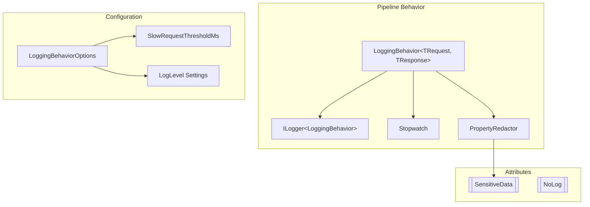
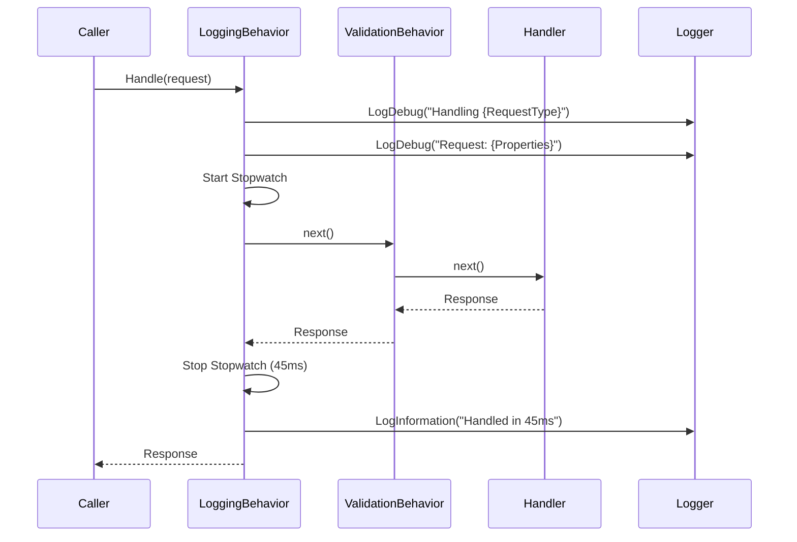
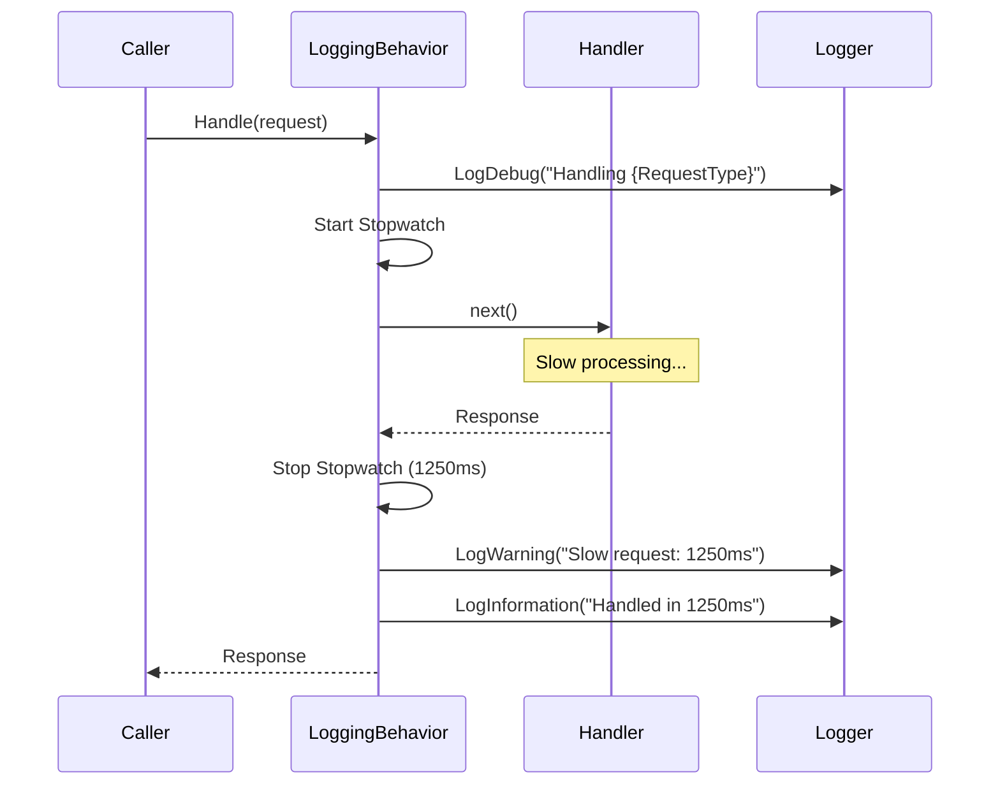
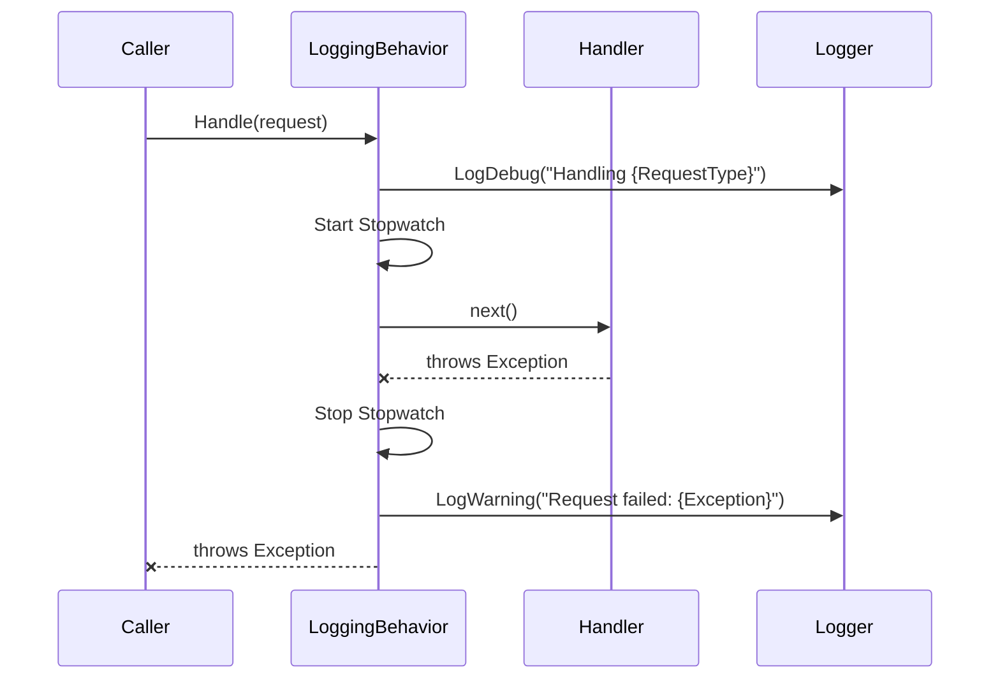

# LCS-01: Feature Design Composition

## 1. Metadata & Categorization

| Field                | Value                       | Description                                          |
| :------------------- | :-------------------------- | :--------------------------------------------------- |
| **Feature ID**       | `INF-007c`                  | Infrastructure - Logging Pipeline Behavior           |
| **Feature Name**     | Logging Pipeline Behavior   | Auto-log every command/query with timing.            |
| **Target Version**   | `v0.0.7c`                   | Core Infrastructure Layer.                           |
| **Module Scope**     | `Lexichord.Host`            | Pipeline behavior implementation.                    |
| **Swimlane**         | `Infrastructure`            | The Podium (Platform).                               |
| **License Tier**     | `Core`                      | Foundation (Required for all tiers).                 |
| **Feature Gate Key** | N/A                         | No runtime gating for logging infrastructure.        |
| **Author**           | System Architect            |                                                      |
| **Status**           | **Draft**                   | Pending approval.                                    |
| **Last Updated**     | 2026-01-26                  |                                                      |

---

## 2. Executive Summary

### 2.1 The Requirement

Every command and query in the system should be automatically logged without requiring explicit logging code in each handler:

- **Request Start** — Log when a request begins processing.
- **Request Completion** — Log when a request completes with duration.
- **Slow Requests** — Warn when requests exceed a threshold.
- **Failures** — Log exceptions with context.
- **Sensitive Data** — Redact sensitive properties from logs.

### 2.2 The Proposed Solution

We **SHALL** implement a `LoggingBehavior<TRequest, TResponse>` pipeline behavior that:

1. **Logs request start** with request type and relevant properties.
2. **Logs request completion** with duration and success status.
3. **Warns on slow requests** when execution exceeds configurable threshold.
4. **Redacts sensitive data** using `[SensitiveData]` attribute.
5. **Includes correlation ID** for distributed tracing.

### 2.3 Pipeline Position

```text
Request Flow:
┌─────────────────────────────────────────────────────────────────┐
│  Caller  →  LoggingBehavior  →  ValidationBehavior  →  Handler  │
│                   ↑                                       │     │
│                   └───────────── Response ────────────────┘     │
└─────────────────────────────────────────────────────────────────┘

LoggingBehavior is the OUTERMOST behavior:
- First to see the request (logs start)
- Last to see the response (logs completion + duration)
- Captures total pipeline time including validation
```

---

## 3. Architecture & Modular Strategy

### 3.1 Logging Behavior Architecture



### 3.2 File Structure After v0.0.7c

```text
src/Lexichord.Abstractions/
├── Attributes/
│   ├── SensitiveDataAttribute.cs   # NEW: Mark properties to redact
│   └── NoLogAttribute.cs           # NEW: Exclude properties from logging

src/Lexichord.Host/
├── Infrastructure/
│   ├── MediatRServiceExtensions.cs # MODIFIED: Register LoggingBehavior
│   ├── Behaviors/
│   │   └── LoggingBehavior.cs      # NEW: Pipeline behavior implementation
│   └── Options/
│       └── LoggingBehaviorOptions.cs # NEW: Configuration options
```

### 3.3 Log Output Example

```text
[DBG] [LoggingBehavior] Handling CreateDocumentCommand [CorrelationId: abc-123]
[DBG] [LoggingBehavior] Request: { Title = "My Document", UserId = "user-456", Content = "[REDACTED]" }
... handler executes ...
[INF] [LoggingBehavior] Handled CreateDocumentCommand in 45ms
```

```text
[DBG] [LoggingBehavior] Handling SlowQueryExample [CorrelationId: def-456]
... handler executes slowly ...
[WRN] [LoggingBehavior] Slow request: SlowQueryExample took 1250ms (threshold: 500ms)
[INF] [LoggingBehavior] Handled SlowQueryExample in 1250ms
```

---

## 4. Data Contracts

### 4.1 SensitiveDataAttribute

```csharp
namespace Lexichord.Abstractions.Attributes;

/// <summary>
/// Marks a property as containing sensitive data that should be redacted from logs.
/// </summary>
/// <remarks>
/// LOGIC: When the LoggingBehavior serializes request properties for logging,
/// properties marked with this attribute will have their values replaced with
/// "[REDACTED]" to prevent sensitive data from appearing in log files.
///
/// Use this attribute on properties containing:
/// - Passwords or secrets
/// - API keys or tokens
/// - Personal identifiable information (PII)
/// - Financial data
/// - Health information
///
/// Example:
/// <code>
/// public record CreateUserCommand : ICommand&lt;UserId&gt;
/// {
///     public string Username { get; init; }
///
///     [SensitiveData]
///     public string Password { get; init; }
///
///     [SensitiveData]
///     public string Email { get; init; }
/// }
/// </code>
/// </remarks>
[AttributeUsage(AttributeTargets.Property, AllowMultiple = false, Inherited = true)]
public sealed class SensitiveDataAttribute : Attribute
{
    /// <summary>
    /// The text to display in logs instead of the actual value.
    /// </summary>
    /// <remarks>
    /// LOGIC: Defaults to "[REDACTED]" but can be customized for context.
    /// Example: "[API_KEY]", "[PASSWORD]", "[EMAIL]"
    /// </remarks>
    public string RedactedText { get; }

    /// <summary>
    /// Initializes a new instance of the SensitiveDataAttribute.
    /// </summary>
    /// <param name="redactedText">The text to show in logs instead of the value.</param>
    public SensitiveDataAttribute(string redactedText = "[REDACTED]")
    {
        RedactedText = redactedText;
    }
}
```

### 4.2 NoLogAttribute

```csharp
namespace Lexichord.Abstractions.Attributes;

/// <summary>
/// Marks a property to be completely excluded from log output.
/// </summary>
/// <remarks>
/// LOGIC: Unlike SensitiveData which shows "[REDACTED]", NoLog completely
/// omits the property from the logged object. Use this for:
///
/// - Large binary data (file contents)
/// - Calculated/derived properties not useful for debugging
/// - Properties that would clutter logs without adding value
///
/// Example:
/// <code>
/// public record UploadFileCommand : ICommand
/// {
///     public string FileName { get; init; }
///
///     [NoLog]
///     public byte[] FileContents { get; init; }
/// }
/// </code>
/// </remarks>
[AttributeUsage(AttributeTargets.Property, AllowMultiple = false, Inherited = true)]
public sealed class NoLogAttribute : Attribute
{
}
```

### 4.3 LoggingBehaviorOptions

```csharp
namespace Lexichord.Host.Infrastructure.Options;

/// <summary>
/// Configuration options for the LoggingBehavior pipeline behavior.
/// </summary>
/// <remarks>
/// LOGIC: These options are bound from configuration (appsettings.json)
/// and can be adjusted per environment (e.g., lower threshold in production).
/// </remarks>
public sealed class LoggingBehaviorOptions
{
    /// <summary>
    /// Configuration section name in appsettings.json.
    /// </summary>
    public const string SectionName = "MediatR:Logging";

    /// <summary>
    /// Threshold in milliseconds for slow request warnings.
    /// </summary>
    /// <remarks>
    /// LOGIC: Requests exceeding this duration will generate a warning log.
    /// Default: 500ms. Consider lowering in production for tighter monitoring.
    /// </remarks>
    public int SlowRequestThresholdMs { get; set; } = 500;

    /// <summary>
    /// Whether to log request properties at start.
    /// </summary>
    /// <remarks>
    /// LOGIC: Enable in development for debugging, disable in production
    /// for performance and to reduce log volume.
    /// </remarks>
    public bool LogRequestProperties { get; set; } = true;

    /// <summary>
    /// Whether to log response properties on completion.
    /// </summary>
    /// <remarks>
    /// LOGIC: Can generate large logs for queries returning collections.
    /// Consider disabling in production.
    /// </remarks>
    public bool LogResponseProperties { get; set; } = false;

    /// <summary>
    /// Whether to include the full exception in failure logs.
    /// </summary>
    /// <remarks>
    /// LOGIC: Enable in development; in production, may want to log
    /// only exception message to avoid leaking stack traces.
    /// </remarks>
    public bool LogFullExceptions { get; set; } = true;

    /// <summary>
    /// Request types to exclude from logging (by full type name).
    /// </summary>
    /// <remarks>
    /// LOGIC: Some high-frequency or noise-generating requests might
    /// need to be excluded from logging.
    /// Example: ["HealthCheckQuery", "MetricsQuery"]
    /// </remarks>
    public List<string> ExcludedRequestTypes { get; set; } = new();
}
```

---

## 5. Implementation Logic

### 5.1 LoggingBehavior Implementation

```csharp
using MediatR;
using Microsoft.Extensions.Logging;
using Microsoft.Extensions.Options;
using System.Diagnostics;
using System.Reflection;
using System.Text.Json;
using Lexichord.Abstractions.Attributes;
using Lexichord.Host.Infrastructure.Options;

namespace Lexichord.Host.Infrastructure.Behaviors;

/// <summary>
/// Pipeline behavior that automatically logs all MediatR requests.
/// </summary>
/// <typeparam name="TRequest">The type of request being handled.</typeparam>
/// <typeparam name="TResponse">The type of response returned by the handler.</typeparam>
/// <remarks>
/// LOGIC: This behavior wraps all request handlers and provides:
///
/// 1. **Start Logging**: Logs when a request begins with type and properties.
/// 2. **Completion Logging**: Logs when a request completes with duration.
/// 3. **Slow Request Warning**: Warns when requests exceed configured threshold.
/// 4. **Exception Logging**: Logs failures with exception details.
/// 5. **Sensitive Data Redaction**: Hides properties marked with [SensitiveData].
///
/// Pipeline Position: OUTERMOST (first to see request, last to see response)
/// This ensures we capture the total request duration including all behaviors.
/// </remarks>
public sealed class LoggingBehavior<TRequest, TResponse> : IPipelineBehavior<TRequest, TResponse>
    where TRequest : notnull
{
    private readonly ILogger<LoggingBehavior<TRequest, TResponse>> _logger;
    private readonly LoggingBehaviorOptions _options;

    private static readonly string RequestTypeName = typeof(TRequest).Name;
    private static readonly JsonSerializerOptions JsonOptions = new()
    {
        WriteIndented = false,
        PropertyNamingPolicy = JsonNamingPolicy.CamelCase
    };

    /// <summary>
    /// Initializes a new instance of the LoggingBehavior.
    /// </summary>
    /// <param name="logger">The logger instance.</param>
    /// <param name="options">Configuration options.</param>
    public LoggingBehavior(
        ILogger<LoggingBehavior<TRequest, TResponse>> logger,
        IOptions<LoggingBehaviorOptions> options)
    {
        _logger = logger ?? throw new ArgumentNullException(nameof(logger));
        _options = options?.Value ?? new LoggingBehaviorOptions();
    }

    /// <summary>
    /// Handles the request by logging before and after handler execution.
    /// </summary>
    public async Task<TResponse> Handle(
        TRequest request,
        RequestHandlerDelegate<TResponse> next,
        CancellationToken cancellationToken)
    {
        // LOGIC: Check if this request type is excluded from logging
        if (_options.ExcludedRequestTypes.Contains(RequestTypeName))
        {
            return await next();
        }

        // Extract correlation ID if present
        var correlationId = ExtractCorrelationId(request);

        // Log request start
        LogRequestStart(request, correlationId);

        // Start timing
        var stopwatch = Stopwatch.StartNew();

        try
        {
            // Execute the pipeline (next behavior or handler)
            var response = await next();

            stopwatch.Stop();

            // Log successful completion
            LogRequestCompletion(correlationId, stopwatch.ElapsedMilliseconds, response);

            return response;
        }
        catch (Exception ex)
        {
            stopwatch.Stop();

            // Log failure
            LogRequestFailure(correlationId, stopwatch.ElapsedMilliseconds, ex);

            throw; // Re-throw to let exception propagate
        }
    }

    /// <summary>
    /// Logs the start of request handling.
    /// </summary>
    private void LogRequestStart(TRequest request, string? correlationId)
    {
        if (correlationId is not null)
        {
            _logger.LogDebug(
                "Handling {RequestType} [CorrelationId: {CorrelationId}]",
                RequestTypeName,
                correlationId);
        }
        else
        {
            _logger.LogDebug("Handling {RequestType}", RequestTypeName);
        }

        // Log request properties if enabled
        if (_options.LogRequestProperties && _logger.IsEnabled(LogLevel.Debug))
        {
            var redactedProperties = GetRedactedProperties(request);
            _logger.LogDebug(
                "Request: {RequestProperties}",
                redactedProperties);
        }
    }

    /// <summary>
    /// Logs successful request completion.
    /// </summary>
    private void LogRequestCompletion(
        string? correlationId,
        long elapsedMs,
        TResponse? response)
    {
        // Check for slow request
        if (elapsedMs > _options.SlowRequestThresholdMs)
        {
            _logger.LogWarning(
                "Slow request: {RequestType} took {ElapsedMs}ms (threshold: {ThresholdMs}ms)",
                RequestTypeName,
                elapsedMs,
                _options.SlowRequestThresholdMs);
        }

        // Log completion
        _logger.LogInformation(
            "Handled {RequestType} in {ElapsedMs}ms",
            RequestTypeName,
            elapsedMs);

        // Log response if enabled
        if (_options.LogResponseProperties &&
            response is not null &&
            _logger.IsEnabled(LogLevel.Debug))
        {
            var redactedResponse = GetRedactedProperties(response);
            _logger.LogDebug(
                "Response: {ResponseProperties}",
                redactedResponse);
        }
    }

    /// <summary>
    /// Logs request failure.
    /// </summary>
    private void LogRequestFailure(
        string? correlationId,
        long elapsedMs,
        Exception exception)
    {
        if (_options.LogFullExceptions)
        {
            _logger.LogWarning(
                exception,
                "Request {RequestType} failed after {ElapsedMs}ms: {ExceptionMessage}",
                RequestTypeName,
                elapsedMs,
                exception.Message);
        }
        else
        {
            _logger.LogWarning(
                "Request {RequestType} failed after {ElapsedMs}ms: {ExceptionType} - {ExceptionMessage}",
                RequestTypeName,
                elapsedMs,
                exception.GetType().Name,
                exception.Message);
        }
    }

    /// <summary>
    /// Extracts correlation ID from the request if present.
    /// </summary>
    private static string? ExtractCorrelationId(TRequest request)
    {
        // LOGIC: Look for common correlation ID property names
        var type = typeof(TRequest);
        var property = type.GetProperty("CorrelationId") ??
                       type.GetProperty("RequestId") ??
                       type.GetProperty("TraceId");

        return property?.GetValue(request)?.ToString();
    }

    /// <summary>
    /// Creates a dictionary of properties with sensitive values redacted.
    /// </summary>
    private static string GetRedactedProperties<T>(T obj)
    {
        if (obj is null)
            return "null";

        try
        {
            var type = obj.GetType();
            var properties = type.GetProperties(BindingFlags.Public | BindingFlags.Instance);
            var result = new Dictionary<string, object?>();

            foreach (var property in properties)
            {
                // Skip properties marked with [NoLog]
                if (property.GetCustomAttribute<NoLogAttribute>() is not null)
                    continue;

                var value = property.GetValue(obj);

                // Redact properties marked with [SensitiveData]
                var sensitiveAttr = property.GetCustomAttribute<SensitiveDataAttribute>();
                if (sensitiveAttr is not null)
                {
                    result[property.Name] = sensitiveAttr.RedactedText;
                    continue;
                }

                // Handle common sensitive property names even without attribute
                if (IsPotentiallySensitiveName(property.Name))
                {
                    result[property.Name] = "[REDACTED]";
                    continue;
                }

                // Truncate long strings
                if (value is string stringValue && stringValue.Length > 100)
                {
                    result[property.Name] = stringValue[..100] + "...";
                    continue;
                }

                result[property.Name] = value;
            }

            return JsonSerializer.Serialize(result, JsonOptions);
        }
        catch
        {
            return "[Serialization Failed]";
        }
    }

    /// <summary>
    /// Checks if a property name suggests sensitive data.
    /// </summary>
    private static bool IsPotentiallySensitiveName(string propertyName)
    {
        var lowerName = propertyName.ToLowerInvariant();
        return lowerName.Contains("password") ||
               lowerName.Contains("secret") ||
               lowerName.Contains("token") ||
               lowerName.Contains("apikey") ||
               lowerName.Contains("api_key") ||
               lowerName.Contains("credential") ||
               lowerName.Contains("connectionstring") ||
               lowerName.Contains("privatekey");
    }
}
```

### 5.2 Updated MediatRServiceExtensions

```csharp
using MediatR;
using Microsoft.Extensions.DependencyInjection;
using System.Reflection;
using Lexichord.Host.Infrastructure.Behaviors;
using Lexichord.Host.Infrastructure.Options;

namespace Lexichord.Host.Infrastructure;

public static class MediatRServiceExtensions
{
    public static IServiceCollection AddMediatRServices(
        this IServiceCollection services,
        params Assembly[] moduleAssemblies)
    {
        // Configure logging behavior options from configuration
        services.AddOptions<LoggingBehaviorOptions>()
            .BindConfiguration(LoggingBehaviorOptions.SectionName);

        var assembliesToScan = new List<Assembly>
        {
            typeof(MediatRServiceExtensions).Assembly
        };
        assembliesToScan.AddRange(moduleAssemblies);

        services.AddMediatR(configuration =>
        {
            configuration.RegisterServicesFromAssemblies(assembliesToScan.ToArray());

            // LOGIC: Pipeline behaviors execute in registration order
            // LoggingBehavior is FIRST (outermost) to capture total duration
            configuration.AddBehavior(typeof(IPipelineBehavior<,>), typeof(LoggingBehavior<,>));

            // ValidationBehavior will be added in v0.0.7d
            // configuration.AddBehavior(typeof(IPipelineBehavior<,>), typeof(ValidationBehavior<,>));
        });

        return services;
    }
}
```

### 5.3 Configuration (appsettings.json)

```json
{
  "MediatR": {
    "Logging": {
      "SlowRequestThresholdMs": 500,
      "LogRequestProperties": true,
      "LogResponseProperties": false,
      "LogFullExceptions": true,
      "ExcludedRequestTypes": []
    }
  }
}
```

---

## 6. Sequence Diagrams

### 6.1 Successful Request Flow



### 6.2 Slow Request Flow



### 6.3 Failed Request Flow



---

## 7. Use Cases & User Stories

### 7.1 User Stories

| ID    | Role      | Story                                                                              | Acceptance Criteria                              |
| :---- | :-------- | :--------------------------------------------------------------------------------- | :----------------------------------------------- |
| US-01 | Developer | As a developer, I want all requests logged automatically.                          | Logs appear without explicit logging code.       |
| US-02 | Developer | As a developer, I want to see how long requests take.                              | Duration appears in completion log.              |
| US-03 | DevOps    | As a DevOps engineer, I want alerts on slow requests.                              | Warning logs for requests > threshold.           |
| US-04 | Security  | As a security officer, I want sensitive data redacted.                             | Passwords show as [REDACTED] in logs.            |
| US-05 | Developer | As a developer, I want to trace requests via correlation ID.                       | Correlation ID appears in log entries.           |

### 7.2 Use Cases

#### UC-01: Automatic Request Logging

**Preconditions:**

- LoggingBehavior is registered in the pipeline.
- A command handler exists.

**Flow:**

1. Caller sends a command via IMediator.Send().
2. LoggingBehavior.Handle() is invoked first.
3. Behavior logs request start with type name.
4. Behavior starts stopwatch.
5. Behavior calls next() to continue pipeline.
6. Handler executes and returns.
7. Behavior stops stopwatch and logs completion.
8. Response returns to caller.

**Postconditions:**

- Two log entries exist: start and completion.
- Duration is recorded in completion log.

---

#### UC-02: Sensitive Data Protection

**Preconditions:**

- LoggingBehavior is active.
- Request has properties marked with [SensitiveData].

**Flow:**

1. Caller sends CreateUserCommand with Password property.
2. LoggingBehavior serializes request for logging.
3. GetRedactedProperties() checks each property.
4. Password property has [SensitiveData] attribute.
5. Value is replaced with "[REDACTED]".
6. Redacted properties are logged.

**Postconditions:**

- Log shows: `{ "username": "john", "password": "[REDACTED]" }`.
- Actual password never appears in logs.

---

## 8. Observability & Logging

### 8.1 Log Message Templates

| Level   | Template                                                                 |
| :------ | :----------------------------------------------------------------------- |
| Debug   | `Handling {RequestType} [CorrelationId: {CorrelationId}]`                |
| Debug   | `Request: {RequestProperties}`                                           |
| Info    | `Handled {RequestType} in {ElapsedMs}ms`                                 |
| Warning | `Slow request: {RequestType} took {ElapsedMs}ms (threshold: {ThresholdMs}ms)` |
| Warning | `Request {RequestType} failed after {ElapsedMs}ms: {ExceptionMessage}`   |
| Debug   | `Response: {ResponseProperties}`                                         |

### 8.2 Structured Logging Properties

```csharp
// Properties available for structured logging queries
{
    "RequestType": "CreateDocumentCommand",
    "CorrelationId": "abc-123-def-456",
    "ElapsedMs": 45,
    "ThresholdMs": 500,
    "RequestProperties": { "title": "My Doc", "content": "[truncated]" },
    "ExceptionType": "ValidationException",
    "ExceptionMessage": "Title is required"
}
```

---

## 9. Unit Testing Requirements

### 9.1 LoggingBehavior Tests

```csharp
[Trait("Category", "Unit")]
public class LoggingBehaviorTests
{
    [Fact]
    public async Task Handle_LogsRequestStart()
    {
        // Arrange
        var logger = new FakeLogger<LoggingBehavior<TestCommand, string>>();
        var options = Options.Create(new LoggingBehaviorOptions());
        var behavior = new LoggingBehavior<TestCommand, string>(logger, options);
        var request = new TestCommand { Value = "test" };

        // Act
        await behavior.Handle(request, () => Task.FromResult("result"), CancellationToken.None);

        // Assert
        logger.Logs.Should().Contain(log =>
            log.Level == LogLevel.Debug &&
            log.Message.Contains("Handling") &&
            log.Message.Contains("TestCommand"));
    }

    [Fact]
    public async Task Handle_LogsRequestCompletion()
    {
        // Arrange
        var logger = new FakeLogger<LoggingBehavior<TestCommand, string>>();
        var options = Options.Create(new LoggingBehaviorOptions());
        var behavior = new LoggingBehavior<TestCommand, string>(logger, options);
        var request = new TestCommand { Value = "test" };

        // Act
        await behavior.Handle(request, () => Task.FromResult("result"), CancellationToken.None);

        // Assert
        logger.Logs.Should().Contain(log =>
            log.Level == LogLevel.Information &&
            log.Message.Contains("Handled") &&
            log.Message.Contains("ms"));
    }

    [Fact]
    public async Task Handle_WarnsOnSlowRequest()
    {
        // Arrange
        var logger = new FakeLogger<LoggingBehavior<TestCommand, string>>();
        var options = Options.Create(new LoggingBehaviorOptions { SlowRequestThresholdMs = 10 });
        var behavior = new LoggingBehavior<TestCommand, string>(logger, options);
        var request = new TestCommand { Value = "test" };

        // Act
        await behavior.Handle(request, async () =>
        {
            await Task.Delay(50);
            return "result";
        }, CancellationToken.None);

        // Assert
        logger.Logs.Should().Contain(log =>
            log.Level == LogLevel.Warning &&
            log.Message.Contains("Slow request"));
    }

    [Fact]
    public async Task Handle_LogsExceptionOnFailure()
    {
        // Arrange
        var logger = new FakeLogger<LoggingBehavior<TestCommand, string>>();
        var options = Options.Create(new LoggingBehaviorOptions());
        var behavior = new LoggingBehavior<TestCommand, string>(logger, options);
        var request = new TestCommand { Value = "test" };

        // Act & Assert
        await Assert.ThrowsAsync<InvalidOperationException>(async () =>
            await behavior.Handle(request, () =>
                throw new InvalidOperationException("Test error"),
                CancellationToken.None));

        logger.Logs.Should().Contain(log =>
            log.Level == LogLevel.Warning &&
            log.Message.Contains("failed") &&
            log.Message.Contains("Test error"));
    }
}
```

### 9.2 Sensitive Data Redaction Tests

```csharp
[Trait("Category", "Unit")]
public class SensitiveDataRedactionTests
{
    [Fact]
    public async Task Handle_RedactsSensitiveProperties()
    {
        // Arrange
        var logger = new FakeLogger<LoggingBehavior<SensitiveCommand, string>>();
        var options = Options.Create(new LoggingBehaviorOptions { LogRequestProperties = true });
        var behavior = new LoggingBehavior<SensitiveCommand, string>(logger, options);
        var request = new SensitiveCommand
        {
            Username = "john",
            Password = "secret123"
        };

        // Act
        await behavior.Handle(request, () => Task.FromResult("result"), CancellationToken.None);

        // Assert
        var requestLog = logger.Logs.First(l => l.Message.Contains("Request:"));
        requestLog.Message.Should().Contain("john");
        requestLog.Message.Should().NotContain("secret123");
        requestLog.Message.Should().Contain("[REDACTED]");
    }

    [Fact]
    public async Task Handle_RedactsPropertiesWithSensitiveNames()
    {
        // Arrange
        var logger = new FakeLogger<LoggingBehavior<AutoRedactCommand, string>>();
        var options = Options.Create(new LoggingBehaviorOptions { LogRequestProperties = true });
        var behavior = new LoggingBehavior<AutoRedactCommand, string>(logger, options);
        var request = new AutoRedactCommand
        {
            Name = "test",
            ApiKey = "sk-1234567890"
        };

        // Act
        await behavior.Handle(request, () => Task.FromResult("result"), CancellationToken.None);

        // Assert
        var requestLog = logger.Logs.First(l => l.Message.Contains("Request:"));
        requestLog.Message.Should().Contain("test");
        requestLog.Message.Should().NotContain("sk-1234567890");
    }
}

// Test commands
public record SensitiveCommand : ICommand<string>
{
    public string Username { get; init; } = string.Empty;

    [SensitiveData]
    public string Password { get; init; } = string.Empty;
}

public record AutoRedactCommand : ICommand<string>
{
    public string Name { get; init; } = string.Empty;
    public string ApiKey { get; init; } = string.Empty; // Auto-redacted by name
}
```

---

## 10. Security & Safety

### 10.1 Sensitive Data Protection

> [!IMPORTANT]
> The LoggingBehavior MUST protect sensitive data:
>
> 1. Properties with `[SensitiveData]` are redacted.
> 2. Property names containing "password", "secret", "token", etc. are auto-redacted.
> 3. Long strings are truncated to prevent log bloat.

### 10.2 Log Security Considerations

- **Log Storage**: Logs should be stored securely with appropriate access controls.
- **Log Retention**: Implement log rotation and retention policies.
- **Audit**: Consider logging who accessed sensitive operations.

---

## 11. Risks & Mitigations

| Risk                                    | Impact | Mitigation                                                         |
| :-------------------------------------- | :----- | :----------------------------------------------------------------- |
| Sensitive data logged                   | High   | [SensitiveData] attribute + auto-detection by property name.       |
| Logging impacts performance             | Medium | Lazy property evaluation; configurable verbosity.                  |
| Log volume too high                     | Low    | ExcludedRequestTypes config; environment-specific settings.        |
| Serialization failures                  | Low    | Catch and log "[Serialization Failed]" instead of crashing.        |
| Stopwatch inaccuracy                    | Low    | Use Stopwatch.GetTimestamp() for high-resolution timing if needed. |

---

## 12. Acceptance Criteria (QA)

| #   | Category        | Criterion                                                               |
| :-- | :-------------- | :---------------------------------------------------------------------- |
| 1   | **[Attribute]** | `[SensitiveData]` attribute exists in Abstractions.                     |
| 2   | **[Attribute]** | `[NoLog]` attribute exists in Abstractions.                             |
| 3   | **[Behavior]**  | LoggingBehavior is registered in the MediatR pipeline.                  |
| 4   | **[Logging]**   | All requests generate start and completion log entries.                 |
| 5   | **[Logging]**   | Completion logs include duration in milliseconds.                       |
| 6   | **[Warning]**   | Slow requests (>threshold) generate warning logs.                       |
| 7   | **[Redact]**    | Properties with [SensitiveData] show "[REDACTED]" in logs.              |
| 8   | **[Redact]**    | Properties with sensitive names are auto-redacted.                      |
| 9   | **[NoLog]**     | Properties with [NoLog] are completely omitted from logs.               |
| 10  | **[Config]**    | Threshold is configurable via appsettings.json.                         |
| 11  | **[Failure]**   | Exceptions are logged with context before re-throwing.                  |
| 12  | **[Order]**     | LoggingBehavior executes before ValidationBehavior.                     |

---

## 13. Verification Commands

```bash
# 1. Verify attribute files exist
ls src/Lexichord.Abstractions/Attributes/
# Expected: SensitiveDataAttribute.cs, NoLogAttribute.cs

# 2. Verify behavior implementation
grep -l "LoggingBehavior" src/Lexichord.Host/Infrastructure/Behaviors/

# 3. Verify options configuration
grep -l "LoggingBehaviorOptions" src/Lexichord.Host/Infrastructure/Options/

# 4. Build solution
dotnet build --configuration Release

# 5. Run unit tests
dotnet test --filter "FullyQualifiedName~LoggingBehavior"

# 6. Run application and verify logs appear
dotnet run --project src/Lexichord.Host
# Trigger a command and check console/log output
```

---

## 14. Deliverable Checklist

| Step | Description                                                             | Status |
| :--- | :---------------------------------------------------------------------- | :----- |
| 1    | `Attributes/` directory created in Abstractions.                        | [ ]    |
| 2    | `SensitiveDataAttribute.cs` created with RedactedText property.         | [ ]    |
| 3    | `NoLogAttribute.cs` created.                                            | [ ]    |
| 4    | `Behaviors/` directory created in Host/Infrastructure.                  | [ ]    |
| 5    | `LoggingBehavior.cs` created with full implementation.                  | [ ]    |
| 6    | `Options/` directory created in Host/Infrastructure.                    | [ ]    |
| 7    | `LoggingBehaviorOptions.cs` created with all settings.                  | [ ]    |
| 8    | MediatRServiceExtensions updated to register LoggingBehavior.           | [ ]    |
| 9    | appsettings.json updated with MediatR:Logging section.                  | [ ]    |
| 10   | Unit tests for logging behavior pass.                                   | [ ]    |
| 11   | Unit tests for sensitive data redaction pass.                           | [ ]    |
| 12   | Integration test verifies logs appear for real requests.                | [ ]    |
